# <a name="azure-ad-authentication-access-and-database-level-firewall-rules"></a>Authentification Azure AD, accès et règles de pare-feu au niveau de la base de données
Dans ce didacticiel, vous allez apprendre à utiliser SQL Server Management Studio pour travailler avec l’authentification Azure Active Directory, les connexions, les utilisateurs et les rôles de base de données qui accordent accès et autorisations aux bases de données et aux serveurs Azure SQL Database. Vous allez découvrir comment effectuer les actions suivantes :

- Afficher les autorisations de l’utilisateur dans la base de données master et dans les bases de données utilisateur
- Créer des connexions et des utilisateurs en fonction de l’authentification Azure Active Directory
- Accorder des autorisations au niveau du serveur et de la base de données spécifiques aux utilisateurs
- Se connecter à une base de données utilisateur en tant qu’utilisateur non administrateur
- Créer des règles de pare-feu au niveau de la base de données pour les utilisateurs de la base de données
- Créer des règles de pare-feu au niveau du serveur pour les administrateurs de serveur

**Durée estimée** : ce didacticiel vous prendra environ 45 minutes (à condition que vous remplissiez déjà les conditions préalables).

## <a name="prerequisites"></a>Composants requis

* Vous avez besoin d’un compte Azure. Vous pouvez [ouvrir un compte Azure gratuit](https://azure.microsoft.com/free/) ou [activer les avantages de l’abonnement à Visual Studio](https://azure.microsoft.com/pricing/member-offers/msdn-benefits/). 

* Vous devez être en mesure de vous connecter au portail Azure à l’aide d’un compte qui est membre du propriétaire de l’abonnement ou du rôle du collaborateur. Pour plus d’informations sur l’utilisation du contrôle d’accès en fonction du rôle (RBAC), consultez [Prise en main de la gestion des accès dans le portail Azure](../active-directory/role-based-access-control-what-is.md).

* Vous avez exécuté le didacticiel [Prise en main des serveurs Azure SQL Database, des bases de données et des règles de pare-feu à l’aide du portail Azure et de SQL Server Management Studio](sql-database-get-started.md) ou la [version PowerShell](sql-database-get-started-powershell.md) de ce didacticiel. Dans le cas contraire, suivez ce didacticiel préalable ou exécutez le script PowerShell à la fin de la [version PowerShell](sql-database-get-started-powershell.md) de ce didacticiel avant de continuer.

   > [!NOTE]
   > Vous n’êtes pas obligé de suivre le didacticiel associé à l’authentification SQL Server, à savoir : [Authentification SQL, connexions et comptes utilisateur, rôles de base de données, autorisations, règles de pare-feu de niveau serveur et règles de pare-feu de niveau base de données](sql-database-control-access-sql-authentication-get-started.md). Toutefois, certains concepts abordés dans ce didacticiel ne sont pas mentionnés ici. Les procédures décrites dans ce didacticiel, qui porte sur les pare-feu de niveau serveur et base de données, ne sont pas obligatoires si vous avez effectué ce didacticiel connexe sur les mêmes machines (avec la même adresse IP). C’est pour cette raison qu’ils sont indiqués comme étant facultatifs. En outre, les captures d’écran de ce didacticiel supposent que vous avez effectué ce didacticiel connexe. 
   >

* Vous avez créé et rempli un annuaire Azure Active Directory. Pour plus d’informations, consultez [Intégration des identités locales avec Azure Active Directory](../active-directory/active-directory-aadconnect.md), [Ajout de votre propre nom de domaine à Azure AD](../active-directory/active-directory-add-domain.md), [Microsoft Azure prend désormais en charge la fédération avec Windows Server Active Directory](https://azure.microsoft.com/blog/2012/11/28/windows-azure-now-supports-federation-with-windows-server-active-directory/), [Administration de votre annuaire Azure AD](https://msdn.microsoft.com/library/azure/hh967611.aspx), [Gestion d’Azure AD à l’aide de Windows PowerShell](https://msdn.microsoft.com/library/azure/jj151815.aspx) et [Ports et protocoles nécessaires à l’identité hybride](../active-directory/active-directory-aadconnect-ports.md).

> [!NOTE]
> Ce didacticiel vous permet de vous familiariser avec le contenu des rubriques suivantes : [Accès à la base de données SQL et contrôle](sql-database-control-access.md), [Connexions, utilisateurs et rôles de base de données](sql-database-manage-logins.md), [Principaux](https://msdn.microsoft.com/library/ms181127.aspx), [Rôles de base de données](https://msdn.microsoft.com/library/ms189121.aspx), [Règles de pare-feu de base de données SQL](sql-database-firewall-configure.md) et [Authentification Azure Active Directory](sql-database-aad-authentication.md). 
>  

## <a name="sign-in-to-the-azure-portal-using-your-azure-account"></a>Se connecter au portail Azure avec un compte Azure
À l’aide de votre [abonnement existant](https://account.windowsazure.com/Home/Index), suivez ces étapes pour vous connecter au portail Azure.

1. Ouvrez votre navigateur préféré et connectez-vous au [portail Azure](https://portal.azure.com/).
2. Connectez-vous au [portail Azure](https://portal.azure.com/).
3. Dans la page **de connexion** , entrez les informations d’identification de votre abonnement.
   
   


<a name="create-logical-server-bk"></a>

## <a name="provision-an-azure-active-directory-admin-for-your-sql-logical-server"></a>Configurer un administrateur Azure Active Directory pour votre serveur SQL logique

Dans cette section du didacticiel, vous pouvez afficher des informations sur la configuration de la sécurité sur votre serveur logique dans le portail Azure.

1. Ouvrez le panneau **SQL Server** de votre serveur logique et affichez les informations de la page **Vue d’ensemble**. Vous pouvez voir qu’aucun administrateur Azure Active Directory n’a été configuré.

   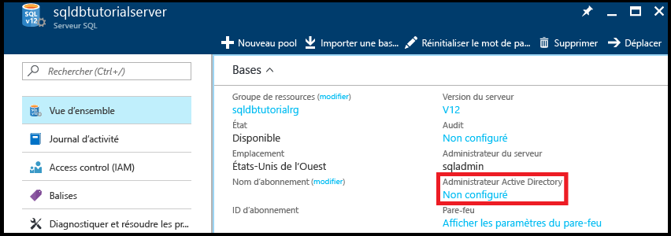

2. Cliquez sur l’option **Non configuré** du volet **Essentials** pour ouvrir le panneau **Administrateur Active Directory**.

   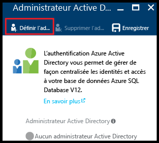

3. Cliquez sur **Définir l’administrateur** pour ouvrir le panneau **Ajouter un administrateur**, puis sélectionnez le compte d’utilisateur ou de groupe Active Directory devant jouer le rôle d’administrateur Active Directory pour votre serveur.

   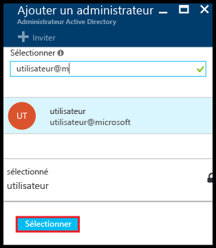

4. Cliquez sur **Sélectionner**, puis sur **Enregistrer**.

   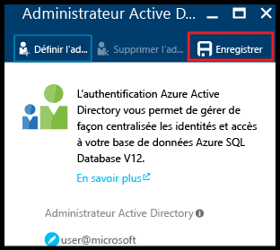

> [!NOTE]
> Pour passer en revue les informations de connexion à ce serveur, accédez à [Gérer les serveurs](sql-database-manage-servers-portal.md). Pour cette série de didacticiels, le nom de serveur complet est « sqldbtutorialserver.database.windows.net ».
>

## <a name="connect-to-sql-server-using-sql-server-management-studio-ssms"></a>Se connecter au serveur SQL Server à l’aide de SQL Server Management Studio (SSMS)

1. Si ce n’est déjà fait, téléchargez et installez la dernière version de SSMS via [Téléchargement de SQL Server Management Studio](https://msdn.microsoft.com/library/mt238290.aspx). Pour vous permettre de rester à jour, la dernière version de SSMS vous envoie une invite lorsqu’une nouvelle version est disponible au téléchargement.

2. Une fois l’installation terminée, saisissez **Microsoft SQL Server Management Studio** dans la zone de recherche de Windows, puis cliquez sur **Entrée** pour ouvrir SSMS.

   

3. Dans la boîte de dialogue **Se connecter au serveur**, sélectionnez l’une des méthodes d’authentification Active Directory et fournissez les informations d’authentification adéquates. Pour savoir comment choisir une méthode d’authentification, voir [Authentification Azure Active Directory](sql-database-aad-authentication.md) et [Prise en charge de SSMS pour Azure AD MFA avec la base de données SQL et SQL Data Warehouse](sql-database-ssms-mfa-authentication.md).

   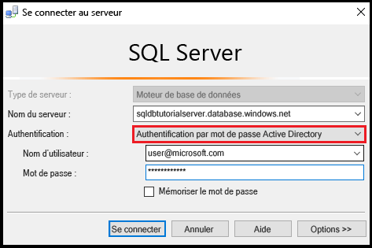

4. Saisissez les informations nécessaires pour vous connecter à votre serveur SQL Server à l’aide de l’authentification SQL Server et du compte d’administrateur de serveur.

5. Cliquez sur **Connecter**.

   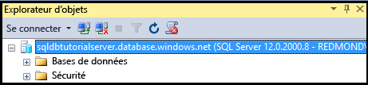

## <a name="view-the-server-admin-account-and-its-permissions"></a>Afficher le compte d’administrateur de serveur et ses autorisations 
Dans cette section du didacticiel, vous pouvez afficher des informations sur le compte d’administrateur de serveur, ainsi que ses autorisations dans la base de données master et dans les bases de données utilisateur.

1. Dans l’Explorateur d’objets, développez **Bases de données**, **Bases de données système**, **Master**, **Sécurité**, puis **Utilisateurs**. Vous pouvez voir qu’un compte d’utilisateur a été créé dans la base de données master pour l’administrateur Active Directory. Vous pouvez également constater qu’aucune connexion n’a été créée pour le compte d’utilisateur administrateur Active Directory.

   

   > [!NOTE]
   > Pour en savoir plus sur les autres comptes d’utilisateur qui s’affichent, voir [Principaux](https://msdn.microsoft.com/library/ms181127.aspx).
   >

2. Dans l’Explorateur d’objets, cliquez avec le bouton droit sur **Master**, puis cliquez sur **Nouvelle requête** pour ouvrir une fenêtre de requête connectée à la base de données master.
3. Dans la fenêtre de requête, exécutez la requête suivante pour renvoyer des informations relatives à l’utilisateur exécutant la requête. Vous pouvez voir que la valeur user@microsoft.com est renvoyée pour le compte d’utilisateur exécutant cette requête (nous obtiendrons un résultat différent lorsque nous interrogerons une base de données utilisateur plus loin dans cette procédure).

   ```
   SELECT USER;
   ```

   

4. Dans la fenêtre de requête, exécutez la requête suivante pour renvoyer des informations relatives aux autorisations de l’administrateur Active Directory. Vous pouvez voir que l’administrateur Active Directory dispose d’autorisations pour se connecter à la base de données master, créer des connexions et des utilisateurs, sélectionner des informations à partir de la table sys.sql_logins et ajouter des utilisateurs aux rôles de base de données dbmanager et dbcreator. Ces autorisations s’ajoutent à celles qui sont accordées au rôle public depuis lequel tous les utilisateurs héritent des autorisations (telles que les autorisations permettant de sélectionner des informations à partir de certaines tables). Pour en savoir plus, voir [Autorisations](https://msdn.microsoft.com/library/ms191291.aspx).

   ```
   SELECT prm.permission_name
      , prm.class_desc
      , prm.state_desc
      , p2.name as 'Database role'
      , p3.name as 'Additional database role' 
   FROM sys.database_principals p
   JOIN sys.database_permissions prm
      ON p.principal_id = prm.grantee_principal_id
      LEFT JOIN sys.database_principals p2
      ON prm.major_id = p2.principal_id
      LEFT JOIN sys.database_role_members r
      ON p.principal_id = r.member_principal_id
      LEFT JOIN sys.database_principals p3
      ON r.role_principal_id = p3.principal_id
   WHERE p.name = 'user@microsoft.com';
   ```

   

6. Dans l’Explorateur d’objets, développez **blankdb**, **Sécurité**, puis **Utilisateurs**. Vous pouvez voir qu’il n’existe aucun compte d’utilisateur appelé user@microsoft.com dans cette base de données.

   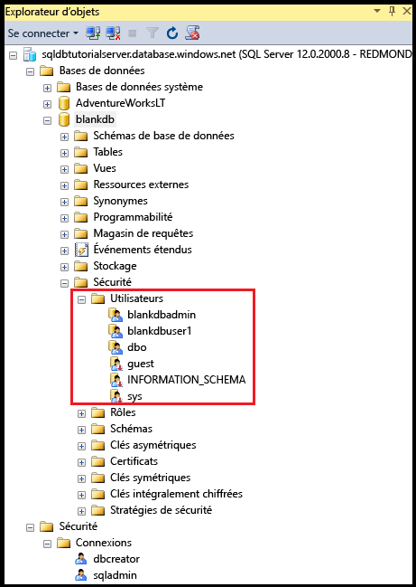

7. Dans l’Explorateur d’objets, cliquez avec le bouton droit sur **blankdb**, puis cliquez sur **Nouvelle requête**.

8. Dans la fenêtre de requête, exécutez la requête suivante pour renvoyer des informations relatives à l’utilisateur exécutant la requête. Notez que dbo est renvoyée pour le compte d’utilisateur qui exécute cette requête (par défaut, la connexion d’administrateur serveur est mappée au compte d’utilisateur dbo dans chaque base de données utilisateur).

   ```
   SELECT USER;
   ```

   

9. Dans la fenêtre de requête, exécutez la requête suivante pour renvoyer des informations relatives aux autorisations de l’utilisateur dbo. Vous pouvez voir que dbo est membre du rôle public, mais également du rôle de base de données fixe db_owner. Pour en savoir plus, voir [Rôles au niveau de la base de données](https://msdn.microsoft.com/library/ms189121.aspx).

   ```
   SELECT prm.permission_name
      , prm.class_desc
      , prm.state_desc
      , p2.name as 'Database role'
      , p3.name as 'Additional database role' 
   FROM sys.database_principals AS p
   JOIN sys.database_permissions AS prm
      ON p.principal_id = prm.grantee_principal_id
      LEFT JOIN sys.database_principals AS p2
      ON prm.major_id = p2.principal_id
      LEFT JOIN sys.database_role_members r
      ON p.principal_id = r.member_principal_id
      LEFT JOIN sys.database_principals AS p3
      ON r.role_principal_id = p3.principal_id
   WHERE p.name = 'dbo';
   ```

   

10. Le cas échéant, répétez les trois étapes précédentes pour la base de données utilisateur AdventureWorksLT.

## <a name="create-a-new-user-in-the-adventureworkslt-database-with-select-permissions"></a>Créer un utilisateur dans la base de données AdventureWorksLT avec des autorisations SELECT

Dans cette section du didacticiel, vous allez créer un compte d’utilisateur dans la base de données AdventureWorksLT, en fonction du nom principal d’un utilisateur Azure AD ou du nom d’affichage d’un groupe Azure AD, puis tester les autorisations de cet utilisateur en tant que membre du rôle public, accorder à cet utilisateur des autorisations SELECT, et tester à nouveau les autorisations de cet utilisateur.

> [!NOTE]
> Les utilisateurs au niveau de la base de données ([utilisateurs contenus](https://msdn.microsoft.com/library/ff929188.aspx)) augmentent la portabilité de votre base de données. Nous explorerons cette fonctionnalité dans d’autres didacticiels.
>

1. Dans l’Explorateur d’objets, cliquez avec le bouton droit sur **AdventureWorksLT**, puis cliquez sur **Nouvelle requête** pour ouvrir une fenêtre de requête connectée à la base de données AdventureWorksLT.
2. Exécutez l’instruction suivante pour créer, dans la base de données AdventureWorksLT, un compte d’utilisateur destiné à l’utilisateur aaduser1 dans le domaine Microsoft.

   ```
   CREATE USER [aaduser1@microsoft.com]
   FROM EXTERNAL PROVIDER;
   ```
   

3. Dans la fenêtre de requête, exécutez la requête suivante pour renvoyer des informations relatives aux autorisations de l’utilisateur user1. Vous pouvez voir que les seules autorisations dont dispose l’utilisateur user1 sont les autorisations héritées du rôle public.

   ```
   SELECT prm.permission_name
      , prm.class_desc
      , prm.state_desc
      , p2.name as 'Database role'
      , p3.name as 'Additional database role' 
   FROM sys.database_principals AS p
   JOIN sys.database_permissions AS prm
      ON p.principal_id = prm.grantee_principal_id
      LEFT JOIN sys.database_principals AS p2
      ON prm.major_id = p2.principal_id
      LEFT JOIN sys.database_role_members r
      ON p.principal_id = r.member_principal_id
      LEFT JOIN sys.database_principals AS p3
      ON r.role_principal_id = p3.principal_id
   WHERE p.name = 'aaduser1@microsoft.com';
   ```

   

4. Exécutez les requêtes suivantes pour tenter d’interroger une table dans la base de données AdventureWorksLT en tant qu’utilisateur user1.

   ```
   EXECUTE AS USER = 'aaduser1@microsoft.com';  
   SELECT * FROM [SalesLT].[ProductCategory];
   REVERT;
   ```

   

5. Exécutez l’instruction suivante pour accorder à l’utilisateur user1 des autorisations SELECT sur la table ProductCategory dans le schéma SalesLT.

   ```
   GRANT SELECT ON OBJECT::[SalesLT].[ProductCategory] to [aaduser1@microsoft.com];
   ```

   

6. Exécutez les requêtes suivantes pour tenter d’interroger une table dans la base de données AdventureWorksLT en tant qu’utilisateur user1.

   ```
   EXECUTE AS USER = 'aaduser1@microsoft.com';  
   SELECT * FROM [SalesLT].[ProductCategory];
   REVERT;
   ```

   

## <a name="create-a-database-level-firewall-rule-for-adventureworkslt-database-users"></a>Créer une règle de pare-feu au niveau de la base de données pour des utilisateurs de la base de données AdventureWorksLT

> [!NOTE]
> Vous n’avez pas besoin de suivre cette procédure si vous avez suivi la procédure équivalente dans le didacticiel connexe pour l’authentification SQL Server, [Authentification et autorisation SQL](sql-database-control-access-sql-authentication-get-started.md) sur la même machine et avec la même adresse IP.
>

Dans cette section du didacticiel, vous tenterez de vous connecter à partir d’un ordinateur avec une adresse IP différente, en utilisant le nouveau compte d’utilisateur, puis de créer une règle de pare-feu au niveau de la base de données en tant qu’administrateur du serveur, puis de vous connecter à l’aide de cette nouvelle règle de pare-feu au niveau de la base de données. 

> [!NOTE]
> Les [règles de pare-feu au niveau de la base de données](sql-database-firewall-configure.md) augmentent la portabilité de votre base de données. Nous explorerons cette fonctionnalité dans d’autres didacticiels.
>

1. Sur un autre ordinateur pour lequel vous n’avez pas déjà créé une règle de pare-feu au niveau du serveur, ouvrez SQL Server Management Studio.

   > [!IMPORTANT]
   > Utilisez toujours la dernière version de SSMS disponible sous [Télécharger SQL Server Management Studio](https://msdn.microsoft.com/library/mt238290.aspx). 
   >

2. Dans la fenêtre **Se connecter au serveur**, saisissez le nom du serveur et les informations d’authentification pour vous connecter à l’aide de l’authentification SQL Server avec le compte aaduser1@microsoft.com. 
    
   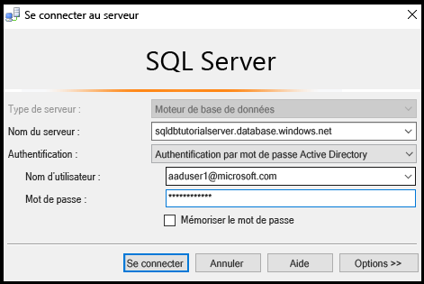

3. Cliquez sur **Options** pour spécifier la base de données à laquelle vous souhaitez vous connecter, puis saisissez **AdventureWorksLT** dans la zone de liste déroulante **Se connecter à la base de données** de l’onglet **Propriétés de connexion**.
   
   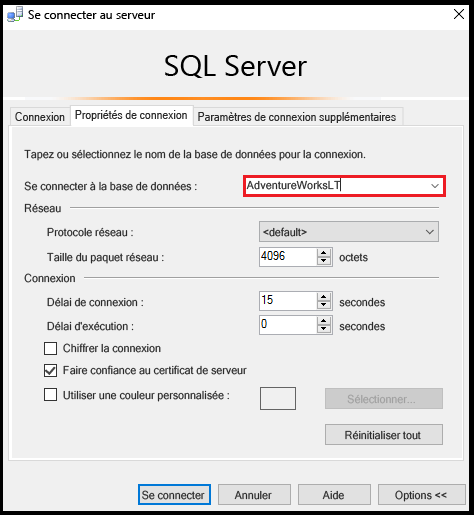

4. Cliquez sur **Connecter**. Une boîte de dialogue vous informe que l’ordinateur à partir duquel vous essayez de vous connecter à la base de données SQL ne dispose d’aucune règle de pare-feu permettant l’accès à la base de données. La boîte de dialogue qui s’affiche comporte deux variantes selon les étapes que vous avez effectuées précédemment avec les pare-feu, mais c’est généralement la première boîte de dialogue qui apparaît.

   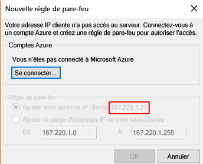

   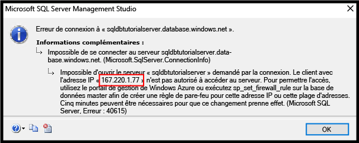

   > [!NOTE]
   > Les dernières versions de SSMS comprennent une fonctionnalité autorisant les propriétaires d’abonnement et les collaborateurs à se connecter à Microsoft Azure et à créer une règle de pare-feu au niveau du serveur.
   > 

4. Copiez l’adresse IP du client à partir de cette boîte de dialogue pour une utilisation à l’étape 7.
5. Cliquez sur **Annuler**, mais ne fermez pas la boîte de dialogue **Se connecter au serveur**.
6. Passez sur un ordinateur pour lequel vous avez déjà créé une règle de pare-feu au niveau du serveur et connectez-vous à votre serveur à l’aide du compte d’administrateur de serveur.
7. Dans une nouvelle fenêtre de requête connectée à la base de données AdventureWorksLT en tant qu’administrateur de serveur, exécutez l’instruction suivante pour créer un pare-feu au niveau de la base de données en exécutant [sp_set_database_firewall_rule](https://msdn.microsoft.com/library/dn270010.aspx) via l’adresse IP de l’étape 4 :

   ```
   EXEC sp_set_database_firewall_rule @name = N'AdventureWorksLTFirewallRule', 
     @start_ip_address = 'x.x.x.x', @end_ip_address = 'x.x.x.x';
   ```

   

8. Accédez à un autre ordinateur et cliquez sur **Connecter** dans la boîte de dialogue **Se connecter au serveur** pour vous connecter à AdventureWorksLT en tant qu’utilisateur aaduser1. 

9. Dans l’Explorateur d’objets, développez **Bases de données**, **AdventureWorksLT**, puis **Tables**. Vous pouvez voir que l’utilisateur user1 a uniquement l’autorisation d’afficher une seule table : **SalesLT.ProductCategory**. 

10. Dans l’Explorateur d’objets, cliquez avec le bouton droit sur **SalesLT.ProductCategory**, puis sur **Sélectionner les 1 000 premières lignes**.   

## <a name="next-steps"></a>Étapes suivantes
- Pour obtenir une vue d’ensemble de l’accès et du contrôle dans la base de données SQL, voir [Accès à la base de données SQL et contrôle](sql-database-control-access.md).
- Pour une vue d’ensemble des connexions, des utilisateurs et des rôles de base de données dans la base de données SQL, voir [Connexions, utilisateurs et rôles de base de données](sql-database-manage-logins.md).
- Pour en savoir plus sur les principaux de base de données, voir [Principaux](https://msdn.microsoft.com/library/ms181127.aspx).
- Pour en savoir plus sur les rôles de base de données, voir [Rôles de base de données](https://msdn.microsoft.com/library/ms189121.aspx).
- Pour en savoir plus sur les règles de pare-feu dans la base de données SQL, voir [Règles de pare-feu de la base de données SQL](sql-database-firewall-configure.md).


