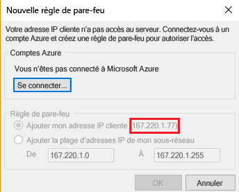
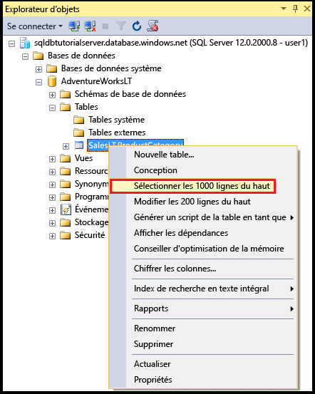
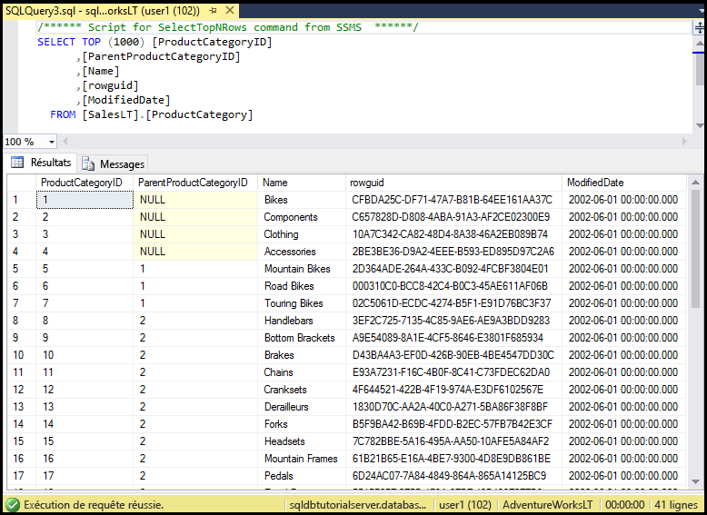

# <a name="sql-database-tutorial-sql-server-authentication-logins-and-user-accounts-database-roles-permissions-server-level-firewall-rules-and-database-level-firewall-rules"></a>Didacticiel sur les bases de données SQL : authentification SQL Server, connexions et comptes d’utilisateur, rôles de base de données, autorisations, règles de pare-feu de niveau serveur et règles de pare-feu de niveau base de données
Dans ce didacticiel dédié à la prise en main, vous allez apprendre à utiliser SQL Server Management Studio pour travailler avec l’authentification SQL Server, les connexions, les utilisateurs et les rôles de base de données qui accordent accès et autorisations pour les serveurs Azure SQL Database et les bases de données. Vous allez découvrir comment effectuer les actions suivantes :

- Afficher les autorisations de l’utilisateur dans la base de données master et dans les bases de données utilisateur
- Créer des connexions et des utilisateurs en fonction de l’authentification SQL Server
- Accorder des autorisations au niveau du serveur et de la base de données spécifiques aux utilisateurs
- Se connecter à une base de données utilisateur en tant qu’utilisateur non administrateur
- Créer des règles de pare-feu au niveau de la base de données pour les utilisateurs de la base de données
- Créer des règles de pare-feu au niveau du serveur pour les administrateurs de serveur

**Durée estimée** : ce didacticiel vous prendra environ 45 minutes (à condition que vous remplissiez déjà les conditions préalables).

## <a name="prerequisites"></a>Composants requis

* Vous avez besoin d’un compte Azure. Vous pouvez [ouvrir un compte Azure gratuit](/pricing/free-trial/?WT.mc_id=A261C142F) ou [activer les avantages de l’abonnement à Visual Studio](/pricing/member-offers/msdn-benefits-details/?WT.mc_id=A261C142F). 

* Vous devez être en mesure de vous connecter au portail Azure à l’aide d’un compte qui est membre du propriétaire de l’abonnement ou du rôle du collaborateur. Pour plus d’informations sur l’utilisation du contrôle d’accès en fonction du rôle (RBAC), consultez [Prise en main de la gestion des accès dans le portail Azure](../active-directory/role-based-access-control-what-is.md).

* Vous avez exécuté le didacticiel [Prise en main des serveurs Azure SQL Database, des bases de données et des règles de pare-feu à l’aide du portail Azure et de SQL Server Management Studio](sql-database-get-started.md) ou la [version PowerShell](sql-database-get-started-powershell.md) de ce didacticiel. Dans le cas contraire, suivez ce didacticiel préalable ou exécutez le script PowerShell à la fin de la [version PowerShell](sql-database-get-started-powershell.md) de ce didacticiel avant de continuer.

> [!NOTE]
> Ce didacticiel vous permet de découvrir le contenu des rubriques suivantes : [Accès à la base de données SQL et contrôle](sql-database-control-access.md), [Connexions, utilisateurs et rôles de base de données](sql-database-manage-logins.md), [Principaux](https://msdn.microsoft.com/library/ms181127.aspx), [Rôles de base de données](https://msdn.microsoft.com/library/ms189121.aspx) et [Règles de pare-feu de base de données SQL](sql-database-firewall-configure.md).
>  

## <a name="sign-in-to-the-azure-portal-using-your-azure-account"></a>Connectez-vous au portail Azure avec votre compte Azure
À l’aide de votre [abonnement existant](https://account.windowsazure.com/Home/Index), suivez ces étapes pour vous connecter au portail Azure.

1. Ouvrez votre navigateur préféré et connectez-vous au [portail Azure](https://portal.azure.com/).
2. Connectez-vous au [portail Azure](https://portal.azure.com/).
3. Dans la page **de connexion** , entrez les informations d’identification de votre abonnement.
   
   


<a name="create-logical-server-bk"></a>

## <a name="view-information-about-the-security-configuration-for-your-logical-server"></a>Afficher des informations sur la configuration de sécurité de votre serveur logique

Dans cette section du didacticiel, vous pouvez afficher des informations sur la configuration de sécurité de votre serveur logique dans le portail Azure.

1. Ouvrez le panneau **SQL Server** de votre serveur logique et affichez les informations de la page **Vue d’ensemble**.

   

2. Notez le nom du compte d’administrateur de serveur pour le serveur logique. Si vous avez oublié le mot de passe, cliquez sur **Réinitialiser mot de passe** pour définir un nouveau mot de passe.

> [!NOTE]
> Pour passer en revue les informations de connexion à ce serveur, accédez à [Afficher ou mettre à jour les paramètres du serveur](sql-database-view-update-server-settings.md). Pour cette série de didacticiels, le nom de serveur complet est « sqldbtutorialserver.database.windows.net ».
>

## <a name="connect-to-sql-server-using-sql-server-management-studio-ssms"></a>Se connecter au serveur SQL Server à l’aide de SQL Server Management Studio (SSMS)

1. Si ce n’est déjà fait, téléchargez et installez la dernière version de SSMS via [Téléchargement de SQL Server Management Studio](https://msdn.microsoft.com/library/mt238290.aspx). Pour vous permettre de rester à jour, la dernière version de SSMS vous envoie une invite lorsqu’une nouvelle version est disponible au téléchargement.

2. Une fois l’installation terminée, tapez **Microsoft SQL Server Management Studio** dans la zone de recherche de Windows, puis cliquez sur **Entrée** pour ouvrir SSMS.

   

3. Dans la boîte de dialogue **Se connecter au serveur**, entrez les informations nécessaires pour vous connecter à votre serveur SQL Server à l’aide de l’authentification SQL Server et du compte d’administrateur de serveur.

   

4. Cliquez sur **Connecter**.

   

## <a name="view-the-server-admin-account-and-its-permissions"></a>Afficher le compte d’administrateur de serveur et ses autorisations 
Dans cette section du didacticiel, vous pouvez afficher des informations sur le compte d’administrateur de serveur, ainsi que ses autorisations dans la base de données master et dans les bases de données utilisateur.

1. Dans l’Explorateur d’objets, développez **Sécurité**, puis développez **Connexions** pour afficher les connexions existantes pour votre serveur de base de données SQL Azure. Une connexion apparaît pour le compte d’administrateur de serveur spécifié lors de la configuration (connexion sqladmin pour cette série de didacticiels).

   

2. Dans l’Explorateur d’objets, développez **Bases de données**, **Bases de données système**, **Master**, **Sécurité**, puis **Utilisateurs**. Un compte d’utilisateur a été créé dans la base de données master pour la connexion d’administrateur serveur, avec le même nom pour le compte d’utilisateur que celui du compte de connexion (les noms ne doivent pas nécessairement correspondre, mais cela est recommandé afin d’éviter toute confusion).

   

   > [!NOTE]
   > Pour plus d’informations sur les autres comptes d’utilisateur qui s’affichent, consultez [Principaux](https://msdn.microsoft.com/library/ms181127.aspx).
   >

3. Dans l’Explorateur d’objets, cliquez avec le bouton droit sur **Master**, puis sur **Nouvelle requête** pour ouvrir une fenêtre de requête connectée à la base de données master.
4. Dans la fenêtre de requête, exécutez la requête suivante pour renvoyer des informations relatives à l’utilisateur exécutant la requête. sqladmin est retourné pour le compte d’utilisateur exécutant cette requête (nous obtiendrons un résultat différent lorsque nous interrogerons une base de données utilisateur plus loin dans cette procédure).

   ```
   SELECT USER;
   ```

   

5. Dans la fenêtre de requête, exécutez la requête suivante pour renvoyer des informations relatives aux autorisations de l’utilisateur sqladmin. sqladmin dispose des autorisations pour se connecter à la base de données master, créer des connexions et des utilisateurs, sélectionner des informations à partir de la table sys.sql_logins et ajouter des utilisateurs aux rôles de base de données dbmanager et dbcreator. Ces autorisations s’ajoutent aux autorisations accordées au rôle public depuis lequel tous les utilisateurs héritent des autorisations (telles que les autorisations pour sélectionner des informations à partir de certaines tables). Pour plus d’informations, consultez la page [Autorisations](https://msdn.microsoft.com/library/ms191291.aspx).

   ```
   SELECT prm.permission_name
      , prm.class_desc
      , prm.state_desc
      , p2.name as 'Database role'
      , p3.name as 'Additional database role' 
   FROM sys.database_principals p
   JOIN sys.database_permissions prm
      ON p.principal_id = prm.grantee_principal_id
      LEFT JOIN sys.database_principals p2
      ON prm.major_id = p2.principal_id
      LEFT JOIN sys.database_role_members r
      ON p.principal_id = r.member_principal_id
      LEFT JOIN sys.database_principals p3
      ON r.role_principal_id = p3.principal_id
   WHERE p.name = 'sqladmin';
   ```

   

6. Dans l’Explorateur d’objets, développez**blankdb**, **Sécurité**, puis **Utilisateurs**. Il n’existe aucun compte d’utilisateur appelé sqladmin dans cette base de données.

   

7. Dans l’Explorateur d’objets, cliquez avec le bouton droit sur **blankdb**, puis sur **Nouvelle requête**.

8. Dans la fenêtre de requête, exécutez la requête suivante pour renvoyer des informations relatives à l’utilisateur exécutant la requête. Notez que dbo est renvoyée pour le compte d’utilisateur qui exécute cette requête (par défaut, la connexion d’administrateur serveur est mappée au compte d’utilisateur dbo dans chaque base de données utilisateur).

   ```
   SELECT USER;
   ```

   

9. Dans la fenêtre de requête, exécutez la requête suivante pour renvoyer des informations relatives aux autorisations de l’utilisateur dbo. Notez que dbo est membre du rôle public et également membre du rôle de base de données fixe db_owner. Pour plus d’informations, consultez la page [Rôles au niveau de la base de données](https://msdn.microsoft.com/library/ms189121.aspx).

   ```
   SELECT prm.permission_name
      , prm.class_desc
      , prm.state_desc
      , p2.name as 'Database role'
      , p3.name as 'Additional database role' 
   FROM sys.database_principals AS p
   JOIN sys.database_permissions AS prm
      ON p.principal_id = prm.grantee_principal_id
      LEFT JOIN sys.database_principals AS p2
      ON prm.major_id = p2.principal_id
      LEFT JOIN sys.database_role_members r
      ON p.principal_id = r.member_principal_id
      LEFT JOIN sys.database_principals AS p3
      ON r.role_principal_id = p3.principal_id
   WHERE p.name = 'dbo';
   ```

   

10. Le cas échéant, répétez les trois étapes précédentes pour la base de données utilisateur AdventureWorksLT.

## <a name="create-a-new-user-in-the-adventureworkslt-database-with-select-permissions"></a>Créer un utilisateur dans la base de données AdventureWorksLT avec des autorisations SELECT

Dans cette section du didacticiel, vous allez créer un compte d’utilisateur dans la base de données AdventureWorksLT, tester les autorisations de cet utilisateur en tant que membre du rôle public, accorder à cet utilisateur des autorisations SELECT, puis tester à nouveau les autorisations de cet utilisateur.

> [!NOTE]
> Les utilisateurs au niveau de la base de données ([utilisateurs contenus](https://msdn.microsoft.com/library/ff929188.aspx)) augmentent la portabilité de votre base de données, une fonctionnalité que nous explorerons dans d’autres didacticiels.
>

1. Dans l’Explorateur d’objets, cliquez avec le bouton droit sur **AdventureWorksLT**, puis sur **Nouvelle requête** pour ouvrir une fenêtre de requête connectée à la base de données AdventureWorksLT.
2. Exécutez l’instruction suivante pour créer un utilisateur nommé user1 dans la base de données AdventureWorksLT.

   ```
   CREATE USER user1
   WITH PASSWORD = 'p@ssw0rd';
   ```
   

3. Dans la fenêtre de requête, exécutez la requête suivante pour renvoyer des informations relatives aux autorisations de l’utilisateur user1. Les seules autorisations dont dispose l’utilisateur user1 sont les autorisations héritées du rôle public.

   ```
   SELECT prm.permission_name
      , prm.class_desc
      , prm.state_desc
      , p2.name as 'Database role'
      , p3.name as 'Additional database role' 
   FROM sys.database_principals AS p
   JOIN sys.database_permissions AS prm
      ON p.principal_id = prm.grantee_principal_id
      LEFT JOIN sys.database_principals AS p2
      ON prm.major_id = p2.principal_id
      LEFT JOIN sys.database_role_members r
      ON p.principal_id = r.member_principal_id
      LEFT JOIN sys.database_principals AS p3
      ON r.role_principal_id = p3.principal_id
   WHERE p.name = 'user1';
   ```

   

4. Exécutez les requêtes suivantes pour tenter d’interroger une table dans la base de données AdventureWorksLT en tant qu’utilisateur user1.

   ```
   EXECUTE AS USER = 'user1';  
   SELECT * FROM [SalesLT].[ProductCategory];
   REVERT;
   ```

   

5. Exécutez l’instruction suivante pour accorder à l’utilisateur user1 des autorisations SELECT sur la table ProductCategory dans le schéma SalesLT.

   ```
   GRANT SELECT ON OBJECT::[SalesLT].[ProductCategory] to user1;
   ```

   

6. Exécutez les requêtes suivantes pour tenter d’interroger une table dans la base de données AdventureWorksLT en tant qu’utilisateur user1.

   ```
   EXECUTE AS USER = 'user1';  
   SELECT * FROM [SalesLT].[ProductCategory];
   REVERT;
   ```

   

## <a name="create-a-database-level-firewall-rule-for-an-adventureworkslt-database-user"></a>Créer une règle de pare-feu au niveau de la base de données pour un utilisateur de base de données AdventureWorksLT

Dans cette section du didacticiel, vous tenterez de vous connecter à partir d’un ordinateur avec une adresse IP différente, de créer une règle de pare-feu au niveau de la base de données en tant qu’administrateur du serveur, puis de vous connecter à l’aide de cette nouvelle règle de pare-feu au niveau de la base de données. 

> [!NOTE]
> Les [règles de pare-feu au niveau de la base de données](sql-database-firewall-configure.md) augmentent la portabilité de votre base de données, une fonctionnalité que nous explorerons dans d’autres didacticiels.
>

1. Sur un autre ordinateur pour lequel vous n’avez pas déjà créé une règle de pare-feu au niveau du serveur, ouvrez SQL Server Management Studio.

   > [!IMPORTANT]
   > Utilisez toujours la dernière version de SSMS disponible sous [Télécharger SQL Server Management Studio](https://msdn.microsoft.com/library/mt238290.aspx). 
   >

2. Dans la fenêtre **Se connecter au serveur**, entrez le nom du serveur et les informations d’authentification pour vous connecter à l’aide de l’authentification SQL Server avec le compte user1. 
    
   

3. Cliquez sur **Options** pour spécifier la base de données à laquelle vous souhaitez vous connecter, puis tapez **AdventureWorksLT** dans la zone de liste déroulante **Se connecter à la base de données** de l’onglet **Propriétés de connexion**.
   
   

4. Cliquez sur **Connecter**. Une boîte de dialogue vous informe que l’ordinateur à partir duquel vous essayez de vous connecter à la base de données SQL ne dispose pas d’une règle de pare-feu permettant l’accès à la base de données. La boîte de dialogue qui s’affiche comporte deux variantes selon les étapes que vous avez effectuées précédemment avec les pare-feu, mais c’est généralement la première boîte de dialogue qui apparaît.

   

   

   > [!NOTE]
   > Les dernières versions de SSMS comprennent une fonctionnalité autorisant les propriétaires d’abonnement et les collaborateurs à se connecter à Microsoft Azure et à créer une règle de pare-feu au niveau du serveur.
   > 

4. Copiez l’adresse IP du client à partir de cette boîte de dialogue pour une utilisation à l’étape 7.
5. Cliquez sur **Annuler**, mais ne fermez pas la boîte de dialogue **Se connecter au serveur**.
6. Passez sur un ordinateur pour lequel vous avez déjà créé une règle de pare-feu au niveau du serveur et connectez-vous à votre serveur à l’aide du compte d’administrateur de serveur.
7. Dans une nouvelle fenêtre de requête connectée à la base de données AdventureWorksLT en tant qu’administrateur de serveur, exécutez l’instruction suivante pour créer un pare-feu au niveau de la base de données en exécutant [sp_set_database_firewall_rule](https://msdn.microsoft.com/library/dn270010.aspx) à l’aide de l’adresse IP de l’étape 4 :

   ```
   EXEC sp_set_database_firewall_rule @name = N'AdventureWorksLTFirewallRule', 
     @start_ip_address = 'x.x.x.x', @end_ip_address = 'x.x.x.x';
   ```

   

8. Repassez sur l’autre ordinateur et cliquez sur **Connecter** dans la boîte de dialogue **Se connecter au serveur** pour vous connecter à AdventureWorksLT en tant qu’utilisateur user1. 

   

9. Dans l’Explorateur d’objets, développez **Bases de données**, **AdventureWorksLT**, puis **Tables**. L’utilisateur user1 a l’autorisation d’afficher une seule table : **SalesLT.ProductCategory**. 

   

10. Dans l’Explorateur d’objets, cliquez avec le bouton droit sur **SalesLT.ProductCategory**, puis sur **Sélectionner les 1 000 premières lignes**.   

   

   

## <a name="create-a-new-user-in-the-blankdb-database-with-dbowner-database-role-permissions-and-a-database-level-firewall-rule"></a>Créer un utilisateur dans la base de données blankdb disposant d’autorisations de rôle de base de données db_owner et une règle de pare-feu au niveau de la base de données

Dans cette section du didacticiel, vous créerez un utilisateur dans la base de données blankdb disposant d’autorisations de rôle de base de données db_owner, ainsi qu’un pare-feu au niveau de la base de données pour cette base de données à l’aide du compte d’administrateur de serveur. 

1. Repassez sur l’ordinateur disposant d’une connexion à la base de données SQL à l’aide du compte d’administrateur de serveur.
2. Ouvrez une fenêtre de requête connectée à la base de données blankdb et exécutez l’instruction suivante pour créer un utilisateur appelé blankdbadmin dans la base de données blankdb.

   ```
   CREATE USER blankdbadmin
   WITH PASSWORD = 'p@ssw0rd';
   ```

3. Dans la même fenêtre de requête, exécutez l’instruction suivante pour ajouter l’utilisateur blankdbadmin au rôle de base de données db_owner. Cet utilisateur peut désormais exécuter toutes les actions nécessaires à la gestion de la base de données blankdb.

   ```
   ALTER ROLE db_owner ADD MEMBER blankdbadmin; 
   ```

4. Dans la même fenêtre de requête, exécutez l’instruction suivante pour créer un pare-feu au niveau de la base de données en exécutant [sp_set_database_firewall_rule](https://msdn.microsoft.com/library/dn270010.aspx) à l’aide de l’adresse IP de l’étape 4 dans la procédure précédente (ou une plage d’adresses IP pour les utilisateurs de cette base de données) :

   ```
   EXEC sp_set_database_firewall_rule @name = N'blankdbFirewallRule', 
     @start_ip_address = 'x.x.x.x', @end_ip_address = 'x.x.x.x';
   ```

5. Repassez sur l’autre ordinateur (pour lequel vous avez créé une règle de pare-feu au niveau de la base de données) et connectez-vous à la base de données blankdb à l’aide du compte d’utilisateur blankdbadmin.
6. Ouvrez une fenêtre de requête connectée à la base de données blankdb et exécutez l’instruction suivante pour créer un utilisateur appelé blankdbuser1 dans la base de données blankdb.

   ```
   CREATE USER blankdbuser1
   WITH PASSWORD = 'p@ssw0rd';
   ```
 
7. En fonction des besoins de votre environnement d’apprentissage, créez une règle supplémentaire de pare-feu au niveau de la base de données pour cet utilisateur. 

## <a name="create-a-new-login-and-user-in-the-master-database-with-dbmanager-permissions-and-create-a-server-level-firewall-rule"></a>Créer une connexion et un utilisateur dans la base de données master avec des autorisations dbmanager et créer une règle de pare-feu au niveau du serveur

Dans cette section du didacticiel, vous créerez une connexion et un utilisateur dans la base de données master avec des autorisations pour créer et gérer des bases de données utilisateur. Vous créerez également une règle supplémentaire de pare-feu au niveau du serveur à l’aide de Transact-SQL avec [sp_set_firewall_rule](https://msdn.microsoft.com/library/dn270017.aspx).

> [!NOTE]
> La création de connexions dans la base de données master et la création d’un compte d’utilisateur à partir d’un compte de connexion sont requises pour que le titulaire du compte d’administrateur de serveur puisse déléguer les autorisations de création de base de données à un autre utilisateur. Cependant, la création de connexions et d’utilisateurs à partir de connexions diminue la portabilité de votre environnement (nous en détaillerons les conséquences dans d’autres didacticiels), y compris comment anticiper et gérer dans le cadre de la planification de la récupération d’urgence.
>

1. Repassez sur l’ordinateur disposant d’une connexion à la base de données SQL à l’aide du compte d’administrateur de serveur.
2. Ouvrez une fenêtre de requête connectée à la base de données master et exécutez l’instruction suivante pour créer une connexion appelée dbcreator dans la base de données master.

   ```
   CREATE LOGIN dbcreator
   WITH PASSWORD = 'p@ssw0rd';
   ```

3. Dans la même fenêtre de requête, 

   ```
   CREATE USER dbcreator
   FROM LOGIN dbcreator;
   ```

3. Dans la même fenêtre de requête, exécutez l’instruction suivante pour ajouter l’utilisateur dbcreator au rôle de base de données dbmanager. Cet utilisateur peut désormais créer et gérer des bases de données créées par l’utilisateur.

   ```
   ALTER ROLE dbmanager ADD MEMBER dbcreator; 
   ```

4. Dans la même fenêtre de requête, exécutez la requête suivante pour créer un pare-feu au niveau du serveur en exécutant [sp_set_database_firewall_rule](https://msdn.microsoft.com/library/dn270010.aspx) à l’aide d’une adresse IP adaptée à votre environnement :

   ```
   EXEC sp_set_firewall_rule @name = N'dbcreatorFirewallRule', 
     @start_ip_address = 'x.x.x.x', @end_ip_address = 'x.x.x.x';
   ```

5. Repassez sur l’autre ordinateur (pour lequel vous avez créé une règle de pare-feu au niveau de la base du serveur) et connectez-vous à la base de données master à l’aide du compte d’utilisateur dbcreator.
6. Ouvrez une fenêtre de requête vers la base de données master et exécutez la requête suivante pour créer une base de données nommée foo.

   ```
   CREATE DATABASE FOO (EDITION = 'basic');
   ```
 7. Si vous souhaitez faire des économies, vous pouvez également supprimer cette base de données à l’aide de l’instruction suivante :

   ```
   DROP DATABASE FOO;
   ```

## <a name="complete-script"></a>Terminer le script

Pour créer les connexions et les utilisateurs, les ajouter aux rôles, leur accorder des autorisations, créer des règles de pare-feu au niveau de la base de données et au niveau du serveur, exécutez les instructions suivantes dans les bases de données appropriées sur votre serveur.

### <a name="master-database"></a>master database
Exécutez ces instructions dans la base de données master à l’aide du compte d’administrateur de serveur, en ajoutant les adresses IP ou la plage appropriées.

```
CREATE LOGIN dbcreator WITH PASSWORD = 'p@ssw0rd';
CREATE USER dbcreator FROM LOGIN dbcreator;
ALTER ROLE dbmanager ADD MEMBER dbcreator;
EXEC sp_set_firewall_rule @name = N'dbcreatorFirewallRule', 
     @start_ip_address = 'x.x.x.x', @end_ip_address = 'x.x.x.x';
```

### <a name="adventureworkslt-database"></a>Base de données AdventureWorksLT
Exécutez ces instructions dans la base de données AdventureWorksLT à l’aide du compte d’administrateur de serveur, en ajoutant les adresses IP ou la plage appropriées.

```
CREATE USER user1 WITH PASSWORD = 'p@ssw0rd';
GRANT SELECT ON OBJECT::[SalesLT].[ProductCategory] to user1;
EXEC sp_set_database_firewall_rule @name = N'AdventureWorksLTFirewallRule', 
     @start_ip_address = 'x.x.x.x', @end_ip_address = 'x.x.x.x';
```

### <a name="blankdb-database"></a>Base de données blankdb
Exécutez ces instructions dans la base de données blankdb à l’aide du compte d’administrateur de serveur, en ajoutant les adresses IP ou la plage appropriées.

```
CREATE USER blankdbadmin
   WITH PASSWORD = 'p@ssw0rd';
ALTER ROLE db_owner ADD MEMBER blankdbadmin;
EXEC sp_set_database_firewall_rule @name = N'blankdbFirewallRule', 
     @start_ip_address = 'x.x.x.x', @end_ip_address = 'x.x.x.x';
CREATE USER blankdbuser1
   WITH PASSWORD = 'p@ssw0rd';
```

## <a name="next-steps"></a>Étapes suivantes
- Pour une vue d’ensemble de l’accès et du contrôle dans la base de données SQL, consultez la page [Accès à la base de données SQL et contrôle](sql-database-control-access.md).
- Pour une vue d’ensemble des connexions, des utilisateurs et des rôles de base de données dans la base de données SQL, consultez la page [Connexions, utilisateurs et rôles de base de données](sql-database-manage-logins.md).
- Pour plus d’informations sur les principaux de base de données, consultez la page [Principaux](https://msdn.microsoft.com/library/ms181127.aspx).
- Pour plus d’informations sur les rôles de base de données, consultez la page [Rôles de base de données](https://msdn.microsoft.com/library/ms189121.aspx).
- Pour plus d’informations sur les règles de pare-feu dans la base de données SQL, consultez [Règles de pare-feu de la base de données SQL](sql-database-firewall-configure.md).
- Pour obtenir un didacticiel utilisant l’authentification Azure Active Directory, consultez le [Didacticiel sur les bases de données SQL : authentification SQL Server, connexions et comptes d’utilisateur, rôles de base de données, autorisations, règles de pare-feu de niveau serveur et règles de pare-feu de niveau base de données](sql-database-control-access-sql-authentication-get-started.md).


<!--HONumber=Jan17_HO3-->


