# <a name="sql-server-authentication-access-and-database-level-firewall-rules"></a>Authentification SQL Server, accès et règles de pare-feu au niveau de la base de données

Dans ce didacticiel, vous allez apprendre à utiliser SQL Server Management Studio pour travailler avec l’authentification SQL Server, les connexions, les utilisateurs et les rôles de base de données qui accordent accès et autorisations pour les serveurs Azure SQL Database et les bases de données. Après avoir suivi ce didacticiel, vous saurez :

- Créer des connexions et des utilisateurs en fonction de l’authentification SQL Server
- Ajouter des utilisateurs aux rôles et octroyer des autorisations aux rôles
- Utiliser T-SQL pour créer une règle de pare-feu au niveau de la base de données et au niveau du serveur 
- Vous connecter en tant qu’utilisateur à une base de données spécifique à l’aide de SSMS
- Afficher les autorisations de l’utilisateur dans la base de données master et dans les bases de données utilisateur

**Durée estimée** : ce didacticiel vous prendra environ 45 minutes (à condition que vous remplissiez déjà les conditions préalables).

> [!NOTE]
> Ce didacticiel vous permet de découvrir le contenu des rubriques suivantes : [Contrôle d’accès à Azure SQL Database](sql-database-control-access.md), [Connexions, utilisateurs et rôles de base de données](sql-database-manage-logins.md), [Principaux](https://msdn.microsoft.com/library/ms181127.aspx), [Rôles de base de données](https://msdn.microsoft.com/library/ms189121.aspx) et [Règles de pare-feu de base de données SQL](sql-database-firewall-configure.md). Pour suivre un didacticiel sur l’authentification Azure Active Directory, consultez l’article [Getting started with Azure AD Authentication (Prise en main de l’authentification Azure AD)](sql-database-control-access-aad-authentication-get-started.md).
>  

## <a name="prerequisites"></a>Composants requis

* **Un compte Azure**. Vous avez besoin d’un compte Azure. Vous pouvez [ouvrir un compte Azure gratuit](https://azure.microsoft.com/free/) ou [activer les avantages de l’abonnement à Visual Studio](https://azure.microsoft.com/pricing/member-offers/msdn-benefits/). 

* **Des autorisations de création Azure**. Vous devez être en mesure de vous connecter au portail Azure à l’aide d’un compte qui est membre du propriétaire de l’abonnement ou du rôle du collaborateur. Pour plus d’informations sur l’utilisation du contrôle d’accès en fonction du rôle (RBAC), consultez [Prise en main de la gestion des accès dans le portail Azure](../active-directory/role-based-access-control-what-is.md).

* **SQL Server Management Studio**. Pour télécharger et installer la dernière version de SQL Server Management Studio (SSMS), consultez l’article [Télécharger SQL Server Management Studio (SSMS)](https://msdn.microsoft.com/library/mt238290.aspx). Lorsque vous vous connectez à Azure SQL Database, utilisez toujours la dernière version de SSMS, car de nouvelles fonctionnalités sont continuellement publiées.

* **Serveur de base et bases de données**. Pour installer et configurer un serveur et deux bases de données utilisés dans ce didacticiel, cliquez sur le bouton **Déployer sur Azure**. Lorsque vous cliquez sur le bouton, le panneau **Deploy from a template** (Déployer à partir d’un modèle) s’ouvre. Créez un groupe de ressources et indiquez le **mot de passe de connexion administrateur** pour le nouveau serveur qui sera créé :

   [](https://portal.azure.com/#create/Microsoft.Template/uri/https%3A%2F%2Fsqldbtutorial.blob.core.windows.net%2Ftemplates%2Fsqldbgetstarted.json)


## <a name="sign-in-to-the-azure-portal-using-your-azure-account"></a>Se connecter au portail Azure avec un compte Azure
Cette procédure vous indique comment vous connecter au portail Azure à l’aide de votre compte Azure (https://account.windowsazure.com/Home/Index).

1. Ouvrez votre navigateur préféré et connectez-vous au [portail Azure](https://portal.azure.com/).
2. Connectez-vous au [portail Azure](https://portal.azure.com/).
3. Dans la page **de connexion** , entrez les informations d’identification de votre abonnement.
   
   


<a name="create-logical-server-bk"></a>

## <a name="view-logical-server-security-information-in-the-azure-portal"></a>Afficher les informations relatives à la sécurité de serveur logique dans le portail Azure

Les étapes de cette procédure vous montrent comment afficher des informations sur la configuration de sécurité de votre serveur logique dans le portail Azure.

1. Ouvrez le panneau **SQL Server** de votre serveur et affichez les informations de la page **Vue d’ensemble**.

   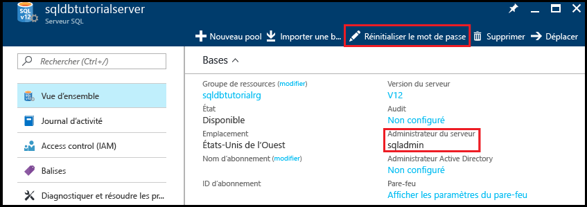

2. Prenez note du nom de l’administrateur du serveur sur votre serveur logique. 

3. Si vous avez oublié le mot de passe, cliquez sur **Réinitialiser mot de passe** pour définir un nouveau mot de passe.

4. Si vous devez obtenir les informations de connexion de ce serveur, cliquez sur **Propriétés**.

## <a name="view-server-admin-permissions-using-ssms"></a>Afficher les autorisations d’administrateur de serveur à l’aide de SSMS

Les étapes de cette procédure vous montrent comment afficher des informations sur le compte d’administrateur de serveur, ainsi que ses autorisations dans la base de données MASTER et dans les bases de données utilisateur.

1. Ouvrez SQL Server Management Studio et connectez-vous à votre serveur en tant qu’administrateur du serveur à l’aide de l’authentification SQL Server et du compte d’administrateur de serveur.

   

2. Cliquez sur **Connecter**.

   

3. Dans l’Explorateur d’objets, développez **Sécurité**, puis **Connexions** pour afficher les connexions existantes de votre serveur ; la seule connexion sur un nouveau serveur est la connexion du compte d’administrateur de serveur.

   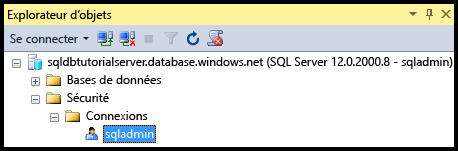

4. Dans l’Explorateur d’objets, développez **Bases de données**, **Bases de données système**, **master**, **Sécurité**, puis **Utilisateurs** pour afficher le compte d’utilisateur qui a été créé pour la connexion d’administrateur de serveur dans cette base de données.

   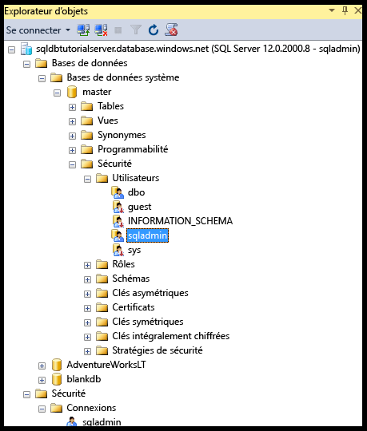

   > [!NOTE]
   > Pour plus d’informations sur les autres comptes d’utilisateurs qui s’affichent dans le nœud Utilisateurs, consultez [Principaux](https://msdn.microsoft.com/library/ms181127.aspx).
   >

5. Dans l’Explorateur d’objets, cliquez avec le bouton droit sur **Master**, puis cliquez sur **Nouvelle requête** pour ouvrir une fenêtre de requête connectée à la base de données master.
6. Dans la fenêtre de requête, exécutez la requête suivante pour renvoyer des informations relatives à l’utilisateur exécutant la requête. 

   ```
   SELECT USER;
   ```

   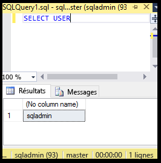

7. Dans la fenêtre de requête, exécutez la requête suivante pour retourner des informations relatives aux autorisations de l’utilisateur sqladmin dans la base de données **MASTER**. 

   ```
   SELECT prm.permission_name
      , prm.class_desc
      , prm.state_desc
      , p2.name as 'Database role'
      , p3.name as 'Additional database role' 
   FROM sys.database_principals p
   JOIN sys.database_permissions prm
      ON p.principal_id = prm.grantee_principal_id
      LEFT JOIN sys.database_principals p2
      ON prm.major_id = p2.principal_id
      LEFT JOIN sys.database_role_members r
      ON p.principal_id = r.member_principal_id
      LEFT JOIN sys.database_principals p3
      ON r.role_principal_id = p3.principal_id
   WHERE p.name = 'sqladmin';
   ```

   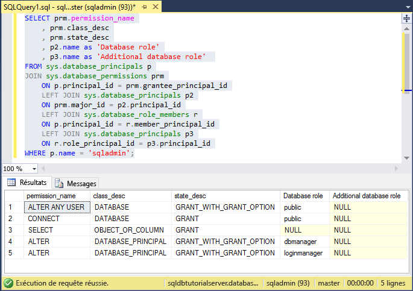

   >[!NOTE]
   > L’administrateur du serveur dispose des autorisations pour se connecter à la base de données MASTER, créer des connexions et des utilisateurs, sélectionner des informations dans la table sys.sql_logins et ajouter des utilisateurs aux rôles de base de données dbmanager et dbcreator. Ces autorisations s’ajoutent aux autorisations accordées au rôle public depuis lequel tous les utilisateurs héritent des autorisations (telles que les autorisations pour sélectionner des informations à partir de certaines tables). Pour plus d’informations, consultez la page [Autorisations](https://msdn.microsoft.com/library/ms191291.aspx).
   >

8. Dans l’Explorateur d’objets, développez **blankdb**, **Sécurité**, puis **Utilisateurs** pour afficher le compte d’utilisateur qui a été créé pour la connexion d’administrateur de serveur dans cette base de données (et dans chaque base de données utilisateur).

   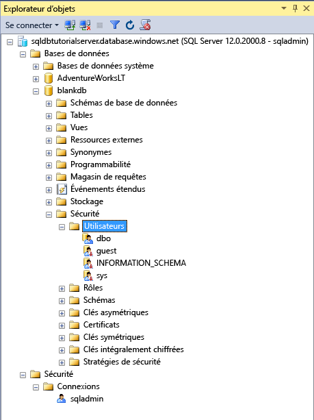

9. Dans l’Explorateur d’objets, cliquez avec le bouton droit sur **blankdb**, puis cliquez sur **Nouvelle requête**.

10. Dans la fenêtre de requête, exécutez la requête suivante pour renvoyer des informations relatives à l’utilisateur exécutant la requête.

   ```
   SELECT USER;
   ```

   

11. Dans la fenêtre de requête, exécutez la requête suivante pour renvoyer des informations relatives aux autorisations de l’utilisateur dbo. 

   ```
   SELECT prm.permission_name
      , prm.class_desc
      , prm.state_desc
      , p2.name as 'Database role'
      , p3.name as 'Additional database role' 
   FROM sys.database_principals AS p
   JOIN sys.database_permissions AS prm
      ON p.principal_id = prm.grantee_principal_id
      LEFT JOIN sys.database_principals AS p2
      ON prm.major_id = p2.principal_id
      LEFT JOIN sys.database_role_members r
      ON p.principal_id = r.member_principal_id
      LEFT JOIN sys.database_principals AS p3
      ON r.role_principal_id = p3.principal_id
   WHERE p.name = 'dbo';
   ```

   

   > [!NOTE]
   > L’utilisateur dbo est membre du rôle public, mais également du rôle de base de données fixe db_owner. Pour en savoir plus, voir [Rôles au niveau de la base de données](https://msdn.microsoft.com/library/ms189121.aspx).
   >

## <a name="create-a-new-user-with-select-permissions"></a>Créer un utilisateur avec les autorisations SELECT

Les étapes de cette procédure vous montrent comment créer un utilisateur de base de données, tester les autorisations par défaut d’un nouvel utilisateur (par le biais du rôle public), accorder à un utilisateur les autorisations **SELECT** et afficher ces autorisations modifiées.

> [!NOTE]
> Les utilisateurs de base de données sont également appelés [utilisateurs contenus](https://msdn.microsoft.com/library/ff929188.aspx) et augmentent la portabilité de votre base de données. Pour plus d’informations sur les avantages de la portabilité, consultez l’article [Configurer et gérer la sécurité Azure SQL Database pour la géo-restauration ou le basculement](sql-database-geo-replication-security-config.md).
>

1. Dans l’Explorateur d’objets, cliquez avec le bouton droit sur **sqldbtutorialdb**, puis cliquez sur **Nouvelle requête**.
2. Dans cette fenêtre de requête, exécutez l’instruction suivante pour créer un utilisateur nommé **user1** dans la base de données sqldbtutorialdb.

   ```
   CREATE USER user1
   WITH PASSWORD = 'p@ssw0rd';
   ```
   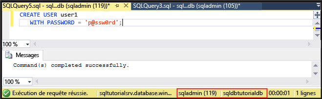

3. Dans la fenêtre de requête, exécutez la requête suivante pour renvoyer des informations relatives aux autorisations de l’utilisateur user1.

   ```
   SELECT prm.permission_name
      , prm.class_desc
      , prm.state_desc
      , p2.name as 'Database role'
      , p3.name as 'Additional database role' 
   FROM sys.database_principals AS p
   JOIN sys.database_permissions AS prm
      ON p.principal_id = prm.grantee_principal_id
      LEFT JOIN sys.database_principals AS p2
      ON prm.major_id = p2.principal_id
      LEFT JOIN sys.database_role_members r
      ON p.principal_id = r.member_principal_id
      LEFT JOIN sys.database_principals AS p3
      ON r.role_principal_id = p3.principal_id
   WHERE p.name = 'user1';
   ```

   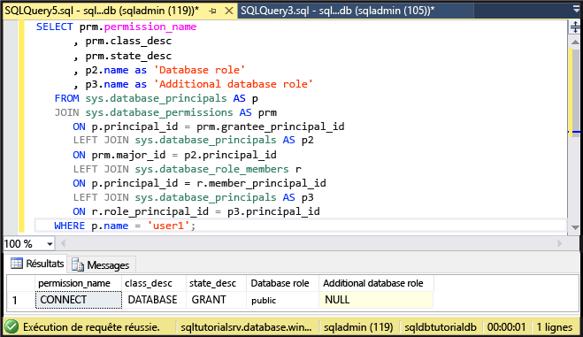

   > [!NOTE]
   > Un nouvel utilisateur dans une base de données dispose uniquement des autorisations héritées du rôle public.
   >

4. Exécutez les requêtes suivantes à l’aide de l’instruction **EXECUTE AS USER** pour tenter d’interroger la table SalesLT.ProductCategory dans la base de données sqldbtutorialdb en tant qu’utilisateur **user1** avec uniquement les autorisations héritées du rôle public.

   ```
   EXECUTE AS USER = 'user1';  
   SELECT * FROM [SalesLT].[ProductCategory];
   REVERT;
   ```

   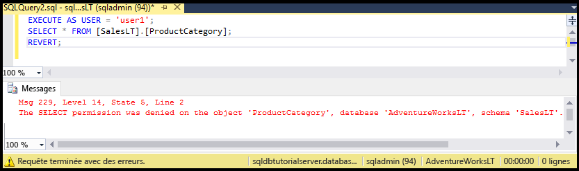

   > [!NOTE]
   > Par défaut, le rôle public n’accorde pas les autorisations **SELECT** sur des objets utilisateur.
   >

5. Exécutez l’instruction suivante pour accorder des autorisations **SELECT** sur la table SalesLT.ProductCategory à l’utilisateur **user1**.

   ```
   GRANT SELECT ON OBJECT::[SalesLT].[ProductCategory] to user1;
   ```

   

6. Exécutez les requêtes suivantes pour interroger avec succès la table SalesLT.ProductCategory de la base de données sqldbtutorialdb en tant qu’utilisateur **user1**.

   ```
   EXECUTE AS USER = 'user1';  
   SELECT * FROM [SalesLT].[ProductCategory];
   REVERT;
   ```

   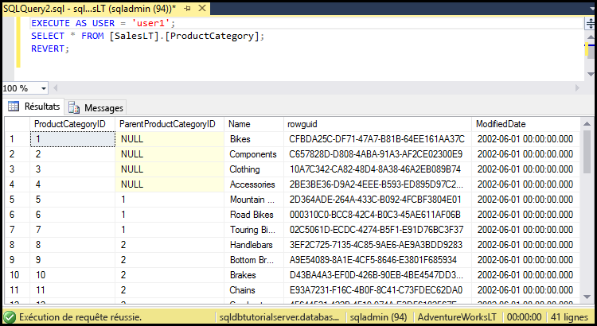

## <a name="create-a-database-level-firewall-rule-using-t-sql"></a>Créer une règle de pare-feu au niveau de la base de données à l’aide de T-SQL

Les étapes de cette procédure vous montrent comment créer une règle de pare-feu au niveau de la base de données à l’aide de la procédure stockée système [sp_set_database_firewall_rule](https://msdn.microsoft.com/library/dn270010.aspx). Une règle de pare-feu au niveau de la base de données permet à un administrateur du serveur d’autoriser les utilisateurs via le pare-feu Azure SQL Database à accéder uniquement à des bases de données spécifiques.

> [!NOTE]
> Les [règles de pare-feu au niveau de la base de données](sql-database-firewall-configure.md) augmentent la portabilité de votre base de données. Pour plus d’informations sur les avantages de la portabilité, consultez l’article [Configurer et gérer la sécurité Azure SQL Database pour la géo-restauration ou le basculement](sql-database-geo-replication-security-config.md).
>

> [!IMPORTANT]
> Pour tester une règle de pare-feu au niveau de la base de données, connectez-vous à partir d’un autre ordinateur (ou supprimez la règle de pare-feu au niveau du serveur dans le portail Azure).
>

1. Ouvrez SQL Server Management Studio sur un ordinateur pour lequel vous ne disposez pas d’une règle de pare-feu au niveau du serveur.

2. Dans la fenêtre **Se connecter au serveur**, entrez le nom du serveur et les informations d’authentification pour vous connecter à l’aide de l’authentification SQL Server avec le compte **user1**. 
    
   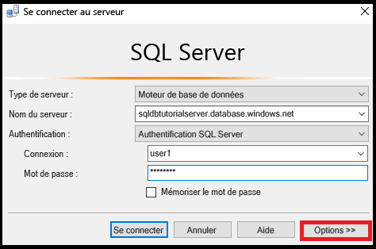

3. Cliquez sur **Options** pour spécifier la base de données à laquelle vous souhaitez vous connecter, puis tapez **sqldbtutorialdb** dans la zone de liste déroulante **Se connecter à la base de données** de l’onglet **Propriétés de connexion**.
   
   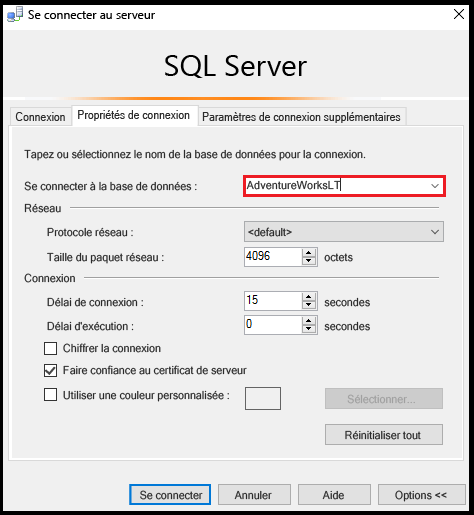

4. Cliquez sur **Connecter**. 

   Une boîte de dialogue vous informe que l’ordinateur à partir duquel vous essayez de vous connecter à la base de données SQL ne dispose d’aucune règle de pare-feu permettant l’accès à la base de données. 

   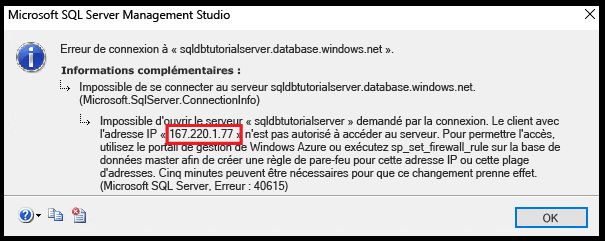


5. Copiez l’adresse IP du client indiquée dans cette boîte de dialogue pour l’utiliser à l’étape 8.
6. Cliquez sur **OK** pour fermer la boîte de dialogue d’erreur, mais ne fermez pas la boîte de dialogue **Se connecter au serveur**.
7. Passez sur un ordinateur pour lequel vous avez déjà créé une règle de pare-feu au niveau du serveur. 
8. Connectez-vous à la base de données sqldbtutorialdb dans SSMS en tant qu’administrateur du serveur, puis exécutez l’instruction suivante pour créer un pare-feu au niveau de la base de données en utilisant l’adresse IP (ou la plage d’adresses) de l’étape 5.  

   ```
   EXEC sp_set_database_firewall_rule @name = N'sqldbtutorialdbFirewallRule', 
     @start_ip_address = 'x.x.x.x', @end_ip_address = 'x.x.x.x';
   ```

   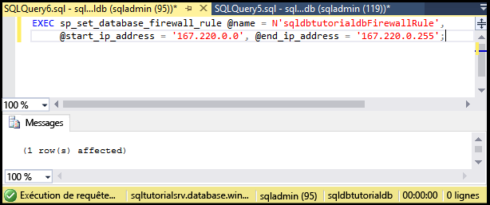

9. Changez de nouveau d’ordinateur et cliquez sur **Connecter** dans la boîte de dialogue **Se connecter au serveur** pour vous connecter à la base de données sqldbtutorialdb en tant qu’utilisateur user1. 

   > [!NOTE]
   > Après avoir créé la règle de pare-feu au niveau de la base de données, son application peut prendre jusqu’à 5 minutes.
   >

10. Une fois la connexion établie, développez **Bases de données** dans l’Explorateur d’objets. Notez que l’utilisateur **user1** peut uniquement afficher la base de données **sqldbtutorialdb**.

   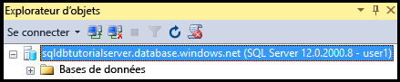

11. Développez **sqldbtutorialdb**, puis **Tables**. L’utilisateur user1 a l’autorisation d’afficher une seule table : **SalesLT.ProductCategory**. 

   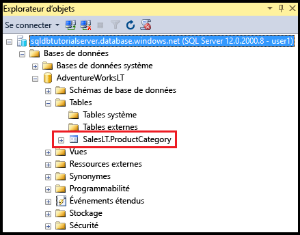

## <a name="create-a-new-user-as-dbowner-and-a-database-level-firewall-rule"></a>Créer un utilisateur en tant que db_owner ainsi qu’une règle de pare-feu au niveau de la base de données

Les étapes de cette procédure vous montrent comment créer un utilisateur dans une autre base de données disposant d’autorisations de rôle de base de données db_owner et comment créer un pare-feu au niveau de la base de données pour cette autre base de données. Ce nouvel utilisateur pourvu de l’appartenance au rôle **db_owner** peut uniquement se connecter à cette base de données unique et la gérer.

1. Repassez sur l’ordinateur disposant d’une connexion à la base de données SQL Database à l’aide du compte d’administrateur de serveur.
2. Ouvrez une fenêtre de requête connectée à la base de données **blankdb** et exécutez l’instruction suivante pour créer un utilisateur appelé blankdbadmin dans la base de données blankdb.

   ```
   CREATE USER blankdbadmin
   WITH PASSWORD = 'p@ssw0rd';
   ```

3. Dans la même fenêtre de requête, exécutez l’instruction suivante pour ajouter l’utilisateur blankdbadmin au rôle de base de données db_owner. Cet utilisateur peut désormais exécuter toutes les actions nécessaires à la gestion de la base de données blankdb.

   ```
   ALTER ROLE db_owner ADD MEMBER blankdbadmin; 
   ```

4. Dans la même fenêtre de requête, exécutez l’instruction suivante pour créer un pare-feu au niveau de la base de données en exécutant [sp_set_database_firewall_rule](https://msdn.microsoft.com/library/dn270010.aspx) à l’aide de l’adresse IP de l’étape 4 dans la procédure précédente (ou une plage d’adresses IP pour les utilisateurs de cette base de données) :

   ```
   EXEC sp_set_database_firewall_rule @name = N'blankdbFirewallRule', 
     @start_ip_address = 'x.x.x.x', @end_ip_address = 'x.x.x.x';
   ```

5. Repassez sur l’autre ordinateur (pour lequel vous avez créé une règle de pare-feu au niveau de la base de données) et connectez-vous à la base de données blankdb à l’aide du compte d’utilisateur blankdbadmin.
6. Ouvrez une fenêtre de requête connectée à la base de données blankdb et exécutez l’instruction suivante pour créer un utilisateur appelé blankdbuser1 dans la base de données blankdb.

   ```
   CREATE USER blankdbuser1
   WITH PASSWORD = 'p@ssw0rd';
   ```
 
7. En fonction des besoins de votre environnement d’apprentissage, créez une règle supplémentaire de pare-feu au niveau de la base de données pour cet utilisateur. Toutefois, si vous avez créé la règle de pare-feu au niveau de la base de données à l’aide d’une plage d’adresses IP, cela peut s’avérer inutile.

## <a name="grant-dbmanager-permissions-and-create-a-server-level-firewall-rule"></a>Accorder des autorisations dbmanager et créer une règle de pare-feu au niveau du serveur

Les étapes de cette procédure vous montrent comment créer une connexion et un utilisateur dans la base de données MASTER avec des autorisations pour créer et gérer des bases de données utilisateur. Elles vous indiquent également comment créer une règle supplémentaire de pare-feu au niveau du serveur à l’aide de Transact-SQL avec [sp_set_firewall_rule](https://msdn.microsoft.com/library/dn270017.aspx). 

> [!IMPORTANT]
>La première règle de pare-feu au niveau du serveur doit toujours être créée dans Azure (dans le portail Azure, à l’aide de PowerShell ou de l’API REST).
>

> [!IMPORTANT]
> La création de connexions dans la base de données MASTER et la création d’un compte d’utilisateur à partir d’une connexion sont requises pour que l’administrateur du serveur puisse déléguer les autorisations de création de base de données à un autre utilisateur. Cependant, les créations successives de connexions et d’utilisateurs à partir des connexions diminuent la portabilité de votre environnement.
>

1. Repassez sur l’ordinateur disposant d’une connexion à la base de données SQL Database à l’aide du compte d’administrateur de serveur.
2. Ouvrez une fenêtre de requête connectée à la base de données master et exécutez l’instruction suivante pour créer une connexion appelée dbcreator dans la base de données master.

   ```
   CREATE LOGIN dbcreator
   WITH PASSWORD = 'p@ssw0rd';
   ```

3. Dans la même fenêtre de requête, 

   ```
   CREATE USER dbcreator
   FROM LOGIN dbcreator;
   ```

3. Dans la même fenêtre de requête, exécutez l’instruction suivante pour ajouter l’utilisateur dbcreator au rôle de base de données dbmanager. Cet utilisateur peut désormais créer et gérer des bases de données créées par l’utilisateur.

   ```
   ALTER ROLE dbmanager ADD MEMBER dbcreator; 
   ```

4. Dans la même fenêtre de requête, exécutez la requête suivante pour créer un pare-feu au niveau du serveur en exécutant [sp_set_firewall_rule](https://msdn.microsoft.com/library/dn270017.aspx) à l’aide d’une adresse IP adaptée à votre environnement :

   ```
   EXEC sp_set_firewall_rule @name = N'dbcreatorFirewallRule', 
     @start_ip_address = 'x.x.x.x', @end_ip_address = 'x.x.x.x';
   ```

5. Repassez sur l’autre ordinateur (pour lequel vous avez créé une règle de pare-feu au niveau de la base du serveur) et connectez-vous à la base de données master à l’aide du compte d’utilisateur dbcreator.
6. Ouvrez une fenêtre de requête vers la base de données master et exécutez la requête suivante pour créer une base de données nommée foo.

   ```
   CREATE DATABASE FOO (EDITION = 'basic');
   ```
 7. Si vous souhaitez faire des économies, vous pouvez également supprimer cette base de données à l’aide de l’instruction suivante :

   ```
   DROP DATABASE FOO;
   ```

## <a name="complete-script"></a>Terminer le script

Pour créer les connexions et les utilisateurs, les ajouter aux rôles, leur accorder des autorisations, créer des règles de pare-feu au niveau de la base de données et au niveau du serveur, exécutez les instructions suivantes dans les bases de données appropriées sur votre serveur.

### <a name="master-database"></a>master database
Exécutez ces instructions dans la base de données master à l’aide du compte d’administrateur de serveur, en ajoutant les adresses IP ou la plage appropriées.

```
CREATE LOGIN dbcreator WITH PASSWORD = 'p@ssw0rd';
CREATE USER dbcreator FROM LOGIN dbcreator;
ALTER ROLE dbmanager ADD MEMBER dbcreator;
EXEC sp_set_firewall_rule @name = N'dbcreatorFirewallRule', 
     @start_ip_address = 'x.x.x.x', @end_ip_address = 'x.x.x.x';
```

### <a name="sqldbtutorialdb-database"></a>base de données sqldbtutorialdb
Exécutez ces instructions dans la base de données sqldbtutorialdb à l’aide du compte d’administrateur de serveur, en ajoutant les adresses IP ou la plage appropriées.

```
CREATE USER user1 WITH PASSWORD = 'p@ssw0rd';
GRANT SELECT ON OBJECT::[SalesLT].[ProductCategory] to user1;
EXEC sp_set_database_firewall_rule @name = N'sqldbtutorialdbFirewallRule', 
     @start_ip_address = 'x.x.x.x', @end_ip_address = 'x.x.x.x';
```

### <a name="blankdb-database"></a>Base de données blankdb
Exécutez ces instructions dans la base de données blankdb à l’aide du compte d’administrateur de serveur, en ajoutant les adresses IP ou la plage appropriées.

```
CREATE USER blankdbadmin
   WITH PASSWORD = 'p@ssw0rd';
ALTER ROLE db_owner ADD MEMBER blankdbadmin;
EXEC sp_set_database_firewall_rule @name = N'blankdbFirewallRule', 
     @start_ip_address = 'x.x.x.x', @end_ip_address = 'x.x.x.x';
CREATE USER blankdbuser1
   WITH PASSWORD = 'p@ssw0rd';
```

## <a name="next-steps"></a>Étapes suivantes
- Pour obtenir une vue d’ensemble de l’accès et du contrôle dans la base de données SQL, voir [Accès à la base de données SQL et contrôle](sql-database-control-access.md).
- Pour une vue d’ensemble des connexions, des utilisateurs et des rôles de base de données dans la base de données SQL, voir [Connexions, utilisateurs et rôles de base de données](sql-database-manage-logins.md).
- Pour en savoir plus sur les principaux de base de données, voir [Principaux](https://msdn.microsoft.com/library/ms181127.aspx).
- Pour en savoir plus sur les rôles de base de données, voir [Rôles de base de données](https://msdn.microsoft.com/library/ms189121.aspx).
- Pour en savoir plus sur les règles de pare-feu dans la base de données SQL, voir [Règles de pare-feu de la base de données SQL](sql-database-firewall-configure.md).
- Pour un didacticiel sur l’authentification Azure Active Directory, consultez [Authentification et autorisation Azure AD](sql-database-control-access-aad-authentication-get-started.md).


