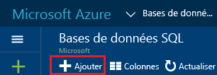

# <a name="create-an-azure-sql-database"></a>Création d’une base de données SQL Azure

Vous pouvez créer une base de données SQL Azure à l’aide du [portail Azure](https://portal.azure.com/), de PowerShell, de Transact-SQL, de l’API REST ou de C#. 

## <a name="create-an-azure-sql-database-using-the-azure-portal"></a>Création d’une base de données SQL Azure à l’aide du portail Azure

1. Ouvrez le panneau **Bases de données SQL** dans le [portail Azure](https://portal.azure.com/). 

    
2. Dans le panneau de bases de données SQL, cliquez sur **Ajouter**.

    

> [!TIP]
> Pour un didacticiel de prise en main avec le portail Azure et SQL Server Management Studio, consultez [Prise en main des serveurs Azure SQL Database, des bases de données et des règles de pare-feu à l’aide du portail Azure et de SQL Server Management Studio](sql-database-get-started.md).
>

## <a name="create-an-azure-sql-database-using-powershell"></a>Création d’une base de données SQL Azure à l’aide de PowerShell

Pour créer une base de données SQL, utilisez l’applet de commande [New-AzureRmSqlDatabase](https://docs.microsoft.com/powershell/resourcemanager/azurerm.sql/v2.3.0/new-azurermsqldatabase). Le groupe de ressources et le serveur doivent déjà exister dans votre abonnement. 

```
$resourceGroupName = "resourcegroup1"
$sqlServerName = "server1"

$databaseName = "database1"
$databaseEdition = "Standard"
$databaseServiceLevel = "S0"

$currentDatabase = New-AzureRmSqlDatabase -ResourceGroupName $resourceGroupName `
 -ServerName $sqlServerName -DatabaseName $databaseName `
 -Edition $databaseEdition -RequestedServiceObjectiveName $databaseServiceLevel
```
> [!TIP]
> Pour obtenir un exemple de script, consultez [Créer un script PowerShell de base de données SQL](sql-database-get-started-powershell.md).
>

## <a name="create-an-azure-sql-database-using-transact-sql-in-sql-server-management-studio"></a>Création d’une base de données SQL Azure à l’aide de Transact-SQL dans SQL Server Management Studio

Pour créer une base de données SQL à l’aide de Transact-SQL dans SQL Server Management Studio :

1. À l’aide de SQL Server Management Studio, connectez-vous au serveur de bases de données Azure à l’aide de la connexion principale au niveau du serveur ou d’une connexion qui est membre du rôle **dbmanager**. Pour plus d’informations sur les connexions, consultez [Gérer les connexions](sql-database-manage-logins.md).
2. Dans l’Explorateur d’objets, ouvrez le nœud Bases de données, développez le dossier **Bases de données système**, cliquez avec le bouton droit sur **master**, puis cliquez sur **Nouvelle requête**.
3. Utilisez l’instruction **CREATE DATABASE** pour créer une base de données. Pour plus d'informations, consultez la rubrique [CREATE DATABASE (Base de données SQL)](https://msdn.microsoft.com/library/dn268335.aspx). L’instruction suivante crée une base de données appelée **maDBTest** , et spécifie qu’il s’agit d’une base de données Standard S0 Edition d’une taille maximale de 250 Go.
  
      CREATE DATABASE myTestDB    (EDITION='Standard',     SERVICE_OBJECTIVE='S0');

4. Cliquez sur **Exécuter** pour exécuter la requête.
5. Dans l’Explorateur d’objets, cliquez avec le bouton droit sur le nœud Bases de données et cliquez sur **Actualiser** pour afficher la nouvelle base de données dans l’Explorateur d’objets. 

> [!TIP]
> Pour un didacticiel de prise en main avec le portail Azure et SQL Server Management Studio, consultez [Prise en main des serveurs Azure SQL Database, des bases de données et des règles de pare-feu à l’aide du portail Azure et de SQL Server Management Studio](sql-database-get-started.md).
>

## <a name="additional-resources"></a>Ressources supplémentaires
* Pour une vue d’ensemble des outils de gestion, consultez [Vue d’ensemble des outils de gestion](sql-database-manage-overview.md).
* Pour découvrir comment effectuer des tâches de gestion à l’aide du portail Azure, consultez [Gérer des bases de données SQL Azure au moyen du portail Azure](sql-database-manage-portal.md).
* Pour découvrir comment effectuer des tâches de gestion à l’aide de PowerShell, consultez [Gérer des bases de données SQL Azure au moyen de PowerShell](sql-database-manage-powershell.md).
* Pour découvrir comment effectuer des tâches de gestion à l’aide de SQL Server Management Studio, consultez [SQL Server Management Studio](sql-database-manage-azure-ssms.md).
* Pour plus d’informations sur le service Base de données SQL, consultez [Présentation de la base de données SQL](sql-database-technical-overview.md). 
* Pour plus d’informations sur les serveurs Azure Database et les fonctionnalités des bases de données, consultez [Fonctionnalités](sql-database-features.md).


<!--HONumber=Dec16_HO3-->


