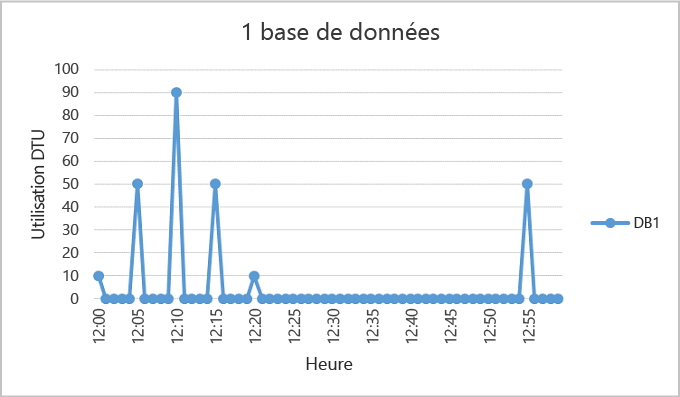
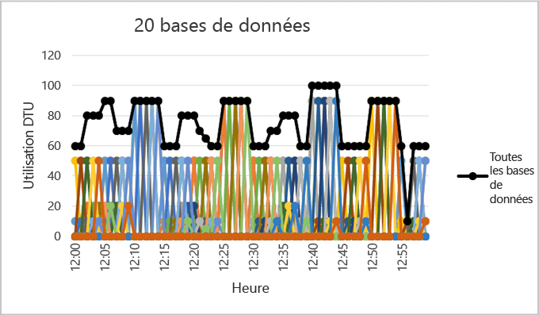

<properties
	pageTitle="Quand utiliser un pool de base de données élastique ?"
	description="Un pool de bases de données élastique est un ensemble de ressources disponibles partagé par un groupe de bases de données élastiques. Ce document fournit des conseils pour vous aider à évaluer la pertinence de l'utilisation d'un pool de bases de données élastique pour un groupe de bases de données."
	services="sql-database"
	documentationCenter=""
	authors="stevestein"
	manager="jhubbard"
	editor=""/>

<tags
	ms.service="sql-database"
	ms.devlang="NA"
	ms.date="05/23/2016"
	ms.author="sstein"
	ms.workload="data-management"
	ms.topic="article"
	ms.tgt_pltfrm="NA"/>

# Quand utiliser un pool de base de données élastique ?
Déterminez si l’utilisation d’un pool de base de données élastique est économique selon les modèles d’utilisation de base de données et les différences de tarification entre un pool de base de données élastique et des bases de données uniques. Des conseils supplémentaires sont également fournis pour vous aider à déterminer la taille de pool actuelle requise pour un ensemble existant de bases de données SQL.

- Pour obtenir une vue d’ensemble des pools, consultez [Pools de bases de données SQL élastiques](sql-database-elastic-pool.md).

> [AZURE.NOTE] Les pools élastiques sont mis à la disposition générale dans toutes les régions Azure, à l’exception du Nord du centre des États-Unis, du Sud du Brésil, de l’Inde de l’Ouest, du Sud de l’Inde et du Nord de la Chine, où ils sont actuellement en version préliminaire. Les pools élastiques seront mis à la disposition générale dans ces régions dès que possible.

## Pool de bases de données élastique

Les développeurs SaaS créent des applications qui reposent sur des couches de données à grande échelle composées de plusieurs bases de données. Un modèle d’application courant consiste à approvisionner une base de données pour chaque client. Toutefois, les modèles d’utilisation sont souvent imprévisibles et varient d’un client à l’autre, et il est difficile de prévoir les besoins en ressources de chaque utilisateur de base de données spécifique. Le développeur peut ainsi approvisionner de façon excessive les ressources moyennant un coût considérable pour garantir un débit et des temps de réponse favorables pour toutes les bases de données. Il peut aussi réduire ses dépenses, ce qui risque d’entraîner une expérience de performances médiocres pour ses clients. Pour en savoir plus sur les modèles de conception pour les applications SaaS avec des pools élastiques, voir [Design Patterns for Multi-tenant SaaS Applications with Azure SQL Database](sql-database-design-patterns-multi-tenancy-saas-applications.md) (Modèles de conception pour les applications SaaS mutualisées avec la base de données SQL Azure).

Les pools élastiques dans Azure SQL Database permettent aux développeurs SaaS d’optimiser le rapport performance/prix pour un groupe de bases de données dans un budget prescrit tout en offrant une élasticité des performances pour chaque base de données. Les pools permettent au développeur d’acheter des unités de transaction de base de données élastiques (eDTU) pour un pool partagé par plusieurs bases de données afin de s’adapter aux périodes imprévisibles d’utilisation par les bases de données. Le besoin en eDTU d’un pool est déterminé par l'utilisation globale de ses bases de données. La quantité d’eDTU disponible pour le pool est contrôlée par le budget du développeur. Les pools permettent au développeur de déduire plus facilement l’incidence du budget sur les performances et vice versa pour son pool. Le développeur ajoute simplement des bases de données au pool, définit le nombre minimal et maximal d’eDTU pour les bases de données, puis définit l’eDTU du pool en fonction de son budget. Un développeur peut utiliser des pools pour faire évoluer en toute transparence son service en passant d’une lean startup à une entreprise mature à une vitesse sans cesse croissante.
## Quand envisager d’utiliser un pool

Les pools sont idéaux dans le cas de nombreuses bases de données avec des modèles d’utilisation spécifiques. Pour une base de données indiquée, ce modèle se caractérise par une faible utilisation moyenne avec des pics d'utilisation relativement rares.

Plus vous ajoutez de bases de données à un pool, plus vous faites d'économies. En fonction de votre modèle d’utilisation de l’application, il est possible de faire des économies avec seulement deux bases de données S3.

Les sections suivantes vous aident à comprendre comment évaluer si votre collection de bases de données spécifique tirera profit de l’utilisation d’un pool. Les exemples utilisent les pools Standard, mais ces principes s’appliquent également aux pools De base et Premium.

### Évaluation des modèles d'utilisation de base de données

La figure suivante montre l’exemple d'une base de données qui est très souvent inactive, mais qui connaît de temps en temps des pics d’activité. Il s’agit d’un modèle d’utilisation qui est particulièrement adapté à un pool :

   

Pour la période de cinq minutes illustrée ci-dessus, DB1 culmine à 90 DTU, mais son utilisation moyenne totale est inférieure à cinq DTU. Un niveau de performance S3 est requis pour exécuter cette charge de travail dans une base de données unique. Cependant, cela laisse la plupart des ressources inutilisées pendant les périodes de faible activité.

Un pool permet de partager ces DTU inutilisées entre plusieurs bases de données et réduit donc la quantité totale de DTU nécessaires et le coût global.

En s'appuyant sur l'exemple précédent, supposons qu'il y ait des bases de données supplémentaires avec des modèles d'utilisation similaires comme DB1. Dans les deux figures ci-dessous, l’utilisation de quatre bases de données et celle de 20 bases de données sont représentées sur le même graphique pour montrer que leur utilisation ne se chevauche pas dans le temps :

   

   

L'utilisation globale des DTU pour les 20 bases de données est illustrée par la ligne noire dans la figure ci-dessus. Cela montre que l'utilisation globale des DTU ne dépasse jamais 100 DTU et que les 20 bases de données peuvent partager 100 eDTU sur cette période. Le nombre de DTU est diminué par 20 et le prix par 13 par rapport au placement de chacune des bases de données dans des niveaux de performances S3 pour les bases de données uniques.

Cet exemple est idéal pour les raisons suivantes :

- Il existe de grandes différences entre les pics d’utilisation et l'utilisation moyenne par base de données.  
- Les pics d’utilisation de chaque base de données se produisent à différents moments dans le temps.
- Les eDTU sont partagés entre plusieurs bases de données.

Le prix d’un pool dépend des eDTU du pool. Alors que le prix unitaire d’une eDTU pour un pool est 1,5 fois supérieur au prix unitaire d’une base de données unique, les **eDTU de pool peuvent être partagées par de nombreuses bases de données et donc un nombre moins important d’eDTU est nécessaire au total**. Ces différences en matière de prix et de partage des eDTU constituent la base du potentiel d'économies que les pools peuvent présenter.

Les règles élémentaires suivantes relatives au nombre de bases de données et à l’utilisation des bases de données permettent de s’assurer qu’un pool coûte moins cher que l’utilisation de niveaux de performances pour des bases de données uniques.

### Nombre minimal de bases de données

Si la somme des DTU des niveaux de performances pour une base de données unique est égale à plus de 1,5 x les eDTU nécessaires pour le pool, un pool élastique est plus rentable. Pour les tailles disponibles, voir [Limites relatives aux eDTU et au stockage pour les pools de bases de données et bases de données élastiques](sql-database-elastic-pool.md#edtu-and-storage-limits-for-elastic-pools-and-elastic-databases).

***Exemple***  Au moins deux bases de données S3 ou au moins 15 bases de données S0 sont nécessaires pour qu’un pool de 100 eDTU soit plus rentable que l’utilisation de niveaux de performances pour des bases de données uniques.

### Nombre maximal de bases de données connaissant un pic simultané

En partageant les eDTU, toutes les bases de données d’un pool ne peuvent pas utiliser simultanément les eDTU jusqu'à la limite disponible lors de l'utilisation de niveaux de performances pour les bases de données uniques. Plus le nombre de bases de données connaissant un pic simultané est faible, plus le nombre d’eDTU du pool peut être revu à la baisse et plus le pool devient rentable. En général, pas plus de 2/3 (ou 67 %) des bases de données du pool doivent connaître un pic simultané à leur limite d’eDTU.

***Exemple***  Pour réduire les coûts pour trois bases de données S3 dans un pool de 200 eDTU, au moins deux de ces bases de données peuvent connaître un pic simultané au niveau de leur utilisation. Sinon, si plus de deux de ces quatre bases de données S3 connaissent un pic simultané, le pool devra être redimensionné à plus de 200 eDTU. Et si le pool est redimensionné à plus de 200 eDTU, plusieurs bases de données S3 devront être ajoutées au pool pour maintenir des coûts inférieurs aux niveaux de performances pour les bases de données unique.

Notez que cet exemple ne tient pas compte de l'utilisation des autres bases de données dans le pool. Si toutes les bases de données connaissent une utilisation à un moment donné, moins de 2/3 (ou 67 %) des bases de données peuvent connaître un pic simultané.

### Utilisation de DTU par base de données

Une différence importante entre le pic d’utilisation et l'utilisation moyenne d’une base de données indique de longues périodes de faible utilisation et de courtes périodes d'utilisation intensive. Ce modèle d'utilisation est idéal pour partager des ressources entre les bases de données. Une base de données doit être envisagée pour un pool quand son pic d’utilisation est environ 1,5 fois supérieur à son utilisation moyenne.

***Exemple***  Une base de données S3 qui culmine à 100 DTU et qui utilise en moyenne 67 DTU ou moins est un bon candidat pour le partage des eDTU dans un pool. Sinon, une base de données S1 qui culmine à 20 DTU et qui utilise en moyenne 13 DTU ou moins est un bon candidat à un pool.

## Dimensionnement d’un pool élastique

La taille optimale pour un pool dépend du nombre global d’eDTU et des ressources de stockage nécessaires pour toutes les bases de données du pool. Cela implique de déterminer la plus grande des deux quantités suivantes :

* Nombre maximal de DTU que se partagent toutes les bases de données du pool.
* Nombre maximal d’octets de stockage que se partagent toutes les bases de données du pool.

Pour les tailles disponibles, voir [Limites relatives aux eDTU et au stockage pour les pools de bases de données et bases de données élastiques](sql-database-elastic-pool.md#edtu-and-storage-limits-for-elastic-pools-and-elastic-databases).

La base de données SQL évalue automatiquement l’historique d’utilisation en ressources des bases de données dans un serveur de base de données SQL existant et recommande la configuration de pool appropriée dans le portail Azure. En plus des recommandations, une expérience intégrée estime l’utilisation d’eDTU pour un groupe personnalisé de bases de données sur le serveur. Cela vous permet de faire une analyse de scénarios en ajoutant de façon interactive des bases de données au pool et en les supprimant pour obtenir l’analyse de l’utilisation des ressources et des conseils de dimensionnement avant de valider vos modifications. Pour afficher une procédure, consultez [Surveiller, gérer et dimensionner un pool élastique](sql-database-elastic-pool-manage-portal.md).

Pour obtenir des évaluations de l’utilisation des ressources plus flexibles acceptant des estimations de dimensionnement ad hoc pour les serveurs antérieurs à V12, ainsi que des estimations de dimensionnement pour les bases de données de différents serveurs, consultez [Script PowerShell pour identifier les bases de données adaptées à un pool de base de données élastique](sql-database-elastic-pool-database-assessment-powershell.md).

| Fonctionnalité | Utilisation du portail|	Script PowerShell|
|:---------------|:----------|:----------|
| Granularité | 15 secondes | 15 secondes
| Prend en compte les différences de prix entre un pool et les niveaux de performances pour les bases de données uniques| Oui| Non
| Permet la personnalisation de la liste des bases de données analysées| Oui| Oui
| Permet la personnalisation de la période de temps utilisée pour l’analyse| Non| Oui
| Permet la personnalisation de la liste des bases de données analysées sur différents serveurs| Non| Oui
| Permet la personnalisation de la liste des bases de données analysées sur des serveurs v11| Non| Oui

Dans les cas où vous ne pouvez pas utiliser les outils, la procédure pas à pas suivante peut vous aider à estimer si un pool est plus économique que les bases de données uniques :

1.	Estimez les eDTU nécessaires pour le pool comme suit :

    MAX(<*nombre total de BD* X *utilisation moyenne en DTU par BD*>,   <*nombre de BD connaissant un pic simultané* X *pic d’utilisation en DTU par BD*)

2.	Estimez l’espace de stockage nécessaire pour le pool en ajoutant le nombre d’octets nécessaires pour toutes les bases de données du pool. Déterminez ensuite la taille du pool d’eDTU qui fournit cette quantité de stockage. Pour connaître les limites de stockage du pool en fonction de la taille du pool d’eDTU, consultez [Limites relatives aux eDTU et au stockage pour les pools et bases de données élastiques](sql-database-elastic-pool.md#edtu-and-storage-limits-for-elastic-pools-and-elastic-databases).
3.	Prenez la plus grande des estimations d’eDTU de l’étape 1 et de l’étape 2.
4.	Consultez la [page de tarification de la base de données SQL](https://azure.microsoft.com/pricing/details/sql-database/) et recherchez la plus petite taille du pool d’eDTU qui est supérieure à l’estimation de l’étape 3.
5.	Comparez le prix du pool trouvé à l’étape 5 à celui de l’utilisation des niveaux de performances appropriés pour les bases de données uniques.

## Résumé

Les bases de données uniques ne sont pas toutes de parfaits candidats à un pool. Les bases de données avec des modèles d’utilisation qui se caractérisent par une faible utilisation moyenne et des pics d’utilisation relativement rares constituent d’excellents candidats. Comme les modèles d’utilisation applicatifs sont dynamiques, utilisez les informations et outils décrits dans cet article pour réaliser une évaluation initiale permettant de déterminer si un pool est un bon choix pour une partie ou la totalité de vos bases de données. Cet article est simplement un point de départ pour faciliter votre décision quant à la pertinence d’un pool élastique. N’oubliez pas que vous devez surveiller en permanence l’historique d’utilisation des ressources et réévaluer constamment les niveaux de performances de toutes vos bases de données. N'oubliez pas que vous pouvez facilement déplacer des bases de données dans et en dehors des pools élastiques et que si vous avez un très grand nombre de bases de données, vous pouvez avoir plusieurs pools de tailles différentes dans lesquels vous pouvez répartir vos bases de données.

## Étapes suivantes

- [Créer un pool de bases de données élastiques](sql-database-elastic-pool-create-portal.md)
- [Surveiller, gérer et dimensionner un pool de bases de données élastique.](sql-database-elastic-pool-manage-portal.md)
- [Options et performances de la base de données SQL : comprendre ce qui est disponible dans chaque niveau de service](sql-database-service-tiers.md)
- [Script PowerShell pour identifier les bases de données adaptées à un pool de bases de données élastique](sql-database-elastic-pool-database-assessment-powershell.md)

<!---HONumber=AcomDC_0525_2016-->