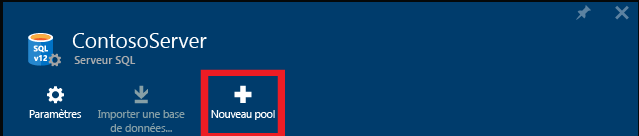
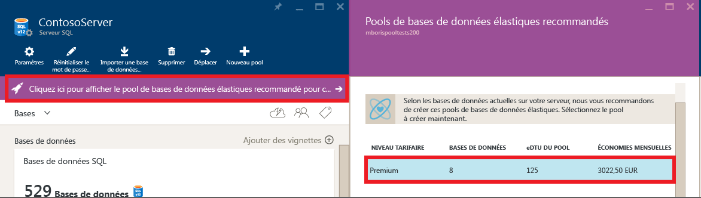
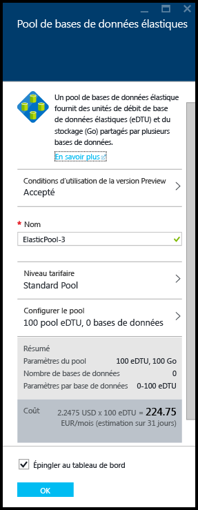
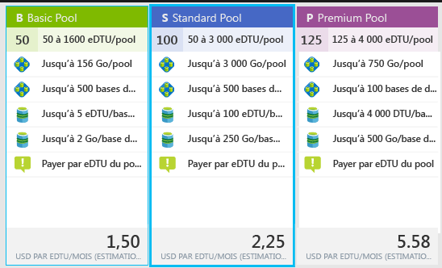
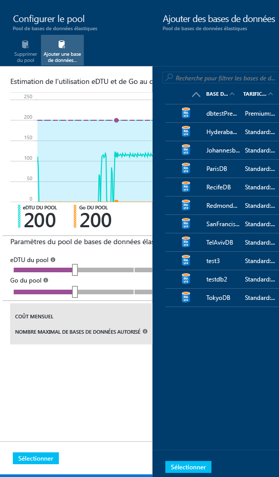
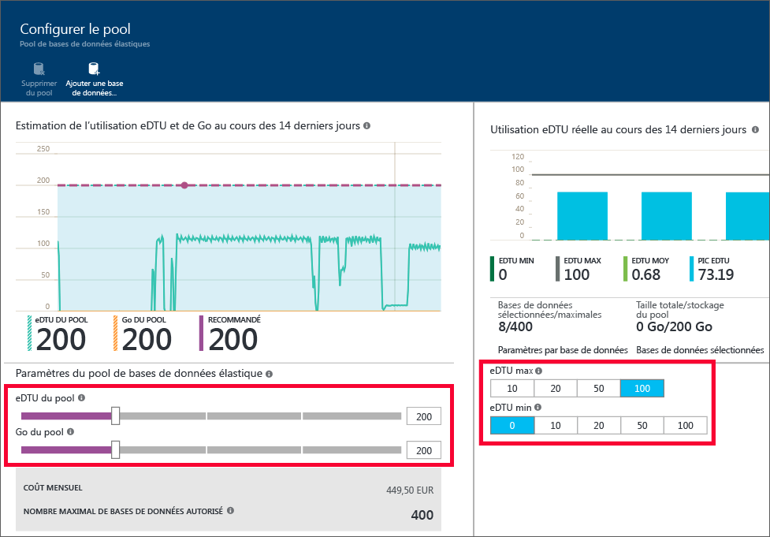

# Créer et gérer un pool élastique avec le Portail Azure
Cette rubrique montre comment créer et gérer des [pools élastiques](sql-database-elastic-pool.md) évolutifs avec le portail Azure. Vous pouvez également créer et gérer un pool élastique Azure avec [PowerShell](sql-database-elastic-pool-manage-powershell.md), l’API REST ou [C#](sql-database-elastic-pool-manage-csharp.md). Vous pouvez également créer et déplacer des bases de données vers et depuis des pools élastiques à l’aide de [Transact-SQL](sql-database-elastic-pool-manage-tsql.md).

## Créer un pool élastique 

Vous pouvez créer un pool élastique de deux façons. Vous pouvez le faire à partir de zéro si vous connaissez la configuration de pool souhaitée ou si vous commencez par une recommandation issue du service. La base de données SQL est dotée d’une intelligence intégrée qui recommande une configuration de pool élastique si cela semble plus économique pour vous en fonction de la dernière télémétrie d’utilisation de vos bases de données.

Vous pouvez créer plusieurs pools sur un serveur, mais il est impossible d’ajouter des bases de données de différents serveurs dans le même pool.

> [!NOTE]
> Les pools élastiques sont mis à la disposition générale dans toutes les régions Azure, à l’exception de l’Inde de l’Ouest, où ils sont actuellement en version préliminaire.  Les pools élastiques seront en disposition générale dès que possible dans cette région.
>
>

### Étape 1 : Créer un pool élastique

Créer un pool élastique à partir d’un panneau **serveur** existant dans le portail est le moyen le plus simple pour déplacer des bases de données existantes dans un pool élastique.

> [!NOTE]
> Vous pouvez également créer un pool élastique en recherchant **pool élastique SQL** sur le **Marketplace** ou en cliquant sur **+Ajouter** dans le panneau de recherche **Pools élastiques SQL**. Ce workflow d’approvisionnement de pool vous permet d’indiquer un nouveau serveur ou un serveur existant.
>
>

1. Dans le [portail Azure](http://portal.azure.com/), cliquez sur **Plus de services** **>** **Serveurs SQL**, puis sur le serveur qui contient les bases de données que vous souhaitez ajouter à un pool élastique.
2. Cliquez sur **Nouveau pool**.

    

    **OU**

    Il se peut qu’un message indiquant que des pools élastiques recommandés sont disponibles pour le serveur s’affiche. Cliquez sur le message pour afficher les pools recommandés en fonction de la télémétrie de l’historique d’utilisation de base de données, puis cliquez sur le niveau pour afficher plus de détails et personnaliser le pool. Consultez la section [Comprendre les recommandations relatives au pool](#understand-pool-recommendations) plus loin dans cette rubrique pour savoir sur quoi repose la recommandation.

    

3. Le panneau **Pool élastique** s’affiche pour vous permettre de spécifier les paramètres de votre pool. Si vous avez cliqué sur **Nouveau pool** à l’étape précédente, le niveau tarifaire par défaut est **Standard** et aucune base de données n’est sélectionnée. Vous pouvez créer un pool vide ou spécifier un ensemble de bases de données existantes à partir de ce serveur, pour les déplacer vers le pool. Si vous créez un pool recommandé, le niveau tarifaire recommandé, les paramètres de performances et la liste des bases de données sont préremplis, mais vous pouvez toujours les modifier.

    

4. Entrez un nom pour le pool élastique, ou conservez la valeur par défaut.

### Étape 2 : sélectionner un niveau tarifaire

Le niveau de tarification du pool détermine les fonctionnalités disponibles pour les bases de données élastiques dans le pool, ainsi que le nombre maximal d'eDTU (eDTU MAX) et le stockage (Go) disponibles pour chaque base de données. Pour plus d’informations, voir Niveaux de service.

Pour modifier le niveau tarifaire du pool, cliquez sur **Niveau tarifaire**, sur le niveau tarifaire de votre choix, puis sur **Sélectionner**.

> [!IMPORTANT]
> Une fois que vous avez choisi le niveau tarifaire et validé vos modifications en cliquant sur **OK** à la dernière étape, vous ne pouvez plus modifier le niveau tarifaire du pool. Pour modifier le niveau de tarification d’un pool élastique existant, créez un pool élastique dans le niveau de tarification souhaité et migrez les bases de données vers ce nouveau pool.
>
>

### Étape 3 : configurer le pool

Après avoir défini le niveau de tarification, cliquez sur Configurer le pool à l’endroit où vous ajoutez des bases de données, définissez la quantité d’eDTU et de stockage (Go de pool), et définissez les nombres minimum et maximum d’eDTU des bases de données élastiques dans le pool.

1. Cliquez sur **Configurer le pool**
2. Sélectionnez les bases de données que vous souhaitez ajouter au pool. Cette étape est facultative lors de la création du pool. Les bases de données peuvent être ajoutées après la création du pool.
    Pour ajouter des bases de données, cliquez sur **Ajouter une base de données** et sur les bases de données que vous voulez ajouter, puis sur le bouton **Sélectionner**.

    

    Si les bases de données que vous utilisez contiennent suffisamment de données de télémétrie d’historique d’utilisation, le graphique **Utilisation estimée des eDTU et des Go** et le graphique à barres **Utilisation effective des eDTU** sont mis à jour pour vous aider à prendre des décisions en termes de configuration. Le service peut également vous envoyer un message de recommandation pour vous aider à rectifier la taille du pool. Voir [Recommandations dynamiques](#dynamic-recommendations).

3. Utilisez les contrôles de la page **Configurer le pool** pour explorer les paramètres et configurer votre pool. Pour plus d’informations sur les limites de chaque niveau de service, consultez l’article décrivant les [limites des pools élastiques](sql-database-elastic-pool.md#edtu-and-storage-limits-for-elastic-pools). Pour obtenir des conseils détaillés sur le dimensionnement approprié d’un pool, consultez l’article fournissant des [considérations sur les prix et performances pour un pool élastique](sql-database-elastic-pool.md). Pour plus d’informations sur les paramètres du pool, consultez [Propriétés du pool élastique](sql-database-elastic-pool.md#database-properties-for-pooled-databases).

    

4. Cliquez sur **Sélectionner** in the **Configure Pool** après avoir modifié des paramètres.
5. Cliquez sur **OK** pour créer le pool.

## Comprendre les recommandations relatives au pool élastique

Le service SQL Database évalue l’historique d’utilisation et recommande un ou plusieurs pools lorsque cela est plus rentable que d’utiliser des bases de données uniques. Chaque recommandation est configurée avec un sous-ensemble unique de bases de données du serveur qui correspond le mieux au pool.

  

La recommandation relative au pool comprend les éléments suivants :

- Niveau tarifaire du pool (De base, Standard, Premium ou Premium RS)
- Valeur **eDTU du pool** appropriée (également appelée eDTU max par pool)
- Paramètres **eDTU max** et **eDTU min** par base de données
- Liste des bases de données recommandées pour le pool

> [!IMPORTANT]
> Le service prend en compte les 30 derniers jours de télémétrie lors de la recommandation de pools. Pour qu’une base de données soit considérée comme candidate à un pool élastique, elle doit exister depuis au moins 7 jours. Les bases de données qui figurent déjà dans un pool élastique ne sont pas considérées comme candidates pour les recommandations de pool élastique.
>

Le service évalue les besoins en ressources et la rentabilité du déplacement des bases de données uniques dans chaque niveau de service vers des pools du même niveau. Par exemple, toutes les bases de données Standard d’un serveur sont évaluées pour leur compatibilité avec un pool élastique Standard. Cela signifie que le service n'effectue aucune recommandation multiniveau telle que le déplacement d'une base de données Standard dans un pool Premium.

Après avoir ajouté des bases de données au pool, des recommandations sont générées de façon dynamique en fonction de l’historique d’utilisation des bases de données que vous avez sélectionnées. Ces recommandations sont affichées dans le graphique d’utilisation d’eDTU et de Go ainsi que dans la bannière de recommandation en haut du panneau **Configurer le pool**. Ces recommandations sont destinées à vous aider à créer un pool élastique optimisé pour vos bases de données spécifiques.

## Gérer et surveiller un pool élastique

Vous pouvez utiliser le portail Azure pour surveiller et gérer un pool élastique et les bases de données du pool. Depuis le portail, vous pouvez surveiller l’utilisation d’un pool élastique et des bases de données que contient ce pool. Vous pouvez également apporter un ensemble de modifications à votre pool élastique et soumettre toutes les modifications en même temps. Ces modifications incluent l’ajout ou la suppression de bases de données, ainsi que le changement des paramètres du pool élastique ou des bases de données.

Le graphique suivant montre un exemple de pool élastique. L’affichage inclut :

*  Des graphiques pour la surveillance de l’utilisation des ressources du pool élastique et des bases de données que contient ce pool.
*  Le bouton **Configurer le pool** pour apporter des modifications au pool élastique.
*  Le bouton **Créer une base de données**, qui crée une base de données et l’ajoute au pool élastique actuel.
*  Des tâches élastiques, qui vous aident à gérer un grand nombre de bases de données en exécutant des scripts Transact SQL sur toutes les bases de données d’une liste.

![Affichage du pool][2]

Vous pouvez accéder à un pool particulier pour consulter l’utilisation des ressources de ce dernier. Par défaut, le pool est configuré pour afficher l’utilisation du stockage et des eDTU au cours de la dernière heure. Le graphique peut être configuré pour afficher d’autres métriques sur différentes plages de temps.

1. Sélectionnez un pool élastique à utiliser.
2. Sous **Surveillance du pool élastique**, vous trouverez un graphique intitulé **Utilisation des ressources**. Cliquez sur ce graphique.

    ![Surveillance du pool élastique][3]

    Le panneau **Métrique** s’ouvre. Celui-ci affiche une vue détaillée des métriques spécifiées sur la plage de temps définie.   

    ![Volet Metric][9]

### Pour personnaliser l’affichage du graphique

Vous pouvez modifier le graphique et le panneau Métrique pour afficher d’autres métriques, telles que le pourcentage d’UC, le pourcentage d’E/S des données et le pourcentage d’E/S des fichiers journaux utilisés.

1. Dans le panneau Métrique, cliquez sur **Modifier**.

    ![Cliquez sur Modifier][6]

2. Dans le panneau **Modifier le graphique**, sélectionnez une plage de temps (dernière heure, aujourd’hui ou semaine dernière) ou cliquez sur **Personnalisé** pour sélectionner la plage de temps de votre choix au cours des deux dernières semaines. Sélectionnez le type de graphique (bâtons ou linéaire), puis sélectionnez les ressources à surveiller.

   > [!Note]
   > Seules les mesures présentant la même unité peuvent figurer simultanément dans le graphique. Par exemple, si vous sélectionnez « Pourcentage eDTU », vous pouvez sélectionner d’autres mesures de pourcentage.
   >

    

3. Cliquez ensuite sur **OK**.

## Gérer et surveiller des bases de données dans un pool élastique

Il est également possible de surveiller des bases de données individuelles pour identifier des problèmes potentiels.

1. Sous **Surveillance de la base de données élastique**, vous trouverez un graphique qui affiche les métriques de cinq bases de données. Par défaut, le graphique affiche les 5 premières bases de données du pool en termes d’utilisation moyenne des eDTU au cours de la dernière heure. Cliquez sur ce graphique.

    ![Surveillance du pool élastique][4]

2. Le panneau **Database resource utilization** (Utilisation des ressources des bases de données) s’affiche. Celui-ci fournit une vue détaillée de l’utilisation des bases de données du pool. À l’aide de la grille dans la partie inférieure du panneau, vous pouvez sélectionner les bases de données du pool de votre choix (jusqu’à 5 bases de données) pour afficher leur utilisation dans le graphique. Vous pouvez également personnaliser les métriques et la plage de temps affichées dans le graphique en cliquant sur **Modifier le graphique**.

    ![Panneau Database Resource Utilization (Utilisation des ressources des bases de données)][8]

### Pour personnaliser l’affichage

1. Dans le panneau **Database Resource Utilization** (Utilisation des ressources des bases de données), cliquez sur **Modifier le graphique**.

    

2. Dans le panneau **Modifier le graphique**, sélectionnez une plage de temps (dernière heure ou dernières 24 heures) ou cliquez sur **Personnalisé** pour sélectionner un autre jour au cours des 2 dernières semaines.

    

3. Cliquez sur la liste déroulante **Compare databases by** (Comparer les bases de données par) pour modifier la métrique à utiliser lors de la comparaison des bases de données.

    

### Pour sélectionner les bases de données à surveiller

Dans la liste de base de données du panneau **Database Resource Utilization** (Utilisation des ressources des bases de données), vous pouvez rechercher des bases de données spécifiques en parcourant les différentes pages ou en tapant leur nom. Activez la case à cocher pour sélectionner la base de données.

![Recherchez les bases de données à surveiller][7]

## Ajouter une alerte à une ressource de pool élastique

Vous pouvez ajouter des règles à un pool élastique qui envoient des messages électroniques à des personnes ou des chaînes d’alertes à des points de terminaison d’URL quand le pool élastique atteint un seuil d’utilisation que vous configurez.

> [!IMPORTANT]
> La surveillance de l’utilisation des ressources pour les pools élastiques subit un décalage d’au moins 20 minutes. La définition d’alertes de moins de 30 minutes pour les pools élastiques n’est actuellement pas prise en charge. Les alertes définies pour les pools élastiques sur une période (paramètre appelé « -WindowSize » dans les API PowerShell) de moins de 30 minutes peuvent ne pas se déclencher. Assurez-vous que les alertes que vous définissez pour les pools élastiques utilisent une période (WindowSize) de 30 minutes ou plus.
>
>

**Pour ajouter une alerte à une ressource :**

1. Cliquez sur le graphique **Utilisation des ressources** pour ouvrir le panneau **Métrique**. Cliquez sur **Ajouter une alerte**, puis renseignez les informations dans le panneau **Ajouter une règle d’alerte** (la valeur **Ressource** est automatiquement définie comme étant le pool que vous utilisez).
2. Saisissez un **nom** et une **description** qui identifient l’alerte pour vous et les destinataires.
3. Choisissez une **métrique** pour l’alerte dans la liste.

    Le graphique affiche dynamiquement l’utilisation des ressources pour cette métrique pour vous aider à choisir un seuil.

4. Choisissez une **condition** (supérieur à, inférieur à, etc.) et un **seuil**.
5. Cliquez sur **OK**.

## Déplacer une base de données dans un pool élastique

Vous pouvez ajouter ou supprimer des bases de données dans un pool existant. Les bases de données peuvent se trouver dans d’autres pools. Toutefois, vous pouvez uniquement ajouter des bases de données qui se trouvent sur le même serveur logique.

1. Dans le panneau du pool, sous **Bases de données élastiques**, cliquez sur **Configurer le pool**.

    ![Cliquez sur Configurer le pool][1]

2. Dans le panneau **Configurer le pool**, cliquez sur **Ajouter au pool**.

    

3. Dans le panneau **Ajouter des bases de données** , sélectionnez les bases de données à ajouter au pool. Puis cliquez sur **Sélectionner**.

    

    Le panneau **Configurer le pool** répertorie maintenant les bases de données sélectionnées à ajouter, avec leur état défini sur **En attente**.

    

3. Dans le panneau **Configurer le pool**, cliquez sur **Enregistrer**.

    

## Déplacer une base de données hors d’un pool élastique

1. Dans le panneau **Configurer le pool** , sélectionnez les bases de données à supprimer.

    

2. Cliquez sur **Supprimer du pool**.

    

    Le panneau **Configurer le pool** répertorie maintenant les bases de données sélectionnées à supprimer, avec leur état défini sur **En attente**.

    

3. Dans le panneau **Configurer le pool**, cliquez sur **Enregistrer**.

    

## Modifier les paramètres de performances d'un pool élastique

Lorsque vous surveillez l’utilisation des ressources d’un pool élastique, vous pouvez constater que certains ajustements sont nécessaires. Les limites de performances ou de stockage du pool ont peut-être besoin d’être modifiées. Vous pouvez aussi vouloir modifier les paramètres des bases de données du pool. Vous pouvez modifier la configuration du pool à tout moment pour obtenir le meilleur compromis entre les performances et le coût. Pour plus d’informations, consultez l’article [Quand utiliser un pool élastique ?](sql-database-elastic-pool.md).

Pour modifier les eDTU ou les limites par pool et les eDTU par base de données :

1. Ouvrez le panneau **Configurer le pool** .

    Dans les **paramètres du pool élastique**, utilisez l’un ou l’autre des curseurs pour modifier les paramètres du pool.

    

2. Lorsque le paramètre change, l’affichage indique le coût mensuel estimé de la modification.

    

## Latence des opérations du pool élastique
* En général, le processus de modification du nombre minimal d’eDTU par base de données ou du nombre maximal d’eDTU par base de données prend 5 minutes au maximum.
* Le processus de modification du nombre d’eDTU par pool dépend quant à lui de la quantité totale d’espace utilisé par toutes les bases de données du pool. Ce processus prend en moyenne 90 minutes au maximum, pour chaque tranche de 100 Go. Par exemple, si l’espace total utilisé par toutes les bases de données du pool est égal à 200 Go, une opération de modification du nombre d’eDTU par pool prend 3 heures au maximum.

## Étapes suivantes

- Pour comprendre ce que représente un pool élastique, consultez [Pool élastique de bases de données SQL](sql-database-elastic-pool.md).
- Pour obtenir de l’aide sur l’utilisation des pools élastiques, consultez [Considérations sur les prix et performances pour les pools élastiques](sql-database-elastic-pool.md).
- Pour utiliser des tâches élastiques afin d'exécuter des scripts Transact-SQL, quel que soit le nombre de bases de données dans le pool, consultez [Vue d’ensemble des tâches de base de données élastiques](sql-database-elastic-jobs-overview.md).
- Pour interroger les bases de données du pool, quel que soit leur nombre, consultez [Vue d’ensemble de l’interrogation d’un pool élastique](sql-database-elastic-query-overview.md).
- Pour interroger les transactions de bases de données, quel que soit leur nombre, consultez [Transactions élastiques](sql-database-elastic-transactions-overview.md).

<!--Image references-->
[1]: ./media/sql-database-elastic-pool-manage-portal/configure-pool.png
[2]: ./media/sql-database-elastic-pool-manage-portal/basic.png
[3]: ./media/sql-database-elastic-pool-manage-portal/basic-2.png
[4]: ./media/sql-database-elastic-pool-manage-portal/basic-3.png
[5]: ./media/sql-database-elastic-pool-manage-portal/elastic-jobs.png
[6]: ./media/sql-database-elastic-pool-manage-portal/edit-metric.png
[7]: ./media/sql-database-elastic-pool-manage-portal/select-dbs.png
[8]: ./media/sql-database-elastic-pool-manage-portal/db-utilization.png
[9]: ./media/sql-database-elastic-pool-manage-portal/metric.png

