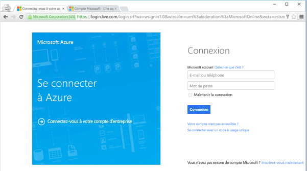
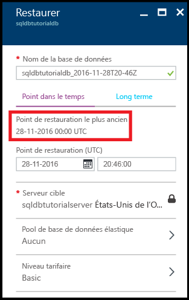
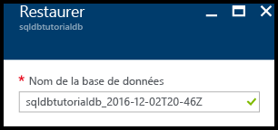
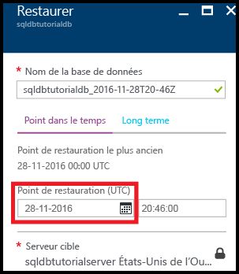
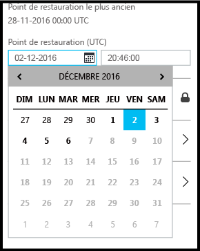
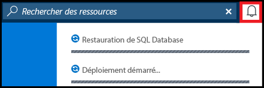
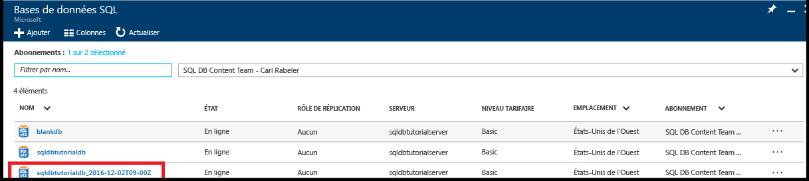
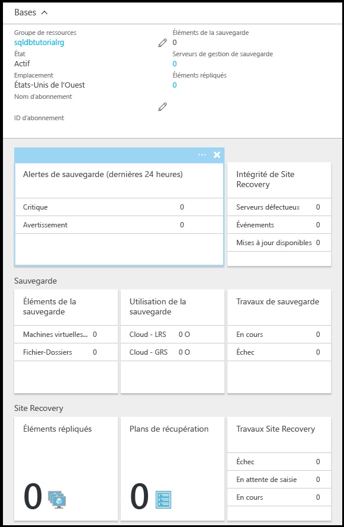

# Prise en main des fonctionnalités de sauvegarde et de restauration pour la protection et la récupération des données
Ce didacticiel de mise en route vous montre comment utiliser le portail Azure pour :

- Visualiser les sauvegardes existantes d’une base de données
- Restaurer une version antérieure d’une base de données
- Configurer la rétention à long terme d’un fichier de sauvegarde de base de données dans le coffre Azure Recovery Services
- Restaurer une base de données à partir du coffre Azure Recovery Services

**Durée estimée** : ce didacticiel vous prendra environ 30 minutes (à condition que vous remplissiez déjà les conditions préalables).

> [!TIP]
> Vous pouvez exécuter les mêmes tâches dans un didacticiel de prise en main à l’aide de [PowerShell](sql-database-get-started-backup-recovery-powershell.md).
>

## Composants requis

* Vous avez besoin d’un compte Azure. Vous pouvez [ouvrir un compte Azure gratuit](/pricing/free-trial/?WT.mc_id=A261C142F) ou [activer les avantages de l’abonnement à Visual Studio](/pricing/member-offers/msdn-benefits-details/?WT.mc_id=A261C142F). 

* Vous devez être en mesure de vous connecter au portail Azure à l’aide d’un compte qui est membre du propriétaire de l’abonnement ou du rôle du collaborateur. Pour plus d’informations sur l’utilisation du contrôle d’accès en fonction du rôle (RBAC), consultez [Prise en main de la gestion des accès dans le portail Azure](../active-directory/role-based-access-control-what-is.md).

* Vous avez exécuté le didacticiel [Prise en main des serveurs Azure SQL Database, des bases de données et des règles de pare-feu à l’aide du portail Azure et de SQL Server Management Studio](sql-database-get-started.md) ou la [version PowerShell](sql-database-get-started-powershell.md) de ce didacticiel. Dans le cas contraire, suivez ce didacticiel préalable ou exécutez le script PowerShell à la fin de la [version PowerShell](sql-database-get-started-powershell.md) de ce didacticiel avant de continuer.

> [!NOTE]
> Ce didacticiel vous permet de vous informer sur le contenu des rubriques d’apprentissage suivantes : [sauvegardes de bases de données SQL](sql-database-automated-backups.md), [rétention de sauvegarde à long terme](sql-database-long-term-retention.md), et [récupération d’une base de données SQL Azure à l’aide de sauvegardes automatisées](sql-database-recovery-using-backups.md).
>  

## Se connecter au portail Azure avec un compte Azure
À l’aide de votre [abonnement existant](https://account.windowsazure.com/Home/Index), suivez ces étapes pour vous connecter au portail Azure.

1. Ouvrez votre navigateur préféré et connectez-vous au [portail Azure](https://portal.azure.com/).
2. Connectez-vous au [portail Azure](https://portal.azure.com/).
3. Dans la page **de connexion** , entrez les informations d’identification de votre abonnement.
   
   

## Visualiser le point de restauration le plus ancien à partir des sauvegardes d’une base de données générées par le service

Dans cette section du didacticiel, vous visualisez les informations relatives au point de restauration le plus ancien à partir des [sauvegardes automatisées générées par le service](sql-database-automated-backups.md) de votre base de données. 

1. Ouvrez le panneau **Base de données SQL** pour votre base de données, **sqldbtutorialdb**.

   

2. Dans la barre d’outils, cliquez sur **Restaurer**.

   

3. Dans le panneau Restaurer, examinez le point de restauration le plus ancien.

   

## Restaurer une version antérieure d’une base de données

Dans cette section du didacticiel, vous restaurez la version antérieure d’une base de données sous la forme d’une nouvelle base de données.

1. Dans le panneau **Restaurer** de la base de données, examinez le nom par défaut de la nouvelle base de données correspondant à la version antérieure restaurée de votre base de données (ce nom correspond au nom de base de données existant suivi d’un horodateur). Ce nom change afin de refléter la date et l’heure que vous allez spécifier dans le cadre des étapes suivantes.

   

2. Cliquez sur l’icône **Calendrier** dans la zone d’entrée **Point de restauration (UTC)**.

   

2. Dans le calendrier, sélectionnez une date comprise dans la période de rétention.

   

3. Dans la zone d’entrée **Point de restauration (UTC)**, spécifiez l’heure de la date sélectionnée dont vous souhaitez restaurer les données de la base de données à partir des sauvegardes de base de données automatisées.

   

   >[!NOTE]
   >Notez que le nom de la base de données a changé pour refléter la date et l’heure que vous avez sélectionnées. Notez également que vous ne pouvez pas changer le serveur sur lequel vous restaurez une version antérieure spécifique de la base de données. Pour restaurer la base de données sur un autre serveur, utilisez la [restauration géographique](sql-database-disaster-recovery.md#recover-using-geo-restore). Enfin, notez que vous pouvez restaurer la base de données dans un [pool élastique](sql-database-elastic-jobs-overview.md) ou pour un autre niveau tarifaire. 
   >

4. Cliquez sur **OK** pour restaurer cette version antérieure de votre base de données sous la forme d’une nouvelle base de données.

5. Dans la barre d’outils, cliquez sur l’icône de notification pour visualiser l’état du travail de restauration.

   

6. Lorsque le travail de restauration est terminé, ouvrez le panneau **Bases de données SQL** pour visualiser la base de données nouvellement restaurée.

   

> [!NOTE]
> À ce stade, vous pouvez vous connecter à la base de données restaurée à l’aide de SQL Server Management Studio pour exécuter les tâches nécessaires, notamment pour [extraire un bit de données de la base de données restaurée à copier dans la base de données existante ou pour supprimer la base de données existante et renommer la base de données restaurée avec le nom de la base de données existante](sql-database-recovery-using-backups.md#point-in-time-restore).
>

## Configurer la rétention à long terme des sauvegardes automatisées dans un coffre Azure Recovery Services 

Dans cette section du didacticiel, vous [configurez un coffre Azure Recovery Services de façon à conserver des sauvegardes automatisées](sql-database-long-term-retention.md) sur une période plus longue que la période de rétention associée à votre niveau de service. 

> [!TIP]
> Pour supprimer des sauvegardes, consultez [Delete long-term retention backups (Supprimer les sauvegardes de rétention à long terme)](sql-database-long-term-retention-delete.md).
>

1. Ouvrez le panneau **SQL Server** pour votre serveur, **sqldbtutorialserver**.

   

2. Cliquez sur **Long-term backup retention (Rétention des sauvegardes à long terme)**.

   

3. Dans le panneau **sqldbtutorial - Long-term backup retention (Rétention des sauvegardes à long terme)**, examinez et acceptez les conditions d’utilisation de la version préliminaire (à moins que vous ne l’ayez déjà fait ou que cette fonctionnalité ne soit plus disponible dans la version préliminaire).

   

4. Pour configurer la rétention des sauvegardes à long terme pour la base de données sqldbtutorialdb, sélectionnez cette base de données dans la grille, puis cliquez sur **Configurer** dans la barre d’outils.

   

5. Dans le panneau **Configurer**, cliquez sur **Configurer les paramètres requis** sous **Coffre Recovery Services**.

   

6. Dans le panneau **Coffre Recovery Services**, sélectionnez un éventuel coffre existant. Dans le cas contraire, si aucun coffre Recovery Services n’a été trouvé pour votre abonnement, cliquez pour quitter le flux, puis créez un coffre Recovery Services.

   

7. Dans le panneau **Coffres Recovery Services**, cliquez sur **Ajouter**.

   
   
8. Dans le panneau **Coffre Recovery Services**, fournissez un nom valide pour le nouveau coffre Recovery Services.

   

9. Sélectionnez votre abonnement et votre groupe de ressources, puis sélectionnez l’emplacement du coffre. Une fois que vous avez terminé, cliquez sur **Créer**.

   

   > [!IMPORTANT]
   > Le coffre doit se trouver dans la même région que le serveur logique SQL Azure et doit utiliser le même groupe de ressources que le serveur logique.
   >

10. Une fois le nouveau coffre créé, exécutez les étapes nécessaires pour revenir au panneau **Coffre Recovery Services**.

11. Dans le panneau **Coffre Recovery Services**, cliquez sur le coffre, puis sur **Sélectionner**.

   

12. Dans le panneau **Configurer**, fournissez un nom valide pour la nouvelle stratégie de rétention, modifiez la stratégie de rétention par défaut à votre convenance, puis cliquez sur **OK**.

   

13. Dans le panneau **sqldbtutorial - Long-term backup retention (Rétention des sauvegardes à long terme)**, cliquez sur **Enregistrer**, puis sur **OK** pour appliquer la stratégie de rétention des sauvegardes à long terme à toutes les bases de données sélectionnées.

   

14. Cliquez sur **Enregistrer** pour activer la rétention des sauvegardes à long terme à l’aide de cette nouvelle stratégie dans le coffre Azure Recovery Services que vous avez configuré.

   

15. Une fois la rétention des sauvegardes à long terme activée, ouvrez le panneau **sqldbtutorialvault** (accédez à **Toutes les ressources**, puis sélectionnez cette entrée dans la liste des ressources de votre abonnement).

   

> [!IMPORTANT]
> Une fois configurées, les sauvegardes s’affichent dans le coffre dans les sept jours qui suivent. Ne poursuivez pas ce didacticiel tant que les sauvegardes n’apparaissent pas dans le coffre.
>

## Visualiser les sauvegardes de la rétention à long terme

Dans cette section du didacticiel, vous visualisez les informations relatives à vos sauvegardes de base de données dans la fonctionnalité de [rétention des sauvegardes à long terme](sql-database-long-term-retention.md). 

1. Ouvrez le panneau **sqldbtutorialvault** (accédez à **Toutes les ressources**, puis sélectionnez cette entrée dans la liste des ressources de votre abonnement) pour visualiser la quantité de stockage utilisée par vos sauvegardes de base de données dans le coffre.

   

2. Ouvrez le panneau **Base de données SQL** pour votre base de données, **sqldbtutorialdb**.

   

3. Dans la barre d’outils, cliquez sur **Restaurer**.

   

4. Dans le panneau Restaurer, cliquez sur **À long terme**.

5. Sous Azure vault backups (Sauvegardes de coffre Azure), cliquez sur **Sélectionner une sauvegarde** pour visualiser les sauvegardes de base de données disponibles dans la rétention des sauvegardes à long terme.

   

## Restaurer une base de données à partir d’une sauvegarde dans la rétention des sauvegardes à long terme

Dans cette section du didacticiel, vous restaurez la base de données sous la forme d’une nouvelle base de données à partir d’une sauvegarde dans le coffre Azure Recovery Services.

1. Dans le panneau **Azure vault backups (Sauvegardes de coffre Azure)**, cliquez sur la sauvegarde à restaurer, puis cliquez sur **Sélectionner**.

   

2. Dans la zone de texte **Nom de la base de données**, fournissez le nom de la base de données restaurée.

   

3. Cliquez sur **OK** pour restaurer votre base de données à partir de la sauvegarde dans le coffre sous la forme d’une nouvelle base de données.

4. Dans la barre d’outils, cliquez sur l’icône de notification pour visualiser l’état du travail de restauration.

   

5. Lorsque le travail de restauration est terminé, ouvrez le panneau **Bases de données SQL** pour visualiser la base de données nouvellement restaurée.

   

> [!NOTE]
> À ce stade, vous pouvez vous connecter à la base de données restaurée à l’aide de SQL Server Management Studio pour exécuter les tâches nécessaires, notamment pour [extraire un bit de données de la base de données restaurée à copier dans la base de données existante ou pour supprimer la base de données existante et renommer la base de données restaurée avec le nom de la base de données existante](sql-database-recovery-using-backups.md#point-in-time-restore).
>

## Étapes suivantes

- Pour plus d’informations sur les sauvegardes automatiques générées par le service, consultez l’article relatif aux [sauvegardes automatiques](sql-database-automated-backups.md).
- Pour plus d’informations sur la rétention des sauvegardes à long terme, consultez l’article décrivant la [rétention des sauvegardes à long terme](sql-database-long-term-retention.md).
- Pour plus d’informations sur la restauration à partir de sauvegardes, consultez l’article concernant la [restauration à l’aide de sauvegardes](sql-database-recovery-using-backups.md).

<!--HONumber=Jan17_HO2-->

