<properties
	pageTitle="Didacticiel sur la base de données SQL : Créer une base de données SQL | Microsoft Azure"
	description="Découvrez comment configurer un serveur logique SQL Database, une règle de pare-feu de serveur, une base de données SQL et des exemples de données. Apprenez également à vous connecter avec les outils clients, à configurer des utilisateurs et à définir une règle de pare-feu de base de données."
	keywords="didacticiel sur la base de données sql, créer une base de données sql"
	services="sql-database"
	documentationCenter=""
	authors="CarlRabeler"
	manager="jhubbard"
	editor=""/>

<tags
	ms.service="sql-database"
	ms.workload="data-management"
	ms.tgt_pltfrm="na"
	ms.devlang="na"
	ms.topic="hero-article"
	ms.date="09/07/2016"
	ms.author="carlrab"/>

# Didacticiel sur SQL Database : Créer une base de données SQL en quelques minutes à l’aide du portail Azure

> [AZURE.SELECTOR]
- [Portail Azure](sql-database-get-started.md)
- [C#](sql-database-get-started-csharp.md)
- [PowerShell](sql-database-get-started-powershell.md)

Ce didacticiel vous montre comment utiliser le Portail Azure pour :

- Créer une base de données Azure SQL Database avec des exemples de données.
- créer une règle de pare-feu au niveau du serveur pour une seule adresse IP ou une plage d’adresses IP.

Vous pouvez exécuter les mêmes tâches à l’aide de [C#](sql-database-get-started-csharp.md) ou de [PowerShell](sql-database-get-started-powershell.md).

[AZURE.INCLUDE [Connexion](../../includes/azure-getting-started-portal-login.md)]

## Créer votre première base de données SQL Azure 

1. Si ce n’est pas déjà fait, connectez-vous au [portail Azure](http://portal.azure.com).
2. Cliquez sur **Nouveau**, cliquez sur **Données + stockage**, puis recherchez **SQL Database**.

    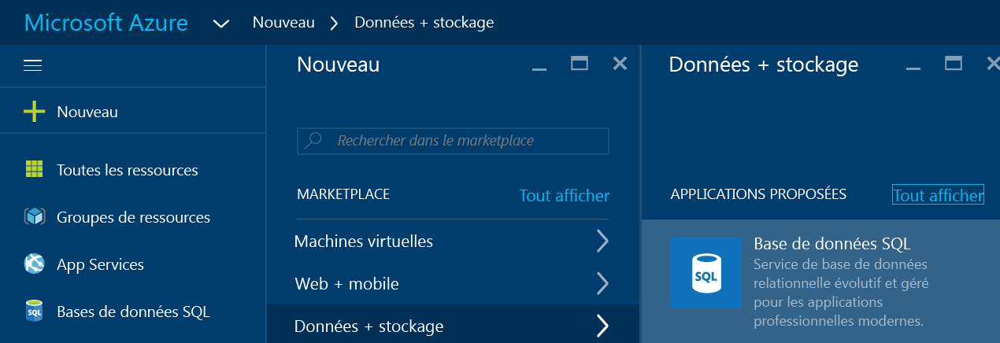

3. Cliquez sur **SQL Database** pour ouvrir le panneau SQL Database. Le contenu de ce panneau varie selon le nombre de vos abonnements et vos objets existants (tels que les serveurs existants).

    

4. Dans la zone de texte **Nom de la base de données**, entrez un nom pour votre première base de données, tel que « ma-base-de-données ». Une coche verte indique que vous avez fourni un nom valide.

    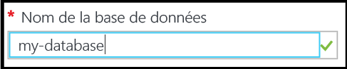

5. Si vous avez plusieurs abonnements, sélectionnez-en un.
6. Sous **Groupe de ressources**, cliquez sur **Créer** et fournissez un nom pour votre premier groupe de ressources, tel que « mon-groupe-de-ressources ». Une coche verte indique que vous avez fourni un nom valide.

    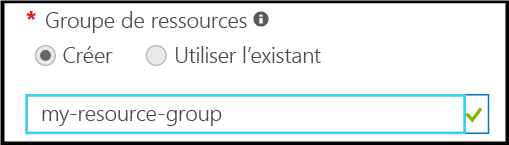

7. Sous **Sélectionner une source**, cliquez sur **Exemple** puis, sous **Sélectionner un exemple**, cliquez sur **AdventureWorksLT [V12]**.

    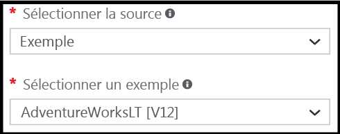

8. Sous **Serveur**, cliquez sur **Configurer les paramètres requis**.

    

9. Dans le panneau du serveur, cliquez sur **Créer un serveur**. Une base de données Azure SQL Database est créée au sein d’un objet serveur, qui peut être un nouveau serveur ou un serveur existant.

    

10. Examinez le panneau **Nouveau serveur** pour mieux comprendre les informations que vous devez fournir pour votre nouveau serveur.

    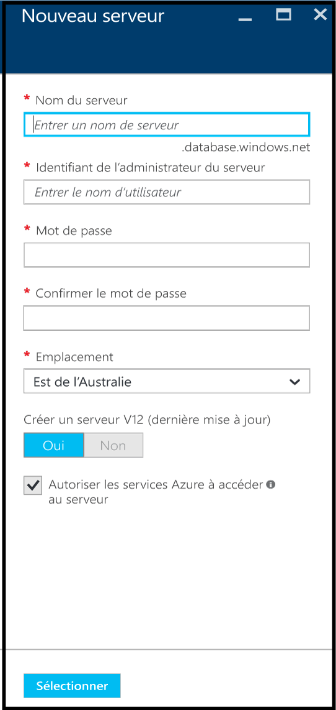

11. Dans la zone de texte **Nom du serveur**, entrez un nom pour votre premier serveur, tel que « mon-nouvel-objet-serveur ». Une coche verte indique que vous avez fourni un nom valide.

    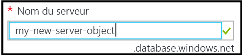
 
12. Sous **Connexion d’administrateur serveur**, fournissez un nom d’utilisateur pour la connexion d’administrateur pour ce serveur - par exemple « mon-compte-admin ». Cette connexion est connue comme la connexion principale du serveur. Une coche verte indique que vous avez fourni un nom valide.

    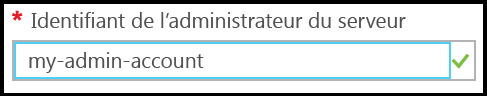

13. Sous **Mot de passe** et **Confirmer le mot de passe**, fournissez un mot de passe pour le compte de connexion principal du serveur, tel que « p@ssw0rd1 ». Une coche verte indique que vous avez fourni un mot de passe valide.

    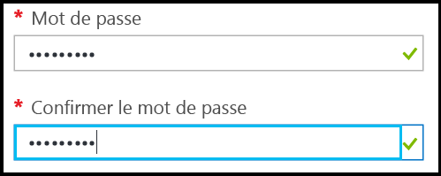
 
14. Sous **Emplacement**, sélectionnez un centre de données correspondant à votre emplacement, tel que « Est de l’Australie ».

    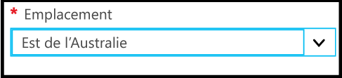

15. Sous **Créer le serveur V12 (Dernière mise à jour), notez que vous avez uniquement la possibilité de créer une version actuelle du serveur SQL Azure.

    

16. Notez que, par défaut, la case **Autoriser les services Azure à accéder au serveur** est sélectionnée et ne peut pas être modifiée ici. Il s’agit d’une option avancée. Vous pouvez modifier ce paramètre dans les paramètres de pare-feu du serveur pour cet objet serveur, bien que, pour la plupart des scénarios, cela ne soit pas nécessaire.

    

17. Dans le panneau Nouveau serveur, vérifiez vos sélections, puis cliquez sur **Sélectionner** pour sélectionner ce nouveau serveur pour votre nouvelle base de données.

    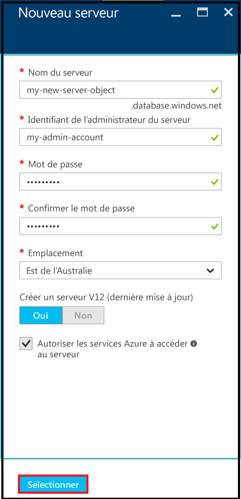

18. Dans le panneau SQL Database, sous **Niveau tarifaire**, cliquez sur **Standard S2**, puis cliquez sur **De base** pour choisir le niveau tarifaire le moins coûteux de votre première base de données. Vous pouvez toujours modifier le niveau tarifaire ultérieurement.

    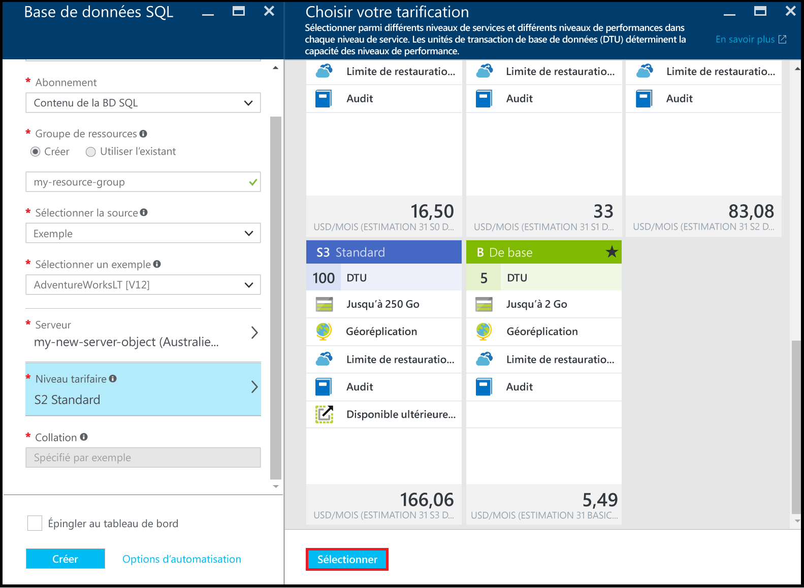

19. Dans le panneau SQL Database, passez en revue vos sélections, puis cliquez sur **Créer** pour créer votre premier serveur et votre première base de données. Les valeurs que vous avez fournies sont validées et le déploiement commence.

    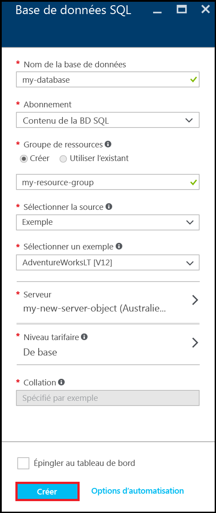

20. Dans la barre d’outils du Portail, cliquez sur les éléments **Notifications** pour vérifier l’état de votre déploiement.

    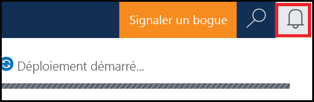

>[AZURE.IMPORTANT]Lorsque le déploiement est terminé, votre serveur et votre base de données SQL Azure sont créés dans Azure. Vous ne pourrez pas vous connecter à votre nouveau serveur ou à votre nouvelle base de données à l’aide des outils SQL Server jusqu’à ce que vous créiez une règle de pare-feu de serveur pour ouvrir le pare-feu de SQL Database aux connexions extérieures à Azure.

[AZURE.INCLUDE [Créer une règle de pare-feu de serveur](../../includes/sql-database-create-new-server-firewall-portal.md)]

## Étapes suivantes
Maintenant que vous avez terminé ce didacticiel sur SQL Database et que vous avez créé une base de données avec des exemples de données, vous êtes prêt pour l’exploration à l’aide de vos outils préférés.

- Si vous êtes familiarisé avec Transact-SQL et SQL Server Management Studio (SSMS), découvrez comment [connecter et interroger une base de données SQL avec SSMS](sql-database-connect-query-ssms.md).

- Si vous connaissez Excel, découvrez comment [vous connecter à une base de données SQL dans Azure avec Excel](sql-database-connect-excel.md).

- Si vous êtes prêt à commencer le codage, choisissez votre langage de programmation dans [Bibliothèques de connexions pour SQL Database et SQL Server](sql-database-libraries.md).

- Si vous souhaitez déplacer vos bases de données SQL Server locales vers Azure, consultez la page [Migration de base de données SQL Server vers SQL Database dans le cloud](sql-database-cloud-migrate.md) pour plus d’informations.

- Si vous souhaitez charger des données dans une nouvelle table à partir d’un fichier CSV avec l’outil de ligne de commande BCP, consultez la page [Chargement de données dans une base de données SQL à partir d’un fichier CSV à l’aide de BCP](sql-database-load-from-csv-with-bcp.md).

- Si vous souhaitez commencer à Explorer la sécurité Azure SQL Database, consultez [Prise en main de la sécurité](sql-database-get-started-security.md)

## Ressources supplémentaires

[Définition de la base de données SQL](sql-database-technical-overview.md)

<!---HONumber=AcomDC_0914_2016-->