# <a name="get-started-with-azure-sql-database-servers-databases-and-firewall-rules-by-using-the-azure-portal-and-sql-server-management-studio"></a>Prise en main des serveurs Azure SQL Database, des bases de données et des règles de pare-feu à l’aide du portail Azure et de SQL Server Management Studio

Ce didacticiel de mise en route vous montre comment utiliser le portail Azure pour :

* créer un groupe de ressources Azure ;
* créer un serveur logique Azure SQL ;
* afficher les propriétés de serveur logique Azure SQL ;
* créer une règle de pare-feu au niveau du serveur ;
* créer l’exemple de base de données Adventure Works LT ;
* afficher les propriétés de l’exemple de base de données Adventure Works LT dans Azure.

Dans ce didacticiel, vous utilisez également la version la plus récente de SQL Server Management Studio pour :

* se connecter au serveur logique et à sa base de données master ;
* afficher les propriétés de la base de données master ;
* se connecter à l’exemple de base de données ;
* afficher les propriétés de la base de données utilisateur.

Lorsque vous aurez terminé ce didacticiel, vous aurez un exemple de base de données et une base de données vide en cours d’exécution dans un groupe de ressources Azure et attachés à un serveur logique. Vous aurez également une règle de pare-feu de niveau serveur configurée pour permettre au principal de niveau serveur de se connecter au serveur à partir d’une adresse IP spécifiée (ou d’une plage d’adresses IP). 

**Durée estimée** : ce didacticiel vous prendra environ 30 minutes (en supposant que vous remplissez déjà les conditions préalables).

## <a name="prerequisites"></a>Composants requis

* Vous avez besoin d’un compte Azure. Vous pouvez [ouvrir un compte Azure gratuit](/pricing/free-trial/?WT.mc_id=A261C142F) ou [activer les avantages de l’abonnement à Visual Studio](/pricing/member-offers/msdn-benefits-details/?WT.mc_id=A261C142F). 

* Vous devez être en mesure de vous connecter au portail Azure à l’aide d’un compte qui est membre du propriétaire de l’abonnement ou du rôle du collaborateur. Pour plus d’informations sur l’utilisation du contrôle d’accès en fonction du rôle (RBAC), consultez [Prise en main de la gestion des accès dans le portail Azure](../active-directory/role-based-access-control-what-is.md).

> [!TIP]
> Vous pouvez exécuter les mêmes tâches dans un didacticiel de prise en main à l’aide de [C#](sql-database-get-started-csharp.md) ou de [PowerShell](sql-database-get-started-powershell.md).
>

### <a name="sign-in-by-using-your-existing-account"></a>Connexion à l’aide de votre compte existant
À l’aide de votre [abonnement existant](https://account.windowsazure.com/Home/Index), suivez ces étapes pour vous connecter au portail Azure.

1. Ouvrez votre navigateur préféré et connectez-vous au [portail Azure](https://portal.azure.com/).
2. Connectez-vous au [portail Azure](https://portal.azure.com/).
3. Dans la page **de connexion** , entrez les informations d’identification de votre abonnement.
   
   


<a name="create-logical-server-bk"></a>

## <a name="create-a-new-logical-sql-server-in-the-azure-portal"></a>Créer un serveur SQL logique dans le portail Azure

1. Cliquez sur **Nouveau**, saisissez **sql server**, puis cliquez sur **ENTRÉE**.

    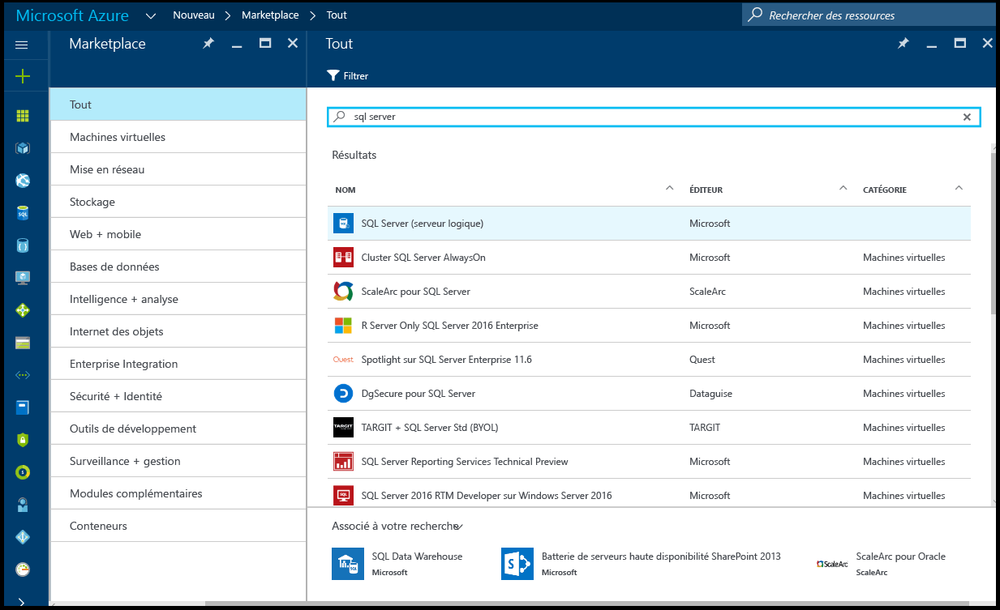
2. Cliquez sur **Serveur SQL Server (serveur logique)**.
   
    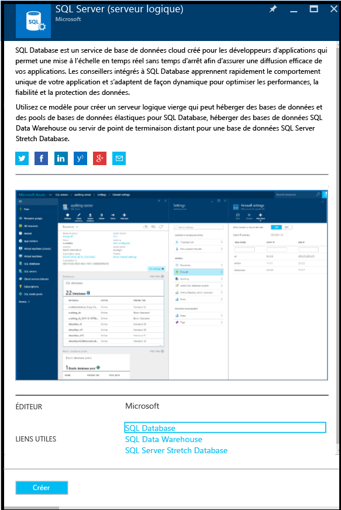
3. Cliquez sur **Créer** pour ouvrir le nouveau panneau Serveur SQL Server (serveur logique).

    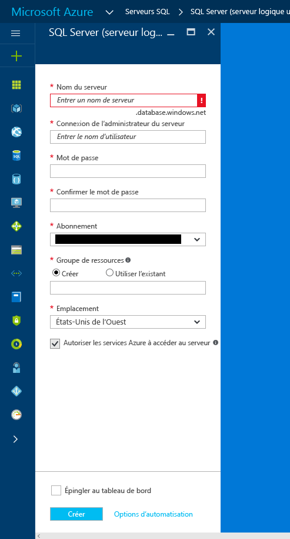
3. Dans la zone de texte Nom du serveur, indiquez un nom valide pour le nouveau serveur logique. Une coche verte indique que vous avez fourni un nom valide.
    
    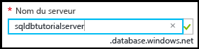

    > [!IMPORTANT]
    > Le nom complet de votre nouveau serveur sera <votre_nom_serveur>.database.windows.net.
    >
    
4. Dans la zone de texte serveur de connexion administrateur du serveur, fournissez un nom d’utilisateur pour la connexion d’authentification SQL de ce serveur. Cette connexion est connue comme la connexion principale du serveur. Une coche verte indique que vous avez fourni un nom valide.
    
    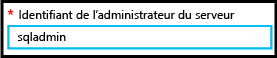
5. Dans les zones de texte **Mot de passe** et **Confirmer le mot de passe**, fournissez un mot de passe pour le compte de connexion principal du serveur. Une coche verte indique que vous avez fourni un mot de passe valide.
    
    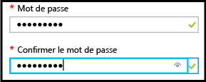
6. Sélectionnez un abonnement dans lequel vous êtes autorisé à créer des objets.

    
7. Dans la zone de texte Groupe de ressources, sélectionnez **Créer**, puis dans la zone de texte Groupe de ressources, fournissez un nom valide pour le nouveau groupe de ressources (vous pouvez également utiliser un groupe de ressources existant si vous en avez déjà créé un pour vous-même). Une coche verte indique que vous avez fourni un nom valide.

    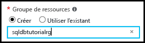

8. Dans la zone de texte **Emplacement**, sélectionnez un centre de données approprié à votre emplacement, tel que « Est de l’Australie ».
    
    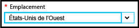
    
    > [!TIP]
    > La case à cocher **Autoriser les services Azure à accéder au serveur** ne peut pas être modifiée dans ce panneau. Vous pouvez modifier ce paramètre dans le panneau de pare-feu du serveur. Pour plus d'informations, consultez [Prise en main de la sécurité](sql-database-get-started-security.md).
    >
    
9. Cliquez sur **Create**.

    

## <a name="view-the-logical-sql-server-properties-in-the-azure-portal"></a>Afficher les propriétés de serveur logique SQL Server dans le portail Azure

1. Dans le portail Azure, cliquez sur **More services** (Plus de services).

    
2. Dans la zone de texte de filtre, tapez **SQL**, puis cliquez sur l’étoile pour les serveurs SQL afin de spécifier les serveurs SQL comme favoris dans Azure. 

    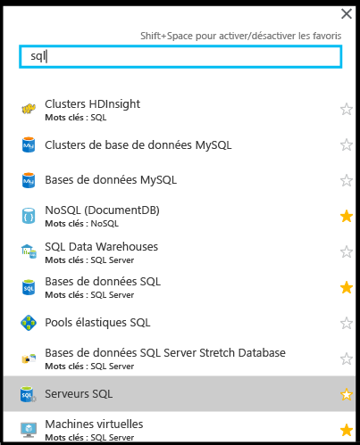
3. Dans le panneau par défaut, cliquez sur **Serveurs SQL** pour ouvrir la liste des serveurs SQL dans votre abonnement Azure. 

    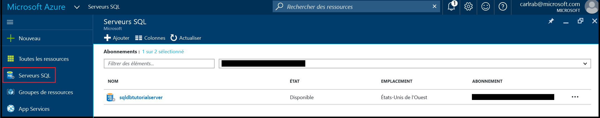

4. Cliquez sur votre nouveau serveur SQL pour afficher ses propriétés dans le portail Azure. Les didacticiels suivants vous aident à comprendre les options disponibles dans ce panneau.

    
5. Sous Paramètres, cliquez sur **Propriétés** pour afficher les différentes propriétés du serveur logique SQL.

    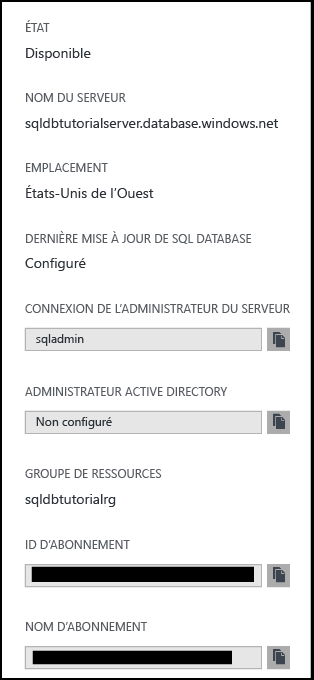
6. Copiez le nom de serveur complet dans le Presse-papiers pour une utilisation ultérieure dans ce didacticiel.

    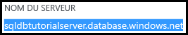

## <a name="create-a-server-level-firewall-rule-in-the-azure-portal"></a>Créer une règle de pare-feu au niveau du serveur dans le portail Azure

1. Dans le panneau SQL Server, sous Paramètres, cliquez sur **Pare-feu** pour ouvrir le panneau de pare-feu pour le serveur SQL Server.

    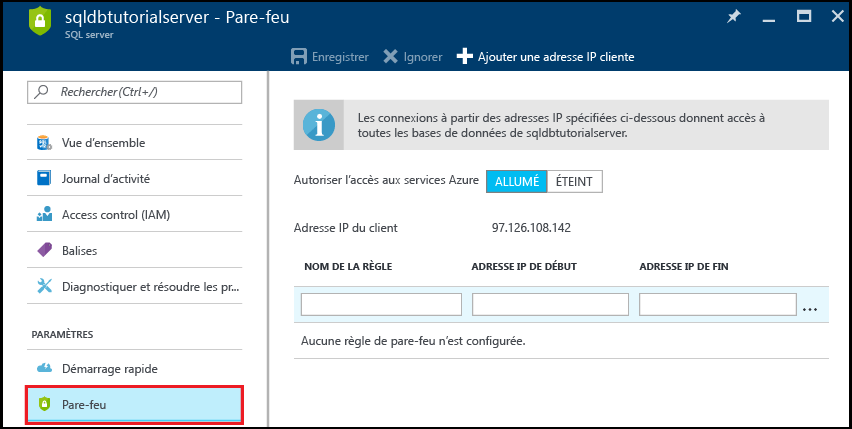

2. Vérifiez l’adresse IP du client affichée et confirmez qu’il s’agit de votre adresse IP sur Internet à l’aide du navigateur de votre choix (demandez « quelle est mon adresse IP »). Parfois, elles ne correspondent pas pour diverses raisons.

    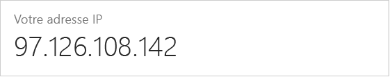

3. En supposant que les adresses IP correspondent, cliquez sur **Ajouter une adresse IP cliente** sur la barre d’outils.

    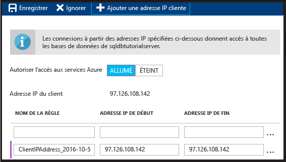

    > [!NOTE]
    > Vous pouvez ouvrir le pare-feu SQL Database sur le serveur pour une adresse IP unique ou un ensemble d’adresses. Ouvrir le pare-feu permet aux administrateurs et utilisateurs SQL de se connecter à toute base de données sur le serveur pour laquelle ils disposent d’informations d’identification valides.
    >

4. Cliquez sur **Enregistrer** sur la barre d’outils pour enregistrer cette règle de pare-feu de niveau serveur, puis sur **OK**.

    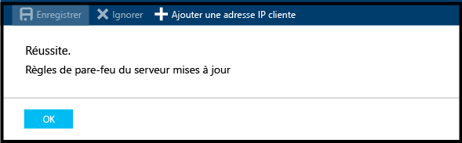

## <a name="connect-to-sql-server-using-sql-server-management-studio-ssms"></a>Se connecter au serveur SQL Server à l’aide de SQL Server Management Studio (SSMS)

1. Si ce n’est déjà fait, téléchargez et installez la dernière version de SSMS via [Téléchargement de SQL Server Management Studio](https://msdn.microsoft.com/library/mt238290.aspx). Pour vous permettre de rester à jour, la dernière version de SSMS vous envoie une invite lorsqu’une nouvelle version est disponible au téléchargement.

2. Une fois l’installation terminée, tapez **Microsoft SQL Server Management Studio** dans la zone de recherche de Windows, puis cliquez sur **Entrée** pour ouvrir SSMS :

    
3. Dans la boîte de dialogue Se connecter au serveur, entrez les informations nécessaires pour vous connecter à votre serveur SQL Server à l’aide de l’authentification SQL Server.

    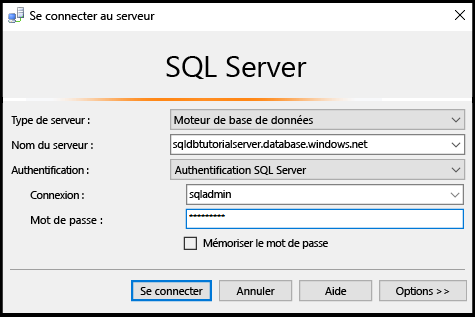
4. Cliquez sur **Connecter**.

    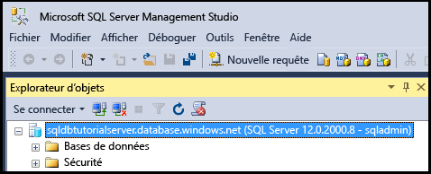
5. Dans l’Explorateur d’objets, développez **Bases de données**, **Bases de données système** et **Master** pour afficher les objets dans la base de données master.

    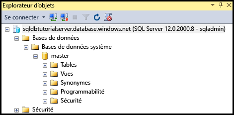
6. Cliquez avec le bouton droit sur **Master**, puis cliquez sur **Nouvelle requête**.

    

8. Dans la fenêtre de requête, saisissez la requête suivante :

   ```select * from sys.objects```

9.  Dans la barre d’outils, cliquez sur **Exécuter** pour retourner une liste de tous les objets système dans la base de données master.

    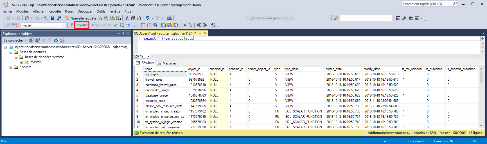

    > [!NOTE]
    > Pour explorer la sécurité SQL, consultez [Prise en main de la sécurité](sql-database-get-started-security.md).
    >

## <a name="create-new-database-in-the-azure-portal-using-adventure-works-lt-sample"></a>Créer une base de données dans le portail Azure à l’aide de l’exemple Adventure Works LT

1. Dans le portail Azure, cliquez sur **SQL databases** dans le panneau par défaut.

    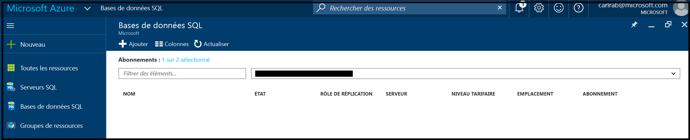
2. Dans le panneau de bases de données SQL, cliquez sur **Ajouter**.

    
3. Dans le panneau de base de données SQL, examinez les informations remplies à votre place.

    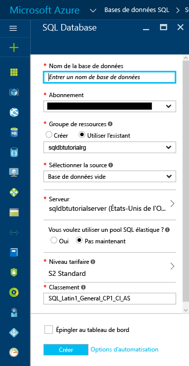
4. Fournissez un nom de base de données valide.

    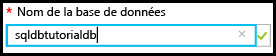
5. Sous Sélectionner une source, cliquez sur **Exemple**, puis sous Sélectionner un exemple, cliquez sur **AdventureWorksLT [V12]**.
   
    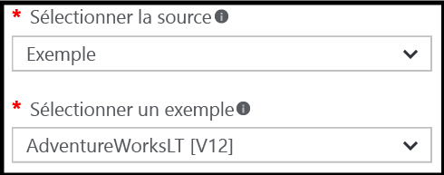
6. Sous Serveur, fournissez le nom d’utilisateur et le mot de passe admin de connexion du serveur.

    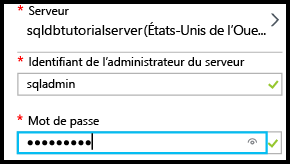

    > [!NOTE]
    > Lorsque vous ajoutez une base de données à un serveur, elle peut être ajoutée en tant que base de données unique (valeur par défaut) ou à un pool élastique SQL. Pour plus d’informations sur les pools élastiques, consultez [Pools élastiques](sql-database-elastic-pool.md).
    >

7. Sous Niveau tarifaire, changez le niveau de tarification pour choisir **De base** (vous pouvez augmenter le niveau de tarification ultérieurement si vous le souhaitez, mais à des fins d’apprentissage, nous vous recommandons d’utiliser le niveau de coût le plus bas).

    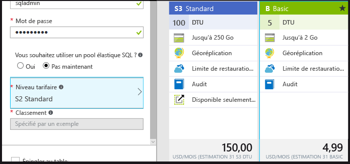
8. Cliquez sur **Create**.

    

## <a name="view-database-properties-in-the-azure-portal"></a>Afficher les propriétés de la base de données dans le portail Azure

1. Dans le panneau de bases de données SQL, cliquez sur votre nouvelle base de données pour afficher ses propriétés dans le portail Azure. Les didacticiels suivants vous aident à comprendre les options disponibles dans ce panneau. 

    
2. Cliquez sur **Propriétés** pour afficher des informations supplémentaires sur votre base de données.

    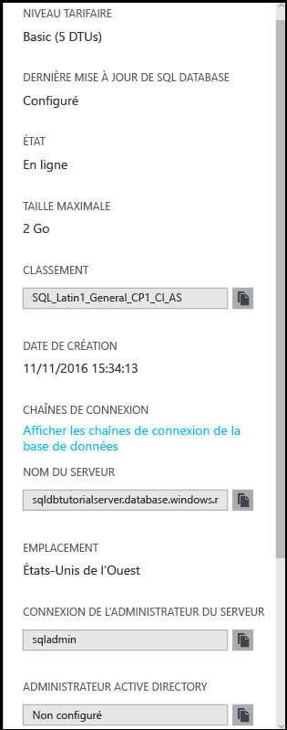

3. Cliquez sur **Afficher les chaînes de connexion de la base de données**.

    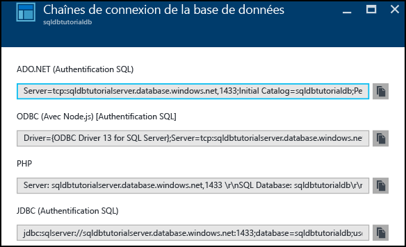
4. Cliquez sur **Vue d’ensemble**, puis cliquez sur le nom de votre serveur dans le volet Essentials.
    
    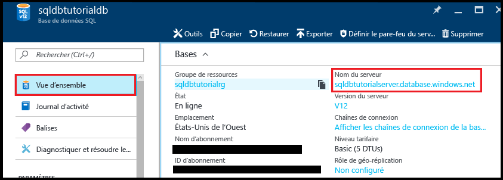
5. Dans le volet Essentials pour votre serveur, vous pouvez voir la base de données que vous venez d’ajouter.

    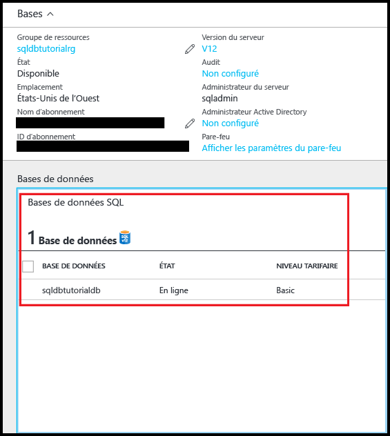

## <a name="connect-and-query-sample-database-using-sql-server-management-studio"></a>Connecter et interroger l’exemple de base de données à l’aide de SQL Server Management Studio

1. Basculez vers SQL Server Management Studio et, dans l’Explorateur d’objets, cliquez sur **Bases de données**, puis sur **Actualiser** dans la barre d’outils pour afficher l’exemple de base de données.

    
2. Dans l’Explorateur d’objets, développez votre nouvelle base de données pour afficher ses objets.

    
3. Cliquez avec le bouton droit sur votre exemple de base de données, puis cliquez sur **Nouvelle requête**.

    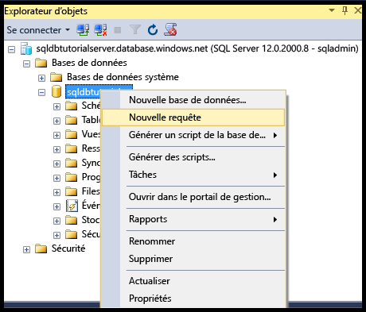
4. Dans la fenêtre de requête, saisissez la requête suivante :

   ```select * from sys.objects```
   
9.  Dans la barre d’outils, cliquez sur **Exécuter** pour retourner une liste de tous les objets système dans l’exemple de base de données.

    

## <a name="create-a-new-blank-database-using-sql-server-management-studio"></a>Créer une base de données vide à l’aide de SQL Server Management Studio

1. Dans l’Explorateur d’objets, cliquez avec le bouton droit sur **Bases de données**, puis cliquez sur **Nouvelle base de données**.

    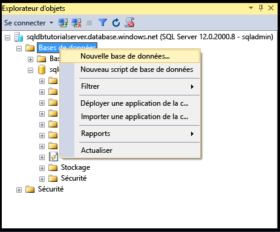

    > [!NOTE]
    > Vous pouvez également ordonner à SSMS de générer un script de création de base de données pour créer une base de données à l’aide de Transact-SQL.
    >

2. Dans la boîte de dialogue Nouvelle base de données, fournissez un nom dans la zone de texte Nom de la base de données. 

    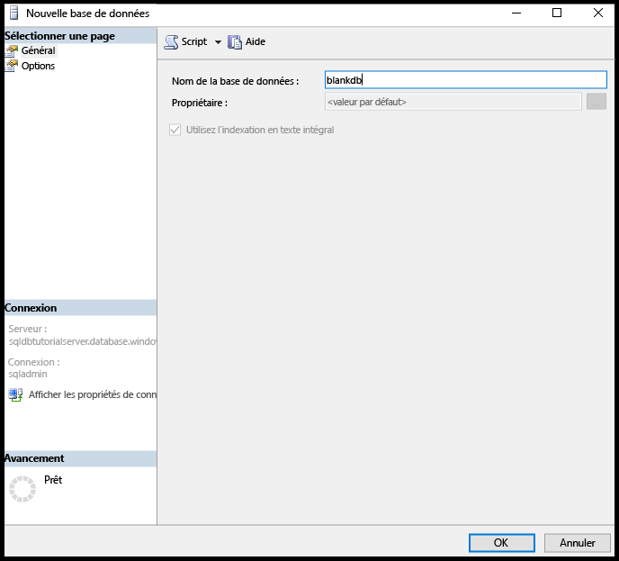

3. Dans la boîte de dialogue Nouvelle base de données, cliquez sur **Options** puis modifiez l’édition pour choisir **De base**.

    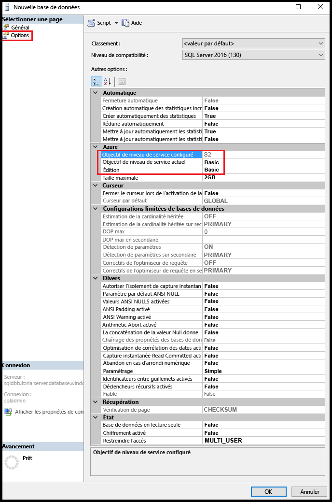

    > [!TIP]
    > Passez en revue les autres options de cette boîte de dialogue que vous pouvez modifier pour une base de données SQL Azure. Pour plus d'informations sur ces options, consultez [Create Database](https://msdn.microsoft.com/library/dn268335.aspx).
    >

4. Cliquez sur **OK** pour créer la base de données vide.
5. Lorsque vous avez terminé, actualisez le nœud Base de données dans l’Explorateur d’objets pour afficher la base de données vide nouvellement créée. 

    

> [!TIP]
> Vous pouvez économiser de l’argent pendant votre apprentissage en supprimant des bases de données que vous n’utilisez pas. Pour les bases de données de l’édition de base, vous pouvez les restaurer dans les sept jours. Toutefois, ne supprimez pas de serveur. Si vous le faites, vous ne pourrez pas récupérer le serveur ou l’une de ses bases de données supprimées.
>


## <a name="next-steps"></a>Étapes suivantes
Maintenant que vous avez terminé ce didacticiel, vous souhaiterez peut-être explorer les nombreux autres didacticiels afin de mettre en œuvre ce que vous avez appris dans ce didacticiel. 

* Si vous souhaitez commencer à explorer la sécurité Azure SQL Database, consultez [Prise en main de la sécurité](sql-database-get-started-security.md).
* Si vous connaissez Excel, découvrez comment [vous connecter à une base de données SQL dans Azure avec Excel](sql-database-connect-excel.md).
* Si vous êtes prêt à commencer le codage, choisissez votre langage de programmation dans [Bibliothèques de connexions pour SQL Database et SQL Server](sql-database-libraries.md).
* Si vous souhaitez déplacer vos bases de données SQL Server locales vers Azure, consultez la page [Migration de base de données SQL Server vers SQL Database dans le cloud](sql-database-cloud-migrate.md).
* Si vous souhaitez charger des données dans une nouvelle table à partir d’un fichier CSV avec l’outil de ligne de commande BCP, consultez la page [Chargement de données dans une base de données SQL à partir d’un fichier CSV à l’aide de BCP](sql-database-load-from-csv-with-bcp.md).
* Si vous souhaitez commencer à créer des tables et d’autres objets, consultez la rubrique « Création d’une table » dans [Création d’une table](https://msdn.microsoft.com/library/ms365315.aspx).

## <a name="additional-resources"></a>Ressources supplémentaires
[Définition de la base de données SQL](sql-database-technical-overview.md)


<!--HONumber=Dec16_HO1-->


