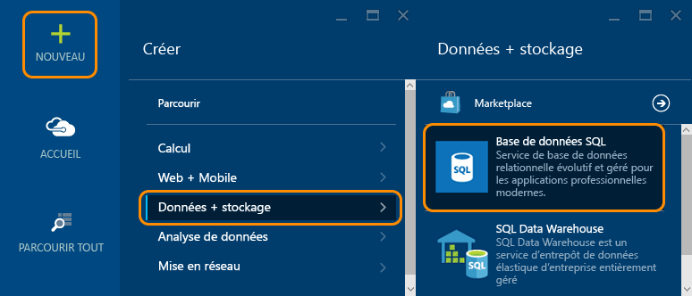
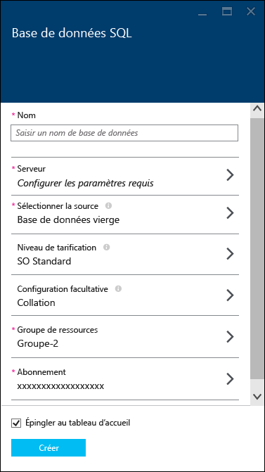
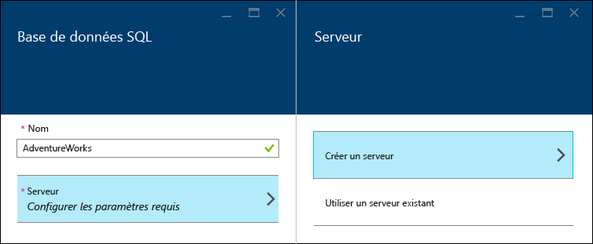
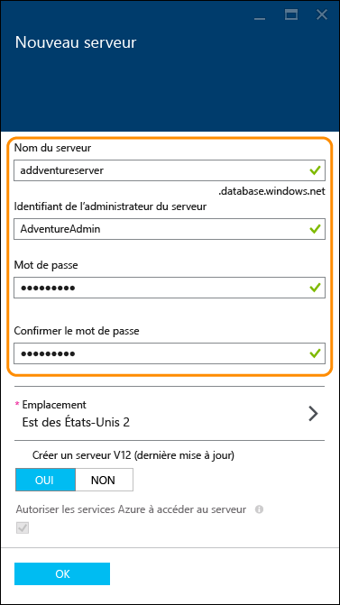
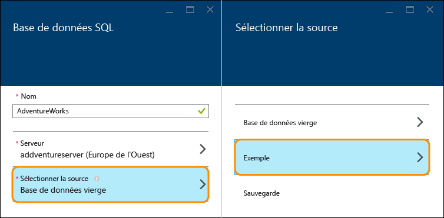
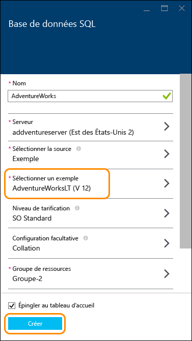
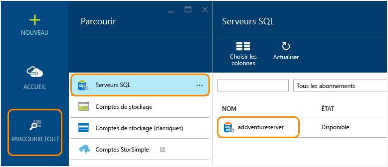
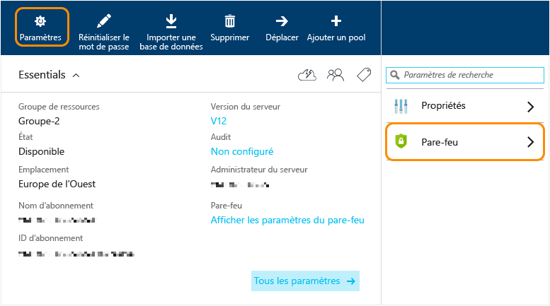
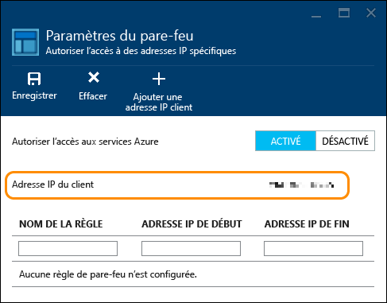
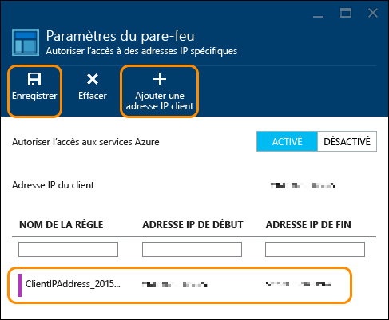

<properties
	pageTitle="Didacticiel sur la base de données SQL : Créer une base de données SQL | Microsoft Azure"
	description="Didacticiel sur Base de données SQL : créez une première base de données SQL en quelques minutes dans le portail Azure à l’aide d’exemples de données. Découvrez comment configurer un serveur d’hébergement et une règle de pare-feu."
	keywords="didacticiel sur la base de données SQL, créer une base de données sql"
	services="sql-database"
	documentationCenter=""
	authors="jeffgoll"
	manager="jeffreyg"
	editor="cgronlun"/>

<tags
	ms.service="sql-database"
	ms.workload="data-management"
	ms.tgt_pltfrm="na"
	ms.devlang="na"
	ms.topic="hero-article"
	ms.date="12/01/2015"
	ms.author="jeffreyg"/>

# Didacticiel sur la base de données SQL : Créer une base de données SQL en quelques minutes à l’aide d’exemples de données et du portail Azure

**Base de données unique**

> [AZURE.SELECTOR]
- [Azure portal](sql-database-get-started.md)
- [C#](sql-database-get-started-csharp.md)
- [PowerShell](sql-database-get-started-powershell.md)

Ce didacticiel sur la base de données SQL vous explique comment créer une base de données SQL en quelques minutes à l’aide d’exemples de données et du portail Azure. Vous découvrirez comment effectuer les actions suivantes :

- Créez un serveur pour héberger la base de données que vous créez, puis définissez une règle de pare-feu pour celle-ci.
- Créez une base de données SQL à partir d’un exemple AdventureWorks, qui inclut des données que vous pouvez manipuler.

Avant de commencer, vous avez besoin d’un compte Azure et d’un abonnement. Si vous n’en avez pas, inscrivez-vous pour un [essai gratuit](https://azure.microsoft.com/pricing/free-trial/).

> [AZURE.NOTE] Ce didacticiel sur Base de données SQL explique comment configurer une base de données à l’aide du service de gestion de base de données relationnelle (SGBDR) de Microsoft dans le cloud : Base de données SQL Azure. Une autre option consiste à exécuter SQL Server sur une machine virtuelle Azure. Voir [Connaissance de la base de données Azure et SQL Server dans des machines virtuelles Azure](data-management-azure-sql-database-and-sql-server-iaas.md) pour une comparaison rapide, ou vous pouvez consulter [Configurer une machine virtuelle SQL server](virtual-machines-provision-sql-server.md) pour être initié avec une machine virtuelle.

## Étape 1 : Se connecter et démarrer la configuration de la base de données SQL
1. Connectez-vous au [portail Azure](https://portal.azure.com/).
2. Cliquez sur **Nouveau** > **Données et stockage** > **Base de données SQL**.

	

	C’est sur le panneau de paramètres de la **Base de données SQL** qui s’affiche que vous allez configurer les détails du serveur et de la base de données.

	

## Étape 2 : choisir les paramètres du serveur
Une base de données SQL dans Azure réside sur un serveur de bases de données. Un serveur peut héberger plusieurs bases de données. Lorsque vous définissez une base de données, vous pouvez également créer et configurer le serveur qui l’hébergera ou utiliser un serveur créé précédemment. Nous allons en créer un.

1. Saisissez un **nom** pour votre base de données (nous utilisons **AdventureWorks**). Nous couvrirons les autres paramètres de base de données ultérieurement.
2. Sous **Serveur**, cliquez sur **Configurer les paramètres requis**, puis sur **Créer un serveur**.

	

3. Dans le panneau **Nouveau serveur**, saisissez un **nom de serveur** facile à mémoriser unique dans Azure. Vous aurez besoin de ce nom ultérieurement lorsque vous vous connecterez et que vous travaillerez avec votre base de données.
4. Saisissez un **nom de connexion d’administrateur de serveur ** facile à mémoriser (nous utilisons **AdventureAdmin**). Ensuite, tapez un **Mot de passe** sécurisé et tapez-le de nouveau dans le champ **Confirmer le mot de passe**.

	

	 Laissez l’option **Créer un serveur V12 (dernière mise à jour)** définie sur **Oui** pour utiliser les dernières fonctionnalités. Le champ **Emplacement** détermine la région de centre de données où votre serveur est créé.

	>[AZURE.TIP] Créez des serveurs de bases de données à un emplacement proche des applications qui utiliseront la base de données. Si vous souhaitez modifier l’emplacement, cliquez simplement sur **Emplacement**, choisissez un autre emplacement, puis cliquez sur **OK**.

5. Cliquez sur **OK** pour revenir au panneau **Base de données SQL**.

La base de données et le serveur ne sont pas encore créés. Cela se produit après l’étape suivante, où vous choisissez de créer la base de données à partir de l’exemple AdventureWorks et où vous confirmez les paramètres.

## Étape 3 : définir et créer une base de données SQL
1. Dans le panneau **Base de données SQL**, cliquez sur **Sélectionner une source**, puis sur **Exemple**.

	

2. Vous revenez au panneau **Base de données SQL**, où **Sélectionner un exemple** affiche maintenant **AdventureWorks LT [V12]**. Cliquez sur **Créer** pour lancer la création du serveur et de la base de données.

	

	>[AZURE.NOTE] Pour cette procédure rapide, nous n’avons pas modifié les paramètres pour les options **Niveau de tarification**, **Classement**, et **Groupe de ressources**. Vous pouvez modifier le niveau tarifaire d’une base de données et procéder à une hausse ou une baisse à tout moment, sans interruption de service. Pour plus d’informations, voir [Tarification SQL Database](https://azure.microsoft.com/pricing/details/sql-database/) et [Niveaux tarifaires SQL Database](sql-database-service-tiers.md). Le classement d’une base de données ne peut pas être modifié une fois que vous le configurez ici. Pour plus d’informations sur le classement, voir [Prise en charge d’Unicode et du classement](https://msdn.microsoft.com/library/ms143726.aspx). Pour plus d’informations sur les groupes de ressources Azure, voir [Présentation d’Azure Resource Manager](resource-group-overview.md).

Vous revenez au tableau d’accueil Azure, où une vignette affiche la progression jusqu’à ce que la base de données soit créée et en ligne. Vous pouvez également cliquer sur **Parcourir tout**, puis sur **Bases de données SQL** pour confirmer que la base de données est en ligne.

Félicitations ! Vous disposez maintenant d’une base de données SQL exécutée dans le cloud. Vous avez presque terminé ! Il ne reste qu’une étape clé. Vous devez créer une règle sur le serveur de bases de données afin de pouvoir vous connecter à la base de données.

## Étape 4 : Configurer le pare-feu

Vous devez définir une règle de pare-feu sur le serveur qui autorise les connexions à partir de l’adresse IP de l’ordinateur client afin de pouvoir travailler avec la base de données. Cette opération ne sert pas uniquement à garantir que vous pouvez vous connecter : c’est un excellent moyen de visualiser la zone où vous pouvez obtenir des précisions sur vos serveurs SQL dans Azure.

1. Cliquez sur **Parcourir tout**, faites défiler vers le bas, puis cliquez sur **Serveurs SQL** et sur le nom du serveur que vous avez créé précédemment dans la liste des **Serveurs SQL**.

	

3. Dans le panneau de propriétés de la base de données qui apparaît à droite, cliquez sur **Paramètres**, puis cliquez sur **Pare-feu** dans la liste.

	

	L’option **Paramètres de pare-feu** affiche votre **adresse IP du client** en cours.

	

4. Cliquez sur **Ajouter l’IP du client** pour qu’Azure crée une règle pour cette adresse IP, puis cliquez sur **Enregistrer**.

	

	>[AZURE.IMPORTANT] Votre adresse IP du client est susceptible de changer de temps à autre, et vous ne serez peut-être pas en mesure d’accéder à votre serveur jusqu’à ce que vous créiez une règle de pare-feu. Vous pouvez vérifier votre adresse IP à l’aide de [Bing](http://www.bing.com/search?q=my%20ip%20address), puis ajouter une adresse IP unique ou une plage d’adresses IP. Pour plus d’informations, voir [Configuration des paramètres du pare-feu](sql-database-configure-firewall-settings.md)

## Étapes suivantes
Maintenant que vous avez terminé ce didacticiel sur la base de données SQL et que vous avez créé une base de données avec des exemples de données, vous êtes prêt pour l’exploration à l’aide de vos outils préférés.

- Si vous êtes familiarisé avec Transact-SQL et SQL Server Management Studio, découvrez comment [Connecter et interroger une base de données SQL avec SSMS](sql-database-connect-query-ssms.md).

- Si vous connaissez Excel, découvrez comment [Se connecter à une base de données SQL avec Excel](sql-database-connect-excel.md).

- Si vous êtes prêt à commencer le codage, voir [Connecter et interroger votre base de données SQL avec C#](sql-database-connect-query.md) et [Utilisation de la base de données SQL à partir de .NET (C#)](sql-database-develop-dotnet-simple.md). Pour des exemples et des procédures Node.js, Python, Ruby, Java, PHP et C++, parallèlement à C#, voir [Exemples de code de démarrage rapide pour base de données SQL](sql-database-develop-quick-start-client-code-samples.md).

- Si vous souhaitez déplacer vos bases de données SQL Server locales vers Azure, voir [Migration d’une base de données vers la base de données SQL Azure](sql-database-cloud-migrate.md) pour plus d’informations.

<!---HONumber=AcomDC_0128_2016-->