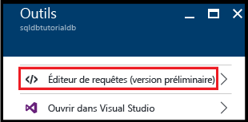
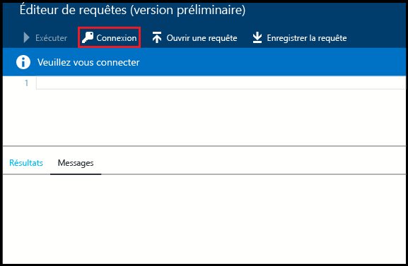
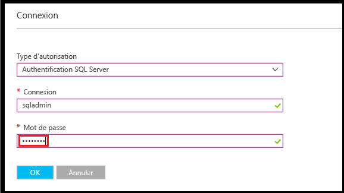
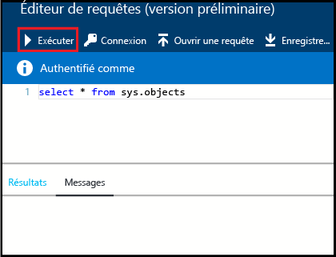
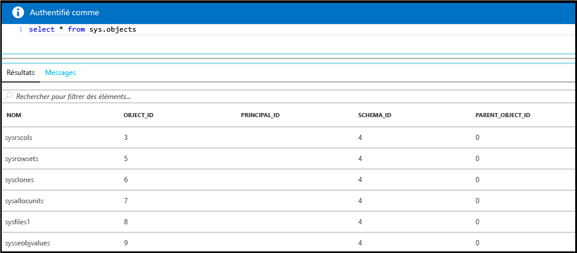
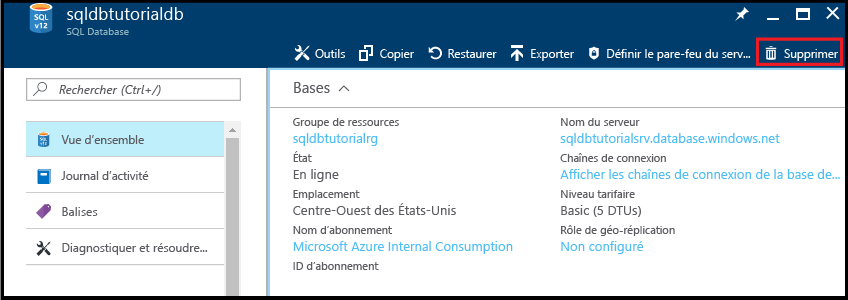
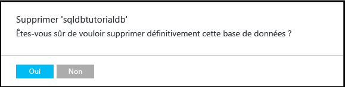

# <a name="create-connect-to-and-query-your-first-azure-sql-databases-in-the-azure-portal-and-using-ssms"></a>Créer, consulter et interroger vos premières bases de données SQL Azure dans le Portail Azure et à l’aide de SSMS

Dans ce didacticiel, vous allez apprendre à créer, consulter et interroger des bases de données SQL Azure dans le Portail Azure et en utilisant SQL Server Management Studio. Après avoir suivi ce didacticiel, vous aurez :

* Créé un groupe de ressources contenant un serveur logique, une règle de pare-feu au niveau du serveur et deux bases de données
* Appris à visualiser les propriétés de serveur et de base de données dans le Portail Azure et en utilisant SQL Server Management Studio
* Découvert comment interroger une base de données dans le Portail Azure et à l’aide de SQL Server Management Studio

**Durée estimée** : ce didacticiel prend environ 30 minutes (en supposant que vous remplissez déjà les conditions préalables).

> [!TIP]
> Vous pouvez également apprendre à créer, consulter et interroger une base de données SQL Azure au moyen de [PowerShell](sql-database-get-started-powershell.md) ou de [C#](sql-database-get-started-csharp.md).
>

> [!NOTE]
> Ce didacticiel vous permet de vous familiariser avec le contenu des rubriques suivantes : [Serveurs logiques Azure SQL Database](sql-database-server-overview.md), [Vue d’ensemble de la base de données SQL Azure](sql-database-overview.md) et [Vue d’ensemble des règles de pare-feu d’Azure SQL Database](sql-database-firewall-configure.md). Pour plus d’informations sur le service SQL Database, consultez [Présentation de SQL Database](sql-database-technical-overview.md).
>  

## <a name="prerequisites"></a>Composants requis

* **Un compte Azure**. Vous pouvez [ouvrir un compte Azure gratuit](https://azure.microsoft.com/free/) ou [activer les avantages de l’abonnement à Visual Studio](https://azure.microsoft.com/pricing/member-offers/msdn-benefits/). 

* **Des autorisations de création Azure**. Vous devez être en mesure de vous connecter au portail Azure à l’aide d’un compte qui soit membre du propriétaire de l’abonnement ou membre du rôle Collaborateur. Pour plus d’informations sur l’utilisation du contrôle d’accès en fonction du rôle (RBAC), consultez [Prise en main de la gestion des accès dans le portail Azure](../active-directory/role-based-access-control-what-is.md).

* **SQL Server Management Studio**. Pour télécharger et installer la dernière version de SQL Server Management Studio (SSMS), consultez l’article [Télécharger SQL Server Management Studio (SSMS)](https://msdn.microsoft.com/library/mt238290.aspx). Lorsque vous vous connectez à Azure SQL Database, utilisez toujours la dernière version de SSMS, car de nouvelles fonctionnalités sont continuellement publiées.

### <a name="sign-in-to-the-azure-portal"></a>Connectez-vous au portail Azure.

Cette procédure vous indique comment vous connecter au Portail Azure à l’aide de votre [compte Azure](https://account.windowsazure.com/Home/Index).

1. Ouvrez votre navigateur préféré et connectez-vous au [portail Azure](https://portal.azure.com/).
2. Connectez-vous au [portail Azure](https://portal.azure.com/).
3. Dans la page **de connexion** , entrez les informations d’identification de votre abonnement.
   
   


<a name="create-logical-server-bk"></a>

## <a name="create-a-new-logical-sql-server"></a>Création d’un serveur logique SQL

Cette procédure vous indique comment créer un serveur logique dans le Portail Azure dans la région de votre choix. Un serveur logique est l’objet dans lequel vous créez vos bases de données SQL, ainsi que des règles de pare-feu pour autoriser les utilisateurs à se connecter à travers le pare-feu Azure SQL Database. 

1. Cliquez sur **Nouveau**, saisissez **sql server**, puis cliquez sur **ENTRÉE**.

    
2. Cliquez sur **Serveur SQL Server (serveur logique)**.
   
    
3. Cliquez sur **Créer** pour ouvrir le nouveau panneau SQL Server (serveur logique uniquement).

    
3. Dans la zone de texte **Nom du serveur**, indiquez un nom valide pour le nouveau serveur logique. Une coche verte indique que vous avez fourni un nom valide.
    
    

    > [!IMPORTANT]
    > Le nom complet de votre nouveau serveur doit être un nom global unique et se présente sous la forme suivante : **<nom_de_votre_serveur>.database.windows.net**. Vous utiliserez ce nom de serveur complet dans la suite de ce didacticiel pour vous connecter à votre serveur et à vos bases de données.
    >
    
4. Dans la zone de texte **Connexion de l’administrateur du serveur**, fournissez un nom d’utilisateur pour la connexion d’authentification SQL de ce serveur. Cette connexion est désignée sous le terme de connexion du principal du serveur. Une coche verte indique que vous avez fourni un nom valide.
    
    
5. Dans les zones de texte **Mot de passe** et **Confirmer le mot de passe**, fournissez un mot de passe pour le compte de connexion principal du serveur. Une coche verte indique que vous avez fourni un mot de passe valide.
    
    
6. Dans la zone déroulante **Abonnement**, sélectionnez un abonnement dans lequel vous êtes autorisé à créer des objets.

    
7. Sous la zone **Groupe de ressources**, sélectionnez **Créer**, puis fournissez un nom valide pour le nouveau groupe de ressources. Une coche verte indique que vous avez fourni un nom valide.

    

8. Dans la zone de texte **Emplacement** , sélectionnez un centre de données dans lequel créer votre serveur logique.
    
    
    
    > [!TIP]
    > La case à cocher **Autoriser les services Azure à accéder au serveur** ne peut pas être modifiée dans ce panneau. Vous pouvez modifier ce paramètre dans le panneau de pare-feu du serveur. Pour plus d'informations, consultez [Prise en main de la sécurité](sql-database-control-access-sql-authentication-get-started.md).
    >
    
9. Cochez la case **Épingler au tableau de bord**.

10. Cliquez sur **Créer** pour déployer ce script dans Azure afin de créer votre serveur logique.

    

11. Une fois votre serveur créé, passez en revue ses propriétés qui s’affichent par défaut. 

    
12. Cliquez sur **Propriétés** pour visualiser des propriétés supplémentaires de votre serveur SQL Server logique.

    
13. Copiez le nom de serveur complet dans le Presse-papiers pour une utilisation ultérieure dans ce didacticiel.

    

## <a name="create-a-server-level-firewall-rule"></a>créer une règle de pare-feu au niveau du serveur ;

Cette procédure vous indique comment créer une règle de pare-feu au niveau du serveur dans le Portail Azure. Par défaut, un pare-feu Azure SQL Database empêche la connectivité externe à votre serveur logique et à ses bases de données. Pour être en mesure de vous connecter à votre serveur, vous devez créer une règle de pare-feu pour l’adresse IP de l’ordinateur à partir duquel vous vous connecterez dans la procédure suivante. Pour plus d’informations, consultez l’article [Vue d’ensemble des règles de pare-feu d’Azure SQL Database](sql-database-firewall-configure.md).

1. Dans le panneau SQL Server, cliquez sur **Pare-feu** pour ouvrir le panneau Pare-feu de votre serveur. Notez que l’adresse IP est affichée pour votre ordinateur client.

    

2. Dans la barre d’outils, cliquez sur **Ajouter une adresse IP cliente** afin de créer une règle de pare-feu pour votre adresse IP actuelle.

    

    > [!NOTE]
    > Vous pouvez créer une règle de pare-feu pour une seule adresse IP ou pour une plage complète d’adresses IP. L’ouverture du pare-feu permet aux administrateurs et utilisateurs SQL de se connecter à toute base de données sur le serveur pour lequel ils disposent d’informations d’identification valides.
    >

4. Dans la barre d’outils, cliquez sur **Enregistrer** pour enregistrer cette règle de pare-feu au niveau du serveur, puis cliquez sur **OK** pour fermer la boîte de dialogue Réussite.

    

## <a name="connect-to-the-server-with-ssms"></a>Connexion au serveur avec SSMS

Cette procédure vous indique comment vous connecter à votre serveur logique SQL à l’aide de SQL Server Management Studio. SSMS est le principal outil que DBA utilise pour gérer les serveurs et les bases de données SQL.

1. Ouvrez SQL Server Management Studio (tapez **Microsoft SQL Server Management Studio** dans la zone de recherche de Windows, puis sélectionnez **Entrée** pour ouvrir SSMS).

    
3. Dans la boîte de dialogue **Se connecter au serveur**, entrez le nom complet de votre serveur, sélectionnez Authentification SQL Server, puis fournissez le nom de connexion et le mot de passe que vous avez spécifiés lors de l’approvisionnement de votre serveur.

    
4. Cliquez sur **Connecter** pour initialiser la connexion et ouvrir l’Explorateur d’objets dans SSMS.

    
5. Dans l’Explorateur d’objets, développez **Bases de données**, **Bases de données système** et **Master** pour afficher les objets dans la base de données master.

    
6. Cliquez avec le bouton droit sur **Master**, puis cliquez sur **Nouvelle requête**.

    

8. Dans la fenêtre de requête, saisissez la requête suivante :

   ```select * from sys.objects```

9.  Dans la barre d’outils, cliquez sur **Exécuter** pour retourner une liste de tous les objets système dans la base de données master.

    

    > [!NOTE]
    > Pour découvrir la sécurité SQL, consultez l’article concernant la [prise en main de l’authentification SQL](sql-database-control-access-sql-authentication-get-started.md).
    >

## <a name="create-a-database-with-sample-data"></a>Création d’une base de données avec des exemples de données

Cette procédure vous indique comment créer dans le Portail Azure une base de données avec des exemples de données qui est associée au serveur logique que vous avez créé précédemment. 

1. Dans le portail Azure, cliquez sur **SQL databases** dans le panneau par défaut.

    
2. Dans le panneau de bases de données SQL, cliquez sur **Ajouter**. 

    

    
3. Dans la zone de texte **Nom de la base de données**, fournissez un nom de base de données valide.

    
4. Sous **Sélectionner la source**, sélectionnez **Exemple (AdventureWorksLT)**.
   
    
5. Sous **Serveur**, vérifiez que votre serveur est sélectionné. Notez également que lorsqu’une base de données est ajoutée à un serveur, elle peut être ajoutée en tant que base de données unique (valeur par défaut) ou ajoutée à un pool élastique. Pour plus d’informations sur les pools élastiques, consultez [Pools élastiques](sql-database-elastic-pool.md).

6. Sous **Niveau tarifaire**, redéfinissez le niveau tarifaire sur **De base**, puis cliquez sur **Sélectionner**. Vous pouvez augmenter le niveau tarifaire ultérieurement si vous le souhaitez, mais dans le cadre de cette formation, nous vous recommandons d’utiliser le niveau tarifaire le plus bas.

    
7. Cochez la case **Épingler au tableau de bord**, puis cliquez sur **Créer**.

    

8. Une fois votre base de données créée, visualisez ses propriétés dans le Portail Azure. Les didacticiels suivants vous aident à comprendre les options disponibles dans ce panneau. 

    

## <a name="query-the-database-in-the-azure-portal"></a>Interrogation de la base de données dans le portail Azure

Cette procédure vous indique comment interroger la base de données directement dans le Portail Azure. 

1. Dans le panneau des bases de données SQL, cliquez sur **Outils** dans la barre d’outils.

    
2. Dans le panneau Outils, cliquez sur **Éditeur de requêtes (version préliminaire)**.

    
3. Cliquez sur la case à cocher pour confirmer que l’éditeur de requêtes est une fonctionnalité préliminaire, puis cliquez sur **OK**.
4. Dans le panneau de l’**Éditeur de requêtes**, cliquez sur **Connexion**.

    
5. Examinez le type d’autorisation et la connexion, puis fournissez le mot de passe pour cette connexion. 

    
6. Cliquez sur **OK** pour tenter de vous connecter.
7. Après vous être authentifié, tapez la requête ci-après dans la fenêtre de requête, puis cliquez sur **Exécuter**.

   ```select * from sys.objects```

    

8. Passez en revue les résultats de la requête dans le volet **Résultats**.

    

## <a name="query-the-database-with-ssms"></a>Interroger la base de données avec SSMS

Cette procédure vous indique comment vous connecter à la base de données à l’aide de SQL Server Management Studio, puis interroger les exemples de données pour visualiser les objets de la base de données.

1. Basculez vers SQL Server Management Studio et, dans l’Explorateur d’objets, cliquez sur **Bases de données**, puis sur **Actualiser** dans la barre d’outils pour afficher l’exemple de base de données.

    
2. Dans l’Explorateur d’objets, développez votre nouvelle base de données pour afficher ses objets.

    
3. Cliquez avec le bouton droit sur votre exemple de base de données, puis cliquez sur **Nouvelle requête**.

    
4. Dans la fenêtre de requête, saisissez la requête suivante :

   ```select * from sys.objects```
   
9.  Dans la barre d’outils, cliquez sur **Exécuter** pour retourner une liste de tous les objets système dans l’exemple de base de données.

    

## <a name="create-a-blank-database-with-ssms"></a>Création d’une base de données vierge avec SSMS

Cette procédure vous indique comment créer une base de données à l’aide de SQL Server Management Studio.

1. Dans l’Explorateur d’objets, cliquez avec le bouton droit sur **Bases de données**, puis cliquez sur **Nouvelle base de données**.

    

2. Dans la boîte de dialogue **Nouvelle base de données**, fournissez un nom dans la zone de texte Nom de la base de données. 

    

3. Dans la boîte de dialogue Nouvelle base de données, cliquez sur **Options** puis modifiez l’édition pour choisir **De base**.

    

    > [!TIP]
    > Passez en revue les autres options de cette boîte de dialogue que vous pouvez modifier pour une base de données SQL Azure. Pour plus d'informations sur ces options, consultez [Create Database](https://msdn.microsoft.com/library/dn268335.aspx).
    >

4. Cliquez sur **OK** pour créer la base de données vide.
5. Lorsque vous avez terminé, actualisez le nœud Base de données dans l’Explorateur d’objets pour afficher la base de données vide nouvellement créée. 

    

## <a name="troubleshoot-connectivity"></a>Résoudre les problèmes de connectivité

En cas d’échec de la connexion à Azure SQL Database, vous recevez des messages d’erreur. Les problèmes de connexion peuvent découler d’une reconfiguration de la base de données SQL Azure, des paramètres de pare-feu, de l’expiration d’un délai de connexion ou d’informations de connexion incorrectes. Pour plus d’informations sur l’outil de résolution des problèmes de connectivité, consultez l’article [Dépannage des problèmes de connectivité avec Microsoft Azure SQL Database](https://support.microsoft.com/help/10085/troubleshooting-connectivity-issues-with-microsoft-azure-sql-database).

## <a name="delete-a-single-database-in-the-azure-portal"></a>Supprimer une base de données unique dans le Portail Azure

Cette procédure vous indique comment supprimer une base de données unique avec le Portail Azure.

1. Dans le panneau de bases de données SQL du Portail Azure, cliquez sur la base de données que vous souhaitez supprimer. 
2.  Pour votre base de données SQL, cliquez sur **Supprimer**.

    
2. Cliquez sur **Oui** pour confirmer que vous souhaitez supprimer définitivement cette base de données.

    

> [!TIP]
> Pendant la période de rétention de votre base de données, vous pouvez restaurer cette dernière à partir des sauvegardes automatiques initiées par le service (à condition que vous ne supprimiez pas le serveur proprement dit). Pour les bases de données de l’édition de base, vous pouvez les restaurer dans les sept jours. Toutes les autres éditions peuvent être restaurées dans les 35 jours. Si vous supprimez le serveur proprement dit, vous ne pourrez pas récupérer ce dernier ni l’une de ses bases de données supprimées. Pour plus d’informations sur les sauvegardes de base de données, voir [Découvrir les sauvegardes SQL Database](sql-database-automated-backups.md) et pour plus d’informations sur la restauration d’une base de données à partir de sauvegardes, voir [Récupération de base de données](sql-database-recovery-using-backups.md). Pour connaître la procédure de restauration d’une base de données supprimée, consultez [Restaurer une base de données SQL supprimée (portail Azure)](sql-database-restore-deleted-database-portal.md).
>


## <a name="next-steps"></a>Étapes suivantes
Maintenant que vous avez terminé ce didacticiel, vous souhaiterez peut-être explorer les nombreux autres didacticiels afin de mettre en œuvre ce que vous avez appris dans ce didacticiel. 

- Pour un didacticiel de prise en main de l’authentification SQL Server, voir [Authentification et autorisations SQL](sql-database-control-access-sql-authentication-get-started.md).
- Pour un didacticiel de prise en main de l’authentification Azure Active Directory, voir [Authentification et autorisations AAD](sql-database-control-access-aad-authentication-get-started.md).
* Si vous souhaitez interroger l’échantillon de base de données dans le portail Azure, consultez la section [Version préliminaire publique : Expérience interactive pour les requêtes portant sur les bases de données SQL](https://azure.microsoft.com/updates/azure-sql-database-public-preview-t-sql-editor/).
* Si vous connaissez Excel, découvrez comment [vous connecter à une base de données SQL dans Azure avec Excel](sql-database-connect-excel.md).
* Si vous êtes prêt à commencer le codage, choisissez votre langage de programmation dans [Bibliothèques de connexions pour SQL Database et SQL Server](sql-database-libraries.md).
* Si vous souhaitez déplacer vos bases de données SQL Server locales vers Azure, consultez la page [Migration de base de données SQL Server vers SQL Database dans le cloud](sql-database-cloud-migrate.md).
* Si vous souhaitez charger des données dans une nouvelle table à partir d’un fichier CSV avec l’outil de ligne de commande BCP, voir [Chargement de données dans SQL Database à partir d’un fichier CSV à l’aide de BCP](sql-database-load-from-csv-with-bcp.md).
* Si vous souhaitez commencer à créer des tables et d’autres objets, consultez la rubrique « Création d’une table » dans [Création d’une table](https://msdn.microsoft.com/library/ms365315.aspx).

## <a name="additional-resources"></a>Ressources supplémentaires

- Pour découvrir une présentation technique, consultez l’article [Présentation de SQL Database](sql-database-technical-overview.md).
- Pour plus d’informations sur la tarification, voir [Bases de données SQL - Tarification](https://azure.microsoft.com/pricing/details/sql-database/).


