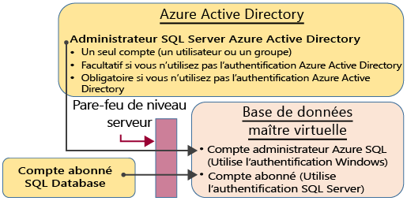
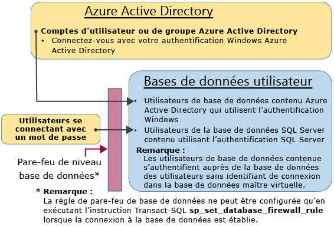

# Authentification et autorisation de base de données SQL : octroi de l’accès
> [!div class="op_single_selector"]
> * [Didacticiel de prise en main](sql-database-get-started-security.md)
> * [Accorder l’accès](sql-database-manage-logins.md)
> 
> 

Commencez ici pour une vue d’ensemble des concepts d’accès à la base de données SQL pour les administrateurs, les non administrateurs et les rôles.

## Comptes d’administration non restreints
Il existe deux comptes d’administration avec des autorisations illimitées pour l’accès à la base de données master virtuelle et à toutes les bases de données utilisateur. Ces comptes sont appelés comptes principaux au niveau du serveur.

### Compte abonné à la base de données SQL Azure
Un seul compte de connexion est créé lorsqu’une instance SQL logique est créée, appelé compte abonné à la base de données SQL Azure. Ce compte se connecte à l’aide de l’authentification SQL Server (nom d’utilisateur et mot de passe). Ce compte est un administrateur sur l’instance de serveur logique et sur toutes les bases de données utilisateur associées à cette instance. Les autorisations du compte abonné ne peuvent pas être restreintes. Un seul de ces comptes peut exister.

### Administrateur Azure Active Directory
Un compte Azure Active Directory peut également être configuré en tant qu’administrateur. Ce compte peut être un utilisateur Azure AD ou un groupe Azure AD comprenant plusieurs utilisateurs Azure AD. Il est facultatif de configurer un administrateur Azure AD, mais un administrateur Azure AD doit être configuré si vous voulez utiliser l’authentification Windows pour les comptes Azure AD pour vous connecter à la base de données SQL. Pour plus d’informations sur la configuration de l’accès à Azure Active Directory, voir [Connexion au service Base de données SQL ou SQL Data Warehouse avec l’authentification Azure Active Directory](sql-database-aad-authentication.md) et [Prise en charge de SSMS pour Azure AD MFA avec la base de données SQL et SQL Data Warehouse](sql-database-ssms-mfa-authentication.md).

### Configuration du pare-feu
Quand le pare-feu au niveau du serveur est configuré, le compte abonné à la base de données SQL Azure et le compte Azure Active Directory peuvent se connecter à la base de données MASTER et à toutes les bases de données utilisateur. Le pare-feu au niveau du serveur peut être configuré via le portail. Une fois la connexion établie, les règles supplémentaires de pare-feu au niveau du serveur peuvent également être configurées à l’aide de l’instruction Transact-SQL [sp\_set\_firewall\_rule](https://msdn.microsoft.com/library/dn270017.aspx). Pour plus d’informations sur la configuration du pare-feu, voir [Configurer un pare-feu sur une base de données Azure SQL à l’aide du portail Azure](sql-database-configure-firewall-settings.md).

### Chemin d’accès administrateur
Lorsque le pare-feu au niveau du serveur est correctement configuré, le compte abonné à la base de données SQL et les administrateurs de serveur SQL Azure Active Directory peuvent se connecter à l’aide des outils clients tels que SQL Server Management Studio ou SQL Server Data Tools. Seuls les outils les plus récents fournissent toutes les fonctionnalités et capacités. Le diagramme suivant illustre une configuration classique avec deux comptes d’administrateur. 

Lorsque vous utilisez un port ouvert dans le pare-feu au niveau du serveur, les administrateurs peuvent se connecter à n’importe quelle base de données SQL.

### Connexion à la base de données à l’aide de SQL Server Management Studio
Pour une procédure pas à pas de la connexion à l’aide de SQL Server Management Studio, voir [Se connecter à la base de données SQL avec SQL Server Management Studio et exécuter un exemple de requête T-SQL](sql-database-connect-query-ssms.md).

> [!IMPORTANT]
> Nous vous recommandons d’utiliser systématiquement la dernière version de Management Studio afin de rester en cohérence avec les mises à jour de Microsoft Azure et Base de données SQL. [Mettre à jour SQL Server Management Studio](https://msdn.microsoft.com/library/mt238290.aspx).
> 
> 

## Comptes spéciaux supplémentaires
La base de données SQL fournit deux rôles d’administrateur restreints dans la base de données master virtuelle à laquelle des comptes d’utilisateur peuvent être ajoutés.

### Créateurs de base de données
Les comptes d’administrateur peuvent créer des bases de données. Pour créer un compte supplémentaire capable de créer des bases de données, vous devez créer un utilisateur dans la base de données MASTER et l’ajouter au rôle de base de données spécial **dbmanager**. L’utilisateur peut être un utilisateur de base de données contenu ou un utilisateur basé sur une connexion SQL Server dans la base de données master virtuelle.

1. À l’aide d’un compte d’administrateur, connectez-vous à la base de données master virtuelle.
2. Étape facultative : Créer une connexion d’authentification SQL Server à l’aide de l’instruction [CREATE LOGIN](https://msdn.microsoft.com/library/ms189751.aspx). Exemple d’instruction :
   
   ```
   CREATE LOGIN Mary WITH PASSWORD = '<strong_password>';
   ```
   
   > [!NOTE]
   > Utilisez un mot de passe fort au moment de la création d’une connexion ou d’un utilisateur de base de données à relation contenant-contenu. Pour plus d'informations, consultez la page [Mots de passe forts](https://msdn.microsoft.com/library/ms161962.aspx).
   > 
   > 
   
   Pour améliorer les performances, les connexions (principaux au niveau du serveur) sont temporairement mises en cache au niveau de la base de données. Pour actualiser le cache d’authentification, consultez [DBCC FLUSHAUTHCACHE](https://msdn.microsoft.com/library/mt627793.aspx).
3. Dans la base de données MASTER virtuelle, créez un utilisateur à l’aide de l’instruction [CREATE USER](https://msdn.microsoft.com/library/ms173463.aspx). L’utilisateur peut être un utilisateur de base de données contenu de l’authentification Azure Active Directory (si vous avez configuré votre environnement pour l’authentification Azure AD), un utilisateur de base de données contenu de l’authentification SQL Server ou un utilisateur de l’authentification SQL Server basée sur une connexion d’authentification SQL Server (créé à l’étape précédente). Exemples d’instructions :
   
   ```
   CREATE USER [mike@contoso.com] FROM EXTERNAL PROVIDER;
   CREATE USER Tran WITH PASSWORD = '<strong_password>';
   CREATE USER Mary FROM LOGIN Mary; 
   ```
4. Ajoutez le nouvel utilisateur au rôle de base de données **dbmanager** à l’aide de l’instruction [ALTER ROLE](https://msdn.microsoft.com/library/ms189775.aspx). Exemples d’instructions :
   
   ```
   ALTER ROLE dbmanager ADD MEMBER Mary; 
   ALTER ROLE dbmanager ADD MEMBER [mike@contoso.com];
   ```
   
   > [!NOTE]
   > dbmanager étant un rôle de base de données dans une base de données master virtuelle, vous pouvez uniquement ajouter un utilisateur au rôle dbmanager. Vous ne pouvez pas ajouter une connexion au niveau du serveur au rôle au niveau de la base de données.
   > 
   > 
5. Si nécessaire, configurez le pare-feu au niveau du serveur pour permettre au nouvel utilisateur de se connecter.

Désormais, l’utilisateur peut se connecter à la base de données master virtuelle et créer des bases de données. Le compte qui crée la base de données devient propriétaire de cette dernière.

### Gestionnaires de connexion
Si vous le souhaitez, vous pouvez effectuer les mêmes étapes (créer une connexion et un utilisateur, puis ajouter l’utilisateur au rôle **loginmanager**) pour permettre aux utilisateurs de créer des connexions dans la base de données MASTER virtuelle. Cela n’est généralement pas nécessaire, car Microsoft recommande d’avoir recours aux utilisateurs de base de données à relation contenant-contenu qui s’authentifient au niveau de la base de données plutôt qu’à des utilisateurs basés sur les connexions. Pour plus d’informations, voir [Utilisateurs de base de données à relation contenant-contenu - Rendre votre base de données portable](https://msdn.microsoft.com/library/ff929188.aspx).

## Utilisateurs non administrateurs
En règle générale, les comptes non administrateurs n’ont pas besoin d’accéder à la base de données master virtuelle. Créez des utilisateurs de base de données à relation contenant-contenu dans le niveau de base de données à l’aide de l’instruction [CREATE USER (Transact-SQL)](https://msdn.microsoft.com/library/ms173463.aspx). L’utilisateur peut être un utilisateur de base de données contenu de l’authentification Azure Active Directory (si vous avez configuré votre environnement pour l’authentification Azure AD), un utilisateur de base de données contenu de l’authentification SQL Server ou un utilisateur de l’authentification SQL Server basée sur une connexion d’authentification SQL Server (créé à l’étape précédente). Pour plus d’informations, voir [Utilisateurs de base de données à relation contenant-contenu - Rendre votre base de données portable](https://msdn.microsoft.com/library/ff929188.aspx).

Pour créer des utilisateurs, connectez-vous à la base de données et exécutez des instructions similaires eux exemples suivants :

```
CREATE USER Mary FROM LOGIN Mary; 
CREATE USER [mike@contoso.com] FROM EXTERNAL PROVIDER;
```

Initialement, seul l’un des administrateurs ou le propriétaire de la base de données peut créer des utilisateurs. Pour autoriser des utilisateurs supplémentaires à créer des utilisateurs, accordez à l’utilisateur sélectionné l’autorisation `ALTER ANY USER`, en utilisant l’une des instructions suivantes :

```
GRANT ALTER ANY USER TO Mary;
```

Pour donner le contrôle total de la base de données aux utilisateurs supplémentaires, faites-les membres du rôle de base de données fixe **db\_owner** à l’aide de l’instruction `ALTER ROLE`.

> [!NOTE]
> Le fait que des utilisateurs de l’authentification SQL Server aient besoin d’accéder à plusieurs bases de données constitue l’une des raisons principales derrière la création d’utilisateurs de base de données basés sur des connexions. Les utilisateurs basés sur des connexions sont liés à la connexion et seul un mot de passe est conservé pour cette connexion. Les utilisateurs de base de données contenu dans des bases de données individuelles sont des entités distinctes qui conservent leur propre mot de passe. Cela peut être source de confusion pour les utilisateurs de base de données contenu s’ils ne conservent pas un mot de passe identique.
> 
> 

### Configuration du pare-feu au niveau de la base de données
En tant que meilleure pratique, les utilisateurs non administrateurs doivent uniquement bénéficier d’un accès via le pare-feu aux bases de données qu’ils utilisent. Au lieu d’autoriser leurs adresses IP via le pare-feu du niveau du serveur et de leur donner accès à toutes les bases de données, utilisez l’instruction [sp\_set\_database\_firewall\_rule](https://msdn.microsoft.com/library/dn270010.aspx) pour configurer le pare-feu du niveau de base de données. Le pare-feu du niveau de base de données ne peut pas être configuré à l’aide du portail.

### Chemin d’accès non administrateur
Lorsque le pare-feu du niveau de base de données est correctement configuré, les utilisateurs de base de données peuvent se connecter à l’aide des outils clients tels que SQL Server Management Studio ou SQL Server Data Tools. Seuls les outils les plus récents fournissent toutes les fonctionnalités et capacités. Le diagramme suivant montre un chemin d’accès non-administrateur classique. 

## Groupes et rôles
Une gestion des accès efficace utilise les autorisations assignées aux groupes et aux rôles plutôt qu’aux utilisateurs individuels. Par exemple, lorsque vous utilisez l’authentification Azure Active Directory :

* Placez les utilisateurs Azure Active Directory dans un groupe Azure Active Directory. Créez un utilisateur de base de données contenu pour le groupe. Placez un ou plusieurs utilisateurs de base de données dans un rôle de base de données. Affectez ensuite les autorisations pour le rôle de base de données.

Lorsque vous utilisez l’authentification SQL Server :

* Créez des utilisateurs de base de données contenu dans la base de données. Placez un ou plusieurs utilisateurs de base de données dans un rôle de base de données. Affectez ensuite les autorisations pour le rôle de base de données.

Les rôles de base de données peuvent être les rôles intégrés, tels que **db\_owner**, **db\_ddladmin**, **db\_datawriter**, **db\_datareader**, **db\_denydatawriter** et **db\_denydatareader**. **db\_owner** est couramment utilisé pour accorder toutes les autorisations à quelques utilisateurs triés sur le volet. Les autres rôles de base de données fixe sont utiles pour obtenir rapidement une base de données simple en développement, mais ne sont pas recommandés pour la plupart des bases de données de production. Par exemple, le rôle de base de données fixe **db\_datareader** accorde l’accès en lecture à toutes les tables de la base de données, ce qui est généralement plus que le minimum nécessaire. Il est préférable d’utiliser l’instruction [CREATE ROLE](https://msdn.microsoft.com/library/ms187936.aspx) pour créer vos propres rôles de base de données définis par l’utilisateur et accorder soigneusement à chaque rôle les autorisations minimales nécessaires aux besoins de l’entreprise. Lorsqu’un utilisateur est membre de plusieurs rôles, toutes les autorisations sont agrégées.

## Autorisations
Il existe plus de 100 autorisations qui peuvent être accordées ou refusées individuellement dans la base de données SQL. La plupart de ces autorisations sont imbriquées. Par exemple, l’autorisation `UPDATE` sur un schéma inclut l’autorisation `UPDATE` sur chaque table dans ce schéma. Comme dans la plupart des systèmes d’autorisation, le refus d’une autorisation remplace l’octroi. En raison de la nature imbriquée et du nombre d’autorisations, la plus grande attention est requise pour concevoir un système d’autorisation approprié capable de protéger correctement votre base de données. Démarrez avec la liste des autorisations sous [Autorisations (moteur de base de données)](https://msdn.microsoft.com/library/ms191291.aspx) et passez en revue le [graphique de taille affiche](http://go.microsoft.com/fwlink/?LinkId=229142) des autorisations.

## Étapes suivantes
[Sécurisation de votre base de données SQL](sql-database-security.md)

[Création d’une table (didacticiel)](https://msdn.microsoft.com/library/ms365315.aspx)

[Insertion et mise à jour des données dans une table (didacticiel)](https://msdn.microsoft.com/library/ms365309.aspx)

[Lecture des données dans une table (didacticiel)](https://msdn.microsoft.com/library/ms365310.aspx)

[Création de vues et de procédures stockées](https://msdn.microsoft.com/library/ms365311.aspx)

[Octroi de l’accès à un objet de base de données](https://msdn.microsoft.com/library/ms365327.aspx)

## Ressources supplémentaires
[Sécurisation de votre base de données SQL](sql-database-security.md)

[Centre de sécurité pour le moteur de base de données SQL Server et la base de données SQL Azure](https://msdn.microsoft.com/library/bb510589.aspx)

<!---HONumber=AcomDC_0914_2016-->