# Configurer, gérer et restaurer depuis la rétention à long terme des sauvegardes de base de données dans un coffre Azure Recovery Services avec le portail Azure

Dans cette rubrique, vous apprendrez à configurer, gérer et restaurer depuis la rétention à long terme des sauvegardes automatisées dans un coffre Azure Recovery Services avec le portail Azure. Vous pouvez également effectuer cette étape à l’aide de [PowerShell](sql-database-manage-long-term-backup-retention-powershell.md).

Pour plus d’informations sur la rétention des sauvegardes à long terme, consultez l’article décrivant la [rétention des sauvegardes à long terme](sql-database-long-term-retention.md).

> [!TIP]
> Pour obtenir un didacticiel, consultez [Prise en main des fonctionnalités de sauvegarde et de restauration pour la protection et la récupération des données à l’aide du portail Azure](sql-database-get-started-backup-recovery-portal.md).
>

## Configurer la rétention à long terme avec le Portail Azure

1. Ouvrez le panneau **SQL Server** de votre serveur.

    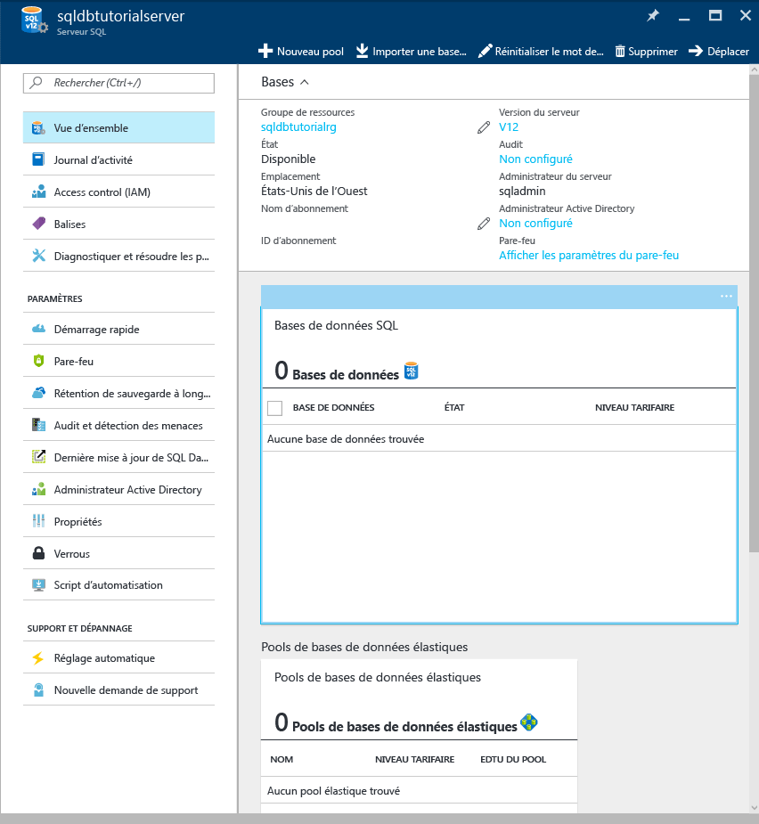

2. Cliquez sur **Long-term backup retention (Rétention des sauvegardes à long terme)**.

   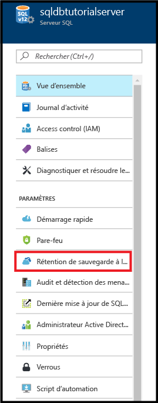

3. Dans le panneau **Long-term backup retention** (Rétention des sauvegardes à long terme), examinez et acceptez les conditions d’utilisation de la version préliminaire (à moins que vous ne l’ayez déjà fait ou que cette fonctionnalité ne soit plus en version préliminaire).

   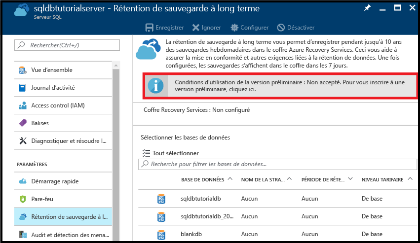

4. Pour configurer la rétention des sauvegardes à long terme d’une base de données, sélectionnez cette base de données dans la grille, puis cliquez sur **Configurer** dans la barre d’outils.

   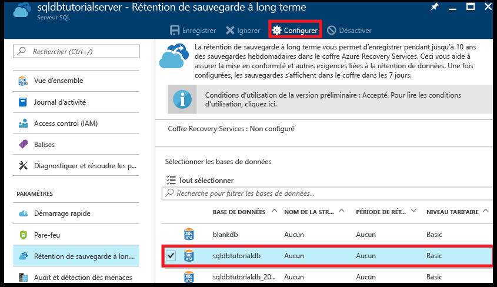

5. Dans le panneau **Configurer**, cliquez sur **Configurer les paramètres requis** sous **Coffre Recovery Services**.

   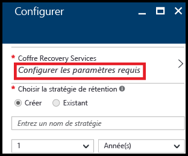

6. Dans le panneau **Coffre Recovery Services**, sélectionnez un éventuel coffre existant. Dans le cas contraire, si aucun coffre Recovery Services n’a été trouvé pour votre abonnement, cliquez pour quitter le flux, puis créez un coffre Recovery Services.

   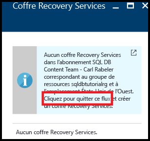

7. Dans le panneau **Coffres Recovery Services**, cliquez sur **Ajouter**.

   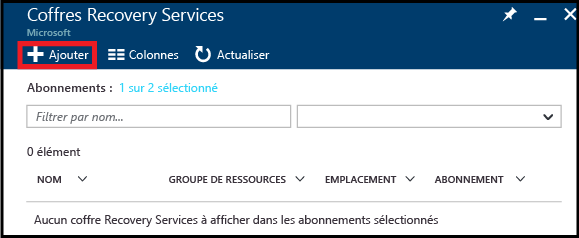
   
8. Dans le panneau **Coffre Recovery Services**, fournissez un nom valide pour le nouveau coffre Recovery Services.

   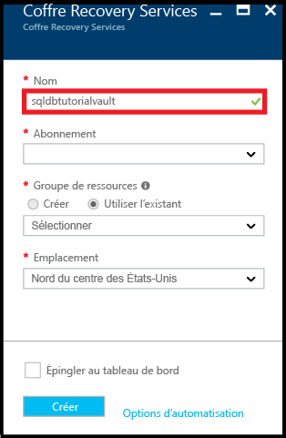

9. Sélectionnez votre abonnement et votre groupe de ressources, puis sélectionnez l’emplacement du coffre. Une fois que vous avez terminé, cliquez sur **Créer**.

   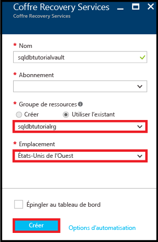

   > [!IMPORTANT]
   > Le coffre doit se trouver dans la même région que le serveur logique SQL Azure et doit utiliser le même groupe de ressources que le serveur logique.
   >

10. Une fois le nouveau coffre créé, exécutez les étapes nécessaires pour revenir au panneau **Coffre Recovery Services**.

11. Dans le panneau **Coffre Recovery Services**, cliquez sur le coffre, puis sur **Sélectionner**.

   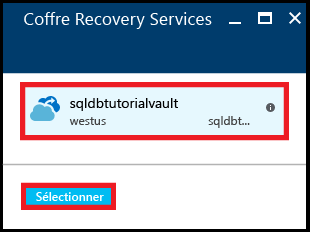

12. Dans le panneau **Configurer**, fournissez un nom valide pour la nouvelle stratégie de rétention, modifiez la stratégie de rétention par défaut à votre convenance, puis cliquez sur **OK**.

   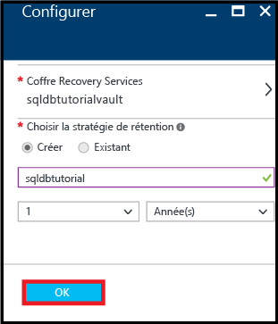

13. Dans le panneau **Long-term backup retention** (Rétention des sauvegardes à long terme), cliquez sur **Enregistrer**, puis sur **OK** pour appliquer la stratégie de rétention des sauvegardes à long terme à toutes les bases de données sélectionnées.

   

14. Cliquez sur **Enregistrer** pour activer la rétention des sauvegardes à long terme à l’aide de cette nouvelle stratégie dans le coffre Azure Recovery Services que vous avez configuré.

   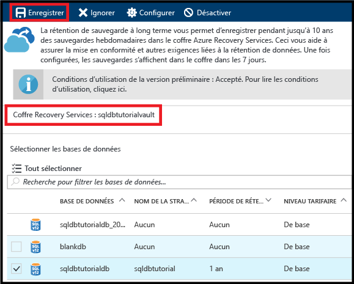

## Restaurer à partir de la rétention des sauvegardes à long terme avec le Portail Azure

1. Dans le panneau **Azure vault backups (Sauvegardes de coffre Azure)**, cliquez sur la sauvegarde à restaurer, puis cliquez sur **Sélectionner**.

    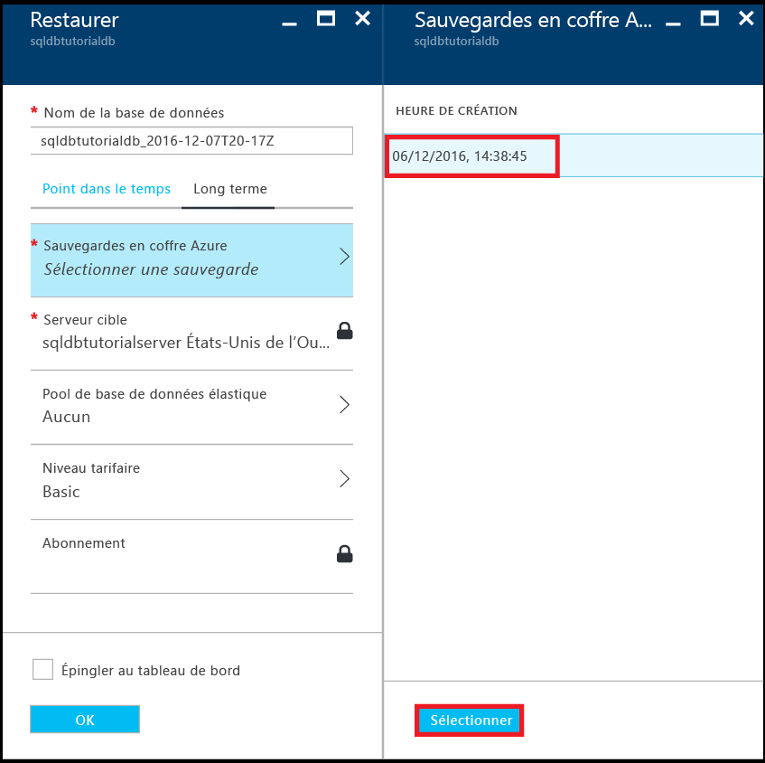

2. Dans la zone de texte **Nom de la base de données**, fournissez le nom de la base de données restaurée.

    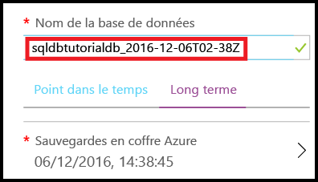

3. Cliquez sur **OK** pour restaurer votre base de données à partir de la sauvegarde dans le coffre sous la forme d’une nouvelle base de données.

4. Dans la barre d’outils, cliquez sur l’icône de notification pour visualiser l’état du travail de restauration.

    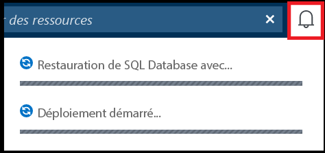

5. Lorsque le travail de restauration est terminé, ouvrez le panneau **Bases de données SQL** pour visualiser la base de données nouvellement restaurée.

    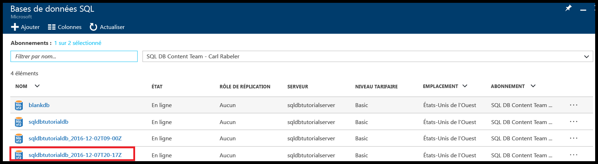

## Afficher des informations sur la rétention des sauvegardes à long terme avec le Portail Azure 

1. Ouvrez le panneau du coffre Azure Recovery Services (accédez à **Toutes les ressources**, puis sélectionnez cette entrée dans la liste des ressources de votre abonnement) pour visualiser la quantité de stockage utilisée par les sauvegardes de votre base de données dans le coffre.

   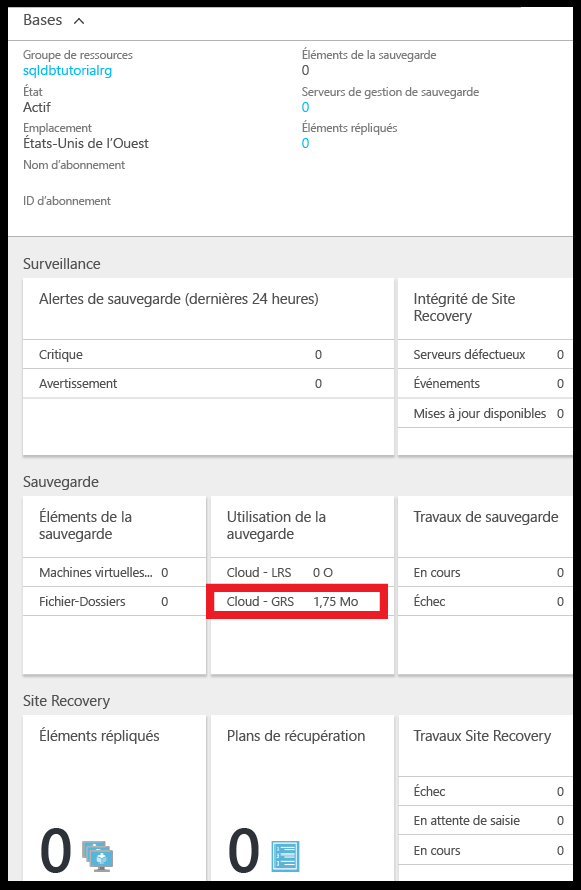

2. Ouvrez le panneau **Base de données SQL** de votre base de données.

    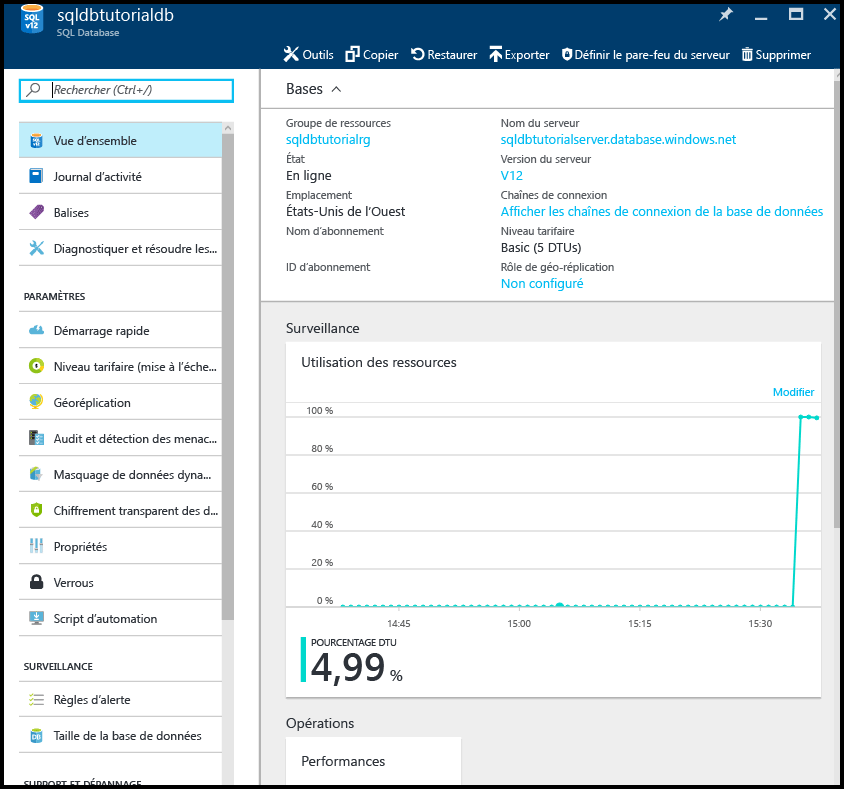

3. Dans la barre d’outils, cliquez sur **Restaurer**.

    

4. Dans le panneau Restaurer, cliquez sur **À long terme**.

5. Sous Azure vault backups (Sauvegardes de coffre Azure), cliquez sur **Sélectionner une sauvegarde** pour visualiser les sauvegardes de base de données disponibles dans la rétention des sauvegardes à long terme.

    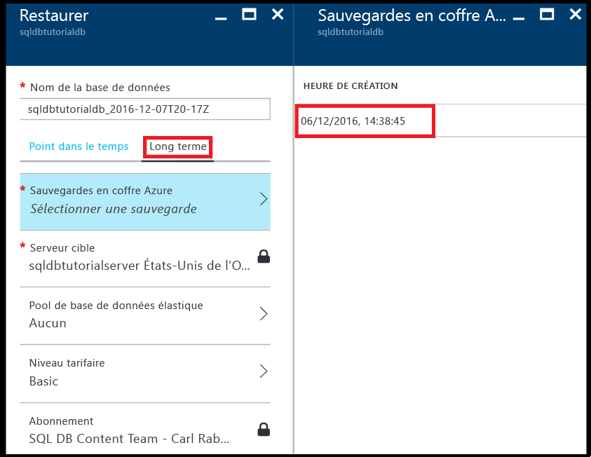

> [!TIP]
> Pour obtenir un didacticiel, consultez la page [Prise en main des fonctionnalités de sauvegarde et de restauration pour la protection et la récupération des données](sql-database-get-started-backup-recovery-portal.md).

## Étapes suivantes

- Pour gérer la rétention à long terme des sauvegardes avec PowerShell, consultez [Gestion de la rétention de sauvegarde à long terme avec PowerShell](sql-database-manage-long-term-backup-retention-powershell.md)
- Pour plus d’informations sur les sauvegardes automatiques générées par le service, consultez la page [Sauvegardes automatiques](sql-database-automated-backups.md).
- Pour plus d’informations sur la rétention des sauvegardes à long terme, consultez l’article décrivant la [rétention des sauvegardes à long terme](sql-database-long-term-retention.md).
- Pour plus d’informations sur la restauration à partir de sauvegardes, consultez l’article concernant la [restauration à l’aide de sauvegardes](sql-database-recovery-using-backups.md).
