<properties
	pageTitle="Gérer une base de données SQL Azure à l’aide du portail Azure | Microsoft Azure"
	description="Découvrez comment utiliser le portail Azure pour gérer une base de données relationnelle dans le cloud."
	services="sql-database"
	documentationCenter=""
	authors="stevestein"
	manager="jhubbard"
	editor=""/>

<tags
	ms.service="sql-database"
	ms.devlang="NA"
	ms.workload="data-management"
	ms.topic="article"
	ms.tgt_pltfrm="NA"
	ms.date="09/19/2016"
	ms.author="sstein"/>

# Gestion des bases de données SQL Azure au moyen du portail Azure

> [AZURE.SELECTOR]
- [Portail Azure](sql-database-manage-portal.md)
- [SSMS](sql-database-manage-azure-ssms.md)
- [PowerShell](sql-database-command-line-tools.md)

Le [portail Azure](https://portal.azure.com/) permet de créer, de surveiller et de gérer des serveurs et des bases de données SQL Azure. Cet article offre une description rapide des tâches les plus courantes et des liens vers des informations détaillées.

## Afficher vos bases de données, serveurs et pools SQL Azure

Pour afficher les services SQL Database disponibles, cliquez sur **Plus de services**, puis tapez **SQL** dans la zone de recherche :

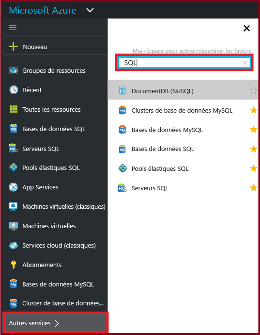

## Comment créer ou afficher des bases de données SQL Azure ?

Pour ouvrir le panneau **Bases de données SQL**, cliquez sur **Bases de données SQL**, puis cliquez sur la base de données avec laquelle vous souhaitez travailler, ou cliquez sur **+Ajouter** pour créer une base de données SQL. Pour plus d’informations, voir [Créer une base de données SQL en quelques minutes à l’aide du portail Azure](sql-database-get-started.md).

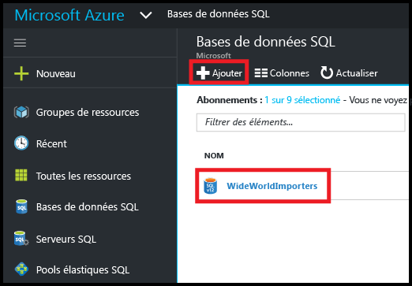

## Comment créer ou afficher des serveurs SQL Azure ?

Pour ouvrir le panneau **SQL**, cliquez sur **SQL**, puis cliquez sur le serveur avec lequel vous souhaitez travailler, ou cliquez sur **+Ajouter** pour créer un serveur SQL. Pour plus d’informations, voir [Créer une base de données SQL en quelques minutes à l’aide du portail Azure](sql-database-get-started.md).

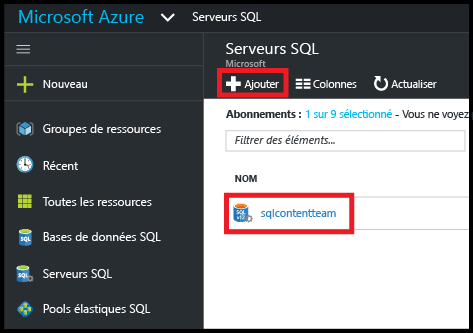

## Comment créer ou afficher des pools élastiques SQL ?

Pour ouvrir le panneau **Pools élastiques SQL**, cliquez sur **Pools élastiques SQL**, puis cliquez sur le pool avec lequel vous souhaitez travailler, ou cliquez sur **+Ajouter** pour créer un pool. Pour plus d’informations, voir [Création d’un pool de bases de données élastique avec le portail Azure](sql-database-elastic-pool-create-portal.md).

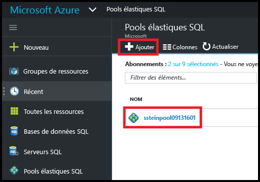

## Comment mettre à jour ou afficher les paramètres de base de données SQL ?

Pour afficher ou mettre à jour vos paramètres de base de données, cliquez sur le paramètre souhaité dans le panneau Base de données SQL :

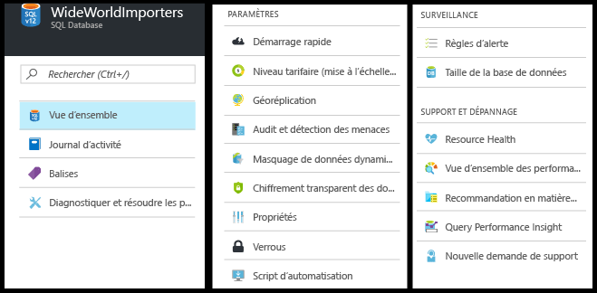

## Comment trouver le nom complet d’un serveur de bases de données SQL ?

Pour afficher le nom de votre serveur de bases de données, cliquez sur **Vue d’ensemble** dans le panneau **Base de données SQL**. Le nom du serveur est affiché à droite :

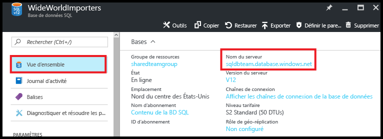

## Comment gérer les règles de pare-feu pour contrôler l’accès à mon serveur et à ma base de données SQL ?

Pour afficher, créer ou mettre à jour les règles de pare-feu, cliquez sur **Set server firewall** (Définir le pare-feu de serveur) dans le panneau **Base de données SQL**. Pour plus d’informations, voir [Configurer une règle de pare-feu au niveau du serveur sur une base de données SQL Azure à l’aide du portail Azure](sql-database-configure-firewall-settings.md).

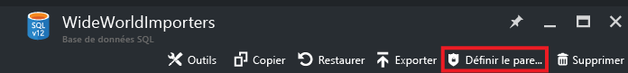

## Comment modifier le niveau de service ou de performances de ma base de données SQL ?

Pour mettre à jour le niveau de service ou de performances d’une base de données SQL, cliquez sur **Niveau tarifaire (mise à l’échelle de DTU)** dans le panneau **Base de données SQL**. Pour plus d’informations, voir [Modifier les niveaux de service et de performances (niveau tarifaire) d’une base de données SQL](sql-database-scale-up.md).

## Comment configurer l’audit et la détection des menaces pour une base de données SQL ?

Pour configurer l’audit et la détection des menaces pour une base de données SQL, cliquez sur **Audit et détection des menaces** dans le panneau **Base de données SQL**. Pour plus d’informations, voir [Prise en main de l’audit de base de données SQL](sql-database-auditing-get-started.md), et [rise en main de Threat Detection pour la base de données SQL](sql-database-threat-detection-get-started.md).

## Comment configurer le masquage dynamique des données pour une base de données SQL ?

Pour configurer le masquage dynamique des données pour une base de données SQL, cliquez sur **asquage dynamique des données** dans le panneau **Base de données SQL**. Pour plus d’informations, voir [Prise en main du masquage de données dynamiques de base de données SQL](sql-database-dynamic-data-masking-get-started.md).

## Comment configurer le chiffrement transparent des données (TDE) pour une base de données SQL ?

Pour configurer le chiffrement transparent des données pour une base de données SQL, cliquez sur **Chiffrement transparent des données** dans le panneau **Base de données SQL**. Pour plus d’informations, voir [Activation du chiffrement transparent des données sur une base de données à l’aide du portail](https://msdn.microsoft.com/library/dn948096#Anchor_1).

## Comment afficher ou modifier la taille maximale d’une base de données SQL ?

Pour afficher ou modifier la taille d’une base de données SQL, cliquez sur **aille de la base de données** dans le panneau **Base de données SQL**. Mettez à jour la taille maximale d’une base de données en modifiant le niveau de service ou de performances. Pour plus d’informations, voir [Modifier les niveaux de service et de performances (niveau tarifaire) d’une base de données SQL](sql-database-scale-up.md).

## Comment surveiller et améliorer les performances d’une base de données SQL ?

Pour surveiller et améliorer les caractéristiques de performances d’une base de données SQL, cliquez sur **Performance overview** (Vue d’ensemble des performances) dans le panneau **Base de données SQL**. Pour plus d’informations, voir [Informations sur les performances des bases de données SQL](sql-database-performance.md).

## Comment configurer la géoréplication ?

Pour configurer la géoréplication pour une base de données SQL, cliquez sur **Géo-réplication** dans le panneau **Base de données SQL**. Pour plus d’informations, voir [Configurer la géoréplication pour Base de données SQL Azure avec le portail Azure](sql-database-geo-replication-portal.md).

## Comment basculer vers une base de données SQL géorépliquée ?

Pour basculer vers une base de données secondaire géo-répliquée, cliquez sur **Géo-réplication** dans le panneau **Base de données SQL**, puis sur **Basculement**. Pour plus d’informations, voir [Lancer un basculement planifié ou non planifié pour une base de données SQL Azure avec le portail Azure](sql-database-geo-replication-failover-portal.md).

## Comment copier une base de données SQL ?

Pour copier une base de données SQL, cliquez sur **Copier** dans le panneau **Base de données SQL**. Pour plus d’informations, voir [Copie d’une base de données SQL Azure à l’aide du portail Azure](sql-database-copy-portal.md).

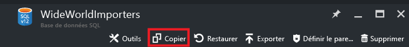

## Comment archiver une base de données SQL Azure dans un fichier BACPAC ?

Pour créer un fichier BACPAC d’une base de données SQL, cliquez sur **Exporter** dans le panneau **Base de données SQL**. Pour plus d’informations, voir [Archiver une base de données SQL Azure dans un fichier BACPAC à l’aide du portail Azure](sql-database-export.md).

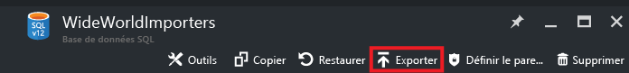

## Comment restaurer une base de données SQL à un point antérieur dans le temps ?

Pour restaurer une base de données SQL, cliquez sur **Restaurer** dans le panneau **Base de données SQL**. Pour plus d’informations, voir [Restaurer une base de données SQL Azure à un point antérieur dans le temps avec le portail Azure](sql-database-point-in-time-restore-portal.md).

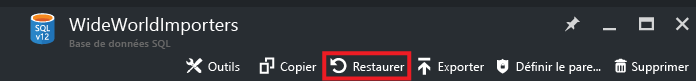

## Comment créer une base de données SQL Azure à partir d’un fichier BACPAC ?

Pour créer une base de données SQL à partir d’un fichier BACPAC, cliquez sur **Importer la base de données** dans le panneau **Serveur SQL**. Pour plus d’informations, voir [Importer un fichier BACPAC pour créer une base de données SQL Azure](sql-database-import.md).

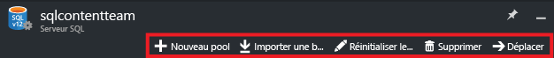

## Comment restaurer une base de données SQL supprimée ?

Pour restaurer une base de données SQL supprimée, cliquez sur **Bases de données supprimées** dans le panneau **Serveur SQL** (le serveur SQL qui contenait la base de données supprimée). Pour plus d’informations, voir [Restaurer une base de données SQL Azure supprimée à l’aide du portail Azure](sql-database-restore-deleted-database-portal.md).

## Comment supprimer une base de données SQL ?

Pour supprimer une base de données SQL, cliquez sur **Supprimer** dans le panneau **Base de données SQL**.

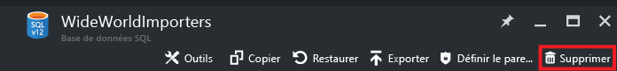

## Ressources supplémentaires

- [Base de données SQL](sql-database-technical-overview.md)
- [Surveiller et gérer un pool de bases de données élastique avec le portail Azure](sql-database-elastic-pool-manage-portal.md)

<!---HONumber=AcomDC_0921_2016-->