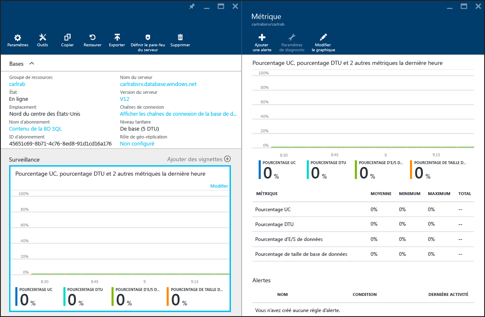

<properties
	pageTitle="Options et performances de la base de données SQL : Niveaux de service | Microsoft Azure"
	description="Comparez les performances et les fonctionnalités de continuité d’activité des différents niveaux de service des bases de données SQL afin de trouver le juste équilibre entre les coûts et les capacités en matière d’évolutivité."
	keywords="options de base de données, performances de la base de données, eDTU"
	services="sql-database"
	documentationCenter=""
	authors="rothja"
	manager="jeffreyg"
	editor="monicar"/>

<tags
	ms.service="sql-database"
	ms.devlang="na"
	ms.topic="get-started-article"
	ms.tgt_pltfrm="na"
	ms.workload="data-management"
	ms.date="11/10/2015"
	ms.author="jroth"/>

# Options et performances de la base de données SQL : comprendre ce qui est disponible dans chaque niveau de service
 

La [base de données SQL Azure](sql-database-technical-overview.md) fournit plusieurs niveaux de service pour gérer les différents types de charges de travail. Vous pouvez [créer une base de données unique](sql-database-get-started.md) avec des caractéristiques et une tarification définies. Vous pouvez également gérer plusieurs bases de données en [créant un pool de bases de données élastiques](sql-database-elastic-pool-portal.md). Dans les deux cas, les niveaux **De base**, **Standard** et **Premium** sont inclus. Les options de base de données de ces niveaux varient selon que vous créez une base de données unique ou une base de données dans un pool de base de données élastique. Cet article fournit une vue d'ensemble des niveaux de service dans les deux contextes.

## Niveaux de service et options de base de données
Les niveaux de service De base, Standard et Premium proposent un contrat SLA garantissant un temps d'activité de 99,99 %. Par ailleurs, ils proposent des performances prévisibles, des options de continuité d'activité d'entreprise professionnelles, des fonctionnalités de gestion de la sécurité et une facturation à l'heure. Le tableau suivant fournit des exemples de niveaux adaptés à différentes charges de travail d'application.

| Niveau de service | Charges de travail cibles |
|---|---|
| **De base** | Idéal pour une petite base de données prenant en général en charge une seule opération active à la fois. Exemple : bases de données utilisées pour le développement ou le test ou pour des applications à petite échelle rarement utilisées. |
| **Standard** | L'option idéale pour la plupart des applications cloud, prenant en charge plusieurs requêtes simultanées. Exemple : applications Web ou de groupe de travail. |
| **Premium** | Conçu pour un volume transactionnel élevé, prenant en charge un grand nombre d'utilisateurs simultanés et nécessitant le plus haut niveau de continuité d'activité possible. Exemple : bases de données prenant en charge des applications critiques. |

>[AZURE.NOTE]Les éditions « Web et Business » seront retirées. Découvrez comment [mettre à niveau les éditions « Web et Business »](sql-database-upgrade-new-service-tiers.md). Si vous souhaitez continuer à utiliser ces éditions, reportez-vous à la [FAQ Sunset](http://azure.microsoft.com/pricing/details/sql-database/web-business/).

### Niveau de service et niveau de performances d’une base de données unique
Pour des bases de données uniques, il existe plusieurs niveaux de performances au sein de chaque niveau de service. Vous avez la possibilité de choisir celui qui répond le mieux aux besoins de votre charge de travail. Si vous avez besoin de faire monter le système en puissance ou de réduire son échelle, vous pouvez très simplement modifier ses niveaux dans le portail Microsoft Azure, sans occasionner de coupure de service pour votre application. Pour en savoir plus, voir [Modification des niveaux de service et de performances de base de données](sql-database-scale-up.md).

Les caractéristiques de performances répertoriées ici s’appliquent aux bases de données créées à l’aide de [SQL Database V12](sql-database-v12-whats-new.md). Dans les situations où le matériel sous-jacent d’Azure héberge plusieurs bases de données SQL, votre base de données obtiendra un ensemble de ressources garanti, et les caractéristiques de performance attendues de la base de données n’est pas affectée.

[AZURE.INCLUDE [Tableau de niveaux de service de base de données SQL](../../includes/sql-database-service-tiers-table.md)]

Pour une meilleure compréhension des DTU, consultez la [section DTU](#understanding-dtus) de cette rubrique.

>[AZURE.NOTE]Pour une explication détaillée du contenu de toutes les autres lignes de ce tableau de niveaux de service, consultez [Capacités et limites des niveaux de service](sql-database-performance-guidance.md#service-tier-capabilities-and-limits).

### Niveau de service et niveau de performances d’un pool de base de données élastiques dans les eDTU
Outre la création et la mise à l’échelle d’une base de données unique, vous avez également la possibilité de gérer plusieurs bases de données dans un [pool de base de données élastique](sql-database-elastic-pool.md). Toutes les bases de données dans un pool de base de données élastique partagent un ensemble commun de ressources. Les caractéristiques de performances sont mesurées par les *unités de transaction de base de données élastique* (eDTU). Comme avec les bases de données uniques, les pools de bases de données élastiques sont fournis en trois niveaux de service : **De base**, **Standard** et **Premium**. Pour les bases de données élastiques, ces trois niveaux de service définissent toujours les limites de performances globales et les fonctionnalités proposées.

Les pools de base de données élastiques permettent à ces bases de données de partager et de consommer des ressources DTU sans avoir à affecter un niveau de performances spécifique aux bases de données dans le pool. Par exemple, une base de données unique dans un pool standard peut être offerte avec de 0 eDTU au nombre d'eDTU maximum de la base de données (100 eDTU définis par le niveau de service ou un nombre personnalisé que vous configurez). Cela permet à plusieurs bases de données avec différentes charges de travail d'utiliser efficacement les ressources eDTU disponibles pour l'ensemble du pool.

Le tableau suivant décrit les caractéristiques des niveaux de service de pools de base de données élastiques.

[AZURE.INCLUDE [Tableau des niveaux de service de base de données SQL pour les bases de données élastiques](../../includes/sql-database-service-tiers-table-elastic-db-pools.md)]

Chaque base de données au sein d'un pool respecte également les caractéristiques de base de données unique pour ce niveau. Par exemple, le pool de base possède une limite de sessions maximale par pool de 2400 à 28800, mais une base de données individuelle dans ce pool a une limite de base de données de 300 sessions (limite pour une seule base de données de base comme spécifié dans la section précédente).

### Présentation des DTU

[AZURE.INCLUDE [Description de la DTU d'une base de données SQL](../../includes/sql-database-understanding-dtus.md)]

## Surveillance des performances de la base de données
L’analyse des performances d’une base de données SQL démarre par l’analyse de l’utilisation des ressources par rapport au niveau de performances que vous avez choisi pour votre base de données. Ces données pertinentes sont exposées comme suit :

1.	Le portail de gestion Microsoft Azure.

2.	Vues de gestion dynamique dans la base de données utilisateur et dans la base de données master du serveur qui contient la base de données utilisateur.

Dans le [portail Azure en version préliminaire](https://portal.azure.com/), vous pouvez surveiller l’utilisation d’une base de données unique en sélectionnant votre base de données et en cliquant sur le graphique **Analyse**. Une fenêtre **Mesure** apparaît. Vous pouvez la modifier en cliquant sur le bouton **Modifier le graphique**. Ajoutez les mesures suivantes :

- Pourcentage UC
- Pourcentage DTU
- Pourcentage E/S données
- Pourcentage de stockage

Une fois que vous avez ajouté ces mesures, vous pouvez continuer à les afficher dans le graphique **Analyse** avec plus de détails dans la fenêtre **Mesure**. Les quatre mesures montrent le pourcentage d’utilisation moyen correspondant aux **DTU** de votre base de données.

Vous pouvez également configurer des alertes sur les mesures de performances. Cliquez sur le bouton **Ajouter une alerte** situé dans la fenêtre **Mesure**. Suivez l'assistant pour configurer votre alerte. Vous avez la possibilité de configurer une alerte si les mesures dépassent un certain seuil ou si la mesure tombe en dessous d'un certain seuil.

Par exemple, si vous pensez que la charge de travail dans votre base de données va augmenter, vous pouvez choisir de configurer une alerte par courrier électronique chaque fois que votre base de données atteint 80 % de n'importe quelle mesure de performances. Vous pouvez utiliser cette fonction comme un avertissement pour déterminer le moment auquel il se peut que vous deviez basculer vers le niveau de performance supérieur.

Les mesures de performance peuvent également vous aider à déterminer si vous pouvez passer à un niveau inférieur. Supposons que vous utilisez une base de données standard S2 et que toutes les mesures de performance indiquent que la base de données n'utilise pas plus de 10 % des performances en moyenne. Cette base de données fonctionnerait très bien en version S1 standard. Toutefois, prenez en considération les éventuels pics ou baisses de charges de travail avant de décider de passer à un niveau de performances inférieur.

Les mêmes mesures exposées dans le portail sont également disponibles via des vues système : [sys.resource\_stats](https://msdn.microsoft.com/library/dn269979.aspx) dans la base de données **master** logique de votre serveur, et [sys.dm\_db\_resource\_stats](https://msdn.microsoft.com/library/dn800981.aspx) dans la base de données utilisateur (**sys.dm\_db\_resource\_stats** est créé dans chaque base de données utilisateur De base, Standard et Premium. Les bases de données éditions Web et Business retournent un jeu de résultats vide). Utilisez **sys.resource\_stats** si vous devez analyser des données moins granulaires sur une longue période de temps. Utilisez **sys.dm\_db\_resource\_stats** si vous devez analyser des données plus granulaires dans un laps de temps plus court. Pour en savoir plus, consultez [Guide des performances de base de données SQL Azure](sql-database-performance-guidance.md#monitoring-resource-use-with-sysresourcestats).

Pour les pools de base de données élastiques, vous pouvez surveiller des bases de données dans le pool avec les techniques décrites dans cette section. Mais vous pouvez également surveiller le pool dans son ensemble. Pour en savoir plus, consultez [Surveiller et gérer un pool élastique de bases de données](sql-database-elastic-pool-portal.md#monitor-and-manage-an-elastic-database-pool).

## Étapes suivantes
Pour en savoir plus sur la tarification de ces niveaux, voir [Base de données SQL - Tarification](http://azure.microsoft.com/pricing/details/sql-database/).

Si vous êtes intéressé par la gestion de plusieurs bases de données en tant que groupe, envisagez les [pools de bases de données élastiques](sql-database-elastic-pool-guidance.md) en tenant compte des [considérations sur les prix et performances pour un pool de bases de données élastiques](sql-database-elastic-pool-guidance.md).

Maintenant que vous êtes au fait des différents niveaux de base de données SQL, essayez-les, grâce à notre version [d’essai gratuit](http://azure.microsoft.com/pricing/free-trial/), et découvrez [comment créer votre première base de données SQL](sql-database-get-started.md) !
 

<!---HONumber=Nov15_HO4-->