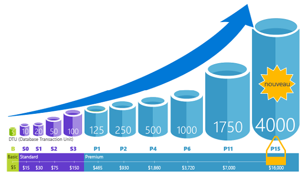
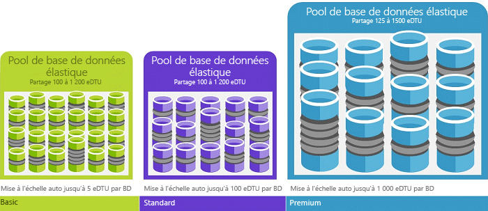

# Explication des unités de transaction de base de données (DTU) et des unités de transaction de base de données élastique (eDTU)
Cet article explique les unités de transaction de base de données (DTU) et les unités de transaction de base de données élastique (eDTU) et ce qu’il se passe lorsque vous avez atteint le nombre maximal de DTU et d’eDTU.  

## Définition des unités de transaction de base de données (DTU)
Une DTU est une unité de mesure des ressources dont la disponibilité est assurée pour une base de données SQL Azure unique à un niveau de performance spécifique au sein d’un [niveau de service de base de données unique](sql-database-service-tiers.md#single-database-service-tiers-and-performance-levels). Une DTU est une mesure mixte de l’UC, de la mémoire et des E/S de données et des E/S du journal des transactions selon un ratio déterminé par une charge de travail d’évaluation OLTP conforme aux charges de travail OLTP réelles standard. Le fait de doubler les DTU en augmentant le niveau de performance d’une base de données revient à doubler l’ensemble des ressources disponibles pour cette base de données. Par exemple, une base de données Premium P11 comprenant 1 750 DTU fournit une puissance de calcul DTU 350 fois plus importante qu’une base de données de base comprenant 5 DTU. Pour comprendre la méthodologie sous-jacente à la charge de travail d’évaluation OLTP utilisée pour déterminer la fusion DTU, consultez [Vue d’ensemble du test d’évaluation de la base de données SQL](sql-database-benchmark-overview.md).

Vous pouvez [modifier les niveaux de service](sql-database-scale-up.md) à tout moment avec un temps d’arrêt minimal de votre application (généralement sous les quatre secondes environ). Pour de nombreuses entreprises et applications, la possibilité de créer des bases de données et d’augmenter ou ralentir les performances à la demande se révèle suffisante, surtout si les modèles d’utilisation sont relativement prévisibles. Mais si vous avez des modèles d'utilisation imprévisibles, il peut être difficile de gérer les coûts et votre modèle commercial. Pour ce scénario, vous utilisez un pool élastique avec un certain nombre d’eDTU.

## Définition des unités de transaction de base de données élastique (DTU)
Une eDTU est une unité de mesure de l’ensemble des ressources (DTU) pouvant être partagées au sein d’un ensemble de bases de données sur un serveur SQL Azure (appelé [pool élastique](sql-database-elastic-pool.md)). Les pools élastiques offrent une solution simple et économique pour gérer les objectifs de performance de plusieurs bases de données ayant des modèles d’utilisation variables et non prévisibles. Pour plus d’informations,consultez [niveaux de service des pools élastiques](sql-database-service-tiers.md#elastic-pool-service-tiers-and-performance-in-edtus) .

Un pool bénéficie d’un nombre défini d’eDTU, pour un prix donné. Au sein du pool élastique, les différentes bases de données peuvent s’adapter facilement et automatiquement aux limites définies. En cas de charge importante, une base de données peut consommer davantage d’eDTU pour satisfaire la demande, tandis qu’une base de données sous une charge légère en consomme moins, et que les bases de données sans charge ne consomment aucune eDTU. En configurant les ressources pour l’ensemble du pool, plutôt que pour chaque base de données, les tâches de gestion sont simplifiées et vous avez un aperçu du budget nécessaire pour le pool.

Vous pouvez ajouter des eDTU à un pool existant sans que les bases de données du pool ne connaissent de temps d’arrêt et ne soient affectées. De même, si les eDTU supplémentaires ne sont plus nécessaires, elles peuvent être supprimées à partir d’un pool existant à tout moment. Vous pouvez ajouter des bases de données dans le pool ou en supprimer. Vous pouvez également limiter la quantité d’eDTU qu’une base de données peut utiliser en cas de charge importante pour réserver des eDTU pour les autres bases de données. Si on prévoit qu’une base de données sous-utilise des ressources, vous pouvez la déplacer hors du pool et la configurer comme une base de données unique avec une quantité prévisible des ressources nécessaires.

## Comment puis-je déterminer le nombre de DTU requises par ma charge de travail ?
Si vous cherchez à migrer une charge de travail de machine virtuelle SQL Server ou locale existante vers une base de données SQL Azure, vous pouvez utiliser l’outil [DTU Calculator](http://dtucalculator.azurewebsites.net/) pour évaluer approximativement le nombre de DTU requises. Dans le cas d’une charge de travail de base de données SQL Azure existante, vous pouvez utiliser [Query Performance Insight pour base de données SQL](sql-database-query-performance.md) pour comprendre votre consommation des ressources de la base de données (DTU) et obtenir des informations plus approfondies sur la façon d’optimiser votre charge de travail. Vous pouvez également utiliser la DMV [sys.dm_db_ resource_stats](https://msdn.microsoft.com/library/dn800981.aspx) pour obtenir les informations sur la consommation des ressources au cours de la dernière heure. Sinon, la vue de catalogue [sys.resource_stats](http://msdn.microsoft.com/library/dn269979.aspx) peut également être interrogée pour obtenir les mêmes données pour les 14 derniers jours, mais avec une précision inférieure (moyennes de cinq minutes).

## Comment savoir si je peux tirer parti d’un pool élastique de ressources ?
Les pools sont idéaux dans le cas de nombreuses bases de données avec des modèles d’utilisation spécifiques. Pour une base de données indiquée, ce modèle se caractérise par une faible utilisation moyenne avec des pics d'utilisation relativement rares. La base de données SQL évalue automatiquement l’historique d’utilisation en ressources des bases de données dans un serveur de base de données SQL existant et recommande la configuration de pool appropriée dans le portail Azure. Pour plus d’informations, consultez l’article [Quand utiliser un pool élastique ?](sql-database-elastic-pool-guidance.md).

## Que se passe-t-il lorsque j’atteins le nombre maximal de DTU ?
Les niveaux de performances sont étalonnés et régis pour fournir les ressources nécessaires permettant d’exécuter la charge de travail de votre base de données dans les limites maximales autorisées pour le niveau de service/niveau de performances sélectionné. Si votre charge de travail atteint les limites d’utilisation du processeur, d’E/S des données ou d’E/S du journal, vous continuez à recevoir les ressources au niveau maximum autorisé, mais la latence de vos requêtes sera augmentée. Ces limites ne génèrent pas d’erreur, plutôt un ralentissement de la charge de travail, sauf si le ralentissement s’accentue au point que les requêtes arrivent à expiration. Si vous atteignez les limites maximales autorisées de sessions/demandes utilisateur simultanées (threads de travail), vous voyez des erreurs explicites. Pour plus d’informations sur la limite des ressources autres que le processus, la mémoire, les E/S de données et les E/S du journal des transactions, consultez [Limites de ressources de base de données SQL Azure](sql-database-resource-limits.md) .

## Étapes suivantes
* Pour plus d’informations sur les DTU et les eDTU disponibles pour les bases de données uniques et les pools élastiques, consultez [Niveau de Service](sql-database-service-tiers.md) .
* Pour plus d’informations sur la limite des ressources autres que le processus, la mémoire, les E/S de données et les E/S du journal des transactions, consultez [Limites de ressources de base de données SQL Azure](sql-database-resource-limits.md) .
* Pour comprendre votre consommation de DTU, consultez [Query Performance Insight pour base de données SQL](sql-database-query-performance.md) .
* Pour comprendre la méthodologie sous-jacente à la charge de travail d’évaluation OLTP utilisée pour déterminer la fusion DTU, consultez [Vue d’ensemble du test d’évaluation de la base de données SQL](sql-database-benchmark-overview.md) .

<!--HONumber=Jan17_HO1-->

