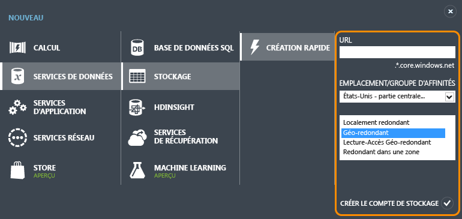
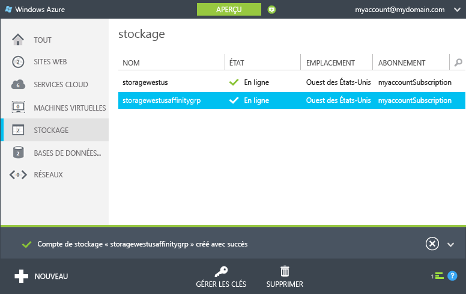
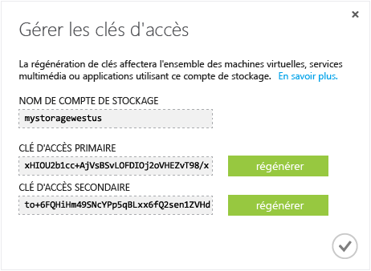

<properties
	pageTitle="Création, gestion ou suppression d’un compte de stockage | Azure"
	description="Découvrez comment créer, gérer ou supprimer un compte de stockage dans le portail de gestion Azure."
	services="storage"
	documentationCenter=""
	authors="tamram"
	manager="adinah"
	editor=""/>

<tags
	ms.service="storage"
	ms.workload="storage"
	ms.tgt_pltfrm="na"
	ms.devlang="na"
	ms.topic="get-started-article" 
	ms.date="07/16/2015"
	ms.author="tamram"/>

# À propos des comptes de stockage Azure

## Vue d'ensemble

Un compte de stockage Azure est un compte sécurisé qui vous donne accès aux services BLOB, File d’attente, Table et Fichier d’Azure Storage. Votre compte de stockage fournit les espaces de noms uniques pour vos objets de données Azure Storage. Par défaut, les données de votre compte sont uniquement accessibles par vous, le propriétaire du compte.

Il existe deux types de comptes de stockage :

- un compte de stockage standard qui inclut le stockage d'objets blob, de tables et de files d'attente. Le stockage de fichiers est disponible à la demande dans la [page du portail Azure en version préliminaire](http://azure.microsoft.com/services/preview/).
- Un compte de stockage Premium prend actuellement en charge uniquement les disques Machine virtuelle Azure. Pour une présentation détaillée du stockage Premium, consultez [Stockage Premium : stockage hautes performances pour les charges de travail des machines virtuelles Azure](storage-premium-storage-preview-portal.md).

## Facturation du compte de stockage

La facturation de l’utilisation d’Azure Storage est basée sur votre compte de stockage. Les coûts de stockage sont basés sur quatre facteurs : la capacité de stockage, le schéma de réplication, les transactions de stockage et l’acheminement des données.

- La capacité de stockage fait référence à l’unité de compte de stockage que vous utilisez pour stocker des données. Le coût d’un simple stockage de vos données est déterminé par la quantité de données que vous stockez et leur type de réplication.
- La réplication détermine le nombre de copies de vos données qui sont conservées simultanément et à quels emplacements.
- Les transactions font références à toutes les opérations de lecture et d'écriture vers Azure Storage.
- L'acheminement des données fait référence aux données transférées hors d'une région Azure. Lorsque les données de votre compte de stockage sont utilisées par une application qui n'est pas exécutée dans la même région, que cette application soit un service cloud ou un autre type d'application, vous êtes facturé pour l'acheminement des données (pour les services Azure, vous pouvez grouper vos données et services dans les mêmes centres de données pour réduire ou éliminer les frais d'acheminement des données).  

La page [Tarification – Stockage](http://azure.microsoft.com/pricing/details/#storage) fournit des informations de tarification détaillées pour les capacités de stockage, la réplication et les transactions. La page [Détails de la tarification – Transferts de données](http://azure.microsoft.com/pricing/details/data-transfers/) fournit des informations de tarification détaillées pour les acheminements de données.

Pour plus d’informations sur la capacité et les objectifs de performance du compte de stockage, consultez la page [Objectifs de performance et évolutivité d’Azure Storage](http://msdn.microsoft.com/library/azure/dn249410.aspx).

> [AZURE.NOTE]Lorsque vous créez une machine virtuelle Azure, un compte de stockage est créé automatiquement pour vous sur le lieu de déploiement si vous ne disposez pas déjà de ce type de compte à cet emplacement. Il n’est donc pas nécessaire de suivre les étapes ci-dessous pour créer un compte de stockage pour vos disques de machines virtuelles. Le nom du compte de stockage dépend du nom de la machine virtuelle. Pour plus d’informations, consultez la [documentation relative aux machines virtuelles Azure](http://azure.microsoft.com/documentation/services/virtual-machines/).

## Créez un compte de stockage.

1. Connectez-vous au [portail de gestion](https://manage.windowsazure.com).

2. Cliquez sur **Create New**, sur **Stockage**, puis sur **Quick Create**.

	

3. Dans **URL**, entrez le nom de votre compte de stockage.
	
	> [AZURE.NOTE]Ce nom doit comporter entre 3 et 24 caractères, uniquement des lettres minuscules et des chiffres.
	>  
	> Le nom de votre compte de stockage doit être unique dans Azure. Le portail indique si le nom du compte de stockage sélectionné est déjà utilisé.

	Pour en savoir plus sur l’utilisation du nom de compte de stockage pour adresser les objets que vous stockez dans Azure Storage, consultez [Points de terminaison d’un compte de stockage](#storage-account-endpoints).

4. Dans **Emplacement/Groupe d’affinités**, sélectionnez un emplacement pour votre compte de stockage qui soit proche de vous ou de vos clients. Si l’accès aux données de votre compte de stockage se fera à partir d’un autre service Azure, comme un service cloud ou une machine virtuelle Azure, vous pouvez sélectionner un groupe d’affinités dans la liste afin de regrouper votre compte de stockage dans le même centre de données que les autres services Azure que vous utilisez. Les performances en seront améliorées et les coûts réduits.

	Notez que vous devez sélectionner un groupe d’affinités lors de la création de votre compte de stockage ; vous ne pouvez pas déplacer un compte existant vers un groupe d’affinités. Pour plus d’informations sur les groupes d’affinités, consultez [Colocalisation de service avec un groupe d’affinités](#service-co-location-with-an-affinity-group) ci-dessous.

5. Si vous disposez de plusieurs abonnements Azure, le champ **Subscription** s'affiche. Dans **Subscription**, entrez l'abonnement Azure à utiliser avec le compte de stockage.

6. Dans **Réplication**, sélectionnez le niveau de réplication souhaité pour votre compte de stockage. L’option de réplication recommandée est la réplication géo-redondante qui offre une durabilité maximale pour vos données. Pour en savoir plus sur les options de réplication d’Azure Storage, consultez [Options de réplication des comptes de stockage](storage-redundancy.md).

6. Cliquez sur **Create Storage Account**.

	La création de votre compte de stockage peut prendre plusieurs minutes. Pour vérifier l'état d'avancement de l'opération, vous pouvez contrôler les notifications au bas du portail. Une fois que le compte de stockage est créé, le statut **Online** lui est associé et il est prêt à être utilisé.

### Points de terminaison d’un compte de stockage

Chaque objet que vous stockez dans Azure Storage possède une adresse URL unique ; le nom du compte de stockage forme le sous-domaine de cette adresse. Le sous-domaine et le nom du domaine, qui sont propres à chaque service, forment un *point de terminaison* pour votre compte de stockage.

Par exemple, si le nom de votre compte de stockage est *mystorageaccount*, les points de terminaison par défaut de votre compte de stockage sont les suivants :

- Service BLOB : http://*mystorageaccount*.blob.core.windows.net

- Service de table : http://*mystorageaccount*.table.core.windows.net

- Service de file d'attente : http://*mystorageaccount*.queue.core.windows.net

- Service de fichiers : http://*mystorageaccount*.file.core.windows.net

Les points de terminaison pour votre compte de stockage sont visibles dans le tableau de bord de stockage du portail de gestion Azure une fois le compte créé.

L’URL permettant d’accéder à un objet dans un compte de stockage est constituée de l’ajout de l’emplacement de l’objet dans le compte de stockage au point de terminaison. Par exemple, une adresse d’objet blob peut avoir ce format : http://*mystorageaccount*.blob.core.windows.net/*mycontainer*/*myblob*.

Vous pouvez aussi configurer un nom de domaine personnalisé à utiliser avec votre compte de stockage. Pour en savoir plus, consultez [Configuration d’un nom de domaine personnalisé pour des données d’objets blob dans un compte de stockage](storage-custom-domain-name.md).

### Colocalisation de service avec un groupe d’affinités

Un *groupe d'affinités* est un regroupement géographique de vos services et machines virtuelles Azure avec votre compte de stockage Azure. Un groupe d'affinités peut améliorer les performances d'un service en situant les charges de travail d'un ordinateur dans le même centre de données ou près des utilisateurs cibles. De même, vous n’êtes pas facturé pour les acheminements lorsque les données d’un compte de stockage sont utilisées par un service faisant partie du même groupe d’affinités.

> [AZURE.NOTE]Pour créer un groupe d’affinités, ouvrez la zone <b>Paramètres</b> du portail de gestion, cliquez sur <b>Groupes d’affinités</b>, puis sur <b>Ajouter un groupe d’affinités</b> ou le bouton <b>Ajouter</b>. Vous pouvez également créer et gérer des groupes d’affinités à l’aide de l’API de gestion des services Azure. Pour plus d’informations, consultez <a href="http://msdn.microsoft.com/library/azure/ee460798.aspx">Opérations sur les groupes d’affinités</a>.

## Affichage, copie et régénération de clés d’accès de stockage

Lorsque vous créez un compte de stockage, Azure génère deux clés d'accès de stockage de 512 bits, qui servent à l'authentification lors de l'accès au compte de stockage. En fournissant deux clés d'accès de stockage, Azure vous permet de régénérer les clés sans interrompre votre service de stockage ni l'accès à ce service.

> [AZURE.NOTE]Nous vous recommandons d’éviter de partager les clés d’accès à votre compte de stockage avec qui que ce soit. Pour autoriser l'accès aux ressources de stockage sans donner vos clés d'accès, vous pouvez utiliser une *signature d'accès partagé*. Celle-ci donne accès à votre compte à une ressource pendant une durée que vous déterminez et avec les autorisations que vous spécifiez. Pour plus d'informations, consultez le [didacticiel sur les signatures d'accès partagé](storage-dotnet-shared-access-signature-part-1.md).

Dans le [portail de gestion](http://manage.windowsazure.com), utilisez **Manage Keys** sur le tableau de bord ou la page **Storage** pour afficher, copier et régénérer les clés d'accès de stockage qui servent à accéder aux services Blob, de Table et de File d'attente.

### Copie d'une clé d'accès de stockage  

L'option **Manage Keys** sert à copier une clé d'accès de stockage à utiliser dans une chaîne de connexion. Cette dernière nécessite le nom du compte de stockage et une clé pour l’authentification. Pour plus d'informations sur la configuration des chaînes de connexion pour accéder aux services de stockage Azure, consultez la page [Configuration des chaînes de connexion Azure](http://msdn.microsoft.com/library/azure/ee758697.aspx).

1. Dans le [portail de gestion](http://manage.windowsazure.com), cliquez sur **Storage**, puis sur le nom du compte de stockage pour ouvrir le tableau de bord.

2. Cliquez sur **Manage Keys**.

 	**Manage Access Keys** s'affiche.

	

3. Pour copier une clé d’accès de stockage, sélectionnez le texte de la clé. Cliquez ensuite avec le bouton droit, puis cliquez sur **Copier**.

### Régénération des clés d'accès de stockage
Vous devez modifier périodiquement les clés d'accès à votre compte de stockage pour garantir la sécurité des connexions de stockage. Vous bénéficiez de deux clés d’accès, ce qui vous permet de conserver des connexions au compte de stockage à l’aide d’une clé d’accès lorsque vous régénérez l’autre clé.

> [AZURE.WARNING]La régénération des clés d’accès a une incidence sur les machines virtuelles, les services de médias et toutes les applications qui dépendent du compte de stockage. Tous les clients qui utilisent la clé d'accès pour accéder au compte de stockage doivent être mis à jour pour utiliser la nouvelle clé.

**Machines virtuelles** : si votre compte de stockage contient des machines virtuelles en cours d'exécution, vous devez redéployer toutes les machines virtuelles après avoir régénéré les clés d'accès. Pour éviter le redéploiement, arrêtez les machines virtuelles avant de régénérer les clés d'accès.

**Services de médias** : si des services de médias sont liés à votre compte de stockage, vous devez resynchroniser les clés d'accès avec ces services après avoir régénéré les clés.

**Applications** : si des applications Web ou des services cloud utilisent le compte de stockage, vous perdez les connexions en régénérant les clés, à moins de les substituer. Pour ce faire :

1. Mettez à jour les chaînes de connexion dans votre code d'application pour désigner la clé d'accès secondaire du compte de stockage.

2. Régénérez la clé d'accès principale de votre compte de stockage. Dans le [portail de gestion](http://manage.windowsazure.com), depuis le tableau de bord ou la page **Configurer**, cliquez sur **Manage Keys**. Cliquez sur **Régénérer** sous la clé d'accès principal, puis sur **Oui** pour confirmer que vous souhaitez générer une nouvelle clé.

3. Mettez à jour les chaînes de connexion dans votre code pour désigner la nouvelle clé d’accès principale.

4. Régénérez la clé d’accès secondaire.

## Suppression d’un compte de stockage

Pour supprimer un compte de stockage obsolète, utilisez **Supprimer** sur le tableau de bord ou la page **Configurer**. **Supprimer** a pour effet d'éliminer l'intégralité du compte de stockage, y compris tous les objets blob, les tables et les files d'attente du compte.

> [AZURE.WARNING]Il n'est pas possible de restaurer un compte de stockage supprimé, ni son contenu avant la suppression. Veillez à sauvegarder tout ce que vous souhaitez conserver avant de supprimer le compte. Ceci vaut également pour toutes les ressources du compte : dès que vous supprimez un objet blob, une table, une file d'attente ou un fichier, la suppression est irréversible.
>
> Si votre compte de stockage contient des fichiers de disque dur virtuel ou des disques pour une machine virtuelle Azure, vous devez supprimer l'ensemble des images et disques qui utilisent ces fichiers avant de pouvoir supprimer le compte de stockage. Arrêtez au préalable la machine virtuelle si elle est en cours d’exécution, puis supprimez-la. Pour supprimer les disques, accédez à l’onglet **Disques** et supprimez tous les disques affichés. Pour supprimer les images, accédez à l’onglet **Images** et supprimez toutes les images stockées dans le compte.

1. Dans le [portail de gestion](http://manage.windowsazure.com), cliquez sur **Storage**.

2. Cliquez sur un endroit quelconque de l'entrée du compte de stockage, à l'exception du nom, puis sur **Supprimer**.

	 -Ou-

	Cliquez sur le nom du compte de stockage pour ouvrir le tableau de bord, puis cliquez sur **Supprimer**.

3. Cliquez sur **Oui** pour confirmer que vous souhaitez supprimer le compte de stockage.

## Étapes suivantes

- Pour en savoir plus sur Azure Storage, consultez la documentation de référence sur [azure.com](http://azure.microsoft.com/documentation/services/storage/) et [MSDN](http://msdn.microsoft.com/library/azure/gg433040.aspx).

- Consultez le [Blog de l'équipe Azure Storage](http://blogs.msdn.com/b/windowsazurestorage/).
 

<!---HONumber=July15_HO4-->