# <a name="get-started-with-azure-file-storage-on-windows"></a>Prise en main du stockage de fichiers Azure sur Windows
[!INCLUDE [storage-selector-file-include](../../includes/storage-selector-file-include.md)]

[!INCLUDE [storage-check-out-samples-dotnet](../../includes/storage-check-out-samples-dotnet.md)]

[!INCLUDE [storage-file-overview-include](../../includes/storage-file-overview-include.md)]

Pour plus d’informations sur l’utilisation de File Storage avec Linux, consultez [Utilisation d’Azure File Storage avec Linux](storage-how-to-use-files-linux.md).

Pour plus d’informations sur les objectifs d’évolutivité et de performance de File Storage, consultez l’article [Objectifs de performance et d’évolutivité d’Azure Storage](storage-scalability-targets.md#scalability-targets-for-blobs-queues-tables-and-files).

[!INCLUDE [storage-dotnet-client-library-version-include](../../includes/storage-dotnet-client-library-version-include.md)]

[!INCLUDE [storage-file-concepts-include](../../includes/storage-file-concepts-include.md)]

## <a name="video-using-azure-file-storage-with-windows"></a>Vidéo : Utilisation du stockage de fichiers Azure avec Windows
Voici une vidéo montrant comment créer et utiliser des partages de fichiers Azure sous Windows.

> [!VIDEO https://channel9.msdn.com/Blogs/Azure/Azure-File-Storage-with-Windows/player]
> 
> 

## <a name="about-this-tutorial"></a>À propos de ce didacticiel
Ce didacticiel de prise en main présente les bases de l’utilisation du stockage de fichiers Microsoft Azure. Dans ce didacticiel, nous allons :

* Utiliser le portail Azure ou PowerShell pour créer un partage de fichiers Azure, ajouter un répertoire, charger un fichier local vers le partage et afficher la liste des fichiers du répertoire.
* Monter le partage de fichiers comme tout partage SMB.
* Utiliser la bibliothèque cliente Azure Storage pour .NET pour accéder au partage de fichiers à partir d’une application locale. Créez une application console et exécutez ces actions avec le partage de fichiers :
  * Écrire le contenu d’un fichier du partage dans la fenêtre de la console
  * Définir le quota (taille maximale) pour le partage de fichiers
  * Créer une signature d’accès partagé pour un fichier qui utilise une stratégie d’accès partagé définie sur le partage
  * Copier un fichier dans un autre fichier au sein du même compte de stockage
  * Copier un fichier dans un objet blob au sein du même compte de stockage.
* Utiliser Azure Storage Metrics pour la résolution des problèmes.

Le stockage de fichiers est désormais pris en charge pour tous les comptes de stockage. Vous pouvez donc utiliser un compte de stockage existant ou créer un compte de stockage. Pour plus d’informations sur la création d’un compte de stockage, consultez la page [Création d’un compte de stockage](storage-create-storage-account.md#create-a-storage-account).

## <a name="use-the-azure-portal-to-manage-a-file-share"></a>Utilisation du portail Azure pour gérer un partage de fichiers
Le [portail Azure](https://portal.azure.com) fournit une interface utilisateur qui permet aux clients de gérer les partages de fichiers. À partir du portail, vous pouvez :

* Créer votre partage de fichiers
* Charger et télécharger des fichiers vers et à partir de votre partage de fichiers
* Surveiller l’utilisation réelle de chaque partage de fichiers
* Ajuster le quota de taille de partage
* Obtenir la commande `net use` à utiliser pour monter le partage de fichiers à partir d’un client Windows

### <a name="create-file-share"></a>Créer un partage de fichiers
1. Connectez-vous au portail Azure.
2. Dans le menu de navigation, cliquez sur **Comptes de stockage** ou sur **Comptes de stockage (classiques)**.
   
    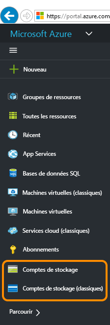
3. Choisissez votre compte de stockage.
   
    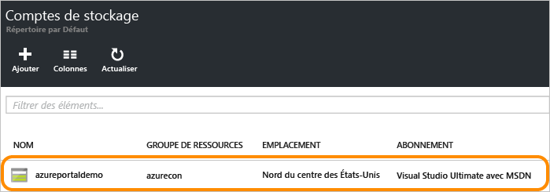
4. Choisissez le service Fichiers.
   
    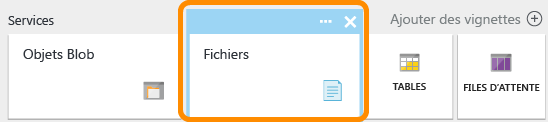
5. Cliquez sur Partages de fichiers et suivez le lien pour créer votre premier partage de fichiers.
   
    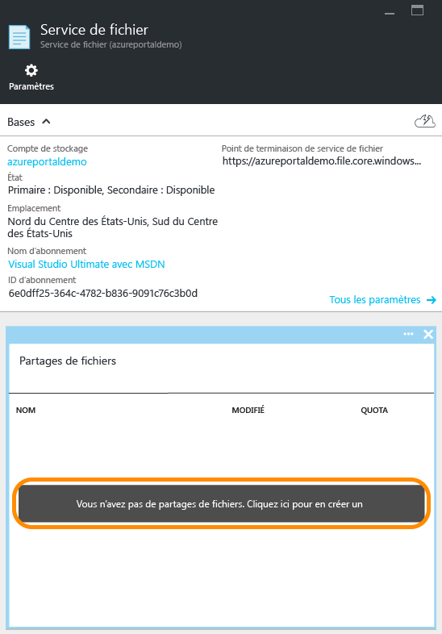
6. Renseignez le nom du partage de fichiers ainsi que sa taille (jusqu’à 5 120 Go) pour créer votre premier partage de fichiers. Une fois le partage de fichiers créé, vous pouvez le monter à partir de n’importe quel système de fichiers prenant en charge SMB 2.1 ou SMB 3.0.
   
    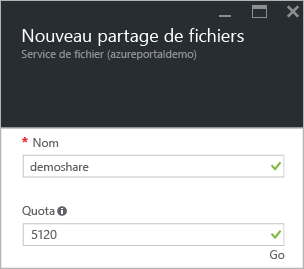

### <a name="upload-and-download-files"></a>Charger et télécharger des fichiers
1. Choisissez un partage de fichiers que vous avez déjà créé.
   
    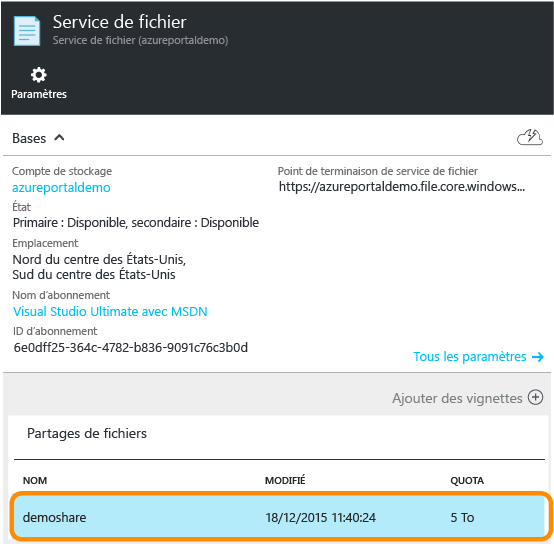
2. Cliquez sur **Charger** pour ouvrir l’interface utilisateur pour le chargement des fichiers.
   
    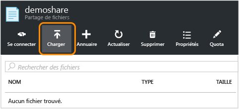
3. Cliquez avec le bouton droit sur un fichier et choisissez **Télécharger** pour le télécharger en local.
   
    

### <a name="manage-file-share"></a>Gérer le partage de fichiers
1. Cliquez sur **Quota** pour modifier la taille du partage de fichiers (jusqu’à 5 120 Go).
   
    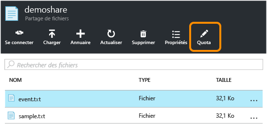
2. Cliquez sur **Connect** pour accéder à la ligne de commande permettant de monter le partage de fichiers à partir de Windows.
   
    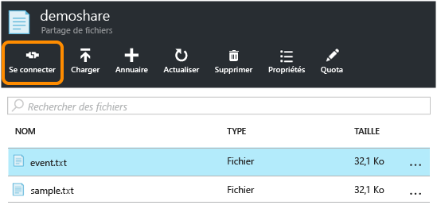
   
    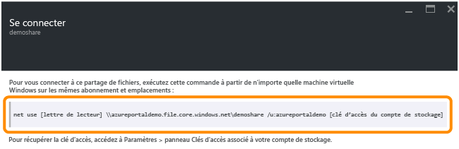
   
   > [!TIP]
   > Pour trouver la clé d’accès au compte de stockage pour le montage, cliquez sur l’option **Paramètres** de votre compte de stockage, puis sur **Clés d’accès**.
   > 
   > 
   
    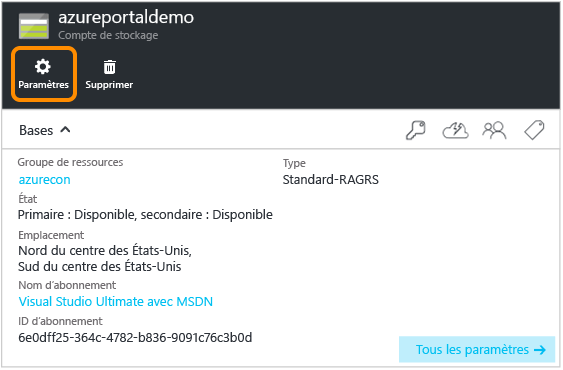
   
    

## <a name="use-powershell-to-manage-a-file-share"></a>Utiliser PowerShell pour gérer un partage de fichiers
Vous pouvez également utiliser Azure PowerShell pour créer et gérer des partages de fichiers.

### <a name="install-the-powershell-cmdlets-for-azure-storage"></a>Installation des applets de commande PowerShell pour Azure Storage
Pour vous préparer à utiliser PowerShell, téléchargez et installez les applets de commande PowerShell Azure. Consultez la rubrique [Installation et configuration d’Azure PowerShell](/powershell/azureps-cmdlets-docs) pour des instructions sur l’installation et le point d’installation.

> [!NOTE]
> Il est recommandé de télécharger et d’installer le dernier module Azure PowerShell ou d’effectuer une mise à niveau vers celui-ci.
> 
> 

Ouvrez une fenêtre Azure PowerShell en cliquant sur **Démarrer** et en saisissant **Windows PowerShell**. La fenêtre PowerShell charge automatiquement le module Azure PowerShell.

### <a name="create-a-context-for-your-storage-account-and-key"></a>Création d'un contexte pour votre compte de stockage et votre clé
Créez maintenant le contexte du compte de stockage. Celui-ci encapsule le nom et la clé du compte de stockage. Pour obtenir des instructions sur la copie de votre clé de compte à partir du [portail Azure](https://portal.azure.com), consultez [Afficher et copier les clés d’accès de stockage](storage-create-storage-account.md#view-and-copy-storage-access-keys).

Remplacez `storage-account-name` et `storage-account-key` par le nom et la clé de votre compte de stockage dans l’exemple suivant.

```powershell
# create a context for account and key
$ctx=New-AzureStorageContext storage-account-name storage-account-key
```

### <a name="create-a-new-file-share"></a>Création d’un partage de fichiers
Créez ensuite le partage de fichiers nommé `logs`.

```powershell
# create a new share
$s = New-AzureStorageShare logs -Context $ctx
```

Vous disposez désormais d’un partage de fichier dans le stockage de fichiers. Nous allons maintenant ajouter un répertoire et un fichier.

> [!IMPORTANT]
> Le nom de votre partage de fichiers doit être en minuscules. Pour plus d’informations sur la façon de nommer des partages de fichiers et des fichiers, consultez la rubrique [Affectation de noms et références aux partages, répertoires, fichiers et métadonnées](https://msdn.microsoft.com/library/azure/dn167011.aspx).
> 
> 

### <a name="create-a-directory-in-the-file-share"></a>Création d’un répertoire dans le partage de fichiers
Créez un répertoire dans le partage. Dans l’exemple suivant, le répertoire est nommé `CustomLogs`.

```powershell
# create a directory in the share
New-AzureStorageDirectory -Share $s -Path CustomLogs
```

### <a name="upload-a-local-file-to-the-directory"></a>Chargement d’un fichier local vers le répertoire
Chargez un fichier local vers le répertoire. L’exemple suivant charge un fichier à partir de `C:\temp\Log1.txt`. Modifiez le chemin d’accès du fichier de façon à ce qu’il pointe vers un fichier valide sur votre ordinateur local.

```powershell
# upload a local file to the new directory
Set-AzureStorageFileContent -Share $s -Source C:\temp\Log1.txt -Path CustomLogs
```

### <a name="list-the-files-in-the-directory"></a>Affichage de la liste des fichiers du répertoire
Pour voir le fichier dans le répertoire, vous pouvez afficher la liste de tous fichiers du répertoire. Cette commande renvoie les fichiers et les sous-répertoires (le cas échéant) dans le répertoire CustomLogs.

```powershell
# list files in the new directory
Get-AzureStorageFile -Share $s -Path CustomLogs | Get-AzureStorageFile
```

Get-AzureStorageFile renvoie une liste de fichiers et de répertoires pour répertoire vers lequel l’objet est transmis. « Get-AzureStorageFile-partager $s » renvoie une liste de fichiers et de répertoires dans le répertoire racine. Pour obtenir une liste des fichiers dans un sous-répertoire, vous devez transmettre le sous-répertoire à Get-AzureStorageFile. Le processus est le suivant : la première partie de la commande jusqu’à la barre renvoie une instance de répertoire du sous-répertoire CustomLogs. Elle est ensuite transmise à Get-AzureStorageFile, qui renvoie les répertoires et fichiers dans CustomLogs.

### <a name="copy-files"></a>Copie des fichiers
Depuis la version 0.9.7 d’Azure PowerShell, vous pouvez copier un fichier dans un autre fichier, un fichier dans un objet blob ou un objet blob dans un fichier. Nous montrons ci-dessous comment effectuer ces opérations en utilisant des applets de commande PowerShell.

```powershell
# copy a file to the new directory
Start-AzureStorageFileCopy -SrcShareName srcshare -SrcFilePath srcdir/hello.txt -DestShareName destshare -DestFilePath destdir/hellocopy.txt -Context $srcCtx -DestContext $destCtx

# copy a blob to a file directory
Start-AzureStorageFileCopy -SrcContainerName srcctn -SrcBlobName hello2.txt -DestShareName hello -DestFilePath hellodir/hello2copy.txt -DestContext $ctx -Context $ctx
```

## <a name="mount-the-file-share"></a>Montage du partage de fichiers
Avec la prise en charge de SMB 3.0, le stockage de fichiers prend désormais en charge le chiffrement et les handles persistants à partir de clients SMB 3.0. La prise en charge du chiffrement signifie que les clients SMB 3.0 peuvent monter un partage de fichiers à partir de n’importe quel emplacement, y compris :

* Une machine virtuelle Azure se trouvant dans la même région (prise en charge également par SMB 2.1)
* Une machine virtuelle Azure se trouvant dans une autre région (SMB 3.0 uniquement)
* Une application de client local (SMB 3.0 uniquement)

Lorsqu’un client accède au stockage de fichiers, la version de SMB utilisée dépend de la version de SMB prise en charge par le système d’exploitation. Le tableau ci-dessous récapitule les versions prises en charge par les différents clients Windows. Pour plus d’informations sur les [versions du protocole SMB](http://blogs.technet.com/b/josebda/archive/2013/10/02/windows-server-2012-r2-which-version-of-the-smb-protocol-smb-1-0-smb-2-0-smb-2-1-smb-3-0-or-smb-3-02-you-are-using.aspx), reportez-vous à ce blog.

| Client Windows | Version de SMB prise en charge |
|:--- |:--- |
| Windows 7 |SMB 2.1 |
| Windows Server 2008 R2 |SMB 2.1 |
| Windows 8 |SMB 3.0 |
| Windows Server 2012 |SMB 3.0 |
| Windows Server 2012 R2 |SMB 3.0 |
| Windows 10 |SMB 3.0 |

### <a name="mount-the-file-share-from-an-azure-virtual-machine-running-windows"></a>Montage du partage de fichiers à partir d’une machine virtuelle Azure exécutant Windows
Pour illustrer comment monter un partage de fichiers Azure, nous allons créer une machine virtuelle Azure exécutant Windows, à laquelle nous accéderons à distance pour monter le partage.

1. Commencez par créer une machine virtuelle Azure en suivant les instructions de la page [Créer une machine virtuelle Windows dans le portail Azure](../virtual-machines/virtual-machines-windows-hero-tutorial.md?toc=%2fazure%2fvirtual-machines%2fwindows%2ftoc.json).
2. Connectez-vous ensuite à la machine virtuelle Azure en suivant les instructions de la page [Ouvrir une session sur une machine virtuelle Windows à l’aide du portail Azure](../virtual-machines/virtual-machines-windows-connect-logon.md?toc=%2fazure%2fvirtual-machines%2fwindows%2ftoc.json).
3. Ouvrez une fenêtre PowerShell sur la machine virtuelle.

### <a name="persist-your-storage-account-credentials-for-the-virtual-machine"></a>Conservation des informations d'identification de votre compte de stockage pour la machine virtuelle
Avant de monter le partage de fichiers, conservez les informations d'identification de votre compte de stockage sur la machine virtuelle. Cette étape permet à Windows de se reconnecter automatiquement au partage de fichiers lorsque la machine virtuelle redémarre. Pour rendre persistantes vos informations d’identification de compte, exécutez la commande `cmdkey` à partir de la fenêtre PowerShell sur la machine virtuelle. Remplacez `<storage-account-name>` par le nom de votre compte de stockage et `<storage-account-key>` par la clé de votre compte de stockage. Vous devez spécifier explicitement le domaine « AZURE », comme dans l’exemple ci-dessous. 

```
cmdkey /add:<storage-account-name>.file.core.windows.net /user:AZURE\<storage-account-name> /pass:<storage-account-key>
```

Windows se reconnectera à votre partage de fichiers lorsque la machine virtuelle redémarrera. Vous pouvez vérifier que le partage est bien reconnecté en exécutant la commande `net use` dans une fenêtre PowerShell.

Notez que les informations d’identification sont rendues persistantes seulement dans le contexte dans lequel `cmdkey` s’exécute. Si vous développez une application qui s’exécute en tant que service, vous devez également conserver vos informations d’identification dans ce contexte.

### <a name="mount-the-file-share-using-the-persisted-credentials"></a>Montage du partage de fichiers à l’aide des informations d’identification conservées
Une fois une connexion à distance établie avec la machine virtuelle, vous pouvez exécuter la commande `net use` pour monter le partage de fichiers à l’aide de la syntaxe suivante. Remplacez `<storage-account-name>` par le nom de votre compte de stockage et `<share-name>` par le nom du partage de stockage de fichiers.

```
net use <drive-letter>: \\<storage-account-name>.file.core.windows.net\<share-name>

example :
net use z: \\samples.file.core.windows.net\logs
```

Comme vous avez conservé les informations d’identification de votre compte de stockage à l’étape précédente, vous n’avez pas besoin de les préciser avec la commande `net use`. Si vous n’avez pas conservé vos informations d’identification, incluez-les en les transmettant comme paramètres dans la commande `net use` , comme illustré dans l’exemple suivant.

```
net use <drive-letter>: \\<storage-account-name>.file.core.windows.net\<share-name> /u:AZURE\<storage-account-name> <storage-account-key>

example :
net use z: \\samples.file.core.windows.net\logs /u:AZURE\samples <storage-account-key>
```

Vous pouvez maintenant utiliser le partage de stockage de fichiers à partir de la machine virtuelle, comme vous le feriez à partir de n’importe quel autre lecteur. Vous pouvez émettre des commandes de fichier standard à partir de l’invite de commandes ou afficher le partage monté et son contenu à partir de l’Explorateur de fichiers. Vous pouvez également exécuter du code au sein de la machine virtuelle qui accède au partage de fichiers à l'aide d'API d'E/S de fichiers Windows standard, telles que celles fournies par les [espaces de noms System.IO](http://msdn.microsoft.com/library/gg145019.aspx) dans .NET Framework.

Vous pouvez également monter le partage de fichiers à partir d’un rôle exécuté dans un service cloud Azure en vous connectant à distance à ce rôle.

### <a name="mount-the-file-share-from-an-on-premises-client-running-windows"></a>Montage du partage de fichiers à partir d’un client local exécutant Windows
Pour monter le partage de fichiers à partir d’un client local, vous devez d’abord suivre ces étapes :

* Installer une version de Windows qui prend en charge SMB 3.0. Windows exploitera le chiffrement SMB 3.0 pour transférer les données en toute sécurité entre votre client local et le partage de fichiers Azure dans le cloud.
* Ouvrir l’accès Internet pour le port 445 (TCP sortant) sur votre réseau local, comme l’exige le protocole SMB.

> [!NOTE]
> Certains fournisseurs de services Internet bloquent le port 445. Il se peut donc que vous deviez vérifier cela auprès de votre fournisseur de services.
> 
> 

## <a name="develop-with-file-storage"></a>Développement avec le stockage de fichiers
Pour écrire du code faisant appel au stockage de fichiers, vous pouvez utiliser les bibliothèques clientes de stockage pour .NET et Java ou l’API REST d’Azure Storage. L’exemple présenté dans cette section décrit comment travailler avec un partage de fichiers en utilisant la [bibliothèque cliente Azure Storage pour .NET](https://msdn.microsoft.com/library/mt347887.aspx) à partir d’une simple application console exécutée sur le Bureau.

### <a name="create-the-console-application-and-obtain-the-assembly"></a>Création de l’application console et obtention de l’assembly
Pour créer une application console dans Visual Studio et installer le package NuGet contenant Azure Storage Client Library :

1. Dans Visual Studio, choisissez **Fichier > Nouveau projet**, puis **Windows > Application console** dans la liste de modèles Visual C#.
2. Nommez l’application console, puis cliquez sur **OK**.
3. Une fois le projet créé, cliquez dessus avec le bouton droit dans l’Explorateur de solutions et choisissez **Gérer les packages NuGet**. Effectuez une recherche en ligne sur « WindowsAzure.Storage », puis cliquez sur **Installer** pour installer le package Azure Storage Client Library pour .NET et ses dépendances.

Les exemples de code présentés dans cet article utilisent également [Microsoft Azure Configuration Manager Library](https://msdn.microsoft.com/library/azure/mt634646.aspx) pour récupérer la chaîne de connexion de stockage à partir d’un fichier app.config dans l’application console. Azure Configuration Manager vous permet de récupérer votre chaîne de connexion lors de l’exécution, que votre application soit exécutée dans Microsoft Azure ou depuis un ordinateur de bureau, un appareil mobile ou une application web.

Pour installer le package Azure Configuration Manager, cliquez avec le bouton droit sur le projet dans l’Explorateur de solutions et sélectionnez **Gérer les packages NuGet**. Exécutez une recherche en ligne sur « ConfigurationManager » et cliquez sur **Installer** pour installer le package.

L’utilisation d’Azure Configuration Manager est facultative. Vous pouvez également utiliser une API, par exemple la [classe ConfigurationManager](https://msdn.microsoft.com/library/system.configuration.configurationmanager.aspx)de .NET Framework.

### <a name="save-your-storage-account-credentials-to-the-appconfig-file"></a>Enregistrement des informations d’identification de votre compte de stockage dans le fichier app.config
Enregistrez ensuite vos informations d’identification dans le fichier app.config du projet. Modifiez le fichier app.config de façon à ce qu’il soit similaire à l’exemple ci-après, en remplaçant `myaccount` par le nom de votre compte de stockage et `mykey` par la clé de votre compte de stockage.

```xml
<?xml version="1.0" encoding="utf-8" ?>
<configuration>
    <startup>
        <supportedRuntime version="v4.0" sku=".NETFramework,Version=v4.5" />
    </startup>
    <appSettings>
        <add key="StorageConnectionString" value="DefaultEndpointsProtocol=https;AccountName=myaccount;AccountKey=StorageAccountKeyEndingIn==" />
    </appSettings>
</configuration>
```

> [!NOTE]
> La dernière version de l’émulateur de stockage Azure ne prend pas en charge le stockage de fichiers. Votre chaîne de connexion doit cibler un compte de stockage Azure dans le cloud pour fonctionner avec le stockage de fichiers.
> 
> 

### <a name="add-namespace-declarations"></a>Ajout de déclarations d'espaces de noms
Ouvrez le fichier `program.cs` à partir de l’Explorateur de solutions. puis ajoutez les déclarations d’espaces de noms en haut du fichier.

```csharp
using Microsoft.Azure; // Namespace for Azure Configuration Manager
using Microsoft.WindowsAzure.Storage; // Namespace for Storage Client Library
using Microsoft.WindowsAzure.Storage.Blob; // Namespace for Blob storage
using Microsoft.WindowsAzure.Storage.File; // Namespace for File storage
```

[!INCLUDE [storage-cloud-configuration-manager-include](../../includes/storage-cloud-configuration-manager-include.md)]

### <a name="access-the-file-share-programmatically"></a>Accès au partage de fichiers par programmation
Ajoutez ensuite le code suivant à la méthode `Main()` (après le code montré ci-dessus) pour récupérer la chaîne de connexion. Ce code obtient une référence vers le fichier créé plus tôt et renvoie son contenu dans la fenêtre de console.

```csharp
// Create a CloudFileClient object for credentialed access to File storage.
CloudFileClient fileClient = storageAccount.CreateCloudFileClient();

// Get a reference to the file share we created previously.
CloudFileShare share = fileClient.GetShareReference("logs");

// Ensure that the share exists.
if (share.Exists())
{
    // Get a reference to the root directory for the share.
    CloudFileDirectory rootDir = share.GetRootDirectoryReference();

    // Get a reference to the directory we created previously.
    CloudFileDirectory sampleDir = rootDir.GetDirectoryReference("CustomLogs");

    // Ensure that the directory exists.
    if (sampleDir.Exists())
    {
        // Get a reference to the file we created previously.
        CloudFile file = sampleDir.GetFileReference("Log1.txt");

        // Ensure that the file exists.
        if (file.Exists())
        {
            // Write the contents of the file to the console window.
            Console.WriteLine(file.DownloadTextAsync().Result);
        }
    }
}
```

Exécutez l’application console pour voir le résultat.

### <a name="set-the-maximum-size-for-a-file-share"></a>Définition de la taille maximale d’un partage de fichiers
Depuis la version 5.x de la bibliothèque cliente Azure Storage, vous pouvez définir le quota (ou la taille maximale) pour un partage de fichier, en gigaoctets. Vous pouvez également vérifier la quantité de données actuellement stockée sur le partage.

En définissant le quota pour un partage, vous pouvez limiter la taille totale des fichiers stockés sur ce partage. Si la taille totale des fichiers sur le partage dépasse le quota défini sur celui-ci, les clients ne peuvent pas augmenter la taille des fichiers existants ou créer des fichiers, sauf si ces fichiers sont vides.

L’exemple ci-dessous illustre comment vérifier l’utilisation actuelle pour un partage et comment définir le quota pour le partage.

```csharp
// Parse the connection string for the storage account.
CloudStorageAccount storageAccount = CloudStorageAccount.Parse(
    Microsoft.Azure.CloudConfigurationManager.GetSetting("StorageConnectionString"));

// Create a CloudFileClient object for credentialed access to File storage.
CloudFileClient fileClient = storageAccount.CreateCloudFileClient();

// Get a reference to the file share we created previously.
CloudFileShare share = fileClient.GetShareReference("logs");

// Ensure that the share exists.
if (share.Exists())
{
    // Check current usage stats for the share.
    // Note that the ShareStats object is part of the protocol layer for the File service.
    Microsoft.WindowsAzure.Storage.File.Protocol.ShareStats stats = share.GetStats();
    Console.WriteLine("Current share usage: {0} GB", stats.Usage.ToString());

    // Specify the maximum size of the share, in GB.
    // This line sets the quota to be 10 GB greater than the current usage of the share.
    share.Properties.Quota = 10 + stats.Usage;
    share.SetProperties();

    // Now check the quota for the share. Call FetchAttributes() to populate the share's properties.
    share.FetchAttributes();
    Console.WriteLine("Current share quota: {0} GB", share.Properties.Quota);
}
```

### <a name="generate-a-shared-access-signature-for-a-file-or-file-share"></a>Génération d’une signature d’accès partagé pour un fichier ou partage de fichiers
Depuis la version 5.x de la bibliothèque cliente Azure Storage, vous pouvez générer une signature d’accès partagé (SAP) pour un partage de fichiers ou un fichier individuel. Vous pouvez également créer une stratégie d’accès partagé sur un partage de fichiers pour gérer les signatures d’accès partagé. Créer une stratégie d’accès partagé est recommandé, car cette opération permet de révoquer la SAP si elle doit être compromise.

L’exemple suivant crée une stratégie d’accès partagé sur un partage, puis utilise cette stratégie pour fournir les contraintes pour une SAP sur un fichier du partage.

```csharp
// Parse the connection string for the storage account.
CloudStorageAccount storageAccount = CloudStorageAccount.Parse(
    Microsoft.Azure.CloudConfigurationManager.GetSetting("StorageConnectionString"));

// Create a CloudFileClient object for credentialed access to File storage.
CloudFileClient fileClient = storageAccount.CreateCloudFileClient();

// Get a reference to the file share we created previously.
CloudFileShare share = fileClient.GetShareReference("logs");

// Ensure that the share exists.
if (share.Exists())
{
    string policyName = "sampleSharePolicy" + DateTime.UtcNow.Ticks;

    // Create a new shared access policy and define its constraints.
    SharedAccessFilePolicy sharedPolicy = new SharedAccessFilePolicy()
        {
            SharedAccessExpiryTime = DateTime.UtcNow.AddHours(24),
            Permissions = SharedAccessFilePermissions.Read | SharedAccessFilePermissions.Write
        };

    // Get existing permissions for the share.
    FileSharePermissions permissions = share.GetPermissions();

    // Add the shared access policy to the share's policies. Note that each policy must have a unique name.
    permissions.SharedAccessPolicies.Add(policyName, sharedPolicy);
    share.SetPermissions(permissions);

    // Generate a SAS for a file in the share and associate this access policy with it.
    CloudFileDirectory rootDir = share.GetRootDirectoryReference();
    CloudFileDirectory sampleDir = rootDir.GetDirectoryReference("CustomLogs");
    CloudFile file = sampleDir.GetFileReference("Log1.txt");
    string sasToken = file.GetSharedAccessSignature(null, policyName);
    Uri fileSasUri = new Uri(file.StorageUri.PrimaryUri.ToString() + sasToken);

    // Create a new CloudFile object from the SAS, and write some text to the file.
    CloudFile fileSas = new CloudFile(fileSasUri);
    fileSas.UploadText("This write operation is authenticated via SAS.");
    Console.WriteLine(fileSas.DownloadText());
}
```

Pour plus d’informations sur la création et l’utilisation de signatures d’accès partagé, consultez [Utilisation des signatures d’accès partagé (SAP)](storage-dotnet-shared-access-signature-part-1.md) et [Créer et utiliser une signature d’accès partagé avec Blob Storage](storage-dotnet-shared-access-signature-part-2.md).

### <a name="copy-files"></a>Copie des fichiers
Depuis la version 5.x de la bibliothèque cliente Azure Storage, vous pouvez copier un fichier dans un autre fichier, un fichier dans un objet blob ou un objet blob dans un fichier. Dans les sections suivantes, nous montrons comment effectuer ces opérations de copie par programmation.

Vous pouvez également utiliser AzCopy pour copier un fichier dans un autre ou pour copier un objet blob dans un fichier ou vice versa. Consultez l’article [Transfert de données avec l’utilitaire de ligne de commande AzCopy](storage-use-azcopy.md).

> [!NOTE]
> Si vous copiez un objet blob dans un fichier ou un fichier dans un objet blob, vous devez utiliser une signature d’accès partagé (SAP) pour authentifier l’objet source, même si vous effectuez la copie dans le même compte de stockage.
> 
> 

**Copie d’un fichier dans un autre**

L’exemple suivant copie un fichier dans un autre fichier au sein du même partage. Étant donné que cette opération de copie a lieu entre des fichiers du même compte de stockage, vous pouvez utiliser l’authentification Clé partagée pour l’effectuer.

```csharp
// Parse the connection string for the storage account.
CloudStorageAccount storageAccount = CloudStorageAccount.Parse(
    Microsoft.Azure.CloudConfigurationManager.GetSetting("StorageConnectionString"));

// Create a CloudFileClient object for credentialed access to File storage.
CloudFileClient fileClient = storageAccount.CreateCloudFileClient();

// Get a reference to the file share we created previously.
CloudFileShare share = fileClient.GetShareReference("logs");

// Ensure that the share exists.
if (share.Exists())
{
    // Get a reference to the root directory for the share.
    CloudFileDirectory rootDir = share.GetRootDirectoryReference();

    // Get a reference to the directory we created previously.
    CloudFileDirectory sampleDir = rootDir.GetDirectoryReference("CustomLogs");

    // Ensure that the directory exists.
    if (sampleDir.Exists())
    {
        // Get a reference to the file we created previously.
        CloudFile sourceFile = sampleDir.GetFileReference("Log1.txt");

        // Ensure that the source file exists.
        if (sourceFile.Exists())
        {
            // Get a reference to the destination file.
            CloudFile destFile = sampleDir.GetFileReference("Log1Copy.txt");

            // Start the copy operation.
            destFile.StartCopy(sourceFile);

            // Write the contents of the destination file to the console window.
            Console.WriteLine(destFile.DownloadText());
        }
    }
}
```

**Copie d’un fichier dans un objet blob**

L’exemple ci-dessous crée un fichier et le copie dans un objet blob au sein du même compte de stockage. L’exemple crée une SAP pour le fichier source, que le service utilise pour authentifier l’accès au fichier source pendant l’opération de copie.

```csharp
// Parse the connection string for the storage account.
CloudStorageAccount storageAccount = CloudStorageAccount.Parse(
    Microsoft.Azure.CloudConfigurationManager.GetSetting("StorageConnectionString"));

// Create a CloudFileClient object for credentialed access to File storage.
CloudFileClient fileClient = storageAccount.CreateCloudFileClient();

// Create a new file share, if it does not already exist.
CloudFileShare share = fileClient.GetShareReference("sample-share");
share.CreateIfNotExists();

// Create a new file in the root directory.
CloudFile sourceFile = share.GetRootDirectoryReference().GetFileReference("sample-file.txt");
sourceFile.UploadText("A sample file in the root directory.");

// Get a reference to the blob to which the file will be copied.
CloudBlobClient blobClient = storageAccount.CreateCloudBlobClient();
CloudBlobContainer container = blobClient.GetContainerReference("sample-container");
container.CreateIfNotExists();
CloudBlockBlob destBlob = container.GetBlockBlobReference("sample-blob.txt");

// Create a SAS for the file that's valid for 24 hours.
// Note that when you are copying a file to a blob, or a blob to a file, you must use a SAS
// to authenticate access to the source object, even if you are copying within the same
// storage account.
string fileSas = sourceFile.GetSharedAccessSignature(new SharedAccessFilePolicy()
{
    // Only read permissions are required for the source file.
    Permissions = SharedAccessFilePermissions.Read,
    SharedAccessExpiryTime = DateTime.UtcNow.AddHours(24)
});

// Construct the URI to the source file, including the SAS token.
Uri fileSasUri = new Uri(sourceFile.StorageUri.PrimaryUri.ToString() + fileSas);

// Copy the file to the blob.
destBlob.StartCopy(fileSasUri);

// Write the contents of the file to the console window.
Console.WriteLine("Source file contents: {0}", sourceFile.DownloadText());
Console.WriteLine("Destination blob contents: {0}", destBlob.DownloadText());
```

Vous pouvez copier un objet blob dans un fichier de la même façon. Si l’objet source est un objet blob, créez une SAP pour authentifier l’accès à cet objet blob pendant l’opération de copie.

## <a name="troubleshooting-file-storage-using-metrics"></a>Résolution des problèmes de stockage de fichiers à l’aide de métriques
Azure Storage Analytics prend désormais en charge les métriques pour le stockage de fichiers. Avec les données de métriques, vous pouvez suivre les demandes et diagnostiquer les problèmes.

Vous pouvez activer les métriques pour File Storage à partir du [portail Azure](https://portal.azure.com). Vous pouvez également activer les métriques par programmation en appelant l’opération de définition des propriétés du service de fichiers via l’API REST ou l’un de ses analogues dans la bibliothèque cliente de stockage.

L’exemple de code suivant explique comment utiliser la bibliothèque cliente Azure Storage pour .NET afin d’activer les métriques de File Storage.

Commencez par ajouter les instructions `using` suivantes à votre fichier program.cs, en plus de celles que vous avez ajoutées ci-dessus :

```csharp
using Microsoft.WindowsAzure.Storage.File.Protocol;
using Microsoft.WindowsAzure.Storage.Shared.Protocol;
```

Bien que les services Blob, Table et Queue Storage utilisent le type `ServiceProperties` partagé dans l’espace de noms `Microsoft.WindowsAzure.Storage.Shared.Protocol`, File Storage utilise son propre type, `FileServiceProperties`, dans l’espace de noms `Microsoft.WindowsAzure.Storage.File.Protocol`. Pour pouvoir compiler le code suivant, vous devez cependant référencer les deux espaces de noms à partir de votre code.

```csharp
// Parse your storage connection string from your application's configuration file.
CloudStorageAccount storageAccount = CloudStorageAccount.Parse(
        Microsoft.Azure.CloudConfigurationManager.GetSetting("StorageConnectionString"));
// Create the File service client.
CloudFileClient fileClient = storageAccount.CreateCloudFileClient();

// Set metrics properties for File service.
// Note that the File service currently uses its own service properties type,
// available in the Microsoft.WindowsAzure.Storage.File.Protocol namespace.
fileClient.SetServiceProperties(new FileServiceProperties()
{
    // Set hour metrics
    HourMetrics = new MetricsProperties()
    {
        MetricsLevel = MetricsLevel.ServiceAndApi,
        RetentionDays = 14,
        Version = "1.0"
    },
    // Set minute metrics
    MinuteMetrics = new MetricsProperties()
    {
        MetricsLevel = MetricsLevel.ServiceAndApi,
        RetentionDays = 7,
        Version = "1.0"
    }
});

// Read the metrics properties we just set.
FileServiceProperties serviceProperties = fileClient.GetServiceProperties();
Console.WriteLine("Hour metrics:");
Console.WriteLine(serviceProperties.HourMetrics.MetricsLevel);
Console.WriteLine(serviceProperties.HourMetrics.RetentionDays);
Console.WriteLine(serviceProperties.HourMetrics.Version);
Console.WriteLine();
Console.WriteLine("Minute metrics:");
Console.WriteLine(serviceProperties.MinuteMetrics.MetricsLevel);
Console.WriteLine(serviceProperties.MinuteMetrics.RetentionDays);
Console.WriteLine(serviceProperties.MinuteMetrics.Version);
```

Vous pouvez également vous référer à [l’article Résolution des problèmes relatifs aux fichiers Azure](storage-troubleshoot-file-connection-problems.md) pour obtenir une aide de bout en bout. 

## <a name="file-storage-faq"></a>Forum Aux Questions sur le stockage de fichiers
1. **L’authentification basée sur Active Directory est-elle prise en charge par le stockage de fichiers ?**
   
    À l’heure actuelle, l’authentification ou les listes de contrôle d’accès basées sur Active Directory ne sont pas prises en charge, mais elles figurent dans notre liste de demandes de fonctionnalités. Pour l’instant, les clés de compte de stockage Azure sont utilisées pour l’authentification auprès du partage de fichiers. Nous offrons néanmoins une solution de contournement utilisant les signatures d’accès partagé (SAP) via l’API REST ou les bibliothèques clientes. À l’aide des SAP, vous pouvez générer des jetons assortis d’autorisations spécifiques valides pendant une période définie. Par exemple, vous pouvez générer un jeton offrant un accès en lecture seule à un fichier donné. Toute personne qui possède ce jeton pendant sa période de validité dispose d’un accès en lecture seule à ce fichier.
   
    Les SAP sont uniquement prises en charge via l’API REST ou les bibliothèques clientes. Lorsque vous montez le partage de fichiers via le protocole SMB, vous ne pouvez pas utiliser de SAP pour déléguer l’accès à son contenu. 

2. **Comment fournir l’accès à un fichier spécifique via un navigateur web ?**
   À l’aide des SAP, vous pouvez générer des jetons assortis d’autorisations spécifiques valides pendant une période définie. Par exemple, vous pouvez générer un jeton avec un accès en lecture seule à un fichier spécifique pendant une période donnée. Toute personne qui possède cette url peut effectuer le téléchargement directement à partir de n’importe quel navigateur web tant qu’il est valide. Les clés SAP peuvent être facilement générées à partir d’une interface utilisateur telle que Storage Explorer.

3.   **Quelles sont les différentes façons d’accéder aux fichiers dans le stockage de fichiers Azure ?**
    Vous pouvez monter le partage de fichiers sur votre ordinateur local à l’aide du protocole SMB 3.0 ou utiliser des outils tels que [Storage Explorer](http://storageexplorer.com/) ou Cloudberry pour accéder aux fichiers dans votre partage de fichiers. À partir de votre application, vous pouvez utiliser des bibliothèques clientes, l’API REST ou Powershell pour accéder à vos fichiers dans le partage de fichiers Azure.
    
4.   **Comment monter le partage de fichiers Azure sur mon ordinateur local ?** Vous pouvez monter le partage de fichiers par le biais du protocole SMB tant que le port 445 (TCP sortant) est ouvert et que votre client prend en charge le protocole SMB 3.0 (*par exemple*, Windows 8 ou Windows Server 2012). Contactez votre fournisseur d’accès Internet pour débloquer le port. En attendant, vous pouvez afficher vos fichiers à l’aide de Storage Explorer ou tout autre tiers tel que Cloudberry.

5. **Le trafic réseau entre une machine virtuelle Azure et un partage de fichiers est-il considéré comme de la bande passante externe qui est facturée dans le cadre de l’abonnement ?**
   
    Si le partage de fichiers et la machine virtuelle se trouvent dans des régions différentes, le trafic entre eux sera facturé en tant que bande passante externe.
6. **Si le trafic réseau se fait entre une machine virtuelle et un partage de fichiers se trouvant dans la même région, est-il gratuit ?**
   
    Oui. Le trafic est gratuit s’il concerne une même région.
7. **La connexion depuis des machines virtuelles locales au stockage de fichiers Azure repose-t-elle sur Azure ExpressRoute ?**
   
    Non. Si vous ne disposez pas d’ExpressRoute, vous pouvez accéder au partage de fichiers depuis votre site à condition que le port 445 (TCP sortant) soit ouvert pour l’accès Internet. Vous pouvez toutefois utiliser ExpressRoute avec le stockage de fichiers si vous le souhaitez.
8. **Un « témoin de partage de fichiers » pour un cluster de basculement constitue-t-il un des cas d’utilisation du stockage de fichiers Azure ?**
   
    Cela n’est pas pris en charge à l’heure actuelle.
9. **Le stockage de fichiers est répliqué uniquement via LRS ou GRS pour l’instant, n’est-ce pas ?**  
   
    Nous prévoyons de prendre en charge RA-GRS, mais nous n’avons pas encore de calendrier bien défini.
10. **Quand pourrai-je utiliser des comptes de stockage existants pour le stockage de fichiers Azure ?**
   
    Le stockage de fichiers Azure est dès à présent activé pour tous les comptes de stockage.
11. **Avez-vous prévu d’ajouter également une opération Rename à l’API REST ?**
   
    L’opération Rename n’est pas encore prise en charge dans notre API REST.
12. **Est-il possible d’avoir des partages imbriqués, autrement dit, un partage sous un partage ?**
    
    Non. Le partage de fichiers est le pilote virtuel que vous pouvez monter et les partages imbriqués ne sont donc pas pris en charge.
13. **Est-il possible de spécifier des autorisations en lecture seule ou en écriture seule sur des dossiers au sein du partage ?**
    
    Vous ne bénéficiez pas de ce niveau de contrôle sur les autorisations si vous montez le partage de fichiers via SMB. Toutefois, vous pouvez y parvenir en créant une signature d’accès partagé (SAP) via l’API REST ou les bibliothèques clientes.  
14. **Les performances étaient lentes lorsque j’ai essayé de décompresser des fichiers dans File Storage. Que dois-je faire ?**
    
    Pour transférer un grand nombre de fichiers dans le stockage de fichiers, nous vous recommandons d’utiliser AzCopy, Azure Powershell (Windows) ou CLI Azure (Unix/Linux), car ces outils ont été optimisés pour le transfert réseau.
15. **Correctif publié pour résoudre le problème de ralentissement des performances avec les fichiers Azure**
    
    L’équipe Windows a récemment publié un correctif permettant de résoudre un problème de ralentissement des performances lorsque le client accède au stockage de fichiers Azure à partir de Windows 8.1 ou de Windows Server 2012 R2. Pour plus d’informations, consultez l’article de la base de connaissances associé [Slow performance when you access Azure Files Storage from Windows 8.1 or Server 2012 R2](https://support.microsoft.com/en-us/kb/3114025) (Ralentissement des performances lors de l’accès à Azure File Storage depuis Windows 8.1 ou Server 2012 R2).
16. **Utilisation du stockage de fichiers Azure avec Linux**
    
    IBM a publié un document visant à guider les clients IBM MQ lors de la configuration du stockage de fichiers Azure avec leur service. Pour plus d’informations, consultez l’article [How to setup IBM MQ Multi instance queue manager with Microsoft Azure File Service](https://github.com/ibm-messaging/mq-azure/wiki/How-to-setup-IBM-MQ-Multi-instance-queue-manager-with-Microsoft-Azure-File-Service)(Comment configurer le gestionnaire de file d’attente multi-instance IBM MQ avec le service de fichiers Microsoft Azure).
17. **Comment résoudre les erreurs du Stockage Fichier Azure ?**
    
    Vous pouvez vous référer à [l’article Résolution des problèmes relatifs aux fichiers Azure](storage-troubleshoot-file-connection-problems.md) pour obtenir une aide de bout en bout.               

18. **Comment activer le chiffrement côté serveur pour les fichiers Azure ?**

    Le [chiffrement côté serveur](https://docs.microsoft.com/en-us/azure/storage/storage-service-encryption) est actuellement en version préliminaire. Pendant la version préliminaire, la fonction ne peut être activée que pour les nouveaux comptes de stockage Azure Resource Manager (ARM).
    Vous pouvez activer cette fonction sur le compte de stockage Azure Resource Manager à l’aide du portail Azure. Nous envisageons de disposer d’[Azure Powershell](https://msdn.microsoft.com/en-us/library/azure/mt607151.aspx), de l’[interface de ligne de commande (CLI) Azure](https://docs.microsoft.com/en-us/azure/storage/storage-azure-cli-nodejs) ou de l’[API du fournisseur de ressources Microsoft Azure Storage](https://docs.microsoft.com/en-us/rest/api/storagerp/storageaccounts) pour activer le chiffrement pour le stockage de fichiers d’ici la fin du mois de février. L’activation de cette fonction sera sans frais supplémentaires. Lorsque vous activez le chiffrement du service de stockage pour le stockage de fichiers Azure, vos données sont chiffrées automatiquement pour vous. 
    En savoir plus sur le chiffrement du service de stockage. Vous pouvez également contacter ssediscussions@microsoft.com pour toute question supplémentaire sur la version préliminaire.

## <a name="next-steps"></a>Étapes suivantes
Pour plus d’informations sur le stockage de fichiers Azure, consultez ces liens.

### <a name="conceptual-articles-and-videos"></a>Vidéos et articles conceptuels
* [Stockage de fichiers Azure : un système de fichiers SMB dans le cloud sans friction pour Windows et Linux](https://azure.microsoft.com/documentation/videos/azurecon-2015-azure-files-storage-a-frictionless-cloud-smb-file-system-for-windows-and-linux/)
* [Utilisation du stockage de fichiers Azure avec Linux](storage-how-to-use-files-linux.md)

### <a name="tooling-support-for-file-storage"></a>Outils pris en charge pour le stockage de fichiers
* [Utilisation d'Azure PowerShell avec Azure Storage](storage-powershell-guide-full.md)
* [Utilisation de AzCopy avec Microsoft Azure Storage](storage-use-azcopy.md)
* [Utilisation de la CLI Microsoft Azure avec Microsoft Azure Storage](storage-azure-cli.md#create-and-manage-file-shares)
* [Résolution des problèmes de stockage de fichiers Azure](https://docs.microsoft.com/en-us/azure/storage/storage-troubleshoot-file-connection-problems)

### <a name="reference"></a>Référence
* [Référence de la bibliothèque cliente de stockage pour .NET](https://msdn.microsoft.com/library/azure/dn261237.aspx)
* [Référence de l’API REST du service de fichiers](http://msdn.microsoft.com/library/azure/dn167006.aspx)

### <a name="blog-posts"></a>Billets de blog :
* [Le stockage de fichiers Azure est désormais mis à la disposition générale](https://azure.microsoft.com/blog/azure-file-storage-now-generally-available/)
* [Stockage de fichiers dans Azure](https://azure.microsoft.com/blog/inside-azure-file-storage/)
* [Présentation de Microsoft Azure File Service](http://blogs.msdn.com/b/windowsazurestorage/archive/2014/05/12/introducing-microsoft-azure-file-service.aspx)
* [Conservation des connexions vers les fichiers Microsoft Azure](http://blogs.msdn.com/b/windowsazurestorage/archive/2014/05/27/persisting-connections-to-microsoft-azure-files.aspx)

