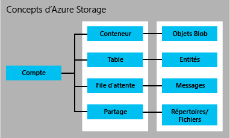

<properties
	pageTitle="Introduction à Azure Storage | Microsoft Azure"
	description="Vue d’ensemble d’Azure Storage, stockage de données en ligne de Microsoft dans le cloud. Découvrez comment utiliser la meilleure solution de stockage cloud disponible dans vos applications."
	services="storage"
	documentationCenter=""
	authors="tamram"
	manager="carmonm"
	editor="tysonn"/>

<tags
	ms.service="storage"
	ms.workload="storage"
	ms.tgt_pltfrm="na"
	ms.devlang="na"
	ms.topic="get-started-article"
	ms.date="05/23/2016"
	ms.author="tamram"/>

# Introduction à Microsoft Azure Storage

## Vue d'ensemble

Azure Storage est la solution de stockage cloud pour les applications récentes qui s’appuient sur la durabilité, la disponibilité et l’extensibilité pour répondre aux besoins des clients. En lisant cet article, les développeurs, les professionnels de l’informatique et les décideurs économiques peuvent découvrir :

- ce qu’est Azure Storage et comment vous pouvez en tirer parti dans vos applications cloud, mobiles, serveur et bureautiques ;
- quels types de données vous pouvez stocker avec les services Azure Storage (données d’objet blob, données de table NoSQL, messages de file d’attente et partages de fichiers) ;
- comment est géré l’accès à vos données dans Azure Storage ;
- comment vos données Azure Storage sont préservées par la redondance et la réplication ;
- comment procéder ensuite pour créer votre première application Azure Storage.

Pour être rapidement opérationnel avec Azure Storage, consultez [Familiarisez-vous avec Azure Storage en cinq minutes](storage-getting-started-guide.md).

Pour plus d’informations sur les outils, bibliothèques et autres ressources pour utiliser Azure Storage, consultez [Étapes suivantes](#next-steps) ci-dessous.

## Présentation d’Azure Storage

Le cloud computing permet d'élaborer de nouveaux scénarios pour les applications qui exigent un stockage évolutif, durable et à haute disponibilité pour leurs données, et c'est la raison pour laquelle Microsoft a développé Azure Storage. Azure Storage permet aux développeurs de créer des applications à grande échelle pour prendre en charge de nouveaux scénarios, et fournit également une base de stockage pour Azure Virtual Machines, autre preuve de sa robustesse.

Azure Storage est massivement évolutif, ce qui vous permet de stocker et de traiter des centaines de téraoctets de données pour prendre en charge les scénarios Big Data exigés par les analyses scientifiques ou financières et les applications multimédias. Vous pouvez également stocker les petites quantités de données requises pour un petit site Web professionnel. Quels que soient vos besoins, vous payez uniquement pour les données que vous stockez. Azure Storage stocke actuellement des dizaines de billions d'objets client uniques et traite en moyenne des millions de requêtes par seconde.

L'élasticité d'Azure Storage vous permet de concevoir des applications pour un large public mondial et de mettre à l'échelle ces applications (la quantité de stockage et le nombre de transactions requises) en fonction des besoins. Vous payez uniquement pour ce que vous utilisez, et pour la durée d'utilisation.

Azure Storage utilise un système de partitionnement automatique qui équilibre automatiquement la charge représentée par vos données sur la base du trafic. Autrement dit, lorsque les demandes concernant votre application augmentent, Azure Storage alloue automatiquement les ressources appropriées pour y répondre.

Azure Storage est accessible partout dans le monde, depuis n'importe quel type d'application, qu'elle soit exécutée dans le cloud, sur le bureau, sur un serveur local, sur un appareil mobile ou sur une tablette. Vous pouvez utiliser Azure Storage dans les scénarios mobiles où l'application stocke un sous-ensemble de données sur l'appareil et le synchronise avec un ensemble complet des données stocké dans le cloud.

Azure Storage prend en charge les clients avec divers systèmes d’exploitation (notamment Windows et Linux) et divers langages de programmation (notamment .NET, Java, Node.js, Python, Ruby, PHP et C++, ainsi que les langages de programmation mobiles) pour un développement pratique. Azure Storage expose également les ressources de données par l’intermédiaire de simples API REST, disponibles pour tout client capable d’envoyer et de recevoir des données via HTTP/HTTPS.

Azure Premium Storage offre des performances élevées et une prise en charge à faible latence du disque pour des charges de travail d’E/S intensives exécutées sur Azure Virtual Machines. Avec Azure Premium Storage, vous pouvez associer plusieurs disques de données persistants à une machine virtuelle et les configurer afin qu’ils répondent à vos exigences de performance. Chaque disque de données est approvisionné par un disque SSD dans Azure Premium Storage pour une performance d’E/S maximale. Pour plus d’informations, consultez [Stockage Premium : stockage hautes performances pour les charges de travail des machines virtuelles Azure](storage-premium-storage.md).

## Présentation des services Azure Storage

Les services Azure Storage assurent le stockage d’objets blob (Blob Storage), de tables (Table Storage), de files d’attente (Queue Storage) et de fichiers (File Storage).

- Blob Storage stocke les données d’objets non structurées. Un objet blob peut correspondre à n'importe quel type de données texte ou binaires, par exemple, un document, un fichier multimédia ou un programme d'installation d'application. Blob Storage est parfois appelé stockage d’objets.
- Table Storage stocke des jeux de données structurés. Le stockage de tables est un magasin de données de clés-attributs NoSQL qui permet le développement rapide et l'accès rapide à de grosses quantités de données.
- Queue Storage fournit une messagerie fiable pour le traitement des flux de travail et pour la communication entre les composants des services cloud.
- File Storage propose un stockage partagé pour les applications héritées utilisant le protocole SMB standard. Les machines virtuelles et les services cloud Microsoft Azure peuvent partager des données de fichiers entre plusieurs composants d’application grâce à des partages montés. Les applications locales peuvent accéder aux données de fichiers d’un partage via l’API REST du service de stockage de fichiers.

Un compte de stockage Azure est un compte sécurisé qui vous donne accès à des services dans Azure Storage. Votre compte de stockage fournit les espaces de noms uniques pour vos ressources de stockage. L’image ci-dessous affiche les relations entre les ressources de stockage Azure dans un compte de stockage :

[AZURE.INCLUDE [storage-account-types-include](../../includes/storage-account-types-include.md)]

[AZURE.INCLUDE [storage-versions-include](../../includes/storage-versions-include.md)]

## Stockage d’objets blob

Pour les utilisateurs qui doivent stocker de grandes quantités de données d’objets non structurées dans le cloud, le stockage d’objets blob offre une solution peu coûteuse et évolutive. Vous pouvez utiliser le stockage d'objets blob pour stocker les contenus suivants :

- Documents
- Données sociales telles que photos, vidéos, musique et blogs
- Sauvegardes de fichiers, d'ordinateurs, de bases de données et d'appareils
- Images et textes pour applications Web
- Données de configuration pour applications cloud
- Big Data tels que journaux et autres jeux de données volumineux

Chaque objet blob est organisé dans un conteneur. Les conteneurs fournissent également un moyen utile d'affecter des stratégies de sécurité à des groupes d'objets. Un compte de stockage peut contenir un nombre quelconque de conteneurs, et un conteneur peut contenir un nombre quelconque d'objets blobs, jusqu'à la limite de capacité de 500 To du compte de stockage.

Le stockage d’objets blob propose trois types d’objets : les objets blob de bloc, les objets blob d’ajout et les objets blob de page (disques).

- Les objets blob de bloc sont optimisés pour la diffusion en continu et le stockage d’objets cloud. Ils constituent une solution de choix pour stocker des documents, des fichiers multimédias, des sauvegardes, etc.
- Les objets blob d’ajout sont similaires aux objets blob de blocs, mais ils sont optimisés pour les opérations d’ajout. Un objet blob d’ajout ne peut être mis à jour qu’en lui ajoutant un nouveau bloc à la fin. Les objets blob d’ajout sont idéaux pour des opérations telles que la journalisation, où les nouvelles données ne doivent être écrites qu’à la fin de l’objet blob.
- Les objets blob de page sont optimisés pour représenter les disques IaaS et prendre en charge les écritures aléatoires. Leur taille maximale est de 1 To. Un disque IaaS rattaché à un réseau de machines virtuelles Azure est un disque dur virtuel stocké en tant qu'objet blob de page.

Pour les jeux de données très volumineux où les contraintes du réseau rendent irréaliste le téléchargement de données vers/depuis le stockage d’objets blob par le biais du réseau, vous pouvez expédier un disque dur à Microsoft pour importer ou exporter les données directement à partir du centre de données. Consultez [Transfert de données vers le stockage d’objets blob à l’aide du service Microsoft Azure Import/Export](storage-import-export-service.md).

## Stockage de tables

Les applications modernes exigent souvent des magasins de données avec plus d'évolutivité et de souplesse que ne l'exigeaient les précédentes générations de logiciels. Le stockage de tables offre un stockage hautement disponible et massivement évolutif, de telle sorte que votre application puisse être mise à l'échelle automatiquement pour répondre à la demande des utilisateurs. Le stockage de tables est le magasin de clés/attributs de Microsoft ; il a une conception sans schéma, ce en quoi il diffère des bases de données relationnelles classiques. Avec un magasin de données sans schéma, il est facile d'adapter vos données au fur et à mesure que les besoins de votre application évoluent. Facile à utiliser, le stockage de tables permet aux développeurs de créer rapidement des applications. L'accès aux données est rapide et peu coûteux pour tous les types d'applications. Normalement, le stockage de tables est considérablement moins coûteux que le SQL traditionnel pour des volumes de données similaires.

Le stockage de tables est un magasin de clés/attributs : cela signifie que chaque valeur dans une table est stockée avec un nom de propriété typé. Le nom de propriété peut être utilisé pour filtrer et spécifier des critères de sélection. Une collection de propriétés et leurs valeurs constituent une entité. Dans la mesure où le stockage de tables est sans schéma, deux entités d'une même table contiennent différentes collections de propriétés, et ces propriétés peuvent être de différents types.

Vous pouvez utiliser le stockage de tables pour stocker des jeux de données flexibles, par exemple, des données utilisateur pour des applications Web, des carnets d'adresses, des informations sur les périphériques et tout autre type de métadonnées requis par votre service. Vous pouvez stocker un nombre quelconque d'entités dans une table, et un compte de stockage peut contenir un nombre quelconque de tables, jusqu'à la limite de capacité du compte de stockage.

Les développeurs peuvent gérer le stockage de tables et y accéder comme ils le font pour les objets blob et les files d’attente, à l’aide des protocoles REST standards, mais le stockage de tables prend également en charge un sous-ensemble du protocole OData, qui simplifie les fonctionnalités d’interrogation avancées et autorise les formats (XML) JSON et AtomPub.

Pour les applications Internet actuelles, les bases de données NoSQL telles que le stockage de tables offrent une alternative populaire aux bases de données relationnelles classiques.

## Stockage de files d'attente

Lors de la conception d'applications pour la mise à l'échelle, des composants d'application sont souvent découplés, de sorte qu'ils peuvent être mis à l'échelle indépendamment. Le stockage de files d'attente offre une solution de messagerie fiable pour la communication asynchrone entre les composants d'application, qu'ils soient exécutés dans le cloud, sur le bureau, sur un serveur local ou sur un appareil mobile. Le stockage de files d'attente prend également en charge la gestion des tâches asynchrones et la création des workflows de processus.

Un compte de stockage peut contenir un nombre quelconque de files d'attente. Une file d'attente peut contenir un nombre quelconque de messages, jusqu'à la limite de capacité du compte de stockage. La taille maximale des messages individuels est de 64 Ko.

## Stockage de fichiers

Le stockage de fichiers Azure offre des partages de fichiers SMB dans le cloud permettant de migrer des applications héritées utilisant ces partages vers Azure rapidement, sans réécritures onéreuses. Avec le stockage de fichiers Azure, les applications exécutées sur des machines virtuelles Azure ou dans des services cloud peuvent monter un partage de fichiers dans le cloud, tout comme une application de bureau monte un partage SMB standard. Un nombre illimité de composants d’application peuvent ensuite monter un partage de stockage de fichiers et y accéder simultanément.

Un partage de stockage de fichiers étant un partage de fichiers SMB standard, les applications exécutées dans Azure peuvent accéder aux données du partage grâce à des API d'E/S de système de fichiers. Les développeurs peuvent ainsi tirer profit de leur code et compétences actuels pour migrer les applications existantes. Les professionnels de l'informatique peuvent utiliser des applets de commande PowerShell pour créer, monter et gérer les partages de stockage de fichiers dans le cadre de l'administration des applications Azure.

Comme les autres services de stockage Azure, le stockage de fichiers expose une API REST pour l'accès aux données d'un partage. Les applications locales peuvent appeler l'API REST de stockage de fichiers pour accéder aux données d'un partage de fichiers. Ainsi, une entreprise peut choisir de migrer certaines applications héritées vers Azure tout en continuant à exécuter d'autres applications au sein de leurs locaux. Le montage d'un partage de fichiers est possible uniquement pour les applications exécutées dans Azure. Une application locale ne peut accéder au partage de fichiers que via l'API REST.

Les applications distribuées peuvent également utiliser le stockage de fichiers pour stocker et partager des données d'application, et des outils de développement et de test. Par exemple, une application peut stocker des fichiers de configuration et des données de diagnostic (telles que des journaux, mesures et vidages sur incident) dans un partage de stockage de fichiers afin de les rendre disponibles pour plusieurs machines virtuelles ou rôles. Les développeurs et les administrateurs peuvent stocker des utilitaires dont ils ont besoin por générer ou générer une application dans un partage de stockage de fichiers disponible pour tous les composants, plutôt que de les installer sur chaque machine virtuelle ou instance de rôle.

## Accès aux ressources d'objets blob, de files d'attente, de tables et de fichiers

Par défaut, seul le propriétaire du compte de stockage peut accéder aux ressources dans le compte de stockage. Pour la sécurité de vos données, chaque demande concernant les ressources de votre compte doit être authentifiée. L'authentification s'appuie sur un modèle de clé partagée. Les objets blob peuvent également être configurés pour prendre en charge l'authentification anonyme.

Deux clés d'accès privées sont attribuées à votre compte de stockage lors de sa création. Elles sont utilisées pour l'authentification. L'existence de deux clés permet de s'assurer que votre application reste disponible lorsque la pratique courante de gestion des clés de sécurité vous amène à régénérer régulièrement les clés.

Si vous devez autoriser un accès contrôlé à vos ressources de stockage pour les utilisateurs, vous pouvez créer une signature d’accès partagé. Une signature d'accès partagé (SAP) est un jeton pouvant être ajouté à une URL qui permet un accès délégué à une ressource de stockage. Quiconque possède le jeton peut accéder à la ressource qu'il désigne avec les autorisations qu'il spécifie, pendant son délai de validité. Depuis la version 2015-04-05, Azure Storage prend en charge deux types de signatures d'accès partagé : SAP de service et SAP de compte SAP.

Une SAP de service délègue l’accès à une ressource d’un seul des services de stockage : le service blob, de file d’attente, de table ou de fichiers.

Une SAP de compte délègue l’accès aux ressources d’un ou plusieurs des services de stockage. Vous pouvez déléguer l'accès à des opérations de niveau de service qui ne sont pas disponibles avec une SAP de service. Vous pouvez également déléguer l'accès aux opérations de lecture, d’écriture et de suppression sur les conteneurs d'objets blob, les tables, les files d'attente et les partages de fichiers qui ne sont pas autorisées avec une SAP de service.

Enfin, vous pouvez spécifier qu'un conteneur et ses objets blob, ou un objet blob particulier, sont disponibles pour l'accès public. Lorsque vous indiquez qu'un conteneur ou un objet blob est public, n'importe qui peut le lire de manière anonyme ; aucune authentification n'est requise. Les conteneurs et les objets blob publics sont utiles pour exposer des ressources telles que des médias et des documents hébergés sur des sites Web. Afin de réduire la latence du réseau pour un public mondial, vous pouvez mettre en cache les données d’objets blob utilisées par des sites Web avec le réseau de distribution de contenu (CDN) Azure.

Pour plus d’informations sur les signatures d’accès partagé, consultez [Signatures d’accès partagé : présentation du modèle SAP](storage-dotnet-shared-access-signature-part-1.md). Pour plus d’informations sur l’accès sécurisé à votre compte de stockage, consultez [Gestion de l’accès en lecture anonyme aux conteneurs et aux objets blob](storage-manage-access-to-resources.md) et [Authentification pour les services de stockage Azure](https://msdn.microsoft.com/library/azure/dd179428.aspx).

## Réplication pour la durabilité et la haute disponibilité

[AZURE.INCLUDE [storage-replication-options-include](../../includes/storage-replication-options-include.md)]

## Transfert de données vers et depuis Azure Storage

Vous pouvez utiliser l’utilitaire de ligne de commande AzCopy pour copier des données d’objets blob, de fichiers et de table au sein de votre compte de stockage ou entre des comptes de stockage. Consultez [Transfert de données avec l’utilitaire de ligne de commande AzCopy](storage-use-azcopy.md) pour plus d’informations.

AzCopy repose sur la [bibliothèque de déplacement de données Azure](https://www.nuget.org/packages/Microsoft.Azure.Storage.DataMovement/), actuellement disponible en version préliminaire.

Grâce au service Azure Import/Export, vous pouvez importer des données d’objets blob dans votre compte de stockage, ou en exporter depuis celui-ci, par le biais d’un disque dur envoyé au centre de données Azure. Pour plus d’informations sur le service Import/Export, consultez l’article [Transfert de données vers le stockage d’objets blob à l’aide du service Microsoft Azure Import/Export](storage-import-export-service.md).

## Tarification

[AZURE.INCLUDE [storage-account-billing-include](../../includes/storage-account-billing-include.md)]

## Outils, bibliothèques et API de stockage

Les ressources Azure Storage sont accessibles par n’importe quel langage capable de créer des requêtes HTTP/HTTPS. Par ailleurs, Azure Storage offre des bibliothèques de programmation pour plusieurs langages populaires. Ces bibliothèques simplifient l'utilisation d'Azure Storage sous de nombreux aspects en gérant des détails tels que l'invocation synchrone et asynchrone, le traitement par lots des opérations, la gestion des exceptions, les nouvelles tentatives automatiques, le comportement opérationnel, etc. Des bibliothèques sont actuellement disponibles pour les langages et les plateformes suivants (d’autres sont à l’étude) :

### Services de données Azure Storage

- [API REST des services de stockage](http://msdn.microsoft.com/library/azure/dd179355.aspx)
- [Bibliothèque cliente de stockage pour .NET, Windows Phone et Windows Runtime](https://www.nuget.org/packages/WindowsAzure.Storage/)
- [Bibliothèque cliente de stockage pour C++](https://github.com/Azure/azure-storage-cpp)
- [Bibliothèque cliente de stockage pour Java/Android](/develop/java/)
- [Bibliothèque cliente de stockage pour Node.js](http://dl.windowsazure.com/nodestoragedocs/index.html)
- [Bibliothèque cliente de stockage pour PHP](/develop/php/)
- [Bibliothèque cliente de stockage pour Ruby](/develop/ruby/)
- [Bibliothèque cliente de stockage pour Python](/develop/python/)
- [Applets de commande de stockage pour PowerShell 1.0](https://msdn.microsoft.com/library/azure/mt269418.aspx)

### Services de gestion Azure Storage

- [Informations de référence sur l’API REST des fournisseurs de ressources de stockage](https://msdn.microsoft.com/library/azure/mt163683.aspx)
- [Bibliothèque cliente des fournisseurs de ressources de stockage pour .NET](https://msdn.microsoft.com/library/azure/mt131037.aspx)
- [Applets de commande des fournisseurs de ressources de stockage pour PowerShell 1.0](https://msdn.microsoft.com/library/azure/mt607151.aspx)
- [API REST de gestion des services de stockage (classique)](https://msdn.microsoft.com/library/azure/ee460790.aspx)

### Services de déplacement de données Azure Storage

- [API REST du service Import/Export Storage](https://msdn.microsoft.com/library/azure/dn529096.aspx)
- [Bibliothèque cliente de déplacement de données de stockage pour .NET](https://www.nuget.org/packages/Microsoft.Azure.Storage.DataMovement/)

### Outils et utilitaires

- [Outils et Kit de développement logiciel (SDK) d’Azure](https://azure.microsoft.com/downloads/)
- [Émulateur de stockage Azure](http://www.microsoft.com/download/details.aspx?id=43709)
- [Azure PowerShell](../powershell-install-configure.md)
- [Utilitaire de ligne de commande AzCopy](http://aka.ms/downloadazcopy)

## Étapes suivantes

Pour en savoir plus sur Azure Storage, explorez les ressources suivantes :

### Documentation

- [Documentation d’Azure Storage](https://azure.microsoft.com/documentation/services/storage/)

### Pour les administrateurs

- [Utilisation d'Azure PowerShell avec Azure Storage](storage-powershell-guide-full.md)
- [Utilisation de la CLI Microsoft Azure avec Microsoft Azure Storage](storage-azure-cli.md)

### Pour les développeurs .NET

- [Prise en main d’Azure Blob Storage à l’aide de .NET](storage-dotnet-how-to-use-blobs.md)
- [Prise en main d’Azure Table Storage à l’aide de .NET](storage-dotnet-how-to-use-tables.md)
- [Prise en main du stockage de files d’attente Azure à l’aide de .NET](storage-dotnet-how-to-use-queues.md)
- [Prise en main d’Azure File Storage sur Windows](storage-dotnet-how-to-use-files.md)

### Pour les développeurs Java/Android

- [Utilisation du stockage d'objets blob à partir de Java](storage-java-how-to-use-blob-storage.md)
- [Utilisation du stockage de tables à partir de Java](storage-java-how-to-use-table-storage.md)
- [Utilisation du stockage de files d'attente à partir de Java](storage-java-how-to-use-queue-storage.md)
- [Utilisation du stockage de fichiers à partir de Java](storage-java-how-to-use-file-storage.md)

### Pour les développeurs Node.js

- [Utilisation du stockage d'objets blob à partir de Node.js](storage-nodejs-how-to-use-blob-storage.md)
- [Utilisation du stockage de tables à partir de Node.js](storage-nodejs-how-to-use-table-storage.md)
- [Utilisation du stockage de files d'attente à partir de Node.js](storage-nodejs-how-to-use-queues.md)

### Pour les développeurs PHP

- [Utilisation du stockage d'objets blob à partir de PHP](storage-php-how-to-use-blobs.md)
- [Utilisation du stockage de tables à partir de PHP](storage-php-how-to-use-table-storage.md)
- [Utilisation du stockage de files d'attente à partir de PHP](storage-php-how-to-use-queues.md)

### Pour les développeurs Ruby

- [Utilisation du stockage d'objets blob à partir de Ruby](storage-ruby-how-to-use-blob-storage.md)
- [Utilisation du stockage de tables à partir de Ruby](storage-ruby-how-to-use-table-storage.md)
- [Utilisation du stockage de files d'attente à partir de Ruby](storage-ruby-how-to-use-queue-storage.md)

### Pour les développeurs Python

- [Utilisation du stockage d'objets blob à partir de Python](storage-python-how-to-use-blob-storage.md)
- [Utilisation du stockage de tables à partir de Python](storage-python-how-to-use-table-storage.md)
- [Utilisation du stockage de files d'attente à partir de Python](storage-python-how-to-use-queue-storage.md)
- [Utilisation du stockage de fichiers à partir de Python](storage-python-how-to-use-file-storage.md)

<!---HONumber=AcomDC_0525_2016-->