<properties
	pageTitle="Prendre en main Azure Stream Analytics pour traiter des données à partir d’appareils IoT | Stream Analytics"
	description="Flux de données et balises de capteur IoT avec analyses de flux et traitement des données en temps réel"
	services="stream-analytics"
	documentationCenter=""
	authors="jeffstokes72"
	manager="paulettm"
	editor="cgronlun"
/>

<tags 
	ms.service="stream-analytics" 
	ms.devlang="na" 
	ms.topic="hero-article" 
	ms.tgt_pltfrm="na" 
	ms.workload="data-services" 
	ms.date="02/11/2016"
	ms.author="jeffstok"
/>

# Prendre en main Azure Stream Analytics pour traiter des données à partir d’appareils IoT

Dans ce didacticiel, vous allez apprendre à créer une logique de traitement de flux pour collecter des données à partir d’appareils IoT (Internet des objets). Nous allons recourir à un cas d’utilisation réel de l’IoT pour montrer comment générer votre solution rapidement et à moindre coût.

## Configuration requise

-   [Abonnement Azure](https://azure.microsoft.com/pricing/free-trial/)
-   Exemples de fichiers de requête et de données téléchargeables à partir de [GitHub](https://github.com/Azure/azure-stream-analytics/tree/master/Samples/GettingStarted)

## Scénario

Contoso est une entreprise de fabrication dans le domaine de l’automatisation industrielle et a complètement automatisé son processus de fabrication. Les machines de cette usine possèdent des capteurs générant des flux de données en temps réel. Dans ce scénario, un responsable d’atelier de production souhaite obtenir des informations en temps réel à partir des données des capteurs pour rechercher des modèles et effectuer des actions sur ceux-ci. Nous allons utiliser le Langage de requête Stream Analytics (SAQL, Stream Analytics Query Language) sur les données des capteurs pour rechercher des modèles intéressants à partir du flux de données entrant.

Dans notre cas, les données sont générées à partir d’un appareil Texas Instruments SensorTag.

La charge utile des données est au format JSON et ressemble à ceci :

    
	{
    	"time": "2016-01-26T20:47:53.0000000",  
	    "dspl": "sensorE",  
    	"temp": 123,  
	    "hmdt": 34  
	}  
    
Dans un scénario réel, des centaines de capteurs de ce type généreraient des événements sous forme de flux. Dans l’idéal, un appareil de passerelle exécuterait du code pour transmettre ces événements à [Azure Event Hubs](https://azure.microsoft.com/services/event-hubs/). Votre travail Stream Analytics consommerait ces événements à partir de hubs d’événements, exécuterait des analyses en temps réel, exprimées sous la forme de requêtes, et enverrait les résultats aux sorties souhaitées.

Dans ce guide de prise en main, nous vous fournissons un exemple de fichier de données, capturé à partir d’appareils SensorTag réels, sur lequel vous pouvez exécuter différentes requêtes et voir leurs résultats. Dans les didacticiels suivants, vous apprendrez comment connecter votre travail aux entrées et sorties et le déployer sur le service Azure.

## Création d’un travail Stream Analytics

Dans le [portail Azure](http://manage.windowsazure.com), ouvrez Stream Analytics et cliquez sur **Nouveau** dans le coin inférieur gauche de la page pour créer un travail d’analyse.

Cliquez sur **Création rapide**.

Pour le paramètre **Compte de stockage de surveillance régionale**, sélectionnez **Créer un nouveau compte de stockage** et donnez un nom unique à ce compte. Azure Stream Analytics utilisera ce compte pour stocker les informations de surveillance de tous vos travaux futurs.

> [AZURE.NOTE] Vous devez créer ce compte de stockage une seule fois par région, et cet espace de stockage sera partagé par tous les travaux Stream Analytics créés dans cette région.

Cliquez sur **Créer une tâche Stream Analytics** en bas de la page.

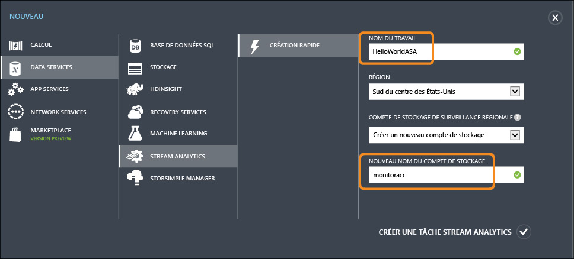

## Requête Azure Stream Analytics

Cliquez sur l’onglet Requête pour accéder à l’éditeur de requête. L’onglet Requête contient une requête SQL qui exécute la transformation sur les données entrantes.

## Archivage de vos données brutes

La forme de requête la plus simple est une requête directe qui archive toutes les données d’entrée dans sa sortie désignée.

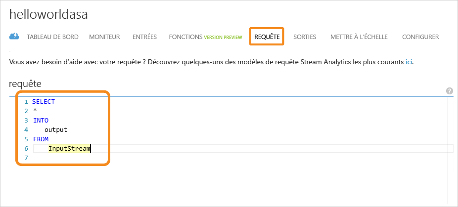

Téléchargez maintenant l’exemple de fichier de données à partir de [GitHub](https://github.com/Azure/azure-stream-analytics/tree/master/Samples/GettingStarted) dans un emplacement sur votre ordinateur. Copiez et collez la requête à partir du fichier **PassThrough.txt**. Cliquez sur le bouton Tester ci-dessous et sélectionnez le fichier de données nommé **HelloWorldASA-InputStream.json** à partir de votre emplacement téléchargé.

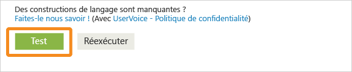

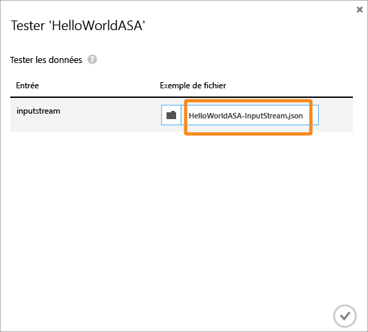

Vous pouvez voir les résultats de la requête dans le navigateur ci-dessous.

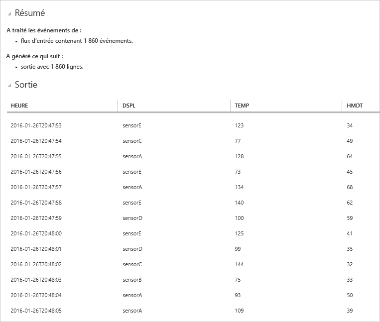

## Nettoyage des données en fonction d’une condition

Essayons de filtrer les résultats en fonction d’une condition. Nous souhaitons limiter les résultats aux événements qui proviennent de « SensorA ». La requête se trouve dans le fichier **Filtering.txt**.

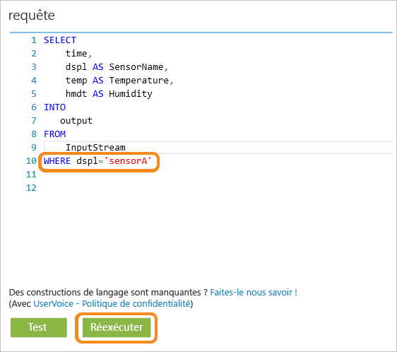

Notez que nous comparons une valeur de chaîne en respectant la casse. Cliquez sur le bouton **Réexécuter** pour exécuter la requête. La requête doit retourner uniquement 389 lignes sur 1 860 événements.

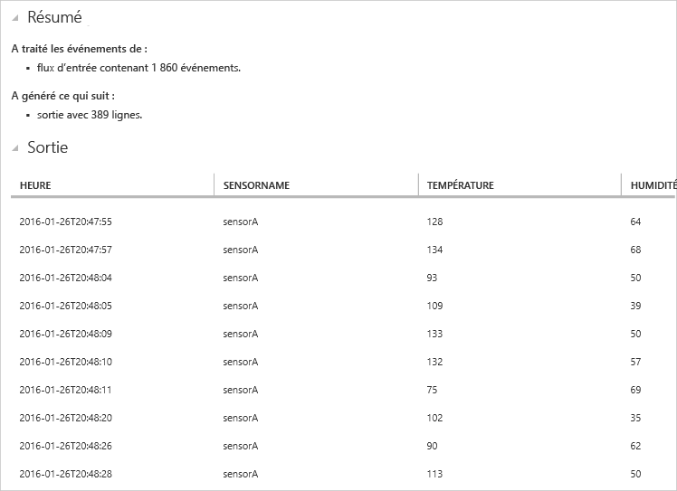

## Génération d’alertes pour déclencher un flux de travail métier

Nous allons maintenant affiner notre requête. Pour chaque type de capteur, si vous souhaitez surveiller la température moyenne par fenêtre de 30 secondes et afficher les résultats uniquement si la température moyenne se situe au-dessus de 100 degrés, écrivez la requête ci-dessous et cliquez sur Réexécuter. La requête se trouve dans le fichier **ThresholdAlerting.txt**.

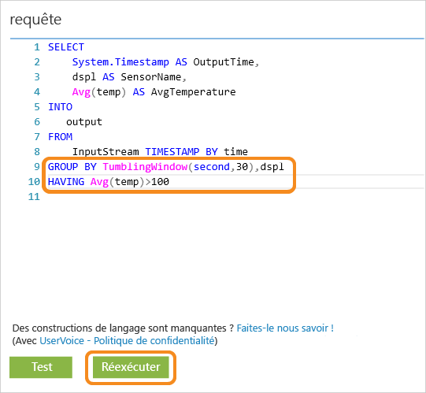

Comme vous pouvez le constater, les résultats contiennent maintenant uniquement 245 lignes, correspondant au nombre d’occurrences où la température moyenne associée à un capteur spécifique est supérieure à 100. Dans cette requête, nous avons regroupé le flux d’événements en fonction du champ dspl, qui est le nom du capteur, et par **intervalle de temps** de 30 secondes. Quand nous créons des requêtes temporelles de ce type, il est essentiel d’indiquer comment nous voulons progresser dans le temps. À l’aide de la clause **TIMESTAMP BY**, nous avons spécifié la colonne « time » comme moyen de progression dans le temps pour tous les calculs temporels. Pour des informations détaillées, consultez les rubriques MSDN sur la [gestion du temps](https://msdn.microsoft.com/library/azure/mt582045.aspx) et la [définition de fenêtres](https://msdn.microsoft.com/library/azure/dn835019.aspx).

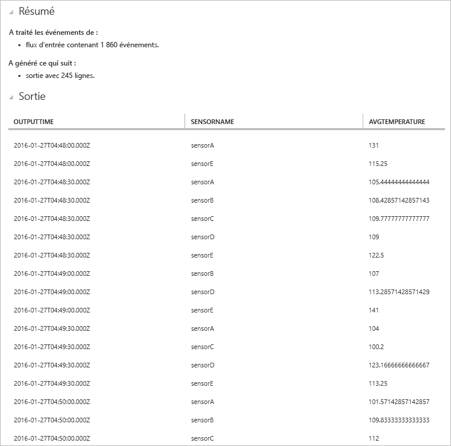

## Recherche d’absence de modèles

Comment écrire une requête pour rechercher l’absence de modèles ? Par exemple, recherchons la dernière fois qu’un capteur a envoyé des données, puis qu’il n’a pas envoyé d’événements au cours de la minute suivante. La requête se trouve dans le fichier **AbsenseOfEvent.txt**.

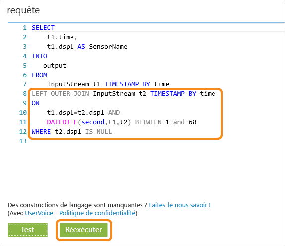

Ici, nous utilisons une clause **LEFT OUTER JOIN** sur le même flux de données (jointure réflexive). Pour une jointure interne, un résultat n’est renvoyé que si une correspondance est trouvée. Par contre, pour une jointure **LEFT OUTER**, si un événement du côté gauche de la jointure n’a pas de correspondance, une ligne contenant la valeur NULL pour toutes les colonnes de la ligne de droite est retournée. Cette technique est très utile pour vérifier l’absence d’événements. Pour plus d’informations sur [JOIN](https://msdn.microsoft.com/library/azure/dn835026.aspx), consultez notre documentation MSDN.

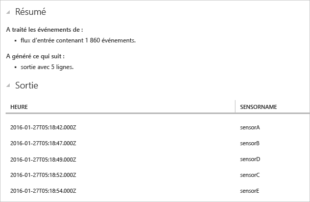

## Conclusion

Ce didacticiel vous apprend essentiellement à écrire différentes requêtes SAQL à partir de différents modèles de données et à afficher les résultats dans le navigateur. Toutefois, il ne s’agit que d’une prise en main. Vous pouvez effectuer beaucoup plus de choses avec Stream Analytics. La prochaine étape consiste à apprendre à connecter le travail Stream Analytics à des entrées et sorties et à le déployer sur Azure. Vous pouvez commencer à explorer l’utilisation de Stream Analytics à l’aide de notre guide [Parcours d’apprentissage](https://azure.microsoft.com/documentation/learning-paths/stream-analytics/), et si vous souhaitez obtenir plus d’informations sur l’écriture de requêtes, consultez l’article [Modèles de requête courants](./stream-analytics-stream-analytics-query-patterns.md#query-example-detect-the-absence-of-events).

<!---HONumber=AcomDC_0224_2016-->