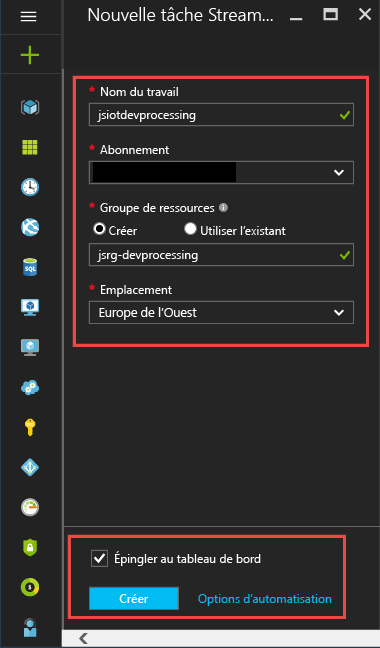
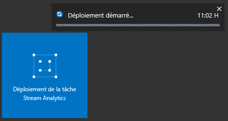
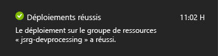
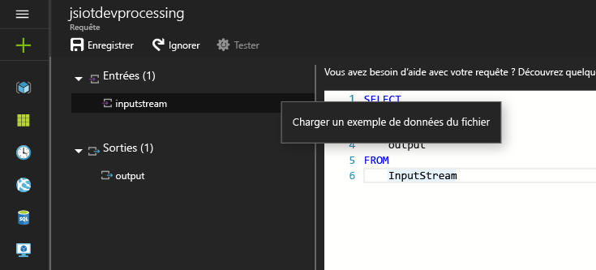
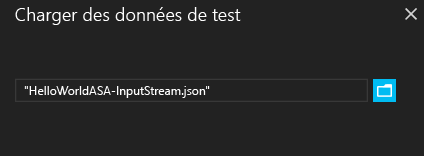

# Prendre en main Azure Stream Analytics pour traiter des données à partir d’appareils IoT
Dans ce didacticiel, vous allez apprendre à créer une logique de traitement de flux pour collecter des données à partir d’appareils IoT (Internet des objets). Nous allons recourir à un cas d’utilisation réel de l’IoT pour vous montrer comment générer votre solution rapidement et à moindre coût.

## Composants requis
* [Abonnement Azure](https://azure.microsoft.com/pricing/free-trial/)
* Exemples de fichiers de requête et de données téléchargeables à partir de [GitHub](https://aka.ms/azure-stream-analytics-get-started-iot)

## Scénario
Entreprise du secteur de l’automatisation industrielle, Contoso a complètement automatisé son processus de fabrication. Les machines de cette usine possèdent des capteurs capables de générer des flux de données en temps réel. Dans ce scénario, un responsable d’atelier de production souhaite obtenir des informations en temps réel à partir des données des capteurs pour rechercher des modèles et effectuer des actions sur ceux-ci. Nous allons utiliser le langage de requête Stream Analytics (SAQL, Stream Analytics Query Language) sur les données des capteurs pour rechercher des modèles intéressants à partir du flux de données entrant.

Dans notre cas, les données sont générées à partir d’un appareil Texas Instruments SensorTag.

La charge utile des données est au format JSON et ressemble à ceci :

    {
        "time": "2016-01-26T20:47:53.0000000",  
        "dspl": "sensorE",  
        "temp": 123,  
        "hmdt": 34  
    }  

Dans un scénario réel, des centaines de capteurs de ce type pourraient générer des événements sous forme de flux. Dans l’idéal, un appareil de passerelle exécuterait du code pour transmettre ces événements à [Azure Event Hubs](https://azure.microsoft.com/services/event-hubs/) ou [Azure IoT Hubs](https://azure.microsoft.com/services/iot-hub/). Votre tâche Stream Analytics ingèrerait ces événements depuis Event Hubs et exécuterait des requêtes d’analyse en temps réel sur les flux. Vous pourriez ensuite envoyer les résultats à l’une des [sorties prises en charge](stream-analytics-define-outputs.md).

Pour plus de convivialité, ce guide de mise en route fournit un exemple de fichier de données capturé à partir de balises de capteur réelles. Vous pouvez exécuter des requêtes sur les exemples de données et afficher les résultats. Dans les didacticiels suivants, vous apprendrez comment connecter votre travail aux entrées et sorties et le déployer sur le service Azure.

## Création d’un travail Stream Analytics
1. Dans le [portail Azure](http://portal.azure.com), cliquez sur le signe +, puis saisissez **STREAM ANALYTICS** dans le champ de texte situé à droite. Sélectionnez ensuite **Stream Analytics job** (tâche Stream Analytics) dans la liste des résultats.
   
    
2. Saisissez un nom de tâche unique et vérifiez que l’abonnement est approprié pour votre tâche. Ensuite, créez un groupe de ressources ou sélectionnez un groupe existant dans votre abonnement.
3. Sélectionnez ensuite l’emplacement où vous souhaitez placer la tâche. Afin d’accélérer le traitement et réduire les coûts de transfert de données, il est recommandé de sélectionner le même emplacement que celui du groupe de ressources et celui prévu pour le compte de stockage.
   
    
   
   > [!NOTE]
   > Vous devez créer ce compte de stockage une seule fois par région. Ce stockage sera partagé entre toutes les tâches Stream Analytics qui sont créées dans cette région.
   > 
   > 
4. Cochez la case pour placer votre travail sur votre tableau de bord, puis cliquez sur **CRÉER**.
   
    
5. Vous devriez voir le message « Deployment started » (déploiement démarré) s’afficher en haut à droite de la fenêtre de votre navigateur. Il fera rapidement place à une fenêtre indiquant l’achèvement du déploiement, comme illustré ci-dessous.
   
    

### Création d’une requête Azure Stream Analytics
Une fois votre tâche créée, vous pouvez l’ouvrir et créer une requête. Pour accéder à votre tâche, il vous suffit de cliquer sur la mosaïque correspondante.

Dans le volet **Job Topology** (Topologie des tâches), cochez la case **REQUÊTE** pour accéder à l’éditeur de requête. L’éditeur de **REQUÊTE** vous permet d’entrer une requête T-SQL qui exécute la transformation sur les données d’événement entrantes.

### Requête : Archiver vos données brutes
La forme de requête la plus simple est une requête directe qui archive toutes les données d’entrée dans sa sortie désignée. Téléchargez l’exemple de fichier de données de [GitHub](https://aka.ms/azure-stream-analytics-get-started-iot) vers un emplacement de votre ordinateur. 

1. Copiez et collez la requête du fichier PassThrough.txt. 
   
    
2. Cliquez sur les trois points en regard de votre entrée, puis cochez la case **Upload sample data from file** (charger les exemples de données à partir d'un fichier).
   
    
3. Un volet s’ouvre alors sur la droite. Dans ce volet, sélectionnez le fichier de données HelloWorldASA-InputStream.json à partir de votre emplacement de téléchargement et cliquez sur **OK** en bas du volet.
   
    
4. Cliquez ensuite sur l’engrenage de **Test** dans la zone supérieure gauche de la fenêtre et exécutez votre requête sur les exemples de données. Une fois le traitement terminé, une fenêtre de résultats s’ouvre sous votre requête.
   
    

### Requête : Filtrer les données en fonction d’une condition
Essayons de filtrer les résultats en fonction d’une condition. Nous souhaitons limiter les résultats aux événements qui proviennent de « SensorA ». La requête se trouve dans le fichier Filtering.txt.

Vous pouvez voir que la requête respecte la casse et compare des valeurs de chaîne. Cliquez à nouveau sur l’engrenage de **Test** pour exécuter la requête. La requête doit renvoyer uniquement 389 lignes sur 1860 événements.

### Requête : Alerte déclenchant un flux de travail métier
Nous allons maintenant affiner notre requête. Pour chaque type de capteur, nous souhaitons surveiller la température moyenne par fenêtre de 30 secondes et afficher les résultats uniquement si la température moyenne se situe au-dessus de 100 degrés. Nous écrivons la requête suivante et cliquons sur **Test** pour afficher les résultats. La requête se trouve dans le fichier ThresholdAlerting.txt.

Les résultats doivent maintenant contenir uniquement 245 lignes et répertorier les noms des capteurs pour lesquels la température moyenne est supérieure à 100 degrés. Dans cette requête, nous avons regroupé le flux d’événements en fonction du champ **dspl**, qui correspond au nom du capteur, et par valeur **Intervalle de temps** de 30 secondes. Les requêtes temporelles doivent indiquer le mode de calcul du temps. À l’aide de la clause **TIMESTAMP BY**, nous avons spécifié la colonne **OUTPUTTIME** pour associer les valeurs de temps avec l’ensemble des calculs temporels. Pour obtenir des informations détaillées, consultez les rubriques MSDN sur la [gestion du temps](https://msdn.microsoft.com/library/azure/mt582045.aspx) et les [fonctions de fenêtrage](https://msdn.microsoft.com/library/azure/dn835019.aspx).

### Requête : Détection de l’absence d’événements
Comment écrire une requête pour rechercher une absence d’événements d’entrée ? Recherchons la dernière fois qu’un capteur a envoyé des données, puis qu’il n’a pas envoyé d’événements au cours de la minute suivante. La requête se trouve dans le fichier AbsenseOfEvent.txt.

Ici, nous utilisons une jointure **LEFT OUTER** sur le même flux de données (jointure réflexive). Pour une jointure **INNER**, un résultat n’est renvoyé que si une correspondance est trouvée.  Par contre, pour une jointure **LEFT OUTER**, si un événement du côté gauche de la jointure n’a pas de correspondance, une ligne contenant la valeur NULL pour toutes les colonnes de la ligne de droite est renvoyée. Cette technique est très utile pour rechercher une absence d’événements. Pour en savoir plus sur [JOIN](https://msdn.microsoft.com/library/azure/dn835026.aspx), consultez notre documentation MSDN.

## Conclusion
L’objectif de ce didacticiel est de montrer comment écrire différentes requêtes en langage de requête Stream Analytics et afficher les résultats dans le navigateur. Toutefois, il ne s’agit que d’une prise en main. Stream Analytics offre de nombreuses autres possibilités. Ce langage prend en charge un large éventail d’entrées et de sorties et peut même tirer parti de fonctions d’Azure Machine Learning, ce qui en fait un outil robuste pour l’analyse des flux de données. Vous pouvez obtenir des informations supplémentaires sur Stream Analytics via notre [parcours d’apprentissage](https://azure.microsoft.com/documentation/learning-paths/stream-analytics/). Pour en savoir plus sur la méthode à suivre pour écrire des requêtes, voir [Exemples de requête pour les modes d’utilisation courants dans Stream Analytics](stream-analytics-stream-analytics-query-patterns.md).

<!--HONumber=Jan17_HO4-->

