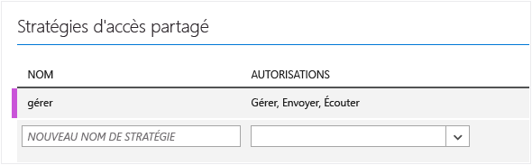
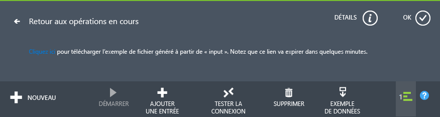
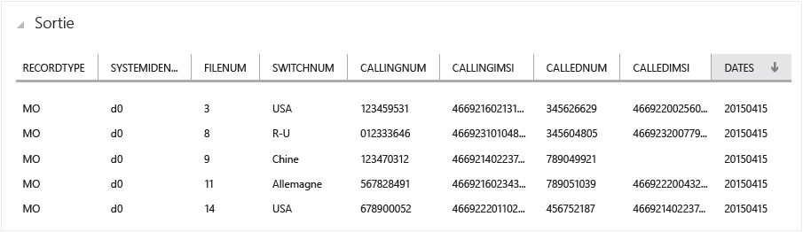
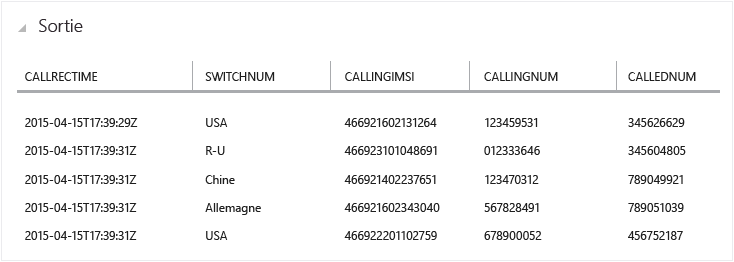
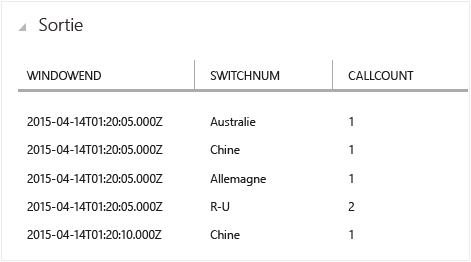
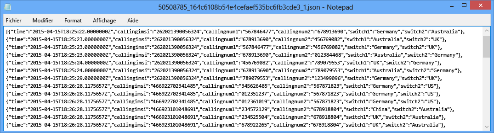

<properties
	pageTitle="Prise en main de Stream Analytics : détection des fraudes en temps réel | Microsoft Azure"
	description="Apprenez à créer une solution de détection des fraudes en temps réel avec Stream Analytics. Utilisez un concentrateur d’événements pour le traitement des événements en temps réel."
	keywords="détection des anomalies, détection des fraudes, détection d’anomalies en temps réel"
	services="stream-analytics"
	documentationCenter=""
	authors="jeffstokes72"
	manager="paulettm"
	editor="cgronlun" />

<tags
	ms.service="stream-analytics"
	ms.devlang="na"
	ms.topic="hero-article"
	ms.tgt_pltfrm="na"
	ms.workload="data-services"
	ms.date="12/04/2015"
	ms.author="jeffstok" />

# Prise en main de l’utilisation d’Azure Stream Analytics : détection des fraudes en temps réel

Apprenez à créer une solution de bout en bout pour la détection des fraudes en temps réel avec Azure Stream Analytics. Importez des événements dans un concentrateur d’événements Azure, écrivez des requêtes Stream Analytics à des fins d’agrégation ou d’alerte et envoyez les résultats à un récepteur de sortie pour obtenir des informations sur les données grâce au traitement en temps réel. La détection en temps réel des anomalies de télécommunication est traitée, mais la technique présentée est adaptée à d’autres types de détection des fraudes, comme l’usurpation d’identité ou le vol de carte de crédit.

Stream Analytics est un service entièrement géré permettant de traiter des événements avec une latence faible, une haute disponibilité et un traitement d'événements complexes évolutif à l'aide d'une diffusion de données dans le cloud. Pour plus d’informations, consultez [Présentation d’Azure Stream Analytics](stream-analytics-introduction.md).

## Scénario : détection des fraudes de télécommunication et SIM en temps réel

Une société de télécommunication dispose d’un volume important de données pour les appels entrants. Elle souhaite effectuer les opérations suivantes sur ses données : * Les réduire en une quantité gérable pour dégager des informations sur l'utilisation des clients au fil du temps et dans différentes régions géographiques. * Détecter les fraudes SIM (plusieurs appels provenant de la même identité quasiment au même moment mais dans des zones géographiques différentes) en temps réel afin d'y répondre facilement en avertissant les clients ou en arrêtant le service.

Dans les scénarios de type Internet des objets où des tonnes de données télémétriques ou de capteur sont générées, les clients veulent les agréger ou être alertés en cas d’anomalie en temps réel.

## Composants requis

Ce scénario utilise un générateur d’événements disponible sur GitHub. Téléchargez-le [ici](https://github.com/Azure/azure-stream-analytics/tree/master/DataGenerators/TelcoGenerator), puis suivez les étapes de ce didacticiel pour configurer votre solution.

## Création d'une entrée Azure Event Hubs et d'un groupe de consommateurs

L’exemple d’application génère des événements et les transmet vers une instance de concentrateur d’événements en vue d’un traitement en temps réel. Les concentrateurs d’événements Service Bus constituent la méthode préférée de l’ingestion d’événements pour Stream Analytics. Pour plus d’informations sur les concentrateurs d’événements, consultez la [documentation Azure Service Bus](/documentation/services/service-bus/).

Créer un concentrateur d'événements :

1.	Dans le [portail Azure](https://manage.windowsazure.com/), cliquez sur **Nouveau** > **Services d'application** > **Service Bus** > **Concentrateur d'événements** > **Création rapide**. Fournissez un nom, une région et un espace de noms nouveau ou existant pour créer un concentrateur d'événements.  
2.	Nous vous recommandons de faire en sorte que chaque travail Stream Analytics lise les événements à partir d’un seul groupe de consommateurs de concentrateurs d’événements. Nous verrons plus loin comment créer un groupe de consommateurs et vous pourrez alors [en savoir plus](https://msdn.microsoft.com/library/azure/dn836025.aspx) sur ce point. Pour créer un groupe de consommateurs, accédez au concentrateur d’événements nouvellement créé et cliquez sur l’onglet **Groupes de consommateurs**, puis sur **Créer** en bas de la page et entrez un nom pour votre groupe de consommateurs.
3.	Pour accorder l’accès au concentrateur d’événements, vous devez créer une stratégie d’accès partagé. Cliquez sur l’onglet **Configurer** de votre concentrateur d’événements.
4.	Sous **Stratégies d'accès partagé**, créez une stratégie ayant les autorisations **Gérer**.

	

5.	Cliquez sur **Enregistrer** au bas de la page.
6.	Accédez au **tableau de bord**, cliquez sur **Informations de connexion** en bas de la page, puis copiez et enregistrez les informations de connexion.

## Configuration et démarrage de l’application de génération d’événements

Nous avons fourni une application cliente qui génère des exemples de métadonnées d’appel entrant et les envoie au concentrateur d’événements. Suivez les étapes ci-dessous pour configurer cette application.

1.	Téléchargez la solution TelcoGenerator depuis [https://github.com/Azure/azure-stream-analytics/tree/master/DataGenerators/TelcoGenerator](https://github.com/Azure/azure-stream-analytics/tree/master/DataGenerators/TelcoGenerator).
2.	Remplacez les valeurs Microsoft.ServiceBus.ConnectionString et EventHubName dans le fichier App.Config par la chaîne de connexion et le nom de votre concentrateur d’événements.
3.	Générez la solution pour déclencher le téléchargement des packages nuget requis.
4.	Lancez l’application. Procédez comme suit :

    	telcodatagen [#NumCDRsPerHour] [SIM Card Fraud Probability] [#DurationHours]

L'exemple suivant génèrera 1 000 événements avec une probabilité de 20 % de fraude sur une durée de 2 heures :

    TelcoDataGen.exe 1000 .2 2

Vous verrez des enregistrements être envoyés à votre concentrateur d’événements. Certains champs clés que nous utiliserons dans cette application de détection des fraudes en temps réel sont définis ici :

| Enregistrement | Définition |
| ------------- | ------------- |
| CallrecTime | Horodatage de l'heure de début d'appel |
| SwitchNum | Commutateur téléphonique utilisé pour connecter l'appel. |
| CallingNum | Numéro de téléphone de l'appelant. |
| CallingIMSI | Identité de l'abonné mobile international (IMSI). Identificateur unique de l'appelant. |
| CalledNum | Numéro de téléphone du destinataire de l'appel. |
| CalledIMSI | Identité de l'abonné mobile international (IMSI). Identificateur unique du destinataire de l'appel. |

## Création d’un travail Stream Analytics
Maintenant que nous avons un flux d’événements de télécommunication, nous pouvons configurer un travail Stream Analytics pour analyser ces événements en temps réel.

### Configuration d’un travail Stream Analytics

1.	Dans le portail Azure, cliquez sur **Nouveau > Data Services > Stream Analytics > Création rapide**.
2.	Spécifiez les valeurs suivantes, puis cliquez sur **Créer un travail Stream Analytics** :

	* **Nom du travail** : entrez un nom pour le travail.

	* **Région** : sélectionnez la région où vous souhaitez exécuter le travail. Envisagez de placer le travail et le concentrateur d’événements dans la même région pour être certain d’améliorer les performances et de ne pas payer pour un transfert de données entre différentes régions.

	* **Compte de stockage** : choisissez le compte de stockage que vous souhaitez utiliser pour stocker les données de surveillance de toutes les tâches Stream Analytics en cours d’exécution dans cette région. Vous pouvez choisir un compte de stockage existant ou en créer un.

3.	Dans le volet gauche, cliquez sur **Stream Analytics** pour afficher une liste des travaux Stream Analytics.

	

4.	Le nouveau travail est affiché avec l’état **Créé**. Notez que le bouton **Démarrer** situé en bas de la page est désactivé. Avant de pouvoir démarrer le travail, vous devez configurer son entrée, sa sortie et sa requête.

### Spécification d'une entrée de travail
1.	En haut de la page de votre travail Stream Analytics, cliquez sur **Entrées**, puis sur **Ajouter une entrée**. La boîte de dialogue qui s’ouvre vous guidera le long d’une procédure de configuration de votre entrée.
2.	Sélectionnez **Flux de données**, puis cliquez avec le bouton droit.
3.	Sélectionnez **Concentrateur d’événements**, puis cliquez avec le bouton droit.
4.	Saisissez ou sélectionnez les valeurs suivantes sur la troisième page :

	* **Alias d'entrée** : entrez un nom convivial pour cette entrée de travail, comme *CallStream*. Notez que vous utiliserez ce nom dans la requête par la suite.
	* **Concentrateur d'événements** : si le concentrateur d’événements que vous avez créé est situé dans le même abonnement que le travail Stream Analytics, sélectionnez l’espace de noms dans lequel est situé le concentrateur d’événements.

	Si votre concentrateur d’événements est situé dans un autre abonnement, sélectionnez **Utiliser le concentrateur d’événements à partir d’un autre abonnement** et entrez manuellement l’**espace de noms Service Bus**, le **nom du concentrateur d’événements**, le **nom de la stratégie du concentrateur d’événements**, la **clé de stratégie du concentrateur d’événements** et le **nombre de partitions du concentrateur d’événements**.

	* **Nom du hub d’événements** : sélectionnez le nom du concentrateur d’événements.

	* **Nom de la stratégie du concentrateur d'événements** : sélectionnez la stratégie de concentrateur d’événements créée précédemment dans ce didacticiel.

	* **Groupe de consommateurs du hub d’événements** : saisissez le nom du groupe de consommateurs créé précédemment dans ce didacticiel.
5.	Cliquez avec le bouton droit.
6.	Spécifiez les valeurs suivantes :

	* **Format du sérialiseur d'événement** : JSON
	* **Encodage** : UTF8
7.	Cliquez sur la coche pour ajouter cette source et vérifier que Stream Analytics peut se connecter au concentrateur d’événements.

### Spécification de la requête du travail

Stream Analytics prend en charge un modèle de requête simple et déclaratif pour la description des transformations dans le cadre du traitement en temps réel. Pour plus d’informations sur ce langage, consultez la page [Références sur le langage des requêtes d’Azure Stream Analytics](https://msdn.microsoft.com/library/dn834998.aspx). Ce didacticiel aborde la création et le test de plusieurs requêtes sur votre flux de données d’appel en temps réel.

#### Facultatif : exemples de données d’entrée
Pour appliquer votre requête à des données de travail réelles, vous pouvez utiliser la fonctionnalité **Exemples de données** pour extraire des événements à partir de votre flux de données et créer un fichier .JSON contenant les événements du test. Les étapes suivantes indiquent comment effectuer cette opération. Nous avons également fourni un exemple de fichier [Telco.json](https://github.com/Azure/azure-stream-analytics/blob/master/Sample%20Data/telco.json) à des fins de test.

1.	Sélectionnez l’entrée de votre concentrateur d’événements, puis cliquez sur **Exemples de données** en bas de la page.
2.	Dans la boîte de dialogue qui s’affiche, entrez une **Heure de début** pour le démarrage de la collecte de données et une **Durée** afin de déterminer la quantité de données supplémentaires à traiter.
3.	Cliquez sur la coche pour démarrer l'échantillonnage des données à partir de l'entrée. La production du fichier de données peut prendre une minute ou deux. Une fois le processus terminé, cliquez sur **Détails** et téléchargez et enregistrez le fichier .JSON généré.

	

#### Requête passthrough

Si vous voulez archiver tous les événements, vous pouvez utiliser une requête passthrough pour lire tous les champs dans la charge utile de l'événement ou du message. Pour commencer, exécutez une simple requête passthrough qui projette tous les champs dans un événement.

1.	En haut de la page du travail Stream Analytics, cliquez sur **Requête**.
2.	Ajoutez le code suivant dans l'éditeur de code :

		SELECT * FROM CallStream

	> Assurez-vous que le nom de la source d'entrée correspond à celui que vous avez spécifié précédemment.

3.	Cliquez sur**Test**dans l’éditeur de requête.
4.	Fournissez un fichier de test. Il peut s’agir soit d’un fichier que vous avez créé en suivant la procédure ci-dessus, soit du fichier [Telco.json](https://github.com/Azure/azure-stream-analytics/blob/master/Sample%20Data/telco.json).
5.	Cliquez sur le bouton en forme de coche et consultez les résultats affichés sous la définition de la requête.

	

### Projection de colonne

Nous allons maintenant réduire les champs renvoyés à un ensemble plus petit.

1.	Modifiez la requête dans l’éditeur de code comme ceci :

		SELECT CallRecTime, SwitchNum, CallingIMSI, CallingNum, CalledNum
		FROM CallStream

2.	Cliquez sur **Réexécuter** dans l’éditeur de requête pour afficher les résultats de la requête.

	

### Nombre d'appels entrants par région : fenêtre bascule avec agrégation

Pour comparer la quantité d'appels entrants par région, nous allons exploiter un [TumblingWindow](https://msdn.microsoft.com/library/azure/dn835055.aspx) pour obtenir le nombre d'appels entrants regroupés par SwitchNum toutes les 5 secondes.

1.	Modifiez la requête dans l’éditeur de code comme ceci :

		SELECT System.Timestamp as WindowEnd, SwitchNum, COUNT(*) as CallCount
		FROM CallStream TIMESTAMP BY CallRecTime
		GROUP BY TUMBLINGWINDOW(s, 5), SwitchNum

	Cette requête utilise le mot clé **Timestamp By** pour spécifier un champ d’horodatage dans la charge utile à utiliser dans le calcul temporel. Si ce champ n’est pas spécifié, l’opération de fenêtrage est réalisée en utilisant l’heure d’arrivée de chaque événement dans le concentrateur d’événements. Consultez [« Heure d’arrivée par rapport à l’heure de l’application » dans la page Référence du langage de requête de Stream Analytics](https://msdn.microsoft.com/library/azure/dn834998.aspx).

	Notez que vous pouvez accéder à un horodatage pour la fin de chaque fenêtre à l’aide de la propriété **System.Timestamp**.

2.	Cliquez sur **Réexécuter** dans l’éditeur de requête pour afficher les résultats de la requête.

	

### Détection des fraudes SIM avec une jointure réflexive

Pour identifier une utilisation potentiellement frauduleuse, nous examinons les appels provenant du même utilisateur mais à des endroits différents en moins de 5 secondes. Nous [joignons](https://msdn.microsoft.com/library/azure/dn835026.aspx) le flux d’événements d’appel avec lui-même pour vérifier ces cas.

1.	Modifiez la requête dans l’éditeur de code comme ceci :

		SELECT System.Timestamp as Time, CS1.CallingIMSI, CS1.CallingNum as CallingNum1,
		CS2.CallingNum as CallingNum2, CS1.SwitchNum as Switch1, CS2.SwitchNum as Switch2
		FROM CallStream CS1 TIMESTAMP BY CallRecTime
		JOIN CallStream CS2 TIMESTAMP BY CallRecTime
		ON CS1.CallingIMSI = CS2.CallingIMSI
		AND DATEDIFF(ss, CS1, CS2) BETWEEN 1 AND 5
		WHERE CS1.SwitchNum != CS2.SwitchNum

2.	Cliquez sur **Réexécuter** dans l’éditeur de requête pour afficher les résultats de la requête.

	

### Création du récepteur de sortie

Maintenant que nous avons défini un flux d’événements, un concentrateur d’événements d’entrée pour la réception des événements et une requête pour effectuer une transformation sur le flux, la dernière étape consiste à définir un récepteur de sortie pour le travail. Il s'agit d'écrire des événements pour le comportement frauduleux lié au stockage d'objets blob.

Si vous n’avez pas déjà de conteneur pour le stockage des objets blob, procédez comme suit pour en créer un.

1.	Utilisez un compte de stockage existant ou créez-en un en cliquant sur **NOUVEAU > SERVICES DE DONNÉES > STOCKAGE > CRÉATION RAPIDE**, puis suivez les instructions qui s’affichent.
2.	Sélectionnez le compte de stockage, cliquez en haut de la page sur **CONTENEURS**, puis sur **AJOUTER**.
3.	Entrez un **NOM** pour votre conteneur et définissez son **ACCÈS** sur Objet blob public.

## Spécification de la sortie du travail

1.	En haut de la page de votre travail Stream Analytics, cliquez sur **SORTIE**, puis sur **AJOUTER UNE SORTIE**. La boîte de dialogue qui s'ouvre vous guidera le long d'une procédure de configuration de votre sortie.
2.	Sélectionnez **STOCKAGE D’OBJETS BLOB**, puis cliquez avec le bouton droit.
3.	Saisissez ou sélectionnez les valeurs suivantes sur la troisième page :

	* **ALIAS DE SORTIE** : entrez un nom convivial pour cette sortie de travail.
	* **ABONNEMENT** : si le stockage d’objets blobs que vous avez créé est situé dans le même abonnement que la tâche Stream Analytics, sélectionnez **Utiliser le compte de stockage de l’abonnement actuel**. Si votre espace de stockage appartient à un autre abonnement, sélectionnez **Utiliser le compte de stockage d’un autre abonnement** et entrez manuellement les informations des champs **COMPTE DE STOCKAGE**, **CLÉ DU COMPTE DE STOCKAGE** et **CONTENEUR**.
	* **COMPTE DE STOCKAGE** : sélectionnez le nom du compte de stockage.
	* **CONTENEUR** : sélectionnez le nom du conteneur.
	* **PRÉFIXE DU NOM DE FICHIER** : entrez un préfixe de fichier à utiliser lors de l’écriture de la sortie de l’objet blob.

4.	Cliquez avec le bouton droit.
5.	Spécifiez les valeurs suivantes :

	* **FORMAT DU SÉRIALISEUR D’ÉVÉNEMENT** : JSON
	* **ENCODAGE** : UTF8

6.	Cliquez sur le bouton de vérification pour ajouter cette source et vérifier que Stream Analytics peut se connecter au compte de stockage.

## Démarrer le travail de traitement en temps réel

Une fois que vous avez spécifié une entrée, une requête et une sortie pour la tâche Stream Analytics, nous pouvons lancer la détection des fraudes en temps réel.

1.	Sur le **TABLEAU DE BORD** du travail, en bas de la page, cliquez sur **DÉMARRER**.
2.	Dans la boîte de dialogue qui s’affiche, sélectionnez **HEURE DE DÉMARRAGE DE LA TÂCHE**, puis activez la case à cocher en bas de la boîte de dialogue. L’état du travail passe à **Démarrage**, puis à **En cours d’exécution**.

## Afficher la sortie de détection des fraudes

Utilisez un outil comme [Azure Storage Explorer](https://azurestorageexplorer.codeplex.com/) ou [Azure Explorer](http://www.cerebrata.com/products/azure-explorer/introduction) pour afficher les événements frauduleux au fur et à mesure qu’ils s’écrivent dans la sortie en temps réel.

## Obtenir de l'aide
Pour obtenir une assistance, consultez le [forum Azure Stream Analytics](https://social.msdn.microsoft.com/Forums/fr-FR/home?forum=AzureStreamAnalytics)

## Étapes suivantes

- [Présentation d'Azure Stream Analytics](stream-analytics-introduction.md)
- [Prise en main d'Azure Stream Analytics](stream-analytics-get-started.md)
- [Mise à l'échelle des travaux Azure Stream Analytics](stream-analytics-scale-jobs.md)
- [Références sur le langage des requêtes d'Azure Stream Analytics](https://msdn.microsoft.com/library/azure/dn834998.aspx)
- [Références sur l’API REST de gestion d’Azure Stream Analytics](https://msdn.microsoft.com/library/azure/dn835031.aspx)

<!---HONumber=AcomDC_1210_2015-->