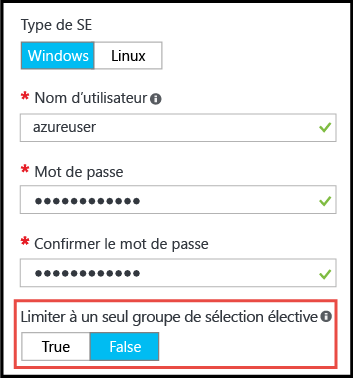

# <a name="working-with-large-virtual-machine-scale-sets"></a>Utilisation de grands groupes de machines virtuelles identiques
Vous pouvez désormais créer des [groupes de machines virtuelles identiques](/azure/virtual-machine-scale-sets/) Azure d’une capacité maximum de 1 000 machines virtuelles. Dans ce document, un _grand groupe de machines virtuelles identiques_ est défini comme un groupe identique pouvant contenir plus de 100 machines virtuelles. Cette fonctionnalité est définie par une propriété de groupe identique (_singlePlacementGroup=False_). 

Certains aspects des grands groupes identiques, tels que les domaines d’erreur et l’équilibrage de charge se comportent différemment d’un groupe identique standard. Ce document explique les caractéristiques des grands groupes identiques et décrit ce que vous devez savoir pour les utiliser correctement dans vos applications. 

Une approche commune pour le déploiement d’une infrastructure cloud à grande échelle consiste à créer un ensemble d’_unités d'échelle_, par exemple, en créant plusieurs 	groupes de machines virtuelles identiques sur plusieurs réseaux virtuels et comptes de stockage. Cette approche offre une gestion facilitée par rapport aux machines virtuelles uniques, et plusieurs unités d’échelle sont utiles pour de nombreuses applications, notamment celles qui nécessitent d’autres composants empilables comme plusieurs réseaux virtuels et points de terminaison. Toutefois, si votre application nécessite un seul cluster de grande taille, il peut être plus simple de déployer un seul groupe identique contenant jusqu’à 1 000 machines virtuelles. Des exemples de scénarios incluent des déploiements de Big Data centralisés ou des grilles de calcul nécessitant la gestion simple d’un grand pool de nœuds de travail. Combinés avec [des disques de données associés](virtual-machine-scale-sets-attached-disks.md) de groupes de machines virtuelles identiques, les grands groupes identiques vous permettent de déployer une infrastructure évolutive, composée de plusieurs milliers de cœurs et de plusieurs pétaoctets de stockage, en une seule opération.

## <a name="placement-groups"></a>Groupes de placement 
Ce n’est pas le nombre de machines virtuelles qui rend un _grand_ groupe identique si spécial, mais plutôt le nombre de _groupes de placement_ qu’il contient. Un groupe de placement est une construction similaire à une haute disponibilité Azure, avec ses propres domaines d’erreur et les domaines de mise à niveau. Par défaut, un groupe identique se compose d’un seul groupe de placement contenant au maximum 100 machines virtuelles. Si une propriété de groupe identique appelée _singlePlacementGroup_ est définie sur _false_, le groupe identique peut se composer de plusieurs groupes de placement et présente une plage de 0 à 1 000 machines virtuelles. Lorsque la valeur par défaut est définie sur _true_, un groupe identique est composé d’un seul groupe de placement et présente une plage de 0 à 100 machines virtuelles.

## <a name="checklist-for-using-large-scale-sets"></a>Liste de contrôle pour l’utilisation de grands groupes identiques
Pour déterminer si votre application peut utiliser efficacement de grands groupes identiques, voici quelques points à prendre en compte :

- Les grands groupes identiques requièrent Azure Managed Disks. Les groupes identiques qui ne sont pas créés avec Managed Disks nécessitent plusieurs comptes de stockage (un toutes les 20 machines virtuelles). Les grands groupes identiques sont conçus pour fonctionner exclusivement avec Managed Disks afin de réduire vos frais de gestion de stockage et d’éviter tout risque d’exécution dans les limites d’abonnement des comptes de stockage. Si vous n’utilisez pas Managed Disks, votre groupe identique est limité à 100 machines virtuelles.
- Les groupes identiques créés à partir d’images d’Azure Marketplace peuvent monter en puissance jusqu'à 1 000 machines virtuelles.
- Les groupes identiques créés à partir d’images personnalisées (images de machine virtuelle que vous créez et téléchargez vous-même) peuvent actuellement monter en puissance jusqu’à 300 machines virtuelles.
- L’équilibrage de charge de type Couche 4 avec l’équilibrage de charge Azure n’est pas encore possible pour les groupes identiques composés de plusieurs groupes de placement. Si vous devez utiliser Azure Load Balancer, veillez à ce que le groupe identique soit configuré pour utiliser un seul groupe de placement, ce qui est le paramètre par défaut.
- L’équilibrage de charge de type Couche 7 avec Azure Application Gateway est pris en charge pour tous les groupes identiques.
- Un groupe identique est défini avec un seul sous-réseau. Vérifiez que votre sous-réseau dispose d’un espace d’adressage suffisamment grand pour toutes les machines virtuelles requises. Par défaut, un groupe identique surprovisionne (c’est-à-dire qu’il crée des machines virtuelles supplémentaires au moment du déploiement ou de la montée en charge pour lesquelles vous n’êtes pas facturé) afin d’améliorer les performances et la fiabilité du déploiement. Prévoyez un espace d’adressage 20 % supérieur au nombre de machines virtuelles que vous envisagez d’atteindre.
- Si vous prévoyez de déployer plusieurs machines virtuelles, il ne sera peut-être pas nécessaire d’augmenter vos limites de quota de cœur de calcul.
- Les domaines d’erreur et de mise à niveau sont cohérents uniquement au sein d’un groupe de placement. Cette architecture ne modifie pas la disponibilité globale d’un groupe identique, car les machines virtuelles sont réparties uniformément sur une infrastructure physique distincte. Toutefois, si vous avez besoin de garantir deux machines virtuelles sur des infrastructures différentes, assurez-vous qu’elles se trouvent dans des domaines d’erreur différents au sein du même groupe de placement. Les identifiants du groupe de placement et du domaine d’erreur sont indiqués dans la _vue d’instance_ d’une machine virtuelle de groupe identique. Vous pouvez afficher la vue d’instance d’un groupe de machines virtuelles identiques dans [Azure Resource Explorer](https://resources.azure.com/).


## <a name="creating-a-large-scale-set"></a>Création d’un grand groupe identique
Lorsque vous créez un groupe identique dans le portail Azure, vous pouvez l’autoriser à prendre en charge plusieurs groupes de placement en définissant l’option _Limit to a single placement group (Limiter à un seul groupe de placement)_ sur _False_ dans le panneau _Fonctions de base_. Lorsque cette option est définie sur _False_, vous pouvez spécifier une valeur _Nombre d’instances_ de 1 000 maximum.



Vous pouvez créer un grand groupe de machines virtuelles identiques à l’aide de la commande [Azure CLI](https://github.com/Azure/azure-cli) _az vmss create_. Cette commande définit des valeurs par défaut intelligentes comme la taille du sous-réseau en fonction de l’argument _instance-count_ :

```bash
az group create -l southcentralus -n biginfra
az vmss create -g biginfra -n bigvmss --image ubuntults --instance-count 1000
```
Notez que la commande _vmss create_ inclut par défaut des valeurs de configuration si vous ne les spécifiez pas. Pour voir les options disponibles que vous pouvez remplacer, essayez :
```bash
az vmss create --help
```

Si vous créez un grand groupe identique en composant un modèle Azure Resource Manager, assurez-vous que le modèle crée un groupe identique basé sur Azure Managed Disks. Vous pouvez définir la propriété _singlePlacementGroup_ sur _false_ dans la section _propriétés_ de la ressource _Microsoft.Compute/virtualMAchineScaleSets_. Le fragment JSON suivant présente le début d’un modèle de groupe identique, y compris la capacité de 1 000 machines virtuelles et le paramètre _"singlePlacementGroup" : false_ :
```json
{
  "type": "Microsoft.Compute/virtualMachineScaleSets",
  "location": "australiaeast",
  "name": "bigvmss",
  "sku": {
    "name": "Standard_DS1_v2",
    "tier": "Standard",
    "capacity": 1000
  },
  "properties": {
    "singlePlacementGroup": false,
    "upgradePolicy": {
      "mode": "Automatic"
    }
```
Pour obtenir un exemple complet d’un modèle de grand groupe identique, reportez-vous à [https://github.com/gbowerman/azure-myriad/blob/master/bigtest/bigbottle.json](https://github.com/gbowerman/azure-myriad/blob/master/bigtest/bigbottle.json).

## <a name="converting-an-existing-scale-set-to-span-multiple-placement-groups"></a>Conversion d’un groupe identique existant afin qu’il couvre plusieurs groupes de placement
Pour faire en sorte qu’un groupe de machines virtuelles identiques existant puisse prendre en charge plus de 100 machines virtuelles, vous devez modifier la propriété _singlePlacementGroup_ sur _false_ dans le modèle de groupe identique. Vous pouvez tester la modification de cette propriété avec [Azure Resource Explorer](https://resources.azure.com/). Pour rechercher un groupe identique existant, sélectionnez _Modifier_ et modifiez la propriété _singlePlacementGroup_. Si vous ne voyez pas cette propriété, c’est peut-être parce que vous visionnez le groupe identique avec une version antérieure de l’API Microsoft.Compute.

>[!NOTE] 
Vous pouvez modifier un groupe identique afin qu’il prenne en charge plusieurs groupes de placement au lieu d’un seul (le comportement par défaut), mais l’inverse n’est pas possible. Par conséquent, assurez-vous de bien comprendre les propriétés des grands groupes identiques avant de procéder à la conversion. En particulier, assurez-vous de ne pas avoir besoin d’un équilibrage de charge de type Couche 4 avec Azure Load Balancer.


