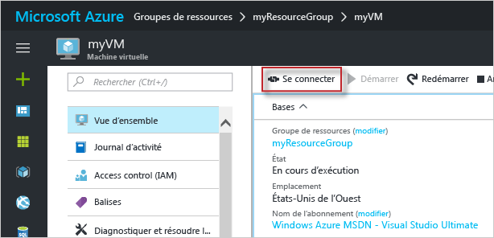

# <a name="create-a-linux-virtual-machine-with-the-azure-portal"></a>Créer un groupe de machines virtuelles identiques Linux avec le portail Azure

Les machines virtuelles Azure peuvent être créées via le portail Azure. Cette méthode fournit une interface utilisateur basée sur navigateur pour créer et configurer des machines virtuelles et toutes les ressources liées. Ce démarrage rapide décrit les étapes permettant de créer une machine virtuelle et d’installer un serveur web sur celle-ci.

Si vous n’avez pas d’abonnement Azure, créez un [compte gratuit](https://azure.microsoft.com/free/?WT.mc_id=A261C142F) avant de commencer.

## <a name="create-ssh-key-pair"></a>Créer la paire de clés SSH

Vous avez besoin d’une paire de clés SSH pour effectuer ce démarrage rapide. Si vous disposez déjà d’une paire de clés SSH, vous pouvez ignorer cette étape.

Dans un interpréteur de commandes Bash, exécutez la commande suivante et suivez les instructions qui s’affichent à l’écran. La sortie de la commande inclut le nom du fichier de clé publique. Copiez le contenu du fichier de clé publique dans le Presse-papiers.

```bash
ssh-keygen -t rsa -b 2048
```

## <a name="log-in-to-azure"></a>Connexion à Azure 

Connectez-vous au Portail Azure à l’adresse http://portal.azure.com.

## <a name="create-virtual-machine"></a>Create virtual machine

1. Cliquez sur le bouton **Nouveau** dans le coin supérieur gauche du portail Azure.

2. Sélectionnez **Compute**, puis sélectionnez **Ubuntu Server 16.04 LTS**. 

3. Saisissez les informations de la machine virtuelle. Dans **Type d’authentification**, sélectionnez **Clé publique SSH**. Lorsque vous collez votre clé publique SSH, veillez à supprimer les espaces au début ou à la fin. Lorsque vous avez terminé, cliquez sur **OK**.

    

4. Choisissez la taille de la machine virtuelle. Pour voir plus de tailles, sélectionnez **Afficher tout** ou modifiez le filtre **Type de disque pris en charge**. 

      

5. Sous **Paramètres**, conservez les valeurs par défaut et cliquez sur **OK**.

6. Sur la page Résumé, cliquez sur **OK** pour lancer le déploiement de machine virtuelle.

7. La machine virtuelle sera épinglée au tableau de bord du portail Azure. Une fois le déploiement terminé, le récapitulatif de la machine virtuelle s’ouvre automatiquement.


## <a name="connect-to-virtual-machine"></a>Connexion à la machine virtuelle

Créez une connexion SSH avec la machine virtuelle.

1. Cliquez sur le bouton **Connexion** dans les propriétés de la machine virtuelle. Le bouton de connexion affiche une chaîne de connexion SSH qui peut être utilisée pour se connecter à la machine virtuelle.

     

2. Exécutez la commande suivante pour créer une session SSH. Remplacez la chaîne de connexion avec celle que vous avez copiée à partir du portail Azure.

```bash 
ssh azureuser@40.112.21.50
```

## <a name="install-nginx"></a>Installer NGINX

Utilisez le script Bash suivant pour mettre à jour les sources de package et installer le dernier package NGINX. 

```bash 
#!/bin/bash

# update package source
sudo apt-get -y update

# install NGINX
sudo apt-get -y install nginx
```

Lorsque vous avez terminé, quittez la session SSH et revenez aux propriétés de la machine virtuelle dans le portail Azure.


## <a name="open-port-80-for-web-traffic"></a>Ouvrez le port 80 pour le trafic web 

Un groupe de sécurité réseau (NSG) sécurise les trafics entrant et sortant. Lorsqu’une machine virtuelle est créée à partir du portail Azure, une règle de trafic entrant est créée sur le port 22 pour les connexions SSH. Comme cette machine virtuelle héberge un serveur web, vous devez créer une règle NSG pour le port 80.

1. Sur la machine virtuelle, cliquez sur le nom du **Groupe de ressources**.
2. Sélectionnez le **groupe de sécurité réseau**. Le groupe de sécurité réseau peut être identifié à l’aide de la colonne **Type**. 
3. Dans le menu de gauche, sous Paramètres, cliquez sur **Règles de sécurité entrantes**.
4. Cliquez sur **Ajouter**.
5. Dans **Nom**, tapez **http**. Assurez-vous que l’option **Plage de ports** est définie sur 80 et l’option **Action** sur **Autoriser**. 
6. Cliquez sur **OK**.


## <a name="view-the-nginx-welcome-page"></a>Afficher la page d’accueil NGINX

Avec NGINX installé et le port 80 ouvert pour votre machine virtuelle, le serveur web est désormais accessible à partir d’internet. Ouvrez un navigateur web et saisissez l’adresse IP publique de la machine virtuelle. Cette adresse IP publique se trouve dans les propriétés de la machine virtuelle sur le portail Azure.

 

## <a name="clean-up-resources"></a>Supprimer des ressources

Lorsque vous n’en avez plus besoin, supprimez le groupe de ressources, la machine virtuelle et toutes les ressources associées. Pour ce faire, sélectionnez le groupe de ressources de la machine virtuelle, puis cliquez sur **Supprimer**.

## <a name="next-steps"></a>Étapes suivantes

Dans ce guide de démarrage rapide, vous avez déployé une machine virtuelle simple ainsi qu’une règle de groupe de sécurité réseau, et installé un serveur web. Pour en savoir plus sur les machines virtuelles Azure, suivez le didacticiel pour les machines virtuelles Linux.

> [!div class="nextstepaction"]
> [Didacticiels sur les machines virtuelles Azure Linux](./tutorial-manage-vm.md)

