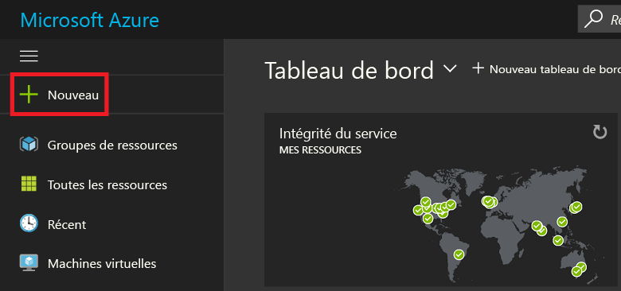
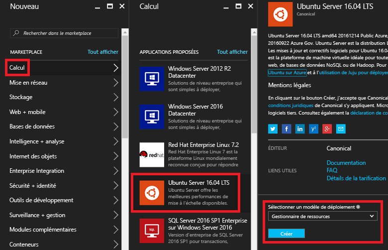
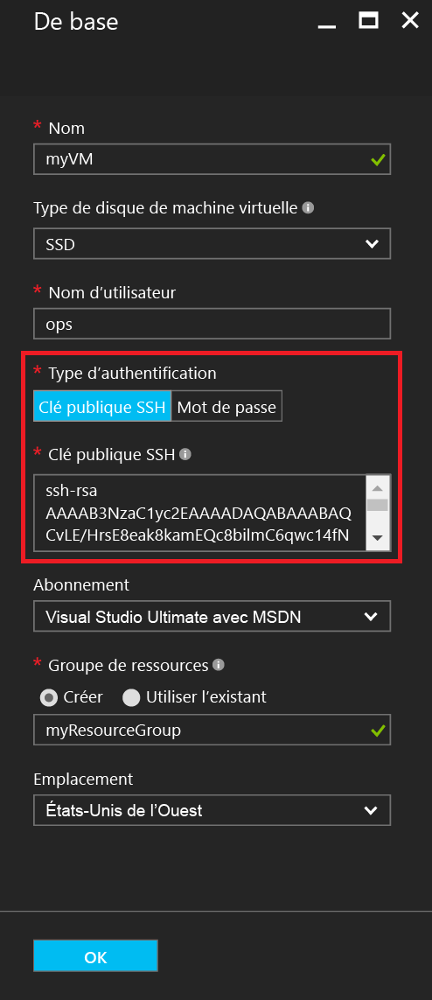
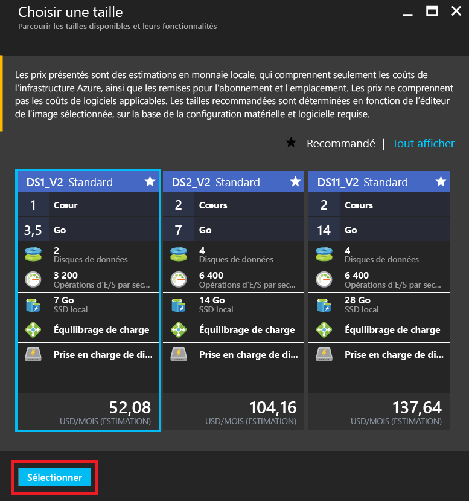
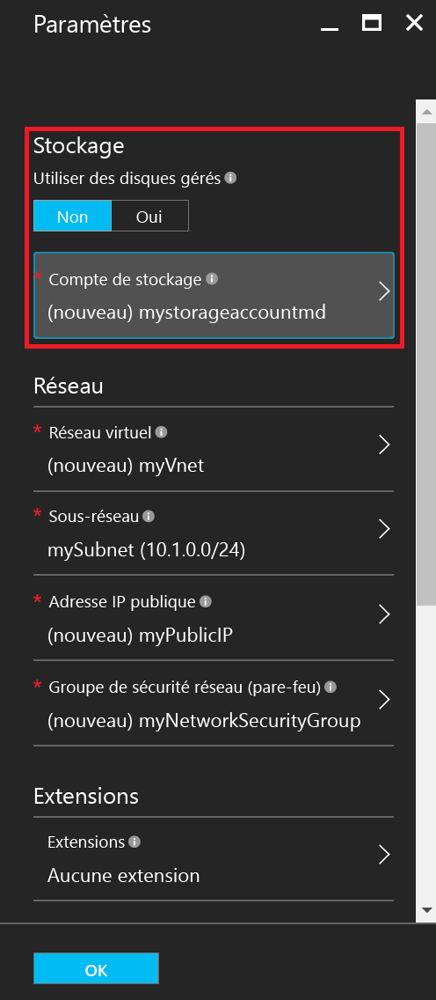
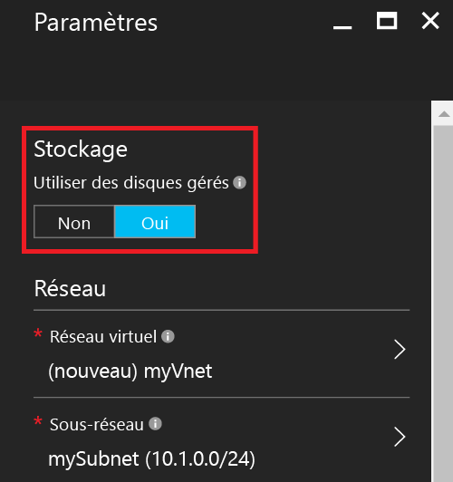
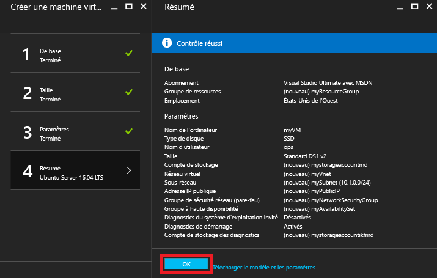
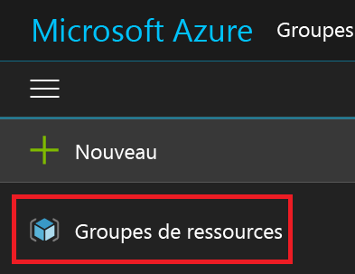
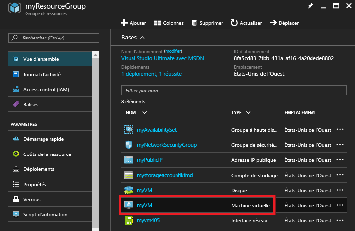
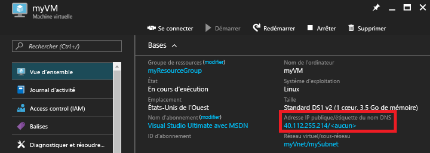

# <a name="create-a-linux-vm-on-azure-using-the-portal"></a>Création d'une machine virtuelle Linux sur Azure à l’aide du portail
Cet article explique comment utiliser le [portail Azure](https://portal.azure.com/) pour créer une machine virtuelle Linux.

Les conditions requises sont :

* [un compte Azure](https://azure.microsoft.com/pricing/free-trial/)
* [des fichiers de clés SSH publiques et privées](virtual-machines-linux-mac-create-ssh-keys.md?toc=%2fazure%2fvirtual-machines%2flinux%2ftoc.json)

## <a name="sign-in"></a>de connexion
Connectez-vous au portail Azure avec votre identité de compte Azure. Cliquez sur **+ Nouveau** dans le coin supérieur gauche :



## <a name="choose-vm"></a>Choisir une machine virtuelle
Cliquez sur **Compute** dans le panneau **Place de marché**, puis sur **Ubuntu Server 16.04 LTS** dans la liste d’images **Applications à la une**.  Vérifiez en bas de l’écran que le modèle de déploiement est `Resource Manager` , puis cliquez sur **Créer**.



## <a name="enter-vm-options"></a>Définir les options de la machine virtuelle
Dans la page **Fonctions de base** , entrez :

* un nom pour la machine virtuelle ;
* le type de disque de machine virtuelle (SSD par défaut, ou disque dur) ;
* un nom d’utilisateur pour l’administrateur ;
* définissez **Type d’authentification** sur **Clé publique SSH** ;
* votre clé publique SSH sous forme de chaîne (à partir de votre répertoire `~/.ssh/`) ;
* le nom d’un groupe de ressources, ou sélectionnez un groupe de ressources existant.

Ensuite, cliquez sur **OK** pour continuer. Le panneau devrait ressembler à la capture d’écran suivante :



## <a name="choose-vm-size"></a>Choisir la taille de la machine virtuelle
Choisissez une taille de machine virtuelle. Dans les exemples suivants, nous choisissons l’option **DS1_V2 Standard**, qui installe Ubuntu sur un disque SSD Premium. Le **S** qui apparaît dans le nom de l’option dénote la prise en charge des disques SSD. Cliquez sur **Sélectionner** pour configurer les paramètres.



## <a name="storage-and-network"></a>Stockage et réseau
Dans le panneau **Paramètres**, vous pouvez choisir d’utiliser des disques gérés Azure pour votre machine virtuelle. Actuellement, des disques non gérés sont utilisés par défaut. Les disques gérés Azure sont gérés par la plateforme Azure et ne nécessitent pas de préparation ou d’emplacement pour les stocker. Pour plus d’informations sur les disques gérés, consultez [Vue d’ensemble d’Azure Managed Disks](../storage/storage-managed-disks-overview.md). Pour les disques non gérés, vous devez créer ou sélectionner un compte de stockage pour vos disques durs virtuels :



Si vous choisissez d’utiliser des disques gérés Azure, il n’y a aucune autre option de stockage à configurer, comme illustré dans l’exemple suivant :



Laissez le reste des paramètres de mise en réseau définis sur leur valeur par défaut.

## <a name="confirm-vm-settings-and-launch"></a>Vérifier les paramètres de la machine virtuelle et la démarrer
Confirmez les paramètres pour votre nouvelle machine virtuelle Ubuntu, puis cliquez sur **OK**.



## <a name="select-the-vm-resource"></a>Sélectionner la ressource de la machine virtuelle
Ouvrez la page d’accueil du portail, puis sélectionnez **Groupes de ressources** dans le menu situé dans le coin supérieur gauche. Si nécessaire, cliquez sur les trois barres en haut du menu pour développer la liste, comme illustré ici :



Sélectionnez votre groupe de ressources, puis cliquez sur votre nouvelle machine virtuelle :



## <a name="find-the-public-ip"></a>Rechercher l’adresse IP publique
Consultez l’**adresse IP publique** affectée à votre machine virtuelle :



## <a name="ssh-to-the-vm"></a>Utiliser une clé SSH sur la machine virtuelle
Connectez-vous avec SSH à l’adresse IP publique à l’aide de votre clé publique SSH.  À partir d’une station de travail Mac ou Linux, vous pouvez vous connecter avec SSH directement à partir du terminal. Si vous utilisez une station de travail Windows, vous devez utiliser PuTTY, MobaXTerm ou Cygwin pour vous connecter avec SSH à Linux.  Si vous ne l’avez pas encore fait, voici un document qui prépare votre station de travail Windows pour la connexion avec SSH à Linux.

[Comment utiliser les clés SSH avec Windows sur Azure](virtual-machines-linux-ssh-from-windows.md?toc=%2fazure%2fvirtual-machines%2flinux%2ftoc.json)

```
ssh -i ~/.ssh/azure_id_rsa ops@40.112.255.214
```

## <a name="next-steps"></a>Étapes suivantes
Vous venez de créer rapidement une machine virtuelle Linux à des fins de test ou de démonstration. Pour créer une machine virtuelle Linux personnalisée en fonction de votre infrastructure, vous pouvez lire un des articles ci-dessous.

* [Création d'une machine virtuelle Linux sur Azure à l’aide de modèles](virtual-machines-linux-cli-deploy-templates.md?toc=%2fazure%2fvirtual-machines%2flinux%2ftoc.json)
* [Création d’une machine virtuelle Linux sécurisée par SSH dans Azure à l’aide de modèles](virtual-machines-linux-create-ssh-secured-vm-from-template.md?toc=%2fazure%2fvirtual-machines%2flinux%2ftoc.json)
* [Création d'une machine virtuelle Linux à l’aide de l'interface de ligne de commande Azure (CLI)](virtual-machines-linux-create-cli-complete.md?toc=%2fazure%2fvirtual-machines%2flinux%2ftoc.json)


<!--HONumber=Feb17_HO3-->


