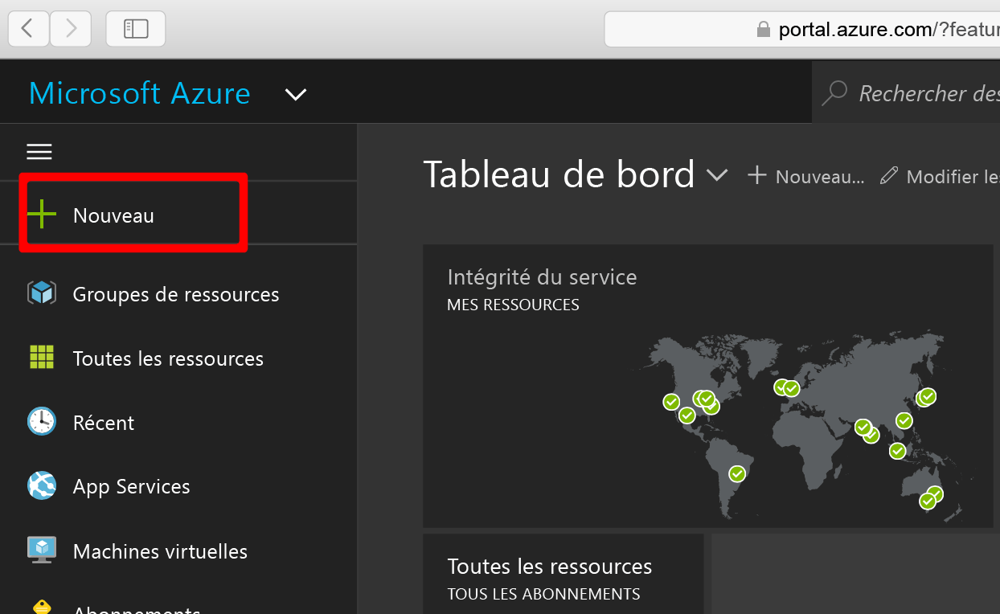
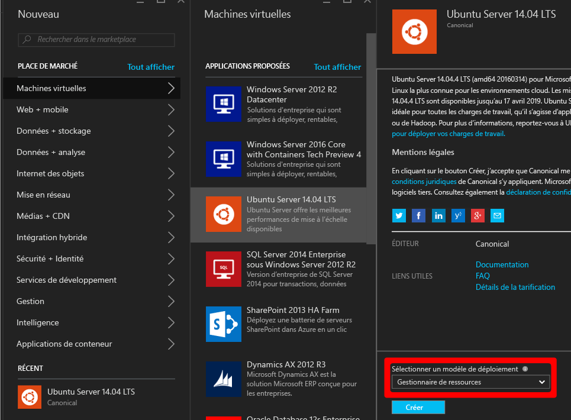
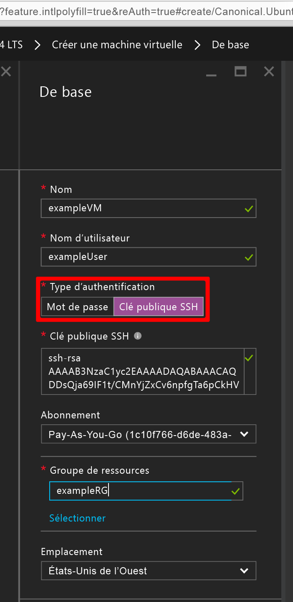
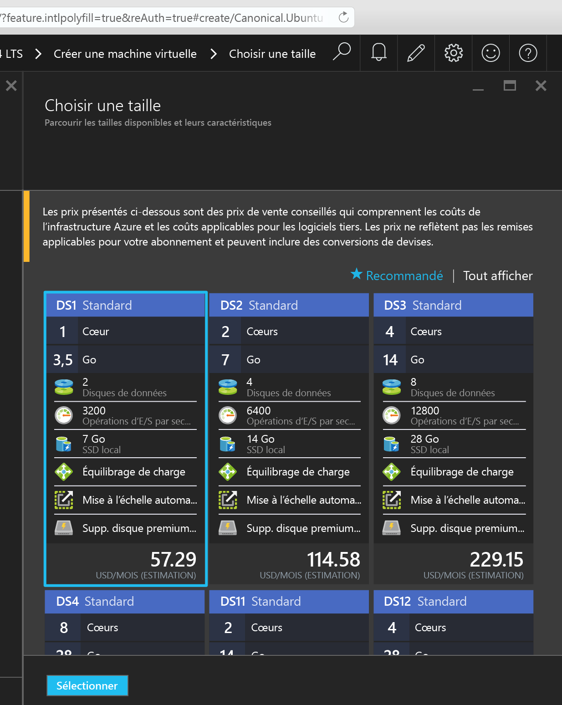
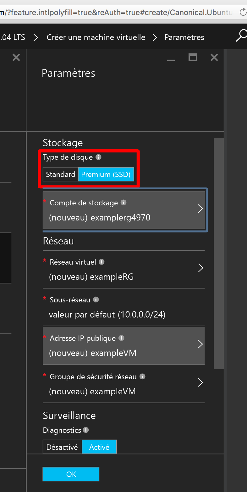
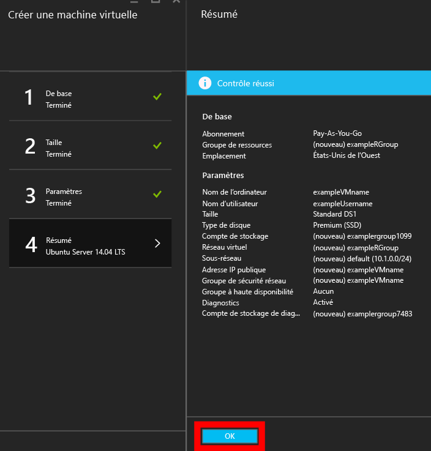
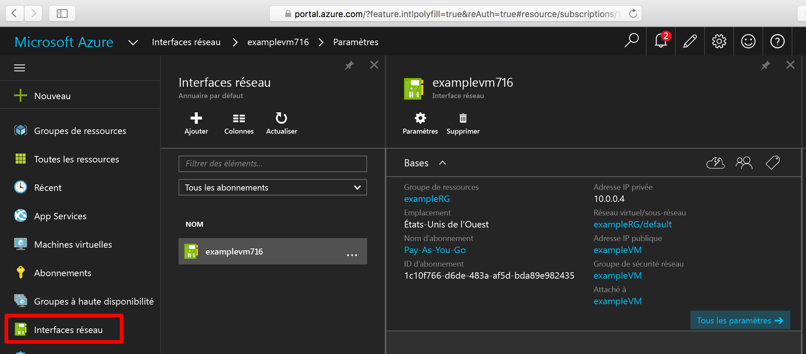
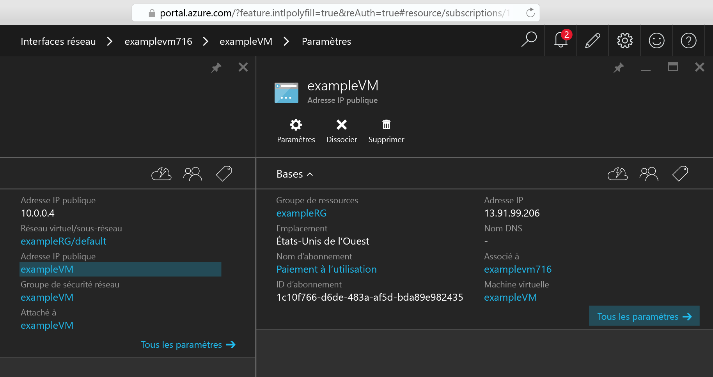

<properties
    pageTitle="Création d’une machine virtuelle Linux à l’aide du portail Azure | Microsoft Azure"
    description="Création d’une machine virtuelle Linux à l’aide du portail Azure."
    services="virtual-machines-linux"
    documentationCenter=""
    authors="vlivech"
    manager="timlt"
    editor=""
    tags="azure-resource-manager"
/>

<tags
    ms.service="virtual-machines-linux"
    ms.workload="infrastructure-services"
    ms.tgt_pltfrm="vm-linux"
    ms.devlang="na"
    ms.topic="hero-article"
    ms.date="04/29/2016"
    ms.author="v-livech"
/>

# Création d'une machine virtuelle Linux sur Azure à l’aide du portail

Cet article explique comment utiliser le [portail Azure](https://portal.azure.com/) pour créer rapidement une machine virtuelle Linux. Les seules conditions requises sont [un compte Azure](https://azure.microsoft.com/pricing/free-trial/) et des [fichiers de clés publiques et privées SSH](virtual-machines-linux-mac-create-ssh-keys.md).


1. Connectez-vous au portail Azure avec les informations d’identification de votre compte Azure, puis cliquez sur **+ nouveau** dans l’angle supérieur gauche :

    

2. Cliquez sur **Machines virtuelles** dans le **Marketplace**, puis sur **Ubuntu Server 14.04 LTS** dans la liste d’images **Applications proposées**. Vérifiez en bas de l’écran que le modèle de déploiement est `Resource Manager`, puis cliquez sur **Créer**.

    

3. Dans la page **Fonctions de base** entrez :
    - un nom pour la machine virtuelle ;
    - un nom d’utilisateur pour l’administrateur ;
    - la définition du Type d’authentification sur **Clé publique SSH** ;
    - votre clé publique SSH sous forme de chaîne (par défaut, à partir de votre répertoire `~/.ssh/`) ;
    - un nom de groupe de ressources (pour créer un groupe de déploiement), ou sélectionnez un groupe existant.

    Puis cliquez sur **OK** pour continuer et choisissez la taille de la machine virtuelle. Le résultat suivant doit s’afficher :

    

4. Choisissez la taille **DS1**, qui installe Ubuntu sur un disque SSD Premium, puis cliquez sur **Sélectionner** pour configurer les paramètres.

    

5. Dans les **Paramètres**, conservez les valeurs par défaut pour les valeurs pour le stockage et le réseau, puis cliquez sur **OK** pour afficher le résumé. Notez que le type de disque a été défini sur Premium SSD en choisissant DS1, le **S** signifie SSD.

    

6. Confirmez les paramètres pour votre nouvelle machine virtuelle Ubuntu, puis cliquez sur **OK**.

    

7. Ouvrez le tableau de bord du portail et choisissez votre carte réseau dans **Interfaces réseau**.

    

8. Ouvrez le menu Adresses IP publiques sous les paramètres de carte réseau

    

9. Connectez-vous avec SSH à l’adresse IP publique à l’aide de votre clé publique SSH.

```
ssh -i ~/.ssh/azure_id_rsa ubuntu@13.91.99.206
```

## Étapes suivantes

Vous venez de créer rapidement une machine virtuelle Linux à des fins de test ou de démonstration. Pour créer une machine virtuelle Linux personnalisée pour votre infrastructure, vous pouvez consulter un des articles ci-dessous.

- [Création d'une machine virtuelle Linux sur Azure à l’aide de modèles](virtual-machines-linux-cli-deploy-templates.md)
- [Création d'une machine virtuelle Linux sécurisée par SSH dans Azure à l’aide de modèles](virtual-machines-linux-create-ssh-secured-vm-from-template.md)
- [Création d'une machine virtuelle Linux à l’aide de l'interface de ligne de commande Azure (CLI)](virtual-machines-linux-create-cli-complete.md)

Ces articles vous aideront à démarrer la création d'une infrastructure Azure ainsi que n’importe quelle quantité de déploiements d’infrastructure open source et propriétaires, de configuration et d’outils d’orchestration.

<!---HONumber=AcomDC_0504_2016-->