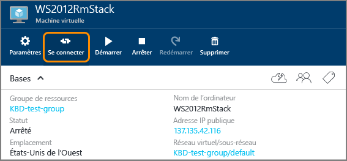

<properties
	pageTitle="Connexion à une machine virtuelle Windows Server | Microsoft Azure"
	description="Découvrez comment vous connecter à une machine virtuelle Windows Server à l'aide du portail Azure et du modèle de déploiement Resource Manager."
	services="virtual-machines-windows"
	documentationCenter=""
	authors="cynthn"
	manager="timlt"
	editor="tysonn"
	tags="azure-resource-manager"/>

<tags
	ms.service="virtual-machines-windows"
	ms.workload="infrastructure-services"
	ms.tgt_pltfrm="vm-windows"
	ms.devlang="na"
	ms.topic="get-started-article"
	ms.date="04/14/2016"
	ms.author="cynthn"/>

# Connexion à une machine virtuelle Azure exécutant Windows Server 

Vous utilisez le bouton **Connecter** dans le portail Azure pour démarrer une session Bureau à distance (RDP). Tout d’abord, connectez-vous à la machine virtuelle, puis ouvrez une session.

## Connectez-vous à la machine virtuelle.

1. Si ce n’est pas déjà fait, connectez-vous au [portail Azure](https://portal.azure.com/).

2.	Dans le menu hub, cliquez sur **Machines virtuelles**.

3.	Sélectionnez la machine virtuelle dans la liste.

4. Dans le panneau de la machine virtuelle, cliquez sur **Se connecter**.

	

## Connexion à la machine virtuelle

[AZURE.INCLUDE [virtual-machines-log-on-win-server](../../includes/virtual-machines-log-on-win-server.md)]

## Étapes suivantes

En cas de problème de connexion, consultez [Résolution des problèmes de connexion Bureau à distance avec une machine virtuelle Azure Windows](virtual-machines-windows-troubleshoot-rdp-connection.md). Cet article vous guide tout au long des opérations de diagnostic et de résolution des problèmes courants.

<!---HONumber=AcomDC_0420_2016-->