<properties
	pageTitle="Installer IIS sur votre première machine virtuelle Windows | Microsoft Azure"
	description="Testez votre première machine virtuelle Windows en installant IIS et en ouvrant le port 80 à l’aide du Portail Azure."
	keywords=""
	services="virtual-machines-windows"
	documentationCenter=""
	authors="cynthn"
	manager="timlt"
	editor=""
	tags="azure-resource-manager"/>
<tags
	ms.service="virtual-machines-windows"
	ms.workload="infrastructure-services"
	ms.tgt_pltfrm="vm-windows"
	ms.devlang="na"
	ms.topic="article"
	ms.date="09/06/2016"
	ms.author="cynthn"/>

# Tester l’installation d’un rôle sur votre machine virtuelle Windows
	
Une fois que votre première machine virtuelle est opérationnelle, vous pouvez passer à l’installation des logiciels et services. Pour ce didacticiel, nous allons utiliser le Gestionnaire de serveur sur la machine virtuelle Windows Server pour installer IIS. Ensuite, nous allons créer un groupe de sécurité réseau (NSG) à l’aide du Portail Azure pour ouvrir le port 80 au trafic IIS.

Si vous n’avez pas encore créé votre première machine virtuelle, vous devez revenir à [Créer votre première machine virtuelle Windows dans le Portail Azure](virtual-machines-windows-hero-tutorial.md) avant de poursuivre ce didacticiel.

## Vérifier que la machine virtuelle est en cours d’exécution

1. Ouvrez le [portail Azure](https://portal.azure.com).
2. Dans le menu hub, cliquez sur **Machines virtuelles**. Sélectionnez la machine virtuelle dans la liste.
3. Si l’état est **Arrêté (Libéré)**, cliquez sur le bouton **Démarrer** sur le panneau **Bases** de la machine virtuelle. Si l’état est **En cours d’exécution**, vous pouvez passer à l’étape suivante.

## Se connecter à la machine virtuelle et ouvrir une session

1.	Dans le menu hub, cliquez sur **Machines virtuelles**. Sélectionnez la machine virtuelle dans la liste.

3. Dans le panneau de la machine virtuelle, cliquez sur **Se connecter**. Cette opération crée et télécharge un fichier .rdp (Remote Desktop Protocol) qui s’apparente à un raccourci de connexion à votre ordinateur. Si vous le souhaitez, vous pouvez enregistrer le fichier sur votre bureau pour y accéder facilement. **Ouvrez** ce fichier pour vous connecter à votre machine virtuelle.

	

4. Un message vous avertit que le fichier .rdp provient d’un éditeur inconnu. C’est normal. Dans la fenêtre Bureau à distance, cliquez sur **Connecter** pour continuer.

	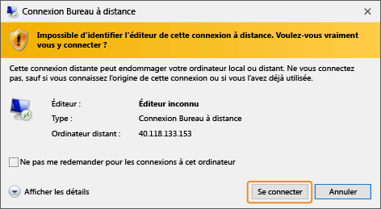

5. Dans la fenêtre Sécurité de Windows, tapez le nom d’utilisateur et le mot de passe du compte local que vous avez créé lorsque vous avez créé la machine virtuelle. Le nom d’utilisateur est entré en tant que *vmname*&#92;*username*. Cliquez ensuite sur **OK**.

	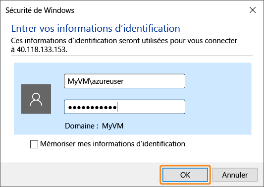
 	
6.	Vous êtes alors averti que le certificat ne peut pas être vérifié. C’est normal. Cliquez sur **Oui** pour vérifier l’identité de la machine virtuelle et terminer la connexion.

	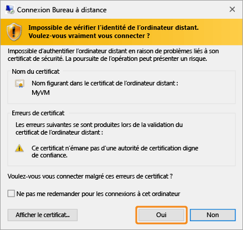

En cas de problème de connexion, consultez [Résolution des problèmes de connexion Bureau à distance avec une machine virtuelle Azure Windows](virtual-machines-windows-troubleshoot-rdp-connection.md).

## Installation d’IIS sur votre machine virtuelle

Maintenant que vous êtes connecté à la machine virtuelle, nous allons installer un rôle de serveur afin d’optimiser votre expérience.

1. Si ce n’est pas déjà fait, ouvrez le **Gestionnaire de serveur**. Cliquez sur le menu **Démarrer**, puis sur **Gestionnaire de serveur**.
2. Dans le volet gauche du **Gestionnaire de serveur**, sélectionnez **Serveur local**.
3. Dans le menu, sélectionnez **Gérer** > **Ajouter des rôles et des fonctionnalités**.
4. Dans l’assistant Ajout de rôles et de fonctionnalités, sur la page **Type d’installation** choisissez **Installation basée sur un rôle ou une fonctionnalité**, puis cliquez sur **Suivant**.

	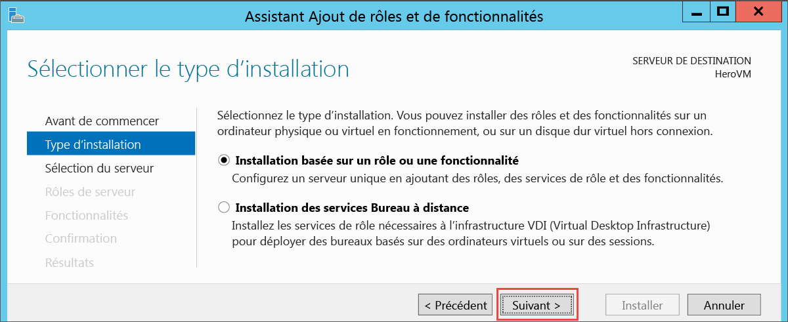

5. Sélectionnez la machine virtuelle dans le pool de serveurs, puis cliquez sur **Suivant**.
6. Sur la page **Rôles de serveur**, cliquez sur **Serveur Web (IIS)**.

	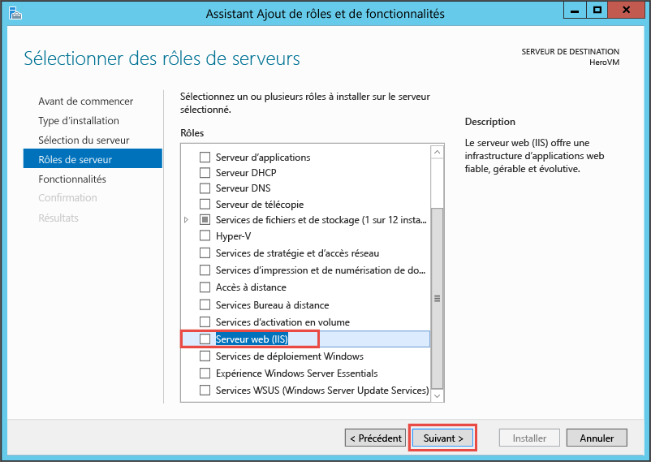

7. Dans la fenêtre contextuelle concernant l’ajout des fonctionnalités requises pour IIS, assurez-vous que l’option **Inclure les outils de gestion** est sélectionnée, puis cliquez sur **Ajouter des fonctionnalités**. Lorsque la fenêtre contextuelle se ferme, cliquez sur **Suivant** dans l’assistant.

	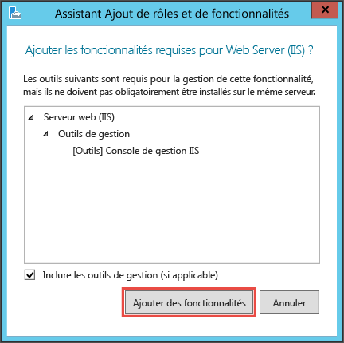

8. Sur la page des fonctionnalités, cliquez sur **Suivant**.
9. Sur la page **Rôle Web Server (IIS)**, cliquez sur **Suivant**.
10. Sur la page **Services de rôle**, cliquez sur **Suivant**.
11. Sur la page **Confirmation**, cliquez sur **Installer**.
12. Une fois l’installation terminée, cliquez sur **Fermer** dans l’assistant.

## Ouverture du port 80 

Pour que votre machine virtuelle accepte le trafic entrant sur le port 80, vous devez ajouter une règle de trafic entrant pour le groupe de sécurité réseau.

1. Ouvrez le [portail Azure](https://portal.azure.com).
2. Dans **Machines virtuelles**, sélectionnez la machine virtuelle que vous avez créée.
3. Dans les paramètres des machines virtuelles, choisissez **Interfaces réseau**, puis sélectionnez l’interface réseau existante.

	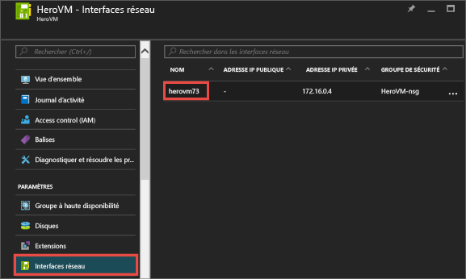

4. Dans les **bases** de l’interface réseau, cliquez sur le **groupe de sécurité réseau**.

	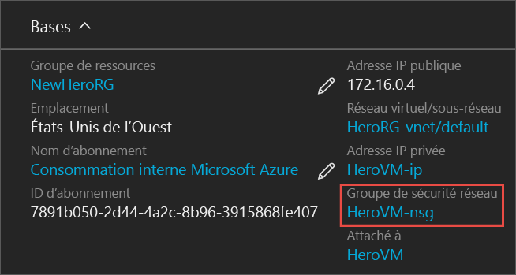

5. Dans le panneau **Bases** du groupe de sécurité réseau, une règle de trafic entrant doit exister par défaut pour **default-allow-rdp**. Elle vous permet de vous connecter à la machine virtuelle. Pour autoriser le trafic IIS, vous allez ajouter une autre règle de trafic entrant. Cliquez sur **Règle de sécurité de trafic entrant**.

	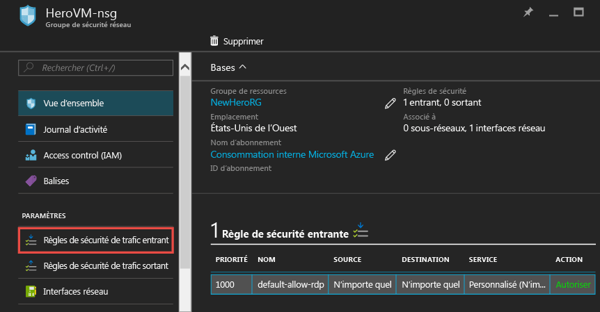

6. Dans **Règles de sécurité de trafic entrant**, cliquez sur **Ajouter**.

	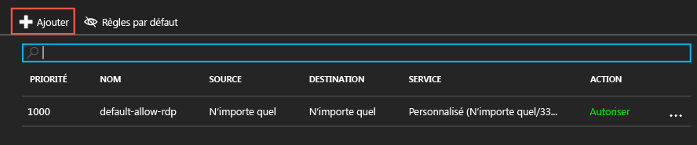

7. Dans **Règles de sécurité de trafic entrant**, cliquez sur **Ajouter**. Entrez **80** dans la plage de ports et vérifiez que l’option **Autoriser** est sélectionnée. Une fois ces opérations effectuées, cliquez sur **OK**.

	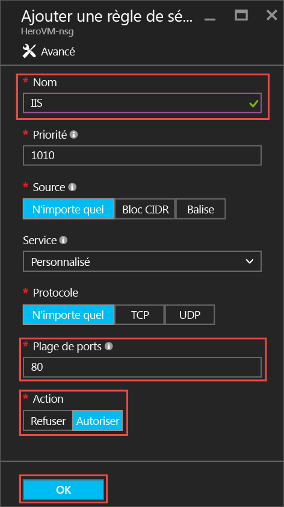
 
Pour plus d’informations sur les groupes de sécurité réseau et sur les règles de trafic entrant et sortant, voir [Autoriser l’accès externe à votre machine virtuelle à l’aide du portail Azure](virtual-machines-windows-nsg-quickstart-portal.md).
 
## Connexion au site Web IIS par défaut

1. Dans le portail Azure, cliquez sur **Machines virtuelles**, puis sélectionnez votre machine virtuelle.
2. Dans le panneau **Bases**, copiez votre **adresse IP publique**.

	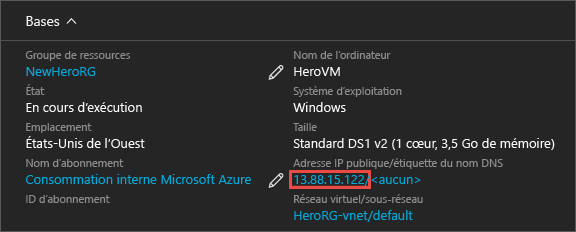

2. Ouvrez un navigateur et, dans la barre d’adresse, tapez l’adresse IP publique comme suit : http://<adresseIPpublique>, puis appuyez sur **Entrée** pour accéder à cette adresse.
3. Votre navigateur ouvre la page web IIS par défaut. Voici ce à quoi elle ressemble :

	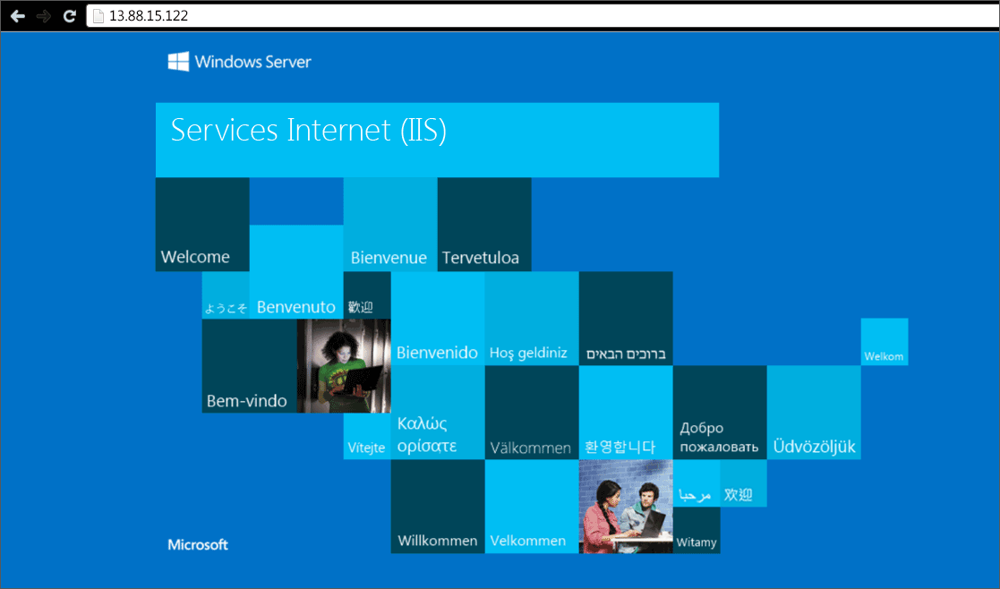

    

## Étapes suivantes

- Vous pouvez également tester [l’association d’un disque de données](virtual-machines-windows-attach-disk-portal.md) à votre machine virtuelle. Les disques de données fournissent plus de stockage pour votre machine virtuelle.

<!---HONumber=AcomDC_0914_2016-->