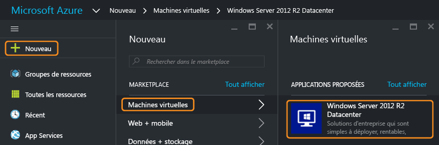
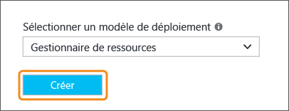
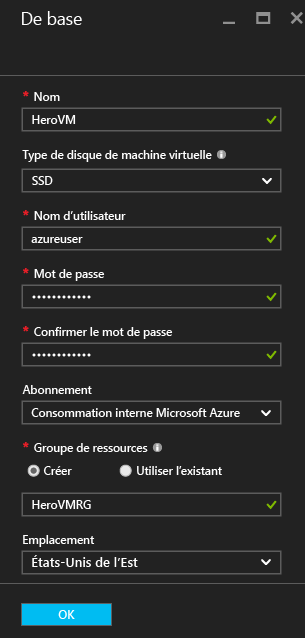
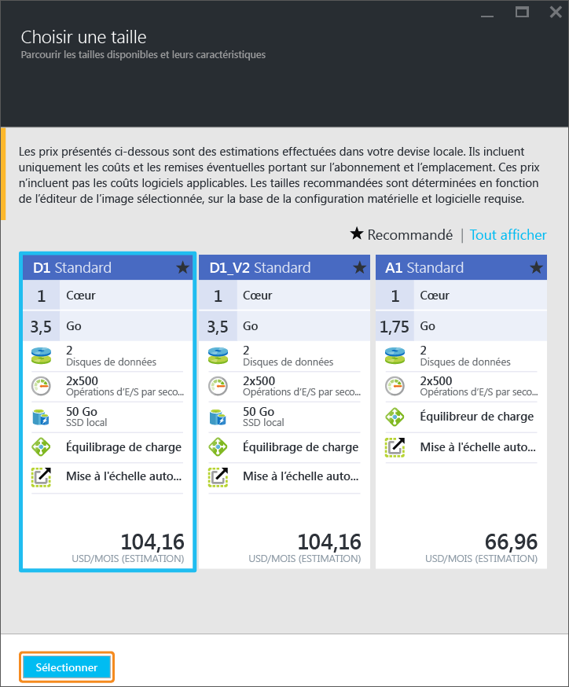
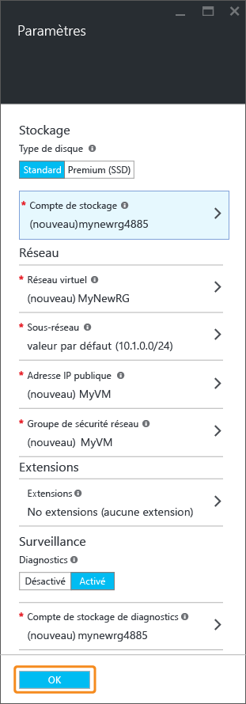
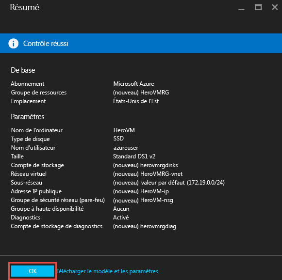
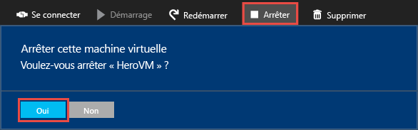

# Créer votre première machine virtuelle Windows dans le portail Azure
Ce didacticiel vous montre combien il est facile de créer une machine virtuelle Windows en quelques minutes à l’aide du portail Azure.  

Si vous n’avez pas d’abonnement Azure, créez un [compte gratuit](https://azure.microsoft.com/free/) avant de commencer.

## Choisir l’image de machine virtuelle à partir de Marketplace
Nous allons utiliser une image Windows Server 2012 R2 Datacenter comme exemple, mais il s’agit simplement d’un des nombreux types d’images proposés par Azure. Les images disponibles dépendent de votre abonnement. Par exemple, certaines images de bureau sont disponibles pour les [abonnés MSDN](https://azure.microsoft.com/pricing/member-offers/msdn-benefits-details/?WT.mc_id=A261C142F).

1. Connectez-vous au [portail Azure](https://portal.azure.com).
2. Dans le menu Hub, cliquez sur **Nouveau** > **Calculer** > **Windows Server 2012 R2 Datacenter**.
   
    
3. Dans le panneau **Windows Server 2012 R2 Datacenter**, dans **Sélectionner un modèle de déploiement**, vérifiez que **Resource Manager** est sélectionné. Cliquez sur **Create**.
   
    

## Créer la machine virtuelle Windows
Après avoir sélectionné l’image, vous pouvez utiliser les paramètres par défaut pour créer rapidement la machine virtuelle.

1. Dans le panneau **De base**, entrez un **nom** pour la machine virtuelle. Le nom doit comporter 1 à 15 caractères et il ne peut pas contenir de caractères spéciaux.
2. Entrez un **Nom d’utilisateur** et un **Mot de passe** fort qui serviront à créer un compte local sur la machine virtuelle. Le compte local est utilisé pour se connecter à la machine virtuelle et la gérer. 
   
    Le mot de passe doit compter 8 à 123 caractères et répondre à trois des quatre conditions suivantes : un caractère minuscule, un caractère majuscule, un chiffre et un caractère spécial. En savoir plus sur les [conditions requises pour les noms d’utilisateur et les mots de passe](virtual-machines-windows-faq.md#what-are-the-username-requirements-when-creating-a-vm).
3. Sélectionnez un [groupe de ressources](../azure-resource-manager/resource-group-overview.md#resource-groups) existant ou tapez le nom d’un nouveau groupe. Indiquez un **emplacement** de centre de données Azure, comme **États-Unis de l’Ouest**. 
4. Lorsque vous avez terminé, cliquez sur **OK** pour passer à la section suivante. 
   
    
5. Choisissez une [taille](virtual-machines-windows-sizes.md?toc=%2fazure%2fvirtual-machines%2fwindows%2ftoc.json)de machine virtuelle, puis cliquez sur **Sélectionner** pour continuer. 
   
    
6. Dans le panneau **Paramètres** , vous pouvez modifier les options de stockage et de réseau. Pour ce didacticiel, acceptez les paramètres par défaut. Si vous avez sélectionné une taille de machine virtuelle qui le prend en charge, vous pouvez essayer Azure Premium Storage en sélectionnant **Premium (SSD)** sous **Type de disque**. Une fois les modifications terminées, cliquez sur **OK**.
   
    
7. Cliquez sur **Résumé** pour passer en revue vos options. Lorsque le message **Validation réussie** apparaît, cliquez sur **OK**.
   
    
8. Pendant qu’Azure crée la machine virtuelle, vous pouvez suivre la progression de cette opération dans le menu Hub, sous **Machines virtuelles** . 

## Se connecter à la machine virtuelle et ouvrir une session
1. Dans le menu Hub, cliquez sur **Machines virtuelles**.
2. Sélectionnez la machine virtuelle dans la liste.
3. Dans le panneau de la machine virtuelle, cliquez sur **Se connecter**. Cette opération crée et télécharge un fichier .rdp (Remote Desktop Protocol) qui s’apparente à un raccourci de connexion à votre ordinateur. Si vous le souhaitez, vous pouvez enregistrer le fichier sur votre bureau pour y accéder facilement. **Ouvrez** ce fichier pour vous connecter à votre machine virtuelle.
   
    
4. Un message vous avertit que le fichier .rdp provient d’un éditeur inconnu. C’est normal. Dans la fenêtre Bureau à distance, cliquez sur **Connecter** pour continuer.
   
    
5. Dans la fenêtre Sécurité de Windows, tapez le nom d’utilisateur et le mot de passe du compte local que vous avez créé lorsque vous avez créé la machine virtuelle. Le nom d’utilisateur est entré en tant que *vmname*&#92;*username*. Cliquez ensuite sur **OK**.
   
    
6. Vous êtes alors averti que le certificat ne peut pas être vérifié. C’est normal. Cliquez sur **Oui** pour vérifier l’identité de la machine virtuelle et terminer la connexion.
   
   

En cas de problème de connexion, consultez [Résolution des problèmes de connexion Bureau à distance avec une machine virtuelle Azure Windows](virtual-machines-windows-troubleshoot-rdp-connection.md?toc=%2fazure%2fvirtual-machines%2fwindows%2ftoc.json).

Vous pouvez désormais utiliser la machine virtuelle comme n’importe quel autre serveur.

## Facultatif : Arrêter la machine virtuelle
Il est judicieux d’arrêter la machine virtuelle pour éviter les frais lorsque vous ne l’utilisez pas. Cliquez simplement sur **Arrêter**, puis sur **Oui**.

Cliquez sur le bouton **Démarrer** pour redémarrer la machine virtuelle lorsque vous êtes prêt à l’utiliser à nouveau.

## Étapes suivantes
* Vous pouvez tester votre nouvelle machine virtuelle en [installant IIS](virtual-machines-windows-hero-role.md?toc=%2fazure%2fvirtual-machines%2fwindows%2ftoc.json). Ce didacticiel montre également comment ouvrir le port 80 pour le trafic web entrant à l’aide d’un groupe de sécurité réseau (NSG). 
* Vous pouvez également [créer une machine virtuelle Windows à l’aide de Powershell](virtual-machines-windows-ps-create.md?toc=%2fazure%2fvirtual-machines%2fwindows%2ftoc.json) ou [créer une machine virtuelle Linux](virtual-machines-linux-quick-create-cli.md?toc=%2fazure%2fvirtual-machines%2flinux%2ftoc.json) à l’aide de la CLI Azure.
* Si vous souhaitez automatiser les déploiements, consultez [Création d’une machine virtuelle Windows avec un modèle du Gestionnaire de ressources](virtual-machines-windows-ps-template.md?toc=%2fazure%2fvirtual-machines%2fwindows%2ftoc.json).

<!--HONumber=Nov16_HO3-->

