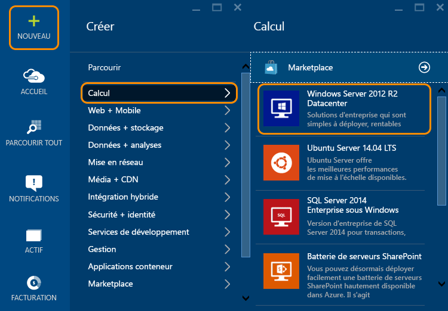
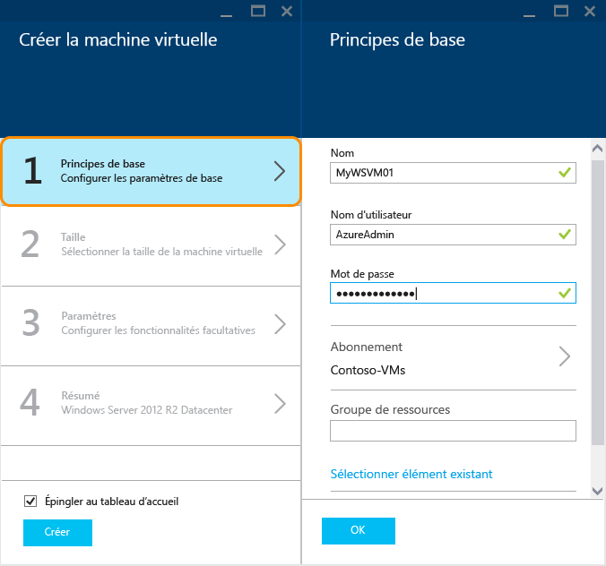
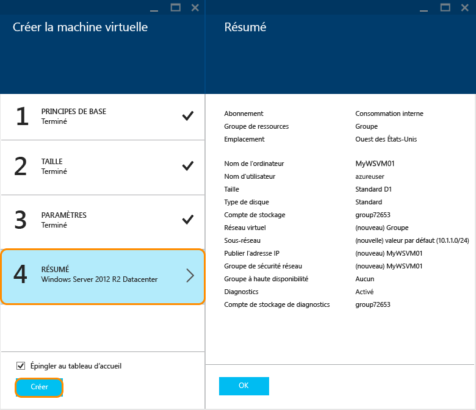

<properties
	pageTitle="Créer une machine virtuelle Windows dans le Portail Azure | Microsoft Azure"
	description="Découvrez comment créer une machine virtuelle Windows à l’aide du Portail Azure."
	keywords="machine virtuelle Windows,créer une machine virtuelle,ordinateur virtuel,configuration d’une machine virtuelle"
	services="virtual-machines-windows"
	documentationCenter=""
	authors="cynthn"
	manager="timlt"
	editor=""
	tags="azure-resource-manager"/>
<tags
	ms.service="virtual-machines-windows"
	ms.workload="infrastructure-services"
	ms.tgt_pltfrm="vm-windows"
	ms.devlang="na"
	ms.topic="hero-article"
	ms.date="04/14/2016"
	ms.author="cynthn"/>

# Créer une machine virtuelle Windows dans le portail Azure

Ce didacticiel vous montre combien il est facile de créer une machine virtuelle Windows en quelques minutes à l’aide du Portail Azure. Nous allons utiliser une image Windows Server 2012 R2 Datacenter comme exemple, mais il s’agit simplement d’un des nombreux types d’images proposés par Azure. Les images disponibles dépendent de votre abonnement. Par exemple, les images de bureau sont disponibles pour les [abonnés MSDN](https://azure.microsoft.com/pricing/member-offers/msdn-benefits-details/?WT.mc_id=A261C142F).

Si vous n’avez pas d’abonnement Azure, vous pouvez créer un [compte gratuit](https://azure.microsoft.com/free/) en quelques minutes.

## Vidéo de procédure pas à pas

Voici une [vidéo de procédure pas à pas](https://channel9.msdn.com/Blogs/Azure-Documentation-Shorts/Create-A-Virtual-Machine-Running-Windows-In-The-Azure-Preview-Portal) de ce didacticiel.

## Sélectionner l’image de machine virtuelle Windows 2012 R2 à partir du Marketplace

1. Connectez-vous au [portail Azure](https://portal.azure.com).

2. Dans le menu Hub, cliquez sur **Nouveau** > **Calcul** > **Windows Server 2012 R2 Datacenter**.

	

3. Sur la page **Windows Server 2012 R2 Datacenter**, sous **Sélectionner un modèle de déploiement**, sélectionnez **Gestionnaire de ressources**. Cliquez sur **Create**.

	

## Créer la machine virtuelle Windows

Après avoir sélectionné l’image, vous pouvez utiliser les paramètres par défaut d’Azure pour la majeure partie de la configuration et créer rapidement la machine virtuelle.

1. Dans le panneau **Créer une machine virtuelle**, cliquez sur **Options de base**.

2. Entrez le **Nom** de votre choix pour la machine virtuelle. Ce nom ne doit pas contenir de caractères spéciaux.

3. Entrez un **Nom d’utilisateur** d’administration et un **Mot de passe** fort. Le mot de passe doit compter 8 à 123 caractères et au moins 3 des types de caractères suivants : un caractère minuscule, un caractère majuscule, un chiffre et un caractère spécial. **Vous aurez besoin du nom d’utilisateur et du mot de passe pour vous connecter à la machine virtuelle**.

4. Si vous avez plusieurs abonnements, spécifiez celui associé à la nouvelle machine virtuelle. Sélectionnez un [groupe de ressources](../resource-group-overview/#resource-groups) nouveau ou existant et un **emplacement** de centre de données Azure comme **États-Unis de l’Ouest**.

	

	
2. Cliquez sur **Taille** et sélectionnez une taille de machine virtuelle adaptée à vos besoins. Chaque taille spécifie la quantité de cœurs de calcul, de mémoire et d’autres fonctionnalités, telles que la prise en charge du stockage Premium, ce qui aura un impact sur le prix. Azure recommande automatiquement certaines tailles en fonction de l'image que vous choisissez.

	

	>[AZURE.NOTE] Le stockage Premium est disponible pour les machines virtuelles de la série DS dans certaines régions. Le stockage Premium est l’option de stockage la mieux adaptée aux charges de travail intensives, comme une base de données. Pour plus d’informations, voir l’article [Stockage Premium : stockage hautes performances pour les charges de travail des machines virtuelles Azure](../storage/storage-premium-storage.md).

3. Cliquez sur **Paramètres** pour voir les paramètres de stockage et de mise en réseau pour la nouvelle machine virtuelle. Pour une première machine virtuelle, vous pouvez généralement accepter les paramètres par défaut. Si vous avez sélectionné une taille de machine virtuelle qui le prend en charge, vous pouvez essayer Premium Storage en sélectionnant **Premium (SSD)** sous **Type de disque**.

	

6. Cliquez sur **Synthèse** pour passer en revue vos options de configuration. Lorsque vous avez terminé, cliquez sur **Créer**.

	

8. Pendant qu’Azure crée la machine virtuelle, vous pouvez suivre la progression de cette opération dans le menu Hub sous **Machines virtuelles**.

## Se connecter à la machine virtuelle et ouvrir une session

1. Si ce n’est pas déjà fait, connectez-vous au [portail Azure](https://portal.azure.com/).

2.	Dans le menu Hub, cliquez sur **Machines virtuelles**.

3.	Sélectionnez la machine virtuelle dans la liste.

4. Dans le panneau de la machine virtuelle, cliquez sur **Se connecter**.

	

[AZURE.INCLUDE [virtual-machines-log-on-win-server](../../includes/virtual-machines-log-on-win-server.md)]

En cas de problème de connexion, consultez [Résolution des problèmes de connexion Bureau à distance avec une machine virtuelle Azure Windows](virtual-machines-windows-troubleshoot-rdp-connection.md).

Vous pouvez désormais utiliser la machine virtuelle tout comme vous le feriez avec un serveur.

## Étapes suivantes

* Vous pouvez également [créer une machine virtuelle Windows à l’aide de Powershell](virtual-machines-windows-ps-create.md) ou [créer une machine virtuelle Linux](virtual-machines-linux-quick-create-cli.md) à l’aide de l’interface de ligne de commande Azure.

<!---HONumber=AcomDC_0427_2016-->