# Approvisionnement d’une machine virtuelle SQL Server dans le portail Azure
> [!div class="op_single_selector"]
> * [Portail](virtual-machines-windows-portal-sql-server-provision.md)
> * [PowerShell](virtual-machines-windows-ps-sql-create.md)
> 
> 

Ce didacticiel de bout en bout vous montre comment utiliser le portail Azure pour configurer une machine virtuelle exécutant SQL Server.

La galerie de machines virtuelles Azure inclut différentes images contenant Microsoft SQL Server. Vous pouvez sélectionner l’une des images de machine virtuelle SQL à partir de la galerie et l’approvisionner en quelques clics dans votre environnement Azure.

Ce didacticiel présente les procédures suivantes :

* [Sélectionner une image de machine virtuelle à partir de la galerie](#select-a-sql-vm-image-from-the-gallery)
* [Configurer et créer la machine virtuelle](#configure-the-vm)
* [Ouvrir la machine virtuelle à l’aide du Bureau à distance](#open-the-vm-with-remote-desktop)
* [Se connecter à SQL Server à distance](#connect-to-sql-server-remotely)

## Sélectionner une image de machine virtuelle à partir de la galerie
1. Connectez-vous au [portail Azure](https://portal.azure.com) avec votre compte.
   
   > [!NOTE]
   > Si vous n'avez pas de compte Azure, visitez la page [Version d'évaluation gratuite d'Azure](https://azure.microsoft.com/pricing/free-trial/).
   > 
   > 
2. Dans le portail Azure, cliquez sur **Nouveau**. Le portail ouvre le panneau **Nouveau**. Les ressources de la machine virtuelle SQL Server se trouvent dans le groupe **Machines virtuelles** du Marketplace.
3. Dans le panneau **Nouveau**, cliquez sur **Virtual Machines**.
4. Pour afficher toutes les images disponibles, cliquez sur **See all** (Afficher tout) dans le panneau **Virtual Machines**.
   
    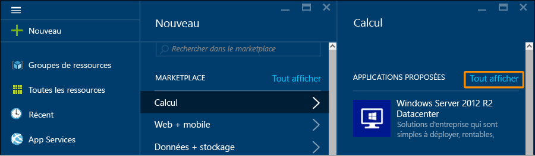
5. Sous **Serveurs de base de données**, cliquez sur **SQL Server**. Vous devrez peut-être faire défiler jusqu’à localiser **Serveurs de base de données**. Passez en revue les modèles SQL Server disponibles.
   
    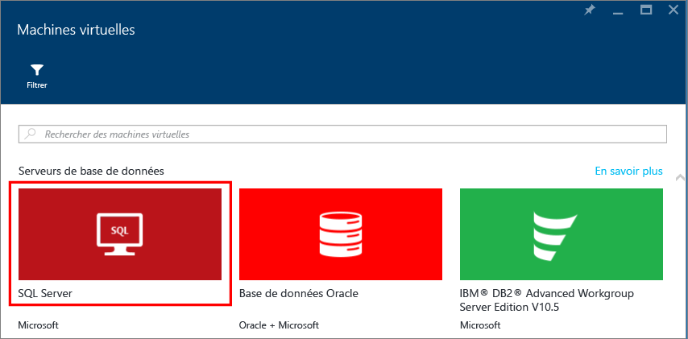
6. Chaque modèle identifie une version de SQL Server et un système d’exploitation. Sélectionnez une de ces images à partir de la liste. Visualisez ensuite le panneau Détails, qui fournit une description de l’image de machine virtuelle.
   
   > [!NOTE]
   > Les images de machines virtuelles SQL incluent les coûts de licence pour SQL Server dans la tarification par minute de la machine virtuelle que vous créez. Vous avez également la possibilité d’utiliser votre solution BYOL (apportez votre propre licence) et de payer seulement pour la machine virtuelle. Ces noms d’images sont préfixés avec {BYOL}. Pour plus d’informations sur cette option, consultez [Premiers pas avec SQL Server sur Azure Virtual Machines](virtual-machines-windows-sql-server-iaas-overview.md).
   > 
   > 
7. Sous **Sélectionner un modèle de déploiement**, vérifiez que **Resource Manager** est sélectionné. Resource Manager est le modèle de déploiement recommandé pour les nouvelles machines virtuelles. Cliquez sur **Create**.
   
    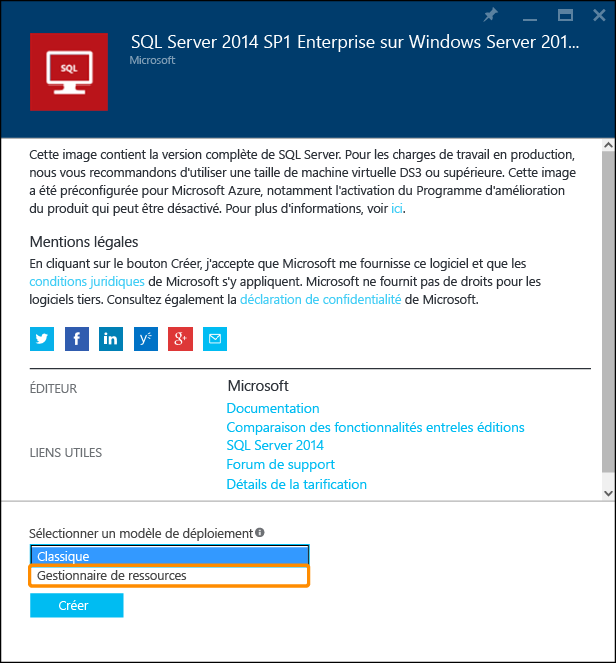

## Configurer la machine virtuelle
Il existe cinq panneaux de configuration d’une machine virtuelle SQL Server.

| Étape | Description |
| --- | --- |
| **Concepts de base** |[Configurer les paramètres de base](#1-configure-basic-settings) |
| **Taille** |[Choisir la taille de machine virtuelle](#2-choose-virtual-machine-size) |
| **Paramètres** |[Configurer des fonctionnalités facultatives](#3-configure-optional-features) |
| **Paramètres de SQL Server** |[Configurer les paramètres du serveur SQL](#4-configure-sql-server-settings) |
| **Résumé** |[Passer en revue le résumé](#5-review-the-summary) |

## 1\. Configurer les paramètres de base
Dans le panneau **De base**, fournissez les informations suivantes :

* Entrez un **nom** de machine virtuelle unique.
* Indiquez uniquement un **Nom d’utilisateur** pour le compte administrateur local de la machine virtuelle. Ce compte est également ajouté au serveur fixe **sysadmin** SQL Server.
* Utilisez un **mot de passe** fort.
* Si vous possédez plusieurs abonnements, vérifiez que l’abonnement est correct pour la nouvelle machine virtuelle.
* Dans la zone **Groupe de ressources**, saisissez un nom pour le groupe de ressources. Sinon, pour utiliser un groupe de ressources existant, cliquez sur **Sélectionner un élément existant**. Un groupe de ressources est une collection de ressources liées dans Azure (machines virtuelles, comptes de stockage, réseaux virtuels, etc.).
  
  > [!NOTE]
  > L’utilisation d’un nouveau groupe de ressources est utile si vous testez ou découvrez les déploiements SQL Server dans Azure. Une fois que vous avez terminé votre test, supprimez le groupe de ressources pour supprimer automatiquement la machine virtuelle et toutes les ressources associées à ce groupe de ressources. Pour plus d’informations sur les groupes de ressources, consultez [Présentation d’Azure Resource Manager](../resource-group-overview.md).
  > 
  > 
* Sélectionnez un **emplacement** pour ce déploiement.
* Cliquez sur **OK** pour enregistrer les paramètres.
  
    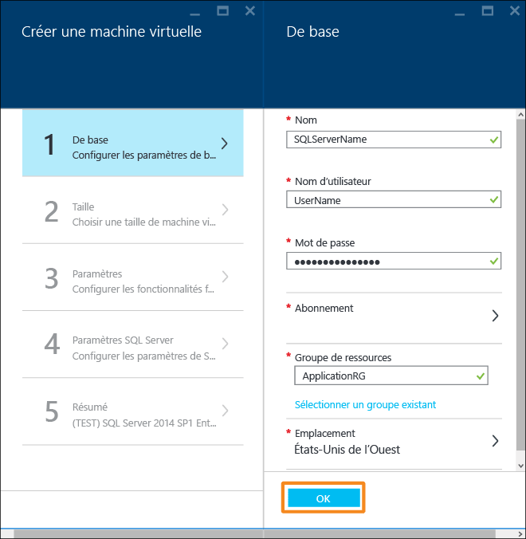

## 2\. Choisir la taille de machine virtuelle
Lors de l’étape de **dimensionnement**, choisissez une taille de machine virtuelle dans le panneau **Choisir une taille**. Le panneau affiche d’abord les tailles de machine virtuelle recommandées en fonction du modèle que vous avez sélectionné. Le coût mensuel lié à l’exécution de la machine virtuelle est également estimé.

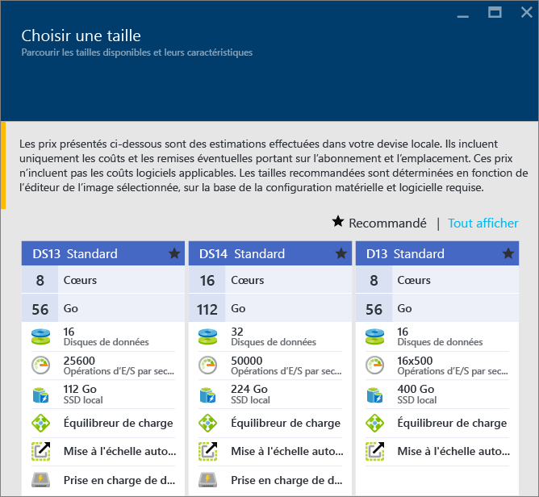

Pour les charges de travail de production, nous vous recommandons de sélectionner une taille de machine virtuelle qui prend en charge [Premium Storage](../storage/storage-premium-storage.md). Si vous n’avez pas besoin d’un tel niveau de performances, utilisez le bouton **Afficher tout** pour afficher toutes les options de taille de machine. Par exemple, vous pouvez utiliser une plus petite taille de machine pour un environnement de test ou de développement.

> [!NOTE]
> Pour plus d’informations sur les tailles de machines virtuelles, voir [Tailles des machines virtuelles](virtual-machines-windows-sizes.md). Pour des considérations sur les tailles de machines virtuelles SQL Server, consultez la rubrique [Meilleures pratiques relatives aux performances de SQL Server dans Azure Virtual Machines](virtual-machines-windows-sql-performance.md).
> 
> 

Choisissez la taille de votre machine, puis cliquez sur **Sélectionner**.

## 3\. Configurer des fonctionnalités facultatives
Dans le panneau **Paramètres**, configurez le stockage Azure, la mise en réseau et la surveillance de la machine virtuelle.

* Sous **Storage**, spécifiez un **type de disque** Standard ou Premium (SSD). L’option Premium Storage est recommandée pour les charges de travail de production.

> [!NOTE]
> Si vous sélectionnez Premium (SSD) pour une taille de machine qui ne prend pas en charge Premium Storage, votre machine sera redimensionnée de manière automatique.
> 
> 

* Sous **Compte de stockage**, vous pouvez accepter le nom de compte de stockage automatiquement approvisionné. Vous pouvez également cliquer sur **Compte de stockage** pour choisir un compte existant et configurer le type de compte de stockage. Par défaut, Azure crée un compte de stockage avec un stockage localement redondant. Pour plus d’informations sur les options de stockage, consultez [Réplication Azure Storage](../storage/storage-redundancy.md).
* Sous **Réseau**, vous pouvez accepter les valeurs remplies automatiquement. Vous pouvez également cliquer sur chaque fonctionnalité pour configurer manuellement le **Réseau virtuel**, **Sous-réseau**, **Adresse IP publique** et **Groupe de sécurité réseau**. Dans le cadre de ce didacticiel, vous pouvez conserver les valeurs par défaut.
* Azure permet **l’analyse** par défaut avec le même compte de stockage désigné pour la machine virtuelle. Vous pouvez modifier ces paramètres ici.
* Dans **Groupe à haute disponibilité**, spécifiez un groupe à haute disponibilité. Dans le cadre de ce didacticiel, vous pouvez sélectionner **aucun**. Si vous envisagez de configurer des groupes de disponibilité SQL AlwaysOn, configurez la disponibilité pour éviter de recréer la machine virtuelle. Pour plus d’informations, voir [Gestion de la disponibilité des machines virtuelles](virtual-machines-windows-manage-availability.md).

Une fois que vous avez terminé la configuration des paramètres, cliquez sur **OK**.

## 4\. Configurer les paramètres du serveur SQL
Dans le panneau **Paramètres SQL Server**, configurez des paramètres spécifiques et des optimisations pour SQL Server. Les paramètres que vous pouvez configurer pour SQL Server sont les suivants :

| Paramètre |
| --- |
| [Connectivité](#connectivity) |
| [Authentification](#authentication) |
| [Configuration du stockage](#storage-configuration) |
| [Mise à jour corrective automatisée](#automated-patching) |
| [Sauvegarde automatisée](#automated-backup) |
| [Intégration du coffre de clés Azure](#azure-key-vault-integration) |
| [R Services](#r-services) |

### Connectivité
Sous **SQL connectivity** (Connectivité SQL), spécifiez le type d’accès à l’instance SQL Server souhaité sur cette machine virtuelle. Pour les besoins de ce didacticiel, sélectionnez **Public (Internet)** pour autoriser les connexions à SQL Server depuis des machines ou des services sur Internet. Une fois cette option sélectionnée, Azure configure automatiquement le pare-feu et le groupe de sécurité réseau pour autoriser le trafic sur le port 1433.

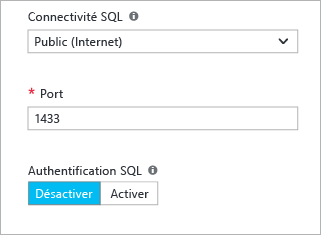

Pour vous connecter à SQL Server via Internet, vous devez également activer l’authentification SQL Server décrite à la section suivante.

> [!NOTE]
> Il est possible d’ajouter plus de restrictions pour les communications réseau à votre machine virtuelle SQL Server. Pour cela, modifiez le groupe de sécurité réseau une fois la machine virtuelle créée. Pour plus d’informations, voir [Présentation du groupe de sécurité réseau](../virtual-network/virtual-networks-nsg.md)
> 
> 

Si vous préférez ne pas activer les connexions au moteur de base de données via Internet, choisissez l’une des options suivantes :

* **Local (sur la machine virtuelle uniquement)** pour autoriser les connexions à SQL Server uniquement depuis la machine virtuelle.
* **Privé (dans un réseau virtuel)** pour autoriser les connexions à SQL Server depuis des machines ou des services résidant dans le même réseau virtuel.

> [!NOTE]
> L’image de machine virtuelle pour l’édition SQL Server Express n’active pas automatiquement le protocole TCP/IP. Cela est vrai même pour les options de connectivité Public et Privé. Pour l’édition Express, vous devez utiliser le Gestionnaire de configuration SQL Server pour [activer manuellement le protocole TCP/IP](#configure-sql-server-to-listen-on-the-tcp-protocol) après avoir créé la machine virtuelle.
> 
> 

En règle générale, améliorez la sécurité en choisissant la connectivité autorisée par votre scénario. Mais toutes les options sont sécurisables via les règles du groupe de sécurité réseau et l’authentification Windows/SQL.

Par défaut, le **port** est 1433. Vous pouvez spécifier un numéro de port différent. Pour plus d’informations, consultez [Se connecter à une machine virtuelle SQL Server (Resource Manager) | Microsoft Azure](virtual-machines-windows-sql-connect.md).

### Authentification
Si vous avez besoin de l’authentification SQL Server, cliquez sur **Activer** sous **Authentification SQL**.

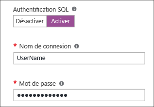

> [!NOTE]
> Si vous envisagez d’accéder à SQL Server via Internet (par exemple, avec l’option Connectivité publique), vous devez activer l’authentification SQL ici. L’accès public à SQL Server requiert l’utilisation de l’authentification SQL.
> 
> 

Si vous activez l’authentification SQL Server, spécifiez un **nom de connexion** et un **mot de passe**. Ce nom d’utilisateur est configuré en tant qu’identifiant d’authentification SQL Server et membre du rôle serveur fixe **sysadmin**. Pour plus d’informations sur les modes d’authentification, consultez [Choisir un mode d’authentification](http://msdn.microsoft.com/library/ms144284.aspx).

Si vous n’activez pas l’authentification SQL Server, vous pouvez utiliser le compte d’administrateur local sur la machine virtuelle pour vous connecter à l’instance SQL Server.

### Configuration du stockage
Cliquez sur **Configuration du stockage** afin de spécifier les exigences de stockage.

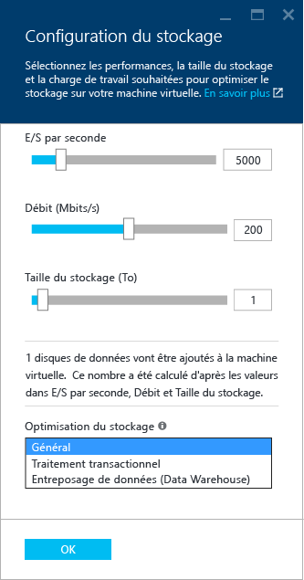

> [!NOTE]
> Si vous sélectionnez stockage Standard, cette option n’est pas disponible. L’optimisation du stockage automatique est disponible uniquement pour Premium Storage.
> 
> 

Vous pouvez spécifier des exigences comme les opérations d’entrée/sortie par seconde (E/S par seconde), le débit en Mbit/s et la taille totale de stockage. Configurez ces valeurs en utilisant les échelles mobiles. Le portail calcule automatiquement le nombre de disques en fonction de ces exigences.

Par défaut, Azure optimise le stockage pour 5 000 E/S par seconde, 200 Mbit/s et 1 To d’espace de stockage. Vous pouvez modifier ces paramètres de stockage en fonction de la charge de travail. Sous **Stockage optimisé pour**, sélectionnez l’une des options suivantes :

* **Général** est le paramètre par défaut ; il prend en charge la plupart des charges de travail.
* Le traitement **transactionnel** optimise le stockage pour les charges de travail OLTP de base de données traditionnelles.
* L’option **Entreposage de données** optimise le stockage pour les charges de travail d’analyse et de création de rapports.

> [!NOTE]
> Les limites supérieures sur les curseurs varient selon la taille de la machine virtuelle sélectionnée.
> 
> 

### Mise à jour corrective automatisée
L’option **Mise à jour corrective automatisée** est activée par défaut. La mise à jour corrective automatisée permet à Azure de corriger automatiquement SQL Server et le système d’exploitation. Spécifiez un jour de la semaine, une heure et une durée pour la fenêtre de maintenance. Azure effectue la mise à jour corrective dans cette fenêtre de maintenance. La planification de la fenêtre de maintenance utilise les paramètres régionaux de la machine virtuelle pour l’heure. Si vous ne souhaitez pas qu’Azure corrige automatiquement SQL Server et le système d’exploitation, cliquez sur **Désactiver**.

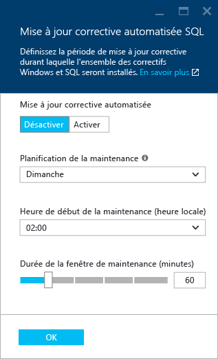

Pour plus d’informations, consultez [Mise à jour corrective automatisée pour SQL Server dans les machines virtuelles Azure](virtual-machines-windows-sql-automated-patching.md).

### Sauvegarde automatisée
Activez les sauvegardes automatiques de base de données pour toutes les bases de données sous **Sauvegarde automatisée**. La sauvegarde automatisée est désactivée par défaut.

Lorsque vous activez la sauvegarde SQL automatisée, vous pouvez configurer les éléments suivants :

* Période de rétention (jours) pour les sauvegardes
* Compte de stockage à utiliser pour les sauvegardes
* Option de chiffrement et mot de passe pour les sauvegardes

Pour chiffrer la sauvegarde, cliquez sur **Activer**. Spécifiez ensuite le **mot de passe**. Azure crée un certificat pour chiffrer les sauvegardes et utilise le mot de passe pour protéger ce certificat.

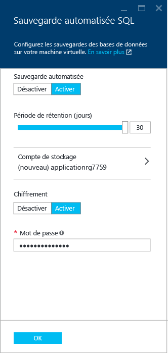

 Pour plus d’informations, voir [Sauvegarde automatisée pour SQL Server dans les machines virtuelles Azure](virtual-machines-windows-sql-automated-backup.md).

### Intégration du coffre de clés Azure
Pour stocker des clés secrètes de sécurité dans Azure pour le chiffrement, cliquez sur **Azure Key Vault Integration**, puis sur **Activer**.

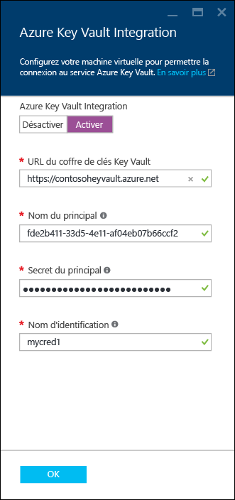

Le tableau suivant répertorie les paramètres requis pour configurer l’intégration du coffre de clés Azure.

| PARAMÈTRE | DESCRIPTION | EXEMPLE |
| --- | --- | --- |
| **URL du coffre de clés** |L’emplacement du coffre de clés. |https://contosokeyvault.vault.azure.net/ |
| **Nom du principal** |Nom du principal du service Azure Active Directory Également appelé ID client. |fde2b411-33d5-4e11-af04eb07b669ccf2 |
| **Secret du principal** |Secret du principal du service Azure Active Directory Également appelé Secret client. |9VTJSQwzlFepD8XODnzy8n2V01Jd8dAjwm/azF1XDKM= |
| **Nom des informations d’identification** |**Nom d’identification** : le module d’intégration du coffre de clés Azure crée des informations d’identification dans SQL Server, permettant ainsi à la machine virtuelle d’accéder au coffre de clés. Choisissez un nom pour cette identification. |mycred1 |

Pour plus d’informations, consultez [Configurer l’intégration d’Azure Key Vault pour SQL Server sur des machines virtuelles Azure](virtual-machines-windows-ps-sql-keyvault.md).

Une fois la configuration des paramètres de SQL Server terminée, cliquez sur **OK**.

### R Services
Pour l’édition SQL Server 2016 Enterprise, vous avez la possibilité d’activer [SQL Server R Services](https://msdn.microsoft.com/library/mt604845.aspx). Cela vous permet d’exécuter des analyses avancées avec SQL Server 2016. Dans le panneau **Paramètres SQL Server**, cliquez sur **Activer**.

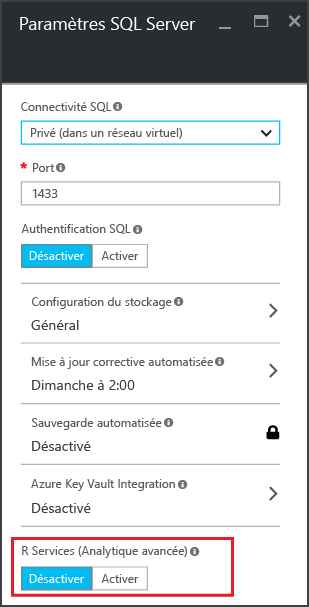

> [!NOTE]
> Pour les images SQL Server dont l’édition n’est pas 2016 Enterprise, l’option permettant d’activer R Services est désactivée.
> 
> 

## 5\. Passer en revue le résumé
Passez en revue le **résumé** dans le panneau correspondant et cliquez sur **OK** pour créer l’instance SQL Server, le groupe de ressources et les ressources spécifiées pour cette machine virtuelle.

Vous pouvez surveiller le déploiement à partir du portail Azure. Le bouton **Notifications** en haut de l’écran affiche l’état de base du déploiement.

> [!NOTE]
> Afin de vous donner une idée des temps de déploiement, nous avons déployé une machine virtuelle SQL dans les États-Unis de l’Est avec les paramètres par défaut. Ce déploiement de test a duré 26 minutes au total. Mais cette durée peut varier en fonction de votre région et des paramètres sélectionnés.
> 
> 

## Ouvrir la machine virtuelle à l’aide du Bureau à distance
Procédez comme suit pour vous connecter à la machine virtuelle à l’aide du Bureau à distance.

1. Une fois la machine virtuelle Azure créée, son icône apparaît dans le tableau de bord Azure. Vous pouvez également la localiser en parcourant vos machines virtuelles existantes. Cliquez sur votre nouvelle machine virtuelle SQL. Un panneau **Machine virtuelle** affiche les détails de votre machine virtuelle.
2. En haut du panneau **Machine virtuelle**, cliquez sur **Connecter**.
3. Le navigateur télécharge un fichier RDP pour la machine virtuelle. Ouvrez le fichier RDP. 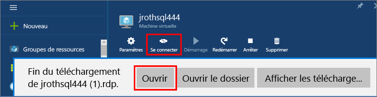
4. La connexion Bureau à distance vous informe que le serveur de publication de cette connexion à distance n’est pas identifiable. Cliquez sur **Connect** pour continuer.
5. Dans la boîte de dialogue **Sécurité de Windows**, cliquez sur **Utiliser un autre compte**.
6. Pour **Nom d’utilisateur**, tapez **<nom d’utilisateur>**, où <nom d’utilisateur> est le nom d’utilisateur spécifié lors de la configuration de la machine virtuelle. Vous devez ajouter une barre oblique inverse avant le nom.
7. Tapez le **mot de passe** que vous avez configuré précédemment pour cette machine virtuelle, puis cliquez sur **OK** pour vous connecter.
8. Si une autre boîte de dialogue **Connexion Bureau à distance** vous demande si vous souhaitez vous connecter, cliquez sur **Oui**.

Une fois que vous vous connectez à la machine virtuelle SQL Server, vous pouvez lancer SQL Server Management Studio et vous connecter avec l’authentification Windows à l’aide de vos informations d’identification d’administrateur local. Si vous avez activé l’authentification SQL Server, vous pouvez également vous connecter avec l’authentification SQL à l’aide de la connexion SQL et du mot de passe configuré lors de l’approvisionnement.

L’accès à la machine permet de modifier directement les paramètres SQL Server et ceux de la machine en fonction de vos besoins. Par exemple, vous pourriez configurer les paramètres du pare-feu ou modifier les paramètres de configuration SQL Server.

## Se connecter à SQL Server à distance
Dans ce didacticiel, nous avons sélectionné l’accès **Public** pour la machine virtuelle et **l’authentification SQL Server**. Ces paramètres ont configuré automatiquement la machine virtuelle pour autoriser les connexions SQL Server à partir de n’importe quel client sur internet (en supposant qu’il dispose de la connexion SQL qui convient).

> [!NOTE]
> Si vous n’avez pas sélectionné Public lors de l’approvisionnement, des étapes supplémentaires sont nécessaires pour accéder à votre instance SQL Server via Internet. Pour plus d’informations, consultez [Se connecter à une machine virtuelle SQL Server](virtual-machines-windows-sql-connect.md).
> 
> 

Les sections suivantes montrent comment se connecter à l’instance SQL Server sur votre machine virtuelle à partir d’une autre machine via Internet.

> [!INCLUDE [Se connecter à SQL Server dans une machine virtuelle (Resource Manager)](../../includes/virtual-machines-sql-server-connection-steps-resource-manager.md)]
> 
> 

## Étapes suivantes
Pour en savoir plus sur l’utilisation de SQL Server dans Azure, consultez [Présentation de SQL Server sur les machines virtuelles Azure](virtual-machines-windows-sql-server-iaas-overview.md) et le [Forum Aux Questions associé](virtual-machines-windows-sql-server-iaas-faq.md).

Pour une présentation vidéo de SQL Server sur les machines virtuelles Azure, regardez [Azure VM is the best platform for SQL Server 2016](https://channel9.msdn.com/Events/DataDriven/SQLServer2016/Azure-VM-is-the-best-platform-for-SQL-Server-2016) (Machines virtuelles Azure : Une excellente plateforme pour SQL Server 2016).

[Découvrez le parcours d’apprentissage](https://azure.microsoft.com/documentation/learning-paths/sql-azure-vm/) pour SQL Server sur les machines virtuelles Azure.

<!---HONumber=AcomDC_0921_2016-->