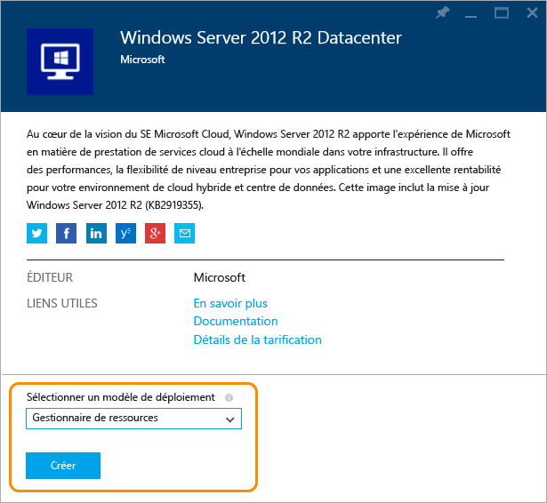
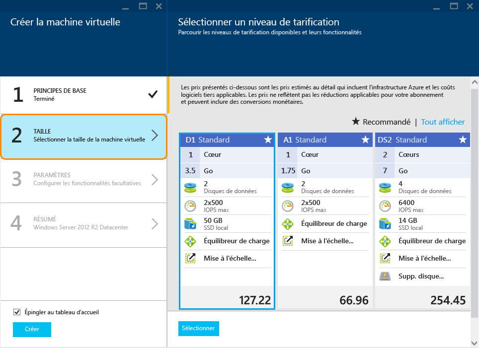
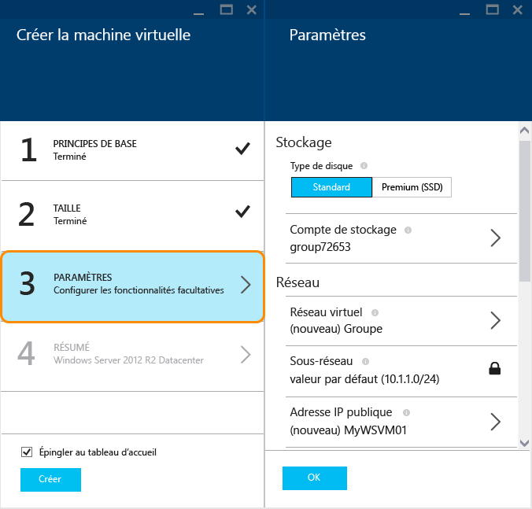

<properties
	pageTitle="Créer une machine virtuelle exécutant Windows dans le portail Azure | Microsoft Azure"
	description="Apprenez à créer une machine virtuelle Azure ou un ordinateur virtuel exécutant Windows à partir d’Azure Marketplace dans le portail Azure"
	keywords="machine virtuelle azure, créer une machine virtuelle, ordinateur virtuel, configuration d’une machine virtuelle"
	services="virtual-machines"
	documentationCenter=""
	authors="cynthn"
	manager="timlt"
	editor=""
	tags="azure-resource-manager"/>
<tags
	ms.service="virtual-machines"
	ms.workload="infrastructure-services"
	ms.tgt_pltfrm="vm-windows"
	ms.devlang="na"
	ms.topic="hero-article"
	ms.date="01/07/2016"
	ms.author="cynthn"/>

# Créer une machine virtuelle exécutant Windows dans le portail Azure#

> [AZURE.SELECTOR]
- [Portal - Windows](virtual-machines-windows-tutorial.md)
- [PowerShell](virtual-machines-ps-create-preconfigure-windows-resource-manager-vms.md)
- [PowerShell - Template](virtual-machines-create-windows-powershell-resource-manager-template.md)
- [Portal - Linux](virtual-machines-linux-tutorial-portal-rm.md)
- [CLI](virtual-machines-linux-tutorial.md)

Ce didacticiel vous montre combien il est facile de créer une machine virtuelle Azure dans le portail Azure, et ce, en quelques minutes. Nous allons utiliser une image de Windows Server 2012 R2 Datacenter à titre d’exemple pour créer la machine virtuelle. Ce n’est toutefois qu’une des nombreuses images proposées par Azure. Les images disponibles dépendent de votre abonnement. Par exemple, les images de bureau sont disponibles pour les abonnés MSDN.

[AZURE.INCLUDE [learn-about-deployment-models](../../includes/learn-about-deployment-models-rm-include.md)]Modèle de déploiement classique

Vous pouvez également créer des machines virtuelles à l’aide de vos propres images, de modèles Resource Manager ou d’outils d’automatisation. Pour plus d’informations sur les différentes méthodes, voir [Les différentes façons de créer une machine virtuelle Windows](virtual-machines-windows-choices-create-vm.md).

[AZURE.INCLUDE [free-trial-note](../../includes/free-trial-note.md)]

## Vidéo de procédure pas à pas

Voici une procédure pas à pas de ce didacticiel.

[AZURE.VIDEO create-a-virtual-machine-running-windows-in-the-azure-preview-portal]

## Sélectionner l’image de la machine virtuelle

1. Connectez-vous au portail Azure.

2. Dans le menu Hub, cliquez sur **Nouveau** > **Calcul** > **Windows Server 2012 R2 Datacenter**.

	

	>[AZURE.TIP]Pour rechercher d’autres images, cliquez sur **Marketplace**, puis recherchez ou filtrez les éléments disponibles.

3. Sur la page **Windows Server 2012 R2 Datacenter**, sous **Sélectionner un modèle de déploiement**, sélectionnez **Gestionnaire de ressources**. Cliquez sur **Create**.

	

## Création d'une machine virtuelle

Après avoir sélectionné l’image, vous pouvez utiliser les paramètres par défaut d’Azure pour la majeure partie de la configuration et créer rapidement la machine virtuelle.

1. Dans le panneau **Créer une machine virtuelle**, cliquez sur **Options de base**.

2. Saisissez le **Nom** choisi pour la machine virtuelle. Ce nom ne doit pas contenir de caractères spéciaux.

3. Saisissez un **Nom d’utilisateur** d’administration, et un **Mot de passe** fort. Le mot de passe doit compter 8 à 123 caractères et au moins 3 des types de caractères suivants : 1 caractère minuscule, 1 caractère majuscule, 1 chiffre et 1 caractère spécial. **Vous aurez besoin du nom d’utilisateur et du mot de passe pour vous connecter à la machine virtuelle.**

4. Si vous possédez plusieurs abonnements, indiquez celui associé à la nouvelle machine virtuelle ainsi qu’un **groupe de ressources** nouveau ou existant et l’**emplacement** d’un centre de données Azure.

	

	
2. Cliquez sur **Taille** et sélectionnez une taille de machine virtuelle adaptée à vos besoins. Chaque taille spécifie la quantité de cœurs de calcul, de mémoire et d'autres fonctionnalités, telles que la prise en charge du stockage Premium, ce qui aura un impact sur le prix. Azure recommande automatiquement certaines tailles en fonction de l'image que vous choisissez.

	

	>[AZURE.NOTE]Le stockage Premium est disponible pour les machines virtuelles de la série DS dans certaines régions. Le stockage Premium est l’option de stockage la mieux adaptée aux charges de travail intensives, comme une base de données. Pour plus d’informations, voir l’article [Stockage Premium : stockage hautes performances pour les charges de travail des machines virtuelles Azure](storage-premium-storage-preview-portal.md).

3. Cliquez sur **Paramètres** pour voir les paramètres de stockage et de mise en réseau pour la nouvelle machine virtuelle. Pour une première machine virtuelle, vous pouvez généralement accepter les paramètres par défaut. Si vous avez sélectionné une taille de machine virtuelle qui le prend en charge, vous pouvez essayer Premium Storage en sélectionnant **Premium (SSD)** sous **Type de disque**.

	

6. Cliquez sur **Synthèse** pour passer en revue vos options de configuration. Lorsque vous avez terminé, cliquez sur **Créer**.

	

8. Pendant qu’Azure crée la machine virtuelle, vous pouvez suivre la progression dans le menu Hub sous **Machines virtuelles**.

## Connexion à la machine virtuelle

Une fois que vous avez créé la machine virtuelle, vous pouvez vous y connecter afin de gérer ses paramètres et les applications qui s’exécuteront dessus.

>[AZURE.NOTE]Pour des conseils concernant les exigences et le dépannage, consultez [Connexion d'une machine virtuelle Azure à l'aide de RDP or SSH](https://msdn.microsoft.com/library/azure/dn535788.aspx).

1. Si ce n’est pas déjà fait, connectez-vous au portail Azure.

2. Sur le tableau de bord, cliquez sur votre machine virtuelle, ou cliquez sur Machines virtuelles, puis sélectionnez-le dans la liste.

3. Dans le panneau de la machine virtuelle, cliquez sur **Connecter**.

	

4. Cliquez sur **Ouvrir** pour utiliser le fichier de protocole RDP qui est créé automatiquement pour la machine virtuelle Windows Server.

5. Cliquez sur **Connecter**.

6. Entrez le nom d’utilisateur et le mot de passe définis lors de la création de la machine virtuelle, puis cliquez sur **OK**.

7. Cliquez sur **Oui** pour vérifier l'identité de la machine virtuelle.

Vous pouvez désormais utiliser la machine virtuelle tout comme vous le feriez avec un serveur.

## Étapes suivantes

* Utilisez Azure PowerShell et l’interface de ligne de commande Azure pour [rechercher et sélectionner des images de machine virtuelle](resource-groups-vm-searching.md).
* Automatisez le déploiement et la gestion des machines virtuelles et charges de travail à l’aide des [modèles d’Azure Resource Manager](http://azure.microsoft.com/documentation/templates/).

<!---HONumber=AcomDC_0114_2016-->