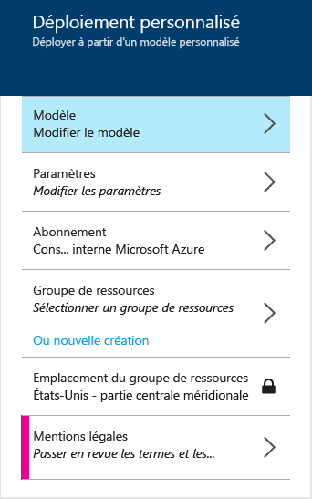
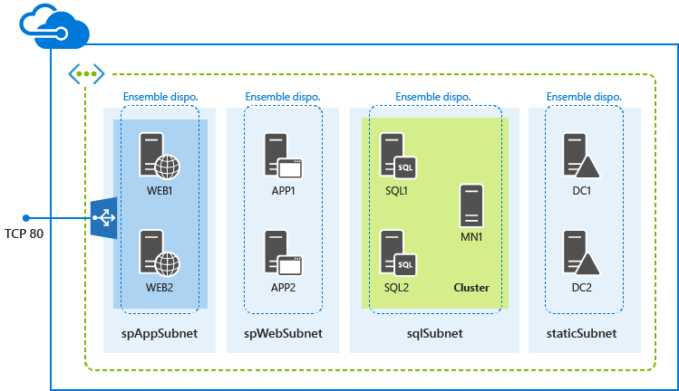

<properties
	pageTitle="Déploiement de batteries de serveurs SharePoint avec des modèles Azure Resource Manager | Microsoft Azure"
	description="Déployez facilement une batterie SharePoint à trois ou à neuf serveurs à l’aide de modèles du Gestionnaire de ressources et du portail Azure, d’Azure PowerShell ou de l’interface de ligne de commande Azure."
	services="virtual-machines"
	documentationCenter=""
	authors="JoeDavies-MSFT"
	manager="timlt"
	editor=""
	tags="azure-resource-manager"/>

<tags
	ms.service="virtual-machines"
	ms.workload="infrastructure-services"
	ms.tgt_pltfrm="vm-windows-sharepoint"
	ms.devlang="na"
	ms.topic="hero-article"
	ms.date="10/05/2015"
	ms.author="josephd"/>

# Déployer des batteries de serveurs avec des modèles Azure Resource Manager

[AZURE.INCLUDE [learn-about-deployment-models](../../includes/learn-about-deployment-models-rm-include.md)]modèle de déploiement classique. Vous ne pouvez pas créer cette ressource avec le modèle de déploiement classique.

Suivez les instructions de cet article afin de déployer une nouvelle batterie SharePoint Server 2013 à trois ou neuf serveurs à l’aide de modèles Resource Manager.

## Déployer une batterie SharePoint à trois serveurs

Pour une batterie de base SharePoint Server 2013, un modèle Resource Manager crée trois machines virtuelles dans un nouveau réseau virtuel, sur trois sous-réseaux différents.

Vous pouvez exécuter le modèle avec le portail Azure en version préliminaire, Azure PowerShell ou l’interface de ligne de commande Azure.

### Portail Azure en version préliminaire

Pour déployer cette charge de travail à l’aide d’un modèle Resource Manager et du portail Azure en version préliminaire, cliquez [ici](https://portal.azure.com/#create/Microsoft.Template/uri/https%3A%2F%2Fraw.githubusercontent.com%2FAzure%2Fazure-quickstart-templates%2Fmaster%2Fsharepoint-three-vm%2Fazuredeploy.json).

1.	Cliquez sur **Paramètres**. Dans le volet **Paramètres**, saisissez les nouvelles valeurs, effectuez votre sélection parmi les valeurs autorisées ou acceptez les valeurs par défaut, puis cliquez sur **OK**.
2.	Si nécessaire, cliquez sur **Abonnement**, puis sélectionnez l’abonnement Azure approprié.
3.	Cliquez sur **Groupe de ressources**, puis sélectionnez un groupe de ressources existant. Sinon, cliquez sur **Ou créer nouveau** pour créer un nouveau groupe de ressources pour cette charge de travail.
4.	Si nécessaire, cliquez sur **Emplacement du groupe de ressources**, puis sélectionnez l’emplacement Azure approprié.
6.	Cliquez sur **Mentions légales** pour passer en revue les conditions d’utilisation de ce modèle.
7.	Cliquez sur **Create**.

Selon le modèle, la génération de la charge de travail par Azure peut prendre un certain temps. Lorsque vous avez terminé, vous disposez d’une nouvelle batterie SharePoint à trois serveurs dans votre groupe de ressource nouveau ou existant.

### Azure PowerShell

> [AZURE.NOTE]Cet article contient des commandes pour les versions d’Azure PowerShell *antérieures* à la version 1.0.0. Vous pouvez déterminer votre version d’Azure PowerShell à l’aide de la commande **Get-Module azure | format-table version**. Les blocs de commande Azure PowerShell dans cet article font actuellement l’objet de tests et de mises à jour pour prendre en charge les nouvelles applets de commande dans les versions Azure PowerShell 1.0.0 et ultérieures. Nous vous remercions de votre patience.

Avant de commencer, assurez-vous de disposer de la version appropriée d’Azure PowerShell, d’être connecté et d’être passé sur le nouveau mode Gestionnaire des ressources. Pour plus d’informations, cliquez [ici](virtual-machines-deploy-rmtemplates-powershell.md#setting-up-powershell-for-resource-manager-templates).

Saisissez un nom de déploiement Azure, un nouveau nom de groupe de ressources et un emplacement de centre de données Azure dans l’ensemble de commandes suivant. Supprimez les éléments entre guillemets, notamment les caractères < and >.

	$deployName="<deployment name>"
	$RGName="<resource group name>"
	$locName="<Azure location, such as West US>"
	$templateURI="https://raw.githubusercontent.com/Azure/azure-quickstart-templates/master/sharepoint-three-vm/azuredeploy.json"
	New-AzureResourceGroup -Name $RGName -Location $locName
	New-AzureResourceGroupDeployment -Name $deployName -ResourceGroupName $RGName -TemplateUri $templateURI

Voici un exemple.

	$deployName="TestDeployment"
	$RGName="TestRG"
	$locname="West US"
	$templateURI="https://raw.githubusercontent.com/Azure/azure-quickstart-templates/master/sharepoint-three-vm/azuredeploy.json"
	New-AzureResourceGroup -Name $RGName -Location $locName
	New-AzureResourceGroupDeployment -Name $deployName -ResourceGroupName $RGName -TemplateUri $templateURI

Ensuite, exécutez votre bloc de commande dans l’invite Azure PowerShell.

Quand vous exécutez la commande **New-AzureResourceGroupDeployment**, vous êtes invité à fournir les valeurs d’une série de paramètres. Une fois que vous avez spécifié l’ensemble des valeurs de paramètres, la commande **New-AzureResourceGroupDeployment** crée et configure les machines virtuelles.

Lorsque vous avez terminé, vous disposez d’une nouvelle batterie SharePoint à trois serveurs dans votre nouveau groupe de ressources.

### Interface de ligne de commande Azure

Avant de commencer, assurez-vous de disposer de la version appropriée de l’interface de ligne de commande Azure, d’être connecté et d’être passé sur le nouveau mode Gestionnaire des ressources. Pour plus d’informations, cliquez [ici](virtual-machines-deploy-rmtemplates-azure-cli.md#getting-ready).

Tout d’abord, vous créez un nouveau groupe de ressources. Exécutez la commande suivante et définissez le nom du groupe et l’emplacement du centre de données Azure dans lequel vous souhaitez effectuer le déploiement.

	azure group create <group name> <location>

Ensuite, exécutez la commande suivante et définissez le nom de votre nouveau groupe de ressources et le nom d’un déploiement Azure.

	azure group deployment create --template-uri https://raw.githubusercontent.com/Azure/azure-quickstart-templates/master/sharepoint-three-vm/azuredeploy.json <group name> <deployment name>

Voici un exemple.

	azure group create sp3serverfarm eastus2
	azure group deployment create --template-uri https://raw.githubusercontent.com/Azure/azure-quickstart-templates/master/sharepoint-three-vm/azuredeploy.json sp3serverfarm spdevtest

Quand vous exécutez la commande **azure group deployment create**, vous êtes invité à fournir les valeurs d’une série de paramètres. Une fois que vous avez défini l’ensemble des valeurs de paramètres, Azure crée et configure les machines virtuelles.

Vous disposez désormais d’une nouvelle batterie SharePoint à trois serveurs dans votre nouveau groupe de ressources.

## Déployer une batterie SharePoint à neuf serveurs

Pour une batterie de base SharePoint Server 2013 à haute disponibilité, un modèle Resource Manager crée neuf machines virtuelles dans un nouveau réseau virtuel, sur quatre sous-réseaux différents.

### Portail Azure en version préliminaire

Pour déployer cette charge de travail à l’aide d’un modèle Resource Manager et du portail Azure en version préliminaire, cliquez [ici](https://portal.azure.com/#create/Microsoft.Template/uri/https%3A%2F%2Fraw.githubusercontent.com%2FAzure%2Fazure-quickstart-templates%2Fmaster%2Fsharepoint-server-farm-ha%2Fazuredeploy.json).

1.	Cliquez sur **Paramètres**. Dans le volet **Paramètres**, entrez les nouvelles valeurs, effectuez votre sélection parmi les valeurs autorisées ou acceptez les valeurs par défaut, puis cliquez sur **OK**.
2.	Si nécessaire, cliquez sur **Abonnement**, puis sélectionnez l’abonnement Azure approprié.
3.	Cliquez sur **Groupe de ressources**, puis sélectionnez un groupe de ressources existant. Sinon, cliquez sur **Ou créer nouveau** pour créer un groupe de ressources pour cette charge de travail.
4.	Si nécessaire, cliquez sur **Emplacement du groupe de ressources**, puis sélectionnez l’emplacement Azure approprié.
5.	Cliquez sur **Mentions légales** pour passer en revue les conditions d’utilisation de ce modèle.
6.	Cliquez sur **Create**.

Selon le modèle, la génération de la charge de travail par Azure peut prendre un certain temps. Lorsque vous avez terminé, vous disposez d’une nouvelle batterie SharePoint à neuf serveurs dans votre groupe de ressource nouveau ou existant.

### Azure PowerShell

Avant de commencer, assurez-vous de disposer de la version appropriée d’Azure PowerShell, d’être connecté et d’être passé sur le nouveau mode Gestionnaire des ressources. Pour plus d’informations, cliquez [ici](virtual-machines-deploy-rmtemplates-powershell.md#setting-up-powershell-for-resource-manager-templates).

Saisissez un nom de déploiement Azure, un nouveau nom de groupe de ressources et un emplacement de centre de données Azure dans l’ensemble de commandes suivant. Supprimez les éléments entre guillemets, notamment les caractères < and >.

	$deployName="<deployment name>"
	$RGName="<resource group name>"
	$locName="<Azure location, such as West US>"
	$templateURI="https://raw.githubusercontent.com/Azure/azure-quickstart-templates/master/sharepoint-server-farm-ha/azuredeploy.json"
	New-AzureResourceGroup -Name $RGName -Location $locName
	New-AzureResourceGroupDeployment -Name $deployName -ResourceGroupName $RGName -TemplateUri $templateURI

Voici un exemple.

	$deployName="TestDeployment"
	$RGName="TestRG"
	$locname="West US"
	$templateURI="https://raw.githubusercontent.com/Azure/azure-quickstart-templates/master/sharepoint-server-farm-ha/azuredeploy.json"
	New-AzureResourceGroup -Name $RGName -Location $locName
	New-AzureResourceGroupDeployment -Name $deployName -ResourceGroupName $RGName -TemplateUri $templateURI

Ensuite, exécutez votre bloc de commande dans l'invite de commande Azure PowerShell.

Quand vous exécutez la commande **New-AzureResourceGroupDeployment**, vous êtes invité à fournir les valeurs d’une série de paramètres. Une fois que vous avez spécifié l’ensemble des valeurs de paramètres, la commande **New-AzureResourceGroupDeployment** crée et configure les machines virtuelles.

Une fois que l’exécution du modèle est terminée, vous disposez d’une nouvelle batterie SharePoint à neuf serveurs dans votre nouveau groupe de ressources.

### Interface de ligne de commande Azure

Avant de commencer, assurez-vous de disposer de la version appropriée de l’interface de ligne de commande Azure, d’être connecté et d’être passé sur le nouveau mode Gestionnaire des ressources. Pour plus d’informations, cliquez [ici](virtual-machines-deploy-rmtemplates-azure-cli.md#getting-ready).

Dans un premier temps, créez un nouveau groupe de ressources. Exécutez la commande suivante et définissez le nom du groupe et l’emplacement du centre de données Azure dans lequel vous souhaitez effectuer le déploiement.

	azure group create <group name> <location>

Ensuite, exécutez la commande suivante et définissez le nom de votre nouveau groupe de ressources et le nom d’un déploiement Azure.

	azure group deployment create --template-uri https://raw.githubusercontent.com/Azure/azure-quickstart-templates/master/sharepoint-server-farm-ha/azuredeploy.json <group name> <deployment name>

Voici un exemple.

	azure group create sphaserverfarm eastus2
	azure group deployment create --template-uri https://raw.githubusercontent.com/Azure/azure-quickstart-templates/master/sharepoint-server-farm-ha/azuredeploy.json sphaserverfarm spdevtest

Quand vous exécutez la commande **azure group deployment create**, vous êtes invité à fournir les valeurs d’une série de paramètres. Une fois que vous avez défini l’ensemble des valeurs de paramètres, Azure crée et configure les machines virtuelles.

Une fois que l’exécution du modèle est terminée, vous disposez d’une nouvelle batterie SharePoint Server 2013 à neuf serveurs dans votre nouveau groupe de ressources.

## Ressources supplémentaires

[Batteries de serveurs SharePoint hébergés dans des services d’infrastructure Azure](virtual-machines-sharepoint-infrastructure-services.md)

[Déployer et gérer des machines virtuelles à l’aide de modèles Azure Resource Manager et d’Azure PowerShell](virtual-machines-deploy-rmtemplates-powershell.md)

[Fournisseurs de calcul, de réseau et de stockage Azure dans Azure Resource Manager](virtual-machines-azurerm-versus-azuresm.md)

[Présentation d’Azure Resource Manager](../resource-group-overview.md)

[Déploiement et gestion de machines virtuelles à l’aide des modèles Azure Resource Manager et de l’interface de ligne de commande Azure](virtual-machines-deploy-rmtemplates-azure-cli.md)

[Documentation sur les machines virtuelles](http://azure.microsoft.com/documentation/services/virtual-machines/)

[Installation et configuration d’Azure PowerShell](../install-configure-powershell.md)

<!---HONumber=Oct15_HO3-->