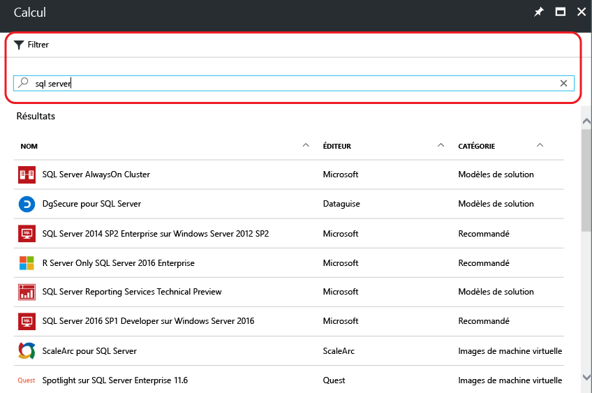
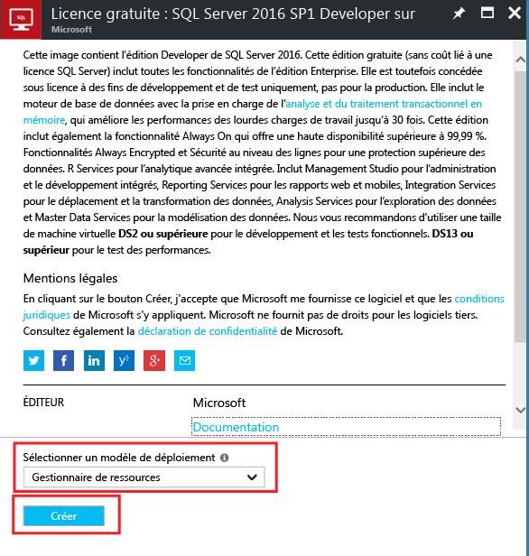
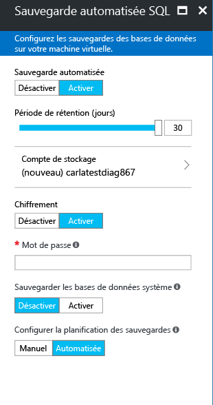

# Approvisionnement d’une machine virtuelle Windows SQL Server dans le portail Azure

> [!div class="op_single_selector"]
> * [Portail](virtual-machines-windows-portal-sql-server-provision.md)
> * [PowerShell](virtual-machines-windows-ps-sql-create.md)
> * [Linux](../../linux/sql/provision-sql-server-linux-virtual-machine.md)

Dans ce guide de démarrage rapide, vous utilisez le portail Azure pour créer une machine virtuelle Windows dans laquelle est installée SQL Server.

Ce didacticiel présente les procédures suivantes :

* [Sélectionner une image de machine virtuelle à partir de la galerie](#select)
* [Configurer et créer la machine virtuelle](#configure)
* [Ouvrir la machine virtuelle à l’aide du Bureau à distance](#remotedesktop)
* [Se connecter à SQL Server à distance](#connect)

##  Sélectionner une image de machine virtuelle SQL à partir de la galerie

1. Connectez-vous au [portail Azure](https://portal.azure.com) avec votre compte.

   > [!NOTE]
   > Si vous n'avez pas de compte Azure, visitez la page [Version d'évaluation gratuite d'Azure](https://azure.microsoft.com/pricing/free-trial/).

1. Dans le portail Azure, cliquez sur **Nouveau**. Le portail ouvre la fenêtre **Nouveau**.

1. Dans la fenêtre **Nouveau**, cliquez sur **Calcul** , puis sur **Afficher tout**.

   

1. Dans le champ de recherche, tapez **SQL Server 2017**, puis appuyez sur ENTRÉE.

1. Cliquez sur l’icône **Filtre**.

1. Dans la fenêtre Filtre, cochez la sous-catégorie **Selon Windows** et **Microsoft** pour l’éditeur. Cliquez ensuite sur **Terminé** pour filtrer les résultats et ne visualiser que les images Windows SQL Server publiées par Microsoft.

   

1. Passez en revue les images SQL Server disponibles. Chaque image identifie une version de SQL Server et un système d’exploitation.

1. Sélectionnez l’image nommée **Free SQL Server License : SQL Server 2017 Developer on Windows Server 2016** (Licence gratuite SQL Server : SQL Server 2017 Developer sur Windows Server 2016).

   > [!TIP]
   > L’édition Developer est utilisée dans ce didacticiel, car il s’agit d’une version complète de SQL Server qui est gratuite à des fins de test de développement. Vous payez uniquement pour le coût d’exécution de la machine virtuelle. Toutefois, vous êtes libre de choisir toutes les images qui doivent être utilisées dans ce didacticiel.

   > [!TIP]
   > Les images de machines virtuelles SQL incluent les coûts de licence pour SQL Server dans la tarification par minute de la machine virtuelle que vous créez (sauf pour les éditions Développeur et Express). SQL Server Developer est gratuit pour le développement/les tests (hors production) et SQL Express est gratuit pour les charges légères (moins de 1 Go de mémoire, moins de 10 Go de stockage). Vous avez également la possibilité d’utiliser votre solution BYOL (apportez votre propre licence) et de payer seulement pour la machine virtuelle. Ces noms d’images sont préfixés avec {BYOL}. 
   >
   > Pour en savoir plus sur ces options, consultez l’article [Pricing guidance for SQL Server Azure VMs](virtual-machines-windows-sql-server-pricing-guidance.md) (Tarification des machines virtuelles SQL Server Azure).

1. Sous **Sélectionner un modèle de déploiement**, vérifiez que **Resource Manager** est sélectionné. Resource Manager est le modèle de déploiement recommandé pour les nouvelles machines virtuelles. 

1. Cliquez sur **Create**.

    

##  Configurer la machine virtuelle
Il existe cinq fenêtres de configuration d’une machine virtuelle SQL Server.

| Étape | Description |
| --- | --- |
| **Concepts de base** |[Configurer les paramètres de base](#1-configure-basic-settings) |
| **Taille** |[Choisir la taille de machine virtuelle](#2-choose-virtual-machine-size) |
| **Paramètres** |[Configurer des fonctionnalités facultatives](#3-configure-optional-features) |
| **Paramètres de SQL Server** |[Configurer les paramètres du serveur SQL](#4-configure-sql-server-settings) |
| **Résumé** |[Passer en revue le résumé](#5-review-the-summary) |

## 1. Configurer les paramètres de base

Dans la fenêtre **Informations de base** , fournissez les informations suivantes :

* Entrez un **nom**de machine virtuelle unique.

* Pour optimiser les performances, sélectionnez **SSD** comme type de disque de machine virtuelle.

* Indiquez uniquement un **Nom d’utilisateur** pour le compte administrateur local de la machine virtuelle. Ce compte est également ajouté au serveur fixe **sysadmin** SQL Server.

* Utilisez un **mot de passe**fort.

* Si vous possédez plusieurs abonnements, vérifiez que l’abonnement est correct pour la nouvelle machine virtuelle.

* Dans la zone **Groupe de ressources** , saisissez un nom pour le groupe de ressources. Sinon, pour utiliser un groupe de ressources existant, cliquez sur **Utiliser existant**. Un groupe de ressources est une collection de ressources liées dans Azure (machines virtuelles, comptes de stockage, réseaux virtuels, etc.).

  > [!NOTE]
  > L’utilisation d’un nouveau groupe de ressources est utile si vous testez ou découvrez les déploiements SQL Server dans Azure. Une fois que vous avez terminé votre test, supprimez le groupe de ressources pour supprimer automatiquement la machine virtuelle et toutes les ressources associées à ce groupe de ressources. Pour plus d’informations sur les groupes de ressources, consultez [Vue d’ensemble d’Azure Resource Manager](../../../azure-resource-manager/resource-group-overview.md).

* Sélectionnez un **Emplacement** correspondant à la région Azure qui hébergera ce déploiement.

* Cliquez sur **OK** pour enregistrer les paramètres.

    

## 2. Choisir la taille de machine virtuelle

Lors de l’étape de **Dimensionnement**, choisissez une taille de machine virtuelle dans la fenêtre **Choisir une taille**. La fenêtre affiche d’abord les tailles de machine virtuelle recommandées en fonction de l’image que vous avez sélectionnée.

> [!IMPORTANT]
> Le coût mensuel estimé affiché sur la fenêtre **Choisir une taille** n’inclut pas les coûts de licence SQL Server. Il s’agit uniquement du coût de la machine virtuelle. Pour les éditions Express et Developer de SQL Server, il s’agit du coût total estimé. Pour les autres éditions, consultez la [page de tarification des machines virtuelles Windows](https://azure.microsoft.com/pricing/details/virtual-machines/windows/) et sélectionnez votre édition de SQL Server. Consultez également l’article [Pricing guidance for SQL Server Azure VMs](virtual-machines-windows-sql-server-pricing-guidance.md) (Tarification des machines virtuelles SQL Server Azure).

Pour les charges de travail de production, consultez les tailles de machine et la configuration recommandées dans l’article [Meilleures pratiques relatives aux performances de SQL Server dans les machines virtuelles Azure](virtual-machines-windows-sql-performance.md). Si vous avez besoin d’une taille de machine non répertoriée, cliquez sur le bouton **Afficher tout**.

> [!NOTE]
> Pour plus d’informations sur les tailles de machines virtuelles, voir [Tailles des machines virtuelles](../sizes.md?toc=%2fazure%2fvirtual-machines%2fwindows%2ftoc.json).

Choisissez la taille de votre machine, puis cliquez sur **Sélectionner**.

## 3. Configurer des fonctionnalités facultatives

Dans la fenêtre **Paramètres**, configurez le stockage Azure, la mise en réseau et la surveillance de la machine virtuelle.

* Dans la section **Stockage**, sélectionnez **Oui** sous **Utiliser Managed Disks**.

   > [!NOTE]
   > Microsoft recommande Managed Disks pour SQL Server. Les disques managés gèrent le stockage en arrière-plan. En outre, lorsque les machines virtuelles avec Managed Disks sont dans le même groupe à haute disponibilité, Azure distribue les ressources de stockage pour fournir une redondance appropriée. Pour plus d’informations, voir la page [Azure Managed Disks overview](../../../storage/storage-managed-disks-overview.md) (Vue d’ensemble d’Azure Managed Disks). Pour plus de détails sur les disques gérés dans un groupe à haute disponibilité, consultez l’article [Utilisation de disques gérés pour les machines virtuelles dans le groupe à haute disponibilité](../manage-availability.md).

* Sous **Réseau**, vous pouvez accepter les valeurs remplies automatiquement. Vous pouvez également cliquer sur chaque fonctionnalité pour configurer manuellement le **Réseau virtuel**, **Sous-réseau**, **Adresse IP publique** et **Groupe de sécurité réseau**. Dans le cadre de ce didacticiel, vous pouvez conserver les valeurs par défaut.

* Azure permet **l’analyse** par défaut avec le même compte de stockage désigné pour la machine virtuelle. Vous pouvez modifier ces paramètres ici.

* Sous **Groupe à haute disponibilité**, vous pouvez conserver la valeur par défaut **aucune** pour ce didacticiel. Si vous envisagez de configurer des groupes de disponibilité SQL AlwaysOn, configurez la disponibilité pour éviter de recréer la machine virtuelle.  Pour plus d’informations, voir [Gestion de la disponibilité des machines virtuelles](../manage-availability.md?toc=%2fazure%2fvirtual-machines%2fwindows%2ftoc.json).

Une fois que vous avez terminé la configuration des paramètres, cliquez sur **OK**.

## 4. Configurer les paramètres du serveur SQL
Dans la fenêtre **Paramètres SQL Server**, configurez des paramètres spécifiques et des optimisations pour SQL Server. Les paramètres que vous pouvez configurer pour SQL Server sont les suivants :

| Paramètre |
| --- |
| [Connectivité](#connectivity) |
| [Authentification](#authentication) |
| [Configuration du stockage](#storage-configuration) |
| [Mise à jour corrective automatisée](#automated-patching) |
| [Sauvegarde automatisée](#automated-backup) |
| [Intégration du coffre de clés Azure](#azure-key-vault-integration) |
| [Services de Machine Learning SQL Server](#sql-server-machine-learning-services) |

### Connectivité

Sous **SQL connectivity**(Connectivité SQL), spécifiez le type d’accès à l’instance SQL Server souhaité sur cette machine virtuelle. Pour les besoins de ce didacticiel, sélectionnez **Public (Internet)** pour autoriser les connexions à SQL Server depuis des machines ou des services sur Internet. Une fois cette option sélectionnée, Azure configure automatiquement le pare-feu et le groupe de sécurité réseau pour autoriser le trafic sur le port 1433.

> [!TIP]
> Par défaut, SQL Server écoute un port bien connu, le port **1433**. Pour accroître la sécurité, remplacez dans la boîte de dialogue précédente le port par défaut par un autre port, tel que 1401. Si vous effectuez cette opération, vous devez vous connecter à l’aide de ce port à partir de tous les outils clients, tels que SSMS.

Pour vous connecter à SQL Server via Internet, vous devez également activer l’authentification SQL Server décrite à la section suivante.

Si vous préférez ne pas activer les connexions au moteur de base de données via Internet, choisissez l’une des options suivantes :

* **Local (sur la machine virtuelle uniquement)** pour autoriser les connexions à SQL Server uniquement depuis la machine virtuelle.
* **Privé (dans un réseau virtuel)** pour autoriser les connexions à SQL Server depuis des machines ou des services résidant dans le même réseau virtuel.

En règle générale, améliorez la sécurité en choisissant la connectivité autorisée par votre scénario. Mais toutes les options sont sécurisables via les règles du groupe de sécurité réseau et l’authentification Windows/SQL. Vous pouvez modifier le Groupe de sécurité réseau après avoir créé la machine virtuelle. Pour plus d’informations, consultez [Considérations relatives à la sécurité de SQL Server sur les machines virtuelles Azure](virtual-machines-windows-sql-security.md).

> [!NOTE]
> L’image de machine virtuelle pour SQL Server Express Edition n’active pas automatiquement le protocole TCP/IP. Cela est vrai même pour les options de connectivité Public et Privé. Pour l’édition Express, vous devez utiliser le Gestionnaire de configuration de SQL Server pour [activer manuellement le protocole TCP/IP](#configure-sql-server-to-listen-on-the-tcp-protocol) après création de la machine virtuelle.

### Authentification

Si vous avez besoin de l’authentification SQL Server, cliquez sur **Activer** under **Authentification SQL**.

> [!NOTE]
> Si vous envisagez d’accéder à SQL Server via Internet (par exemple, avec l’option Connectivité publique), vous devez activer l’authentification SQL ici. L’accès public à SQL Server requiert l’utilisation de l’authentification SQL.
> 
> 

Si vous activez l’authentification SQL Server, spécifiez un **nom de connexion** et un **mot de passe**. Ce nom d’utilisateur est configuré en tant qu’identifiant d’authentification SQL Server et membre du rôle serveur fixe **sysadmin** . Pour plus d’informations sur les modes d’authentification, consultez [Choisir un mode d’authentification](https://docs.microsoft.com/sql/relational-databases/security/choose-an-authentication-mode) .

Si vous n’activez pas l’authentification SQL Server, vous pouvez utiliser le compte d’administrateur local sur la machine virtuelle pour vous connecter à l’instance SQL Server.

### Configuration du stockage

Cliquez sur **Configuration du stockage** afin de spécifier les exigences de stockage.

> [!NOTE]
> Si vous avez configuré votre machine virtuelle manuellement pour qu’elle utilise un stockage standard, cette option n’est pas disponible. L’optimisation du stockage automatique est disponible uniquement pour Premium Storage.

> [!TIP]
> Le nombre d’arrêts et les limites maximales de chaque curseur dépendent de la taille de machine virtuelle que vous avez sélectionnée. Plus une machine virtuelle est volumineuse et puissante, plus sa capacité de montée en puissance est importante.

Vous pouvez spécifier des exigences comme les opérations d’entrée/sortie par seconde (E/S par seconde), le débit en Mbit/s et la taille totale de stockage. Configurez ces valeurs en utilisant les échelles mobiles. Vous pouvez modifier ces paramètres de stockage en fonction de la charge de travail. Le portail calcule automatiquement le nombre de disques à attacher et configurer en fonction de ces exigences.

Sous **Stockage optimisé pour**, sélectionnez l’une des options suivantes :

* **Général** est le paramètre par défaut ; il prend en charge la plupart des charges de travail.
* **transactionnel** optimise le stockage pour les charges de travail OLTP de base de données traditionnelles.
* **Entreposage de données** optimise le stockage pour les charges de travail d’analyse et de création de rapports.

### Mise à jour corrective automatisée

**Automated patching** est activée par défaut. La mise à jour corrective automatisée permet à Azure de corriger automatiquement SQL Server et le système d’exploitation. Spécifiez un jour de la semaine, une heure et une durée pour la fenêtre de maintenance. Azure effectue la mise à jour corrective dans cette fenêtre de maintenance. La planification de la fenêtre de maintenance utilise les paramètres régionaux de la machine virtuelle pour l’heure. Si vous ne souhaitez pas qu’Azure corrige automatiquement SQL Server et le système d’exploitation, cliquez sur **Désactiver**.  

Pour plus d’informations, consultez [Mise à jour corrective automatisée pour SQL Server dans les machines virtuelles Azure](virtual-machines-windows-sql-automated-patching.md).

### Sauvegarde automatisée

Activez les sauvegardes automatiques de base de données pour toutes les bases de données sous **Sauvegarde automatisée**. La sauvegarde automatisée est désactivée par défaut.

Lorsque vous activez la sauvegarde SQL automatisée, vous pouvez configurer les éléments suivants :

* Période de rétention (jours) pour les sauvegardes
* Compte de stockage à utiliser pour les sauvegardes
* Option de chiffrement et mot de passe pour les sauvegardes
* Sauvegarde des bases de données système
* Configuration de la planification de sauvegarde

Pour chiffrer la sauvegarde, cliquez sur **Activer**. Spécifiez ensuite le **mot de passe**. Azure crée un certificat pour chiffrer les sauvegardes et utilise le mot de passe pour protéger ce certificat.

 Pour plus d’informations, voir [Sauvegarde automatisée pour SQL Server dans les machines virtuelles Azure](virtual-machines-windows-sql-automated-backup.md).

### Intégration du coffre de clés Azure

Pour stocker des clés secrètes de sécurité dans Azure pour le chiffrement, cliquez sur **Azure Key Vault Integration**, puis sur **Activer**.

Le tableau suivant répertorie les paramètres requis pour configurer l’intégration du coffre de clés Azure.

| PARAMÈTRE | Description | EXEMPLE |
| --- | --- | --- |
| **URL du coffre de clés** |L’emplacement du coffre de clés. |https://contosokeyvault.vault.azure.net/ |
| **Nom du principal** |Nom du principal du service Azure Active Directory Également appelé ID client. |fde2b411-33d5-4e11-af04eb07b669ccf2 |
| **Secret du principal** |Secret du principal du service Azure Active Directory Également appelé Secret client. |9VTJSQwzlFepD8XODnzy8n2V01Jd8dAjwm/azF1XDKM= |
| **Nom des informations d’identification** |**Nom d’identification**: le module d’intégration du coffre de clés Azure crée des informations d’identification dans SQL Server, permettant ainsi à la machine virtuelle d’accéder au coffre de clés. Choisissez un nom pour cette identification. |mycred1 |

Pour plus d’informations, consultez [Configurer l’intégration d’Azure Key Vault pour SQL Server sur des machines virtuelles Azure](virtual-machines-windows-ps-sql-keyvault.md).

### Services de Machine Learning SQL Server

Vous avez la possibilité d’activer [Services de Machine Learning SQL Server](https://msdn.microsoft.com/library/mt604845.aspx). Cela vous permet d’exécuter des analyses avancées avec SQL Server 2017. Cliquez sur **Activer** dans la fenêtre **Paramètres SQL Server**.

Une fois la configuration des paramètres de SQL Server terminée, cliquez sur **OK**.

## 5. Passer en revue le résumé

Dans la fenêtre **Résumé**, examinez le résumé correspondant, puis cliquez sur **Acheter** pour créer l’instance SQL Server, le groupe de ressources et les ressources spécifiées pour cette machine virtuelle.

Vous pouvez surveiller le déploiement à partir du portail Azure. Le bouton **Notifications** en haut de l’écran affiche l’état de base du déploiement.

> [!NOTE]
> Afin de vous donner une idée des temps de déploiement, nous avons déployé une machine virtuelle SQL dans les États-Unis de l’Est avec les paramètres par défaut. Ce déploiement de test a duré 12 minutes au total. Mais cette durée peut varier en fonction de votre région et des paramètres sélectionnés.

##  Ouvrir la machine virtuelle à l’aide du Bureau à distance

Pour vous connecter à la machine virtuelle SQL Server à l’aide du Bureau à distance, procédez comme suit.

> [!INCLUDE [Connect to SQL Server VM with remote desktop](../../../../includes/virtual-machines-sql-server-remote-desktop-connect.md)]

Une fois que vous vous connectez à la machine virtuelle SQL Server, vous pouvez lancer SQL Server Management Studio et vous connecter avec l’authentification Windows à l’aide de vos informations d’identification d’administrateur local. Si vous avez activé l’authentification SQL Server, vous pouvez également vous connecter avec l’authentification SQL à l’aide de la connexion SQL et du mot de passe configuré lors de l’approvisionnement.

L’accès à la machine permet de modifier directement les paramètres SQL Server et ceux de la machine en fonction de vos besoins. Par exemple, vous pourriez configurer les paramètres du pare-feu ou modifier les paramètres de configuration SQL Server.

## Activer TCP/IP pour les éditions Developer et Express

Lors de la configuration d’une machine virtuelle SQL Server, Azure n’active pas automatiquement le protocole TCP/IP pour les éditions SQL Server Developer et Express. Les étapes ci-dessous expliquent comment activer manuellement TCP/IP pour vous connecter à distance via une adresse IP.

Les étapes suivantes utilisent le **Gestionnaire de Configuration SQL Server** pour activer le protocole TCP/IP pour les éditions SQL Server Developer et Express.

> [!INCLUDE [Connect to SQL Server VM with remote desktop](../../../../includes/virtual-machines-sql-server-connection-tcp-protocol.md)]

##  Se connecter à SQL Server à distance

Dans ce didacticiel, nous avons sélectionné l’accès **Public** pour la machine virtuelle et **l’authentification SQL Server**. Ces paramètres ont configuré automatiquement la machine virtuelle pour autoriser les connexions SQL Server à partir de n’importe quel client sur internet (en supposant qu’il dispose de la connexion SQL qui convient).

> [!NOTE]
> Si vous n’avez pas sélectionné Public lors de l’approvisionnement, vous pouvez modifier vos paramètres de connectivité SQL via le portail après l’approvisionnement. Pour plus d’informations, consultez la page [Modifier vos paramètres de connectivité SQL](virtual-machines-windows-sql-connect.md#change).

Les sections suivantes montrent comment se connecter à l’instance SQL Server sur votre machine virtuelle à partir d’une autre machine via Internet.

> [!INCLUDE [Connect to SQL Server in a VM Resource Manager](../../../../includes/virtual-machines-sql-server-connection-steps-resource-manager.md)]

## Étapes suivantes

Pour en savoir plus sur l’utilisation de SQL Server dans Azure, consultez [Présentation de SQL Server sur les machines virtuelles](virtual-machines-windows-sql-server-iaas-overview.md) Azure et le [Forum Aux Questions](virtual-machines-windows-sql-server-iaas-faq.md) associé.