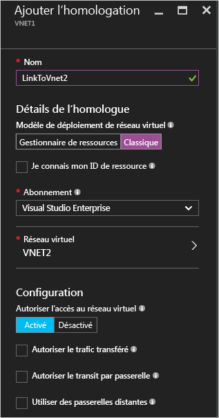
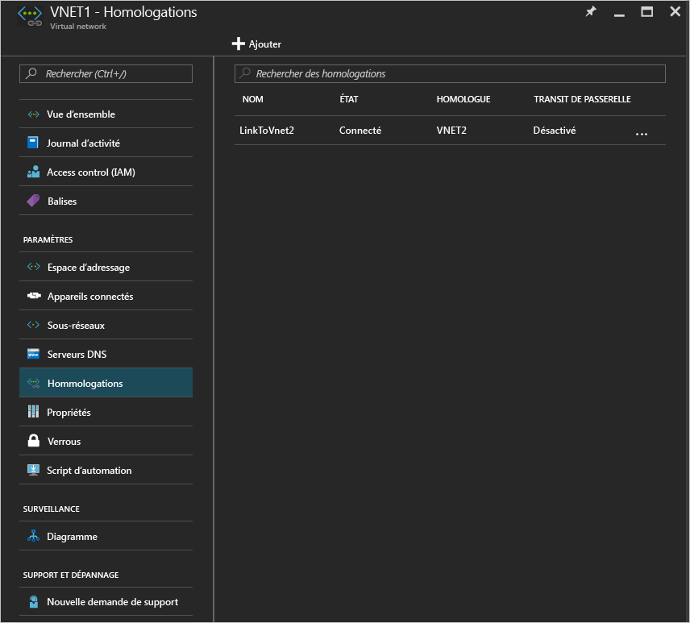

# Créer une homologation de réseaux virtuels à l’aide du portail Azure
[!INCLUDE [virtual-networks-create-vnet-selectors-arm-include](../../includes/virtual-networks-create-vnetpeering-selectors-arm-include.md)]

[!INCLUDE [virtual-networks-create-vnet-intro](../../includes/virtual-networks-create-vnetpeering-intro-include.md)]

[!INCLUDE [virtual-networks-create-vnet-scenario-basic-include](../../includes/virtual-networks-create-vnetpeering-scenario-basic-include.md)]

Pour créer une homologation de réseaux virtuels selon le scénario ci-dessus à l’aide du portail Azure, suivez les étapes ci-dessous.

1. Dans un navigateur, accédez à http://portal.azure.com et, si nécessaire, connectez-vous avec votre compte Azure.
2. Pour établir une homologation de réseaux virtuels, vous devez créer un lien entre deux réseaux virtuels pour chaque direction. Vous pouvez créer tout d’abord le lien d’homologation de réseaux virtuels de VNET1 à VNET2. Dans le portail, cliquez sur **Parcourir** > ** et choisissez Réseaux virtuels**.
   
    
3. Dans le panneau Réseaux virtuels, choisissez VNET1 et cliquez sur Homologations, puis sur Ajouter
   
    
4. Dans le panneau Ajouter l’homologation, nommez le lien d’homologation LinkToVnet2, choisissez l’abonnement et le réseau virtuel homologue VNET2, puis cliquez sur OK.
   
    
5. Une fois ce lien d’homologation de réseaux virtuels créé, l’état du lien apparaît comme suit :
   
    
6. Ensuite, créez le lien d’homologation de réseaux virtuels de VNET2 à VNET1. Dans le panneau Réseaux virtuels, choisissez VNET2, cliquez sur Homologations, puis sur Ajouter
   
    
7. Dans le panneau Ajouter l’homologation, nommez le lien d’homologation LinkToVnet1, choisissez l’abonnement et le réseau virtuel homologue VNET1, puis cliquez sur OK.
   
    
8. Une fois ce lien d’homologation de réseaux virtuels créé, l’état du lien apparaît comme suit :
   
    
9. Vérifiez l’état du lien LinkToVnet2. Celui-ci est à présent également défini sur Connecté.  
   
    
   
   > [!NOTE]
   > L’homologation de réseaux virtuels est établie uniquement si les deux liens sont connectés.
   > 
   > 

Il existe plusieurs propriétés configurables pour chaque lien :

| Option | Description | Default |
|:--- |:--- |:--- |
| AllowVirtualNetworkAccess |Indique si l’espace d’adressage du réseau virtuel homologue doit être inclus dans le cadre de la balise Virtual_network. |Oui |
| AllowForwardedTraffic |Spécifie si le trafic ne provenant pas d’un réseau virtuel homologué est accepté ou rejeté. |Non |
| AllowGatewayTransit |Permet au réseau virtuel homologue d’utiliser votre passerelle de réseau virtuel. |Non |
| UseRemoteGateways |Permet d’utiliser la passerelle de votre réseau virtuel homologue. Une passerelle doit être configurée pour le réseau virtuel homologue et la propriété AllowGatewayTransit doit être sélectionnée. Vous ne pouvez pas utiliser cette option si vous avez une passerelle configurée. |Non |

Chaque lien de l’homologation de réseaux virtuels présente plusieurs des propriétés ci-dessus. Depuis le portail, vous pouvez cliquer sur le lien d’homologation de réseaux virtuels et modifier les options disponibles. Cliquez ensuite sur Enregistrer pour que les changements prennent effet.

[!INCLUDE [virtual-networks-create-vnet-scenario-crosssub-include](../../includes/virtual-networks-create-vnetpeering-scenario-crosssub-include.md)]

1. Dans un navigateur, accédez à http://portal.azure.com et, si nécessaire, connectez-vous avec votre compte Azure.
2. Dans cet exemple, nous allons utiliser deux abonnements A et B et deux utilisateurs A et B disposant de privilèges dans ces abonnements respectifs.
3. Dans le portail, cliquez sur Parcourir et choisissez Réseaux virtuels. Cliquez sur le réseau virtuel, puis sur Ajouter.
   
    
4. Dans le panneau Ajouter un accès ajouter, cliquez sur Sélectionner un rôle et choisissez Collaborateur de réseau. Cliquez sur Ajouter des utilisateurs, tapez le nom de connexion de l’utilisateur B, puis cliquez sur OK.
   
    
   
    Il ne s’agit pas d’une obligation : l’homologation peut être établie si des utilisateurs ont effectué des demandes d’homologation individuelles pour leurs réseaux respectifs, à condition que les demandes correspondent. L’ajout de l’utilisateur privilégié de l’autre réseau virtuel en tant qu’utilisateur du réseau virtuel local facilite la configuration dans le portail.
5. Ensuite, connectez-vous au portail Azure avec le compte de l’utilisateur B, qui est l’utilisateur privilégié de l’abonnement B. Répétez les étapes ci-dessus pour ajouter l’utilisateur A en tant que Collaborateur de réseau.
   
    
   
   > [!NOTE]
   > Vous pouvez vous déconnecter et vous connecter avec les comptes des deux utilisateurs dans le navigateur pour vous assurer que l’autorisation a bien été activée.
   > 
   > 
6. Connectez-vous au portail en tant qu’utilisateur A, accédez au panneau du réseau virtuel VNET3, cliquez sur Homologation, activez la case à cocher Je connais mon ID de ressource, puis tapez l’ID de ressource de VNET5 au format ci-dessous.
   
    /subscriptions/{SubscriptionID}/resourceGroups/{ResourceGroupName}/providers/Microsoft.Network/VirtualNetwork/{VNETname}
   
    
7. Connectez-vous au portail en tant qu’utilisateur B et répétez l’étape ci-dessus pour le lien d’homologation de VNET5 à VNET3.
   
    
8. L’homologation est établie et n’importe quelle machine virtuelle de VNET3 doit pouvoir communiquer avec n’importe quelle machine virtuelle de VNET5.

[!INCLUDE [virtual-networks-create-vnet-scenario-transit-include](../../includes/virtual-networks-create-vnetpeering-scenario-transit-include.md)]

1. Dans un premier temps, créez le lien d’homologation de réseaux virtuels de HubVnet à VNET1. Notez que l’option Autoriser le trafic transféré n’est pas sélectionnée pour ce lien.
   
    
2. Dans un second temps, créez le lien homologation de VNET1 à HubVnet. Notez que l’option Autoriser le trafic transféré est sélectionnée.
   
    
3. Une fois l’homologation établie, vous pouvez vous reporter à [cet article](virtual-network-create-udr-arm-ps.md) et créer un itinéraire défini par l’utilisateur (UDR) pour rediriger le trafic du réseau virtuel VNET1 via une appliance virtuelle afin d’utiliser ses fonctionnalités. Lorsque vous spécifiez l’adresse du tronçon suivant dans l’itinéraire, vous pouvez la définir sur l’adresse IP de l’appliance virtuelle du réseau virtuel homologue HubVNet.

[!INCLUDE [virtual-networks-create-vnet-scenario-asmtoarm-include](../../includes/virtual-networks-create-vnetpeering-scenario-asmtoarm-include.md)]

1. Dans un navigateur, accédez à http://portal.azure.com et, si nécessaire, connectez-vous avec votre compte Azure.
2. Pour établir une homologation de réseaux virtuels dans ce scénario, vous n’avez besoin de créer qu’un seul lien, du réseau virtuel d’Azure Resource Manager à celui du portail Classic, c’est-à-dire de **VNET1** à **VNET2**. Dans le portail, cliquez sur **Parcourir** et choisissez **Réseaux virtuels**.
3. Dans le panneau Réseaux virtuels, choisissez **VNET1**. Cliquez sur **Homologations**, puis sur **Ajouter**.
4. Dans le panneau Ajouter l’homologation, nommez votre lien. Ici, il est appelé **LinkToVNet2**. Sous Détails de l’homologue, sélectionnez **Classique**.
5. Choisissez ensuite l’abonnement et le réseau virtuel homologue **VNET2**. Puis cliquez sur OK.
   
    
6. Une fois ce lien d’homologation de réseaux virtuels créé, les deux réseaux virtuels sont appariés et l’écran suivant est affiché :
   
    

## Supprimer l’homologation de réseaux virtuels
1. Dans un navigateur, accédez à http://portal.azure.com et, si nécessaire, connectez-vous avec votre compte Azure.
2. Accédez au panneau Réseaux virtuels, cliquez sur Homologations, choisissez le lien à supprimer, puis cliquez sur le bouton Supprimer.
   
   
3. Une fois que vous supprimez un lien de l’homologation de réseaux virtuels, l’état du lien d’homologation passe à Disconnected (Déconnecté).
   
    
4. Dans cet état, vous ne pouvez pas recréer le lien tant que l’état du lien d’homologation n’est pas défini sur Initiated (Initialisé). Nous vous recommandons de supprimer les deux liens avant de recréer l’homologation de réseaux virtuels.

<!---HONumber=Nov16_HO2-->

