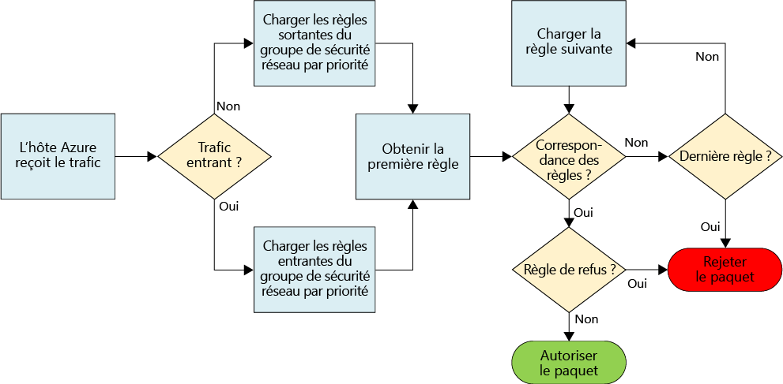
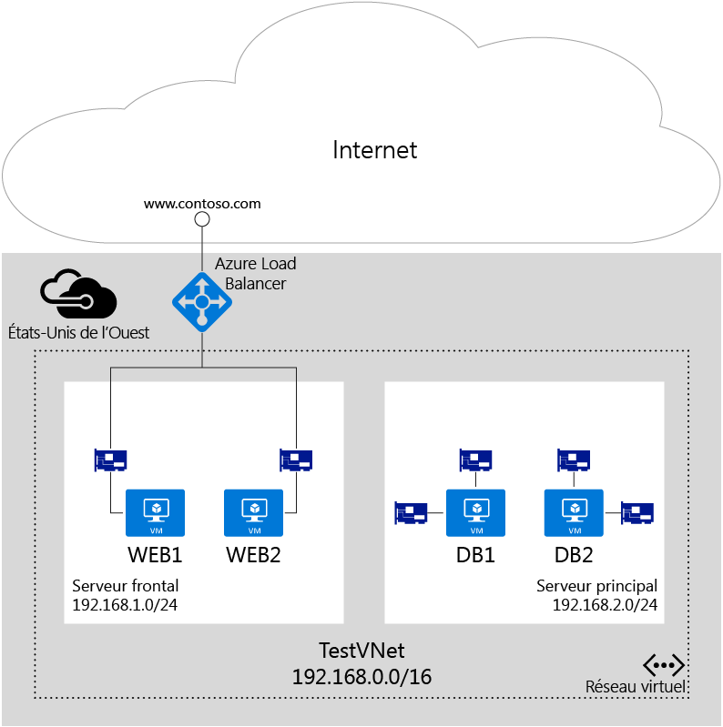

# Filtrer le trafic réseau avec les groupes de sécurité réseau

Un groupe de sécurité réseau (NSG) contient une liste de règles de sécurité qui autorisent ou rejettent le trafic réseau vers les ressources connectées aux réseaux virtuels Azure (VNet). Les NSG peuvent être associés à des sous-réseaux, à des machines virtuelles spécifiques (Classic) ou à des interfaces réseau (NIC) individuelles attachées à des machines virtuelles (Resource Manager). Lorsqu’un NSG est associé à un sous-réseau, les règles s’appliquent à toutes les ressources connectées au sous-réseau. Vous pouvez restreindre davantage le trafic en associant également un NSG à une machine virtuelle ou à une NIC.

> [!NOTE]
> Azure dispose de deux modèles de déploiement différents pour créer et utiliser des ressources : [Resource Manager et classique](../resource-manager-deployment-model.md). Cet article traite des deux modèles, mais Microsoft recommande d’utiliser le modèle Resource Manager dans la plupart des nouveaux déploiements.

## Ressource du groupe de sécurité réseau
Les NSG contiennent les propriétés suivantes :

| Propriété | Description | Contraintes | Considérations |
| --- | --- | --- | --- |
| Name |Nom du groupe de sécurité réseau |Doit être unique dans la région. Peut contenir des lettres, des chiffres, des traits de soulignement, des points et des traits d’union. Doit commencer par une lettre ou un chiffre. Doit se terminer par une lettre, un chiffre ou un trait de soulignement. Ne doit pas dépasser 80 caractères. |Étant donné que vous devrez peut-être créer plusieurs NSG, assurez-vous que vous disposez d’une convention d’affectation de noms qui facilite l’identification de la fonction de vos NSG. |
| Région |[Région](https://azure.microsoft.com/regions) Azure dans laquelle le NSG est créé. |Les NSG ne peuvent être associés qu’à des ressources figurant dans la même région qu’eux. |Pour plus d’informations sur le nombre de NSG dont vous pouvez disposer par région, consultez l’article relatif aux [limites Azure](../azure-subscription-service-limits.md#virtual-networking-limits-classic).|
| Groupe de ressources |[Groupe de ressources](../azure-resource-manager/resource-group-overview.md#resource-groups) dans lequel le NSG existe. |Même si un NSG existe dans un groupe de ressources, il peut être associé aux ressources de n’importe quel groupe de ressources, tant que ces ressources font partie de la même région Azure que le NSG. |Les groupes de ressources permettent de gérer plusieurs ressources conjointement, telles qu’une unité de déploiement. Vous pouvez envisager de regrouper le NSG avec les ressources auxquelles il est associé. |
| Règles |Règles de trafic entrant ou sortant définissant le trafic qui est autorisé ou refusé. | |Consultez la section [Règles de groupe de sécurité réseau](#Nsg-rules) de cet article. |

> [!NOTE]
> Les contrôles d’accès réseau basés sur le point de terminaison et les groupes de sécurité réseau ne sont pas pris en charge sur la même instance de machine virtuelle. Si vous souhaitez utiliser un groupe de sécurité réseau et une ACL de point de terminaison déjà en place, supprimez d’abord l’ACL de point de terminaison. Pour plus d’informations sur la suppression d’une ACL, consultez l’article [Gérer les listes de contrôle d’accès de point de terminaison en utilisant PowerShell](virtual-networks-acl-powershell.md).
> 

### règles de groupe de sécurité réseau
Les règles de groupe de sécurité réseau contiennent les propriétés suivantes :

| Propriété | Description | Contraintes | Considérations |
| --- | --- | --- | --- |
| **Name** |Nom de la règle. |Doit être unique dans la région. Peut contenir des lettres, des chiffres, des traits de soulignement, des points et des traits d’union. Doit commencer par une lettre ou un chiffre. Doit se terminer par une lettre, un chiffre ou un trait de soulignement. Ne doit pas dépasser 80 caractères. |Un NSG pouvant contenir plusieurs règles, veillez à respecter une convention d’affectation de noms qui vous permet d’identifier la fonction de votre règle |
| **Protocole** |Protocole à faire correspondre à la règle. |TCP, UDP ou * |L’utilisation de la valeur * en guise de protocole inclut ICMP (trafic est-ouest uniquement), ainsi qu’UDP et TCP, et peut réduire le nombre de règles dont vous avez besoin. Dans le même temps, l’utilisation de la valeur * peut constituer une approche trop large. Il est donc recommandé de ne l’utiliser qu’en cas de réelle nécessité. |
| **Plage de ports source** |Plage de ports sources à faire correspondre à la règle. |Numéro de port unique compris entre 1 et 65535, plage de ports (par exemple, 1-65535) ou * (pour tous les ports). |Les ports source peuvent être éphémères. Privilégiez l’utilisation de * dans la plupart des cas, sauf si votre programme client utilise un port spécifique. Dans la mesure du possible, essayez d’utiliser des plages de ports pour éviter d’avoir à disposer de plusieurs règles. Il est impossible de regrouper plusieurs ports ou plages de ports à l’aide d’une virgule. |
| **Plage de ports de destination** |Plage de ports de destination à faire correspondre à la règle. |Numéro de port unique compris entre 1 et 65535, plage de ports (par exemple, 1-65535) ou \* (pour tous les ports). |Dans la mesure du possible, essayez d’utiliser des plages de ports pour éviter d’avoir à disposer de plusieurs règles. Il est impossible de regrouper plusieurs ports ou plages de ports à l’aide d’une virgule. |
| **Préfixe d’adresse source** |Préfixe d’adresse source ou balise à faire correspondre à la règle. |Adresse IP unique (par exemple, 10.10.10.10), sous-réseau IP (par exemple, 192.168.1.0/24), [balise par défaut](#default-tags) ou * (pour toutes les adresses). |Envisagez d’utiliser des plages, des balises par défaut et * pour réduire le nombre de règles. |
| **Préfixe d’adresse de destination** |Préfixe d’adresse de destination ou balise à faire correspondre à la règle. | Adresse IP unique (par exemple, 10.10.10.10), sous-réseau IP (par exemple, 192.168.1.0/24), [balise par défaut](#default-tags) ou * (pour toutes les adresses). |Envisagez d’utiliser des plages, des balises par défaut et * pour réduire le nombre de règles. |
| **Direction** |Direction du trafic à faire correspondre à la règle. |Entrant ou sortant. |Les règles de trafic entrant et de trafic sortant sont traitées séparément, en fonction de la direction. |
| **Priorité** |Les règles sont vérifiées dans l’ordre de priorité. Une fois qu’une règle s’applique, plus aucune correspondance de règle n’est testée. | Nombre compris entre 100 et 4096. | Envisagez de créer des règles de passage des priorités par 100 pour chaque règle afin de laisser de la place pour les règles que vous pourriez créer à l’avenir. |
| **Access** |Type d’accès à appliquer si la règle correspond. | Autoriser ou refuser. | N’oubliez pas que si la règle d’autorisation d’un paquet est introuvable, le paquet est abandonné. |

Les NSG contiennent deux ensembles de règles : les règles de trafic entrant et les règles de trafic sortant. La priorité d’une règle doit être unique dans chaque ensemble. 

 

La figure ci-dessus illustre le mode de traitement des règles de NSG.

### Balises par défaut
Les balises par défaut sont des identificateurs fournis par le système pour adresser une catégorie d’adresses IP. Vous pouvez utiliser les balises par défaut dans les propriétés du **préfixe d’adresse source** et du **préfixe d’adresse de destination** de toute règle. Les balises par défaut que vous pouvez utiliser sont au nombre de trois :

* **VirtualNetwork** (Resource Manager) (**VIRTUAL_NETWORK** pour Classic) : cette balise inclut l’espace d’adressage du réseau virtuel (plages CIDR définies dans Azure), ainsi que tous les espaces d’adressage locaux connectés et les réseaux virtuels Azure connectés (réseaux locaux).
* **AzureLoadBalancer** (Resource Manager) (**AZURE_LOADBALANCER** pour Classic) : cette balise désigne l’équilibreur de charge de l’infrastructure Azure. Elle convertit en une adresse IP de centre de données Azure l’emplacement d’où proviennent les sondes d’intégrité d’Azure.
* **Internet** (Resource Manager) (**INTERNET** pour Classic) : cette balise indique l’espace d’adressage IP qui se trouve en dehors du réseau virtuel et est accessible par l’Internet public. La plage inclut [l’espace IP public d’Azure](https://www.microsoft.com/download/details.aspx?id=41653).

### Règles par défaut
Tous les groupes de ressources réseau contiennent un ensemble de règles par défaut. Les règles par défaut ne peuvent pas être supprimées, mais comme la priorité la plus basse leur est attribuée, elles peuvent être remplacées par les règles que vous créez. 

Les règles par défaut autorisent et interdisent le trafic comme suit :
- **Réseau virtuel :** le trafic en provenance et à destination d’un réseau virtuel est autorisé à la fois dans les directions entrante et sortante.
- **Internet :** le trafic sortant est autorisé, mais le trafic entrant est bloqué.
- **Équilibreur de charge :** l’équilibreur de charge d’Azure est autorisé à tester l’intégrité de vos machines virtuelles et instances de rôle. Vous pouvez remplacer cette règle si vous n’utilisez pas un jeu d’équilibrage de la charge.

**Les règles par défaut sont :**

| Name | Priorité | IP Source | Port source | IP de destination | Port de destination | Protocole | Access |
| --- | --- | --- | --- | --- | --- | --- | --- |
| AllowVNetInBound |65 000 | VirtualNetwork | * | VirtualNetwork | * | * | AUTORISER |
| AllowAzureLoadBalancerInBound | 65 001 | AzureLoadBalancer | * | * | * | * | AUTORISER |
| DenyAllInBound |65 500 | * | * | * | * | * | REFUSER |

**Les règles sortantes par défaut sont :**

| Name | Priorité | IP Source | Port source | IP de destination | Port de destination | Protocole | Access |
| --- | --- | --- | --- | --- | --- | --- | --- |
| AllowVnetOutBound | 65 000 | VirtualNetwork | * | VirtualNetwork | * | * | AUTORISER |
| AllowInternetOutBound | 65 001 | * | * | Internet | * | * | AUTORISER |
| DenyAllOutBound | 65 500 | * | * | * | * | * | REFUSER |

## Association de groupe de sécurité réseau
Vous pouvez associer un NSG à des machines virtuelles, à des NIC et à des sous-réseaux, selon le modèle de déploiement que vous utilisez, en procédant comme suit :

* **Machine virtuelle (Classic uniquement) :** les règles de sécurité sont appliquées à l’ensemble du trafic à destination/en provenance de la machine virtuelle. 
* **NIC (Resource Manager uniquement) :** les règles de sécurité sont appliquées à l’ensemble du trafic à destination/en provenance de la NIC à laquelle le NSG est associé. Dans une machine virtuelle dotée de plusieurs NIC, vous pouvez appliquer des NSG différents (ou les mêmes NSG) à chaque NIC individuellement. 
* **Sous-réseau (Resource Manager et Classic) :** les règles de sécurité sont appliquées à l’ensemble du trafic à destination/en provenance des ressources connectées au réseau virtuel.

Vous pouvez associer différents NSG à une machine virtuelle (ou à une NIC, selon le modèle de déploiement) et au sous-réseau auquel la NIC ou la machine virtuelle sont connectées. Les règles de sécurité sont appliquées au trafic par priorité dans chaque NSG, dans l’ordre suivant :

- **Trafic entrant**

  1. **NSG appliqué à un sous-réseau :** si le NSG du sous-réseau dispose d’une règle de correspondance qui refuse le trafic, le paquet est abandonné.

  2. **NSG appliqué à une NIC (Resource Manager) ou à une machine virtuelle (Classic) :** si le NSG de la machine virtuelle/NIC dispose d’une règle de correspondance qui refuse le trafic, les paquets sont abandonnés au niveau de la machine virtuelle\NIC, même si le NSG du sous-réseau comporte une règle de correspondance qui autorise le trafic.

- **Trafic sortant**

  1. **NSG appliqué à une NIC (Resource Manager) ou à une machine virtuelle (Classic) :** si le NSG de la machine virtuelle/NIC dispose d’une règle de correspondance qui refuse le trafic, les paquets sont abandonnés.

  2. **NSG appliqué à un sous-réseau :** si le NSG du sous-réseau dispose d’une règle de correspondance qui refuse le trafic, les paquets sont abandonnés, même si le NSG de la machine virtuelle/NIC comporte une règle de correspondance qui autorise le trafic.

> [!NOTE]
> Bien que vous ne puissiez associer qu’un seul groupe de sécurité réseau à un sous-réseau, une machine virtuelle ou une carte d’interface réseau, vous pouvez associer le même groupe de sécurité réseau au nombre de ressources que vous souhaitez.
>

## Implémentation
Vous pouvez implémenter des NSG dans les modèles de déploiement Resource Manager ou Classic à l’aide des outils suivants :

| Outil de déploiement | Classique | Gestionnaire de ressources |
| --- | --- | --- |
| Portail Azure   | Oui | [Oui](virtual-networks-create-nsg-arm-pportal.md) |
| PowerShell     | [Oui](virtual-networks-create-nsg-classic-ps.md) | [Oui](virtual-networks-create-nsg-arm-ps.md) |
| Azure CLI **V1**   | [Oui](virtual-networks-create-nsg-classic-cli.md) | [Oui](virtual-networks-create-nsg-cli-nodejs.md) |
| Azure CLI **V2**   | Non | [Oui](virtual-networks-create-nsg-arm-cli.md) |
| Modèle Azure Resource Manager   | Non  | [Oui](virtual-networks-create-nsg-arm-template.md) |

## Planification
Avant d’implémenter des groupes de sécurité réseau, vous devez répondre aux questions suivantes :

1. Quels sont les types de ressources à partir ou en direction desquels vous souhaitez filtrer le trafic ? Vous pouvez connecter des ressources telles que des NIC (Resource Manager), des machines virtuelles (Classic), des services cloud, des environnements App Service et VM Scale Sets. 
2. Les ressources en direction ou à partir desquelles vous voulez filtrer le trafic sont-elles connectées à des sous-réseaux de réseaux virtuels existants ?

Pour plus d’informations sur la planification de la sécurité réseau dans Azure, consultez l’article [Services cloud et sécurité réseau](../best-practices-network-security.md). 

## Remarques relatives à la conception
Une fois que vous connaissez les réponses aux questions de la section [Planification](#Planning), consultez les sections ci-après avant de définir vos NSG.

### limites
Il existe des limites concernant le nombre de NSG dont vous pouvez disposer dans un abonnement et le nombre de règles par NSG. Pour plus d’informations sur les limites, voir [Limites d’Azure](../azure-subscription-service-limits.md#networking-limits).

### Conception de réseau virtuel et de sous-réseau
Comme les groupes de sécurité réseau peuvent être appliqués à des sous-réseaux, vous pouvez réduire le nombre de groupes de sécurité réseau en regroupant vos ressources par sous-réseau et en appliquant des groupes de sécurité réseau aux sous-réseaux.  Si vous décidez d’appliquer des groupes de sécurité réseau à des sous-réseaux, il se peut que vous trouviez des réseaux virtuels et les sous-réseaux existants qui n’ont pas été définis avec des groupes de sécurité réseau à l’esprit. Vous pouvez avoir besoin de définir de nouveaux réseaux virtuels et sous-réseaux pour prendre en charge votre conception de NSG et déployer vos nouvelles ressources vers les nouveaux sous-réseaux. Vous pouvez ensuite définir une stratégie de migration pour déplacer des ressources existantes vers les nouveaux sous-réseaux. 

### Règles spéciales
Si vous bloquez le trafic autorisé par les règles ci-après, votre infrastructure ne pourra pas communiquer avec les services Azure essentiels :

* **Adresse IP virtuelle du nœud hôte :** des services d’infrastructure de base tels que DHCP, DNS et l’analyse du fonctionnement sont fournis par le biais de l’adresse IP d’hôte virtualisé 168.63.129.16. Cette adresse IP publique appartient à Microsoft et constitue la seule adresse IP virtualisée utilisée dans toutes les régions à cet effet. Cette adresse IP mappe vers l’adresse IP physique de l’ordinateur (nœud hôte) du serveur qui héberge la machine virtuelle. Le nœud hôte agit en tant que relais DHCP, le programme de résolution récursif DNS et la sonde source de la sonde d’intégrité de l’équilibreur de charge et de la sonde d’intégrité de la machine. Les communications vers cette adresse IP ne constituent pas une attaque.
* **Gestion des licences (Service de gestion de clés) :** les images Windows en cours d’exécution sur les machines virtuelles doivent être acquises sous licence. Pour assurer la gestion des licences, une requête est envoyée aux serveurs hôtes du Service de gestion de clés qui gèrent les requêtes de ce type. La requête est effectuée en sortie par le biais du port 1688.

### Trafic ICMP
Les règles de groupe de sécurité réseau actuelles autorisent uniquement les protocoles *TCP* ou *UDP*. Il n’existe aucune balise spécifique pour *ICMP*. Toutefois, le trafic ICMP est autorisé dans un réseau virtuel par la règle par défaut AllowVNetInBound, qui autorise le trafic à destination et en provenance de n’importe quel port et protocole à l’intérieur du réseau virtuel.

### Sous-réseaux
* Tenez compte du nombre de niveaux que requiert votre charge de travail. Chaque niveau peut être isolé à l’aide d’un sous-réseau, avec un groupe de sécurité réseau appliqué au sous-réseau. 
* Si vous avez besoin d’implémenter un sous-réseau pour une passerelle VPN ou un circuit ExpressRoute, n’appliquez **pas** de NSG à ce sous-réseau. Si vous le faites, la connectivité entre réseaux virtuels ou entre différents locaux risque de ne pas fonctionner. 
* Si vous avez besoin d’implémenter une appliance virtuelle réseau (NVA), connectez cette dernière à son propre sous-réseau et créez des itinéraires définis par l’utilisateur (UDR) à destination et en provenance de la NVA. Vous pouvez implémenter un niveau de sous-réseau groupe de sécurité réseau pour filtrer le trafic vers et depuis ce sous-réseau. Pour plus d’informations sur les UDR, consultez l’article [Itinéraires définis par l’utilisateur](virtual-networks-udr-overview.md).

### Équilibreurs de charge
* Considérez les règles d’équilibrage de charge et de traduction d’adresses réseau (NAT) relatives à chaque équilibreur de charge utilisé par chacune de vos charges de travail. Les règles NAT sont liées à un pool principal qui contient des instances de rôle NIC (Resource Manager) ou machines virtuelles/services cloud (Classic). Envisagez de créer un NSG pour chaque pool principal, ce qui autorise uniquement le trafic mappé par le biais des règles implémentées dans les équilibreurs de charge. La création d’un NSG pour chaque pool principal garantit que le trafic entrant dans le pool principal directement (plutôt que par l’intermédiaire de l’équilibreur de charge) est également filtré.
* Dans les déploiements classiques, vous pouvez créer des points de terminaison qui mappent des ports d’un équilibreur de charge sur des ports sur vos machines virtuelles ou instances de rôle. Vous pouvez également créer votre propre équilibreur de charge public individuel par le biais de Resource Manager. Le port de destination pour le trafic entrant est le port réel de la machine virtuelle ou de l’instance de rôle, et non le port exposé par un équilibreur de charge. Le port et l’adresse source de connexion à la machine virtuelle sont un port et une adresse sur l’ordinateur distant sur Internet, et non le port et l’adresse exposés par l’équilibreur de charge.
* Lorsque vous créez des NSG pour filtrer le trafic transitant par un équilibreur de charge interne, le port et la plage d’adresses sources appliqués sont ceux de l’ordinateur d’origine, et non de l’équilibreur de charge. Le port et la plage d’adresses de destination sont ceux de l’ordinateur de destination, et non de l’équilibrage de charge.

### Autres
* Les listes de contrôle d’accès (ACL) basées sur le point de terminaison et les NSG ne sont pas pris en charge sur la même instance de machine virtuelle. Si vous souhaitez utiliser un groupe de sécurité réseau et une ACL de point de terminaison déjà en place, supprimez d’abord l’ACL de point de terminaison. Pour plus d’informations sur la procédure de suppression d’une ACL de point de terminaison, consultez l’article [Gérer les listes de contrôle d’accès de point de terminaison](virtual-networks-acl-powershell.md).
* Dans Resource Manager, vous pouvez utiliser un NSG associé à une NIC pour les machines virtuelles contenant plusieurs NIC afin d’autoriser une gestion (accès à distance) par NIC. L’association de NSG uniques à chaque NIC permet de séparer les types de trafics entre les NIC.
* Comme en cas d’utilisation des équilibreurs de charge, lorsque vous filtrez le trafic vers d’autres réseaux virtuels, vous devez utiliser la plage d’adresses source de l’ordinateur distant, et non la passerelle qui connecte les réseaux virtuels.
* De nombreux services Azure ne peuvent pas être connectés à des réseaux virtuels. Si une ressource Azure n’est pas connectée à un réseau virtuel, vous ne pouvez pas utiliser de NSG pour filtrer le trafic vers la ressource.  Pour déterminer si les services que vous utilisez peuvent ou non être connectés à un réseau virtuel, consultez la documentation de ces services.

## Exemple de déploiement
Pour illustrer la mise en application des informations de cet article, examinons un scénario courant d’une application à deux niveaux représenté dans la figure ci-après :

Comme illustré dans le diagramme, les machines virtuelles *Web1* et *Web2* sont connectées au sous-réseau *FrontEnd*, et les machines virtuelles *DB1* et *DB2* sont connectées au sous-réseau *BackEnd*.  Les deux sous-réseaux font partie du réseau virtuel *TestVNet* . Chaque composant d’application s’exécute dans une machine virtuelle Azure connectée à un réseau virtuel. Ce scénario comporte les exigences suivantes :

1. Séparation du trafic entre les serveurs WEB et de base de données (DB)
2. Règles d’équilibrage de charge transférant le trafic en provenance de l’équilibreur de charge vers tous les serveurs web sur le port 80
3. Règles NAT d’équilibreur de charge transférant le trafic entrant dans l’équilibreur de charge sur le port 50001 vers le port 3389 de la machine virtuelle WEB1
4. Aucun accès aux machines virtuelles frontales ou principales à partir d’Internet, à l’exception des exigences 2 et 3.
5. Aucun accès Internet sortant à partir des serveurs WEB ou de base de données
6. Accès à partir du sous-réseau FrontEnd autorisé vers le port 3389 de n’importe quel serveur web
7. Accès à partir du sous-réseau FrontEnd autorisé vers le port 3389 de n’importe quel serveur de base de données
8. Accès à partir du sous-réseau FrontEnd autorisé vers le port 1433 de tous les serveurs de base de données
9. Séparation du trafic de gestion (port 3389) et du trafic de base de données (1433) sur les différentes NIC des serveurs de base de données

Les exigences 1 à 6 (à l’exception des exigences 3 et 4) sont toutes limitées aux espaces de sous-réseau. Les NSG ci-après répondent aux exigences précédentes, tout en minimisant le nombre de NSG requis :

### FrontEnd
**Règles de trafic entrant**

| Règle | Access | Priorité | Plage d’adresses source | Port source | Plage d’adresses de destination | Port de destination | Protocole |
| --- | --- | --- | --- | --- | --- | --- | --- |
| Allow-Inbound-HTTP-Internet | AUTORISER | 100 | Internet | * | * | 80 | TCP |
| Allow-Inbound-RDP-Internet | AUTORISER | 200 | Internet | * | * | 3389 | TCP |
| Deny-Inbound-All | REFUSER | 300 | Internet | * | * | * | TCP |

**Règles de trafic sortant**

| Règle | Access | Priorité | Plage d’adresses source | Port source | Plage d’adresses de destination | Port de destination | Protocole |
| --- | --- | --- | --- | --- | --- | --- | --- |
| Deny-Internet-All |REFUSER |100 | * | * | Internet | * | * |

### BackEnd
**Règles de trafic entrant**

| Règle | Access | Priorité | Plage d’adresses source | Port source | Plage d’adresses de destination | Port de destination | Protocole |
| --- | --- | --- | --- | --- | --- | --- | --- |
| Deny-Internet-All | REFUSER | 100 | Internet | * | * | * | * |

**Règles de trafic sortant**

| Règle | Access | Priorité | Plage d’adresses source | Port source | Plage d’adresses de destination | Port de destination | Protocole |
| --- | --- | --- | --- | --- | --- | --- | --- |
| Deny-Internet-All | REFUSER | 100 | * | * | Internet | * | * |

Les NSG ci-après sont créés et associés aux NIC des machines virtuelles suivantes :

### WEB1
**Règles de trafic entrant**

| Règle | Access | Priorité | Plage d’adresses source | Port source | Plage d’adresses de destination | Port de destination | Protocole |
| --- | --- | --- | --- | --- | --- | --- | --- |
| Allow-Inbound-RDP-Internet | AUTORISER | 100 | Internet | * | * | 3389 | TCP |
| Allow-Inbound-HTTP-Internet | AUTORISER | 200 | Internet | * | * | 80 | TCP |

> [!NOTE]
> La plage d’adresses source relative aux règles précédente correspond à **Internet**, et non à l’adresse IP virtuelle de l’équilibreur de charge. Le port source est *, et non 500001. Les règles NAT relatives aux équilibreurs de charge sont différentes des règles de sécurité de NSG. Les règles de sécurité de NSG sont toujours associées à la source d’origine et à la destination finale du trafic, et **NON** à l’équilibreur de charge entre les deux. 
> 
> 

### WEB2
**Règles de trafic entrant**

| Règle | Access | Priorité | Plage d’adresses source | Port source | Plage d’adresses de destination | Port de destination | Protocole |
| --- | --- | --- | --- | --- | --- | --- | --- |
| Deny-Inbound-RDP-Internet | REFUSER | 100 | Internet | * | * | 3389 | TCP |
| Allow-Inbound-HTTP-Internet | AUTORISER | 200 | Internet | * | * | 80 | TCP |

### Serveurs de base de données (NIC de gestion)
**Règles de trafic entrant**

| Règle | Access | Priorité | Plage d’adresses source | Port source | Plage d’adresses de destination | Port de destination | Protocole |
| --- | --- | --- | --- | --- | --- | --- | --- |
| Allow-Inbound-RDP-Front-end | AUTORISER | 100 | 192.168.1.0/24 | * | * | 3389 | TCP |

### Serveurs de base de données (NIC du trafic de base de données)
**Règles de trafic entrant**

| Règle | Access | Priorité | Plage d’adresses source | Port source | Plage d’adresses de destination | Port de destination | Protocole |
| --- | --- | --- | --- | --- | --- | --- | --- |
| Allow-Inbound-SQL-Front-end | AUTORISER | 100 | 192.168.1.0/24 | * | * | 1433 | TCP |

Étant donné que certains NSG sont associés à des NIC spécifiques, les règles s’appliquent aux ressources déployées par le biais de Resource Manager. Les règles sont combinées pour le sous-réseau et la NIC, selon leur mode d’association. 

## Étapes suivantes
* [Déployer les NSG (Resource Manager)](virtual-networks-create-nsg-arm-pportal.md)
* [Déployer les NSG (Classic)](virtual-networks-create-nsg-classic-ps.md)
* [Gestion des journaux de groupe de sécurité réseau](virtual-network-nsg-manage-log.md).
* [Résoudre les problèmes relatifs aux NSG] (virtual-network-nsg-troubleshoot-portal.md)
