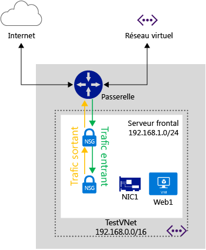

<properties 
   pageTitle="Présentation du groupe de sécurité réseau"
   description="En savoir plus sur les groupes de sécurité réseau"
   services="virtual-network"
   documentationCenter="na"
   authors="telmosampaio"
   manager="carolz"
   editor="tysonn" />
<tags 
   ms.service="virtual-network"
   ms.devlang="na"
   ms.topic="article"
   ms.tgt_pltfrm="na"
   ms.workload="infrastructure-services"
   ms.date="09/22/2015"
   ms.author="telmos" />

# Présentation du groupe de sécurité réseau

Vous pouvez utiliser un groupe de sécurité réseau pour contrôler le trafic vers une ou plusieurs instances de machine virtuelle dans votre réseau virtuel. Un groupe de sécurité réseau contient les règles de contrôle d’accès qui autorisent ou refusent le trafic en fonction de la direction du trafic, du protocole, de l’adresse et du port source ainsi que de l’adresse et du port de destination. Les règles d'un groupe de sécurité réseau peuvent être modifiées à tout moment et les modifications sont appliquées à toutes les instances associées.

>[AZURE.WARNING]Les groupes de sécurité réseau peuvent uniquement être utilisés dans les réseaux virtuels régionaux. Si vous tentez de sécuriser les points de terminaison dans un déploiement sans un réseau virtuel, ou qui utilise un réseau virtuel associé à un groupe d’affinités, consultez la rubrique [Qu’est-ce qu’une liste de contrôle d’accès (ACL) de point de terminaison ?](./virtual-networks-acl.md). Vous pouvez également [migrer votre réseau virtuel vers un réseau virtuel régional](./virtual-networks-migrate-to-regional-vnet.md).

La figure ci-dessus illustre un réseau virtuel avec deux sous-réseaux, avec un groupe de sécurité réseau associé à chaque sous-réseau pour le contrôle du trafic.

>[AZURE.NOTE]Les contrôles d’accès réseau basés sur le point de terminaison et les groupes de sécurité réseau ne sont pas pris en charge sur la même instance de machine virtuelle. Si vous souhaitez utiliser un groupe de sécurité réseau et une ACL de point de terminaison déjà en place, supprimez d'abord l’ACL de point de terminaison. Pour en savoir plus sur cette procédure, consultez [Gestion des listes de contrôle d’accès (ACL) pour les points de terminaison à l’aide de PowerShell](virtual-networks-acl-powershell.md).

## Fonctionnement du groupe de sécurité réseau

Les groupes de sécurité réseau sont différents des ACL basées sur le point de terminaison. Les ACL de point de terminaison fonctionnent uniquement sur le port public qui est exposé via le point de terminaison d'entrée. Un groupe de sécurité réseau fonctionne sur une ou plusieurs instances de machine virtuelle et contrôle tout le trafic entrant et sortant sur la machine virtuelle.

Un groupe de sécurité du réseau a un *Nom*, est associé à un *Région* et a une étiquette descriptive. Il contient deux types de règles : **Entrant** et **Sortant**. Les règles de trafic entrant sont appliquées aux paquets entrants sur une machine virtuelle et les règles de trafic sortant sont appliquées aux paquets sortants à partir de la machine virtuelle. Les règles sont appliquées sur l'hôte où se trouve la machine virtuelle. Un paquet entrant ou sortant doit correspondre à une règle **Autoriser** pour avoir l’autorisation, autrement il sera supprimé.

Les règles sont traitées dans l'ordre de priorité. Par exemple, une règle avec un numéro de priorité inférieur (par exemple, 100) est traitée avant les règles avec une priorité plus élevée (par exemple, 200). Une fois qu'une correspondance est trouvée, aucune autre règle n'est traitée.

Une règle spécifie les éléments suivants :

- **Nom :** un identificateur unique pour la règle

- **Type :** entrant et sortant

- **Priorité :** <You can specify an integer between 100 and 4096>

- **Adresse IP source :** CIDR de plage d'IP source

- **Plage de ports source :** <integer or range between 0 and 65536>

- **Plage d’adresses IP de destination :** CIDR de la plage d'adresses IP de destination

- **Plage de ports de destination :** <integer or range between 0 and 65536>

- **Protocole :** < TCP, UDP ou « * » est autorisé >

- **Accès :** autoriser/refuser

### Règles par défaut

Un groupe de sécurité réseau contient des règles par défaut. Les règles par défaut ne peuvent pas être supprimées, mais comme la priorité la plus basse leur est attribuée, elles peuvent être remplacées par les règles que vous créez. Les règles par défaut décrivent les paramètres par défaut recommandés par la plateforme. Comme illustré par les règles par défaut ci-dessous, le trafic d’origine et de fin d’un réseau virtuel est autorisé à la fois dans les directions entrante et sortante.

Tandis que la connectivité à Internet est autorisée pour la direction sortante, elle est bloquée par défaut pour la direction entrante. Il existe une règle par défaut pour autoriser l'équilibreur de charge d’Azure pour tester l'intégrité de la machine virtuelle. Vous pouvez remplacer cette règle si la machine virtuelle ou l'ensemble de machines virtuelles sous le groupe de sécurité réseau n'est pas inclus dans le jeu d'équilibrage de charge.

Les règles par défaut sont :

**Trafic entrant**

| Nom | Priorité | IP Source | Port source | IP de destination | Port de destination | Protocole | Access |
|-----------------------------------|----------|--------------------|-------------|-----------------|------------------|----------|--------|
| AUTORISER LE TRAFIC ENTRANT DU RÉSEAU VIRTUEL | 65 000 | VIRTUAL\_NETWORK | * | VIRTUAL\_NETWORK | * | * | AUTORISER |
| AUTORISER LE TRAFIC ENTRANT DE L'ÉQUILIBRAGE DE CHARGE AZURE | 65 001 | AZURE\_LOADBALANCER | * | * | * | * | AUTORISER |
| REFUSER TOUT TRAFIC ENTRANT | 65 500 | * | * | * | * | * | REFUSER |

**Trafic sortant**

| Nom | Priorité | IP Source | Port source | IP de destination | Port de destination | Protocole | Access |
|-------------------------|----------|-----------------|-------------|-----------------|------------------|----------|--------|
| AUTORISER LE TRAFIC SORTANT DU RÉSEAU VIRTUEL | 65 000 | VIRTUAL\_NETWORK | * | VIRTUAL\_NETWORK | * | * | AUTORISER |
| AUTORISER LE TRAFIC SORTANT D’INTERNET | 65 001 | * | * | INTERNET | * | * | AUTORISER |
| REFUSER TOUT TRAFIC SORTANT | 65 500 | * | * | * | * | * | REFUSER |

### Balises par défaut

Les balises par défaut sont des identificateurs fournis par le système pour adresser une catégorie d'adresses IP. Les balises par défaut peuvent être spécifiées dans les règles définies par le client. Les balises par défaut sont les suivantes :

- **VIRTUAL\_NETWORK :** cette balise par défaut indique tous les espaces d'adressage de votre réseau. Il inclut l'espace d'adressage du réseau virtuel (IP CIDR dans Azure), ainsi que tout espace d'adressage local connecté (réseaux locaux). Cela inclut également réseau virtuel pour les espaces d'adressage de réseau virtuel.

- **AZURE\_LOADBALANCER :** cette balise par défaut indique l'équilibrage de charge de l'infrastructure d'Azure. Il convertit en une adresse IP de centre de données Azure l’emplacement d’où proviennent les sondes d’intégrité d'Azure. Cela est nécessaire uniquement si la machine virtuelle ou un ensemble de machines virtuelles associées au groupe de sécurité réseau fait partie d'un jeu d'équilibrage de charge.

- **INTERNET :** cette balise par défaut indique l'espace d'adresse IP qui se trouve en dehors du réseau virtuel et est accessible par l'Internet public. Cette plage inclut espace IP public d’Azure.

### Trafic ICMP

Les règles de groupe de sécurité réseau actuelles autorisent uniquement les protocoles *TCP* ou *UDP*. Il n’existe aucune balise spécifique pour *ICMP*. Toutefois, le trafic ICMP est autorisé dans un réseau virtuel par défaut via les règles de trafic entrant du réseau virtuel qui autorisent le trafic de/vers n’importe quel port et protocole dans le réseau virtuel.

## Association de groupe de sécurité réseau

Vous pouvez associer un groupe de sécurité réseau aux machines virtuelles, cartes d’interface réseau et sous-réseaux.

- **Association d’un groupe de sécurité réseau à une machine virtuelle.** Lorsque vous associez un groupe de sécurité réseau à une machine virtuelle, les règles d’accès réseau du groupe de sécurité réseau sont appliquées à tout le trafic à destination et en provenance de la machine virtuelle. 

- **Association d’un groupe de sécurité réseau à une carte d’interface réseau.** Lorsque vous associez un groupe de sécurité réseau à une carte réseau, les règles d’accès réseau du groupe de sécurité réseau sont appliquées uniquement à cette carte d’interface réseau. Cela signifie que dans une machine virtuelle dotée de plusieurs cartes d’interface réseau, si un groupe de sécurité réseau est appliqué à une seule carte d’interface réseau, il n’affecte pas le trafic lié à ses cartes d’interface réseau.

- **Association d’un groupe de sécurité réseau à un sous-réseau**. Lorsqu’un groupe de sécurité réseau est associé à un sous-réseau, les règles d’accès réseau dans le groupe de sécurité réseau sont appliquées à toutes les machines virtuelles dans le sous-réseau.

Vous pouvez associer différents groupes de sécurité réseau à une machine virtuelle, une carte d’interface réseau utilisée par la machine virtuelle et le sous-réseau auquel la carte d’interface réseau est liée. Lorsque cela se produit, toutes les règles d’accès réseau sont appliquées au trafic dans l’ordre suivant :

- **Trafic entrant**
	1. Groupe de sécurité réseau du sous-réseau.
	2. Groupe de sécurité réseau de la carte d’interface réseau.
	3. Groupe de sécurité réseau de la machine virtuelle.
- **Trafic sortant**
	1. Groupe de sécurité réseau de la machine virtuelle.
	2. Groupe de sécurité réseau de la carte d’interface réseau.
	3. Groupe de sécurité réseau du sous-réseau.

>[AZURE.NOTE]Bien que vous ne puissiez associer qu’un seul groupe de sécurité réseau à un sous-réseau, une machine virtuelle ou une carte d’interface réseau, vous pouvez associer le même groupe de sécurité réseau au nombre de ressources que vous souhaitez.

## Remarques relatives à la conception

Lorsque vous concevez vos groupes de sécurité réseau, vous devez comprendre comment les machines virtuelles interagissent avec les services d’infrastructure et les services PaaS hébergés dans Azure. La plupart des services PaaS Microsoft Azure, comme les bases de données et le stockage SQL sont accessibles uniquement via une adresse Internet publique. Cela est également vrai pour les sondes d’équilibrage de charge.

Un scénario courant dans Azure est la ségrégation des rôles de machines virtuelles et PaaS dans les sous-réseaux en fonction de la nécessité pour ces objets d’accéder à Internet. Dans ce scénario, vous disposez par exemple d’un sous-réseau avec des machines virtuelles ou des instances de rôle qui nécessitent un accès aux services PaaS Azure, comme les bases de données et le stockage SQL, mais ce sous-réseau ne requiert aucune communication entrante ou sortante avec l’Internet public.

Imaginez la règle de groupe de sécurité réseau suivante pour un tel scénario :

| Nom | Priorité | IP Source | Port source | IP de destination | Port de destination | Protocole | Access |
|------|----------|-----------|-------------|----------------|------------------|----------|--------|
|PAS D’INTERNET|100| VIRTUAL\_NETWORK|&#42;|INTERNET|&#42;|TCP|REFUSER| 

Étant donné que la règle bloque tout accès de ce réseau virtuel à Internet , les machines virtuelles ne pourront pas accéder aux services PaaS Azure qui nécessitent un point de terminaison Internet public, comme les bases de données SQL.

Au lieu d’utiliser une règle de refus, envisagez d’utiliser une règle autorisant l’accès à Internet à partir du réseau virtuel, mais refusant l’accès au réseau virtuel à partir d’Internet, comme représenté ci-dessous :

| Nom | Priorité | IP Source | Port source | IP de destination | Port de destination | Protocole | Access |
|------|----------|-----------|-------------|----------------|------------------|----------|--------|
|VERS INTERNET|100| VIRTUAL\_NETWORK|&#42;|INTERNET|&#42;|TCP|AUTORISER|
|À PARTIR D’INTERNET|110| INTERNET|&#42;|VIRTUAL\_NETWORK|&#42;|TCP|REFUSER| 

>[AZURE.WARNING]Azure utilise un sous-réseau spécial appelé sous-réseau **Passerelle** pour gérer la passerelle VPN sur d’autres réseaux virtuels et réseaux locaux. Si vous associez un NSG à ce sous-réseau, votre passerelle VPN cessera de fonctionne normalement. N’associez pas de NSG aux sous-réseaux de passerelle.

Vous devez également tenir compte des règles spéciales répertoriées ci-dessous. Assurez-vous que vous ne bloquez pas le trafic autorisé par ces règles, sinon votre infrastructure ne sera pas en mesure de communiquer avec des services Azure essentiels.

- **Adresse IP virtuelle du nœud hôte :** des services d’infrastructure de base tels que DHCP, DNS et l’analyse du fonctionnement sont fournis via l'adresse IP d’hôte virtualisé 168.63.129.16. Cette adresse IP publique appartient à Microsoft et la seule adresse IP virtualisée utilisée dans toutes les régions à cet effet. Cette adresse IP mappe vers l'adresse IP physique de l’ordinateur (nœud hôte) du serveur qui héberge la machine virtuelle. Le nœud hôte agit en tant que relais DHCP, le programme de résolution récursif DNS et la sonde source de la sonde d’intégrité de l’équilibreur de charge et de la sonde d’intégrité de la machine. La communication à cette adresse IP ne doit pas être considérée comme une attaque.

- **Gestion des licences (service de gestion de clés) :** les images Windows en cours d'exécution sur les machines virtuelles doivent être acquises sous licence. Pour cela, une demande de licence est envoyée aux serveurs hôtes du service de gestion de clés qui gèrent ces requêtes. Ce sera toujours sur le port 1688 sortant.

## Limites

Vous devez tenir compte des limites suivantes en concevant vos groupes de sécurité réseau.

|**Description**|**Limite**|
|---|---|
|Nombre de groupes de sécurité réseau que vous pouvez associer à un sous-réseau, une machine virtuelle ou une carte réseau|1|
|Groupes de sécurité réseau par région et par abonnement|100|
|Règles de groupe de sécurité réseau par groupe de sécurité réseau|200|

Assurez-vous que vous pouvez afficher toutes les [limites liées aux services de mise en réseau dans Azure](../azure-subscription-service-limits/#networking-limits) avant de concevoir votre solution.

## Étapes suivantes

- [Déploiement des groupes de sécurité réseau dans le modèle de déploiement classique](virtual-networks-create-nsg-classic-ps.md).
- [Déploiement des groupes de sécurité réseau dans le Gestionnaire de ressources](virtual-networks-create-nsg-arm-pportal.md).

<!---HONumber=Oct15_HO1-->