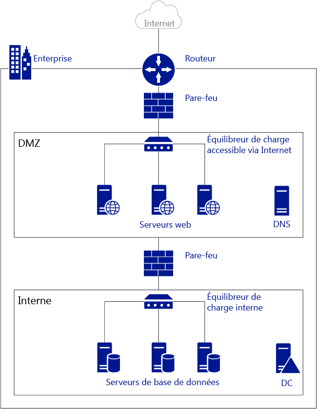
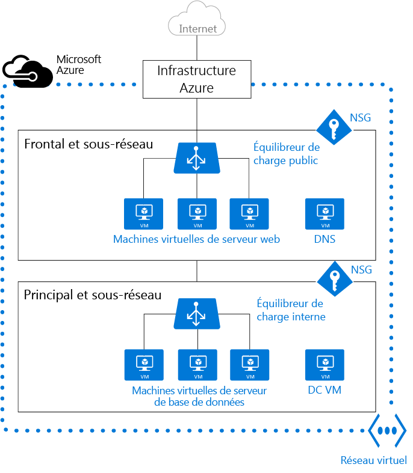

<properties
   pageTitle="Présentation du réseau virtuel (VNet) Azure"
   description="En savoir plus sur les réseaux virtuels dans Azure."
   services="virtual-network"
   documentationCenter="na"
   authors="telmosampaio"
   manager="carolz"
   editor="tysonn" />
<tags
   ms.service="virtual-network"
   ms.devlang="na"
   ms.topic="article"
   ms.tgt_pltfrm="na"
   ms.workload="infrastructure-services"
   ms.date="08/05/2015"
   ms.author="telmos" />

# Présentation du réseau virtuel

Un réseau virtuel Azure (VNet) est une représentation de votre propre réseau dans le cloud. Vous pouvez contrôler les paramètres de votre réseau Azure et définir les blocs d’adresses DHCP, les paramètres DNS, les stratégies de sécurité et le routage. Vous pouvez également segmenter votre réseau en sous-réseaux et déployer les machines virtuelles IaaS Azure et les instances de rôle PaaS, dans la même manière que pour le déploiement physique et le déploiement des machines virtuelles vers votre centre de données local. En bref, vous pouvez développer votre réseau sur Azure, en utilisant vos propres blocs d’adresses IP.

Pour mieux comprendre les réseaux virtuels, examinez la figure ci-dessous, qui illustre un réseau local simplifié.

La figure ci-dessus illustre un réseau local connecté à l’Internet public via un routeur. Vous pouvez également voir un pare-feu entre le routeur et une zone DMZ qui héberge un serveur DNS et une batterie de serveurs web. La batterie de serveurs web est équilibrée à l’aide d’un équilibreur de charge matériel qui est exposé à Internet et consomme des ressources à partir du sous-réseau interne. Le sous-réseau interne est séparé de la zone DMZ par un autre pare-feu et héberge les serveurs de contrôleur de domaine Active Directory, les serveurs de base de données et serveurs d’applications.

Le même réseau peut être hébergé dans Azure, comme illustré sur la figure ci-dessous.

Notez comment l’infrastructure Azure prend le rôle de routeur, autorisant votre routeur de réseau virtuel à accéder à l’Internet public sans aucune configuration. Les pare-feu peuvent être remplacés par des groupes de sécurité réseau (NSG) appliqués à chaque sous-réseau individuel. Et les équilibreurs de charge physiques sont remplacés par des équilibreurs de charge internes et accessibles via internet dans Azure.

## Réseaux virtuels

Les réseaux virtuels fournissent les services suivants pour les machines virtuelles IaaS et les instances de rôle PaaS déployées :

- **Isolement**. Les réseaux virtuels sont totalement isolés les uns des autres. Cela vous permet de créer des réseaux virtuels distincts pour le développement, le test et la production, qui utilisent les mêmes blocs d’adresses CIDR.

- **Relation d’imbrication**. Les réseaux virtuels ne peuvent pas couvrir plusieurs régions Azure.

    >[AZURE.NOTE]Il existe deux modes de déploiement dans Azure : classique (également appelé Service Management) et Azure Resource Manager (ARM). Les réseaux virtuels classiques peuvent être ajoutés à un groupe d’affinités ou créés en tant que réseau virtuel régional. Si vous avez un réseau virtuel dans un groupe d’affinités, il est recommandé de [migrer vers un réseau virtuel régional](./virtual-networks-migrate-to-regional-vnet.md).

- **Accès à l’Internet public**. Toutes les machines virtuelles IaaS et les instances de rôle PaaS d’un réseau virtuel ont, par défaut, accès à l’Internet public. Vous pouvez contrôler l’accès grâce aux groupes de sécurité réseau (NSG).

- **Accès aux machines virtuelles dans le réseau virtuel**. Les machines virtuelles IaaS et les instances de rôle PaaS peuvent se connecter les unes aux autres dans un même réseau virtuel, même si elles se trouvent dans des sous-réseaux différents, sans qu’une passerelle soit configurée ou sans utiliser d’adresses IP publiques. Ainsi, vos environnements PaaS et IaaS sont réunis.

- **Résolution de noms**. Azure fournit la résolution de noms interne pour les machines virtuelles IaaS et les instances de rôle PaaS déployées dans votre réseau virtuel. Vous pouvez également déployer vos propres serveurs DNS et configurer le réseau virtuel pour les utiliser.

- **Connectivité**. Les réseaux virtuels peuvent être connectés entre eux et même à votre centre de données local, en utilisant une connexion VPN de site à site ou une connexion ExpressRoute. Pour en savoir plus sur les passerelles VPN, Consultez [À propos des passerelles VPN](./vpn-gateway-about-vpngateways.md). Pour plus d’informations sur ExpressRoute, consultez [Présentation technique d’ExpressRoute](./expressroute-introduction.md).

    >[AZURE.NOTE]Assurez-vous de créer un réseau virtuel avant de déployer des machines virtuelles IaaS ou des instances de rôle PaaS dans votre environnement Azure. Les machines virtuelles sur ARM requièrent un réseau virtuel et, si vous ne spécifiez pas de réseau virtuel existant, Azure crée un réseau virtuel par défaut dont le bloc d’adresses CIDR peut entrer en conflit avec votre réseau local. Ce qui empêche la connexion de votre réseau virtuel à votre réseau local.

## Sous-réseaux

Vous pouvez diviser votre réseau virtuel en plusieurs sous-réseaux pour plus de sécurité et une meilleure organisation. Les sous-réseaux d’un réseau virtuel peuvent communiquer entre eux, sans configuration supplémentaire. Vous pouvez également modifier les paramètres de routage au niveau du sous-réseau et appliquer des NSG aux sous-réseaux.

## Adresses IP

Il existe deux types d’adresses IP assignées aux composants dans Azure : publiques et privées. Les machines virtuelles IaaS et les instances de rôle PaaS déployées sur un sous-réseau Azure reçoivent automatiquement une adresse IP privée pour chacune de leurs cartes réseau en fonction des blocs d’adresses CIDR affectés à vos sous-réseaux. Vous pouvez également attribuer une adresse IP publique à vos machines virtuelles IaaS et vos instances de rôle PaaS.

Ces adresses IP sont dynamiques, ce qui signifie qu’elles peuvent changer à tout moment. Vous pouvez vous assurer que l’adresse IP pour certains services reste toujours la même. Pour ce faire, vous pouvez réserver une adresse IP et la rendre statique.

## Équilibreurs de charge Azure

Vous pouvez utiliser deux types d’équilibreurs de charge dans Azure :

- **Équilibreur de charge externe** Vous pouvez utiliser un équilibreur de charge externe pour fournir une haute disponibilité pour les machines virtuelles IaaS et les instances de rôle PaaS accessibles depuis l’Internet public.

- **Équilibreur de charge interne**. Vous pouvez utiliser un équilibreur de charge interne pour fournir une haute disponibilité pour les machines virtuelles IaaS et les instances de rôle PaaS accessibles depuis d’autres services sur votre réseau virtuel.

Pour en savoir plus sur l’équilibrage de charge dans Azure, visitez [Présentation de l’équilibreur de charge](../load-balancer-overview.md).

## Groupes de sécurité réseau (NSG)

Vous pouvez créer des NSG afin de contrôler l’accès entrant et sortant aux interfaces réseau (cartes réseau), aux machines virtuelles et aux sous-réseaux. Chaque NSG contient une ou plusieurs règles spécifiant si le trafic est accepté ou refusé en fonction de l’adresse IP source, du port source, de l’adresse IP de destination et du port de destination. Pour en savoir plus sur les groupes de sécurité réseau, consultez [Qu’est-ce qu’un groupe de sécurité réseau ?](../virtual-networks-nsg.md).

## Appliances virtuelles

Une appliance virtuelle est simplement une autre machine virtuelle dans votre réseau virtuel qui exécute une fonction d’équipement en fonction des logiciels, comme un pare-feu, l’optimisation du réseau étendu ou la détection d’intrusion. Vous pouvez créer un itinéraire dans Azure pour acheminer le trafic de votre réseau virtuel via une appliance virtuelle pour utiliser ses fonctionnalités.

Par exemple, les NSG peuvent être utilisés pour assurer la sécurité sur votre réseau virtuel. Toutefois, les NSG fournissent la liste de contrôle d’accès de couche 4 pour les paquets entrants et sortants. Si vous souhaitez utiliser un modèle de sécurité de couche 7, vous devez utiliser une appliance de pare-feu.

Les appliances virtuelles dépendent des [itinéraires définis par l’utilisateur et du transfert d’IP](../virtual-networks-udr-overview.md).

## Étapes suivantes

- [Créer un réseau virtuel](../virtual-networks-create-a-vnet.md) et des sous-réseaux.
- [Créer une machine virtuelle dans un réseau virtuel](../virtual-machines-windows-tutorial.md).
- En savoir plus sur les [groupes de sécurité réseau](../virtual-networks-nsg.md).
- En savoir plus sur les [équilibreurs de charge](../load-balancer-overview.md).
- [Réserver une adresse IP interne](../virtual-networks-reserved-private-ip.md)
- [Réserver une adresse IP publique](../virtual-networks-reserved-public-ip.md).
- En savoir plus sur les [Itinéraires définis par l’utilisateur et le transfert IP](virtual-networks-udr-overview.md).

<!---HONumber=August15_HO7-->