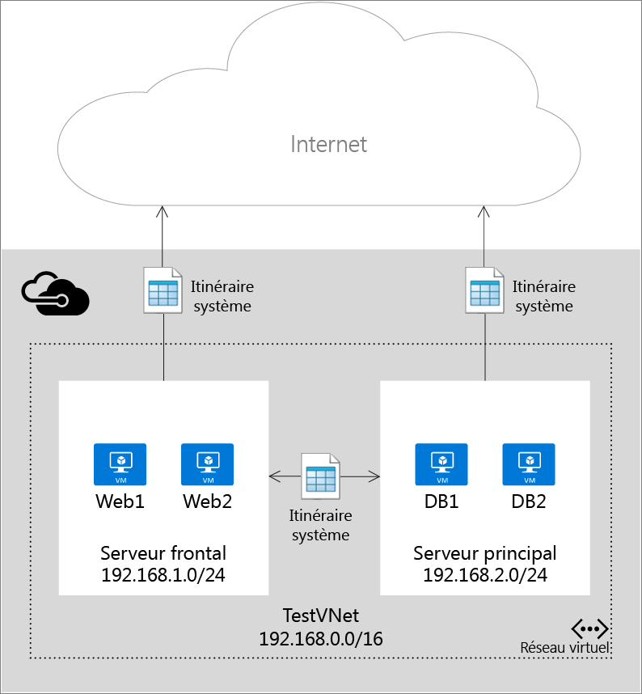
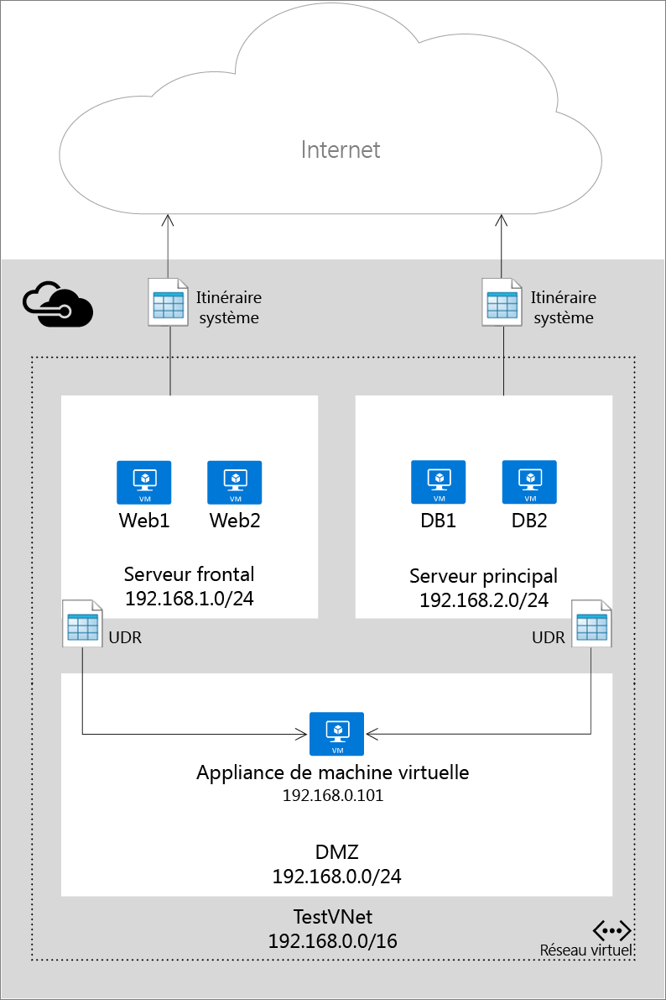

# Présentation des itinéraires définis par l’utilisateur et du transfert IP
Lorsque vous ajoutez des machines virtuelles à un réseau virtuel dans Microsoft Azure, notez que les machines sont en mesure d’interagir automatiquement entre elles sur le réseau. Il est inutile de spécifier une passerelle, bien que les machines virtuelles soient hébergées dans des sous-réseaux différents. Cela vaut également pour la communication des machines virtuelles vers l’Internet public, et même vers votre réseau local en cas de connexion hybride de Microsoft Azure vers votre propre centre de données.

Ce flux de communications est rendu possible par l’utilisation, par Microsoft Azure, d’une série d’itinéraires système régulant le trafic IP. Les itinéraires de système contrôlent le flux de communication dans les scénarios suivants :

* au sein d’un sous-réseau ;
* entre deux sous-réseaux d’un réseau virtuel ;
* entre les machines virtuelles et Internet ;
* entre deux réseaux virtuels via une passerelle VPN ;
* entre un réseau virtuel et votre réseau local via une passerelle VPN.

La figure ci-dessous représente une configuration simple avec un réseau virtuel, deux sous-réseaux et quelques machines virtuelles, avec les itinéraires système qui prennent en charge le trafic IP.

Les itinéraires système permettent la circulation automatique du trafic lié au déploiement, mais il existe des cas où il peut s’avérer utile d’acheminer les paquets au moyen d’une appliance virtuelle. Pour ce faire, créez des itinéraires personnalisés qui redirigent le prochain tronçon de paquets circulant vers un sous-réseau spécifique vers votre appliance virtuelle, et activer le transfert d’adresses IP pour la machine virtuelle exécutée en tant qu’appliance virtuelle.

La figure ci-dessous montre un exemple d’itinéraires définis par l’utilisateur et le transfert IP pour forcer les paquets envoyés d’un sous-réseau à un autre à passer par un équipement virtuel sur un troisième sous-réseau.

> [!IMPORTANT]
> Les itinéraires définis par l’utilisateur sont appliqués uniquement au trafic qui quitte un sous-réseau. Vous ne pouvez pas créer d’itinéraires pour spécifier la façon dont le trafic entre dans un sous-réseau à partir d’Internet, par exemple. En outre, l’équipement auquel vous transférez le trafic ne peut pas se trouver dans le même sous-réseau que celui d’où provient le trafic. Créez toujours un sous-réseau distinct pour vos équipements. 
> 
> 

## Ressources d’itinéraire
Les paquets sont acheminés via un réseau TCP/IP basé sur une table d’itinéraires définie sur chaque nœud du réseau physique. Une table d’itinéraires est une collection d’itinéraires individuels permettant de déterminer où transférer les paquets en fonction de l’adresse IP de destination. Un itinéraire se compose des éléments suivants :

| Propriété | Description | Contraintes | Considérations |
| --- | --- | --- | --- |
| Préfixe d’adresse |CIDR de destination auquel s’applique l’itinéraire, par exemple 10.1.0.0/16. |Ceci doit être une plage CIDR valide représentant des adresses sur l’Internet public, le réseau virtuel Azure ou le centre de données local. |Assurez-vous que le **préfixe d’adresse** ne contient pas l’adresse de **l’adresse du tronçon suivant** ; dans le cas contraire, vos paquets entreront dans une boucle allant de la source au tronçon suivant sans jamais atteindre leur destination. |
| Type de tronçon suivant |Type de tronçon Azure vers lequel le paquet doit être envoyé. |Il doit s’agir de l’une des valeurs suivantes :    **Réseau virtuel**. Représente le réseau virtuel local. Par exemple, si vous avez deux sous-réseaux, 10.1.0.0/16 et 10.2.0.0/16 qui sont situés dans le même réseau virtuel, l’itinéraire de chaque sous-réseau de la table d’itinéraires a la valeur de tronçon suivant *Réseau virtuel*.   **Passerelle de réseau virtuel**. Représente une passerelle VPN de site à site Azure.   **Internet**. Représente la passerelle Internet par défaut fournie par l’infrastructure Azure.   **Appliance virtuelle**. Représente une appliance virtuelle que vous avez ajoutée à votre réseau virtuel Azure.   **Aucun**. Représente un trou noir. Les paquets transmis à un trou noir ne sont pas du tout transférés. |Envisagez d’utiliser un type **Aucun** afin de mettre fin au transit des paquets vers une destination donnée. |
| adresse de tronçon suivant |L’adresse de tronçon suivant contient l’adresse IP vers laquelle les paquets doivent être transférés. Les valeurs de tronçon suivant sont autorisées uniquement dans les itinéraires où le type de tronçon suivant est *Appliance virtuelle*. |Doit être une adresse IP accessible dans le réseau virtuel où s’applique l’itinéraire défini par l’utilisateur. |Si l’adresse IP représente une machine virtuelle, veillez à activer le [transfert IP](#IP-forwarding) dans Azure pour la machine virtuelle. |

Dans Azure PowerShell, certaines valeurs « NextHopType » ont des noms différents :

* Le réseau virtuel est nommé VnetLocal
* La passerelle de réseau virtuel est nommée VirtualNetworkGateway
* L’appliance virtuelle est nommée VirtualAppliance
* Internet est nommé Internet
* Aucun est nommé None

### Itinéraires système
Chaque sous-réseau créé dans un réseau virtuel est automatiquement associé à une table de routage qui comporte les règles suivantes d’itinéraires du système :

* **Règle locale Vnet**: cette règle est automatiquement créée pour chaque sous-réseau d’un réseau virtuel. Elle indique qu’il existe un lien direct entre les machines virtuelles et le réseau virtuel, et qu’aucun tronçon intermédiaire suivant n’est à signaler.
* **Règle locale**: cette règle s’applique à tout le trafic destiné à la plage d’adresses locale et utilise une passerelle VPN en tant que tronçon suivant de destination.
* **Règle Internet** : cette règle traite l’ensemble du trafic destiné à l’Internet public (préfixe d’adresse 0.0.0.0/0) et utilise la passerelle Internet d’infrastructure en tant que tronçon suivant pour l’ensemble du trafic destiné au réseau Internet.

### Itinéraires définis par l’utilisateur
Pour la plupart des environnements, vous vous contenterez des itinéraires système définis par Microsoft Azure. Toutefois, vous pouvez créer une table d’itinéraires et ajouter un ou plusieurs itinéraires dans des cas spécifiques, par exemple :

* Forcer le tunneling vers Internet via votre réseau local.
* Utiliser des appliances virtuelles dans votre environnement Azure.

Dans les scénarios ci-dessus, vous devez créer une table d’itinéraires et lui ajouter des itinéraires définis par l’utilisateur. Vous pouvez avoir plusieurs tables d’itinéraires et celles-ci peuvent être associées à un ou plusieurs sous-réseaux. Chaque sous-réseau ne peut être associé qu’à une seule table d’itinéraires. L’ensemble des machines virtuelles et services cloud d’un sous-réseau utilisent la table d’itinéraires associée à ce sous-réseau.

Les sous-réseaux s’appuient sur des itinéraires système jusqu’à ce qu’une table de routage leur soit associée. Une fois que l’association existe, le routage se base sur la correspondance de préfixe la plus longue parmi les itinéraires définis par l’utilisateur et les itinéraires du système. S’il existe plusieurs itinéraires avec la même correspondance de préfixe la plus longue, un itinéraire est sélectionné en fonction de son origine dans l’ordre suivant :

1. Itinéraire défini par l’utilisateur
2. Itinéraire BGP (lorsque ExpressRoute est utilisé)
3. Itinéraire du système

Pour savoir comment créer des itinéraires personnalisés, consultez la section [Création d’itinéraires et activation du transfert IP dans Azure](virtual-network-create-udr-arm-template.md).

> [!IMPORTANT]
> Les itinéraires définis par l’utilisateur sont appliqués uniquement aux machines virtuelles et services cloud Azure. Par exemple, si vous souhaitez ajouter une appliance virtuelle de pare-feu entre votre réseau local et Azure, vous devez créer un itinéraire défini par l’utilisateur pour vos tables d’itinéraires Azure qui transmettent tout le trafic allant vers l’espace d’adressage local à l’appliance virtuelle. Vous pouvez également ajouter un itinéraire défini par l’utilisateur au sous-réseau GatewaySubnet pour transférer tout le trafic provenant de la connexion locale vers Azure via l’appliance virtuelle. Il s’agit d’un ajout récent.
> 
> 

### Itinéraires BGP
Si vous avez une connexion ExpressRoute entre votre réseau local et Azure, vous pouvez activer BGP pour propager les itinéraires de votre réseau local vers Azure. Ces itinéraires BGP sont utilisés de la même façon que les itinéraires du système et les itinéraires définis par l’utilisateur dans chaque sous-réseau Azure. Pour plus d’informations, consultez la page [Présentation d’ExpressRoute](../expressroute/expressroute-introduction.md)

> [!IMPORTANT]
> Vous pouvez configurer votre environnement Azure de manière à ce qu’il utilise le tunneling forcé via votre réseau local en créant un itinéraire défini par l’utilisateur pour le sous-réseau 0.0.0.0/0 qui utilise la passerelle VPN comme tronçon suivant. Toutefois, cela ne fonctionne que si vous utilisez une passerelle VPN, et non ExpressRoute. Pour ExpressRoute, le tunneling forcé est configuré via BGP.
> 
> 

## transfert IP
Comme décrit ci-dessus, une des raisons principales pour créer un itinéraire défini par l’utilisateur est de transférer le trafic vers une appliance virtuelle. Une appliance virtuelle n’est rien de plus qu’une machine virtuelle qui exécute une application permettant de gérer le trafic réseau d’une certaine façon, comme un pare-feu ou un périphérique NAT.

La machine virtuelle d’appliance virtuelle doit être capable de recevoir le trafic entrant qui ne lui est pas adressé. Pour permettre à une machine virtuelle de recevoir le trafic adressé à d’autres destinations, vous devez activer le transfert IP pour la machine virtuelle. Il s’agit d’un paramètre Azure, pas d’un paramètre du système d’exploitation invité.

## Étapes suivantes
* Découvrez comment [créer des itinéraires dans le modèle de déploiement du Gestionnaire de ressources](virtual-network-create-udr-arm-template.md) et les associer à des sous-réseaux. 
* Découvrez comment [créer des itinéraires dans le modèle de déploiement classique](virtual-network-create-udr-classic-ps.md) et les associer à des sous-réseaux.

<!--HONumber=Nov16_HO2-->

