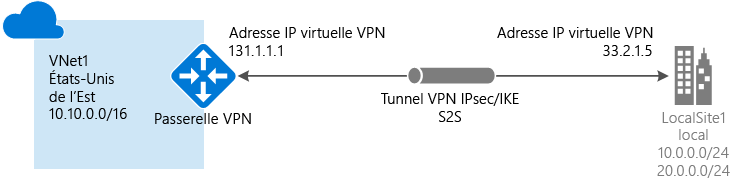
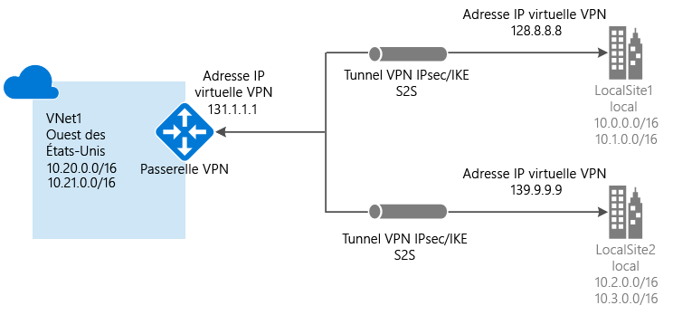
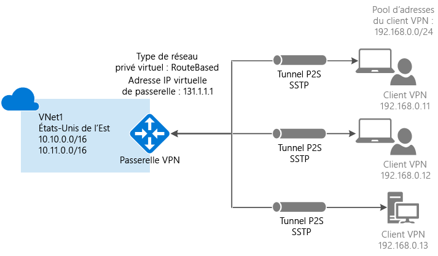
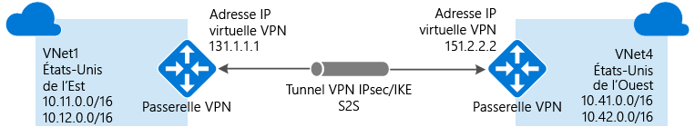

# À propos de la passerelle VPN
Pour envoyer du trafic réseau entre votre réseau virtuel Azure et votre site local, vous devez créer une passerelle de réseau virtuel pour votre réseau virtuel. Une passerelle VPN est un type de passerelle de réseau virtuel qui envoie le trafic chiffré à travers une connexion publique. Vous pouvez également utiliser des passerelles VPN pour envoyer du trafic entre les réseaux virtuels Azure sur le réseau Microsoft.

Il existe deux types de passerelle de réseau virtuel : « Vpn » et « ExpressRoute ». Lorsque vous créez une passerelle de réseau virtuel, vous spécifiez le type de passerelle que vous voulez créer. Une passerelle VPN est une passerelle de réseau virtuel qui utilise le type de passerelle « Vpn ». 

Chaque réseau virtuel peut avoir deux passerelles de réseau virtuel, mais une seule de chaque type. Selon les paramètres que vous choisissez, vous pouvez créer plusieurs connexions à une passerelle VPN unique. La configuration d’une connexion sur plusieurs sites en est un bon exemple. Lorsque vous créez plusieurs connexions à une même passerelle VPN, tous les tunnels VPN, y compris les VPN de Point à site, partagent la bande passante disponible pour la passerelle.

## Configuration d’une passerelle VPN
Une connexion par passerelle VPN s’appuie sur plusieurs ressources qui sont configurées avec des paramètres spécifiques. La plupart des ressources peuvent être configurées séparément, mais elles doivent être configurées dans un certain ordre dans certains cas.

###Paramètres
Les paramètres que vous avez choisis pour chaque ressource sont essentiels à la création d’une connexion réussie. Pour plus d’informations sur les ressources et paramètres spécifiques pour la passerelle VPN, consultez [À propos des paramètres de passerelle VPN](vpn-gateway-about-vpn-gateway-settings.md). Vous trouverez des informations pour vous aider à comprendre les types de passerelle, les types de VPN, les types de connexion, les sous-réseaux de passerelle, les passerelles de réseau local et divers autres paramètres de ressource que vous pouvez vouloir prendre en compte.

###Outils de déploiement
Vous pouvez commencer par créer et configurer des ressources à l’aide de l’un des outils de configuration, comme le portail Azure. Vous pouvez décider ultérieurement de passer à un autre outil, tel que PowerShell, pour configurer des ressources supplémentaires ou pour modifier les ressources existantes, le cas échéant. Il n’est pour le moment pas possible de configurer toutes les ressources et tous les paramètres des ressources dans le portail Azure. Les instructions fournies dans les articles dédiés à chaque topologie de connexion indiquent si un outil de configuration spécifique est requis. 

###Modèle de déploiement
Lorsque vous configurez votre passerelle VPN, les étapes à suivre varient en fonction du modèle de déploiement que vous avez utilisé pour créer votre réseau virtuel. Par exemple, si vous avez créé votre réseau virtuel à l’aide du modèle de déploiement classique, vous utilisez les recommandations et les instructions pour le modèle de déploiement classique afin de créer et configurer les paramètres de votre passerelle VPN. Pour plus d’informations sur les modèles de déploiement, voir [Comprendre les modèles de déploiement Resource Manager et de déploiement classique](../azure-resource-manager/resource-manager-deployment-model.md).

## Diagrammes de topologie de connexion
Il est important de savoir qu’il existe différentes configurations disponibles pour les connexions aux passerelles VPN. Vous devez déterminer la configuration qui correspond le mieux à vos besoins. Dans les sections ci-dessous, vous pouvez afficher des informations et des diagrammes de topologie sur les connexions de passerelle VPN suivantes : Les sections suivantes contiennent des tableaux qui répertorient les éléments ci-dessous :

* Modèle de déploiement disponible
* Outils de configuration disponibles
* Liens vous redirigeant directement vers un article, si disponibles

Utilisez les graphiques et les descriptions pour sélectionner la topologie de connexion répondant à vos besoins. Le graphique présente les principales topologies de base, mais il est possible de créer des configurations plus complexes à l’aide des diagrammes.

## Site à site et multi-sites (tunnel VPN IPsec/IKE)
### Site à site
Une connexion par passerelle VPN site à site (S2S) est une connexion via un tunnel VPN IPsec/IKE (S2S ou IKEv1). Ce type de connexion requiert un périphérique VPN local auquel est affectée une IP publique, et qui ne se situe pas derrière un NAT. Les connexions S2S peuvent être utilisées pour les configurations hybrides et entre différents locaux.   

### Multi-sites
Ce type de connexion est une variante de la connexion site à site. Vous créez plusieurs connexions VPN à partir de votre passerelle de réseau virtuel, généralement en vous connectant à plusieurs sites locaux. Lorsque vous travaillez avec plusieurs connexions, vous devez utiliser un type de VPN basé sur l’itinéraire (équivalent d’une passerelle dynamique pour les réseaux virtuels classiques). Chaque réseau virtuel ne pouvant disposer que d’une seule passerelle de réseau virtuel, toutes les connexions passant par la passerelle partagent la bande passante disponible. Cela est souvent appelé connexion « multi-sites ».

### Modèles et méthodes de déploiement pour les connexions site à site et multi-sites
[!INCLUDE [vpn-gateway-table-site-to-site](../../includes/vpn-gateway-table-site-to-site-include.md)]

## Point à site (VPN sur SSTP)
Une connexion par passerelle VPN point à site (P2S) vous permet de créer individuellement une connexion sécurisée à un réseau virtuel à partir d’un ordinateur client. Le P2S est une connexion VPN sur SSTP (Secure Socket Tunneling Protocol). Les connexions de ce type ne nécessitent pas de périphérique VPN ou d’adresse IP publique pour fonctionner. Vous établissez la connexion VPN en la démarrant depuis l’ordinateur client. Cette solution est utile lorsque vous souhaitez vous connecter à votre réseau virtuel à partir d’un site distant, comme depuis votre domicile ou une conférence ou lorsque seulement quelques clients doivent se connecter à un réseau virtuel. Les connexions P2S peuvent être utilisées avec des connexions S2S via la même passerelle VPN, dans la mesure où toutes les exigences de configuration des deux types de connexion sont compatibles.

### Méthodes et modèles de déploiement pour les connexions point à site
[!INCLUDE [vpn-gateway-table-point-to-site](../../includes/vpn-gateway-table-point-to-site-include.md)]

## Connexions de réseau virtuel à réseau virtuel (tunnel VPN IPsec/IKE)
La connexion entre deux réseaux virtuels est semblable à la connexion d’un réseau virtuel à un emplacement de site local. Les deux types de connectivité font appel à une passerelle VPN pour offrir un tunnel sécurisé utilisant Ipsec/IKE. Vous pouvez même combiner une communication de réseau virtuel à réseau virtuel avec des configurations de connexion multi-sites. Vous établissez ainsi des topologies réseau qui combinent une connectivité entre différents locaux et une connectivité entre différents réseaux virtuels.

Les réseaux virtuels que vous connectez peuvent être situés :

* dans la même région ou dans des régions différentes
* dans le même abonnement ou dans des abonnements différents 
* dans le même modèle de déploiement ou dans des modèles de déploiement différents

###Connexions entre modèles de déploiement
Azure propose actuellement deux modèles de déploiement : le modèle classique et le modèle Resource Manager. Si vous utilisez Azure depuis un certain temps, vous avez probablement des machines virtuelles et des rôles d’instance Azure exécutés dans un réseau virtuel classique. Il est possible que vos nouvelles machines virtuelles et instances de rôle s’exécutent dans un réseau virtuel créé dans Resource Manager. Vous pouvez créer une connexion entre les réseaux virtuels pour permettre aux ressources dans un réseau virtuel de communiquer directement avec les ressources d’un autre réseau virtuel.

###Homologation de réseaux virtuels
Vous pouvez utiliser l’homologation de réseau virtuel pour créer votre connexion, tant que votre réseau virtuel répond à certaines exigences. L’homologation de réseau virtuel n’utilise pas de passerelle de réseau virtuel. Pour plus d’informations, consultez l’article [Homologation de réseaux virtuels](../virtual-network/virtual-network-peering-overview.md).

###Modèles et méthodes de déploiement pour les connexions de réseau virtuel à réseau virtuel
[!INCLUDE [vpn-gateway-table-vnet-to-vnet](../../includes/vpn-gateway-table-vnet-to-vnet-include.md)]

## ExpressRoute (connexion privée dédiée)
Microsoft Azure ExpressRoute vous permet d'étendre vos réseaux locaux au cloud de Microsoft via une connexion privée dédiée assurée par un fournisseur de connectivité. Grâce à ExpressRoute, vous pouvez établir des connexions aux services de cloud computing Microsoft, comme Microsoft Azure, Office 365 et CRM Online. La connectivité peut provenir d'un réseau universel (IP VPN), d’un réseau Ethernet point à point ou d’une interconnexion virtuelle via un fournisseur de connectivité dans un centre de colocalisation.

Les connexions ExpressRoute ne sont pas établies par le biais de l'Internet public. Elles offrent ainsi de meilleurs niveaux de fiabilité, de rapidité, de latence et de sécurité que les connexions classiques sur Internet.

Une connexion ExpressRoute n’utilise pas de passerelle VPN, mais une passerelle de réseau virtuel dans le cadre de sa configuration requise. Dans une connexion ExpressRoute, la passerelle de réseau virtuel est configurée avec le type de passerelle « ExpressRoute » plutôt que « Vpn ». Pour plus d’informations sur ExpressRoute, consultez [Présentation technique d’ExpressRoute](../expressroute/expressroute-introduction.md).

## Coexistence de connexions ExpressRoute et de site à site
ExpressRoute est une connexion directe et dédiée aux services Microsoft, notamment à Azure, à partir de votre WAN, qui ne passe pas par l’Internet public. Le trafic VPN de site à site transite via l’Internet public tout en étant chiffré. La possibilité de configurer des connexions VPN de site à site et ExpressRoute pour le même réseau virtuel présente plusieurs avantages.

Vous pouvez configurer un VPN de site à site comme un chemin d’accès de basculement sécurisé pour ExpressRoute, ou utiliser des VPN de site à site pour vous connecter à des sites qui ne font pas partie de votre réseau, mais qui sont connectés via ExpressRoute. Notez que cette configuration nécessite deux passerelles de réseau virtuel pour un même réseau virtuel, une de type « Vpn », et l’autre de type « ExpressRoute ».

### Méthodes et modèles de déploiement pour les connexions S2S et ExpressRoute
[!INCLUDE [vpn-gateway-table-coexist](../../includes/vpn-gateway-table-coexist-include.md)]

## Tarification
[!INCLUDE [vpn-gateway-about-pricing-include](../../includes/vpn-gateway-about-pricing-include.md)]

## SKU de passerelle
[!INCLUDE [vpn-gateway-gwsku-include](../../includes/vpn-gateway-gwsku-include.md)]

Pour plus d’informations sur les références de passerelle pour la passerelle VPN, consultez [Références (SKU) de passerelle](vpn-gateway-about-vpn-gateway-settings.md#gwsku).

### Débit agrégé estimé par SKU
[!INCLUDE [vpn-gateway-table-gwtype-aggthroughput](../../includes/vpn-gateway-table-gwtype-aggtput-include.md)]

## Forum Aux Questions

Pour les questions fréquemment posées sur la passerelle VPN, consultez le [Forum aux questions sur la passerelle VPN](vpn-gateway-vpn-faq.md).

## Étapes suivantes
- Planifiez votre configuration de passerelle VPN. Consultez [Planification et conception de la passerelle VPN](vpn-gateway-plan-design.md).
- Pour plus d’informations, consultez la [FAQ sur la passerelle VPN](vpn-gateway-vpn-faq.md).
- Consultez les [Limites du service et de l’abonnement](../azure-subscription-service-limits.md#networking-limits).

