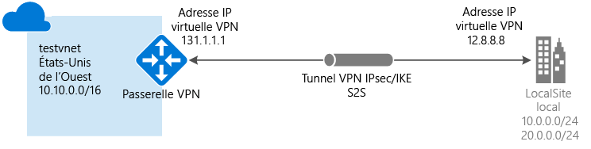

# <a name="create-a-vnet-with-a-site-to-site-vpn-connection-using-powershell"></a>Créer un réseau virtuel avec une connexion VPN de site à site à l’aide de PowerShell

Cet article vous explique comment utiliser PowerShell pour créer une connexion de passerelle VPN de site à site à partir de votre réseau local vers le réseau virtuel. Les étapes mentionnées dans cet article s’appliquent au modèle de déploiement Resource Manager. Vous pouvez également créer cette configuration à l’aide d’un autre outil ou modèle de déploiement en sélectionnant une option différente dans la liste suivante :

> [!div class="op_single_selector"]
> * [Resource Manager - Portail Azure](vpn-gateway-howto-site-to-site-resource-manager-portal.md)
> * [Resource Manager - PowerShell](vpn-gateway-create-site-to-site-rm-powershell.md)
> * [Resource Manager - CLI](vpn-gateway-howto-site-to-site-resource-manager-cli.md)
> * [Classic - Portail Azure](vpn-gateway-howto-site-to-site-classic-portal.md)
> * [Classic - Portail Classic](vpn-gateway-site-to-site-create.md)
> 
>




Une connexion de passerelle VPN de site à site permet de connecter votre réseau local à un réseau virtuel Azure via un tunnel VPN IPsec/IKE (IKEv1 ou IKEv2). Ce type de connexion requiert un périphérique VPN local disposant d’une adresse IP publique exposée en externe. Pour plus d’informations sur les passerelles VPN, consultez l’article [À propos de la passerelle VPN](vpn-gateway-about-vpngateways.md).

## <a name="before-you-begin"></a>Avant de commencer

Vérifiez que vous disposez des éléments ci-dessous avant de commencer votre configuration :

* Assurez-vous de vouloir utiliser le modèle de déploiement Resource Manager. [!INCLUDE [deployment models](../../includes/vpn-gateway-deployment-models-include.md)] 
* Un périphérique VPN compatible et une personne qui est en mesure de le configurer. Pour plus d’informations sur les périphériques VPN compatibles et la configuration de votre périphérique, consultez l’article [À propos des périphériques VPN](vpn-gateway-about-vpn-devices.md).
* Une adresse IPv4 publique exposée en externe pour votre périphérique VPN. Cette adresse IP ne peut pas se trouver derrière un NAT.
* Si vous ne maîtrisez pas les plages d’adresses IP situées dans votre configuration de réseau local, vous devez contacter une personne en mesure de vous aider. Lorsque vous créez cette configuration, vous devez spécifier les préfixes des plages d’adresses IP qu’Azure acheminera vers votre emplacement local. Aucun des sous-réseaux de votre réseau local ne peut chevaucher les sous-réseaux du réseau virtuel auquel vous souhaitez vous connecter.
* La dernière version des applets de commande PowerShell Azure Resource Manager. Pour plus d’informations sur l’installation des applets de commande PowerShell, consultez [Installation et configuration d’Azure PowerShell](/powershell/azureps-cmdlets-docs) .

### <a name="example-values"></a>Valeurs utilisées dans l’exemple

Nous utilisons les valeurs suivantes dans les exemples de cet article. Vous pouvez utiliser ces valeurs pour créer un environnement de test ou vous y référer pour mieux comprendre les exemples de cet article.

```
#Example values

VnetName                = testvnet 
ResourceGroup           = testrg 
Location                = West US 
AddressSpace            = 10.0.0.0/16 
SubnetName              = Subnet1 
Subnet                  = 10.0.1.0/28 
GatewaySubnet           = 10.0.0.0/27
LocalNetworkGatewayName = LocalSite
LNG Public IP           = <VPN device IP address> 
Local Address Prefixes  = 10.0.0.0/24','20.0.0.0/24
Gateway Name            = vnetgw1
PublicIP                = gwpip
Gateway IP Config       = gwipconfig1 
VPNType                 = RouteBased 
GatewayType             = Vpn 
ConnectionName          = myGWConnection
```

## <a name="Login"></a>1. Connexion à votre abonnement
Pour utiliser les applets de commande Resource Manager, passez au mode PowerShell. Pour plus d’informations, consultez la page [Utilisation de Windows PowerShell avec Resource Manager](../powershell-azure-resource-manager.md).

1. Ouvrez la console PowerShell et connectez-vous à votre compte. Utilisez l’exemple suivant pour faciliter votre connexion :

  ```powershell
  Login-AzureRmAccount
  ```
2. Vérifiez les abonnements associés au compte.

  ```powershell
  Get-AzureRmSubscription
  ```
3. Spécifiez l’abonnement que vous souhaitez utiliser.

  ```powershell
  Select-AzureRmSubscription -SubscriptionName "Replace_with_your_subscription_name"
  ```

## <a name="VNet"></a>2. Créer un réseau virtuel et un sous-réseau de passerelle

Si vous n’avez pas de réseau virtuel, créez-en un. Lorsque vous créez un réseau virtuel, vérifiez que les espaces d’adressage que vous spécifiez ne chevauchent pas les espaces d’adressage de votre réseau local. Pour cette configuration, vous avez également besoin d’un sous-réseau de passerelle. La passerelle de réseau virtuel utilise un sous-réseau de passerelle qui contient les adresses IP utilisées par les services de passerelle VPN. Le sous-réseau de passerelle doit être nommé « GatewaySubnet ». Si vous choisissez un autre nom, vous créez un sous-réseau, mais Azure ne le traitera pas comme un sous-réseau de passerelle.

La taille du sous-réseau de passerelle que vous spécifiez dépend de la configuration de la passerelle VPN que vous souhaitez créer. Bien qu’il soit possible de créer un sous-réseau de passerelle aussi petit que /29, nous vous recommandons de créer un sous-réseau plus vaste qui inclut un plus grand nombre d’adresses en sélectionnant /27 ou /28. En choisissant un sous-réseau de passerelle plus vaste, vous disposez de suffisamment d’adresses IP pour prendre en charge d’éventuelles configurations futures.

[!INCLUDE [vpn-gateway-no-nsg](../../includes/vpn-gateway-no-nsg-include.md)]

### <a name="to-create-a-virtual-network-and-a-gateway-subnet"></a>Pour créer un réseau virtuel et un sous-réseau de passerelle

Cet exemple permet de créer un réseau virtuel et un sous-réseau de passerelle. Si vous disposez déjà d’un réseau virtuel auquel vous devez ajouter un sous-réseau de passerelle, consultez [Pour ajouter un sous-réseau de passerelle à un réseau virtuel que vous avez déjà créé](#gatewaysubnet).

Créez un groupe de ressources :

```powershell
New-AzureRmResourceGroup -Name testrg -Location 'West US'
```

Créez votre réseau virtuel. 

1. Définissez les variables.

  ```powershell
  $subnet1 = New-AzureRmVirtualNetworkSubnetConfig -Name 'GatewaySubnet' -AddressPrefix 10.0.0.0/27
  $subnet2 = New-AzureRmVirtualNetworkSubnetConfig -Name 'Subnet1' -AddressPrefix '10.0.1.0/28'
  ```
2. Créez le réseau virtuel.

  ```powershell
  New-AzureRmVirtualNetwork -Name testvnet -ResourceGroupName testrg `
  -Location 'West US' -AddressPrefix 10.0.0.0/16 -Subnet $subnet1, $subnet2
  ```

### <a name="gatewaysubnet"></a>Pour ajouter un sous-réseau de passerelle à un réseau virtuel que vous avez déjà créé

1. Définissez les variables.

  ```powershell
  $vnet = Get-AzureRmVirtualNetwork -ResourceGroupName testrg -Name testvnet
  ```
2. Créez le sous-réseau de passerelle.

  ```powershell
  Add-AzureRmVirtualNetworkSubnetConfig -Name 'GatewaySubnet' -AddressPrefix 10.0.0.0/27 -VirtualNetwork $vnet
  ```
3. Définissez la configuration.

  ```powershell
  Set-AzureRmVirtualNetwork -VirtualNetwork $vnet
  ```

## 3. <a name="localnet"></a>Créer la passerelle de réseau local

La passerelle de réseau local fait généralement référence à votre emplacement local. Donnez au site un nom auquel Azure pourra se référer, puis spécifiez l’adresse IP du périphérique VPN local vers lequel vous allez créer une connexion. Spécifiez également les préfixes d’adresses IP qui seront acheminés via la passerelle VPN vers le périphérique VPN. Les préfixes d’adresses que vous spécifiez sont les préfixes situés sur votre réseau local. Vous pouvez facilement mettre à jour ces préfixes si votre réseau local change.

Utilisez les valeurs suivantes :

* *GatewayIPAddress* est l’adresse IP de votre périphérique VPN local. Votre périphérique VPN ne peut pas se trouver derrière un NAT.
* *AddressPrefix* est votre espace d’adressage local.

- Pour ajouter une passerelle de réseau local avec un préfixe d’adresse unique :

  ```powershell
  New-AzureRmLocalNetworkGateway -Name LocalSite -ResourceGroupName testrg `
  -Location 'West US' -GatewayIpAddress '23.99.221.164' -AddressPrefix   '10.0.0.0/24'
  ```

- Pour ajouter une passerelle de réseau local avec des préfixes d’adresse multiples :

  ```powershell
  New-AzureRmLocalNetworkGateway -Name LocalSite -ResourceGroupName testrg `
  -Location 'West US' -GatewayIpAddress '23.99.221.164' -AddressPrefix @('10.0.0.0/24','20.0.0.0/24')
  ```

- Pour modifier des préfixes d’adresses IP de votre passerelle de réseau local :<br>
Parfois, les préfixes de votre passerelle de réseau local changent. Les étapes à suivre pour modifier vos préfixes d’adresses IP varient selon que vous avez créé une connexion à la passerelle VPN. Consultez la section [Modifier des préfixes d’adresses IP de votre passerelle de réseau local](#modify) de cet article.

## <a name="PublicIP"></a>4. Demander une adresse IP publique

Demandez une adresse IP publique qui sera allouée à votre passerelle VPN de réseau virtuel. Il s’agit de l’adresse IP à laquelle votre périphérique VPN devra se connecter.

Actuellement, la passerelle de réseau virtuel du modèle de déploiement Resource Manager ne prend en charge que les adresses IP publiques à l’aide de la méthode d’allocation dynamique. Néanmoins, cela ne signifie pas que l’adresse IP est modifiée. L’adresse IP de la passerelle VPN change uniquement lorsque la passerelle est supprimée, puis recréée. L’adresse IP publique de la passerelle de réseau virtuel n’est pas modifiée lors du redimensionnement, de la réinitialisation ou d’autres opérations de maintenance/mise à niveau internes de votre passerelle VPN.

Utilisez l’exemple PowerShell suivant :

```powershell
$gwpip= New-AzureRmPublicIpAddress -Name gwpip -ResourceGroupName testrg -Location 'West US' -AllocationMethod Dynamic
```

## <a name="GatewayIPConfig"></a>5. Créer la configuration de l’adressage IP de la passerelle
La configuration de la passerelle définit le sous-réseau et l’adresse IP publique à utiliser. Utilisez l’exemple suivant pour créer la configuration de votre passerelle :

```powershell
$vnet = Get-AzureRmVirtualNetwork -Name testvnet -ResourceGroupName testrg
$subnet = Get-AzureRmVirtualNetworkSubnetConfig -Name 'GatewaySubnet' -VirtualNetwork $vnet
$gwipconfig = New-AzureRmVirtualNetworkGatewayIpConfig -Name gwipconfig1 -SubnetId $subnet.Id -PublicIpAddressId $gwpip.Id
```

## <a name="CreateGateway"></a>6. Créer la passerelle VPN

Créez la passerelle VPN de réseau virtuel. La création d’une passerelle VPN peut prendre 45 minutes ou plus.

Utilisez les valeurs suivantes :

* Le paramètre *-GatewayType* pour une configuration de site à site est *Vpn*. Le type de passerelle dépend toujours de la configuration que vous implémentez. Par exemple, d’autres configurations de passerelle peuvent nécessiter GatewayType ExpressRoute.
* Le paramètre *-VpnType* peut avoir pour valeur *RouteBased* (appelé passerelle dynamique dans certaines documentations) ou *PolicyBased* (appelé passerelle statique dans certaines documentations). Pour plus d’informations sur les types de passerelles VPN, consultez [À propos de la passerelle VPN](vpn-gateway-about-vpngateways.md).
* La valeur de *-GatewaySku* peut être Basic, Standard ou HighPerformance. Des limites de configuration s’appliquent à certaines références (SKU). Pour plus d’informations, consultez l’article [Références (SKU) de passerelle](vpn-gateway-about-vpngateways.md#gateway-skus).

```powershell
New-AzureRmVirtualNetworkGateway -Name vnetgw1 -ResourceGroupName testrg `
-Location 'West US' -IpConfigurations $gwipconfig -GatewayType Vpn `
-VpnType RouteBased -GatewaySku Standard
```

## <a name="ConfigureVPNDevice"></a>7. Configuration de votre périphérique VPN

[!INCLUDE [vpn-gateway-configure-vpn-device-rm](../../includes/vpn-gateway-configure-vpn-device-rm-include.md)]

Pour trouver l’adresse IP publique de votre passerelle de réseau virtuel à l’aide de PowerShell, utilisez l’exemple suivant :

```powershell
Get-AzureRmPublicIpAddress -Name GW1PublicIP -ResourceGroupName TestRG
```

## <a name="CreateConnection"></a>8. Créer la connexion VPN
Créez ensuite la connexion VPN de site à site entre votre passerelle de réseau virtuel et votre périphérique VPN. Assurez-vous de remplacer ces valeurs par les vôtres. La clé partagée doit correspondre à la valeur que vous avez utilisée pour la configuration de votre périphérique VPN. Notez que la valeur « -ConnectionType » pour la connexion de site à site est *IPsec*.

1. Définissez les variables.
  ```powershell
  $gateway1 = Get-AzureRmVirtualNetworkGateway -Name vnetgw1 -ResourceGroupName testrg
  $local = Get-AzureRmLocalNetworkGateway -Name LocalSite -ResourceGroupName testrg
  ```

2. Créez la connexion.
  ```powershell
  New-AzureRmVirtualNetworkGatewayConnection -Name MyGWConnection -ResourceGroupName testrg `
  -Location 'West US' -VirtualNetworkGateway1 $gateway1 -LocalNetworkGateway2 $local `
  -ConnectionType IPsec -RoutingWeight 10 -SharedKey 'abc123'
  ```

Après un bref délai, la connexion sera établie.

## <a name="toverify"></a>9. Vérifier la connexion VPN
Il existe différentes façons de vérifier votre connexion VPN.

[!INCLUDE [vpn-gateway-verify-connection-ps-rm](../../includes/vpn-gateway-verify-connection-ps-rm-include.md)]

## <a name="modify"></a>Pour modifier des préfixes d’adresses IP d’une passerelle de réseau local
Si vous devez modifier les préfixes de votre passerelle de réseau local, suivez les instructions suivantes. Deux ensembles d’instructions vous sont fournis : Les instructions que vous choisissez d’appliquer varient selon que vous avez déjà créé ou non votre connexion à la passerelle.

[!INCLUDE [vpn-gateway-modify-ip-prefix-rm](../../includes/vpn-gateway-modify-ip-prefix-rm-include.md)]

## <a name="modifygwipaddress"></a>Pour modifier l’adresse IP d’une passerelle de réseau local
[!INCLUDE [vpn-gateway-modify-lng-gateway-ip-rm](../../includes/vpn-gateway-modify-lng-gateway-ip-rm-include.md)]

## <a name="next-steps"></a>Étapes suivantes
*  Une fois la connexion achevée, vous pouvez ajouter des machines virtuelles à vos réseaux virtuels. Pour plus d’informations, consultez [Machines virtuelles](https://docs.microsoft.com/azure/#pivot=services&panel=Compute).
* Pour plus d’informations sur le protocole BGP, consultez les articles [Vue d’ensemble du protocole BGP](vpn-gateway-bgp-overview.md) et [Comment configurer BGP](vpn-gateway-bgp-resource-manager-ps.md).

