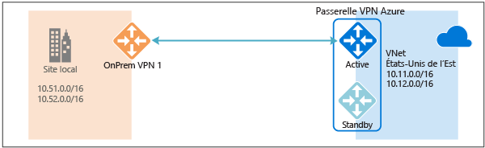
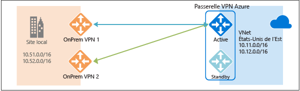
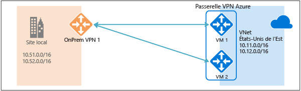
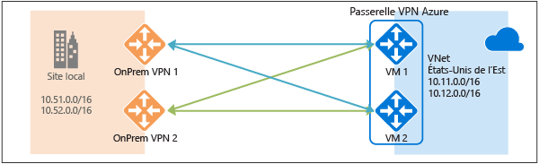
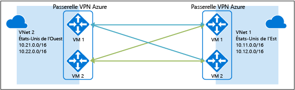

# Configuration haute disponibilité pour la connectivité entre les réseaux locaux et la connectivité entre deux réseaux virtuels
Cet article fournit une vue d’ensemble des options de configuration haute disponibilité dont vous pouvez tirer parti pour la connectivité entre vos réseaux locaux et la connectivité entre deux réseaux virtuels en utilisant des passerelles VPN Azure.

## À propos de la redondance de passerelle VPN Azure
Chaque passerelle VPN Azure comprend deux instances dans une configuration de type actif / passif. En cas de maintenance planifiée ou d’interruption non planifiée au niveau de l’instance active, l’instance de secours prend automatiquement le relais (par un basculement) et reprend les connexions VPN S2S ou entre deux réseaux virtuels. Le basculement entraîne une brève interruption. Dans le cadre d’une maintenance planifiée, la connectivité doit être restaurée dans les 10 à 15 secondes. En cas de problèmes non planifiés, la récupération de la connexion est plus longue et peut atteindre 1 minute à 1 minute trente dans le pire des cas. Pour les connexions client VPN P2S à la passerelle, les connexions P2S seront rompues et les utilisateurs devront se reconnecter à partir des ordinateurs clients.

## Connectivité haute disponibilité entre les réseaux locaux
Pour établir des connexions hautement disponibles entre vos réseaux locaux, vous avez deux options :

* Utilisation de plusieurs périphériques VPN en local
* Utilisation d’une passerelle VPN Azure en mode actif-actif
* Combinaison des deux

### Utilisation de plusieurs périphériques VPN en local
Vous pouvez utiliser plusieurs périphériques VPN de votre réseau local pour vous connecter à votre passerelle VPN Azure, comme illustré dans le schéma suivant :

Cette configuration offre plusieurs tunnels actifs reliant la même passerelle VPN Azure à vos périphériques locaux dans le même emplacement. Elle comporte certaines exigences et contraintes :

1. Vous devez créer plusieurs connexions VPN S2S entre vos périphériques VPN et Azure. Lorsque vous connectez plusieurs périphériques VPN du même réseau local vers Azure, vous devez créer une passerelle réseau locale pour chaque périphérique VPN et une connexion entre votre passerelle VPN Azure et la passerelle réseau locale.
2. Les passerelles réseau locales correspondant à vos périphériques VPN doivent avoir des adresses IP publiques uniques dans la propriété « GatewayIpAddress ».
3. Cette configuration requiert le protocole BGP. Pour chaque passerelle réseau locale qui représente un périphérique VPN, une adresse IP d’homologue BGP unique doit être spécifiée dans la propriété « BgpPeerIpAddress ».
4. Les champs de propriété AddressPrefix de chaque passerelle réseau locale ne doivent pas se chevaucher. Vous devez spécifier le paramètre « BgpPeerIpAddress » au format CIDR /32 dans le champ AddressPrefix, par exemple, 10.200.200.254/32.
5. Vous devez utiliser le protocole BGP pour annoncer les mêmes préfixes que les préfixes de réseau local sur votre passerelle VPN Azure. Le trafic sera alors transmis simultanément via ces tunnels.
6. Chaque connexion est comptabilisée par rapport au nombre maximal de tunnels pour votre passerelle VPN Azure, soit 10 pour les références SKU De base et Standard, et 30 pour les références SKU Hautes performances. 

Dans cette configuration, la passerelle VPN Azure est toujours en mode actif-passif, ce qui signifie que l’on aura toujours le même comportement de basculement accompagné d’une brève interruption comme décrit [ci-dessus](#activestandby). Mais cette configuration évite les défaillances ou les interruptions sur votre réseau local et sur vos périphériques VPN.

### Utilisation d’une passerelle VPN Azure en mode actif-actif
Vous pouvez maintenant créer une passerelle VPN Azure dans une configuration actif-actif, où les deux instances de machines virtuelles passerelle vont établir des tunnels VPN S2S sur votre périphérique VPN local, comme le montre le schéma suivant :

Dans cette configuration, chaque instance de passerelle Azure aura une adresse IP publique unique et chacune va établir un tunnel VPN S2S IPsec/IKE sur votre périphérique VPN local spécifié dans votre passerelle et votre connexion de réseau local. Notez que les deux tunnels VPN font en fait partie de la même connexion. Vous devez toujours configurer votre périphérique VPN local pour accepter ou établir deux tunnels VPN S2S sur ces deux adresses IP publiques de passerelle VPN Azure.

Étant donné que les instances de passerelle Azure sont en configuration actif-actif, le trafic qui transite entre votre réseau virtuel Azure et votre réseau local sera routé simultanément via les deux tunnels, même si votre périphérique VPN local peut privilégier un tunnel plutôt qu’un autre. Notez que le même flux TCP ou UDP traversera toujours le même tunnel ou le même chemin, sauf si un événement de maintenance se produit sur l’une des instances.

Lorsqu’une instance de passerelle est affectée par une maintenance planifiée ou un événement imprévu, le tunnel IPsec entre votre périphérique VPN local et cette instance est déconnecté. Les itinéraires correspondants sur vos périphériques VPN doivent être supprimés ou retirés automatiquement afin de permettre le basculement du trafic sur l’autre tunnel IPsec actif. Côté Azure, le basculement se produit automatiquement de l’instance affectée vers l’instance active.

### Double redondance : passerelles VPN de type actif-actif pour Azure et les réseaux locaux
L’option la plus fiable consiste à combiner les passerelles de type actif-actif sur votre réseau et sur Azure, comme illustré dans le schéma ci-dessous.

Vous pouvez ici créer et configurer la passerelle VPN Azure dans une configuration actif-actif et créer deux passerelles réseau locales et deux connexions pour vos deux périphériques VPN locaux décrits ci-dessus. Vous obtenez une connectivité entièrement maillée pour les 4 tunnels IPsec qui relient votre réseau virtuel Azure à votre réseau local.

L’ensemble des passerelles et des tunnels étant actifs côté Azure, le trafic est réparti entre les 4 tunnels simultanément, même si chaque flux TCP ou UDP suivra à nouveau le même tunnel ou le même chemin côté Azure. Même en répartissant le trafic, vous pouvez constater un débit légèrement supérieur sur les tunnels IPsec, cette configuration étant essentiellement axée sur la haute disponibilité. En raison de la nature statistique de la propagation, il est difficile de déterminer de quelle manière les différentes conditions de trafic d’applications affecteront le débit global.

Cette topologie suppose de faire appel à deux passerelles réseau locales et à deux connexions pour pouvoir prendre en charge les deux périphériques VPN locaux. Elle requiert également le protocole BGP pour autoriser les deux connexions au même réseau local. Ces exigences sont identiques à celles décrites [ci-dessus](#activeactiveonprem). 

## Connectivité haute disponibilité entre deux réseaux virtuels via les passerelles VPN Azure
La même configuration actif-actif peut également s’appliquer aux connexions entre deux réseaux virtuels Azure. Vous pouvez créer des passerelles VPN actif-actif pour les deux réseaux virtuels et les connecter ensemble pour obtenir la même connectivité entièrement maillée pour les 4 tunnels placés entre les deux réseaux virtuels, comme illustré dans le schéma ci-dessous :

Ainsi, il existe toujours une paire de tunnels entre les deux réseaux virtuels pour tout événement de maintenance planifiée, ce qui garantit une meilleure disponibilité. Bien que la même topologie requiert deux connexions pour permettre une connectivité entre les réseaux locaux, la topologie entre deux réseaux virtuels décrite ci-dessus ne nécessite qu’une seule connexion pour chaque passerelle. En outre, l’utilisation du protocole BGP n’est nécessaire que si le transit doit être routé via la connexion entre les deux réseaux virtuels.

## Étapes suivantes
Pour connaître les étapes de configuration des connexions en mode actif-actif entre des réseaux locaux ou entre deux réseaux virtuels, consultez la page [Configuring Active-Active VPN Gateways for Cross-Premises and VNet-to-VNet Connections](vpn-gateway-activeactive-rm-powershell.md) (Configuration des passerelles VPN actif-actif pour des connexions entre des réseaux locaux et entre deux réseaux virtuels).

<!--HONumber=Nov16_HO3-->

