# <a name="configure-a-point-to-site-connection-to-a-vnet-using-certificate-authentication-classic-azure-portal"></a>Configurer une connexion point à site vers un réseau virtuel à l’aide d’une authentification par certificat (classique) : portail Azure

[!INCLUDE [deployment models](../../includes/vpn-gateway-classic-deployment-model-include.md)]

Cet article vous explique comment créer un réseau virtuel avec une connexion point à site dans le modèle de déploiement classique à l’aide du portail Azure. Cette configuration utilise des certificats pour authentifier le client qui se connecte. Vous pouvez également créer cette configuration à l’aide d’un autre outil ou modèle de déploiement en sélectionnant une option différente dans la liste suivante :

> [!div class="op_single_selector"]
> * [Portail Azure](vpn-gateway-howto-point-to-site-resource-manager-portal.md)
> * [PowerShell](vpn-gateway-howto-point-to-site-rm-ps.md)
> * [Portail Azure (classique)](vpn-gateway-howto-point-to-site-classic-azure-portal.md)
>

Une configuration point à site (P2S) vous permet de connecter de manière sécurisée un ordinateur client individuel à un réseau virtuel. Les connexions point à site sont utiles lorsque vous souhaitez vous connecter à votre réseau virtuel à partir d’un site distant, comme depuis votre domicile ou une conférence ou lorsque seulement quelques clients doivent se connecter à un réseau virtuel. La connexion VPN point à site est lancée à partir de l’ordinateur client à l’aide du client VPN Windows natif qui a été configuré pour se connecter au réseau virtuel via un package de configuration client. Les clients qui se connectent utilisent des certificats pour l’authentification. 

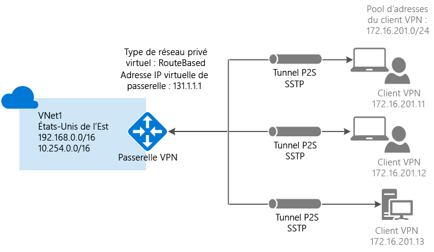


Les connexions d’authentification par certificat point à site requièrent les éléments suivants :

* Une passerelle VPN dynamique.
* La clé publique (fichier .cer) d’un certificat racine, chargée sur Azure. Ce certificat est considéré comme un certificat approuvé et est utilisé pour l’authentification.
* Un certificat client généré à partir du certificat racine et installé sur chaque ordinateur client qui se connecte. Ce certificat est utilisé pour l’authentification du client.
* Un package de configuration du client VPN doit être généré et installé sur chaque ordinateur client qui se connecte. Le package de configuration du client configure le client VPN natif qui se trouve déjà sur le système d’exploitation avec les informations nécessaires à la connexion au réseau virtuel.

Les connexions point à site ne nécessitent pas de périphérique VPN ou d’adresse IP publique locale. La connexion VPN est créée sur le protocole SSTP (Secure Socket Tunneling Protocol). Côté serveur, nous prenons en charge SSTP, versions 1.0, 1.1 et 1.2. Le client détermine la version à utiliser. Pour Windows 8.1 et supérieur, SSTP utilise la version 1.2 par défaut. 

Pour plus d’informations sur les connexions de point à site, consultez le [Forum Aux Questions sur les connexions point à site](#faq) à la fin de cet article.

### <a name="example-settings"></a>Exemples de paramètres

Vous pouvez utiliser ces valeurs pour créer un environnement de test ou vous y référer pour mieux comprendre les exemples de cet article :

* **Nom : VNet1**
* **Espace d’adressage : 192.168.0.0/16**<br>Pour cet exemple, nous n’utilisons qu’un seul espace d’adressage. Vous pouvez avoir plusieurs espaces d’adressage pour votre réseau virtuel.
* **Nom du sous-réseau : FrontEnd**
* **Plage d’adresses de sous-réseau : 192.168.1.0/24**
* **Abonnement :** vérifiez que vous utilisez l’abonnement approprié si vous en possédez plusieurs.
* **Groupe de ressources : TestRG**
* **Emplacement : États-Unis de l’Est**
* **Type de connexion : point à site**
* **Espace d’adressage du client : 172.16.201.0/24**. Les clients VPN qui se connectent au réseau virtuel à l’aide de cette connexion point à site reçoivent une adresse IP de ce pool.
* **Sous-réseau de passerelle : 192.168.200.0/24**. Le sous-réseau de passerelle doit être nommé « GatewaySubnet ».
* **Taille :** la référence de la passerelle que vous souhaitez utiliser.
* **Type de routage : dynamique**

## <a name="vnetvpn"></a>Section 1 : créer un réseau virtuel et une passerelle VPN

Avant de commencer, assurez-vous que vous disposez d’un abonnement Azure. Si vous ne disposez pas déjà d’un abonnement Azure, vous pouvez activer vos [avantages abonnés MSDN](https://azure.microsoft.com/pricing/member-offers/msdn-benefits-details) ou créer un [compte gratuit](https://azure.microsoft.com/pricing/free-trial).

### <a name="createvnet"></a>Partie 1 : création d’un réseau virtuel

Si vous n’avez pas de réseau virtuel, créez-en un. Les captures d’écran sont fournies à titre d’exemple. Assurez-vous de remplacer ces valeurs par les vôtres. Pour créer un réseau virtuel à l’aide du portail Azure, procédez comme suit :

1. Dans un navigateur, accédez au [portail Azure](http://portal.azure.com) et, si nécessaire, connectez-vous avec votre compte Azure.
2. Cliquez sur **Nouveau**. Dans le champ **Rechercher dans le marketplace**, tapez « réseau virtuel ». Localisez **Réseau virtuel** dans la liste renvoyée et cliquez pour ouvrir le panneau **Réseau virtuel**.

  
3. En bas du panneau Réseau virtuel, à partir de la liste **Sélectionner un modèle de déploiement**, choisissez **Classique** puis cliquez sur **Créer**.

  
4. Dans le panneau **Créer un réseau virtuel** , configurez les paramètres du réseau virtuel. Dans ce panneau, vous ajoutez votre premier espace d’adressage et une plage d’adresses de sous-réseau unique. Après avoir créé le réseau virtuel, vous pouvez revenir en arrière et ajouter des espaces d’adressage et des sous-réseaux supplémentaires.

  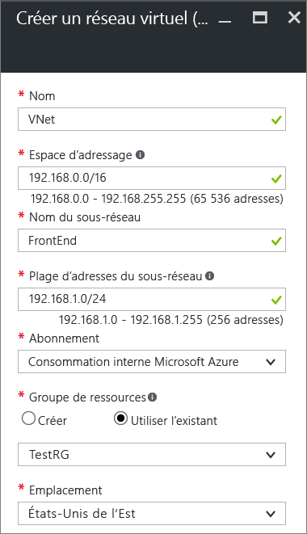
5. Vérifiez qu’il s’agit de l’ **abonnement** approprié. Vous pouvez modifier des abonnements à l’aide de la liste déroulante.
6. Cliquez sur **Groupe de ressources** et sélectionnez un groupe de ressources existant, ou créez un groupe de ressources en tapant un nom pour ce dernier. Si vous créez un groupe de ressources, nommez-le en fonction de vos valeurs de configuration planifiée. Pour plus d’informations sur les groupes de ressources, consultez [Présentation d’Azure Resource Manager](../azure-resource-manager/resource-group-overview.md#resource-groups).
7. Ensuite, sélectionnez les paramètres d’ **emplacement** pour votre réseau virtuel. L’emplacement détermine où se trouveront les ressources que vous déployez sur ce réseau virtuel.
8. Sélectionnez **Épingler au tableau de bord** si vous souhaitez être en mesure de trouver votre réseau virtuel facilement sur le tableau de bord, puis cliquez sur **Créer**.

  
9. Une fois que vous avez cliqué sur Créer, une vignette apparaît sur votre tableau de bord pour indiquer la progression de votre réseau virtuel. La vignette change lorsque le réseau virtuel est créé.

  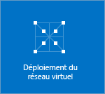
10. Une fois votre réseau virtuel créé, la mention **Créé** apparaît sous **État** sur la page Réseaux du Portail Azure Classic.
11. Ajoutez un serveur DNS (facultatif). Après avoir créé votre réseau virtuel, vous pouvez ajouter l’adresse IP d’un serveur DNS pour la résolution de noms. L’adresse IP du serveur DNS que vous spécifiez doit être celle d’un serveur DNS capable de résoudre les noms des ressources de votre réseau virtuel.<br>Pour ajouter un serveur DNS, ouvrez les paramètres de votre réseau virtuel, cliquez sur Serveurs DNS et ajoutez l’adresse IP du serveur DNS que vous souhaitez utiliser.

### <a name="gateway"></a>Partie 2 : création d’un sous-réseau de passerelle et d’une passerelle de routage dynamique

Vous allez maintenant créer un sous-réseau de passerelle et une passerelle de routage dynamique. Dans le portail Azure pour le modèle de déploiement classique, la création du sous-réseau de passerelle et de la passerelle peut être effectuée via les mêmes panneaux de configuration.

1. Dans le portail, accédez au réseau virtuel pour lequel vous souhaitez créer une passerelle.
2. Dans le panneau de votre réseau virtuel, dans le panneau **Vue d’ensemble**, puis dans la section Connexions VPN, cliquez sur **Passerelle**.

  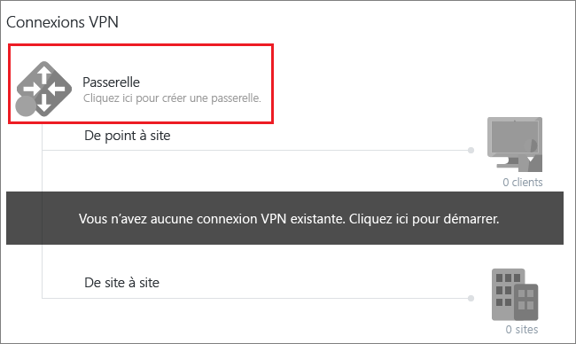
3. Dans le panneau **Nouvelle connexion VPN**, sélectionnez **Point à site**.

  
4. Pour **l’espace d’adressage du client**, ajoutez la plage d’adresses IP. Il s’agit de la plage à partir de laquelle les clients VPN reçoivent une adresse IP lorsqu’ils se connectent. Utilisez une plage d’adresses IP privées qui ne chevauche ni l’emplacement local à partir duquel vous vous connectez ni le réseau virtuel auquel vous souhaitez vous connecter. Vous pouvez supprimer la plage renseignée automatiquement, puis ajouter la plage d’adresses IP privée que vous souhaitez utiliser.

  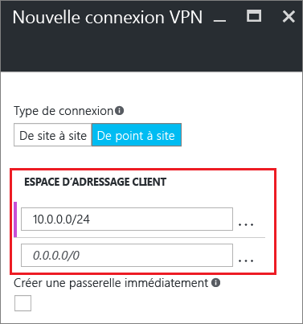
5. Cochez la case **Créer une passerelle immédiatement**.

  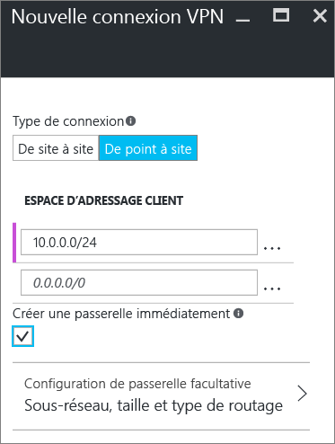
6. Cliquez sur **Configuration de passerelle facultative** pour ouvrir le panneau **Configuration de la passerelle**.

  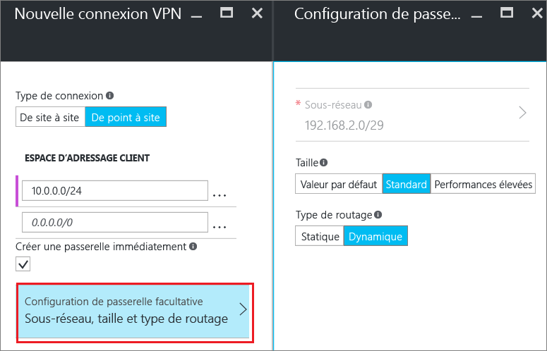
7. Cliquez sur **Subnet Configure required settings** (Configurer les paramètres requis pour le sous-réseau) pour ajouter le **sous-réseau de passerelle**. Bien qu’il soit possible de créer un sous-réseau de passerelle aussi petit que /29, nous vous recommandons de créer un sous-réseau plus vaste qui inclut un plus grand nombre d’adresses en sélectionnant au moins /28 ou /27. Cela permettra à un nombre suffisant d’adresses de s’adapter à de possibles configurations supplémentaires possibles que vous êtes susceptible de souhaiter par la suite. Lorsque vous travaillez avec des sous-réseaux de passerelle, évitez d’associer un groupe de sécurité réseau (NSG) au sous-réseau de passerelle. Si vous associez un groupe de sécurité réseau à ce sous-réseau, votre passerelle VPN cessera peut-être de fonctionner normalement.

  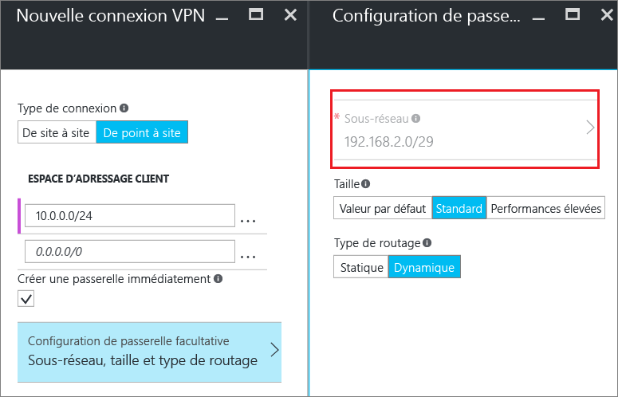
8. Sélectionnez la **taille** de la passerelle. La taille correspond à la référence SKU de votre passerelle de réseau virtuel. Dans le portail, la référence par défaut est **De base**. Pour plus d’informations sur les références de passerelle, consultez [À propos des paramètres de la passerelle VPN](vpn-gateway-about-vpn-gateway-settings.md#gwsku).

  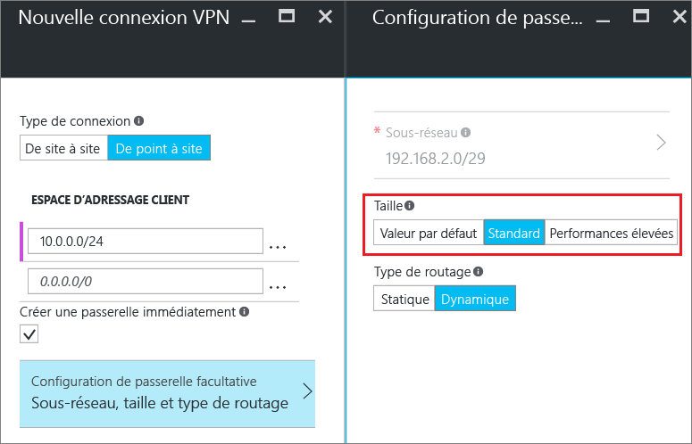
9. Sélectionnez le **type de routage** pour votre passerelle. Les configurations P2S nécessitent un type de routage **dynamique**. Cliquez sur **OK** lorsque vous avez terminé la configuration de ce panneau.

  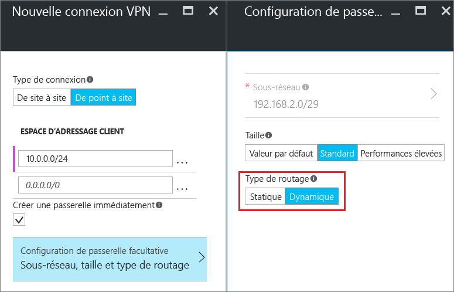
10. Dans le panneau **Nouvelle connexion VPN**, cliquez sur **OK** en bas du panneau pour commencer à créer votre passerelle de réseau virtuel. L’achèvement d’une passerelle VPN peut prendre jusqu’à 45 minutes en fonction de la référence de passerelle que vous sélectionnez.

## <a name="generatecerts"></a>Section 2 : créer des certificats

Les certificats sont utilisés par Azure pour authentifier les clients VPN pour les VPN point à site. Vous chargez les informations de la clé publique du certificat racine vers Azure. La clé publique est alors considérée comme « approuvée ». Les certificats clients doivent être générés à partir du certificat racine approuvé, puis installés sur chaque ordinateur client dans le magasin de certificats Utilisateur actuel/Personnel. Le certificat permet d’authentifier le client lorsqu’il établit une connexion avec le réseau virtuel. 

Si vous utilisez des certificats auto-signés, ceux-ci doivent être créés à l’aide de paramètres spécifiques. Vous pouvez créer un certificat auto-signé en suivant les instructions pour [PowerShell et Windows 10](vpn-gateway-certificates-point-to-site.md) ou [MakeCert](vpn-gateway-certificates-point-to-site-makecert.md). Il est important de suivre les étapes décrites dans ces instructions lorsque vous utilisez des certificats racines auto-signés et que vous générez des certificats clients à partir du certificat racine auto-signé. Dans le cas contraire, les certificats que vous créez ne seront pas compatibles avec les connexions P2S, ce qui entraînera une erreur de connexion.

### <a name="cer"></a>Partie 1 : obtention de la clé publique (.cer) pour le certificat racine

[!INCLUDE [vpn-gateway-basic-vnet-rm-portal](../../includes/vpn-gateway-p2s-rootcert-include.md)]

### <a name="genclientcert"></a>Partie 2 : génération d’un certificat client

[!INCLUDE [vpn-gateway-basic-vnet-rm-portal](../../includes/vpn-gateway-p2s-clientcert-include.md)]

## <a name="upload"></a>Section 3 - Charger le fichier .cer de certificat racine

Après la création de la passerelle, vous pouvez charger le fichier .cer (qui contient les informations de clé publique) pour un certificat racine approuvé dans Azure. Vous ne chargez pas la clé privée pour le certificat racine dans Azure. Une fois qu’un fichier .cer est chargé, Azure peut l’utiliser pour authentifier les clients qui ont installé un certificat client généré à partir du certificat racine approuvé. Vous pouvez charger ultérieurement d’autres fichiers de certificat racine approuvé, jusqu’à un total de 20, si nécessaire.  

1. Dans la section **Connexions VPN** du panneau de votre réseau virtuel, cliquez sur le graphique des **clients** pour ouvrir le panneau **Connexion VPN point à site**.

  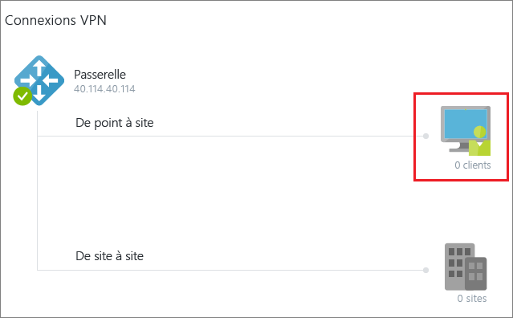
2. Dans le panneau**Connexion point à site**, cliquez sur **Gérer les certificats** pour ouvrir le panneau **Certificats**.<br>

  <br><br>
3. Dans le panneau **Certificats**, cliquez sur **Télécharger** pour ouvrir le panneau **Télécharger un certificat**.<br>

    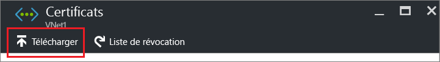<br>
4. Cliquez sur le graphique de dossier pour rechercher le fichier .cer. Sélectionnez le fichier, puis cliquez sur **OK**. Actualisez la page pour afficher le certificat chargé dans le Panneau **Certificats**.

  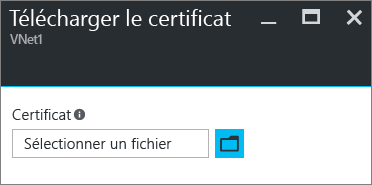<br>

## <a name="vpnclientconfig"></a>Section 4 - Configurer le client

Pour se connecter à un réseau virtuel à l’aide d’un VPN de point à site, chaque client doit installer un package pour configurer le client VPN Windows natif. Le package de configuration configure le client VPN Windows natif avec les paramètres nécessaires pour se connecter au réseau virtuel.

Vous pouvez utiliser le même package de configuration du client VPN sur chaque ordinateur client, tant que la version correspond à l’architecture du client. Pour obtenir la liste des systèmes d’exploitation clients pris en charge, consultez la section [Forum Aux Questions sur les connexions point à site](#faq) à la fin de cet article.

### <a name="part-1-generate-and-install-the-vpn-client-configuration-package"></a>Partie 1 : Générer et installer le package de configuration du client VPN

1. Dans le portail Azure, dans le panneau **Vue d’ensemble** de votre réseau virtuel, puis dans **Connexions VPN**, cliquez sur le graphique de client pour ouvrir le panneau **Connexion VPN point à site**.
2. En haut du panneau **Connexion VPN point à site**, cliquez sur le package de téléchargement correspondant au système d’exploitation client sur lequel il sera installé :

  * Pour les clients 64 bits, sélectionnez **Client VPN (64 bits)**.
  * Pour les clients 32 bits, sélectionnez **Client VPN (32 bits)**.

  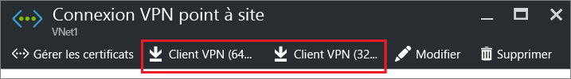<br>
3. Une fois le package généré, téléchargez-le et installez-le sur votre ordinateur client. Si une fenêtre contextuelle SmartScreen s’affiche, cliquez sur **Plus d’infos**, puis sur **Exécuter quand même**. Vous pouvez également enregistrer le package pour l’installer sur d’autres ordinateurs clients.

### <a name="part-2-install-the-client-certificate"></a>Partie 2 : Installation du certificat client

Si vous souhaitez créer une connexion P2S à partir d’un ordinateur client différent de celui que vous avez utilisé pour générer les certificats clients, vous devez installer un certificat client. Quand vous installez un certificat client, vous avez besoin du mot de passe créé lors de l’exportation du certificat client. En règle générale, il suffit de double-cliquer sur le certificat et de l’installer. Pour plus d’informations, consultez la rubrique [Installer un certificat client exporté](vpn-gateway-certificates-point-to-site.md#install).

## <a name="connect"></a>Section 5 - Se connecter à Azure

### <a name="connect-to-your-vnet"></a>Se connecter à votre réseau virtuel

1. Pour vous connecter à votre réseau virtuel, sur l’ordinateur client, accédez aux connexions VPN et recherchez celle que vous avez créée. Elle porte le même nom que votre réseau virtuel. Cliquez sur **Connecter**. Un message contextuel faisant référence à l’utilisation du certificat peut s’afficher. Le cas échéant, cliquez sur **Continuer** pour utiliser des privilèges élevés.
2. Dans la page de statut **Connexion**, cliquez sur **Connecter** pour démarrer la connexion. Si un écran **Sélectionner un certificat** apparaît, vérifiez que le certificat client affiché est celui que vous souhaitez utiliser pour la connexion. Dans le cas contraire, utilisez la flèche déroulante pour sélectionner le certificat approprié, puis cliquez sur **OK**.

  
3. Votre connexion est établie.

  

[!INCLUDE [verify client certificates](../../includes/vpn-gateway-certificates-verify-client-cert-include.md)]

### <a name="verify-the-vpn-connection"></a>Vérifier la connexion VPN

1. Pour vérifier que votre connexion VPN est active, ouvrez une invite de commandes avec élévation de privilèges, puis exécutez *ipconfig/all*.
2. Affichez les résultats. Notez que l’adresse IP que vous avez reçue est l’une des adresses de la plage d’adresses de connectivité point à site que vous avez spécifiée quand vous avez créé votre réseau virtuel. Les résultats devraient être semblables à cet exemple :

  ```
    PPP adapter VNet1:
        Connection-specific DNS Suffix .:
        Description.....................: VNet1
        Physical Address................:
        DHCP Enabled....................: No
        Autoconfiguration Enabled.......: Yes
        IPv4 Address....................: 192.168.130.2(Preferred)
        Subnet Mask.....................: 255.255.255.255
        Default Gateway.................:
        NetBIOS over Tcpip..............: Enabled
  ```

## <a name="connectVM"></a>Connexion à une machine virtuelle

[!INCLUDE [Connect to a VM](../../includes/vpn-gateway-connect-vm-p2s-classic-include.md)]

## <a name="add"></a>Ajout ou suppression de certificats racine approuvés

Vous pouvez ajouter et supprimer des certificats racines approuvés à partir d'Azure. Lorsque vous supprimez un certificat racine, les clients qui possèdent un certificat généré à partir de cette racine ne seront plus en mesure de s’authentifier, et donc de se connecter. Si vous souhaitez que des clients s’authentifient et se connectent, vous devez installer un nouveau certificat client généré à partir d’un certificat racine approuvé (téléchargé) dans Azure.

### <a name="to-add-a-trusted-root-certificate"></a>Ajout d’un certificat racine approuvé

Vous pouvez ajouter jusqu’à 20 fichiers .cer de certificat racine approuvés dans Azure. Pour obtenir des instructions, consultez [Section 3 - Charger le fichier .cer de certificat racine](#upload).

### <a name="to-remove-a-trusted-root-certificate"></a>Suppression d’un certificat racine approuvé

1. Dans la section **Connexions VPN** du panneau de votre réseau virtuel, cliquez sur le graphique des **clients** pour ouvrir le panneau **Connexion VPN point à site**.

  
2. Dans le panneau**Connexion point à site**, cliquez sur **Gérer les certificats** pour ouvrir le panneau **Certificats**.<br>

  <br><br>
3. Dans le panneau **Certificats**, cliquez sur le bouton de sélection correspondant au certificat que vous souhaitez supprimer, puis cliquez sur **Supprimer**.

  <br>

## <a name="revokeclient"></a>Révocation d'un certificat client

Vous pouvez révoquer des certificats clients. La liste de révocation de certificat vous permet de refuser sélectivement la connexion point à site en fonction des certificats clients individuels. Cela est différent de la suppression d’un certificat racine approuvé. Si vous supprimez un fichier .cer de certificat racine approuvé d’Azure, vous révoquez l’accès pour tous les certificats clients générés/signés par le certificat racine révoqué. Révoquer un certificat client plutôt que le certificat racine permet de continuer à utiliser les autres certificats générés à partir du certificat racine pour l’authentification de la connexion Point à site.

La pratique courante consiste à utiliser le certificat racine pour gérer l'accès au niveaux de l'équipe ou de l'organisation, tout en utilisant des certificats clients révoqués pour le contrôle d'accès précis des utilisateurs individuels.

### <a name="to-revoke-a-client-certificate"></a>Révocation d'un certificat client

Vous pouvez révoquer un certificat client en ajoutant son empreinte à la liste de révocation.

1. Récupérez l’empreinte du certificat client. Pour plus d’informations, consultez l’article [Comment : récupérer l’empreinte numérique d’un certificat](https://msdn.microsoft.com/library/ms734695.aspx).
2. Copiez les informations dans un éditeur de texte et supprimez tous les espaces afin d’obtenir une chaîne continue.
3. Accédez au panneau **« nom du réseau virtuel classique » > Connexion VPN Point à site > Certificats**, puis cliquez sur **Liste de révocation** pour ouvrir le panneau Liste de révocation. 
4. Dans le panneau **Liste de révocation**, cliquez sur **+ Ajouter un certificat** pour ouvrir le panneau **Ajouter un certificat à la liste de révocation**.
5. Dans le panneau **Ajouter un certificat à la liste de révocation**, collez l’empreinte numérique du certificat sur une seule ligne continue de texte, sans espaces. Cliquez sur **OK** au bas du panneau.
6. Une fois la mise à jour terminée, le certificat ne peut plus être utilisé pour se connecter. Les clients qui tentent de se connecter à l’aide de ce certificat reçoivent un message indiquant que le certificat n’est plus valide.

## <a name="faq"></a>Forum Aux Questions sur les connexions point à site

[!INCLUDE [Point-to-Site FAQ](../../includes/vpn-gateway-point-to-site-faq-include.md)]

## <a name="next-steps"></a>Étapes suivantes
Une fois la connexion achevée, vous pouvez ajouter des machines virtuelles à vos réseaux virtuels. Pour plus d’informations, consultez [Machines virtuelles](https://docs.microsoft.com/azure/#pivot=services&panel=Compute). Pour plus d’informations sur la mise en réseau et les machines virtuelles, consultez [Vue d’ensemble du réseau de machines virtuelles Azure et Linux](../virtual-machines/linux/azure-vm-network-overview.md).
