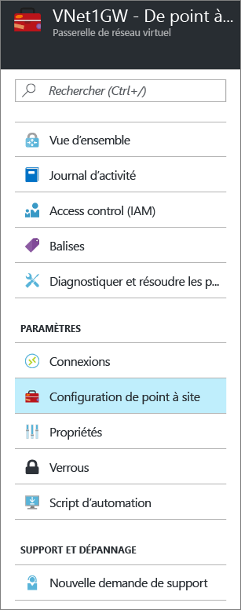

# Configuration d’une connexion point à site à un réseau virtuel à l’aide du portail Azure
> [!div class="op_single_selector"]
> * [Resource Manager - Portail Azure](vpn-gateway-howto-point-to-site-resource-manager-portal.md)
> * [Resource Manager - PowerShell](vpn-gateway-howto-point-to-site-rm-ps.md)
> * [Classic - Portail Azure](vpn-gateway-howto-point-to-site-classic-azure-portal.md)
> 
> 

Une configuration point à site (P2S) vous permet de connecter de manière sécurisée un ordinateur client individuel à un réseau virtuel. Le P2S est une connexion VPN sur SSTP (Secure Socket Tunneling Protocol). Les connexions point à site sont utiles lorsque vous souhaitez vous connecter à votre réseau virtuel à partir d’un site distant, comme depuis votre domicile ou une conférence ou lorsque seulement quelques clients doivent se connecter à un réseau virtuel. Les connexions de ce type ne nécessitent pas de périphérique VPN ou d’adresse IP publique. Vous établissez la connexion VPN depuis l’ordinateur client.

Cet article vous guide dans le processus de création d’un réseau virtuel avec une connexion point à site à l’aide du portail Azure. Pour plus d’informations sur les connexions de point à site, consultez le [Forum Aux Questions sur les connexions point à site](#faq) à la fin de cet article.

### Méthodes et modèles de déploiement pour les connexions P2S
[!INCLUDE [deployment models](../../includes/vpn-gateway-deployment-models-include.md)]

Le tableau suivant présente les deux modèles de déploiement et les méthodes de déploiement disponibles pour les configurations P2S. Quand un article avec les étapes de configuration est disponible, le lien vers cet article est ajouté à ce tableau.

[!INCLUDE [vpn-gateway-clasic-rm](../../includes/vpn-gateway-table-point-to-site-include.md)]

## Flux de travail de base

### Exemples de valeurs
* **Nom : VNet1**
* **Espace d’adressage : 192.168.0.0/16** Pour cet exemple, nous n’utilisons qu’un seul espace d’adressage. Vous pouvez avoir plusieurs espaces d’adressage pour votre réseau virtuel.
* **Nom du sous-réseau : FrontEnd**
* **Plage d’adresses de sous-réseau : 192.168.1.0/24**
* **Abonnement :** vérifiez que vous utilisez l’abonnement approprié si vous en possédez plusieurs.
* **Groupe de ressources : TestRG**
* **Emplacement : États-Unis de l’Est**
* **Sous-réseau de passerelle : 192.168.200.0/24**
* **Nom de passerelle de réseau virtuel : VNet1GW**
* **Type de passerelle : VPN**
* **Type de VPN : Route-based**
* **Adresse IP publique : VNet1GWpip**
* **Type de connexion : point à site**
* **Pool d’adresses des clients : 172.16.201.0/24** Les clients VPN qui se connectent au réseau virtuel à l’aide de cette connexion point à site reçoivent une adresse IP de ce pool d’adresses des clients.

## Partie 1 : création d’un réseau virtuel
Avant de commencer, assurez-vous que vous disposez d’un abonnement Azure. Si vous ne disposez pas déjà d’un abonnement Azure, vous pouvez activer vos [avantages abonnés MSDN](https://azure.microsoft.com/pricing/member-offers/msdn-benefits-details) ou créer un [compte gratuit](https://azure.microsoft.com/pricing/free-trial). Si vous créez cette configuration dans le cadre d’un exercice, vous pouvez vous reporter aux [exemples de valeurs](#example).

[!INCLUDE [vpn-gateway-basic-vnet-rm-portal](../../includes/vpn-gateway-basic-vnet-rm-portal-include.md)]

## Partie 2 : Spécifier l’espace d’adressage et les sous-réseaux
Vous pouvez ajouter des sous-réseaux et des espaces d’adressage supplémentaires pour votre réseau virtuel une fois qu’il a été créé.

[!INCLUDE [vpn-gateway-additional-address-space](../../includes/vpn-gateway-additional-address-space-include.md)]

## Partie 3 : Ajout d’un sous-réseau de passerelle

Avant de connecter votre réseau virtuel à une passerelle, vous devez créer le sous-réseau de passerelle pour le réseau virtuel auquel vous souhaitez vous connecter. Les adresses de passerelle utilisent les adresses spécifiées dans le sous-réseau de passerelle. Si possible, créez un sous-réseau de passerelle à l’aide d’un bloc CIDR de /28 ou /27 pour fournir suffisamment d’adresses IP pour satisfaire les exigences de configuration future supplémentaires.

Les captures d’écran de cette section fournissent un exemple de référence. Veillez à utiliser la plage d’adresses GatewaySubnet correspondant aux valeurs requises pour votre configuration.

###Pour créer un sous-réseau de passerelle

[!INCLUDE [vpn-gateway-add-gwsubnet-rm-portal](../../includes/vpn-gateway-add-gwsubnet-rm-portal-include.md)]

## Partie 4 : Spécifier un serveur DNS (facultatif)

Aucun DNS n’est nécessaire pour une connexion de point à site. Toutefois, si vous souhaitez résoudre les noms des ressources qui sont déployées sur votre réseau virtuel, vous devez spécifier un serveur DNS. Ce paramètre vous permet de spécifier le serveur DNS que vous souhaitez utiliser pour la résolution de noms pour ce réseau virtuel. Il n'entraîne pas la création d'un serveur DNS.

[!INCLUDE [vpn-gateway-add-dns-rm-portal](../../includes/vpn-gateway-add-dns-rm-portal-include.md)]

## Partie 5 : Créer une passerelle de réseau virtuel
Les connexions point à site nécessitent les paramètres suivants :

* Type de passerelle : VPN
* Type de VPN : Route-based

### Pour créer une passerelle de réseau virtuel
[!INCLUDE [vpn-gateway-add-gw-rm-portal](../../includes/vpn-gateway-add-gw-rm-portal-include.md)]

## Partie 6 : Générer des certificats

Les certificats sont utilisés par Azure pour authentifier les clients VPN pour les VPN point à site. Après avoir créé le certificat racine, vous exportez les données de certificat public (et non la clé privée) en tant que fichier .cer X.509 encodé en base 64. Vous chargez ensuite les données de certificat public à partir du certificat racine dans Azure.

Chaque ordinateur client qui se connecte à un réseau virtuel à l’aide d’une connexion point à site doit avoir un certificat client installé. Le certificat client est généré à partir du certificat racine et installé sur chaque ordinateur client. Si aucun certificat client valide n’est installé et que le client essaie de se connecter au réseau virtuel, l’authentification échoue.

### Étape 1 : Obtenir le fichier .cer pour le certificat racine

#### Certificat d’entreprise
 
Si vous utilisez une solution d’entreprise, vous pouvez utiliser votre chaîne de certificats existante. Obtenez le fichier .cer pour le certificat racine que vous souhaitez utiliser.

#### Certificat racine auto-signé

Si vous n’utilisez pas de solution de certificat d’entreprise, vous devez générer un certificat racine auto-signé. Pour créer un certificat racine auto-signé qui contient les champs nécessaires pour l’authentification P2S, vous pouvez utiliser PowerShell. La page [Create a self-signed root certificate for Point-to-Site connections using PowerShell](vpn-gateway-certificates-point-to-site.md) (Créer un certificat auto-signé pour les connexions de point à site à l’aide de PowerShell) vous guide à travers les étapes permettant de créer un certificat racine auto-signé.

> [!NOTE]
> La méthode makecert était auparavant recommandée pour créer les certificats racine auto-signés et générer des certificats clients pour les connexions point à site. Vous pouvez désormais utiliser PowerShell pour créer ces certificats. L’un des avantages de l’utilisation de PowerShell est la possibilité de créer des certificats SHA-2. Pour connaître les valeurs requises, consultez la page [Create a self-signed root certificate for Point-to-Site connections using PowerShell](vpn-gateway-certificates-point-to-site.md) (Créer un certificat auto-signé pour les connexions de point à site à l’aide de PowerShell).
>
>

#### Pour exporter la clé publique d’un certificat racine auto-signé

Les connexions point à site requièrent le chargement de la clé publique (.cer) dans Azure. Les étapes suivantes vous aideront à exporter le fichier .cer pour votre certificat racine auto-signé.

1. Pour obtenir un fichier .cer du certificat, ouvrez **Gérer les certificats utilisateur**.
2. Localisez le certificat racine auto-signé « P2SRootCert » dans « Certificats - Utilisateur actuel\Personnel\Certificats », puis cliquez avec le bouton droit. Cliquez sur **Toutes les tâches**, puis cliquez sur **Exporter** pour ouvrir **l’Assistant Exportation du certificat**.
3. Dans l’assistant, cliquez sur **Suivant**. Sélectionnez **Non, ne pas exporter la clé privée**, puis cliquez sur **Suivant**.
4. Sur la page **Format du fichier d’exportation**, sélectionnez **X.509 encodé en base 64 (*.cer)**, puis cliquez sur **Suivant**. 
5. Sur la page **Fichier à exporter**, accédez à « C: », créez un sous-répertoire appelé « cert », puis sélectionnez-le. Attribuez au fichier de certificat le nom « P2SRootCert.cer », puis cliquez sur **Enregistrer**. 
6. Cliquez sur **Suivant**, puis sur **Terminer** pour exporter le certificat. Le message **L’exportation a réussi** s’affiche. Cliquez sur **OK** pour fermer l’assistant.

### Étape 2 : Générer un certificat client
Vous pouvez soit générer un certificat unique pour chaque client, soir utiliser le même certificat sur plusieurs clients. Le fait de générer des certificats clients uniques vous offre la possibilité de révoquer un seul certificat. Dans le cas contraire, si tous les clients utilisent le même certificat client et que vous devez révoquer ce dernier, vous devrez générer et installer de nouveaux certificats pour tous les clients qui utilisent ce certificat pour s’authentifier.

#### Certificat d’entreprise
- Si vous utilisez une solution de certificat d’entreprise, générez un certificat client avec le format de valeur de nom commun « name@yourdomain.com », plutôt que le format « nom_domaine\nom_utilisateur ».
- Assurez-vous que le certificat client repose sur le modèle de certificat « Utilisateur » qui indique « Authentification client » comme premier élément dans la liste d’usages, plutôt que la mention « Ouverture de session par carte à puce » ou autre. Vous pouvez vérifier le certificat en double-cliquant sur le certificat client et en affichant **Détails > Utilisation avancée de la clé**.

#### Certificat racine auto-signé 
Si vous utilisez un certificat racine auto-signé, consultez la section [Generate a client certificate using PowerShell](vpn-gateway-certificates-point-to-site.md#clientcert) (Générer un certificat client à l’aide de PowerShell) pour savoir comment générer un certificat client compatible avec les connexions point à site.

### Étape 3 : Exporter le certificat client
Si vous générez un certificat client à partir d’un certificat racine auto-signé à l’aide des instructions [PowerShell](vpn-gateway-certificates-point-to-site.md#clientcert), il est automatiquement installé sur l’ordinateur que vous avez utilisé pour le générer. Si vous souhaitez installer un certificat client sur un autre ordinateur client, vous devez l’exporter.
 
1. Pour exporter un certificat client, ouvrez **Gérer les certificats utilisateur**. Cliquez avec le bouton droit sur le certificat client à exporter, cliquez sur **Toutes les tâches**, puis cliquez sur **Exporter** pour ouvrir **l’Assistant Exportation du certificat**.
2. Dans l’Assistant, cliquez sur **Suivant**, sélectionnez **Oui, exporter la clé privée**, puis cliquez sur **Suivant**.
3. Dans la page **Format de fichier d’exportation**, laissez les valeurs par défaut sélectionnées. Assurez-vous que l’option **Inclure tous les certificats dans le chemin d’accès de certification, si possible** est sélectionnée pour exporter également les informations de certificat racine requises. Cliquez ensuite sur **Suivant**.
4. Dans la page **Sécurité** , vous devez protéger la clé privée. Si vous choisissez d’utiliser un mot de passe, veillez à enregistrer ou à mémoriser celui que vous définissez pour ce certificat. Cliquez ensuite sur **Suivant**.
5. Dans **Fichier à exporter**, cliquez sur **Parcourir** pour accéder à l’emplacement vers lequel vous souhaitez exporter le certificat. Pour la zone **Nom de fichier**, nommez le fichier de certificat. Cliquez ensuite sur **Suivant**.
6. Cliquez sur **Terminer** pour exporter le certificat.   

## Partie 7 : Ajouter le pool d’adresses des clients
1. Une fois la passerelle de réseau virtuel créée, accédez à la section **Paramètres** du panneau Passerelle de réseau virtuel. Dans la section **Paramètres**, cliquez sur **Configuration de point à site** pour ouvrir le panneau **Configuration**.
   
    
2. **Pool d’adresses** est le pool d’adresses IP duquel les clients qui se connectent reçoivent une adresse IP. Ajoutez le pool d’adresses, puis cliquez sur **Enregistrer**.
   
    

## Partie 8 : Charger le fichier .cer de certificat racine
Une fois la passerelle créée, vous pouvez charger le fichier .cer pour un certificat racine approuvé dans Azure. Vous pouvez charger des fichiers pour 20 certificats racine maximum. Vous ne chargez pas la clé privée pour le certificat racine dans Azure. Une fois le fichier .cer chargé, Azure l’utilise pour authentifier les clients qui se connectent au réseau virtuel.

1. Les certificats sont ajoutés dans le panneau **Configuration de point à site**, dans la section **Certificat racine**.  
2. Vérifiez que vous avez exporté le certificat racine en tant que fichier Base-64 codé X.509 (.cer). Vous devez exporter le certificat dans ce format pour être en mesure de l’ouvrir avec un éditeur de texte.
3. Ouvrez le certificat avec un éditeur de texte, Bloc-notes par exemple. Copiez uniquement la section suivante sur une seule ligne continue :
   
    

    > [!NOTE]
    > Lors de la copie des données de certificat, assurez-vous que vous copiez le texte en une seule ligne continue sans retour chariot ou sauts de ligne. Vous devrez peut-être modifier l’affichage dans l’éditeur de texte en activant « Afficher les symboles/Afficher tous les caractères » pour afficher les retours chariot et sauts de ligne.                                                                                                                                                                            
    >
    >

4. Collez les données du certificat dans le champ **Données du certificat public**. Donnez un **Nom** au certificat, puis cliquez sur **Enregistrer**. Vous pouvez ajouter jusqu’à 20 certificats racine approuvés.
   
    

## Partie 9 : Télécharger et installer le package de configuration du client VPN
Un certificat client et un package de configuration du client VPN doivent être installés sur les clients se connectant à Azure via P2S. Des packages de configuration de client VPN sont disponibles pour les clients Windows. 

Le package client VPN contient des informations pour configurer le logiciel client VPN qui est intégré à Windows. La configuration est spécifique au VPN auquel vous souhaitez vous connecter. Le package n’installe aucun logiciel supplémentaire.

Vous pouvez utiliser le même package de configuration du client VPN sur chaque ordinateur client, tant que la version correspond à l’architecture du client.

### Étape 1 : téléchargement du package de configuration du client

1. Dans la panneau **Configuration de point à site**, cliquez sur **Télécharger le client VPN** pour ouvrir le panneau **Télécharger le client VPN**. La création du package prend une ou deux minutes.
   
    
2. Sélectionnez le package approprié pour votre client, puis cliquez sur **Télécharger**. Enregistrez le fichier de package de configuration. Vous installez le package de configuration du client VPN sur chaque ordinateur client qui se connecte au réseau virtuel.

    

### Étape 2 : installation du package de configuration du client

1. Copiez le fichier de configuration localement sur l’ordinateur que vous souhaitez connecter à votre réseau virtuel. 
2. Double-cliquez sur le fichier .exe pour installer le package sur l’ordinateur client. Étant donné que vous avez créé le package de configuration, ce dernier n’est pas signé, et vous pouvez donc voir apparaître un avertissement. Si une fenêtre contextuelle Windows SmartScreen s’affiche, cliquez sur **Plus d’infos** (à gauche), puis sur **Exécuter quand même** pour installer le package.
3. Installez le package sur l’ordinateur client. Si une fenêtre contextuelle Windows SmartScreen s’affiche, cliquez sur **Plus d’infos** (à gauche), puis sur **Exécuter quand même** pour installer le package.
4. Sur l’ordinateur client, accédez à **Paramètres réseau**, puis cliquez sur **VPN**. La connexion VPN indique le nom du réseau virtuel auquel elle se connecte.

## Partie 10 : installation d’un certificat client exporté

Si vous souhaitez créer une connexion P2S à partir d’un ordinateur client différent de celui que vous avez utilisé pour générer les certificats clients, vous devez installer un certificat client. Lorsque vous installez un certificat client, vous avez besoin du mot de passe créé lors de l’exportation du certificat client.

1. Recherchez le fichier *.pfx* et copiez-le sur l’ordinateur client. Sur l’ordinateur client, double-cliquez sur le fichier *.pfx* à installer. Laissez la zone **Emplacement de stockage** définie sur **Utilisateur actuel**, puis cliquez sur **Suivant**.
2. N’apportez aucune modification à la page **Fichier à importer** . Cliquez sur **Suivant**.
3. Sur la page **Protection de clé privée**, entrez le mot de passe du certificat, ou vérifiez que le principal de sécurité est correct, puis cliquez sur **Suivant**.
4. Dans la page **Magasin de certificats**, laissez l’emplacement par défaut, puis cliquez sur **Suivant**.
5. Cliquez sur **Terminer**. Dans la page **Avertissement de sécurité** relative à l’installation du certificat, cliquez sur **Oui**. Vous pouvez cliquer sur « Oui » sans hésitation, car vous avez généré le certificat. Le certificat est désormais importé.

## Partie 11 : Se connecter à Azure
 
 1. Pour vous connecter à votre réseau virtuel, sur l’ordinateur client, accédez aux connexions VPN et recherchez celle que vous avez créée. Elle porte le même nom que votre réseau virtuel. Cliquez sur **Connecter**. Un message contextuel faisant référence à l’utilisation du certificat peut s’afficher. Cliquez sur **Continuer** pour utiliser des privilèges élevés.

2. Dans la page de statut **Connexion**, cliquez sur **Connecter** pour démarrer la connexion. Si un écran **Sélectionner un certificat** apparaît, vérifiez que le certificat client affiché est celui que vous souhaitez utiliser pour la connexion. Dans le cas contraire, utilisez la flèche déroulante pour sélectionner le certificat approprié, puis cliquez sur **OK**.
   
    
3. Votre connexion est établie.
   
    

Si vous avez des problèmes pour vous connecter, effectuez les vérifications suivantes :

- Ouvrez **Gérer les certificats utilisateur**, puis accédez à **Autorités de certification racines de confiance\Certificats**. Vérifiez que le certificat racine est répertorié. Le certificat racine doit être présent pour que l’authentification puisse fonctionner. Lorsque vous exportez un fichier .pfx de certificat client à l’aide de la valeur par défaut « Inclure tous les certificats dans le chemin d’accès de certification, si possible », les informations de certificat racine sont également exportées. Lorsque vous installez le certificat client, le certificat racine est alors également installé sur l’ordinateur client. 

- Si vous utilisez un certificat qui a été émis à l’aide d’une autorité de certification d’entreprise et que vous rencontrez des problèmes pour l’authentification, vérifiez l’ordre de l’authentification sur le certificat client. Vous pouvez vérifier l’ordre de la liste d’authentification en double-cliquant sur le certificat client et en accédant à **Détails > Utilisation avancée de la clé**. Vérifiez que la liste affiche « Authentification client » comme premier élément. Si ce n’est pas le cas, vous devez émettre un certificat client basé sur le modèle Utilisateur disposant de l’authentification client comme premier élément dans la liste.

## Partie 12 : Vérifier votre connexion
1. Pour vérifier que votre connexion VPN est active, ouvrez une invite de commandes avec élévation de privilèges, puis exécutez *ipconfig/all*.
2. Affichez les résultats. Notez que l’adresse IP que vous avez reçue est l’une des adresses du pool d’adresses de client VPN point à site que vous avez spécifiées dans votre configuration. Les résultats ressemblent à l’exemple qui suit :
   
        PPP adapter VNet1:
            Connection-specific DNS Suffix .:
            Description.....................: VNet1
            Physical Address................:
            DHCP Enabled....................: No
            Autoconfiguration Enabled.......: Yes
            IPv4 Address....................: 172.16.201.3(Preferred)
            Subnet Mask.....................: 255.255.255.255
            Default Gateway.................:
            NetBIOS over Tcpip..............: Enabled

Si vous avez des difficultés à vous connecter à une machine virtuelle sur P2S, utilisez « ipconfig » pour vérifier l’adresse IPv4 attribuée à l’adaptateur Ethernet sur l’ordinateur à partir duquel vous vous connectez. Si l’adresse IP est comprise dans la plage d’adresses du réseau virtuel auquel vous vous connectez, ou dans la plage d’adresses de votre VPNClientAddressPool, cette situation est désignée sous le terme d’espaces d’adressage qui se chevauchent. Lorsque vos espaces d’adressage se chevauchent de cette façon, le trafic réseau n’atteint pas Azure et reste sur le réseau local. Si vos espaces d’adressage réseau ne se chevauchent pas et que vous ne parvenez toujours pas à vous connecter à votre machine virtuelle, consultez l’article [Résolution des problèmes de connexion Bureau à distance avec une machine virtuelle Azure](../virtual-machines/windows/troubleshoot-rdp-connection.md).

## Ajout ou suppression de certificats racine approuvés
Vous pouvez ajouter et supprimer des certificats racines approuvés à partir d'Azure. Lorsque vous supprimez un certificat approuvé, les certificats clients qui ont été générés à partir du certificat racine ne peuvent pas se connecter à Azure par la biais de la connexion point à site. Si vous souhaitez que des clients se connectent, vous devez installer un nouveau certificat client généré à partir d’un certificat approuvé dans Azure.

### Ajout d’un certificat racine approuvé

Vous pouvez ajouter jusqu’à 20 fichiers .cer de certificat racine approuvés dans Azure. Pour obtenir des instructions, consultez la section [Télécharger un certificat racine approuvé](#uploadfile) dans cet article.

### Suppression d’un certificat racine approuvé

1. Pour supprimer un certificat racine approuvé, accédez au panneau **Configuration Point à site** de votre passerelle de réseau virtuel.
2. Dans la section **Certificat racine** du panneau, recherchez le certificat que vous souhaitez supprimer.
3. Cliquez sur le bouton de sélection correspondant au certificat, puis cliquez sur « Supprimer ».

## Révocation d'un certificat client
Vous pouvez révoquer des certificats clients. La liste de révocation de certificat vous permet de refuser sélectivement la connexion point à site en fonction des certificats clients individuels. Cela est différent de la suppression d’un certificat racine approuvé. Si vous supprimez un fichier .cer de certificat racine approuvé d’Azure, vous révoquez l’accès pour tous les certificats clients générés/signés par le certificat racine révoqué. Le fait de révoquer un certificat client plutôt que le certificat racine permet de continuer à utiliser les autres certificats générés à partir du certificat racine pour l’authentification.

La pratique courante consiste à utiliser le certificat racine pour gérer l'accès au niveaux de l'équipe ou de l'organisation, tout en utilisant des certificats clients révoqués pour le contrôle d'accès précis des utilisateurs individuels.

### Révocation d'un certificat client

Vous pouvez révoquer un certificat client en ajoutant son empreinte à la liste de révocation.

1. Récupérez l’empreinte du certificat client. Pour plus d’informations, consultez l’article [Comment : récupérer l’empreinte numérique d’un certificat](https://msdn.microsoft.com/library/ms734695.aspx).
2. Copiez les informations dans un éditeur de texte et supprimez tous les espaces afin d’obtenir une chaîne continue.
3. Accédez au panneau **Configuration Point à site** de la passerelle de réseau virtuel. Il s’agit du panneau que vous avez utilisé pour [charger un certificat racine approuvé](#uploadfile).
4. Dans la section **Certificats révoqués**, entrez un nom convivial pour le certificat (il ne s’agit pas forcément du nom commun du certificat).
5. Copiez et collez la chaîne d’empreinte numérique dans le champ **Empreinte**.
6. L’empreinte est validée et automatiquement ajoutée à la liste de révocation. Un message apparaît pour indiquer que la liste est en cours de mise à jour. 
7. Une fois la mise à jour terminée, le certificat ne peut plus être utilisé pour se connecter. Les clients qui tentent de se connecter à l’aide de ce certificat reçoivent un message indiquant que le certificat n’est plus valide.

## Forum Aux Questions sur les connexions point à site

[!INCLUDE [Point-to-Site FAQ](../../includes/vpn-gateway-point-to-site-faq-include.md)]

## Étapes suivantes
Une fois la connexion achevée, vous pouvez ajouter des machines virtuelles à vos réseaux virtuels. Pour plus d’informations, consultez [Machines virtuelles](https://docs.microsoft.com/azure/#pivot=services&panel=Compute). Pour plus d’informations sur la mise en réseau et les machines virtuelles, consultez [Vue d’ensemble du réseau de machines virtuelles Azure et Linux](../virtual-machines/linux/azure-vm-network-overview.md).

