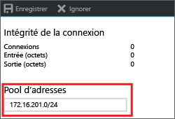
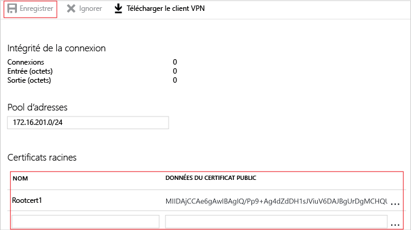

# <a name="configure-a-point-to-site-connection-to-a-vnet-using-certificate-authentication-azure-portal"></a>Configurer une connexion point à site vers un réseau virtuel à l’aide d’une authentification par certificat : portail Azure

Cet article vous explique comment créer un réseau virtuel avec une connexion point à site dans le modèle de déploiement Resource Manager à l’aide du portail Azure. Cette configuration utilise des certificats pour authentifier le client qui se connecte. Vous pouvez également créer cette configuration à l’aide d’un autre outil ou modèle de déploiement en sélectionnant une option différente dans la liste suivante :

> [!div class="op_single_selector"]
> * [Portail Azure](vpn-gateway-howto-point-to-site-resource-manager-portal.md)
> * [PowerShell](vpn-gateway-howto-point-to-site-rm-ps.md)
> * [Portail Azure (classique)](vpn-gateway-howto-point-to-site-classic-azure-portal.md)
>
>

Une connexion par passerelle VPN point à site (P2S) vous permet de créer une connexion sécurisée à votre réseau virtuel à partir d’un ordinateur de client individuel. Les connexions VPN point à site sont utiles lorsque vous souhaitez vous connecter à votre réseau virtuel à partir d’un emplacement distant, par exemple lorsque vous travaillez à distance depuis votre domicile ou en conférence. De même, l’utilisation d’un VPN P2S est une solution utile qui constitue une alternative au VPN Site à Site lorsqu’un nombre restreint de clients doivent se connecter à un réseau virtuel. 

P2S utilise le Protocole SSTP (Secure Socket Tunneling Protocol), qui est un protocole VPN basé sur le protocole SSL. Une connexion VPN P2S est établie en étant démarrée à partir de l’ordinateur du client.


Les connexions d’authentification par certificat point à site requièrent les éléments suivants :

* Une passerelle VPN RouteBased.
* La clé publique (fichier .cer) d’un certificat racine, chargée sur Azure. Une fois le certificat chargé, il est considéré comme un certificat approuvé et est utilisé pour l’authentification.
* Un certificat client généré à partir du certificat racine et installé sur chaque ordinateur client qui se connecte au réseau virtuel. Ce certificat est utilisé pour l’authentification du client.
* Un package de configuration du client VPN. Le package de configuration du client VPN contient les informations nécessaires au client pour se connecter au réseau virtuel. Le package configure le client VPN existant qui est natif du système d’exploitation Windows. Chaque client qui se connecte doit être configuré à l’aide du package de configuration.

Les connexions point à site ne nécessitent pas de périphérique VPN ou d’adresse IP publique locale. La connexion VPN est créée sur le protocole SSTP (Secure Socket Tunneling Protocol). Côté serveur, nous prenons en charge SSTP, versions 1.0, 1.1 et 1.2. Le client détermine la version à utiliser. Pour Windows 8.1 et supérieur, SSTP utilise la version 1.2 par défaut.

Pour plus d’informations sur les connexions de point à site, consultez le [Forum Aux Questions sur les connexions point à site](#faq) à la fin de cet article.

#### <a name="example"></a>Exemples de valeurs

Vous pouvez utiliser ces valeurs pour créer un environnement de test ou vous y référer pour mieux comprendre les exemples de cet article :

* **Nom du réseau virtuel :** VNet1
* **Espace d’adressage :** 192.168.0.0/16<br>Pour cet exemple, nous n’utilisons qu’un seul espace d’adressage. Vous pouvez avoir plusieurs espaces d’adressage pour votre réseau virtuel.
* **Nom du sous-réseau :** FrontEnd
* **Plage d’adresses de sous-réseau :** 192.168.1.0/24
* **Abonnement :** vérifiez que vous utilisez l’abonnement approprié si vous en possédez plusieurs.
* **Groupe de ressources :** TestRG
* **Emplacement :** États-Unis de l’Est
* **Sous-réseau de passerelle :** 192.168.200.0/24<br>
* **Serveur DNS :** (facultatif) l’adresse IP du serveur DNS que vous souhaitez utiliser pour la résolution de noms.
* **Nom de passerelle de réseau virtuel :** VNet1GW
* **Type de passerelle :** VPN
* **Type de VPN :** Route-based
* **Adresse IP publique :** VNet1GWpip
* **Type de connexion :** point à site
* **Pool d’adresses des clients :** 172.16.201.0/24<br>Les clients VPN qui se connectent au réseau virtuel à l’aide de cette connexion point à site reçoivent une adresse IP de ce pool d’adresses des clients.

## <a name="createvnet"></a>1. Créez un réseau virtuel

Avant de commencer, assurez-vous que vous disposez d’un abonnement Azure. Si vous ne disposez pas déjà d’un abonnement Azure, vous pouvez activer vos [avantages abonnés MSDN](https://azure.microsoft.com/pricing/member-offers/msdn-benefits-details) ou créer un [compte gratuit](https://azure.microsoft.com/pricing/free-trial).

[!INCLUDE [Basic Point-to-Site VNet](../../includes/vpn-gateway-basic-p2s-vnet-rm-portal-include.md)]

## <a name="gatewaysubnet"></a>2. Ajouter un sous-réseau de passerelle

Avant de connecter votre réseau virtuel à une passerelle, vous devez créer le sous-réseau de passerelle pour le réseau virtuel auquel vous souhaitez vous connecter. Les adresses de passerelle utilisent les adresses spécifiées dans le sous-réseau de passerelle. Si possible, créez un sous-réseau de passerelle à l’aide d’un bloc CIDR de /28 ou /27 pour fournir suffisamment d’adresses IP pour satisfaire les exigences de configuration future supplémentaires.

[!INCLUDE [vpn-gateway-add-gwsubnet-rm-portal](../../includes/vpn-gateway-add-gwsubnet-p2s-rm-portal-include.md)]

## <a name="dns"></a>3. Spécifier un serveur DNS (facultatif)

Après avoir créé votre réseau virtuel, vous pouvez ajouter l’adresse IP d’un serveur DNS pour gérer la résolution de noms. Le serveur DNS est facultatif pour cette configuration, mais nécessaire si vous souhaitez la résolution de noms. La définition d’une valeur n’entraîne pas la création de serveur DNS. L’adresse IP du serveur DNS que vous spécifiez doit pouvoir résoudre les noms des ressources auxquelles vous vous connectez. Pour cet exemple, nous avons utilisé une adresse IP privée, mais il ne s’agit probablement pas de l’adresse IP de votre serveur DNS. Veillez à utiliser vos propres valeurs.

[!INCLUDE [vpn-gateway-add-dns-rm-portal](../../includes/vpn-gateway-add-dns-rm-portal-include.md)]

## <a name="creategw"></a>4. Créer une passerelle de réseau virtuel

[!INCLUDE [create-gateway](../../includes/vpn-gateway-add-gw-p2s-rm-portal-include.md)]

## <a name="generatecert"></a>5. Générer des certificats

Les certificats sont utilisés par Azure pour authentifier les clients qui se connectent à un réseau virtuel via une connexion VPN point à site. Une fois que vous avez obtenu le certificat racine, vous [chargez](#uploadfile) les informations de la clé publique du certificat racine vers Azure. Le certificat racine est alors considéré comme « approuvé » par Azure pour la connexion via P2S sur le réseau virtuel. Vous générez également des certificats de client à partir du certificat racine approuvé, puis vous les installez sur chaque ordinateur client. Le certificat permet d’authentifier le client lorsqu’il établit une connexion avec le réseau virtuel. 

### <a name="getcer"></a>1. Obtenir le fichier .cer pour le certificat racine

[!INCLUDE [root-certificate](../../includes/vpn-gateway-p2s-rootcert-include.md)]

### <a name="generateclientcert"></a>2. Générer un certificat client

[!INCLUDE [generate-client-cert](../../includes/vpn-gateway-p2s-clientcert-include.md)]

## <a name="addresspool"></a>6. Ajouter le pool d’adresses des clients

Le pool d’adresses des clients est une plage d’adresses IP privées que vous spécifiez. Les clients qui se connectent via un réseau virtuel de point à site reçoivent une adresse IP de cette plage. Utilisez une plage d’adresses IP privées qui ne chevauche ni l’emplacement local à partir duquel vous vous connectez ni le réseau virtuel auquel vous souhaitez vous connecter.

1. Une fois la passerelle de réseau virtuel créée, accédez à la section **Paramètres** de la page Passerelle de réseau virtuel. Dans la section **Paramètres**, cliquez sur **Configuration de point à site** pour ouvrir la page **Configuration de point à site**.

  
2. Sur la page de la **Configuration de point à site**, vous pouvez supprimer la plage renseignée automatiquement, puis ajouter la plage d’adresses IP privées que vous souhaitez utiliser. Cliquez sur **Enregistrer** pour valider et enregistrer le paramètre.

  

## <a name="uploadfile"></a>7. Charger les données de certificat public du certificat racine

Après la création de la passerelle, vous chargez la clé publique pour le certificat racine dans Azure. Une fois que les données de certificat public sont chargées, Azure peut les utiliser pour authentifier les clients qui ont installé un certificat client généré à partir du certificat racine approuvé. Vous pouvez charger ultérieurement d’autres certificats racines approuvés, jusqu’à un total de 20.

1. Les certificats sont ajoutés sur la page **Configuration de point à site**, dans la section **Certificat racine**.  
2. Vérifiez que vous avez exporté le certificat racine en tant que fichier Base-64 codé X.509 (.cer). Vous devez exporter le certificat dans ce format pour être en mesure de l’ouvrir avec un éditeur de texte.
3. Ouvrez le certificat avec un éditeur de texte, Bloc-notes par exemple. Lors de la copie des données de certificat, assurez-vous que vous copiez le texte en une seule ligne continue sans retour chariot ou sauts de ligne. Vous devrez peut-être modifier l’affichage dans l’éditeur de texte en activant « Afficher les symboles/Afficher tous les caractères » pour afficher les retours chariot et sauts de ligne. Copiez uniquement la section suivante sur une seule ligne continue :

  
4. Collez les données du certificat dans le champ **Données du certificat public**. Donnez un **Nom** au certificat, puis cliquez sur **Enregistrer**. Vous pouvez ajouter jusqu’à 20 certificats racine approuvés.

  

## <a name="clientconfig"></a>8. Générer et installer le package de configuration du client VPN

Pour se connecter à un réseau virtuel à l’aide d’un VPN de point à site, chaque client doit installer un package de configuration du client qui configure le client VPN natif avec les paramètres et les fichiers nécessaires pour se connecter au réseau virtuel. Le package de configuration du client VPN configure le client VPN Windows natif, il n’installe pas un nouveau client VPN ou un client différent.

Vous pouvez utiliser le même package de configuration du client VPN sur chaque ordinateur client, tant que la version correspond à l’architecture du client. Pour obtenir la liste des systèmes d’exploitation clients pris en charge, consultez la section [Forum Aux Questions sur les connexions point à site](#faq) à la fin de cet article.

### <a name="1-generate-and-download-the-client-configuration-package"></a>1. Générer et télécharger le package de configuration du client

1. Sur la page **Configuration de point à site**, cliquez sur **Télécharger le client VPN** pour ouvrir la page **Télécharger le client VPN**. La création du package prend une ou deux minutes.

  
2. Sélectionnez le package approprié pour votre client, puis cliquez sur **Télécharger**. Enregistrez le fichier de package de configuration. Vous installez le package de configuration du client VPN sur chaque ordinateur client qui se connecte au réseau virtuel.

  

### <a name="2-install-the-client-configuration-package"></a>2. Installer le package de configuration du client

1. Copiez le fichier de configuration localement sur l’ordinateur que vous souhaitez connecter à votre réseau virtuel. 
2. Double-cliquez sur le fichier .exe pour installer le package sur l’ordinateur client. Étant donné que vous avez créé le package de configuration, ce dernier n’est pas signé, et vous pouvez donc voir apparaître un avertissement. Si une fenêtre contextuelle Windows SmartScreen s’affiche, cliquez sur **Plus d’infos** (à gauche), puis sur **Exécuter quand même** pour installer le package.
3. Installez le package sur l’ordinateur client. Si une fenêtre contextuelle Windows SmartScreen s’affiche, cliquez sur **Plus d’infos** (à gauche), puis sur **Exécuter quand même** pour installer le package.
4. Sur l’ordinateur client, accédez à **Paramètres réseau**, puis cliquez sur **VPN**. La connexion VPN indique le nom du réseau virtuel auquel elle se connecte.

## <a name="installclientcert"></a>9. Installer un certificat client exporté

Si vous souhaitez créer une connexion P2S à partir d’un ordinateur client différent de celui que vous avez utilisé pour générer les certificats clients, vous devez installer un certificat client. Quand vous installez un certificat client, vous avez besoin du mot de passe créé lors de l’exportation du certificat client. En règle générale, il suffit de double-cliquer sur le certificat et de l’installer.

Assurez-vous que le certificat client a été exporté dans un fichier .pfx avec la totalité de la chaîne du certificat (qui est la valeur par défaut). Dans le cas contraire, les informations du certificat racine ne sont pas présentes sur l’ordinateur client et le client ne pourra pas s’authentifier correctement. Pour plus d’informations, consultez la rubrique [Installer un certificat client exporté](vpn-gateway-certificates-point-to-site.md#install).

## <a name="connect"></a>10. Connexion à Azure

1. Pour vous connecter à votre réseau virtuel, sur l’ordinateur client, accédez aux connexions VPN et recherchez celle que vous avez créée. Elle porte le même nom que votre réseau virtuel. Cliquez sur **Connecter**. Un message contextuel faisant référence à l’utilisation du certificat peut s’afficher. Cliquez sur **Continuer** pour utiliser des privilèges élevés.

2. Dans la page de statut **Connexion**, cliquez sur **Connecter** pour démarrer la connexion. Si un écran **Sélectionner un certificat** apparaît, vérifiez que le certificat client affiché est celui que vous souhaitez utiliser pour la connexion. Dans le cas contraire, utilisez la flèche déroulante pour sélectionner le certificat approprié, puis cliquez sur **OK**.

  
3. Votre connexion est établie.

  

#### <a name="troubleshooting-p2s-connections"></a>Résolution des problèmes liés aux connexions P2S

[!INCLUDE [verifies client certificates](../../includes/vpn-gateway-certificates-verify-client-cert-include.md)]

## <a name="verify"></a>11. Vérifier votre connexion

1. Pour vérifier que votre connexion VPN est active, ouvrez une invite de commandes avec élévation de privilèges, puis exécutez *ipconfig/all*.
2. Affichez les résultats. Notez que l’adresse IP que vous avez reçue est l’une des adresses du pool d’adresses de client VPN point à site que vous avez spécifiées dans votre configuration. Les résultats ressemblent à l’exemple qui suit :

  ```
  PPP adapter VNet1:
      Connection-specific DNS Suffix .:
      Description.....................: VNet1
      Physical Address................:
      DHCP Enabled....................: No
      Autoconfiguration Enabled.......: Yes
      IPv4 Address....................: 172.16.201.3(Preferred)
      Subnet Mask.....................: 255.255.255.255
      Default Gateway.................:
      NetBIOS over Tcpip..............: Enabled
  ```

## <a name="connectVM"></a>Connexion à une machine virtuelle

[!INCLUDE [Connect to a VM](../../includes/vpn-gateway-connect-vm-p2s-include.md)]

## <a name="add"></a>Ajout ou suppression de certificats racine approuvés

Vous pouvez ajouter et supprimer des certificats racines approuvés à partir d'Azure. Lorsque vous supprimez un certificat racine, les clients qui possèdent un certificat généré à partir de cette racine ne seront plus en mesure de s’authentifier, et donc de se connecter. Si vous souhaitez que des clients s’authentifient et se connectent, vous devez installer un nouveau certificat client généré à partir d’un certificat racine approuvé (téléchargé) dans Azure.

### <a name="to-add-a-trusted-root-certificate"></a>Ajout d’un certificat racine approuvé

Vous pouvez ajouter jusqu’à 20 fichiers .cer de certificat racine approuvés dans Azure. Pour obtenir des instructions, consultez la section [Télécharger un certificat racine approuvé](#uploadfile) dans cet article.

### <a name="to-remove-a-trusted-root-certificate"></a>Suppression d’un certificat racine approuvé

1. Pour supprimer un certificat racine approuvé, accédez à la page **Configuration Point à site** de votre passerelle de réseau virtuel.
2. Dans la section **Certificat racine** de la page, recherchez le certificat que vous souhaitez supprimer.
3. Cliquez sur le bouton de sélection correspondant au certificat, puis cliquez sur « Supprimer ».

## <a name="revokeclient"></a>Révocation d'un certificat client

Vous pouvez révoquer des certificats clients. La liste de révocation de certificat vous permet de refuser sélectivement la connexion point à site en fonction des certificats clients individuels. Cela est différent de la suppression d’un certificat racine approuvé. Si vous supprimez un fichier .cer de certificat racine approuvé d’Azure, vous révoquez l’accès pour tous les certificats clients générés/signés par le certificat racine révoqué. Le fait de révoquer un certificat client plutôt que le certificat racine permet de continuer à utiliser les autres certificats générés à partir du certificat racine pour l’authentification.

La pratique courante consiste à utiliser le certificat racine pour gérer l'accès aux niveaux de l'équipe ou de l'organisation, tout en utilisant des certificats clients révoqués pour le contrôle d'accès précis des utilisateurs individuels.

### <a name="to-revoke-a-client-certificate"></a>Révocation d'un certificat client

Vous pouvez révoquer un certificat client en ajoutant son empreinte à la liste de révocation.

1. Récupérez l’empreinte du certificat client. Pour plus d’informations, consultez l’article [Comment : récupérer l’empreinte numérique d’un certificat](https://msdn.microsoft.com/library/ms734695.aspx).
2. Copiez les informations dans un éditeur de texte et supprimez tous les espaces afin d’obtenir une chaîne continue.
3. Accédez à la page **Configuration de point à site** de la passerelle de réseau virtuel. Il s’agit de la page que vous avez utilisé pour [charger un certificat racine approuvé](#uploadfile).
4. Dans la section **Certificats révoqués**, entrez un nom convivial pour le certificat (il ne s’agit pas forcément du nom commun du certificat).
5. Copiez et collez la chaîne d’empreinte numérique dans le champ **Empreinte**.
6. L’empreinte est validée, puis automatiquement ajoutée à la liste de révocation. Un message apparaît pour indiquer que la liste est en cours de mise à jour. 
7. Une fois la mise à jour terminée, le certificat ne peut plus être utilisé pour se connecter. Les clients qui tentent de se connecter à l’aide de ce certificat reçoivent un message indiquant que le certificat n’est plus valide.

## <a name="faq"></a>Forum Aux Questions sur les connexions point à site

[!INCLUDE [Point-to-Site FAQ](../../includes/vpn-gateway-faq-point-to-site-include.md)]

## <a name="next-steps"></a>Étapes suivantes
Une fois la connexion achevée, vous pouvez ajouter des machines virtuelles à vos réseaux virtuels. Pour plus d’informations, consultez [Machines virtuelles](https://docs.microsoft.com/azure/#pivot=services&panel=Compute). Pour plus d’informations sur la mise en réseau et les machines virtuelles, consultez [Vue d’ensemble du réseau de machines virtuelles Azure et Linux](../virtual-machines/linux/azure-vm-network-overview.md).
