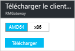

# Configuration d’une connexion point à site à un réseau virtuel à l’aide du portail Azure
> [!div class="op_single_selector"]
> * [Resource Manager - Portail Azure](vpn-gateway-howto-point-to-site-resource-manager-portal.md)
> * [Resource Manager - PowerShell](vpn-gateway-howto-point-to-site-rm-ps.md)
> * [Classic - Portail Azure](vpn-gateway-howto-point-to-site-classic-azure-portal.md)
> 
> 

Une configuration point à site (P2S) vous permet de connecter de manière sécurisée un ordinateur client individuel à un réseau virtuel. Une connexion P2S est utile lorsque vous souhaitez vous connecter à votre réseau virtuel à partir d’un site distant, comme depuis votre domicile ou une conférence ou lorsque seulement quelques clients doivent se connecter à un réseau virtuel. 

Les connexions de ce type ne nécessitent pas de périphérique VPN ou d’adresse IP publique pour fonctionner. Le démarrage de la connexion à partir de l’ordinateur client permet d’établir une connexion VPN. Pour plus d’informations sur les connexions de point à site, consultez le [Forum Aux Questions sur les connexions point à site](#faq) à la fin de cet article.

Cet article vous guide dans le processus de création d’un réseau virtuel avec une connexion point à site à l’aide du portail Azure. Ces étapes s’appliquent au modèle de déploiement Resource Manager.

### Méthodes et modèles de déploiement pour les connexions P2S
[!INCLUDE [deployment models](../../includes/vpn-gateway-deployment-models-include.md)]

Le tableau suivant présente les deux modèles de déploiement et les méthodes de déploiement disponibles pour les configurations P2S. Quand un article avec les étapes de configuration est disponible, le lien vers cet article est ajouté à ce tableau.

[!INCLUDE [vpn-gateway-clasic-rm](../../includes/vpn-gateway-table-point-to-site-include.md)]

## Flux de travail de base

### Exemples de valeurs
* **Nom : VNet1**
* **Espace d’adressage : 192.168.0.0/16** Pour cet exemple, nous n’utilisons qu’un seul espace d’adressage. Vous pouvez avoir plusieurs espaces d’adressage pour votre réseau virtuel.
* **Nom du sous-réseau : FrontEnd**
* **Plage d’adresses de sous-réseau : 192.168.1.0/24**
* **Abonnement :** vérifiez que vous utilisez l’abonnement approprié si vous en possédez plusieurs.
* **Groupe de ressources : TestRG**
* **Emplacement : États-Unis de l’Est**
* **Sous-réseau de passerelle : 192.168.200.0/24**
* **Nom de passerelle de réseau virtuel : VNet1GW**
* **Type de passerelle : VPN**
* **Type de VPN : Route-based**
* **Adresse IP publique : VNet1GWpip**
* **Type de connexion : point à site**
* **Pool d’adresses des clients : 172.16.201.0/24** Les clients VPN qui se connectent au réseau virtuel à l’aide de cette connexion point à site reçoivent une adresse IP de ce pool d’adresses des clients.

## Avant tout chose
* Assurez-vous de disposer d’un abonnement Azure. Si vous ne disposez pas déjà d’un abonnement Azure, vous pouvez activer vos [avantages abonnés MSDN](https://azure.microsoft.com/pricing/member-offers/msdn-benefits-details) ou créer un [compte gratuit](https://azure.microsoft.com/pricing/free-trial).

## Partie 1 : création d’un réseau virtuel
Si vous créez cette configuration dans le cadre d’un exercice, vous pouvez vous reporter aux [exemples de valeurs](#example).

[!INCLUDE [vpn-gateway-basic-vnet-rm-portal](../../includes/vpn-gateway-basic-vnet-rm-portal-include.md)]

## Partie 2 : Spécifier l’espace d’adressage et les sous-réseaux
Vous pouvez ajouter des sous-réseaux et des espaces d’adressage supplémentaires pour votre réseau virtuel une fois qu’il a été créé.

[!INCLUDE [vpn-gateway-additional-address-space](../../includes/vpn-gateway-additional-address-space-include.md)]

## Partie 3 : Ajout d’un sous-réseau de passerelle

Avant de connecter votre réseau virtuel à une passerelle, vous devez créer le sous-réseau de passerelle pour le réseau virtuel auquel vous souhaitez vous connecter. Les adresses de passerelle utilisent les adresses spécifiées dans le sous-réseau de passerelle. Si possible, créez un sous-réseau de passerelle à l’aide d’un bloc CIDR de /28 ou /27 pour fournir suffisamment d’adresses IP pour satisfaire les exigences de configuration future supplémentaires.

Les captures d’écran de cette section fournissent un exemple de référence. Veillez à utiliser la plage d’adresses GatewaySubnet correspondant aux valeurs requises pour votre configuration.

###Pour créer un sous-réseau de passerelle

[!INCLUDE [vpn-gateway-add-gwsubnet-rm-portal](../../includes/vpn-gateway-add-gwsubnet-rm-portal-include.md)]

## Partie 4 : Spécifier un serveur DNS (facultatif)
[!INCLUDE [vpn-gateway-add-dns-rm-portal](../../includes/vpn-gateway-add-dns-rm-portal-include.md)]

## Partie 5 : Créer une passerelle de réseau virtuel
Les connexions point à site nécessitent les paramètres suivants :

* Type de passerelle : VPN
* Type de VPN : Route-based

### Pour créer une passerelle de réseau virtuel
[!INCLUDE [vpn-gateway-add-gw-rm-portal](../../includes/vpn-gateway-add-gw-rm-portal-include.md)]

## Partie 6 : Générer des certificats
Les certificats sont utilisés par Azure pour authentifier les clients VPN pour les VPN point à site. Vous exportez des données de certificat public (pas la clé privée) sous forme de fichier .cer codé Base64 X.509 à partir d’un certificat racine généré par une solution de certificat d’entreprise ou d’un certificat racine auto-signé. Vous importez ensuite les données de certificat public à partir du certificat racine dans Azure. Vous devez également générer un certificat client à partir du certificat racine pour les clients. Chaque client souhaitant se connecter au réseau virtuel à l’aide d’une connexion P2S doit avoir un certificat client, qui a été généré à partir du certificat racine, installé.

### Étape 1 : Obtenir le fichier .cer pour le certificat racine

Vous devez obtenir le fichier .cer pour le certificat racine. Vous pouvez utiliser un certificat racine d’une solution d’entreprise, ou [créer un certificat racine auto-signé avec makecert](vpn-gateway-certificates-point-to-site.md). Bien qu’il soit possible d’utiliser PowerShell pour créer des certificats auto-signés, le certificat généré à l’aide de PowerShell ne contient pas les champs nécessaires pour les connexions P2S.

1. Pour obtenir un fichier .cer à partir d’un certificat, ouvrez **certmgr.msc** et recherchez le certificat racine. Cliquez avec le bouton droit sur le certificat racine auto-signé, puis cliquez sur **toutes les tâches** et sur **exporter**. **L’Assistant Exportation de certificat** s’ouvre.
2. Dans l’Assistant, cliquez sur **Suivant**, sélectionnez **Non, ne pas exporter la clé privée**, puis cliquez sur **Suivant**.
3. Sur la page **Format de fichier d’exportation**, sélectionnez **Codé à base&64; X.509 (.cer).** Cliquez ensuite sur **Suivant**. 
4. Dans **Fichier à exporter**, cliquez sur **Parcourir** pour accéder à l’emplacement vers lequel vous souhaitez exporter le certificat. Pour la zone **Nom de fichier**, nommez le fichier de certificat. Cliquez ensuite sur **Suivant**.
5. Cliquez sur **Terminer** pour exporter le certificat.

### Étape 2 : Générer un certificat client
Vous pouvez générer un certificat unique pour chaque client qui se connecte au réseau virtuel, ou utiliser le même certificat pour plusieurs clients. Générer des certificats clients uniques vous offre la possibilité de révoquer un seul certificat si nécessaire. Dans le cas contraire, si tous les clients utilisent le même certificat client et que vous devez révoquer le certificat pour un client, vous devrez générer et installer de nouveaux certificats pour tous les clients qui utilisent ce certificat pour s’authentifier.

####Certificat d’entreprise
- Si vous utilisez une solution de certificat d’entreprise, générez un certificat client avec le format de valeur de nom commun 'name@yourdomain.com',, plutôt que le format « nom_domaine\nom_utilisateur ».
- Assurez-vous que le certificat de client que vous émettez repose sur le modèle de certificat 'Utilisateur' ayant « Authentification client » comme premier élément dans d’usages, plutôt que connexion par carte à puce ou autre. Vous pouvez vérifier le certificat en double-cliquant sur le certificat client et en affichant **Détails > Utilisation avancée de la clé**.

####Certificat auto-signé 
Si vous utilisez un certificat auto-signé, consultez [Utilisation des certificats racine auto-signés pour les configurations point à site](vpn-gateway-certificates-point-to-site.md) pour générer un certificat client.

### Étape 3 : Exporter le certificat client
Un certificat client est requis pour l’authentification. Après avoir généré le certificat client, exportez-le. Le certificat client que vous exportez sera installé plus tard sur chaque ordinateur client.

1. Pour exporter un certificat client, vous pouvez utiliser *certmgr.msc*. Cliquez avec le bouton droit sur le certificat client à exporter, cliquez sur **Toutes les tâches**, puis sur **Exporter**.
2. Exportez le certificat client avec la clé privée. Il s’agit d’un fichier *.pfx* . Prenez soin d’enregistrer ou de mémoriser le mot de passe (clé) que vous définissez pour ce certificat.

## Partie 7 : Ajouter le pool d’adresses des clients
1. Une fois la passerelle de réseau virtuel créée, accédez à la section **Paramètres** du panneau Passerelle de réseau virtuel. Dans la section **Paramètres**, cliquez sur **Configuration de point à site** pour ouvrir le panneau **Configuration**.
   
    
2. **Pool d’adresses** est le pool d’adresses IP duquel les clients qui se connectent recevront une adresse IP. Ajoutez le pool d’adresses, puis cliquez sur **Enregistrer**.
   
    

## Partie 8 : Charger le fichier .cer de certificat racine
Une fois la passerelle créée, vous pouvez charger le fichier .cer pour un certificat racine approuvé dans Azure. Vous pouvez charger des fichiers pour 20 certificats racine maximum. Vous ne chargez pas la clé privée pour le certificat racine dans Azure. Une fois le fichier .cer chargé, Azure l’utilise pour authentifier les clients qui se connectent au réseau virtuel.

1. Les certificats sont ajoutés dans le panneau **Configuration de point à site**, dans la section **Certificat racine**.  
2. Vérifiez que vous avez exporté le certificat racine en tant que fichier Base-64 codé X.509 (.cer). Vous devez l’exporter dans ce format pour pouvoir ouvrir le certificat avec un éditeur de texte.
3. Ouvrez le certificat avec un éditeur de texte, Bloc-notes par exemple. Copiez uniquement la section suivante sur une seule ligne continue :
   
    

    > [!NOTE]
    > Lors de la copie des données de certificat, assurez-vous que vous copiez le texte en une seule ligne continue sans retour chariot ou sauts de ligne. Vous devrez peut-être modifier l’affichage dans l’éditeur de texte en activant « Afficher les symboles/Afficher tous les caractères » pour afficher les retours chariot et sauts de ligne.                                                                                                                                                                            
    >
    >

4. Collez les données du certificat dans le champ **Données du certificat public**. Donnez un **Nom** au certificat, puis cliquez sur **Enregistrer**. Vous pouvez ajouter jusqu’à 20 certificats racine approuvés.
   
    

## Partie 9 : Télécharger et installer le package de configuration du client VPN
Un certificat client et un package de configuration du client VPN doivent être installés sur les clients se connectant à Azure via P2S. Des packages de configuration de client VPN sont disponibles pour les clients Windows. 

Le package client VPN contient des informations pour configurer le logiciel client VPN qui est intégré à Windows. La configuration est spécifique au VPN auquel vous souhaitez vous connecter. Le package n’installe aucun logiciel supplémentaire.

1. Dans la panneau **Configuration de point à site**, cliquez sur **Télécharger le client VPN** pour ouvrir le panneau **Télécharger le client VPN**.
   
    
2. Sélectionnez le package approprié pour votre client, puis cliquez sur **télécharger**. Pour les clients 64 bits, sélectionnez **AMD64**. Pour les clients 32 bits, sélectionnez **x86**.

    
3. Installez le package sur l’ordinateur client. Si une fenêtre contextuelle SmartScreen s’affiche, cliquez sur **Plus d’infos**, puis sur **Exécuter quand même** pour installer le package.
4. Sur l’ordinateur client, accédez à **Paramètres réseau**, puis cliquez sur **VPN**. La connexion apparaît dans la liste. Le nom du réseau virtuel auquel il se connectera s’affiche, sous une forme semblable à cet exemple : 
   
    

## Partie 10 : Installer le certificat client
Chaque ordinateur client doit avoir un certificat client pour s’authentifier. Lorsque vous installez le certificat client, vous avez besoin du mot de passe qui a été créé lorsque le certificat client a été exporté.

1. Copiez le fichier .pfx sur l’ordinateur client.
2. Double-cliquez sur le fichier .pfx pour l’installer. Ne modifiez pas l’emplacement d’installation.

## Partie 11 : Se connecter à Azure
1. Pour vous connecter à votre réseau virtuel, sur l’ordinateur client, accédez aux connexions VPN et recherchez celle que vous avez créée. Elle porte le même nom que votre réseau virtuel. Cliquez sur **Connecter**. Un message contextuel faisant référence à l’utilisation du certificat peut s’afficher. Le cas échéant, cliquez sur **Continuer** pour utiliser des privilèges élevés. 
2. Dans la page de statut **Connexion**, cliquez sur **Connecter** pour démarrer la connexion. Si un écran **Sélectionner un certificat** apparaît, vérifiez que le certificat client affiché est celui que vous souhaitez utiliser pour la connexion. Dans le cas contraire, utilisez la flèche déroulante pour sélectionner le certificat approprié, puis cliquez sur **OK**.
   
    

    
3. À présent, votre connexion doit être établie.
   
    
                                                                                                                                                                           

> [!NOTE]
> Si vous utilisez un certificat qui a été émis à l’aide d’une autorité de certification d’entreprise et que vous rencontrez des problèmes pour l’authentification, vérifiez l’ordre de l’authentification sur le certificat client. Vous pouvez vérifier l’ordre de la liste d’authentification en double-cliquant sur le certificat client et en accédant à **Détails > Utilisation avancée de la clé**. Vérifiez que la liste affiche « Authentification client » comme premier élément. Si ce n’est pas le cas, vous devez émettre un certificat client basé sur le modèle Utilisateur disposant de l’authentification client comme premier élément dans la liste. 
>
>

## Partie 12 : Vérifier votre connexion
1. Pour vérifier que votre connexion VPN est active, ouvrez une invite de commandes avec élévation de privilèges, puis exécutez *ipconfig/all*.
2. Affichez les résultats. Notez que l’adresse IP que vous avez reçue est l’une des adresses du pool d’adresses de client VPN point à site que vous avez spécifiées dans votre configuration. Les résultats doivent être semblables à ce qui suit :
   
        PPP adapter VNet1:
            Connection-specific DNS Suffix .:
            Description.....................: VNet1
            Physical Address................:
            DHCP Enabled....................: No
            Autoconfiguration Enabled.......: Yes
            IPv4 Address....................: 172.16.201.3(Preferred)
            Subnet Mask.....................: 255.255.255.255
            Default Gateway.................:
            NetBIOS over Tcpip..............: Enabled

## Pour ajouter ou supprimer des certificats racine approuvés
Vous pouvez supprimer un certificat racine approuvé à partir d'Azure. Lorsque vous supprimez un certificat approuvé, les certificats clients qui ont été générés à partir du certificat racine ne pourront plus se connecter à Azure via la connexion de point à site. Si vous souhaitez que des clients se connectent, ils doivent installer un nouveau certificat client généré à partir d’un certificat approuvé dans Azure.

Vous pouvez gérer la liste des certificats clients révoqués dans le panneau **Configuration de point à site**. Il s’agit du panneau que vous avez utilisé pour [télécharger un certificat racine approuvé](#uploadfile).

## Pour gérer la liste des certificats clients révoqués
Vous pouvez révoquer des certificats clients. La liste de révocation de certificat vous permet de refuser sélectivement la connexion point à site en fonction des certificats clients individuels. Si vous supprimez un fichier .cer de certificat racine d’Azure, vous révoquez l’accès pour tous les certificats clients générés/signés par le certificat racine révoqué. Il est possible de révoquer un certificat client en particulier et non le certificat racine. Ainsi, les autres certificats générés à partir du certificat racine seront toujours valables. 

La pratique courante consiste à utiliser le certificat racine pour gérer l'accès au niveaux de l'équipe ou de l'organisation, tout en utilisant des certificats clients révoqués pour le contrôle d'accès précis des utilisateurs individuels.

Vous pouvez gérer la liste des certificats clients révoqués dans le panneau **Configuration de point à site**. Il s’agit du panneau que vous avez utilisé pour [télécharger un certificat racine approuvé](#uploadfile). Ajoutez le nom du certificat et l’empreinte numérique, puis enregistrez.

## Forum Aux Questions sur les connexions point à site

[!INCLUDE [Point-to-Site FAQ](../../includes/vpn-gateway-point-to-site-faq-include.md)]

## Étapes suivantes
Une fois la connexion achevée, vous pouvez ajouter des machines virtuelles à vos réseaux virtuels. Pour plus d’informations, consultez [Machines virtuelles](https://docs.microsoft.com/azure/#pivot=services&panel=Compute).

