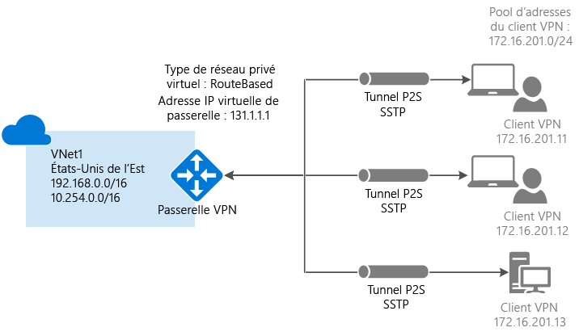

# <a name="configure-a-point-to-site-connection-to-a-vnet-using-powershell"></a>Configuration d’une connexion de point à site à un réseau virtuel à l’aide de PowerShell
> [!div class="op_single_selector"]
> * [Resource Manager - Portail Azure](vpn-gateway-howto-point-to-site-resource-manager-portal.md)
> * [Resource Manager - PowerShell](vpn-gateway-howto-point-to-site-rm-ps.md)
> * [Classic - Portail Azure](vpn-gateway-howto-point-to-site-classic-azure-portal.md)
> 
> 

Une configuration point à site (P2S) vous permet de connecter de manière sécurisée un ordinateur client individuel à un réseau virtuel. Le P2S est une connexion VPN sur SSTP (Secure Socket Tunneling Protocol). Les connexions point à site sont utiles lorsque vous souhaitez vous connecter à votre réseau virtuel à partir d’un site distant, comme depuis votre domicile ou une conférence ou lorsque seulement quelques clients doivent se connecter à un réseau virtuel. Les connexions de ce type ne nécessitent pas de périphérique VPN ou d’adresse IP publique. Vous établissez la connexion VPN depuis l’ordinateur client.

Cet article vous guide dans le processus de création d’un réseau virtuel avec une connexion point à site dans le modèle de déploiement Resource Manager à l’aide de PowerShell. Pour plus d’informations sur les connexions de point à site, consultez le [Forum Aux Questions sur les connexions point à site](#faq) à la fin de cet article.

### <a name="deployment-models-and-methods-for-p2s-connections"></a>Méthodes et modèles de déploiement pour les connexions P2S
[!INCLUDE [deployment models](../../includes/vpn-gateway-deployment-models-include.md)]

Le tableau suivant présente les deux modèles de déploiement et les méthodes de déploiement disponibles pour les configurations P2S. Quand un article avec les étapes de configuration est disponible, le lien vers cet article est ajouté à ce tableau.

[!INCLUDE [vpn-gateway-clasic-rm](../../includes/vpn-gateway-table-point-to-site-include.md)]

## <a name="basic-workflow"></a>Flux de travail de base


Dans ce scénario, vous créez un réseau virtuel avec une connexion de point à site. Les instructions vous aident également à générer les certificats qui sont nécessaires pour cette configuration. Une connexion P2S est composée des éléments suivants : un réseau virtuel avec une passerelle VPN, un fichier .cer de certificat racine (clé publique), un certificat client et la configuration VPN sur le client. 

Pour cette configuration, nous utilisons les valeurs suivantes. Nous avons défini les variables dans la section [1](#declare) de l’article. Vous pouvez suivre les étapes proposées en utilisant les valeurs sans les modifier ou modifier les valeurs pour les adapter à votre environnement. 

### <a name="example"></a>Exemples de valeurs
* **Nom : VNet1**
* **Espace d’adressage :192.168.0.0/16** et **10.254.0.0/16**<br>Pour cet exemple, nous utilisons différents espaces d’adressage afin de démontrer que cette configuration fonctionne avec plusieurs espaces d’adressage. Toutefois, plusieurs espaces d’adressage ne sont pas nécessaires pour cette configuration.
* **Nom du sous-réseau : FrontEnd**
  * **Plage d’adresses de sous-réseau : 192.168.1.0/24**
* **Nom du sous-réseau : BackEnd**
  * **Plage d’adresses de sous-réseau : 10.254.1.0/24**
* **Nom du sous-réseau : GatewaySubnet**<br>Le nom du sous-réseau *GatewaySubnet* est obligatoire pour que la passerelle VPN fonctionne.
  * **Plage d’adresses de GatewaySubnet : 192.168.200.0/24** 
* **Pool d’adresses des clients VPN : 172.16.201.0/24**<br>Les clients VPN qui se connectent au réseau virtuel à l’aide de cette connexion point à site reçoivent une adresse IP de ce pool d’adresses des clients VPN.
* **Abonnement :** vérifiez que vous utilisez l’abonnement approprié si vous en possédez plusieurs.
* **Groupe de ressources : TestRG**
* **Emplacement : États-Unis de l’Est**
* **Serveur DNS : l’adresse IP** du serveur DNS que vous souhaitez utiliser pour la résolution de noms.
* **Nom de passerelle : Vnet1GW**
* **Nom d’adresse IP publique : VNet1GWPIP**
* **Type de VPN : RouteBased**

## <a name="before-beginning"></a>Avant tout chose
* Assurez-vous de disposer d’un abonnement Azure. Si vous ne disposez pas déjà d’un abonnement Azure, vous pouvez activer vos [avantages abonnés MSDN](https://azure.microsoft.com/pricing/member-offers/msdn-benefits-details) ou créer un [compte gratuit](https://azure.microsoft.com/pricing/free-trial).
* Installez la dernière version des applets de commande PowerShell Azure Resource Manager. Pour plus d’informations sur l’installation des applets de commande PowerShell, consultez l’article [Installation et configuration d’Azure PowerShell](/powershell/azure/overview). 

## <a name="declare"></a>Partie 1 - Connexion et définition des variables
Dans cette section, vous vous connectez et déclarez les valeurs utilisées pour cette configuration. Les valeurs déclarées sont utilisées dans les exemples de script. Modifiez les valeurs pour les adapter à votre propre environnement. Vous pouvez également utiliser les valeurs déclarées et suivre les étapes pour vous entraîner.

1. Ouvrez la console PowerShell avec des privilèges élevés, puis connectez-vous à votre compte Azure. Cette applet de commande vous invite à entrer vos informations d’identification de connexion. Une fois que vous êtes connecté, l'applet de commande télécharge vos paramètres de compte pour qu'ils soient reconnus par Azure PowerShell.

  ```powershell
  Login-AzureRmAccount
  ```
2. Obtenez la liste de vos abonnements Azure.

  ```powershell  
  Get-AzureRmSubscription
  ```
3. Spécifiez l’abonnement que vous souhaitez utiliser.

  ```powershell
  Select-AzureRmSubscription -SubscriptionName "Name of subscription"
  ```
4. Déclarez les variables que vous souhaitez utiliser. Utilisez l’exemple ci-dessous en utilisant vos propres valeurs si nécessaire.

  ```powershell
  $VNetName  = "VNet1"
  $FESubName = "FrontEnd"
  $BESubName = "Backend"
  $GWSubName = "GatewaySubnet"
  $VNetPrefix1 = "192.168.0.0/16"
  $VNetPrefix2 = "10.254.0.0/16"
  $FESubPrefix = "192.168.1.0/24"
  $BESubPrefix = "10.254.1.0/24"
  $GWSubPrefix = "192.168.200.0/26"
  $VPNClientAddressPool = "172.16.201.0/24"
  $RG = "TestRG"
  $Location = "East US"
  $DNS = "8.8.8.8"
  $GWName = "VNet1GW"
  $GWIPName = "VNet1GWPIP"
  $GWIPconfName = "gwipconf"
  ```

## <a name="ConfigureVNet"></a>Partie 2 - Configuration d’un réseau virtuel
1. Créez un groupe de ressources.

  ```powershell
  New-AzureRmResourceGroup -Name $RG -Location $Location
  ```
2. Créez les configurations de sous-réseau du réseau virtuel en les nommant *FrontEnd*, *BackEnd* et *GatewaySubnet*. Ces préfixes doivent faire partie de l’espace d’adressage du réseau virtuel que vous avez déclaré.

  ```powershell
  $fesub = New-AzureRmVirtualNetworkSubnetConfig -Name $FESubName -AddressPrefix $FESubPrefix
  $besub = New-AzureRmVirtualNetworkSubnetConfig -Name $BESubName -AddressPrefix $BESubPrefix
  $gwsub = New-AzureRmVirtualNetworkSubnetConfig -Name $GWSubName -AddressPrefix $GWSubPrefix
  ```
3. Création du réseau virtuel. Le serveur DNS spécifié doit pouvoir résoudre les noms des ressources auxquelles vous vous connectez. Pour cet exemple, nous avons utilisé une adresse IP publique. Veillez à utiliser vos propres valeurs.

  ```powershell
  New-AzureRmVirtualNetwork -Name $VNetName -ResourceGroupName $RG -Location $Location -AddressPrefix $VNetPrefix1,$VNetPrefix2 -Subnet $fesub, $besub, $gwsub -DnsServer $DNS
  ```
4. Spécifiez les variables pour le réseau virtuel que vous avez créé.

  ```powershell
  $vnet = Get-AzureRmVirtualNetwork -Name $VNetName -ResourceGroupName $RG
  $subnet = Get-AzureRmVirtualNetworkSubnetConfig -Name "GatewaySubnet" -VirtualNetwork $vnet
  ```
5. Demandez une adresse IP publique attribuée dynamiquement. Cette adresse IP est nécessaire au bon fonctionnement de la passerelle. Vous connecterez ultérieurement la passerelle à la configuration IP de passerelle.

  ```powershell
  $pip = New-AzureRmPublicIpAddress -Name $GWIPName -ResourceGroupName $RG -Location $Location -AllocationMethod Dynamic
  $ipconf = New-AzureRmVirtualNetworkGatewayIpConfig -Name $GWIPconfName -Subnet $subnet -PublicIpAddress $pip
  ```


## <a name="Certificates"></a>Partie 3 - Certificats

Les certificats sont utilisés par Azure pour authentifier les clients VPN pour les VPN point à site. Après avoir créé le certificat racine, vous exportez les données de certificat public (et non la clé privée) en tant que fichier .cer X.509 encodé en base 64. Vous chargez ensuite les données de certificat public à partir du certificat racine dans Azure.

Chaque ordinateur client qui se connecte à un réseau virtuel à l’aide d’une connexion point à site doit avoir un certificat client installé. Le certificat client est généré à partir du certificat racine et installé sur chaque ordinateur client. Si aucun certificat client valide n’est installé et que le client essaie de se connecter au réseau virtuel, l’authentification échoue.

### <a name="cer"></a>Étape 1 : Obtenir le fichier .cer pour le certificat racine

#### <a name="enterprise-certificate"></a>Certificat d’entreprise
 
Si vous utilisez une solution d’entreprise, vous pouvez utiliser votre chaîne de certificats existante. Obtenez le fichier .cer pour le certificat racine que vous souhaitez utiliser.

#### <a name="self-signed-root-certificate"></a>Certificat racine auto-signé

Si vous n’utilisez pas de solution de certificat d’entreprise, vous devez générer un certificat racine auto-signé. Pour créer un certificat racine auto-signé qui contient les champs nécessaires pour l’authentification P2S, vous pouvez utiliser PowerShell. La page [Create a self-signed root certificate for Point-to-Site connections using PowerShell](vpn-gateway-certificates-point-to-site.md) (Créer un certificat auto-signé pour les connexions de point à site à l’aide de PowerShell) vous guide à travers les étapes permettant de créer un certificat racine auto-signé.

> [!NOTE]
> La méthode makecert était auparavant recommandée pour créer les certificats racine auto-signés et générer des certificats clients pour les connexions point à site. Vous pouvez désormais utiliser PowerShell pour créer ces certificats. L’un des avantages de l’utilisation de PowerShell est la possibilité de créer des certificats SHA-2. Pour connaître les valeurs requises, consultez la page [Create a self-signed root certificate for Point-to-Site connections using PowerShell](vpn-gateway-certificates-point-to-site.md) (Créer un certificat auto-signé pour les connexions de point à site à l’aide de PowerShell).
>
>

#### <a name="to-export-the-public-key-for-a-self-signed-root-certificate"></a>Pour exporter la clé publique d’un certificat racine auto-signé

Les connexions point à site requièrent le chargement de la clé publique (.cer) dans Azure. Les étapes suivantes vous aideront à exporter le fichier .cer pour votre certificat racine auto-signé.

1. Pour obtenir un fichier .cer du certificat, ouvrez **Gérer les certificats utilisateur**.
2. Localisez le certificat racine auto-signé « P2SRootCert » dans « Certificats - Utilisateur actuel\Personnel\Certificats », puis cliquez avec le bouton droit. Cliquez sur **Toutes les tâches**, puis cliquez sur **Exporter** pour ouvrir **l’Assistant Exportation du certificat**.
3. Dans l’assistant, cliquez sur **Suivant**. Sélectionnez **Non, ne pas exporter la clé privée**, puis cliquez sur **Suivant**.
4. Sur la page **Format du fichier d’exportation**, sélectionnez **X.509 encodé en base 64 (*.cer)**, puis cliquez sur **Suivant**. 
5. Sur la page **Fichier à exporter**, accédez à « C: », créez un sous-répertoire appelé « cert », puis sélectionnez-le. Attribuez au fichier de certificat le nom « P2SRootCert.cer », puis cliquez sur **Enregistrer**. 
6. Cliquez sur **Suivant**, puis sur **Terminer** pour exporter le certificat. Le message **L’exportation a réussi** s’affiche. Cliquez sur **OK** pour fermer l’assistant.

### <a name="generate"></a>Étape 2 : Générer un certificat client
Vous pouvez soit générer un certificat unique pour chaque client, soir utiliser le même certificat sur plusieurs clients. Le fait de générer des certificats clients uniques vous offre la possibilité de révoquer un seul certificat. Dans le cas contraire, si tous les clients utilisent le même certificat client et que vous devez révoquer ce dernier, vous devrez générer et installer de nouveaux certificats pour tous les clients qui utilisent ce certificat pour s’authentifier.

#### <a name="enterprise-certificate"></a>Certificat d’entreprise
- Si vous utilisez une solution de certificat d’entreprise, générez un certificat client avec le format de valeur de nom commun « name@yourdomain.com », plutôt que le format « nom_domaine\nom_utilisateur ».
- Assurez-vous que le certificat client repose sur le modèle de certificat « Utilisateur » qui indique « Authentification client » comme premier élément dans la liste d’usages, plutôt que la mention « Ouverture de session par carte à puce » ou autre. Vous pouvez vérifier le certificat en double-cliquant sur le certificat client et en affichant **Détails > Utilisation avancée de la clé**.

#### <a name="self-signed-root-certificate"></a>Certificat racine auto-signé 
Si vous utilisez un certificat racine auto-signé, consultez la section [Generate a client certificate using PowerShell](vpn-gateway-certificates-point-to-site.md#clientcert) (Générer un certificat client à l’aide de PowerShell) pour savoir comment générer un certificat client compatible avec les connexions point à site.


### <a name="exportclientcert"></a>Étape 3 : Exporter le certificat client

Si vous générez un certificat client à partir d’un certificat racine auto-signé à l’aide des instructions [PowerShell](vpn-gateway-certificates-point-to-site.md#clientcert), il est automatiquement installé sur l’ordinateur que vous avez utilisé pour le générer. Si vous souhaitez installer un certificat client sur un autre ordinateur client, vous devez l’exporter.
 
1. Pour exporter un certificat client, ouvrez **Gérer les certificats utilisateur**. Cliquez avec le bouton droit sur le certificat client à exporter, cliquez sur **Toutes les tâches**, puis cliquez sur **Exporter** pour ouvrir **l’Assistant Exportation du certificat**.
2. Dans l’Assistant, cliquez sur **Suivant**, sélectionnez **Oui, exporter la clé privée**, puis cliquez sur **Suivant**.
3. Dans la page **Format de fichier d’exportation**, laissez les valeurs par défaut sélectionnées. Assurez-vous que l’option **Inclure tous les certificats dans le chemin d’accès de certification, si possible** est sélectionnée pour exporter également les informations de certificat racine requises. Cliquez ensuite sur **Suivant**.
4. Dans la page **Sécurité** , vous devez protéger la clé privée. Si vous choisissez d’utiliser un mot de passe, veillez à enregistrer ou à mémoriser celui que vous définissez pour ce certificat. Cliquez ensuite sur **Suivant**.
5. Dans **Fichier à exporter**, cliquez sur **Parcourir** pour accéder à l’emplacement vers lequel vous souhaitez exporter le certificat. Pour la zone **Nom de fichier**, nommez le fichier de certificat. Cliquez ensuite sur **Suivant**.
6. Cliquez sur **Terminer** pour exporter le certificat.

### <a name="upload"></a>Étape 4 : Charger le fichier .cer du certificat racine

Une fois la passerelle créée, vous pouvez charger le fichier .cer pour un certificat racine approuvé dans Azure. Vous pouvez charger des fichiers pour 20 certificats racine maximum. Vous ne chargez pas la clé privée pour le certificat racine dans Azure. Une fois le fichier .cer chargé, Azure l’utilise pour authentifier les clients qui se connectent au réseau virtuel.

1. Déclarez la variable pour le nom de votre certificat, en remplaçant la valeur par la vôtre :

  ```powershell
  $P2SRootCertName = "Mycertificatename.cer"
  ```
2. Remplacez le chemin d’accès de fichier par le vôtre et exécutez les applets de commande.

  ```powershell
  $filePathForCert = "C:\cert\Mycertificatename.cer"
  $cert = new-object System.Security.Cryptography.X509Certificates.X509Certificate2($filePathForCert)
  $CertBase64 = [system.convert]::ToBase64String($cert.RawData)
  $p2srootcert = New-AzureRmVpnClientRootCertificate -Name $P2SRootCertName -PublicCertData $CertBase64
  ```


## <a name="creategateway"></a>Partie 4 - Création de la passerelle VPN
Configurez et créez la passerelle de réseau virtuel pour votre réseau virtuel. Le paramètre *-GatewayType* doit être défini sur la valeur **Vpn**, tandis que le paramètre *-VpnType* doit être défini sur la valeur **RouteBased**. La création d’une passerelle VPN peut prendre jusqu’à 45 minutes.

```powershell
New-AzureRmVirtualNetworkGateway -Name $GWName -ResourceGroupName $RG `
-Location $Location -IpConfigurations $ipconf -GatewayType Vpn `
-VpnType RouteBased -EnableBgp $false -GatewaySku Standard `
-VpnClientAddressPool $VPNClientAddressPool -VpnClientRootCertificates $p2srootcert
```


## <a name="clientconfig"></a>Partie 5 - Téléchargement du package de configuration du client VPN
Pour se connecter à un réseau virtuel à l’aide d’un VPN point à site, chaque client doit installer un package de configuration du client VPN. Le package n’installe aucun client VPN. Il configure le client VPN Windows natif avec les paramètres nécessaires pour se connecter au réseau virtuel. Pour obtenir la liste des systèmes d’exploitation clients pris en charge, consultez la section [Forum Aux Questions sur les connexions point à site](#faq) à la fin de cet article.

1. Une fois la passerelle créée, vous pouvez générer et télécharger le package de configuration du client. Cet exemple télécharge le package pour les clients 64 bits. Si vous souhaitez télécharger le client 32 bits, remplacez « Amd64 » par « x86 ». Vous pouvez également télécharger le client VPN à l’aide du portail Azure.

  ```powershell
  Get-AzureRmVpnClientPackage -ResourceGroupName $RG `
  -VirtualNetworkGatewayName $GWName -ProcessorArchitecture Amd64
  ```
2. Effectuez un copier-coller du lien renvoyé dans un navigateur web pour télécharger le package, en veillant à supprimer les guillemets qui entourent le lien. 
3. Téléchargez et installez le package sur l’ordinateur client. Si une fenêtre contextuelle SmartScreen s’affiche, cliquez sur **Plus d’infos**, puis sur **Exécuter quand même**. Vous pouvez également enregistrer le package pour l’installer sur d’autres ordinateurs clients.
4. Sur l’ordinateur client, accédez à **Paramètres réseau**, puis cliquez sur **VPN**. La connexion VPN indique le nom du réseau virtuel auquel elle se connecte.


## <a name="clientcertificate"></a>Partie 6 - Installation d’un certificat client exporté

Si vous souhaitez créer une connexion P2S à partir d’un ordinateur client différent de celui que vous avez utilisé pour générer les certificats clients, vous devez installer un certificat client. Quand vous installez un certificat client, vous avez besoin du mot de passe créé lors de l’exportation du certificat client.

1. Recherchez le fichier *.pfx* et copiez-le sur l’ordinateur client. Sur l’ordinateur client, double-cliquez sur le fichier *.pfx* à installer. Laissez la zone **Emplacement de stockage** définie sur **Utilisateur actuel**, puis cliquez sur **Suivant**.
2. N’apportez aucune modification à la page **Fichier à importer** . Cliquez sur **Suivant**.
3. Sur la page **Protection de clé privée**, entrez le mot de passe du certificat, ou vérifiez que le principal de sécurité est correct, puis cliquez sur **Suivant**.
4. Dans la page **Magasin de certificats**, laissez l’emplacement par défaut, puis cliquez sur **Suivant**.
5. Cliquez sur **Terminer**. Dans la page **Avertissement de sécurité** relative à l’installation du certificat, cliquez sur **Oui**. Vous pouvez cliquer sur « Oui » sans hésitation, car vous avez généré le certificat. Le certificat est désormais importé.

## <a name="connect"></a>Partie 7 - Connexion à Azure
1. Pour vous connecter à votre réseau virtuel, sur l’ordinateur client, accédez aux connexions VPN et recherchez celle que vous avez créée. Elle porte le même nom que votre réseau virtuel. Cliquez sur **Connecter**. Un message contextuel faisant référence à l’utilisation du certificat peut s’afficher. Cliquez sur **Continuer** pour utiliser des privilèges élevés. 
2. Dans la page de statut **Connexion**, cliquez sur **Connecter** pour démarrer la connexion. Si un écran **Sélectionner un certificat** apparaît, vérifiez que le certificat client affiché est celui que vous souhaitez utiliser pour la connexion. Dans le cas contraire, utilisez la flèche déroulante pour sélectionner le certificat approprié, puis cliquez sur **OK**.
   
    
3. Votre connexion est établie.
   
    

Si vous avez des problèmes pour vous connecter, effectuez les vérifications suivantes :

- Ouvrez **Gérer les certificats utilisateur**, puis accédez à **Autorités de certification racines de confiance\Certificats**. Vérifiez que le certificat racine est répertorié. Le certificat racine doit être présent pour que l’authentification puisse fonctionner. Lorsque vous exportez un fichier .pfx de certificat client à l’aide de la valeur par défaut « Inclure tous les certificats dans le chemin d’accès de certification, si possible », les informations de certificat racine sont également exportées. Lorsque vous installez le certificat client, le certificat racine est alors également installé sur l’ordinateur client. 

- Si vous utilisez un certificat qui a été émis à l’aide d’une autorité de certification d’entreprise et que vous rencontrez des problèmes pour l’authentification, vérifiez l’ordre de l’authentification sur le certificat client. Vous pouvez vérifier l’ordre de la liste d’authentification en double-cliquant sur le certificat client et en accédant à **Détails > Utilisation avancée de la clé**. Vérifiez que la liste affiche « Authentification client » comme premier élément. Si ce n’est pas le cas, vous devez émettre un certificat client basé sur le modèle Utilisateur disposant de l’authentification client comme premier élément dans la liste.  


## <a name="verify"></a>Partie 8 - Vérification de votre connexion
1. Pour vérifier que votre connexion VPN est active, ouvrez une invite de commandes avec élévation de privilèges, puis exécutez *ipconfig/all*.
2. Affichez les résultats. Notez que l’adresse IP que vous avez reçue est l’une des adresses du pool d’adresses de client VPN point à site que vous avez spécifiées dans votre configuration. Les résultats ressemblent à l’exemple qui suit :
   
        PPP adapter VNet1:
            Connection-specific DNS Suffix .:
            Description.....................: VNet1
            Physical Address................:
            DHCP Enabled....................: No
            Autoconfiguration Enabled.......: Yes
            IPv4 Address....................: 172.16.201.3(Preferred)
            Subnet Mask.....................: 255.255.255.255
            Default Gateway.................:
            NetBIOS over Tcpip..............: Enabled


## <a name="connectVM"></a>Connexion à une machine virtuelle

1. Après vous être connecté à votre réseau virtuel, vous pouvez vous connecter à une machine virtuelle par le biais de votre connexion P2S. Pour vous connecter à la machine virtuelle, vous devez disposer de l’adresse IP privée de cette machine. L’exemple ci-après vous permet d’obtenir l’adresse IP privée avec [Get-AzureRmNetworkInterface](/powershell/module/azurerm.network/get-azurermnetworkinterface). Les résultats renvoient la liste des machines virtuelles et des adresses IP privées correspondantes dans tous vos groupes de ressources. 

  ```powershell   
  $vms = get-azurermvm
  $nics = get-azurermnetworkinterface | where VirtualMachine -NE $null #skip Nics with no VM
  
  foreach($nic in $nics)
  {
    $vm = $vms | where-object -Property Id -EQ $nic.VirtualMachine.id
    $prv =  $nic.IpConfigurations | select-object -ExpandProperty PrivateIpAddress
    $alloc =  $nic.IpConfigurations | select-object -ExpandProperty PrivateIpAllocationMethod
    Write-Output "$($vm.Name) : $prv , $alloc"
  }
  ```
2. Utilisez la commande suivante pour créer une session Bureau à distance avec la machine virtuelle. Remplacez l’adresse IP par l’adresse IP privée associée à la machine virtuelle à laquelle vous souhaitez vous connecter. À l'invite, saisissez les informations d’identification que vous avez utilisées lors de la création de la machine virtuelle. 

  ```powershell   
  mstsc /v:192.168.1.4
  ```

Si vous avez des difficultés à vous connecter à une machine virtuelle sur P2S, utilisez « ipconfig » pour vérifier l’adresse IPv4 attribuée à l’adaptateur Ethernet sur l’ordinateur à partir duquel vous vous connectez. Si l’adresse IP est comprise dans la plage d’adresses du réseau virtuel auquel vous vous connectez, ou dans la plage d’adresses de votre VPNClientAddressPool, cette situation est désignée sous le terme d’espaces d’adressage qui se chevauchent. Lorsque vos espaces d’adressage se chevauchent de cette façon, le trafic réseau n’atteint pas Azure et reste sur le réseau local. Si vos espaces d’adressage réseau ne se chevauchent pas et que vous ne parvenez toujours pas à vous connecter à votre machine virtuelle, consultez l’article [Résolution des problèmes de connexion Bureau à distance avec une machine virtuelle Azure](../virtual-machines/windows/troubleshoot-rdp-connection.md).

## <a name="addremovecert"></a>Ajouter ou supprimer un certificat racine approuvé

Vous pouvez ajouter et supprimer des certificats racines approuvés à partir d'Azure. Lorsque vous supprimez un certificat approuvé, les certificats clients qui ont été générés à partir du certificat racine ne peuvent pas se connecter à Azure par la biais de la connexion point à site. Si vous souhaitez que des clients se connectent, vous devez installer un nouveau certificat client généré à partir d’un certificat approuvé dans Azure.

### <a name="to-add-a-trusted-root-certificate"></a>Ajout d’un certificat racine approuvé
Vous pouvez ajouter jusqu’à 20 fichiers .cer de certificat racine approuvés dans Azure. La procédure ci-après vous permet d’ajouter un certificat racine :

1. Créez et préparez le nouveau certificat racine à ajouter à Azure. Exportez la clé publique en tant que fichier X.509 codé en Base64 (.CER) et ouvrez-la dans un éditeur de texte. Copiez les valeurs, comme illustré dans l’exemple suivant :
   
  

    > [!NOTE]
    > Lors de la copie des données de certificat, assurez-vous que vous copiez le texte en une seule ligne continue sans retour chariot ou sauts de ligne. Vous devrez peut-être modifier l’affichage dans l’éditeur de texte en activant « Afficher les symboles/Afficher tous les caractères » pour afficher les retours chariot et sauts de ligne.
  >
  >

2. Indiquez le nom du certificat et les informations clés en tant que variable. Remplacez les informations par les vôtres, comme illustré dans l’exemple suivant :

  ```powershell
  $P2SRootCertName2 = "ARMP2SRootCert2.cer"
  $MyP2SCertPubKeyBase64_2 = "MIIC/zCCAeugAwIBAgIQKazxzFjMkp9JRiX+tkTfSzAJBgUrDgMCHQUAMBgxFjAUBgNVBAMTDU15UDJTUm9vdENlcnQwHhcNMTUxMjE5MDI1MTIxWhcNMzkxMjMxMjM1OTU5WjAYMRYwFAYDVQQDEw1NeVAyU1Jvb3RDZXJ0MIIBIjANBgkqhkiG9w0BAQEFAAOCAQ8AMIIBCgKCAQEAyjIXoWy8xE/GF1OSIvUaA0bxBjZ1PJfcXkMWsHPzvhWc2esOKrVQtgFgDz4ggAnOUFEkFaszjiHdnXv3mjzE2SpmAVIZPf2/yPWqkoHwkmrp6BpOvNVOpKxaGPOuK8+dql1xcL0eCkt69g4lxy0FGRFkBcSIgVTViS9wjuuS7LPo5+OXgyFkAY3pSDiMzQCkRGNFgw5WGMHRDAiruDQF1ciLNojAQCsDdLnI3pDYsvRW73HZEhmOqRRnJQe6VekvBYKLvnKaxUTKhFIYwuymHBB96nMFdRUKCZIiWRIy8Hc8+sQEsAML2EItAjQv4+fqgYiFdSWqnQCPf/7IZbotgQIDAQABo00wSzBJBgNVHQEEQjBAgBAkuVrWvFsCJAdK5pb/eoCNoRowGDEWMBQGA1UEAxMNTXlQMlNSb290Q2VydIIQKazxzFjMkp9JRiX+tkTfSzAJBgUrDgMCHQUAA4IBAQA223veAZEIar9N12ubNH2+HwZASNzDVNqspkPKD97TXfKHlPlIcS43TaYkTz38eVrwI6E0yDk4jAuPaKnPuPYFRj9w540SvY6PdOUwDoEqpIcAVp+b4VYwxPL6oyEQ8wnOYuoAK1hhh20lCbo8h9mMy9ofU+RP6HJ7lTqupLfXdID/XevI8tW6Dm+C/wCeV3EmIlO9KUoblD/e24zlo3YzOtbyXwTIh34T0fO/zQvUuBqZMcIPfM1cDvqcqiEFLWvWKoAnxbzckye2uk1gHO52d8AVL3mGiX8wBJkjc/pMdxrEvvCzJkltBmqxTM6XjDJALuVh16qFlqgTWCIcb7ju"
  ```
3. Ajoutez le nouveau certificat racine. Vous ne pouvez ajouter qu’un seul certificat à la fois.

  ```powershell
  Add-AzureRmVpnClientRootCertificate -VpnClientRootCertificateName $P2SRootCertName2 -VirtualNetworkGatewayname "VNet1GW" -ResourceGroupName "TestRG" -PublicCertData $MyP2SCertPubKeyBase64_2
  ```
4. Vous pouvez vérifier que le nouveau certificat a été correctement ajouté à l'aide de l'exemple suivant :

  ```powershell
  Get-AzureRmVpnClientRootCertificate -ResourceGroupName "TestRG" `
  -VirtualNetworkGatewayName "VNet1GW"
  ```


### <a name="to-remove-a-trusted-root-certificate"></a>Suppression d’un certificat racine approuvé


1. Déclarez les variables.

  ```powershell
  $GWName = "Name_of_virtual_network_gateway"
  $RG = "Name_of_resource_group"
  $P2SRootCertName2 = "ARMP2SRootCert2.cer"
  $MyP2SCertPubKeyBase64_2 = "MIIC/zCCAeugAwIBAgIQKazxzFjMkp9JRiX+tkTfSzAJBgUrDgMCHQUAMBgxFjAUBgNVBAMTDU15UDJTUm9vdENlcnQwHhcNMTUxMjE5MDI1MTIxWhcNMzkxMjMxMjM1OTU5WjAYMRYwFAYDVQQDEw1NeVAyU1Jvb3RDZXJ0MIIBIjANBgkqhkiG9w0BAQEFAAOCAQ8AMIIBCgKCAQEAyjIXoWy8xE/GF1OSIvUaA0bxBjZ1PJfcXkMWsHPzvhWc2esOKrVQtgFgDz4ggAnOUFEkFaszjiHdnXv3mjzE2SpmAVIZPf2/yPWqkoHwkmrp6BpOvNVOpKxaGPOuK8+dql1xcL0eCkt69g4lxy0FGRFkBcSIgVTViS9wjuuS7LPo5+OXgyFkAY3pSDiMzQCkRGNFgw5WGMHRDAiruDQF1ciLNojAQCsDdLnI3pDYsvRW73HZEhmOqRRnJQe6VekvBYKLvnKaxUTKhFIYwuymHBB96nMFdRUKCZIiWRIy8Hc8+sQEsAML2EItAjQv4+fqgYiFdSWqnQCPf/7IZbotgQIDAQABo00wSzBJBgNVHQEEQjBAgBAkuVrWvFsCJAdK5pb/eoCNoRowGDEWMBQGA1UEAxMNTXlQMlNSb290Q2VydIIQKazxzFjMkp9JRiX+tkTfSzAJBgUrDgMCHQUAA4IBAQA223veAZEIar9N12ubNH2+HwZASNzDVNqspkPKD97TXfKHlPlIcS43TaYkTz38eVrwI6E0yDk4jAuPaKnPuPYFRj9w540SvY6PdOUwDoEqpIcAVp+b4VYwxPL6oyEQ8wnOYuoAK1hhh20lCbo8h9mMy9ofU+RP6HJ7lTqupLfXdID/XevI8tW6Dm+C/wCeV3EmIlO9KUoblD/e24zlo3YzOtbyXwTIh34T0fO/zQvUuBqZMcIPfM1cDvqcqiEFLWvWKoAnxbzckye2uk1gHO52d8AVL3mGiX8wBJkjc/pMdxrEvvCzJkltBmqxTM6XjDJALuVh16qFlqgTWCIcb7ju"
  ```
2. Supprimez le certificat.

  ```powershell
  Remove-AzureRmVpnClientRootCertificate -VpnClientRootCertificateName $P2SRootCertName2 -VirtualNetworkGatewayName $GWName -ResourceGroupName $RG -PublicCertData $MyP2SCertPubKeyBase64_2
  ```
3. Utilisez l'exemple suivant pour vérifier que le certificat a été supprimé avec succès.

  ```powershell
  Get-AzureRmVpnClientRootCertificate -ResourceGroupName "TestRG" `
  -VirtualNetworkGatewayName "VNet1GW"
  ```

## <a name="revoke"></a>Révocation d'un certificat client
Vous pouvez révoquer des certificats clients. La liste de révocation de certificat vous permet de refuser sélectivement la connexion point à site en fonction des certificats clients individuels. Cela est différent de la suppression d’un certificat racine approuvé. Si vous supprimez un fichier .cer de certificat racine approuvé d’Azure, vous révoquez l’accès pour tous les certificats clients générés/signés par le certificat racine révoqué. Le fait de révoquer un certificat client plutôt que le certificat racine permet de continuer à utiliser les autres certificats générés à partir du certificat racine pour l’authentification.

La pratique courante consiste à utiliser le certificat racine pour gérer l'accès au niveaux de l'équipe ou de l'organisation, tout en utilisant des certificats clients révoqués pour le contrôle d'accès précis des utilisateurs individuels.

### <a name="to-revoke-a-client-certificate"></a>Pour révoquer un certificat client

1. Récupérez l’empreinte du certificat client. Pour plus d’informations, consultez l’article [Comment : récupérer l’empreinte numérique d’un certificat](https://msdn.microsoft.com/library/ms734695.aspx).
2. Copiez les informations dans un éditeur de texte et supprimez tous les espaces afin d’obtenir une chaîne continue. Cette dernière est déclarée sous la forme d’une variable à l’étape suivante.
3. Déclarez les variables. Veillez à déclarer l’empreinte numérique que vous avez récupérée à l’étape précédente.

  ```powershell
  $RevokedClientCert1 = "NameofCertificate"
  $RevokedThumbprint1 = "‎51ab1edd8da4cfed77e20061c5eb6d2ef2f778c7"
  $GWName = "Name_of_virtual_network_gateway"
  $RG = "Name_of_resource_group"
  ```
4. Ajoutez l’empreinte numérique à la liste des certificats révoqués. Une fois l’empreinte numérique ajoutée, le message « Réussi » s’affiche.

  ```powershell
  Add-AzureRmVpnClientRevokedCertificate -VpnClientRevokedCertificateName $RevokedClientCert1 `
  -VirtualNetworkGatewayName $GWName -ResourceGroupName $RG `
  -Thumbprint $RevokedThumbprint1
  ```
5. Vérifiez que l'empreinte numérique a été ajoutée à la liste de révocation de certificats.

  ```powershell
  Get-AzureRmVpnClientRevokedCertificate -VirtualNetworkGatewayName $GWName -ResourceGroupName $RG
  ```
6. Après avoir ajouté l’empreinte numérique, le certificat ne peut plus être utilisé pour se connecter. Les clients qui tentent de se connecter à l’aide de ce certificat reçoivent un message indiquant que le certificat n’est plus valide.

### <a name="to-reinstate-a-client-certificate"></a>Pour réactiver un certificat client
Vous pouvez réactiver un certificat client en supprimant l'empreinte numérique de la liste des certificats clients révoqués.

1. Déclarez les variables. Assurez-vous de déclarer la bonne empreinte numérique pour le certificat que vous souhaitez rétablir.

  ```powershell
  $RevokedClientCert1 = "NameofCertificate"
  $RevokedThumbprint1 = "‎51ab1edd8da4cfed77e20061c5eb6d2ef2f778c7"
  $GWName = "Name_of_virtual_network_gateway"
  $RG = "Name_of_resource_group"
  ```
2. Supprimez l’empreinte numérique du certificat de la liste de révocation de certificats.

  ```powershell
  Remove-AzureRmVpnClientRevokedCertificate -VpnClientRevokedCertificateName $RevokedClientCert1 `
  -VirtualNetworkGatewayName $GWName -ResourceGroupName $RG -Thumbprint $RevokedThumbprint1
  ```
3. Vérifiez si l'empreinte numérique est supprimée de la liste de révocation.

  ```powershell
  Get-AzureRmVpnClientRevokedCertificate -VirtualNetworkGatewayName $GWName -ResourceGroupName $RG
  ```

## <a name="faq"></a>Forum Aux Questions sur les connexions point à site

[!INCLUDE [Point-to-Site FAQ](../../includes/vpn-gateway-point-to-site-faq-include.md)]

## <a name="next-steps"></a>Étapes suivantes
Une fois la connexion achevée, vous pouvez ajouter des machines virtuelles à vos réseaux virtuels. Pour plus d’informations, consultez [Machines virtuelles](https://docs.microsoft.com/azure/#pivot=services&panel=Compute). Pour plus d’informations sur la mise en réseau et les machines virtuelles, consultez [Vue d’ensemble du réseau de machines virtuelles Azure et Linux](../virtual-machines/linux/azure-vm-network-overview.md).

