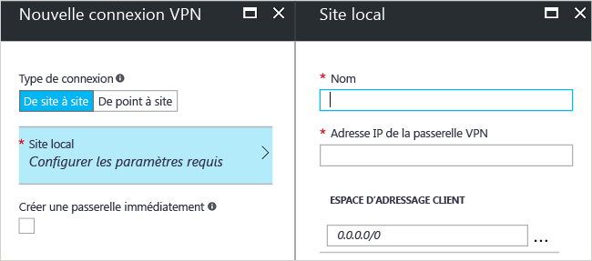

# <a name="create-a-site-to-site-connection-using-the-azure-portal-classic"></a>Création d’une connexion de site à site à l’aide du portail Azure (Classic)

[!INCLUDE [deployment models](../../includes/vpn-gateway-classic-deployment-model-include.md)]

Cet article vous explique comment utiliser le portail Azure pour créer une connexion de passerelle VPN de site à site à partir de votre réseau local vers le réseau virtuel. Les étapes mentionnées dans cet article s’appliquent au modèle de déploiement classique. Vous pouvez également créer cette configuration à l’aide d’un autre outil ou modèle de déploiement en sélectionnant une option différente dans la liste suivante :

> [!div class="op_single_selector"]
> * [Portail Azure](vpn-gateway-howto-site-to-site-resource-manager-portal.md)
> * [PowerShell](vpn-gateway-create-site-to-site-rm-powershell.md)
> * [INTERFACE DE LIGNE DE COMMANDE](vpn-gateway-howto-site-to-site-resource-manager-cli.md)
> * [Portail Azure (classique)](vpn-gateway-howto-site-to-site-classic-portal.md)
> 
>

Une connexion de passerelle VPN de site à site permet de connecter votre réseau local à un réseau virtuel Azure via un tunnel VPN IPsec/IKE (IKEv1 ou IKEv2). Ce type de connexion requiert un périphérique VPN local disposant d’une adresse IP publique exposée en externe. Pour plus d’informations sur les passerelles VPN, consultez l’article [À propos de la passerelle VPN](vpn-gateway-about-vpngateways.md).


## <a name="before-you-begin"></a>Avant de commencer

Vérifiez que vous disposez des éléments ci-dessous avant de commencer votre configuration :

* Assurez-vous de vouloir utiliser le modèle de déploiement classique. Si vous souhaitez utiliser le modèle de déploiement Resource Manager, voir [Create a Site-to-Site connection (Resource Manager) (Créer une connexion de site à site [Resource Manager])](vpn-gateway-howto-site-to-site-resource-manager-portal.md). Dans la mesure du possible, nous vous recommandons d’utiliser le modèle de déploiement Resource Manager.
* Veillez à disposer d’un périphérique VPN compatible et à être entouré d’une personne en mesure de le configurer. Pour plus d’informations sur les périphériques VPN compatibles et la configuration de votre périphérique, consultez l’article [À propos des périphériques VPN](vpn-gateway-about-vpn-devices.md).
* Vérifiez que vous disposez d’une adresse IPv4 publique exposée en externe pour votre périphérique VPN. Cette adresse IP ne peut pas se trouver derrière un NAT.
* Si vous ne maîtrisez pas les plages d’adresses IP situées dans votre configuration de réseau local, vous devez contacter une personne en mesure de vous aider. Lorsque vous créez cette configuration, vous devez spécifier les préfixes des plages d’adresses IP qu’Azure acheminera vers votre emplacement local. Aucun des sous-réseaux de votre réseau local ne peut chevaucher les sous-réseaux du réseau virtuel auquel vous souhaitez vous connecter.
* Actuellement, PowerShell est requis pour spécifier la clé partagée et créer la connexion de passerelle VPN. Installez la dernière version des applets de commande PowerShell Azure Service Management (SM). Pour plus d’informations, consultez la rubrique [Installation et configuration d’Azure PowerShell](/powershell/azure/overview). Si vous utilisez PowerShell pour cette configuration, vérifiez que vous exécutez PowerShell en tant qu’administrateur. 

### <a name="values"></a>Exemples de valeurs de configuration pour cet exercice

Nous utilisons les valeurs suivantes dans les exemples de cet article. Vous pouvez utiliser ces valeurs pour créer un environnement de test ou vous y référer pour mieux comprendre les exemples de cet article.

* **Nom du réseau virtuel :** TestVNet1
* **Espace d’adressage :** 
  * 10.11.0.0/16
  * 10.12.0.0/16 (facultatif pour cet exercice)
* **Sous-réseaux :**
  * FrontEnd : 10.11.0.0/24
  * BackEnd : 10.12.0.0/24 (facultatif pour cet exercice)
* **Sous-réseau de passerelle :** 10.11.255.0/27
* **Groupe de ressources :** TestRG1
* **Emplacement :** États-Unis de l’Est
* **Serveur DNS :** 8.8.8.8 (facultatif pour cet exercice)
* **Nom du site local :** Site2
* **Espace d’adressage du client :** il s’agit de l’espace d’adressage situé sur votre site local.

## <a name="CreatVNet"></a>1. Créez un réseau virtuel

Lorsque vous créez un réseau virtuel qui sera utilisé pour une connexion de site à site, vous devez vous assurer que les espaces d’adressage que vous spécifiez ne se chevauchent pas avec les espaces d’adressage du client pour les sites locaux auxquels vous souhaitez vous connecter. Si vos sous-réseaux se chevauchent, votre connexion ne fonctionnera pas correctement.

* Si vous disposez déjà d’un réseau virtuel, vérifiez que les paramètres sont compatibles avec la conception de votre passerelle VPN, avec une attention particulière pour tous les sous-réseaux qui pourraient chevaucher d’autres réseaux. 

* Si vous n’avez pas de réseau virtuel, créez-en un. Les captures d’écran sont fournies à titre d’exemple. Assurez-vous de remplacer ces valeurs par les vôtres.

### <a name="to-create-a-virtual-network"></a>Pour créer un réseau virtuel

1. Dans un navigateur, accédez au [portail Azure](http://portal.azure.com) et, si nécessaire, connectez-vous avec votre compte Azure.
2. Cliquez sur **+** Dans le champ **Rechercher dans le marketplace**, tapez « réseau virtuel ». Localisez **Réseau virtuel** dans la liste renvoyée et cliquez pour ouvrir le panneau **Réseau virtuel**.

  
3. En bas du panneau Réseau virtuel, à partir de la liste déroulante **Sélectionner un modèle de déploiement**, choisissez **Classique** puis cliquez sur **Créer**.

  
4. Dans le panneau **Créer un réseau virtuel (classique)**, configurez les paramètres du réseau virtuel. Dans ce panneau, vous ajoutez votre premier espace d’adressage et une plage d’adresses de sous-réseau unique. Après avoir créé le réseau virtuel, vous pouvez revenir en arrière et ajouter des espaces d’adressage et des sous-réseaux supplémentaires.

  
5. Vérifiez qu’il s’agit de l’ **abonnement** approprié. Vous pouvez modifier des abonnements à l’aide de la liste déroulante.
6. Cliquez sur **Groupe de ressources** et sélectionnez un groupe de ressources existant, ou créez un groupe de ressources en tapant un nom pour ce dernier. Pour plus d’informations sur les groupes de ressources, consultez [Présentation d’Azure Resource Manager](../azure-resource-manager/resource-group-overview.md#resource-groups).
7. Ensuite, sélectionnez les paramètres d’ **emplacement** pour votre réseau virtuel. L’emplacement détermine où se trouveront les ressources que vous déployez sur ce réseau virtuel.
8. Sélectionnez **Épingler au tableau de bord** si vous souhaitez être en mesure de trouver votre réseau virtuel facilement sur le tableau de bord, puis cliquez sur **Créer**.

  
9. Une fois que vous avez cliqué sur Créer, une vignette apparaît sur le tableau de bord pour indiquer la progression de votre réseau virtuel. La vignette change lorsque le réseau virtuel est créé.

  

Une fois votre réseau virtuel créé, la mention **Créé** apparaît sous **État** sur la page Réseaux du portail Azure Classic.

## <a name="additionaladdress"></a>2. Ajouter un espace d’adressage supplémentaire

Après avoir créé votre réseau virtuel, vous pouvez ajouter un espace d’adressage supplémentaire. L’ajout d’un espace d’adressage supplémentaire n’est pas obligatoire dans une configuration de site à site. Toutefois, si vous avez besoin de plusieurs espaces d’adressage, procédez comme suit :

1. Recherchez les réseaux virtuels dans le portail.
2. Dans le panneau de votre réseau virtuel, dans la section **Paramètres**, cliquez sur **Espace d’adressage**.
3. Dans le panneau Espace d’adressage, cliquez sur **+Ajouter** et indiquez un espace d’adressage supplémentaire.

## <a name="dns"></a>3. Spécifier un serveur DNS

Les paramètres DNS ne sont pas indispensables à une configuration de site à site. Toutefois, vous devrez les configurer pour bénéficier de la résolution de noms.

Après avoir créé votre réseau virtuel, vous pouvez ajouter l’adresse IP d’un serveur DNS pour gérer la résolution de noms. Ouvrez les paramètres de votre réseau virtuel, cliquez sur Serveurs DNS et ajoutez l’adresse IP du serveur DNS que vous souhaitez utiliser pour la résolution de noms. Ce paramètre n’entraîne pas la création de serveur DNS. Dans les paramètres de l’exemple, nous utilisons un serveur DNS public. Vous utiliserez généralement un serveur DNS privé. Veillez à ajouter un serveur DNS avec lequel vos ressources peuvent communiquer.

1. Recherchez les réseaux virtuels dans le portail.
2. Dans le panneau de votre réseau virtuel, dans la section **Paramètres**, cliquez sur **Serveurs DNS**.
3. Ajoutez un serveur DNS.
4. Pour enregistrer vos paramètres, cliquez sur **Enregistrer** en haut de la page.

## <a name="localsite"></a>4. Configurer le site local

Le site local fait généralement référence à votre emplacement local. Il contient l’adresse IP du périphérique VPN avec lequel vous allez créer une connexion et les plages d’adresses IP qui seront acheminées via la passerelle VPN vers le périphérique VPN.

1. Dans le portail, accédez au réseau virtuel pour lequel vous souhaitez créer une passerelle.
2. Dans le panneau de votre réseau virtuel, dans le panneau **Vue d’ensemble**, puis dans la section Connexions VPN, cliquez sur **Passerelle** pour ouvrir le panneau **Nouvelle connexion VPN**.

  
3. Dans le panneau **Nouvelle connexion VPN**, sélectionnez **De site à site**.
4. Cliquez sur **Site local- Configurer les paramètres requis** pour ouvrir le panneau **Site local**. Configurez les paramètres, puis cliquez sur **OK** pour les enregistrer.
  - **Nom :** créez un nom pour votre site local afin de l’identifier plus facilement.
  - **Adresse IP de la passerelle VPN :** il s’agit de l’adresse IP publique du périphérique VPN pour votre réseau local. Le périphérique VPN requiert une adresse IP IPv4 publique. Spécifiez une adresse IP publique valide pour le périphérique VPN auquel vous souhaitez vous connecter. Il ne peut pas se trouver derrière NAT et doit être accessible par Azure. Si vous ne connaissez pas l’adresse IP de votre périphérique VPN, vous pouvez toujours placer une valeur d’espace réservé (à condition qu’elle soit au format d’une adresse IP publique valide) et la modifier ultérieurement.
  - **Espace d’adressage du client :** spécifiez les plages d’adresses IP qui devront être acheminées vers le réseau local via cette passerelle. Vous pouvez ajouter plusieurs plages d’espaces d’adressage. Assurez-vous que les plages que vous spécifiez ici ne se chevauchent pas avec des plages d’adresses d’autres réseaux auxquels votre réseau virtuel se connecte, ou avec les propres plages d’adresses du réseau virtuel.

  

## <a name="gatewaysubnet"></a>5. Configurer le sous-réseau de passerelle

Vous devez créer un sous-réseau de passerelle pour votre passerelle VPN. Le sous-réseau de passerelle contient les adresses IP qui sont utilisées par les services de passerelle VPN.

1. Dans le panneau **Nouvelle connexion VPN**, cochez la case **Créer une passerelle immédiatement**. Le volet « Configuration de passerelle facultative » s’affiche. Si vous ne cochez pas cette case, le panneau de configuration du sous-réseau de passerelle ne s’affichera pas.

  
2. Cliquez sur **Configuration de passerelle facultative - Sous-réseau, taille et type de routage** pour ouvrir le panneau **Configuration de la passerelle**.
3. Dans le panneau **Configuration de la passerelle**, cliquez sur **Sous-réseau - Configurer les paramètres requis** pour ouvrir le panneau **Ajouter un sous-réseau**.

  
4. Dans le panneau **Ajouter un sous-réseau**, ajoutez le sous-réseau de passerelle. La taille du sous-réseau de passerelle que vous spécifiez dépend de la configuration de la passerelle VPN que vous souhaitez créer. Bien qu’il soit possible de créer un sous-réseau de passerelle aussi petit que /29, nous vous recommandons de créer un sous-réseau plus vaste qui inclut un plus grand nombre d’adresses en sélectionnant /27 ou /28. En choisissant un sous-réseau de passerelle plus vaste, vous disposez de suffisamment d’adresses IP pour prendre en charge d’éventuelles configurations futures.

  

## <a name="sku"></a>6. Spécifier la référence et le type de VPN

1. Sélectionnez la **taille** de la passerelle. Il s’agit de la référence de passerelle que vous utilisez pour créer votre passerelle de réseau virtuel. Dans le portail, la référence par défaut est **De base**. Les passerelles VPN classiques utilisent les anciennes références SKU de passerelles. Pour en savoir plus sur les anciennes références SKU de passerelle, consultez la section [Utilisation des références SKU de passerelle de réseau virtuel (anciennes références SKU)](vpn-gateway-about-skus-legacy.md).

  
2. Sélectionnez le **type de routage** pour votre passerelle. Cela correspond également au type de VPN. Il est important de sélectionner le type de passerelle approprié, car vous ne pourrez plus le modifier par la suite. Votre périphérique VPN doit être compatible avec le type de routage que vous sélectionnez. Pour plus d’informations sur le type de VPN, consultez la rubrique [À propos des paramètres de la passerelle VPN](vpn-gateway-about-vpn-gateway-settings.md#vpntype). Certains articles font référence aux types de VPN « RouteBased » et « PolicyBased ». « RouteBased » correspond à un routage dynamique, et « PolicyBased » à un routage statique.
3. Cliquez sur **OK** pour enregistrer les paramètres.
4. Dans le panneau **Nouvelle connexion VPN**, cliquez sur **OK** en bas du panneau pour commencer à créer votre passerelle de réseau virtuel. Cette opération peut prendre jusqu’à 45 minutes.

## <a name="vpndevice"></a>7. Configuration de votre périphérique VPN

Les connexions site à site vers un réseau local nécessitent un périphérique VPN. Dans cette étape, vous configurez votre périphérique VPN. Pour configurer votre périphérique VPN, vous avez besoin des éléments suivants :

- Une clé partagée. Il s’agit de la clé partagée spécifiée lors de la création de la connexion VPN de site à site. Dans nos exemples, nous utilisons une clé partagée basique. Nous vous conseillons de générer une clé plus complexe.
- L’adresse IP publique de votre passerelle de réseau virtuel. Vous pouvez afficher l’adresse IP publique à l’aide du portail Azure, de PowerShell ou de l’interface de ligne de commande.

[!INCLUDE [vpn-gateway-configure-vpn-device-rm](../../includes/vpn-gateway-configure-vpn-device-rm-include.md)]

## <a name="CreateConnection"></a>8. Créer la connexion
Désormais, vous allez définir la clé partagée et créer la connexion. La clé que vous définissez doit être la même que celle qui a été utilisée lors la configuration de votre périphérique VPN.

> [!NOTE]
> Pour le moment, cette étape n’est pas disponible dans le portail Azure. Vous devez utiliser la version Service Management (SM) des applets de commande Azure PowerShell.
>

### <a name="step-1-connect-to-your-azure-account"></a>Étape 1. Se connecter au compte Azure

1. Ouvrez la console PowerShell avec des droits élevés et connectez-vous à votre compte. Utilisez l’exemple suivant pour faciliter votre connexion :

  ```powershell
  Add-AzureAccount
  ```
2. Vérifiez les abonnements associés au compte.

  ```powershell
  Get-AzureSubscription
  ```
3. Si vous avez plusieurs abonnements, sélectionnez celui que vous souhaitez utiliser.

  ```powershell
  Select-AzureSubscription -SubscriptionId "Replace_with_your_subscription_ID"
  ```

### <a name="step-2-set-the-shared-key-and-create-the-connection"></a>Étape 2. Définir la clé partagée et créer la connexion

Lorsque vous utilisez PowerShell et le modèle de déploiement classique, il arrive que les noms de ressources dans le portail ne correspondent pas aux noms qu’Azure s’attend à voir lors de l’utilisation de PowerShell. Les étapes suivantes vous expliquent comment exporter le fichier de configuration réseau pour obtenir les noms appropriés.

1. Créez un répertoire sur votre ordinateur, puis exportez le fichier de configuration réseau dans ce répertoire. Dans cet exemple, le fichier de configuration réseau est exporté vers C:\AzureNet.

  ```powershell
  Get-AzureVNetConfig -ExportToFile C:\AzureNet\NetworkConfig.xml
  ```
2. Ouvrez le fichier de configuration réseau avec un éditeur xml et recherchez les valeurs « Nom LocalNetworkSite » et « Nom VirtualNetworkSite ». Modifiez l’exemple pour appliquer ces valeurs. Lorsque vous spécifiez un nom qui contient des espaces, encadrez la valeur avec des guillemets.

3. Définissez la clé partagée et créez la connexion. La valeur « -SharedKey » est une valeur que vous pouvez générer et spécifier. Dans l’exemple, nous avons utilisé « abc123 », mais vous pouvez (et devriez) générer et utiliser une valeur plus complexe. L’important, c’est que la valeur que vous spécifiez ici doit être identique à celle spécifiée lors de la configuration de votre périphérique VPN.

  ```powershell
  Set-AzureVNetGatewayKey -VNetName 'Group TestRG1 TestVNet1' `
  -LocalNetworkSiteName 'D1BFC9CB_Site2' -SharedKey abc123
  ```
Lorsque la connexion est créée, le message **État : réussi** s’affiche.

## <a name="verify"></a>9. Vérifier votre connexion

[!INCLUDE [vpn-gateway-verify-connection-azureportal-classic](../../includes/vpn-gateway-verify-connection-azureportal-classic-include.md)]

Si vous rencontrez des problèmes de connexion, consultez la section **Dépanner** dans la table des matières du volet gauche.

## <a name="how-to-reset-a-vpn-gateway"></a>Réinitialisation d’une passerelle VPN

La réinitialisation d’une passerelle VPN Azure est utile si vous perdez la connectivité VPN entre différents locaux sur un ou plusieurs tunnels VPN de site à site. Dans ce cas, vos périphériques VPN sur site fonctionnent tous correctement, mais ils ne sont pas en mesure d’établir des tunnels IPsec avec les passerelles VPN Azure. Pour obtenir la procédure, consultez [Réinitialiser une passerelle VPN](vpn-gateway-resetgw-classic.md).

## <a name="how-to-change-a-gateway-sku"></a>Modification d’une référence SKU de passerelle

Pour obtenir la procédure permettant de modifier une référence SKU de passerelle, consultez [Utilisation des références SKU de passerelle de réseau virtuel (anciennes références SKU)](vpn-gateway-about-SKUS-legacy.md).

## <a name="next-steps"></a>Étapes suivantes

* Une fois la connexion achevée, vous pouvez ajouter des machines virtuelles à vos réseaux virtuels. Pour plus d’informations, consultez [Machines virtuelles](https://docs.microsoft.com/azure/#pivot=services&panel=Compute).
* Pour plus d’informations sur le tunneling forcé, consultez [Configuration du tunneling forcé à l’aide du modèle de déploiement classique](vpn-gateway-about-forced-tunneling.md).
