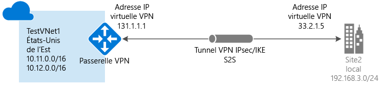

# Création d’une connexion de site à site dans le portail Azure

Cet article vous explique comment utiliser le portail Azure pour créer une connexion de passerelle VPN de site à site à partir de votre réseau local vers le réseau virtuel. Les étapes mentionnées dans cet article s’appliquent au modèle de déploiement Resource Manager. Vous pouvez également créer cette configuration à l’aide d’un autre outil ou modèle de déploiement en sélectionnant une option différente dans la liste suivante :

> [!div class="op_single_selector"]
> * [Resource Manager - Portail Azure](vpn-gateway-howto-site-to-site-resource-manager-portal.md)
> * [Resource Manager - PowerShell](vpn-gateway-create-site-to-site-rm-powershell.md)
> * [Resource Manager - CLI](vpn-gateway-howto-site-to-site-resource-manager-cli.md)
> * [Classic - Portail Azure](vpn-gateway-howto-site-to-site-classic-portal.md)
> * [Classic - Portail Classic](vpn-gateway-site-to-site-create.md)
> 
>

Une connexion de passerelle VPN de site à site permet de connecter votre réseau local à un réseau virtuel Azure via un tunnel VPN IPsec/IKE (IKEv1 ou IKEv2). Ce type de connexion requiert un périphérique VPN local disposant d’une adresse IP publique exposée en externe. Pour plus d’informations sur les passerelles VPN, consultez l’article [À propos de la passerelle VPN](vpn-gateway-about-vpngateways.md).

## Avant de commencer

Vérifiez que vous disposez des éléments ci-dessous avant de commencer votre configuration :

* Assurez-vous de vouloir utiliser le modèle de déploiement Resource Manager. [!INCLUDE [deployment models](../../includes/vpn-gateway-deployment-models-include.md)] 
* Un périphérique VPN compatible et une personne qui est en mesure de le configurer. Pour plus d’informations sur les périphériques VPN compatibles et la configuration de votre périphérique, consultez l’article [À propos des périphériques VPN](vpn-gateway-about-vpn-devices.md).
* Une adresse IP IPv4 publique exposée en externe pour votre périphérique VPN. Cette adresse IP ne peut pas se trouver derrière un NAT.
* Si vous ne maîtrisez pas les plages d’adresses IP situées dans votre configuration de réseau local, vous devez contacter une personne en mesure de vous aider. Lorsque vous créez cette configuration, vous devez spécifier les préfixes des plages d’adresses IP qu’Azure acheminera vers votre emplacement local. Aucun des sous-réseaux de votre réseau local ne peut chevaucher les sous-réseaux du réseau virtuel auquel vous souhaitez vous connecter. 

### Exemples de valeurs
Lorsque vous suivez ces étapes dans le cadre d’un exercice, vous pouvez vous servir des valeurs d’exemple suivantes :

* **Nom du réseau virtuel :** TestVNet1
* **Espace d’adressage :** 
    * 10.11.0.0/16
    * 10.12.0.0/16 (facultatif pour cet exercice)
* **Sous-réseaux :**
  * FrontEnd : 10.11.0.0/24
  * BackEnd : 10.12.0.0/24 (facultatif pour cet exercice)
  * Sous-réseau de passerelle : 10.11.255.0/27
* **Groupe de ressources :** TestRG1
* **Emplacement :** États-Unis de l’Est
* **Serveur DNS :** l’adresse IP de votre serveur DNS
* **Nom de passerelle de réseau virtuel :** VNet1GW
* **Adresse IP publique :** VNet1GWIP
* **Type de VPN :** Route-based
* **Type de connexion :** Site-to-site (IPsec)
* **Type de passerelle :** VPN
* **Nom de passerelle de réseau local :** Site2
* **Nom de connexion :** VNet1toSite2

## 1. Créez un réseau virtuel

[!INCLUDE [vpn-gateway-basic-vnet-rm-portal](../../includes/vpn-gateway-basic-vnet-s2s-rm-portal-include.md)]

## 2. Spécifier un serveur DNS
Aucun DNS n’est nécessaire pour une connexion de site à site. Toutefois, si vous souhaitez résoudre les noms des ressources qui sont déployées sur votre réseau virtuel, vous devez spécifier un serveur DNS. Ce paramètre vous permet de spécifier le serveur DNS que vous souhaitez utiliser pour la résolution de noms pour ce réseau virtuel. Il n'entraîne pas la création d'un serveur DNS.

[!INCLUDE [vpn-gateway-add-dns-rm-portal](../../includes/vpn-gateway-add-dns-rm-portal-include.md)]

## 3. Créer le sous-réseau de passerelle

La passerelle de réseau virtuel utilise un sous-réseau de passerelle qui contient les adresses IP utilisées par les services de passerelle VPN. Le sous-réseau de passerelle doit être nommé « GatewaySubnet ». Si vous le nommez autrement, la configuration de votre connexion échouera.

La taille du sous-réseau de passerelle que vous spécifiez dépend de la configuration de la passerelle VPN que vous souhaitez créer. Bien qu’il soit possible de créer un sous-réseau de passerelle aussi petit que /29, nous vous recommandons de créer un sous-réseau plus vaste qui inclut un plus grand nombre d’adresses en sélectionnant /27 ou /28. La taille du sous-réseau de passerelle que vous spécifiez dépend de la configuration de la passerelle VPN que vous souhaitez créer. Bien qu’il soit possible de créer un sous-réseau de passerelle aussi petit que /29, nous vous recommandons de créer un sous-réseau plus vaste qui inclut un plus grand nombre d’adresses en sélectionnant /27 ou /28. En choisissant un sous-réseau de passerelle plus vaste, vous disposez de suffisamment d’adresses IP pour prendre en charge d’éventuelles configurations futures.

[!INCLUDE [vpn-gateway-add-gwsubnet-rm-portal](../../includes/vpn-gateway-add-gwsubnet-s2s-rm-portal-include.md)]

## 4. Créer la passerelle VPN

[!INCLUDE [vpn-gateway-add-gw-s2s-rm-portal](../../includes/vpn-gateway-add-gw-s2s-rm-portal-include.md)]

## 5. Créer la passerelle de réseau local

La passerelle de réseau local fait généralement référence à votre emplacement local. Donnez au site un nom auquel Azure pourra se référer, puis spécifiez l’adresse IP du périphérique VPN local vers lequel vous allez créer une connexion. Spécifiez également les préfixes d’adresses IP qui seront acheminés via la passerelle VPN vers le périphérique VPN. Les préfixes d’adresses que vous spécifiez sont les préfixes situés sur votre réseau local. Vous pouvez facilement mettre à jour ces préfixes si votre réseau local change.

[!INCLUDE [vpn-gateway-add-lng-s2s-rm-portal](../../includes/vpn-gateway-add-lng-s2s-rm-portal-include.md)]

## 6. Configuration de votre périphérique VPN
[!INCLUDE [vpn-gateway-configure-vpn-device-rm](../../includes/vpn-gateway-configure-vpn-device-rm-include.md)]

Pour rechercher l’adresse IP publique de votre passerelle VPN à l’aide du portail Azure, accédez à **Passerelles de réseau virtuel**, puis cliquez sur le nom de votre passerelle.

## 7. Créer la connexion VPN

Créez la connexion VPN de site à site entre votre passerelle de réseau virtuel et votre périphérique VPN local.

[!INCLUDE [vpn-gateway-add-site-to-site-connection-rm-portal](../../includes/vpn-gateway-add-site-to-site-connection-s2s-rm-portal-include.md)]

## 8. Vérifier la connexion VPN

[!INCLUDE [Azure portal](../../includes/vpn-gateway-verify-connection-portal-rm-include.md)]

## Étapes suivantes
*  Une fois la connexion achevée, vous pouvez ajouter des machines virtuelles à vos réseaux virtuels. Pour plus d’informations, consultez [Machines virtuelles](https://docs.microsoft.com/azure/#pivot=services&panel=Compute).
*  Pour plus d’informations sur le protocole BGP, consultez les articles [Vue d’ensemble du protocole BGP](vpn-gateway-bgp-overview.md) et [Comment configurer BGP](vpn-gateway-bgp-resource-manager-ps.md).

