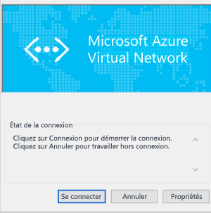

<properties
   pageTitle="Configuration d’une connexion par passerelle VPN point à site à un réseau virtuel à l’aide du portail Classic | Microsoft Azure"
   description="Connectez-vous de façon sécurisée à votre réseau virtuel Azure en créant une connexion par passerelle VPN point à site."
   services="vpn-gateway"
   documentationCenter="na"
   authors="cherylmc"
   manager="carmonm"
   editor=""
   tags="azure-service-management"/>

<tags
   ms.service="vpn-gateway"
   ms.devlang="na"
   ms.topic="hero-article"
   ms.tgt_pltfrm="na"
   ms.workload="infrastructure-services"
   ms.date="08/31/2016"
   ms.author="cherylmc"/>

# Configuration d’une connexion de point à site à un réseau virtuel à l’aide du portail Classic

> [AZURE.SELECTOR]
- [PowerShell - Resource Manager](vpn-gateway-howto-point-to-site-rm-ps.md)
- [Portail - Azure Classic](vpn-gateway-point-to-site-create.md)

Une configuration point à site (P2S) vous permet de connecter de manière sécurisée un ordinateur client individuel à un réseau virtuel. Une connexion P2S est utile lorsque vous souhaitez vous connecter à votre réseau virtuel à partir d’un site distant, comme depuis votre domicile ou une conférence ou lorsque seulement quelques clients doivent se connecter à un réseau virtuel.

Cet article vous guide dans le processus de création d’un réseau virtuel avec une connexion de point à site dans le **modèle de déploiement Classic** à l’aide du portail Classic. Pour le moment, il n’est pas possible de créer cette configuration de bout en bout dans le portail Azure pour le modèle de déploiement Classic.

Les connexions de ce type ne nécessitent pas de périphérique VPN ou d’adresse IP publique pour fonctionner. Le démarrage de la connexion à partir de l’ordinateur client permet d’établir une connexion VPN. Pour plus d’informations sur les connexions de point à site, consultez la page [FAQ sur la passerelle VPN](vpn-gateway-vpn-faq.md#point-to-site-connections) et [Planifier et concevoir](vpn-gateway-plan-design.md).

**Modèles de déploiement et outils pour les connexions de point à site**

[AZURE.INCLUDE [vpn-gateway-table-point-to-site](../../includes/vpn-gateway-table-point-to-site-include.md)]

**À propos des modèles de déploiement Azure**

[AZURE.INCLUDE [vpn-gateway-clasic-rm](../../includes/vpn-gateway-classic-rm-include.md)]

## À propos de la création d’une connexion point à site
 
Les étapes suivantes vous guident dans les étapes de création d’une connexion de point à site sécurisée à un réseau virtuel.

La configuration d’une connexion de point à site est divisée en quatre sections. L’ordre dans lequel vous configurez chacune de ces sections est important. Aucune étape ne doit être sautée ou ignorée.

- **Section 1** Créer un réseau virtuel et une passerelle VPN.
- **Section 2** Créer les certificats utilisés pour l’authentification et les charger.
- **Section 3** Exporter et installer vos certificats clients.
- **Section 4** Configurer votre client VPN.

## Section 1 : créer un réseau virtuel et une passerelle VPN

### Partie 1 : créer un réseau virtuel

1. Connectez-vous au [portail Azure Classic](https://manage.windowsazure.com/). Ces étapes utilisent le portail Classic, et non le portail Azure. Pour le moment, vous ne pouvez pas créer de connexion P2S à l’aide du portail Azure.

2. Dans le coin inférieur gauche de l’écran, cliquez sur **Nouveau**. Dans le volet de navigation, cliquez sur **Services réseau**, puis sur **Réseau virtuel**. Cliquez sur **Custom Create** pour démarrer l'Assistant Configuration.

3. Sur la page **Détails du réseau virtuel**, entrez les informations suivantes, puis cliquez sur la flèche Suivant située dans le coin inférieur droit.
	- **Nom** : nommez votre réseau virtuel. Par exemple : « VNet1 ». Il s’agit du nom auquel vous ferez référence lors du déploiement de machines virtuelles sur ce réseau virtuel.
	- **Emplacement** : l’emplacement est directement associé à l’emplacement physique (région) où vous souhaitez que vos ressources (machines virtuelles) résident. Par exemple, si les machines virtuelles que vous déployez dans ce réseau virtuel doivent être situées physiquement dans la région Est des États-Unis, sélectionnez cet emplacement. Après avoir créé votre réseau virtuel, vous ne pourrez plus modifier la région qui lui est associée.

4. Sur la page **Serveurs DNS et connectivité VPN**, entrez les informations suivantes, puis cliquez sur la flèche Suivant située dans le coin inférieur droit.
	- **Serveurs DNS** : entrez le nom et l’adresse IP du serveur DNS, ou sélectionnez un serveur DNS précédemment inscrit dans le menu contextuel. Ce paramètre n'entraîne pas la création de serveur DNS. Il vous permet de spécifier le serveur DNS que vous souhaitez utiliser pour la résolution de noms pour ce réseau virtuel. Si vous souhaitez utiliser le service de résolution de noms Azure par défaut, laissez cette section vide.
	- **Configuration VPN de point à site** : cochez cette case.

5. Dans la page **Connectivité de point à site**, spécifiez la plage d’adresses IP qui déterminera l’adresse IP de vos clients VPN au moment de la connexion. Il existe quelques règles concernant les plages d’adresses que vous pouvez spécifier. Il est important de vérifier que la plage que vous spécifiez ne recouvre aucune des plages situées sur votre réseau local.

6. Entrez les informations ci-dessous, puis cliquez sur la flèche Suivant.
 - **Espace d’adressage** : incluez l’adresse IP de départ et le CIDR (nombre d’adresses).
 - **Ajouter un espace d’adressage** : procédez à cette opération uniquement si la conception de votre réseau l’exige.

7. Dans la page **Espaces d’adresses du réseau virtuel**, indiquez la plage d’adresses que vous voulez utiliser pour votre réseau virtuel. Il s’agit des adresses IP dynamiques (DIP) qui seront affectées aux machines virtuelles et autres instances de rôle que vous déployez sur ce réseau virtuel.  Il est particulièrement important de sélectionner une plage qui ne chevauche aucune des plages utilisées pour votre réseau local. Vous devez contacter votre administrateur réseau, qui peut avoir besoin de retirer une plage d’adresses IP de l’espace d’adressage de votre réseau local pour que vous puissiez l’utiliser pour votre réseau virtuel.

8. Entrez les informations ci-après, puis cliquez sur la coche pour commencer à créer votre réseau virtuel.
 - **Espace d’adressage** : ajoutez la plage d’adresses IP internes que vous voulez utiliser pour ce réseau virtuel, notamment l’adresse IP de départ et le nombre d’adresses. Il est important de sélectionner une plage qui ne chevauche aucune des plages utilisées pour votre réseau local.
 - **Ajouter un sous-réseau** : aucun sous-réseau supplémentaire n’est requis, mais vous pouvez créer un sous-réseau distinct pour les machines virtuelles qui disposeront d’adresses IP dédiées statiques. Vous pouvez également placer vos machines virtuelles dans un sous-réseau séparé de vos autres instances de rôle.
 - **Ajouter un sous-réseau de passerelle** : le sous-réseau de passerelle est requis pour un VPN point à site. Cliquez sur cette option pour ajouter le sous-réseau de passerelle. Ce sous-réseau est uniquement utilisé pour la passerelle de réseau virtuel.

9. Une fois votre réseau virtuel créé, la mention **Créé** apparaît sous **État** sur la page Réseaux du portail Azure Classic. Une fois votre réseau virtuel créé, vous pouvez procéder à la création de votre passerelle de routage dynamique.

### Partie 2 : créer une passerelle de routage dynamique

Le type de passerelle doit être configuré comme dynamique. Les passerelles de routage statique ne fonctionnent pas avec cette fonctionnalité.

1. Dans la page **Réseaux** du portail Azure Classic, cliquez sur le réseau virtuel que avez créé, puis accédez à la page **Tableau de bord**.

2. Dans le bas de la page **Tableau de bord**, cliquez sur **Créer une passerelle**. Vous voyez apparaître le message suivant : **Souhaitez-vous créer une passerelle pour réseau virtuel « VNet1 » ?**. Cliquez sur **Oui** pour initialiser la création de la passerelle. Cette opération peut prendre environ 15 minutes.

## Section 2 : générer et télécharger des certificats

Les certificats sont utilisés pour authentifier les clients VPN pour les VPN point à site. Vous pouvez utiliser un certificat racine généré par une solution de certificat d’entreprise, ou un certificat auto-signé. Vous pouvez télécharger jusqu’à 20 certificats racine vers Azure. Une fois le fichier .cer téléchargé, Azure peut utiliser les informations qu’il contient pour authentifier les clients qui possèdent un certificat client installé. Le certificat client doit être généré à partir du même certificat racine que celui qui est représenté par le fichier .cer.

Dans cette section, vous allez effectuer les tâches suivantes :

- Obtenir le fichier .cer pour un certificat racine. Il peut s’agir d’un certificat auto-signé, ou vous pouvez utiliser votre système de certificat d’entreprise.
- Télécharger le fichier .cer sur Azure.
- Générer des certificats clients.

### Partie 1 : obtenir le fichier .cer pour le certificat racine

Si vous utilisez un système de certificat d’entreprise, il vous faut obtenir le fichier .cer pour le certificat racine que vous souhaitez utiliser. Dans la [Partie 3](#createclientcert), vous générerez les certificats clients à partir du certificat racine.

Si vous n’utilisez pas de solution de certificat d’entreprise, vous devez générer un certificat racine auto-signé. Pour connaître les étapes relatives à Windows 10, référez-vous à l’article [Utilisation des certificats racine auto-signés pour les configurations point à site](vpn-gateway-certificates-point-to-site.md). Cet article vous explique comment utiliser makecert pour générer un certificat auto-signé, puis exporter le fichier .cer.

### Partie 2 : charger le fichier de certificat racine .cert dans le portail Azure Classic

Ajoutez un certificat approuvé pour Azure. Lorsque vous ajoutez un fichier codé en Base64 X.509 (.cer) pour Azure, vous indiquez à Azure de faire confiance au certificat racine que le fichier représente.

1. Dans le Portail Azure Classic, cliquez dans la page **Certificats** de votre réseau virtuel sur **Télécharger un certificat racine**.

2. Dans la page **Télécharger un certificat**, recherchez le certificat racine .cer, puis cliquez sur la coche correspondante.

### Partie 3 : générer un certificat client

Ensuite, générez les certificats clients. Vous pouvez générer un certificat unique pour chaque client qui se connecte, ou utiliser le même certificat pour plusieurs clients. Générer des certificats clients uniques vous offre la possibilité de révoquer un seul certificat si nécessaire. Dans le cas contraire, si tous les clients utilisent le même certificat client et que vous devez révoquer le certificat pour un client, vous devrez générer et installer de nouveaux certificats pour tous les clients qui utilisent le certificat pour s’authentifier.

- Si vous utilisez une solution de certificat d’entreprise, générez un certificat client avec le format de valeur de nom commun 'nom@votredomaine.com', plutôt que le format 'DOMAINE\\nom\_utilisateur' NetBIOS.

- Si vous utilisez un certificat auto-signé, consultez [Utilisation des certificats racine auto-signés pour les configurations point à site](vpn-gateway-certificates-point-to-site.md) pour générer un certificat client.

## Section 3 : exporter et installer le certificat client

Installez un certificat client sur chaque ordinateur que vous souhaitez connecter au réseau virtuel. Un certificat client est requis pour l’authentification. Vous pouvez automatiser l’installation du certificat client, ou l’installer manuellement. Les étapes ci-dessous vous guident dans l’exportation et l’installation manuelle du certificat client.

1. Pour exporter un certificat client, vous pouvez utiliser *certmgr.msc*. Cliquez avec le bouton droit sur le certificat client à exporter, cliquez sur **Toutes les tâches**, puis cliquez sur **Exporter**.
2. Exportez le certificat client avec la clé privée. Il s’agit d’un fichier *.pfx*. Prenez soin d’enregistrer ou de mémoriser le mot de passe (clé) que vous définissez pour ce certificat.
3. Copiez le fichier *.pfx* sur l’ordinateur client. Sur l’ordinateur client, double-cliquez sur le fichier *.pfx* pour l’installer. Entrez le mot de passe lorsque vous y êtes invité. Ne modifiez pas l’emplacement d’installation.

## Section 4 : configurer votre client VPN

Pour vous connecter au réseau virtuel, vous devez également configurer un client VPN. Le client nécessite un certificat client et la configuration appropriée du client VPN pour la connexion. Pour configurer un client VPN, exécutez les étapes suivantes dans l’ordre.

### Partie 1 : créer le package de configuration du client VPN

1. Dans le Portail Azure Classic, sur le **tableau de bord** de votre réseau virtuel, accédez au menu d’aperçu rapide dans le coin supérieur droit. Pour obtenir la liste des systèmes d’exploitation clients pris en charge, consultez la section [Connexions de point à site](vpn-gateway-vpn-faq.md#point-to-site-connections) du FAQ sur la passerelle VPN. Le package client VPN contient des informations de configuration pour configurer le logiciel client VPN intégré à Windows. Le package n’installe aucun logiciel supplémentaire. Les paramètres sont spécifiques au réseau virtuel auquel vous souhaitez vous connecter.  Sélectionnez le package de téléchargement correspondant au système d’exploitation client sur lequel il sera installé :
 - Pour les clients 32 bits, sélectionnez **Télécharger le package VPN client 32 bits**.
 - Pour les clients 64 bits, sélectionnez **Télécharger le package VPN client 64 bits**.

2. La création du package client prend quelques minutes. Une fois le package généré, vous pouvez télécharger le fichier. Le fichier *.exe* que vous téléchargez peut être stocké en toute sécurité sur votre ordinateur local.

3. Après avoir généré et téléchargé le package client VPN à partir du portail Azure Classic, vous pouvez l’installer sur l’ordinateur client que vous souhaitez utiliser pour vous connecter à votre réseau virtuel. Si vous prévoyez d'installer le package client VPN sur plusieurs ordinateurs clients, assurez-vous que chacun d'entre eux dispose également d'un certificat client.

### Partie 2 : installer le package de configuration VPN sur le client

1. Copiez le fichier de configuration localement sur l’ordinateur que vous souhaitez connecter à votre réseau virtuel, puis double-cliquez sur le fichier .exe.

2. Une fois le package installé, vous pouvez démarrer la connexion VPN. Le package de configuration n’est pas signé par Microsoft. Si vous le souhaitez, vous pouvez signer le package à l’aide du service de signature de votre organisation ou le signer vous-même au moyen de l’outil [SignTool](http://go.microsoft.com/fwlink/p/?LinkId=699327). Il vous est possible d’utiliser le package sans le signer. Toutefois, si le package n’est pas signé, un avertissement s’affiche au moment où vous l’installez.

3. Sur l’ordinateur client, accédez à **Paramètres réseau**, puis cliquez sur **VPN**. La connexion apparaît dans la liste. Le nom du réseau virtuel auquel il se connectera s’affiche, sous une forme du type :

	

### Partie 3 : se connecter à Azure

1. Pour vous connecter à votre réseau virtuel, sur l’ordinateur client, accédez aux connexions VPN et recherchez celle que vous avez créée. Elle porte le même nom que votre réseau virtuel. Cliquez sur **Connecter**. Un message contextuel faisant référence à l’utilisation du certificat peut s’afficher. Le cas échéant, cliquez sur **Continuer** pour utiliser des privilèges élevés.

2. Dans la page de statut **Connexion**, cliquez sur **Connecter** pour démarrer la connexion. Si un écran **Sélectionner un certificat** apparaît, vérifiez que le certificat client affiché est celui que vous souhaitez utiliser pour la connexion. Dans le cas contraire, utilisez la flèche déroulante pour sélectionner le certificat approprié, puis cliquez sur **OK**.

	

3. À présent, votre connexion doit être établie.

	

### Partie 4 : vérifier la connexion VPN

1. Pour vérifier que votre connexion VPN est active, ouvrez une invite de commandes avec élévation de privilèges, puis exécutez *ipconfig/all*.
2. Affichez les résultats. Notez que l’adresse IP que vous avez reçue est l’une des adresses de la plage d’adresses de connectivité point à site que vous avez spécifiée quand vous avez créé votre réseau virtuel. Les résultats doivent être semblables à ce qui suit :

Exemple :

    PPP adapter VNet1:
		Connection-specific DNS Suffix .:
		Description.....................: VNet1
		Physical Address................:
		DHCP Enabled....................: No
		Autoconfiguration Enabled.......: Yes
		IPv4 Address....................: 192.168.130.2(Preferred)
		Subnet Mask.....................: 255.255.255.255
		Default Gateway.................:
		NetBIOS over Tcpip..............: Enabled

## Étapes suivantes

Vous pouvez ajouter des machines virtuelles à votre réseau virtuel. Consultez [Création d’une machine virtuelle personnalisée](../virtual-machines/virtual-machines-windows-classic-createportal.md).

Si vous voulez d’autres informations sur les réseaux virtuels, consultez la page [Virtual Network Documentation](https://azure.microsoft.com/documentation/services/virtual-network/).

<!---HONumber=AcomDC_0907_2016-->